흔히 ‘비동기 러스트(Async Rust)’라고 불리는 러스트의 비동기 프로그래밍은 개발자가 더 효율적이고 확장성 있는 동시성 코드를 작성할 수 있도록 지원하는 강력한 패러다임입니다. 작업이 하나씩 차례대로 실행되는 전통적인 동기식 프로그래밍과 달리, 비동기 프로그래밍은 여러 작업이 동시에 진행될 수 있도록 합니다. 이는 네트워크 요청이나 파일 처리와 같은 I/O 바운드(I/O-bound) 작업을 다룰 때 특히 유용합니다. 비동기 방식을 사용하면 시스템 리소스를 매우 효율적으로 활용할 수 있으며, CPU 코어를 추가하지 않고도 여러 작업을 동시에 처리해야 하는 애플리케이션의 성능을 크게 향상시킬 수 있습니다.

러스트의 타입 시스템과 소유권 모델은 러스트 특유의 안전성을 보장합니다. 하지만 비동기 러스트를 제대로 마스터하려면 퓨처(future), 핀(pinning), 실행기(executor)와 같은 고유한 핵심 개념들을 반드시 이해해야 합니다. 이 책은 이러한 개념들을 하나씩 짚어가며 여러분이 진행하는 프로젝트와 프로그램에 비동기 프로그래밍을 능숙하게 적용할 수 있는 지식을 갖추도록 도울 것입니다.

# 제1장 비동기 프로그래밍 소개

수년 동안 소프트웨어 엔지니어들은 하드웨어 성능의 끊임없는 향상 덕분에 여유를 누려왔습니다. "컴퓨팅 파워를 더 쏟아부으면 된다"라거나 "쓰기 시간(개발 시간)이 읽기 시간(실행 시간)보다 비싸다"와 같은 말은 느린 알고리즘이나 즉흥적인 접근 방식, 혹은 느린 프로그래밍 언어를 정당화할 때 자주 인용되곤 했습니다. 하지만 이 책을 쓰는 시점을 기준으로 여러 마이크로프로세서 제조업체는 2010년 이후 반도체 발전 속도가 둔화되었다고 보고했으며, 2022년에는 엔비디아(NVIDIA) CEO 젠슨 황(Jensen Huang)이 "무어의 법칙은 끝났다"라고 선언하기도 했습니다. 소프트웨어에 대한 수요가 증가하고 마이크로서비스와 같은 시스템에서 네트워크 I/O 호출 횟수가 늘어남에 따라, 우리는 자원을 더욱 효율적으로 활용해야 합니다.

바로 이 지점에서 비동기(async) 프로그래밍이 필요합니다. 비동기 프로그래밍을 사용하면 성능 향상을 위해 CPU 코어를 추가할 필요가 없습니다. 대신 서버 응답 대기처럼 작업에 유휴 시간(dead time)이 있을 때, 단일 스레드에서도 여러 작업을 오가며 효율적으로 처리할 수 있습니다.

우리는 일상에서도 비동기 방식으로 살아갑니다. 예를 들어 세탁기에 빨래를 넣었을 때 세탁이 끝날 때까지 아무것도 하지 않고 가만히 앉아 있지는 않습니다. 대신 다른 일을 합니다. 컴퓨터와 프로그램이 효율적으로 작동하도록 하려면 비동기 프로그래밍을 받아들여야 합니다.

하지만 본격적으로 비동기 프로그래밍의 세부 사항을 살펴보기 전에, 이 주제가 컴퓨터 환경의 어디에 자리 잡고 있는지 이해할 필요가 있습니다. 이번 장에서는 스레드와 프로세스의 동작 방식을 개괄하고, I/O 작업에서 비동기 프로그래밍의 효과를 살펴봅니다.

이 장을 읽고 나면 세부 구현을 깊이 파고들지 않아도 비동기 프로그래밍의 전체적인 모습을 이해할 수 있을 것입니다. 또한 비동기 런타임이 비동기 작업을 실행할 때 스레드를 사용하므로, 비동기 프로그래밍 전반에서 자주 등장하는 스레드와 Rust의 기본 개념도 익히게 됩니다. 그러면 보다 구체적인 비동기 프로그래밍 예제를 다루는 다음 장에서 비동기 프로그램의 동작 방식을 자세히 살펴볼 준비가 될 것입니다. 만약 프로세스, 스레드, 그리고 이들 간의 데이터 공유에 이미 익숙하다면 이번 장은 건너뛰어도 좋습니다. 2장에서는 `Future`, 태스크(`Task`), 그리고 비동기 런타임이 태스크를 실행하는 방식과 같은 비동기 고유 개념을 다룹니다.

### 비동기란 무엇인가?

컴퓨터를 사용할 때 우리는 컴퓨터가 여러 작업을 동시에 수행하기를 기대합니다. 그렇지 않다면 사용자 경험은 크게 떨어질 것입니다. 하지만 컴퓨터가 한 번에 수행하는 수많은 작업을 생각해 보십시오. 이 책을 집필하면서 8코어 Apple M1 MacBook의 활성 상태 보기(Activity Monitor)를 열어보았습니다. 그 순간 노트북은 CPU 사용률이 고작 7%에 불과한 상태에서 3,118개의 스레드와 453개의 프로세스를 실행하고 있었습니다. 왜 이렇게 많은 프로세스와 스레드가 존재할까요? 여러 애플리케이션이 실행 중이고, 브라우저 탭들이 열려 있으며, 각종 백그라운드 프로세스가 돌고 있기 때문입니다. 그렇다면 노트북은 어떻게 이 모든 스레드와 프로세스를 동시에 실행할 수 있을까요? 핵심은 컴퓨터가 실제로 3,118개의 스레드와 453개의 프로세스를 '동시에' 실행하고 있는 것은 아니라는 점입니다. 컴퓨터는 자원을 스케줄링해야 합니다.

자원 스케줄링의 필요성을 확인하기 위해, 연산 비용이 큰 코드를 실행하여 활성 상태 보기가 어떻게 변하는지 살펴볼 수 있습니다. CPU에 부하를 주기 위해 다음과 같은 피보나치 수열 재귀 계산을 사용합니다.

```rust
fn fibonacci(n: u64) -> u64 {
    if n == 0 || n == 1 {
        return n;
    }
    fibonacci(n - 1) + fibonacci(n - 2)
}
```

그런 다음 8개의 스레드를 생성하여 다음 코드로 4,000번째 숫자를 계산해 봅니다.

```rust
use std::thread;

fn main() {
    let mut threads = Vec::new();
    for i in 0..8 {
        let handle = thread::spawn(move || {
            let result = fibonacci(4000);
            println!("Thread {} result: {}", i, result);
        });
        threads.push(handle);
    }
    for handle in threads {
        handle.join().unwrap();
    }
}
```

이 코드를 실행하면 CPU 사용률은 99.95%까지 치솟지만, 프로세스와 스레드 수는 크게 달라지지 않습니다. 이를 통해 대부분의 프로세스와 스레드가 항상 CPU 자원을 소비하고 있는 것은 아님을 유추할 수 있습니다.

현대 CPU 설계는 매우 정교합니다. 여기서 알아야 할 핵심은 스레드나 프로세스가 생성될 때 CPU 시간의 일부가 할당된다는 점입니다. 생성된 스레드나 프로세스 안의 작업은 CPU 코어 중 하나에서 실행되도록 스케줄링됩니다. 프로세스나 스레드는 인터럽트가 발생하거나 CPU에 자발적으로 양보(yield)할 때까지 실행됩니다. 인터럽트가 발생하면 CPU는 해당 프로세스나 스레드의 상태를 저장한 다음, 다른 프로세스나 스레드로 전환합니다.

이제 CPU가 프로세스 및 스레드와 상호작용하는 방식을 큰 틀에서 이해했으므로, 기본적인 비동기 코드가 실제로 어떻게 동작하는지 살펴보겠습니다. 비동기 코드의 구체적인 내용은 다음 장에서 다루므로, 지금은 코드의 모든 줄을 정확히 이해하기보다 비동기 코드가 CPU 자원을 어떻게 활용하는지 파악하는 데 집중하십시오. 먼저 다음과 같은 의존성이 필요합니다.

```toml
[dependencies]
reqwest = "0.11.14"
tokio = { version = "1.26.0", features = ["full"] }
```

Rust 라이브러리인 Tokio는 비동기 런타임의 고수준 추상화를 제공하며, `reqwest`는 비동기 HTTP 요청을 보낼 수 있게 해줍니다. HTTP 요청은 서버에 요청을 보낼 때 발생하는 네트워크 지연 시간(latency) 때문에 비동기를 설명하기에 좋은 실전 예제입니다. 네트워크 응답을 기다리는 동안 CPU가 할 일은 없습니다. Tokio를 비동기 런타임으로 사용하여 간단한 HTTP 요청을 보내는 데 걸리는 시간을 다음 코드로 측정할 수 있습니다.

```rust
use std::time::Instant;
use reqwest::Error;

#[tokio::main]
async fn main() -> Result<(), Error> {
    let url = "https://jsonplaceholder.typicode.com/posts/1";
    let start_time = Instant::now();
    let _ = reqwest::get(url).await?;
    let elapsed_time = start_time.elapsed();
    println!("Request took {} ms", elapsed_time.as_millis());
    Ok(())
}
```

환경에 따라 측정 시간은 다를 수 있지만, 이 책을 쓸 당시에는 요청을 완료하는 데 약 140ms가 걸렸습니다. 요청 코드를 세 번 더 복사하여 붙여넣으면 요청 수를 늘려볼 수 있습니다.

```rust
let first = reqwest::get(url);
let second = reqwest::get(url);
let third = reqwest::get(url);
let fourth = reqwest::get(url);

let first = first.await?;
let second = second.await?;
let third = third.await?;
let fourth = fourth.await?;
```

프로그램을 다시 실행했더니 656ms가 소요되었습니다. 요청을 4개로 늘렸으므로 4배 가까이 늘어난 것은 당연한 결과입니다.

여기서 주의할 점은 비동기 문법을 사용했음에도 불구하고 본질적으로는 동기(synchronous) 코드를 작성했다는 것입니다. 즉, 이전 요청이 끝난 후에야 다음 요청을 순차적으로 실행하고 있습니다. 코드를 진정한 비동기 방식으로 만들려면 다음과 같이 작업들을 결합하여 동시에 실행되도록 할 수 있습니다.

```rust
let (_, _, _, _) = tokio::join!(
    reqwest::get(url),
    reqwest::get(url),
    reqwest::get(url),
    reqwest::get(url),
);
```

여기서는 Tokio가 제공하는 매크로인 `tokio::join!`을 사용했습니다. 이 매크로는 여러 작업이 동시에(concurrently) 실행될 수 있도록 해줍니다. 이전 예제처럼 요청을 하나씩 순서대로 `await`하는 것과 달리, 이 방식을 사용하면 요청들이 동시에 진행됩니다. 예상대로 이 코드를 실행하면 총 137ms가 걸립니다. 스레드 수를 늘리지 않고도 프로그램 속도가 4.7배 향상된 것입니다! 이것이 바로 비동기 프로그래밍의 본질입니다. 대기 가능한 작업으로 CPU를 블로킹하지 않음으로써 CPU 자원을 확보할 수 있습니다(그림 1-1 참조).

비동기 프로그래밍의 배경 맥락을 이해하기 위해 프로세스와 스레드가 어떻게 동작하는지 간단히 살펴볼 필요가 있습니다. 비동기 프로그래밍에서 멀티프로세스를 직접 사용하지는 않겠지만, 프로세스의 동작 방식과 상호 통신 방식을 이해하는 것은 스레드와 비동기 프로그래밍을 이해하는 데 중요한 기반이 됩니다.

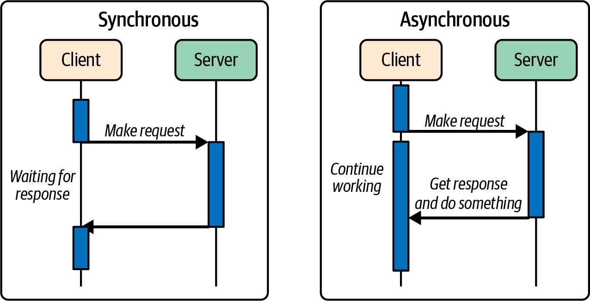


### 프로세스 소개

Rust의 비동기 프로그래밍은 기본적으로 멀티프로세싱을 사용하지 않습니다. 하지만 멀티프로세싱을 통해서도 비동기적 동작을 달성할 수 있습니다. 다만 그러려면 비동기 시스템이 프로세스 내부에서 실행되어야 합니다.

PostgreSQL 데이터베이스를 생각해 봅시다. PostgreSQL은 연결이 맺어질 때마다 프로세스를 하나씩 생성하며, 이 프로세스들은 단일 스레드로 동작합니다. Rust 웹 프레임워크를 살펴본 적이 있다면, Rust 웹 서버의 엔드포인트를 정의하는 함수들이 `async` 함수라는 점을 눈치채셨을 것입니다. 즉, Rust 서버는 연결당 프로세스를 생성하지 않습니다. 대신 Rust 웹 서버는 대개 스레드 풀(thread pool)을 유지하며, 들어오는 HTTP 요청들은 이 스레드 풀에서 실행되는 비동기 태스크가 됩니다. 비동기 태스크가 스레드 풀과 상호작용하는 방식은 3장에서 다룹니다. 지금은 프로세스가 비동기 프로그래밍에서 어디에 위치하는지에 집중해 보겠습니다.

프로세스는 운영체제가 제공하고 CPU에 의해 실행되는 추상화입니다. 프로세스는 프로그램이나 애플리케이션에 의해 실행될 수 있습니다. 프로그램의 명령어들이 메모리에 로드되면, CPU는 작업을 수행하기 위해 이 명령어들을 차례로 실행합니다. 프로세스는 (키보드를 통한 사용자 입력이나 다른 프로세스로부터의 데이터와 같은) 외부 입력을 받아 출력을 생성할 수 있으며, 이는 그림 1-2와 같습니다.

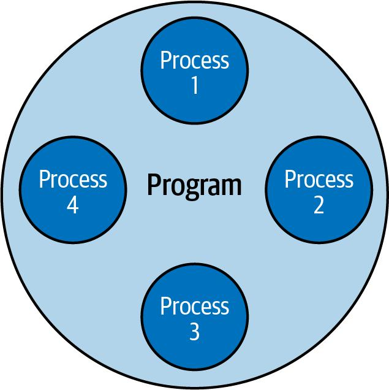


프로세스는 각 프로세스가 자신만의 독립된 메모리 공간을 갖는다는 점에서 스레드와 다릅니다. 이는 데이터가 손상되거나 다른 프로세스로 흘러 들어가는 것을 방지하므로 CPU 관리에서 필수적인 부분입니다.

프로세스는 프로세스 ID(PID)라는 고유 ID를 가지며, 컴퓨터 운영체제에 의해 모니터링되고 제어될 수 있습니다. 멈추거나 오작동하는 프로그램을 종료하기 위해 `kill PID` 명령을 사용해 본 프로그래머도 많을 것입니다. PID가 정확히 무엇을 뜻하는지 모른 채 사용한 경우도 적지 않을 것입니다. PID는 OS가 프로세스에 할당하는 고유 식별자입니다. 이를 통해 OS는 메모리 사용량 및 CPU 시간과 같이 프로세스와 관련된 모든 자원을 추적할 수 있습니다.

PostgreSQL 이야기로 돌아가 보면, 연결당 프로세스를 생성하는 방식에는 역사적 이유가 있지만, 이 접근 방식에는 몇 가지 장점도 있습니다. 연결마다 프로세스를 생성하면 연결별로 진정한 결함 격리(fault isolation)와 메모리 보호가 이루어집니다. 즉, 한 연결이 다른 연결의 메모리에 접근하거나 이를 오염시킬 가능성이 전혀 없습니다. 또한 연결당 프로세스를 생성하면 공유 상태가 없으므로 더 단순한 동시성 모델이 됩니다.

반면 공유 상태는 복잡성을 유발할 수 있습니다. 예를 들어 각각 개별 연결을 나타내는 두 개의 비동기 태스크가 공유 메모리의 데이터에 의존한다면 락(lock)과 같은 동기화 원어가 필요합니다. 이러한 동기화 원어는 교착 상태(deadlock)와 같은 복잡성을 초래할 위험이 있으며, 결국 해당 락에 의존하는 모든 연결을 멈춰 서게 만들 수 있습니다. 이러한 문제는 디버깅하기 어렵습니다(교착 상태 테스트와 같은 개념은 11장에서 다룹니다).

프로세스의 단순한 동시성 모델은 동기화 복잡성의 위험을 줄여주지만, 위험이 완전히 사라지는 것은 아닙니다. 상태 격리와 무관하게 파일 락과 같은 외부 락을 획득하는 과정에서 여전히 문제가 발생할 수 있습니다. 또한 프로세스의 상태 격리는 메모리 버그로부터 보호해 줄 수 있습니다. 예를 들어 C나 C++ 같은 언어에서는 메모리를 해제하지 않는 코드로 인해 컴퓨터의 메모리가 고갈될 때까지 메모리 사용량이 계속 증가할 수 있습니다(메모리 누수는 6장에서 다룹니다). 특정 함수의 메모리 누수가 프로그램 전체의 메모리를 고갈시킬 수도 있습니다. 하지만 프로세스를 사용하면 메모리 제한을 걸어 실행할 수 있으므로 문제가 있는 프로세스를 격리할 수 있습니다.

Rust에서 프로세스가 비동기 프로그래밍과 어떤 관계를 갖는지 설명하기 위해, 앞서 작성한 4개의 HTTP 요청의 비동기 동작을 다음과 같은 디렉터리 구조로 재구성해 볼 수 있습니다.

```text
├── connection
│   ├── Cargo.toml
│   └── src
│       └── main.rs
├── scripts
│   ├── prep.sh
│   └── run.sh
└── server
    ├── Cargo.toml
    └── src
        └── main.rs
```

여기서 서버 패키지를 `server_bin`, 커넥션 패키지를 `connection_bin`이라고 부릅니다. `connection` 바이너리는 이전 절과 동일한 Tokio 및 reqwest 의존성을 갖습니다. `connection/src/main.rs` 파일에서는 단순히 요청을 보내고 그 결과를 출력합니다.

```rust
use reqwest::Error;

#[tokio::main]
async fn main() -> Result<(), Error> {
    let url = "https://jsonplaceholder.typicode.com/posts/1";
    let response = reqwest::get(url).await?;
    if response.status().is_success() {
        let body = response.text().await?;
        println!("{}", body);
    } else {
        println!(
            "Failed to get a valid response. Status: {}",
            response.status()
        );
    }
    Ok(())
}
```

서버의 경우 바이너리를 실행할 때마다 HTTP 요청을 수행하는 프로세스를 생성하도록 다음과 같이 `server/src/main.rs`를 작성합니다.

```rust
use std::process::{Command, Output};

fn main() {
    let output: Output = Command::new("./connection_bin")
        .output()
        .expect("Failed to execute command");

    if output.status.success() {
        let stdout = String::from_utf8_lossy(&output.stdout);
        println!("Output: {}", stdout);
    } else {
        let stderr = String::from_utf8_lossy(&output.stderr);
        eprintln!("Error: {}", stderr);
    }
}
```

여기서 명령어가 `connection` 바이너리를 실행하고 있음을 알 수 있습니다. 또한 프로세스의 출력을 처리할 수 있음을 볼 수 있습니다. 프로세스가 0으로 종료되면 에러 없이 종료된 것이며, 1로 종료되면 에러가 발생한 것입니다. 결과가 어떻든 출력을 직렬화하여 출력합니다. 이제 다음과 같은 코드로 `scripts/prep.sh` 파일을 작성해야 합니다.

```bash
#!/usr/bin/env bash
SCRIPTPATH="$( cd "$(dirname "$0")" ; pwd -P )"
cd $SCRIPTPATH
cd ..
cd connection && cargo build --release && cd ..
cd server && cargo build --release && cd ..
cp connection/target/release/connection_bin ./
cp server/target/release/server_bin ./
```

여기서는 바이너리를 컴파일하고 루트 디렉터리로 복사합니다. 이제 4개의 연결을 동시에 실행하도록 `scripts/run.sh`를 작성해야 합니다. 먼저 다음과 같이 루트 디렉터리로 이동합니다.

```bash
#!/usr/bin/env bash
SCRIPTPATH="$( cd "$(dirname "$0")" ; pwd -P )"
cd $SCRIPTPATH
cd ..
```

그런 다음 백그라운드에서 4개의 프로세스를 모두 실행하고 각각의 PID를 가져옵니다.

```bash
./server_bin &
pid1=$!
./server_bin &
pid2=$!
./server_bin &
pid3=$!
./server_bin &
pid4=$!
```

이어서 결과를 기다린 후 종료 코드를 출력합니다.

```bash
wait $pid1
exit_code1=$?
wait $pid2
exit_code2=$?
wait $pid3
exit_code3=$?
wait $pid4
exit_code4=$?

echo "Task 1 (PID $pid1) exited with code $exit_code1"
echo "Task 2 (PID $pid2) exited with code $exit_code2"
echo "Task 3 (PID $pid3) exited with code $exit_code3"
echo "Task 4 (PID $pid4) exited with code $exit_code4"
```

`prep` 스크립트를 실행한 후 `time sh scripts/run.sh` 명령으로 `run` 스크립트의 실행 시간을 측정해 보면 123ms가 나왔는데, 이는 비동기 예제보다 약간 더 빠른 수치입니다. 이는 프로세스를 대기하는 방식만으로도 비동기적 동작을 구현할 수 있음을 보여줍니다. 하지만 이것이 프로세스가 더 우수하다는 증거는 아닙니다. 프로세스는 자원을 훨씬 많이 소모하므로 더 많은 자원을 사용하게 됩니다. 일반적인 비동기 프로그램은 여러 스레드를 가진 하나의 프로세스로 동작합니다. 이 경우 공유 메모리로 인해 CPU의 비동기 작업 스케줄링에서 약간의 경합이 발생할 수 있습니다. 반면 프로세스는 격리되어 있기 때문에 CPU가 스케줄링하기에 단순합니다.

모든 것을 프로세스로 바꾸기 전에 몇 가지 단점을 고려해야 합니다. 운영체제에서 생성할 수 있는 스레드 수에는 한계가 있을 수 있으며, 프로세스를 생성하는 것은 비용이 훨씬 많이 들고 확장성도 떨어집니다. 코어를 모두 사용하기 시작하면 추가로 생성된 프로세스는 블로킹되기 시작할 것입니다. 또한 수많은 구성 요소 사이의 상호작용도 고려해야 합니다. 프로세스 간 통신(IPC)은 직렬화가 필요하기 때문에 비용이 많이 들 수 있습니다. 흥미로운 점은 우리가 작성한 프로세스 내부에도 비동기 코드가 포함되어 있었다는 사실이며, 이는 프로세스의 위치를 잘 보여주는 예시입니다. PostgreSQL에서 연결은 프로세스이지만, 그 프로세스 내부에는 명령을 실행하고 데이터 스토리지에 접근하는 비동기 코드가 포함되어 있습니다.

구성 요소의 복잡성을 줄이기 위해 Tokio의 비동기 태스크를 사용하여 우리가 실행하는 프로세스들을 가리키도록 할 수 있습니다.

```rust
let mut handles = vec![];
for _ in 0..4 {
    let handle = tokio::spawn(async {
        let output = Command::new("./connection_bin")
            .output()
            .await;
        match output {
            Ok(output) => {
                println!(
                    "Process completed with output: {}",
                    String::from_utf8_lossy(&output.stdout)
                );
                Ok(output.status.code().unwrap_or(-1))
            }
            Err(e) => {
                eprintln!("Failed to run process: {}", e);
                Err(e)
            }
        }
    });
    handles.push(handle);
}
```

그런 다음 프로세스 결과를 처리합니다.

```rust
let mut results = Vec::with_capacity(handles.len());
for handle in handles {
    results.push(handle.await.unwrap());
}
for (i, result) in results.into_iter().enumerate() {
    match result {
        Ok(exit_code) => println!(
            "Process {} exited with code {}",
            i + 1, exit_code
        ),
        Err(e) => eprintln!(
            "Process {} failed: {}",
            i + 1, e
        ),
    }
}
```

이렇게 하면 관리해야 할 부품 수는 줄어들지만, 프로세스와 메인 프로그램 간에 데이터를 직렬화해야 하는 오버헤드와 함께 프로세스 자체의 확장성 문제는 여전히 남습니다. Rust는 메모리 안전성을 보장하고 에러를 값으로 처리할 수 있으므로, 프로세스가 제공하는 격리라는 이점이 상대적으로 덜 부각됩니다. 예를 들어 안전하지 않은 Rust(unsafe Rust) 코드를 의도적으로 작성하지 않는 한, 스레드 중 하나에서 메모리 누수가 발생할 일은 없습니다.

비동기 프로그래밍으로 달성하고자 하는 바를 다시 떠올려 보십시오. 우리는 가볍고 넌블로킹(nonblocking)인 작업을 분기하고 이들이 완료되기를 기다리고자 합니다. 많은 경우 이러한 작업들로부터 데이터를 얻어 사용하고자 할 것입니다. 또한 태스크에 데이터를 담아 비동기 런타임으로 전달하는 기능도 필요합니다. 스레드 간 데이터 공유의 용이성을 고려할 때, 비동기 프로그래밍에는 프로세스보다 스레드가 훨씬 더 나은 선택으로 보입니다. 이제 스레드를 다루어 보겠습니다.

### 스레드란 무엇인가?

실행 스레드(thread of execution)는 CPU가 실행할 수 있는 프로그래밍된 명령어의 최소 시퀀스입니다. 스레드는 스케줄러에 의해 독립적으로 관리될 수 있습니다. 프로세스 내부에서는 여러 스레드 간에 메모리를 공유할 수 있습니다(그림 1-3).

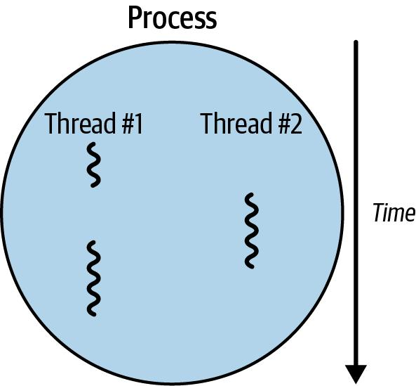


스레드와 비동기 태스크는 둘 다 스케줄러에 의해 관리되지만 서로 다릅니다. 스레드는 서로 다른 CPU 코어에서 동시에 실행될 수 있지만, 비동기 태스크는 일반적으로 CPU를 사용할 차례를 기다립니다. 비동기 태스크에 대해서는 2장에서 훨씬 더 자세히 다룰 것입니다.

스레드를 생성해 보기 위해 앞서 작성했던 피보나치 수열 재귀 함수로 돌아가 4개의 스레드에 피보나치 수 계산을 나누어 보겠습니다. 먼저 다음과 같이 임포트해야 합니다.

```rust
use std::time::Instant;
use std::thread;
```

그런 다음 `main` 함수에서 50번째 피보나치 수를 계산하는 데 걸리는 시간을 측정할 수 있습니다.

```rust
let start = Instant::now();
let _ = fibonacci(50);
let duration = start.elapsed();
println!("fibonacci(50) in {:?}", duration);
```

다음으로 타이머를 리셋하고 4개의 스레드에 걸쳐 50번째 피보나치 수 4개를 계산하는 시간을 측정할 수 있습니다. 4번 반복하여 4개의 스레드를 생성하고 각 `JoinHandle`을 벡터에 추가하여 멀티스레딩을 구현합니다.

```rust
let start = Instant::now();
let mut handles = vec![];
for _ in 0..4 {
    let handle = thread::spawn(|| {
        fibonacci(50)
    });
    handles.push(handle);
}
```

`JoinHandle`을 사용하면 스레드가 완료될 때까지 기다릴 수 있으며, 해당 스레드가 끝날 때까지 프로그램을 일시 중지합니다. 스레드를 조인(join)한다는 것은 스레드가 종료될 때까지 프로그램을 블로킹한다는 뜻입니다. `JoinHandle`은 `Send`와 `Sync` 트레이트를 구현하므로 스레드 간에 전달될 수 있습니다. 하지만 `JoinHandle`은 `Clone` 트레이트를 구현하지 않습니다. 스레드마다 고유한 `JoinHandle`이 필요하기 때문입니다. 하나의 스레드에 여러 개의 `JoinHandle`이 존재할 수 있다면, 여러 스레드가 동시에 실행 중인 스레드를 조인하려고 시도하여 데이터 레이스(data race)가 발생할 위험이 있습니다.

> [!NOTE]
> 다른 프로그래밍 언어를 사용해 보았다면 그린 스레드(green threads)를 접해 보았을 것입니다. 이러한 스레드는 운영체제가 아닌 다른 주체(예: 런타임이나 가상 머신)에 의해 스케줄링됩니다. Rust도 원래 버전 1.0 이전에 그린 스레드를 구현했다가 제거했습니다. 그린 스레드를 제거하고 라이브러리 수준의 그린 스레드를 지원하는 네이티브 스레드로 전환한 주된 이유는 Rust에서 스레드와 I/O 작업이 결합되어 있어, 네이티브 스레드와 그린 스레드가 동일한 API를 유지해야만 했기 때문입니다. 이로 인해 I/O 작업 사용과 메모리 할당 지정에서 다양한 문제가 발생했습니다. 자세한 내용은 그린 스레드에 관한 Rust 문서를 참조하십시오. Rust 자체는 그린 스레드를 구현하지 않지만 Tokio와 같은 런타임이 이를 구현한다는 점에 유의하십시오.

이제 `JoinHandle` 벡터가 준비되었으므로 스레드들이 실행을 마칠 때까지 기다린 후 소요된 시간을 출력할 수 있습니다.

```rust
for handle in handles {
    let _ = handle.join();
}
let duration = start.elapsed();
println!("4 threads fibonacci(50) took {:?}", duration);
```

프로그램을 실행하면 다음과 같은 출력이 나옵니다.

```text
fibonacci(50) in 39.665599542s
4 threads fibonacci(50) took 42.601305333s
```

Rust에서 스레드를 사용하면 여러 CPU 집약적인 작업을 동시에 처리할 수 있음을 알 수 있습니다. 따라서 여러 스레드가 대기 작업도 동시에 처리할 수 있음을 짐작할 수 있습니다. 비록 피보나치 계산 결과를 사용하지는 않았지만, 원한다면 메인 프로그램에서 스레드의 결과를 활용할 수도 있습니다. 이 예제에서 `JoinHandle`의 `join`을 호출할 때 반환되는 타입은 `Result<u64, Box<dyn Any + Send>>`입니다. 여기서 `u64`는 스레드가 계산한 피보나치 수입니다. `Box<dyn Any + Send>`는 다양한 유형의 에러를 유연하게 처리할 수 있도록 지원하는 동적 트레이트 객체(dynamic trait object)입니다. 이러한 에러 타입은 스레드 간에 전달되어야 하지만, 스레드에서 에러가 발생하는 이유는 매우 다양할 수 있습니다. 다만 이 방식은 컴파일 시점에 크기를 알 수 없으므로 동적 다운캐스팅(downcasting)과 박싱(boxing)이 필요하여 약간의 오버헤드가 발생합니다.

스레드는 프로그램 내의 메모리를 통해 서로 직접 상호작용할 수도 있습니다. 이번 장의 마지막 예제에서는 채널을 사용하지만, 지금은 `Arc`, `Mutex`, `Condvar`를 사용하여 그림 1-4에 표시된 시스템을 만들어 보겠습니다.

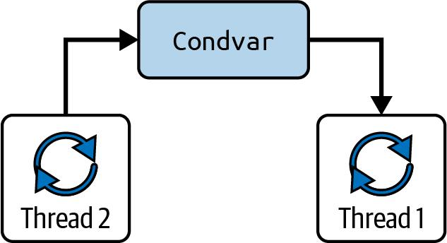


여기서는 두 개의 스레드를 사용합니다. 하나의 스레드는 `Condvar`를 업데이트하고, 다른 스레드는 `Condvar`의 업데이트를 기다리다가 업데이트가 발생하는 순간 파일에 변경 사항이 있음을 출력합니다. 코드를 작성하기 전에 먼저 다음 구조체들을 이해해야 합니다.

- **Arc**: 원자적 참조 카운팅(Atomic Reference Counting)을 의미하며, `Arc`로 감싸진 변수에 대한 참조 횟수를 추적합니다. 예를 들어 `Arc<i32>`를 정의하고 이를 4개의 스레드에서 참조하면 참조 카운트가 4로 증가합니다. `Arc<i32>`는 4개의 스레드가 모두 참조를 마쳐 참조 카운트가 0이 될 때 비로소 해제(drop)됩니다.
- **Mutex**: Rust에서는 특정 시점에 변수에 대한 가변 참조를 오직 하나만 허용한다는 점을 기억하십시오. 뮤텍스(Mutex, 상호 배제/Mutual Exclusion)는 내부에 값을 보관함으로써 내부 가변성(interior mutability)을 제공하는 스마트 포인터 타입입니다. 즉, 여러 스레드에 걸쳐 단일 변수에 대한 가변 접근을 제공할 수 있습니다. 이는 스레드가 락(lock)을 획득하는 방식으로 이루어집니다. 락을 획득하면 `Mutex` 내부의 값에 대한 유일한 가변 참조를 얻게 됩니다. 트랜잭션을 수행한 후 락을 해제하여 다른 스레드가 트랜잭션을 수행할 수 있도록 합니다. 락은 한 번에 하나의 스레드만 가변 참조에 접근할 수 있도록 보장하므로, 한 번에 하나의 가변 참조만 허용한다는 Rust의 규칙이 위반되지 않도록 합니다. 락이 해제될 때까지 대기해야 할 수도 있으므로 락 획득에는 약간의 오버헤드가 따릅니다.
- **Condvar**: 조건 변수(Conditional Variable)의 줄임말로, 스레드가 잠들었다가 `Condvar`를 통해 알림이 전송될 때 깨어날 수 있도록 해줍니다. `Condvar`를 통해 변수를 직접 전송할 수는 없지만, 여러 스레드가 하나의 `Condvar`를 구독할 수 있습니다.

사용할 요소를 살펴보았으므로 먼저 다음과 같이 임포트하여 시스템을 구축해 봅니다.

```rust
use std::sync::{Arc, Condvar, Mutex};
use std::thread;
use std::time::Duration;
use std::sync::atomic::AtomicBool;
use std::sync::atomic::Ordering::Relaxed;
```

그런 다음 `main` 함수 내부에서 두 스레드 간에 공유할 데이터를 정의할 수 있습니다.

```rust
let shared_data = Arc::new((Mutex::new(false), Condvar::new()));
let shared_data_clone = Arc::clone(&shared_data);
let STOP = Arc::new(AtomicBool::new(false));
let STOP_CLONE = Arc::clone(&STOP);
```

여기서는 튜플을 `Arc`로 감쌌습니다. 갱신될 불리언 변수는 `Mutex`로 감싸져 있습니다. 그런 다음 두 스레드가 모두 공유 데이터에 접근할 수 있도록 데이터 패키지를 복제(clone)합니다. `shared_data_clone`은 `background_thread`로 전달되는 반면, 원본 `shared_data`는 메인 스레드에 남아 나중에 `updater_thread`에서 사용됩니다. 클론하지 않으면 `shared_data`의 소유권이 전달된 첫 번째 스레드로 넘어가 메인 스레드는 이에 접근할 수 없게 됩니다.

이제 데이터를 사용할 수 있으므로 첫 번째 스레드를 정의할 수 있습니다.

```rust
let background_thread = thread::spawn(move || {
    let (lock, cvar) = &*shared_data_clone;
    let mut received_value = lock.lock().unwrap();
    while !STOP.load(Relaxed) {
        received_value = cvar.wait(received_value).unwrap();
        println!("Received value: {}", *received_value);
    }
});
```

여기서 `Condvar` 알림을 기다리는 모습을 볼 수 있습니다. 대기하는 시점에서 스레드는 파킹(parked)되었다고 말합니다. 이는 스레드가 블로킹되어 실행되지 않는 상태임을 의미합니다. `Condvar`로부터 알림이 도착하면 스레드는 `Condvar`에 의해 깨어난 뒤 `Mutex` 내부의 변수에 접근합니다. 그런 다음 변수를 출력하고 스레드는 다시 잠듭니다. 루프가 무한히 지속되도록 `AtomicBool`이 `false`인 것에 의존합니다. 이를 통해 필요한 경우 스레드를 중지할 수 있습니다.

> [!NOTE]
> 코드에서 `unwrap`을 많이 사용하고 있습니다. 이는 비동기와 관련된 주요 개념에 집중할 수 있도록 코드를 간결하게 유지하기 위함이지만, 프로덕션 코드에서는 반드시 에러 처리를 해야 한다는 점을 기억하십시오. `unwrap()` 사용이 허용될 수 있는 유일한 경우는 뮤텍스에 락을 걸 때입니다. 패닉이 발생하는 유일한 이유는 이전에 락을 쥐고 있던 스레드가 패닉을 일으킨 경우뿐이며, 이를 락 포이즈닝(lock poisoning)이라고 부릅니다.

다음 스레드에서는 4번의 반복만 실행한 후 스레드를 종료합니다.

```rust
let updater_thread = thread::spawn(move || {
    let (lock, cvar) = &*shared_data;
    let values = [false, true, false, true];
    for i in 0..4 {
        let update_value = values[i as usize];
        println!("Updating value to {}...", update_value);
        *lock.lock().unwrap() = update_value;
        cvar.notify_one();
        thread::sleep(Duration::from_secs(4));
    }
    STOP_CLONE.store(true, Relaxed);
    println!("STOP has been updated");
    cvar.notify_one();
});
updater_thread.join().unwrap();
```

값을 갱신한 다음 값이 바뀌었음을 다른 스레드에 알립니다. 그런 다음 `updater_thread`가 끝날 때까지 메인 프로그램을 블로킹합니다.

여기서 `Relaxed`라는 용어를 사용한 점에 주목하십시오. 데이터 레이스와 엇갈린 불일치를 방지하려면 연산이 특정 순서로 실행되도록 보장하는 것이 중요합니다. 바로 이 지점에서 메모리 순서(memory ordering)가 관여합니다. `AtomicBool`과 함께 사용된 `Relaxed` 순서는 원자적 변수에 대한 연산이 모든 스레드에 보이도록 보장하지만, 주변 연산에 대해 특정 순서를 강제하지는 않습니다. 우리 예제에서는 `STOP`의 값만 확인하면 되고 다른 연산의 엄격한 순서는 상관없으므로 이 정도로 충분합니다.

프로그램을 실행하면 다음과 같은 출력이 나타납니다.

```text
Updating value to false...
Received value: false
Updating value to true...
Received value: true
Updating value to false...
Received value: false
Updating value to true...
Received value: true
```

업데이터 스레드가 공유 데이터의 값을 갱신하고 첫 번째 스레드에 이를 알려 접근하도록 하고 있습니다.

값들이 일관되게 유지되므로 우리가 원하는 결과를 얻었지만, 솔직히 이는 비동기 동작이라고 부르기에는 투박한 구현입니다. 스레드가 멈추고 업데이트를 기다리는 방식이기 때문입니다. `updater_thread`가 순회하며 확인할 수 있도록 여러 개의 `Condvar`를 추가한다면, 하나의 스레드가 여러 작업을 추적하고 변경될 때마다 동작하게 만들 수는 있을 것입니다. 이것이 진정한 비동기 동작인지 아닌지에 대해서는 온라인에서 논쟁이 벌어질 수 있겠지만, 이것이 비동기 프로그래밍을 구현하는 최적의 방법이나 표준적인 방법이 아니라는 점은 분명합니다.

그러나 스레드가 비동기 프로그래밍의 핵심 구성 요소임은 확인할 수 있습니다. 비동기 런타임은 단일 스레드 안에서 여러 비동기 연산이 동시에 실행될 수 있는 방식으로 태스크를 처리합니다. 이 스레드는 보통 메인 스레드와 분리되어 있습니다. 런타임은 태스크를 실행하기 위해 여러 스레드를 둘 수도 있습니다. 다음 절에서는 비동기 코드의 표준 구현을 사용해 보겠습니다.

### 비동기는 어디에 활용할 수 있는가?

지금까지 비동기 프로그래밍을 소개하고 여러 HTTP 요청과 같은 예제를 통해 그 장점을 살펴보았습니다. 이들은 비동기의 강력함을 보여주기 위해 고안된 간단한 예제였습니다. 이 절에서는 비동기의 실무 활용 사례와 다음 프로젝트에 비동기를 도입해야 하는 이유를 제시합니다.

먼저 비동기를 무엇에 활용할 수 있는지 생각해 봅시다. 주된 활용 사례는 실행하거나 수신하는 데 지연이 있거나 지연될 가능성이 있는 작업, 예를 들어 파일 시스템에 대한 I/O 호출이나 네트워크 요청과 같은 작업입니다. 비동기를 사용하면 이러한 작업을 호출하는 프로그램이 블로킹되지 않고 계속 실행될 수 있으므로, 프로그램이 멈추거나 반응성이 떨어지는 문제를 방지할 수 있습니다.

파일 쓰기와 같은 I/O 작업은 일반적으로 하드 드라이브와 같은 외부 장치에 의존하기 때문에 인메모리(in-memory) 작업에 비해 느린 것으로 간주됩니다. 대부분의 하드 드라이브는 여전히 물리적으로 움직여야 하는 기계 부품에 의존하므로 RAM이나 CPU에서의 전자적 연산보다 느립니다. 또한 CPU에서 장치로 데이터를 전송할 수 있는 속도도 USB 연결 등과 같은 이유로 제한될 수 있습니다.

이를 명확히 이해하기 위해 관련된 시간 단위를 비교해 보겠습니다.

- **나노초 (ns)**: 10억 분의 1초(1/1,000,000,000초)입니다. CPU와 메모리 내부의 연산은 대개 나노초 단위로 발생합니다. 예를 들어 RAM의 데이터에 접근하는 데는 약 100ns가 걸릴 수 있습니다.
- **밀리초 (ms)**: 1,000분의 1초(1/1,000초)입니다. 하드 드라이브에 쓰거나 네트워크를 통해 데이터를 전송하는 것과 같은 I/O 작업은 보통 밀리초 단위로 발생합니다. 예를 들어 전통적인 하드 드라이브에 데이터를 쓰는 데는 수 밀리초가 걸릴 수 있습니다.

이러한 차이는 사소해 보일 수 있지만, 컴퓨팅 세계에서는 엄청난 차이입니다. CPU는 파일 하나가 열리는 시간 동안 수백만 번의 연산을 수행할 수 있습니다. 이것이 I/O 작업이 프로그램 성능의 병목이 되는 경우가 많은 이유입니다.

이 책을 쓰는 시점을 기준으로, 비동기 파일 읽기가 비동기 덕분에 실제로 빨라지는 것은 아닙니다. 파일 I/O 작업은 여전히 디스크 성능에 묶여 있으므로, 병목은 CPU가 아니라 디스크의 읽기 및 쓰기 속도에 있기 때문입니다. 하지만 비동기가 해줄 수 있는 것은 파일 I/O가 진행되는 동안에도 프로그램이 이러한 작업에 블로킹되지 않고 계속 실행되도록 보장하는 것입니다.

이제 파일 I/O 프로그램을 통해 비동기를 활용하는 예제를 단계별로 살펴보겠습니다. 파일의 변경 사항을 추적하고 파일에서 변경이 감지되었을 때 특정 작업을 수행해야 한다고 상상해 보십시오.

### 파일 I/O에 비동기 활용하기

파일 변경 사항을 추적하려면 그림 1-5에 묘사된 것처럼 스레드에서 파일의 메타데이터를 주기적으로 확인하는 루프를 돌리고, 파일 메타데이터가 변경되었을 때 메인 스레드의 메인 루프로 피드백을 전달해야 합니다.

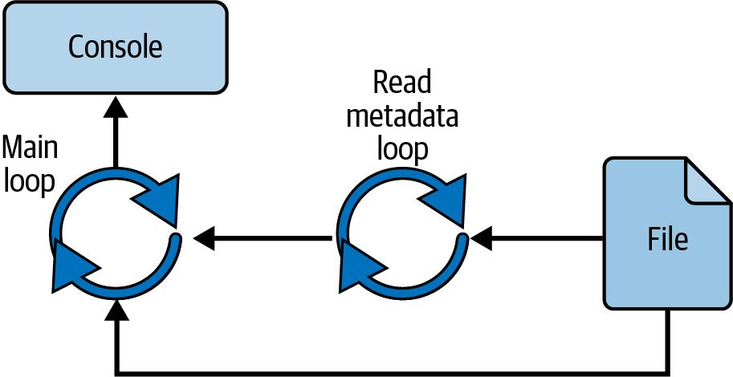


변경이 감지된 후에는 온갖 종류의 작업을 수행할 수 있지만, 이번 실습의 목적을 위해 콘솔에 파일 내용을 출력하도록 하겠습니다. 그림 1-5의 구성 요소를 다루기 전에 먼저 다음과 같은 구조체와 트레이트를 임포트해야 합니다.

```rust
use std::path::PathBuf;
use tokio::fs::File as AsyncFile;
use tokio::io::AsyncReadExt;
use tokio::sync::watch;
use tokio::time::{sleep, Duration};
```

이 구조체와 트레이트들이 어떻게 사용되는지는 진행하면서 살펴보겠습니다. 그림 1-5를 다시 참조하면 파일 작업을 먼저 처리하고 메인 루프를 나중에 다루는 것이 자연스럽습니다. 가장 간단한 작업은 함수를 통해 파일을 읽는 것입니다.

```rust
async fn read_file(filename: &str) -> Result<String, std::io::Error> {
    let mut file = AsyncFile::open(filename).await?;
    let mut contents = String::new();
    file.read_to_string(&mut contents).await?;
    Ok(contents)
}
```

파일을 열고 내용을 문자열로 읽은 뒤 그 문자열을 반환합니다. 그러나 이 책을 쓰는 시점에서 표준 비동기 파일 읽기 구현은 실제로는 비동기가 아니라는 점에 유의하십시오. 대신 블로킹 방식이므로 파일 열기 작업이 진정한 비동기는 아닙니다. 비동기 파일 읽기의 차이는 OS가 지원하는 파일 API에 달려 있습니다. 예를 들어 커널 버전이 5.10 이상인 Linux를 사용하는 경우 파일 API에 대한 진정한 비동기 I/O 호출을 가능하게 해주는 `Tokio-uring` 크레이트를 사용할 수 있습니다. 그러나 지금 단계에서는 우리가 작성한 함수만으로도 필요한 작업을 수행하기에 충분합니다.

이제 파일의 메타데이터를 주기적으로 확인하는 루프로 넘어가겠습니다.

```rust
async fn watch_file_changes(tx: watch::Sender<bool>) {
    let path = PathBuf::from("data.txt");
    let mut last_modified = None;
    loop {
        if let Ok(metadata) = path.metadata() {
            let modified = metadata.modified().unwrap();
            if last_modified != Some(modified) {
                last_modified = Some(modified);
                let _ = tx.send(true);
            }
        }
        sleep(Duration::from_millis(100)).await;
    }
}
```

이 함수는 다음과 같은 단계를 수행하는 비동기 함수임을 알 수 있습니다.

1. 확인하려는 파일의 경로를 가져옵니다.
2. 아직 파일을 확인하지 않았으므로 최종 수정 시간을 `None`으로 설정합니다.
3. 그런 다음 무한 루프를 돕니다.
4. 해당 루프에서 파일이 마지막으로 수정된 시간을 추출합니다.
5. 추출된 타임스탬프가 캐시된 타임스탬프와 다르면 캐시된 타임스탬프를 갱신하고, 함수에 전달된 송신기를 통해 채널로 메시지를 보냅니다. 이 메시지는 파일이 갱신되었음을 메인 루프에 알립니다.
6. `tx.send(...)`의 결과는 무시하는데, 발생할 수 있는 유일한 에러는 수신기가 더 이상 수신하지 않는 경우뿐이기 때문입니다. 이 경우 함수가 더 이상 수행할 작업이 없으므로 결과를 무시해도 안전합니다.
7. 매 반복마다 짧은 시간 동안 잠들어(sleep) 확인 대상 파일에 계속 부하를 주지 않도록 합니다.

> [!NOTE]
> 이 함수를 실행하기 위해 Tokio 스레드를 사용하면 Tokio 런타임은 문맥을 전환하여 동일한 프로세스 내의 다른 스레드를 실행할 수 있습니다. 표준 라이브러리의 `sleep` 함수를 사용하면 스레드가 블로킹됩니다. 표준 라이브러리의 `sleep`은 태스크를 Tokio 실행기(executor)로 전달하지 않기 때문입니다. 실행기에 대해서는 3장에서 다룹니다.

첫 번째 루프가 정의되었으므로 이제 `main`에서 실행되는 루프로 넘어갈 수 있습니다. 이 시점에서 Tokio 스레드와 채널을 생성하는 방법을 알고 있다면 직접 `main` 함수를 작성해 보아도 좋습니다.

직접 `main` 함수를 작성해 보았다면 다음과 유사한 형태일 것입니다.

```rust
#[tokio::main]
async fn main() {
    let (tx, mut rx) = watch::channel(false);
    tokio::spawn(watch_file_changes(tx));
    loop {
        // 파일의 변경을 기다림
        let _ = rx.changed().await;
        // 파일을 읽고 그 내용을 콘솔에 출력함
        if let Ok(contents) = read_file("data.txt").await {
            println!("{}", contents);
        }
    }
}
```

`main` 함수는 다음과 같은 단계를 수행합니다.

1. 마지막으로 설정된 값만 유지하는 단일 생산자-다중 소비자(single-producer, multi-consumer) 채널을 생성합니다. 이 채널은 하나의 생산자가 여러 소비자에게 메시지를 보낼 수 있어 동시적 데이터 분배가 가능합니다.
2. 생성한 Tokio 스레드에서 실행 중인 파일 감시 함수로 해당 채널의 송신자(transmitter)를 전달합니다.
3. 파일 감시 루프가 실행되었으므로 채널의 값이 바뀔 때까지 기다리는 루프에 진입합니다.
4. 채널에서 전달되는 값 자체에는 관심이 없으므로 변수 할당을 밑줄(`_`)로 처리합니다. 메인 루프는 채널 내부의 값에 변경이 생길 때까지 대기합니다.
5. 파일의 메타데이터 변경으로 채널 내부의 값이 바뀌면 루프의 나머지 부분이 실행되어 파일을 읽고 내용을 출력합니다.

이를 실행하기 전에 `Cargo.toml` 옆 프로젝트 루트 경로에 `data.txt` 파일이 필요합니다. 그런 다음 시스템을 실행하고 IDE에서 `data.txt` 파일을 열어 내용을 입력해 보십시오. 파일을 저장하는 순간 콘솔에 파일 내용이 출력될 것입니다!

로컬에서 비동기 프로그래밍을 사용해 보았으므로, 이제 네트워크를 활용한 비동기 프로그래밍 구현으로 돌아가 보겠습니다.

### 비동기를 통한 HTTP 요청 성능 향상

I/O 작업은 파일을 읽고 쓰는 것에 그치지 않고 API에서 정보를 가져오거나, 데이터베이스에서 작업을 실행하거나, 마우스나 키보드로부터 입력을 받는 작업까지 포함합니다. 이들의 공통점은 RAM에서 수행되는 인메모리 연산보다 느리다는 점입니다. 비동기를 사용하면 진행 중인 작업에 블로킹되지 않고 프로그램이 계속 실행될 수 있습니다. 비동기 작업을 기다리는 동안 다른 작업을 실행할 수 있습니다.

다음 예제에서는 사용자가 웹사이트에 로그인한 상황을 가정하고, 해당 사용자의 로그인 이후 경과 시간과 함께 특정 데이터를 표시하고자 합니다. 데이터를 가져오기 위해 지정된 지연 시간을 제공하는 외부 API를 사용할 것입니다. 데이터를 수신하면 이를 처리해야 하므로 `Response` 구조체를 정의하고 `Deserialize` 트레이트를 부여하여 API 데이터를 사용할 수 있는 객체로 역직렬화합니다.

API 호출을 위해 `reqwest` 패키지를 사용합니다. JSON 데이터를 다룰 예정이므로 의존성 설정에 `features = ["json"]`을 지정하여 `reqwest`의 JSON 기능을 활성화합니다. 이렇게 하면 API 요청을 보내고 응답을 처리할 때 JSON 데이터를 편리하게 다룰 수 있습니다.

`Cargo.toml`에 다음 의존성을 추가해야 합니다.

```toml
[dependencies]
tokio = { version = "1", features = ["full"] }
reqwest = { version = "0.11", features = ["json"] }
serde = { version = "1.0", features = ["derive"] }
serde_json = "1.0"
```

다음으로 필요한 라이브러리를 임포트하고 `Response` 구조체를 정의합니다.

```rust
use reqwest::Error;
use serde::Deserialize;
use tokio::time::sleep;
use std::time::Duration;
use std::time::Instant;
use serde_json;

#[derive(Deserialize, Debug)]
struct Response {
    url: String,
    args: serde_json::Value,
}
```

이제 `fetch_data` 함수를 구현합니다. 호출되면 `https://httpbin.org/delay/`로 GET 요청을 전송하며, 이 엔드포인트는 지정된 초가 지난 뒤 응답을 반환합니다. 이번 예제에서는 실제 환경에서 지연을 효과적으로 처리하는 프로그램 설계가 얼마나 중요한지 보여주기 위해 지연 시간을 5초로 설정합니다.

```rust
async fn fetch_data(seconds: u64) -> Result<Response, Error> {
    let request_url = format!("https://httpbin.org/delay/{}", seconds);
    let response = reqwest::get(&request_url).await?;
    let delayed_response: Response = response.json().await?;
    Ok(delayed_response)
}
```

데이터를 가져오는 동안 사용자가 로그인한 이후 경과 시간을 계산하는 함수를 만듭니다. 실제로는 데이터베이스 조회가 필요하겠지만, 데이터베이스 설정에 얽매이지 않고 예제를 단순화하기 위해 1초 동안 슬립하며 조회 소요 시간을 흉내 냅니다.

```rust
async fn calculate_last_login() {
    sleep(Duration::from_secs(1)).await;
    println!("Logged in 2 days ago");
}
```

이제 코드를 하나로 조합합니다.

```rust
#[tokio::main]
async fn main() -> Result<(), Error> {
    let start_time = Instant::now();
    let data = fetch_data(5);
    let time_since = calculate_last_login();
    let (posts, _) = tokio::join!(
        data, time_since
    );
    let duration = start_time.elapsed();
    println!("Fetched {:?}", posts);
    println!("Time taken: {:?}", duration);
    Ok(())
}
```

출력 결과를 살펴보겠습니다.

```text
Logged in 2 days ago
Fetched Ok(Response { url: "https://httpbin.org/delay/5", args: Object {} })
Time taken: 5.494735083s
```

`main` 함수에서는 `calculate_last_login` 함수를 호출하기 전에 `fetch_data` 함수로 API 호출을 시작합니다. 이 API 요청은 응답을 반환하는 데 5초가 걸리도록 설계되었습니다. `fetch_data`는 비동기 함수이므로 넌블로킹 방식으로 실행되어 프로그램이 계속 실행될 수 있습니다. 그 결과 `calculate_last_login`이 먼저 실행되어 터미널에 출력이 먼저 표시됩니다. 5초의 지연이 지난 뒤 `fetch_data`가 완료되어 그 결과가 반환되고 출력됩니다.

처음의 HTTP 요청 예제와 달리, 이는 비동기 프로그래밍이 프로그램의 흐름을 막지 않고 작업의 동시 실행을 가능하게 하여 네트워크 요청이 순서와 무관하게 완료될 수 있음을 보여줍니다. 따라서 필요한 순서대로 각 요청을 `await`하기만 한다면 여러 네트워크 요청에 비동기를 유용하게 활용할 수 있습니다.

### 요약

이번 장에서는 비동기 프로그래밍을 소개하고 스레드 및 프로세스 관점에서 컴퓨터 시스템과 비동기 프로그래밍이 어떻게 연결되는지 살펴보았습니다. 그런 다음 스레드가 비동기 프로그래밍에 유용하게 쓰일 수 있음을 보이기 위해 스레드 및 프로세스와의 기본적인 고수준 상호작용을 다루었습니다. 이어서 다른 요청의 응답을 기다리는 동안 더 많은 요청을 전송함으로써 여러 HTTP 호출의 성능을 높이는 기본적인 고수준 비동기 프로그래밍을 살펴보았습니다. 또한 비동기 원리를 사용하여 파일 변경 사항을 추적해 보았습니다.

이 장을 통해 지속적인 CPU 시간이 필요하지 않은 여러 작업을 동시에 처리하는 데 비동기가 얼마나 강력한 도구인지 이해하셨기를 바랍니다. 비동기 덕분에 단일 스레드로도 여러 작업을 동시에 처리할 수 있습니다. 이제 컴퓨터 시스템이라는 맥락에서 비동기 프로그래밍이 어디에 위치하는지 이해했으므로, 2장에서는 기본적인 비동기 프로그래밍 개념들을 살펴보겠습니다.

# 제2장 비동기 Rust 기초

이번 장에서는 Rust에서 비동기(async)를 사용하는 데 필요한 핵심 구성 요소를 소개하고 태스크(task), 퓨처(future), `async`, `await`의 전반적인 개념을 살펴봅니다. 또한 Rust 비동기 프로그래밍의 잠재력을 온전히 활용하는 데 필수적인 개념인 컨텍스트(context), 핀(pin), 폴링(polling), 클로저(closure)를 다룹니다. 이번 장에 수록된 예제들은 학습 목표를 명확히 보여주기 위해 고른 것으로, 효율성 측면에서 반드시 최적화된 형태는 아닐 수 있습니다. 본 장의 마지막에서는 이러한 모든 개념을 하나로 엮어, 보안이 중요한 프로그램을 위한 비동기 감사 로거(async audit logger)를 직접 구축해 보는 예제를 다룹니다.

이 장을 끝마치고 나면 태스크와 퓨처를 명확히 정의할 수 있게 됩니다. 또한 컨텍스트와 핀을 포함하여 퓨처를 구성하는 기술적 구성 요소들도 깊이 이해하게 될 것입니다.

### 태스크 이해하기

비동기 프로그래밍에서 태스크(task)는 하나의 비동기 연산을 나타냅니다. 태스크 기반 비동기 패턴(Task-based Asynchronous Pattern, TAP)은 비동기 코드에 대한 추상화를 제공합니다. 개발자는 일련의 문장(statement) 형태로 코드를 작성하며, 마치 각 문장이 이전 문장의 완료 후에 실행되는 것처럼 순차적으로 읽을 수 있습니다. 예를 들어 커피 한 잔과 토스트를 준비하는 과정을 생각해 봅시다. 이 작업에는 다음과 같은 단계가 필요합니다.

1. 토스터에 빵 넣기
2. 구워진 빵에 버터 바르기
3. 주전자에 물 끓이기
4. 우유 붓기
5. 인스턴트 커피 넣기
6. 끓인 물 붓기

비동기 프로그래밍을 적용하면 이 과정을 확실히 단축할 수 있습니다. 하지만 먼저 다음과 같이 모든 단계를 커피 만들기(make coffee)와 토스트 만들기(make toast)라는 두 개의 큰 단계로 나누어야 합니다.

1. 커피 만들기
   a. 주전자에 물 끓이기
   b. 우유 붓기
   c. 인스턴트 커피 넣기
   d. 끓인 물 붓기
2. 토스트 만들기
   a. 토스터에 빵 넣기
   b. 구워진 빵에 버터 바르기

비록 우리에게 두 손은 한 쌍뿐이지만, 이 두 단계를 동시에 진행할 수 있습니다. 주전자에 물을 끓이면서 물이 끓는 동안 토스터에 빵을 넣을 수 있습니다. 주전자와 토스터를 기다리는 동안 약간의 대기 시간(dead time)이 생기므로, 효율을 더 높이고 싶다면 다음과 같이 단계를 더욱 세분화할 수도 있습니다. 다만 갓 끓인 물이라고 해서 우유와 커피를 넣기도 전에 먼저 붓게 될 위험은 감수해야 합니다.

1. 커피 머그잔 준비하기
   a. 우유 붓기
   b. 인스턴트 커피 넣기
2. 커피 만들기
   a. 주전자에 물 끓이기
   b. 끓인 물 붓기
3. 토스트 만들기
   a. 토스터에 빵 넣기
   b. 구워진 빵에 버터 바르기

물이 끓고 빵이 구워지는 것을 기다리는 동안 우유를 붓고 커피를 넣으면 대기 시간을 줄일 수 있습니다. 여기서 각 단계가 특정 목표(goal)에만 종속되지 않는다는 점에 주목하십시오. 부엌에 들어설 때 우리는 토스트 만들기와 커피 만들기라는 두 개의 독립된 목표를 떠올립니다. 하지만 이 두 목표를 위해 세 가지 단계를 정의했습니다. 단계(step)란 모든 목표를 달성하기 위해 비동기적으로 동시에 실행할 수 있는 작업 단위입니다.

여기서 우리가 전제하는 가설과 감수할 수 있는 허용 범위 사이에 트레이드오프가 생긴다는 점에 유의해야 합니다. 예를 들어 우유와 커피를 넣기 전에 끓는 물부터 붓는 것은 절대 용납되지 않을 수 있습니다. 주전자가 끓는 데 아무런 지연이 없다면 이러한 위험이 현실이 됩니다. 하지만 우리는 물이 끓는 데 어느 정도 시간이 걸리리라는 안전한 가정을 할 수 있습니다.

이제 단계(step)가 무엇인지 이해했으므로, 단계의 개념과 이것이 태스크와 어떻게 연결되는지에 집중할 수 있도록 Tokio와 같은 고수준 크레이트를 사용해 예제로 돌아가 보겠습니다. 걱정하지 마십시오. 이후 장에서 더 저수준 개념을 파고들 때는 다른 크레이트들도 사용할 것입니다. 먼저 다음 항목들을 임포트해야 합니다.

```rust
use std::time::Duration;
use tokio::time::sleep;
use std::thread;
use std::time::Instant;
```

주전자의 물 끓이기나 토스터의 빵 굽기처럼 기다릴 수 있는 단계에는 Tokio의 `sleep`을 사용합니다. Tokio의 `sleep` 함수는 논블로킹(nonblocking)이므로 물이 끓거나 빵이 구워지는 동안 다른 단계로 넘어갈 수 있습니다. 반면 우유나 물을 붓거나 토스트에 버터를 바르는 동안에는 다른 작업을 할 수 없으므로, 두 손을 모두 사용하는 단계를 흉내 내기 위해 `thread::sleep`을 사용합니다. 일반적으로 프로그래밍에서 이러한 단계는 CPU 집약적인(CPU intensive) 작업에 해당합니다. 이제 머그잔을 준비하는 단계를 다음과 같이 정의할 수 있습니다.

```rust
async fn prep_coffee_mug() {
    println!("Pouring milk...");
    thread::sleep(Duration::from_secs(3));
    println!("Milk poured.");
    println!("Putting instant coffee...");
    thread::sleep(Duration::from_secs(3));
    println!("Instant coffee put.");
}
```

이어서 "커피 만들기" 단계를 정의합니다.

```rust
async fn make_coffee() {
    println!("boiling kettle...");
    sleep(Duration::from_secs(10)).await;
    println!("kettle boiled.");
    println!("pouring boiled water...");
    thread::sleep(Duration::from_secs(3));
    println!("boiled water poured.");
}
```

그리고 마지막 단계를 정의합니다.

```rust
async fn make_toast() {
    println!("putting bread in toaster...");
    sleep(Duration::from_secs(10)).await;
    println!("bread toasted.");
    println!("buttering toasted bread...");
    thread::sleep(Duration::from_secs(5));
    println!("toasted bread buttered.");
}
```

집약적이지 않고 대기할 수 있는 단계를 나타내는 Tokio의 `sleep` 함수에 `await`가 사용된 점에 주목하십시오. 결과가 준비될 때까지 해당 단계의 실행을 일시 중단(suspend)하기 위해 `await` 키워드를 사용합니다. `await`를 만나면 비동기 런타임은 다른 비동기 태스크로 전환할 수 있습니다.

`async`와 `await` 구문에 대한 자세한 내용은 Rust RFC 북 웹사이트에서 확인할 수 있습니다.

모든 단계가 정의되었으므로 다음 코드를 통해 이들을 비동기적으로 실행할 수 있습니다.

```rust
#[tokio::main]
async fn main() {
    let start_time = Instant::now();
    let coffee_mug_step = prep_coffee_mug();
    let coffee_step = make_coffee();
    let toast_step = make_toast();
    tokio::join!(coffee_mug_step, coffee_step, toast_step);
    let elapsed_time = start_time.elapsed();
    println!("It took: {} seconds", elapsed_time.as_secs());
}
```

여기서는 퓨처(future)라고 부르는 단계들을 정의했습니다. 퓨처는 다음 절에서 자세히 다룰 것입니다. 지금은 퓨처를 아직 완료되었을 수도 있고 아닐 수도 있는 무언가를 나타내는 플레이스홀더(placeholder)로 생각하십시오. 그런 다음 단계들이 완료되기를 기다린 뒤 소요된 시간을 출력합니다. 프로그램을 실행하면 다음과 같은 결과가 출력됩니다.

```text
Pouring milk...
Milk poured.
Putting instant coffee...
Instant coffee put.
boiling kettle...
putting bread in toaster...
kettle boiled.
pouring boiled water...
boiled water poured.
bread toasted.
buttering toasted bread...
toasted bread buttered.
It took: 24 seconds
```

이 출력 결과는 다소 길지만 중요한 의미를 담고 있습니다. 실행 순서가 어색해 보입니다. 진정으로 효율적이고자 했다면 우유를 붓고 커피를 넣는 일부터 시작하지 않았을 것입니다. 대신 주전자에 물을 올리고 토스터에 빵을 넣은 다음, 우유를 부으러 갔을 것입니다. 머그잔 준비 단계가 `tokio::join!` 매크로에 첫 번째로 전달되었음을 알 수 있습니다. 프로그램을 몇 번이고 다시 실행하더라도 머그잔 준비가 항상 가장 먼저 실행되는 퓨처가 됩니다. 이제 머그잔 준비 함수로 돌아가 나머지 처리 전에 논블로킹 `sleep` 함수를 하나 추가해 보겠습니다.

```rust
async fn prep_coffee_mug() {
    sleep(Duration::from_millis(100)).await;
    // . . .
}
```

이렇게 하면 다음과 같은 출력을 얻게 됩니다.

```text
boiling kettle...
putting bread in toaster...
Pouring milk...
Milk poured.
Putting instant coffee...
Instant coffee put.
bread toasted.
buttering toasted bread...
toasted bread buttered.
kettle boiled.
pouring boiled water...
boiled water poured.
It took: 18 seconds
```

이제 순서가 합리적입니다. 물을 끓이고 토스터에 빵을 넣은 다음 우유를 붓고 있으며, 그 결과 6초를 절약했습니다. 하지만 그 인과관계는 직관에 반하는 것처럼 느껴집니다. `sleep` 함수를 하나 더 추가했는데도 전체 소요 시간은 줄어들었습니다. 추가된 `sleep` 덕분에 비동기 런타임이 다른 태스크로 컨텍스트를 전환하여 해당 태스크의 `await` 줄이 실행될 때까지 작업을 진행할 수 있었기 때문입니다. 다른 퓨처들의 실행을 촉발하기 위해 퓨처 내에 인위적인 지연을 삽입하는 기법을 비공식적으로 협력적 멀티태스킹(cooperative multitasking)이라고 부릅니다.

퓨처들을 `tokio::join!` 매크로에 전달하면 모든 비동기 표현식이 동일한 태스크 내에서 동시적으로(concurrently) 평가됩니다. `join!` 매크로는 새 태스크를 생성하지 않으며, 단지 태스크 내에서 여러 퓨처가 동시적으로 실행될 수 있도록 할 뿐입니다. 예를 들어 다음과 같은 코드로 태스크를 스폰(spawn)할 수 있습니다.

```rust
let person_one = tokio::task::spawn(async {
    prep_coffee_mug().await;
    make_coffee().await;
    make_toast().await;
});
```

태스크 안의 각 퓨처는 해당 퓨처가 끝날 때까지 그 태스크의 추가 실행을 막습니다. 이제 런타임이 하나의 워커 스레드만 갖도록 다음 어노테이션을 사용한다고 가정해 봅시다.

```rust
#[tokio::main(flavor = "multi_thread", worker_threads = 1)]
```

각각 한 사람을 나타내는 두 개의 태스크를 생성하면 실행 시간은 36초가 됩니다.

```rust
let person_one = tokio::task::spawn(async {
    let coffee_mug_step = prep_coffee_mug();
    let coffee_step = make_coffee();
    let toast_step = make_toast();
    tokio::join!(coffee_mug_step, coffee_step, toast_step);
}).await;
let person_two = tokio::task::spawn(async {
    let coffee_mug_step = prep_coffee_mug();
    let coffee_step = make_coffee();
    let toast_step = make_toast();
    tokio::join!(coffee_mug_step, coffee_step, toast_step);
}).await;
```

블로킹 방식으로 퓨처들을 기다리는 대신 다음과 같이 `join`을 사용하여 태스크들을 재정의할 수 있습니다.

```rust
let person_one = tokio::task::spawn(async {
    let coffee_mug_step = prep_coffee_mug();
    let coffee_step = make_coffee();
    let toast_step = make_toast();
    tokio::join!(coffee_mug_step, coffee_step, toast_step);
});
let person_two = tokio::task::spawn(async {
    let coffee_mug_step = prep_coffee_mug();
    let coffee_step = make_coffee();
    let toast_step = make_toast();
    tokio::join!(coffee_mug_step, coffee_step, toast_step);
});
let _ = tokio::join!(person_one, person_two);
```

사람을 나타내는 두 태스크를 조인하면 실행 시간은 28초가 됩니다. 세 태스크를 조인하면 실행 시간은 42초가 됩니다. 각 태스크의 총 블로킹 시간이 14초임을 감안하면 시간 증가는 합리적입니다. 시간이 이렇게 선형으로 늘어나는 양상을 보면, 세 태스크가 비동기 런타임으로 전달되어 큐에 들어가더라도 실행기(executor)는 `await`를 만날 때 해당 태스크를 유휴(idle) 상태로 두고 큐의 다음 태스크를 처리하면서 유휴 태스크들을 폴링한다는 점을 짐작할 수 있습니다.

비동기 런타임은 여러 워커와 큐를 가질 수 있으며, 3장에서는 우리만의 런타임을 직접 작성해 볼 것입니다. 이번 절에서 다룬 내용을 고려하여 태스크를 다음과 같이 정의할 수 있습니다.

> **태스크(Task)란** 실행기(executor)에 의해 완료될 때까지 관리되고 구동되는 비동기 연산 또는 계산 단위입니다. 태스크는 퓨처의 실행을 나타내며, 여러 퓨처가 합성되거나 체이닝된 형태를 포함할 수 있습니다.

이제 퓨처가 무엇인지 살펴보겠습니다.

### 퓨처

비동기 프로그래밍의 핵심 기능 중 하나는 퓨처(future)라는 개념입니다. 앞서 언급했듯이 퓨처는 아직 완료되지 않은 비동기 연산의 결과를 나타내는 플레이스홀더 객체입니다. 퓨처를 사용하면 백그라운드에서 태스크가 실행되는 동안 태스크를 시작하고 다른 작업을 계속 진행할 수 있습니다. 퓨처의 작동 방식을 제대로 이해하기 위해 그 라이프사이클을 살펴보겠습니다.

퓨처가 처음 생성되면 유휴(idle) 상태입니다. 아직 실행되지 않은 상태입니다. 퓨처가 실행되면 값을 산출하거나, 완료(resolve)되거나, 혹은 결과가 나오기를 기다리는 대기 상태(pending)이므로 휴면 상태로 들어갈 수 있습니다. 퓨처가 다시 폴링(poll)될 때 폴링 결과는 `Pending` 또는 `Ready` 중 하나가 될 수 있습니다. 퓨처는 완료되거나 취소될 때까지 계속 폴링됩니다.

퓨처의 작동 방식을 설명하기 위해 기본적인 카운터 퓨처를 만들어 보겠습니다. 이 퓨처는 5까지 숫자를 센 후 완료(`Ready`) 상태가 됩니다. 먼저 다음 항목들을 임포트해야 합니다.

```rust
use std::future::Future;
use std::pin::Pin;
use std::task::{Context, Poll};
use std::time::Duration;
use tokio::task::JoinHandle;
```

이 코드의 대부분은 이해하실 수 있을 것입니다. `Context`와 `Pin`은 기본 퓨처를 만든 뒤에 다루겠습니다. 카운터 역할을 하는 퓨처이므로 구조체는 다음과 같은 형태입니다.

```rust
struct CounterFuture {
    count: u32,
}
```

그런 다음 `Future` 트레이트를 구현합니다.

```rust
impl Future for CounterFuture {
    type Output = u32;

    fn poll(mut self: Pin<&mut Self>, cx: &mut Context<'_>) -> Poll<Self::Output> {
        self.count += 1;
        println!("polling with result: {}", self.count);
        std::thread::sleep(Duration::from_secs(1));
        if self.count < 5 {
            cx.waker().wake_by_ref();
            Poll::Pending
        } else {
            Poll::Ready(self.count)
        }
    }
}
```

지금은 `Pin`이나 `Context`에 너무 신경 쓰지 말고 `poll` 함수 전체에 집중해 봅시다. 퓨처가 폴링될 때마다 카운트가 1씩 증가합니다. 카운트가 5에 이르면 퓨처가 준비(`Ready`)되었다고 선언합니다. `std::thread::sleep` 함수는 코드를 실행할 때 흐름을 쉽게 따라갈 수 있도록 소요 시간을 인위적으로 늘리기 위해 넣은 것뿐입니다. 이 퓨처를 실행하려면 단순히 다음 코드만 작성하면 됩니다.

```rust
#[tokio::main]
async fn main() {
    let counter_one = CounterFuture { count: 0 };
    let counter_two = CounterFuture { count: 0 };
    let handle_one: JoinHandle<u32> = tokio::task::spawn(async move {
        counter_one.await
    });
    let handle_two: JoinHandle<u32> = tokio::task::spawn(async move {
        counter_two.await
    });
    tokio::join!(handle_one, handle_two);
}
```

서로 다른 두 태스크에서 퓨처를 실행하면 다음과 같은 출력이 나타납니다.

```text
polling with result: 1
polling with result: 1
polling with result: 2
polling with result: 2
polling with result: 3
polling with result: 3
polling with result: 4
polling with result: 4
polling with result: 5
polling with result: 5
```

하나의 퓨처가 큐에서 꺼내져 폴링된 뒤 유휴 상태가 되는 동안, 태스크 큐에서 다른 퓨처가 꺼내져 폴링되었습니다. 이 퓨처들은 번갈아 가며 폴링되었습니다. 여기서 `poll` 함수가 `async` 함수가 아니라는 점에 주목하셨을 것입니다. `poll` 함수가 비동기라면 폴링 중인 퓨처를 해결하기 위해 또 다른 퓨처를 보내 폴링해야 하므로 순환 의존성(circular dependency)이 생기기 때문입니다. 이를 통해 퓨처가 비동기 연산의 기반임을 알 수 있습니다.

`poll` 함수는 자기 자신의 가변 참조자를 받습니다. 하지만 이 가변 참조자는 `Pin`으로 감싸져 있으며, 이에 대해 논의해 볼 필요가 있습니다.

### 퓨처에서의 고정

Rust에서 컴파일러는 메모리 내에서 값을 자주 이동(move)시킵니다. 예를 들어 변수를 함수 내부로 이동시키면 메모리 위치가 바뀔 수 있습니다. 메모리 주소가 변경되는 원인은 단순한 값의 이동뿐만이 아닙니다. 컬렉션 역시 메모리 주소를 변경할 수 있습니다. 예를 들어 벡터가 용량 한계에 도달하면 메모리 재할당이 발생하여 메모리 주소가 바뀝니다.

숫자, 문자열, 불리언, 구조체, 열거형과 같은 대부분의 일반적인 기본 타입은 `Unpin` 트레이트를 구현하고 있어 메모리 안에서 자유롭게 이동할 수 있습니다. 특정 데이터 타입이 `Unpin` 트레이트를 구현하는지 확실하지 않다면 `cargo doc` 명령을 실행하여 해당 타입이 구현하는 트레이트들을 확인해 볼 수 있습니다. 예를 들어 그림 2-1은 표준 라이브러리 문서에서 `i32` 타입의 자동 트레이트(auto-trait) 구현을 보여줍니다.

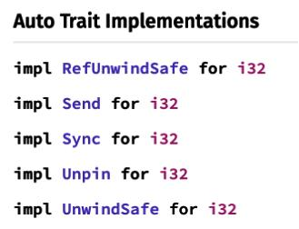


그렇다면 우리는 왜 고정(pinning)과 고정 해제(unpinning)에 신경 써야 할까요? 태스크를 스폰할 때 코드에서 `async move`를 사용하는 데서 알 수 있듯이 퓨처는 메모리에서 이동됩니다. 하지만 이동은 위험할 수 있습니다. 이를 보여주기 위해 자기 자신을 참조하는 자기 참조 구조체(self-referential struct)를 기본 형태로 만들어 볼 수 있습니다.

```rust
use std::ptr;

struct SelfReferential {
    data: String,
    self_pointer: *const String,
}
```

여기서 `*const String`은 문자열에 대한 원시 포인터(raw pointer)입니다. 이 포인터는 데이터의 메모리 주소를 직접 참조합니다. 원시 포인터는 어떠한 안전성도 보장하지 않습니다. 따라서 가리키고 있는 데이터가 이동하더라도 포인터의 참조는 갱신되지 않습니다. 우리는 고정(pinning)이 왜 필요한지 보여주기 위해 원시 포인터를 사용하고 있습니다. 이 시연을 위해 다음과 같이 구조체의 생성자와 포인터 출력 함수를 정의합니다.

```rust
impl SelfReferential {
    fn new(data: String) -> SelfReferential {
        let mut sr = SelfReferential {
            data,
            self_pointer: ptr::null(),
        };
        sr.self_pointer = &sr.data as *const String;
        sr
    }

    fn print(&self) {
        unsafe {
            println!("{}", *self.self_pointer);
        }
    }
}
```

그런 다음 `SelfReferential` 구조체의 인스턴스를 두 개 생성하고 메모리에서 이들을 이동시킨 뒤, 원시 포인터가 가리키는 데이터를 출력하여 구조체 이동의 위험성을 확인해 봅니다.

```rust
fn main() {
    let first = SelfReferential::new("first".to_string());
    let moved_first = first; // 구조체를 이동시킵니다
    moved_first.print();
}
```

이 코드를 실행하려고 하면 세그멘테이션 오류(segmentation fault)와 같은 에러가 발생할 가능성이 높습니다. 세그멘테이션 오류는 프로그램에 속하지 않은 메모리에 접근할 때 발생하는 오류입니다. 자기 자신에 대한 참조를 가진 구조체를 이동하는 것이 얼마나 위험할 수 있는지 확인할 수 있습니다. 고정(pinning)은 퓨처가 고정된 메모리 주소에 머물도록 보장합니다. 퓨처는 일시 중단되거나 재개될 수 있으며, 이 과정에서 메모리 주소가 바뀔 수 있기 때문에 고정은 매우 중요합니다.

지금까지 정의한 기본 퓨처의 거의 모든 구성 요소를 살펴보았습니다. 유일하게 남은 구성 요소는 컨텍스트(context)입니다.

### 퓨처에서의 컨텍스트

`Context`는 태스크를 깨우기 위한 웨이커(waker)에 접근하는 용도로만 사용됩니다. 웨이커는 태스크가 실행될 준비가 되었을 때 실행기(executor)에게 이를 알려주는 핸들입니다.

현재로서는 이것이 `Context`의 주된 역할이지만, 향후 이 기능이 확장될 수 있다는 점에 유의해야 합니다. `Context`의 설계는 Rust의 비동기 생태계가 성장함에 따라 추가적인 책임이나 기능을 도입할 수 있도록 확장성을 염두에 두고 만들어졌습니다.

퓨처를 깨우는 경로에 집중할 수 있도록 `poll` 함수의 핵심 부분만 추려낸 형태를 살펴보겠습니다.

```rust
fn poll(mut self: Pin<&mut Self>, cx: &mut Context<'_>) -> Poll<Self::Output> {
    // . . .
    if self.count < 5 {
        cx.waker().wake_by_ref();
        Poll::Pending
    } else {
        Poll::Ready(self.count)
    }
}
```

웨이커는 컨텍스트로 감싸져 있으며, 폴링 결과가 `Pending`이 될 때만 사용됩니다. 웨이커는 본질적으로 퓨처가 실행될 수 있도록 깨우는 역할을 합니다. 퓨처가 완료되면 더 이상 실행할 필요가 없습니다. 만약 웨이커 호출을 제거하고 프로그램을 다시 실행한다면 다음과 같은 출력만 남게 될 것입니다.

```text
polling with result: 1
polling with result: 1
```

프로그램은 끝나지 않고 멈춰버립니다(hang). 태스크가 여전히 유휴 상태이지만, 다시 폴링되어 끝까지 실행되도록 깨워줄 방법이 없기 때문입니다. 퓨처에는 다시 폴링되어야 할 시점에 호출될 `Waker::wake()` 함수가 필요합니다. 이 과정은 다음 단계로 진행됩니다.

1. 퓨처의 `poll` 함수가 호출되고, 퓨처가 값을 반환하기 전에 비동기 연산의 완료를 기다려야 한다는 결과(`Pending`)가 나옵니다.
2. 퓨처는 웨이커를 참조하는 메서드를 호출하여 연산 완료 시 통지를 받겠다는 관심을 등록합니다.
3. 실행기는 퓨처의 연산에 대한 관심 등록을 인지하고 큐에 웨이커를 저장합니다.
4. 나중에 연산이 끝나면 실행기가 이를 통지받습니다. 실행기는 큐에서 웨이커들을 꺼내 각각에 대해 `wake_by_ref`를 호출하여 퓨처들을 깨웁니다.
5. `wake_by_ref` 함수는 실행 스케줄에 등록되어야 할 관련 태스크에 신호를 보냅니다. 구체적인 방식은 런타임마다 다를 수 있습니다.
6. 퓨처가 실행될 때 실행기는 퓨처의 `poll` 메서드를 다시 호출하며, 퓨처는 연산이 끝났는지 확인하여 끝났으면 값을 반환합니다.

퓨처가 `async`/`await` 함수와 함께 사용되는 것을 보았지만, 다른 방식으로 어떻게 활용될 수 있는지 생각해 봅시다. 실행 스레드에 타임아웃(timeout)을 적용할 수도 있습니다. 특정 시간이 경과하면 스레드가 종료되도록 하여 프로그램이 무한정 멈추는 상황을 방지할 수 있습니다. 이는 완료하는 데 오랜 시간이 걸릴 수 있는 함수가 있을 때 일찍 넘어가거나 에러를 발생시키고자 할 때 유용합니다. 스레드가 태스크를 실행하는 기본 기능을 제공한다는 점을 기억하십시오. `tokio::time`에서 `timeout`을 임포트하고 느린 태스크를 설정합니다. 여기서는 효과를 분명히 보기 위해 10초 동안 대기하도록 설정했습니다.

```rust
use std::time::Duration;
use tokio::time::timeout;

async fn slow_task() -> &'static str {
    tokio::time::sleep(Duration::from_secs(10)).await;
    "Slow Task Completed"
}
```

이제 타임아웃을 설정합니다. 여기서는 3초로 설정했습니다. 3초 이내에 퓨처가 완료되지 않으면 스레드가 종료됩니다. 결과를 매칭하여 `Task timed out`을 출력합니다.

```rust
#[tokio::main]
async fn main() {
    let duration = Duration::from_secs(3);
    let result = timeout(duration, slow_task()).await;
    match result {
        Ok(value) => println!("Task completed successfully: {}", value),
        Err(_) => println!("Task timed out"),
    }
}
```

CPU 집약적인 작업의 경우 별도의 스레드 풀로 작업을 오프로드한 후 작업이 완료되었을 때 퓨처가 완료되도록 할 수도 있습니다. 지금까지 퓨처의 컨텍스트를 살펴보았습니다.

직접 지속적으로 폴링하는 방식은 실행기가 아직 준비되지 않은 퓨처들을 폴링하느라 바빠지므로 가장 효율적인 방식이 아닙니다. 비지 폴링(busy polling)을 방지하는 방법을 설명하기 위해, 원격에서 퓨처를 깨우는 방법으로 넘어가겠습니다.

#### 원격에서 퓨처 깨우기

비동기 Rust를 사용하여 다른 컴퓨터로 네트워크 호출을 보낸다고 상상해 봅시다. 네트워크 호출의 라우팅과 응답 수신은 Rust 프로그램 바깥에서 일어납니다. 이를 고려하면, 수신 대기 중인 포트에 데이터가 도착했다는 운영체제(OS)의 신호를 받을 때까지 네트워킹 퓨처를 끊임없이 폴링하는 것은 비효율적입니다. 외부에서 퓨처의 웨이커를 참조하고 필요할 때 퓨처를 깨움으로써 퓨처의 폴링을 미뤄둘 수 있습니다.

이를 실제로 확인하기 위해 채널을 사용하여 외부 호출을 시뮬레이션해 볼 수 있습니다. 먼저 다음 항목들을 임포트해야 합니다.

```rust
use std::pin::Pin;
use std::task::{Context, Poll, Waker};
use std::sync::{Arc, Mutex};
use std::future::Future;
use tokio::sync::mpsc;
use tokio::task;
```

이 임포트들을 바탕으로 이제 퓨처를 정의할 수 있으며, 구조체는 다음과 같은 형태를 갖습니다.

```rust
struct MyFuture {
    state: Arc<Mutex<MyFutureState>>,
}

struct MyFutureState {
    data: Option<Vec<u8>>,
    waker: Option<Waker>,
}
```

여기서 `MyFuture`의 상태는 다른 스레드에서 접근할 수 있습니다. `MyFuture`의 상태는 웨이커와 데이터를 포함합니다. `main` 함수를 더 간결하게 만들기 위해 `MyFuture`의 생성자를 다음과 같이 정의합니다.

```rust
impl MyFuture {
    fn new() -> (Self, Arc<Mutex<MyFutureState>>) {
        let state = Arc::new(Mutex::new(MyFutureState {
            data: None,
            waker: None,
        }));
        (
            MyFuture {
                state: state.clone(),
            },
            state,
        )
    }
}
```

이 생성자에서는 퓨처를 생성할 뿐만 아니라 퓨처 외부에서 웨이커에 접근할 수 있도록 상태에 대한 참조도 함께 반환합니다. 마지막으로 다음 코드를 통해 퓨처에 대한 `Future` 트레이트를 구현합니다.

```rust
impl Future for MyFuture {
    type Output = String;

    fn poll(self: Pin<&mut Self>, cx: &mut Context<'_>) -> Poll<Self::Output> {
        println!("Polling the future");
        let mut state = self.state.lock().unwrap();
        if state.data.is_some() {
            let data = state.data.take().unwrap();
            Poll::Ready(String::from_utf8(data).unwrap())
        } else {
            state.waker = Some(cx.waker().clone());
            Poll::Pending
        }
    }
}
```

여기서는 퓨처가 몇 번 폴링되는지 살펴보기 위해 폴링할 때마다 메시지를 출력합니다. 그런 다음 상태에 접근하여 데이터가 있는지 확인합니다. 데이터가 없으면 퓨처 바깥에서 퓨처를 깨울 수 있도록 웨이커를 상태에 저장하고 `Poll::Pending`을 반환합니다. 상태에 데이터가 있으면 준비가 끝난 것이므로 `Poll::Ready`를 반환합니다.

이제 퓨처를 테스트할 준비가 되었습니다. `main` 함수 내에서 퓨처와 통신용 채널을 생성하고 다음 코드로 퓨처를 스폰합니다.

```rust
let (my_future, state) = MyFuture::new();
let (tx, mut rx) = mpsc::channel::<()>(1);
let task_handle = task::spawn(async {
    my_future.await
});
tokio::time::sleep(tokio::time::Duration::from_secs(3)).await;
println!("spawning trigger task");
```

여기서 3초 동안 대기하고 있음을 알 수 있습니다. 이 대기 시간을 통해 폴링이 여러 번 일어나는지 확인할 수 있습니다. 우리의 접근 방식이 의도대로 동작한다면 대기 시간 동안 폴링은 단 한 번만 일어나야 합니다. 그런 다음 트리거 태스크를 스폰합니다.

```rust
let trigger_task = task::spawn(async move {
    rx.recv().await;
    let mut state = state.lock().unwrap();
    state.data = Some(b"Hello from the outside".to_vec());
    loop {
        if let Some(waker) = state.waker.take() {
            waker.wake();
            break;
        }
    }
});
tx.send(()).await.unwrap();
```

트리거 태스크는 채널에서 메시지를 받으면 퓨처의 상태를 가져와 데이터를 채웁니다. 그런 다음 웨이커가 존재하는지 확인하고, 웨이커를 얻으면 퓨처를 깨웁니다.

마지막으로 다음 코드를 통해 두 비동기 태스크를 모두 대기(`await`)합니다.

```rust
let outcome = task_handle.await.unwrap();
println!("Task completed with outcome: {}", outcome);
trigger_task.await.unwrap();
```

코드를 실행하면 다음과 같은 출력이 나타납니다.

```text
Polling the future
spawning trigger task
Polling the future
Task completed with outcome: Hello from the outside
```

초기 설정 시 한 번만 폴링이 일어난 뒤 데이터와 함께 퓨처를 깨웠을 때 다시 한 번만 폴링이 일어나는 것을 볼 수 있습니다. 비동기 런타임은 퓨처를 맹목적으로 폴링하지 않도록 OS 이벤트를 감지하는 효율적인 방식을 갖추고 있습니다. 예를 들어 Tokio는 OS 이벤트를 수신하고 처리하여 해당 이벤트가 적절한 태스크를 깨우도록 돕는 이벤트 루프를 갖추고 있습니다. 그러나 이 책 전체에서는 코딩 예제를 단순하게 유지하기 위해 `poll` 함수 안에서 웨이커를 직접 호출하겠습니다. 비동기 프로그래밍의 다른 핵심 영역에 집중할 때 불필요한 코드를 줄이기 위함입니다.

외부 이벤트를 통해 퓨처를 깨우는 방법을 살펴보았으니, 이제 퓨처 간의 데이터 공유로 넘어가겠습니다.

### 퓨처 간 데이터 공유

상황을 다소 복잡하게 만들 수는 있지만, 퓨처 간에 데이터를 공유할 수 있습니다. 다음과 같은 이유로 퓨처 간에 데이터를 공유해야 할 수 있습니다.

- 결과 집계(Aggregating results)
- 의존적 연산(Dependent computations)
- 결과 캐싱(Caching results)
- 동기화(Synchronization)
- 공유 상태(Shared state)
- 태스크 조율 및 감독(Task coordination and supervision)
- 리소스 관리(Resource management)
- 에러 전파(Error propagation)

퓨처 간에 데이터를 공유하는 것은 유용하지만, 이때 주의해야 할 점이 몇 가지 있습니다. 간단한 예제를 진행하면서 이를 짚어보겠습니다. 먼저 다음 임포트를 통해 표준 라이브러리의 `Mutex`를 사용합니다.

```rust
use std::sync::{Arc, Mutex};
use tokio::task::JoinHandle;
use core::task::Poll;
use tokio::time::Duration;
use std::task::Context;
use std::pin::Pin;
use std::future::Future;
```

`poll` 함수 내에서 비동기 기능을 원치 않기 때문에 Tokio 버전 대신 표준 라이브러리의 `Mutex`를 사용합니다.

예제에서는 카운터를 가진 기본적인 구조체를 사용합니다. 한 비동기 태스크는 카운트를 증가시키고, 다른 태스크는 카운트를 감소시킵니다. 두 태스크가 공유 데이터에 같은 횟수만큼 접근하면 최종 결과는 0이 됩니다. 따라서 어떤 유형의 태스크가 실행 중인지 나타내기 위해 다음과 같은 기본 열거형을 만듭니다.

```rust
#[derive(Debug)]
enum CounterType {
    Increment,
    Decrement,
}
```

그런 다음 공유 데이터 구조체를 정의합니다.

```rust
struct SharedData {
    counter: i32,
}

impl SharedData {
    fn increment(&mut self) {
        self.counter += 1;
    }

    fn decrement(&mut self) {
        self.counter -= 1;
    }
}
```

공유 데이터 구조체가 정의되었으므로, 이제 카운터 퓨처를 정의합니다.

```rust
struct CounterFuture {
    counter_type: CounterType,
    data_reference: Arc<Mutex<SharedData>>,
    count: u32,
}
```

여기서 퓨처가 공유 데이터에 대해 수행할 연산의 유형을 정의했습니다. 또한 공유 데이터에 대한 접근 권한과, 공유 데이터에 대한 총 실행 횟수가 완료되었을 때 퓨처를 중단하기 위한 카운트를 갖습니다.

`poll` 함수의 시그니처는 다음과 같은 형태를 띱니다.

```rust
impl Future for CounterFuture {
    type Output = u32;

    fn poll(mut self: Pin<&mut Self>, cx: &mut Context<'_>) -> Poll<Self::Output> {
        // . . .
    }
}
```

`poll` 함수 안에서 먼저 공유 데이터에 대한 접근 권한을 얻는 과정을 다룹니다.

```rust
std::thread::sleep(Duration::from_secs(1));
let mut guard = match self.data_reference.try_lock() {
    Ok(guard) => guard,
    Err(error) => {
        println!("error for {:?}: {}", self.counter_type, error);
        cx.waker().wake_by_ref();
        return Poll::Pending;
    }
};
```

프로그램을 실행할 때 흐름을 더 쉽게 따라갈 수 있도록 차이를 분명히 보여주고자 `sleep`을 넣었습니다. 그런 다음 `try_lock`을 사용합니다. 이는 표준 라이브러리 `Mutex`를 사용하고 있기 때문입니다. Tokio 버전의 `Mutex`를 사용하면 좋겠지만, 우리의 `poll` 함수는 `async`가 될 수 없다는 점을 기억하십시오. 여기에 문제가 있습니다. 표준 `lock` 함수로 `Mutex`를 획득하려 하면 락을 얻을 때까지 스레드가 블로킹될 수 있습니다. 런타임에서 단일 스레드가 여러 태스크를 처리하고 있을 수 있다는 점을 떠올려 보십시오. `Mutex`를 얻을 때까지 스레드 전체를 블로킹한다면 비동기 런타임의 취지가 무색해집니다. 대신 `try_lock` 함수는 락 획득을 시도하고 그 성패를 즉시 결과로 반환합니다. 락을 얻지 못하면 교육용으로 에러를 출력한 뒤 `Poll::Pending`을 반환합니다. 이는 락을 얻을 때까지 퓨처가 주기적으로 다시 폴링되므로 비동기 런타임을 불필요하게 지연시키지 않음을 의미합니다.

락을 얻었다면 `poll` 함수 안에서 공유 데이터에 대한 작업을 진행합니다.

```rust
let value = &mut *guard;
match self.counter_type {
    CounterType::Increment => {
        value.increment();
        println!("after increment: {}", value.counter);
    },
    CounterType::Decrement => {
        value.decrement();
        println!("after decrement: {}", value.counter);
    }
}
```

이제 공유 데이터가 변경되었으므로 카운트에 따라 적절한 응답을 반환할 수 있습니다.

```rust
std::mem::drop(guard);
self.count += 1;
if self.count < 3 {
    cx.waker().wake_by_ref();
    return Poll::Pending;
} else {
    return Poll::Ready(self.count);
}
```

반환값을 계산하기 전에 가드(guard)를 드롭하는 것을 볼 수 있습니다. 이렇게 하면 다른 퓨처들이 가드를 사용할 수 있는 시간이 늘어나고 `self.count`를 업데이트할 수 있게 됩니다.

다음 코드를 통해 서로 다른 두 변형의 퓨처를 실행할 수 있습니다.

```rust
#[tokio::main]
async fn main() {
    let shared_data = Arc::new(Mutex::new(SharedData { counter: 0 }));
    let counter_one = CounterFuture {
        counter_type: CounterType::Increment,
        data_reference: shared_data.clone(),
        count: 0,
    };
    let counter_two = CounterFuture {
        counter_type: CounterType::Decrement,
        data_reference: shared_data.clone(),
        count: 0,
    };
    let handle_one: JoinHandle<u32> = tokio::task::spawn(async move {
        counter_one.await
    });
    let handle_two: JoinHandle<u32> = tokio::task::spawn(async move {
        counter_two.await
    });
    tokio::join!(handle_one, handle_two);
}
```

에러가 출력되는 것을 보려면 프로그램을 몇 번 실행해 보아야 했지만, 락 획득 에러가 발생했을 때 다음과 같은 출력이 나타났습니다.

```text
after decrement: -1
after increment: 0
error for Increment: try_lock failed because the operation would block
after decrement: -1
after increment: 0
after decrement: -1
after increment: 0
```

최종 결과는 여전히 0이므로 에러가 전체 결과에 영향을 미치지는 않았습니다. 퓨처가 다시 폴링되었을 뿐입니다. 이는 흥미로운 구현이었지만, Tokio와 같은 서드파티 크레이트의 고수준 추상화를 사용하면 훨씬 쉽게 동일한 동작을 흉내 낼 수 있습니다.

### 고수준의 퓨처 간 데이터 공유

앞선 절에서 만든 퓨처는 다음과 같은 비동기 함수로 대체할 수 있습니다.

```rust
async fn count(
    count: u32,
    data: Arc<tokio::sync::Mutex<SharedData>>,
    counter_type: CounterType,
) -> u32 {
    for _ in 0..count {
        let mut data = data.lock().await;
        match counter_type {
            CounterType::Increment => {
                data.increment();
                println!("after increment: {}", data.counter);
            },
            CounterType::Decrement => {
                data.decrement();
                println!("after decrement: {}", data.counter);
            }
        }
        std::mem::drop(data);
        std::thread::sleep(Duration::from_secs(1));
    }
    count
}
```

여기서는 비동기 방식으로 락을 획득하면서 총 횟수만큼 단순히 루프를 돌고, 두 번째 퓨처가 공유 데이터에 접근할 수 있도록 일시 정지(`sleep`)합니다. 이는 다음 코드로 간단히 실행할 수 있습니다.

```rust
let shared_data = Arc::new(tokio::sync::Mutex::new(SharedData { counter: 0 }));
let shared_two = shared_data.clone();
let handle_one: JoinHandle<u32> = tokio::task::spawn(async move {
    count(3, shared_data, CounterType::Increment).await
});
let handle_two: JoinHandle<u32> = tokio::task::spawn(async move {
    count(3, shared_two, CounterType::Decrement).await
});
tokio::join!(handle_one, handle_two);
```

이를 실행하면 이전 절의 퓨처와 완전히 동일한 출력과 동작을 얻을 수 있습니다. 하지만 분명 훨씬 더 단순하고 작성하기 쉽습니다. 두 접근 방식 모두 장단점이 있습니다. 예를 들어 작성한 동작만을 수행하는 퓨처를 원한다면 비동기 함수를 사용하는 것만으로 충분합니다. 그러나 퓨처가 폴링되는 방식을 더 세밀하게 제어해야 하거나, 비동기 구현체에 접근할 수는 없지만 시도(`try`)할 수 있는 블로킹 함수가 있는 상황이라면 `poll` 함수를 직접 작성하는 것이 합리적입니다.

### Rust의 퓨처가 다른 언어와 다른 점

다른 프로그래밍 언어들도 비동기 프로그래밍을 위해 퓨처를 구현하며, 그중 일부는 콜백(callback) 모델에 의존합니다. 콜백 모델은 어떤 함수가 완료될 때 실행되는 함수를 사용하며, 이 콜백 함수는 대개 해당 함수의 인자로 전달됩니다. 하지만 콜백 모델은 동적 디스패치(dynamic dispatch)에 의존하기 때문에 Rust에는 적합하지 않았습니다. 동적 디스패치는 컴파일 시점이 아니라 런타임에 실제로 호출될 함수가 결정된다는 것을 의미합니다. 프로그램이 런타임에 어떤 함수를 호출할지 알아내야 하므로 이는 추가적인 오버헤드를 발생시켰습니다. 이는 제로 비용(zero-cost) 접근 방식에 위배되며 성능 저하를 초래했습니다.

Rust는 폴링(poll) 방식을 사용하는 `Future` 트레이트를 활용하여 런타임 성능을 최적화하는 대안적 접근 방식을 선택했습니다. 런타임은 언제 폴링을 호출할지 관리하는 책임을 집니다. 콜백을 스케줄링하고 어떤 함수를 호출할지 고민할 필요 없이, 퓨처가 완료되었는지 확인하기 위해 폴링을 사용하기만 하면 됩니다. 퓨처를 단일 힙 할당 내의 상태 머신(state machine)으로 표현할 수 있고, 이 상태 머신이 비동기 함수를 실행하는 데 필요한 지역 변수들을 캡처하므로 이 방식이 훨씬 효율적입니다. 즉, 메모리 할당 크기가 잘못될 염려 없이 태스크당 단 한 번의 메모리 할당만 이루어집니다. 이러한 결정은 구현을 올바르게 완성하기 위해 충분한 시간을 투자한 Rust 프로그래밍 언어의 진면목을 보여주는 증거입니다.

종종 우리는 `async`/`await`를 단독으로 사용하지 않고 태스크가 완료되었을 때 다른 작업을 수행하기를 원합니다. Tokio에서 제공하는 `and_then`이나 `or_else`와 같은 특정 콤비네이터(combinator)를 사용하여 이를 지정할 수 있습니다.

#### 퓨처는 어떻게 처리되는가?

고수준에서 단계별로 살펴보며 퓨처가 어떻게 처리되는지 알아보겠습니다.

**퓨처 생성(Create a future)**  
퓨처는 여러 방법으로 생성될 수 있습니다. 일반적인 접근 방식 중 하나는 함수 앞에 `async` 키워드를 사용하여 비동기 함수를 정의하는 것입니다. 하지만 앞서 보았듯이 `Future` 트레이트를 직접 구현하여 수동으로 퓨처를 만들 수도 있습니다. 비동기 함수를 호출하면 퓨처가 반환됩니다. 이 시점에서 퓨처는 아직 어떤 계산도 수행하지 않았으며, `await`가 호출되지도 않은 상태입니다.

**태스크 스폰(Spawn a task)**  
`await`와 함께 퓨처로 태스크를 스폰합니다. 이는 실행기에 등록함을 의미합니다. 그러면 실행기는 태스크를 완료할 책임을 맡게 됩니다. 이를 위해 실행기는 태스크 큐를 유지 관리합니다.

**태스크 폴링(Polling the task)**  
실행기는 `poll` 메서드를 호출하여 태스크 내의 퓨처들을 처리합니다. 이는 `Future` 트레이트의 기본 기능이며 직접 퓨처를 작성하는 경우에도 반드시 구현해야 합니다. 퓨처는 준비(`Ready`)되었거나 아직 대기(`Pending`) 중인 상태입니다.

**다음 실행 스케줄링(Schedules the next execution)**  
퓨처가 대기 중(즉, 아직 준비되지 않음)인 경우, 실행기는 나중에 다시 실행할 수 있도록 태스크를 큐에 다시 넣습니다.

**퓨처 완료(Completion of future)**  
어느 시점에 태스크 내의 모든 퓨처가 완료되고 `poll`은 준비(`Ready`)를 반환합니다. 이때 결과는 `Result`나 `Error`일 수 있습니다. 이 시점에서 실행기는 더 이상 필요하지 않은 모든 리소스를 해제하고 결과를 후속 작업으로 전달할 수 있습니다.

### 비동기 런타임에 대한 참고 사항

비동기 런타임이 구현되는 방식에는 다양한 변형이 존재하며, Tokio의 비동기 런타임은 훨씬 더 복잡하다는 점에 유의해야 합니다. 이는 7장에서 다룰 예정입니다.

지금까지 정의되지 않은 동작을 방지하기 위해 퓨처를 고정하는 이유, 퓨처의 컨텍스트, 그리고 퓨처 간 데이터 공유를 다루었습니다. 배운 내용을 확고히 하기 위해, 실전 프로젝트에서 태스크와 퓨처 절에서 다룬 내용을 구현해보는 3장으로 넘어갈 수 있습니다.

### 종합 실습: 모든 개념 하나로 엮기

지금까지 태스크와 퓨처, 그리고 이들이 비동기 프로그래밍과 어떻게 연결되는지 살펴보았습니다. 이제 이번 장에서 다룬 모든 내용을 구현하는 시스템을 직접 코딩해 보겠습니다.

요청이나 메시지를 수신하는 서버 또는 데몬이 있다고 가정해 봅시다. 수신된 데이터는 나중에 무슨 일이 일어났는지 검사할 수 있도록 파일에 기록되어야 합니다. 이는 로그가 언제 발생할지 예측할 수 없음을 의미합니다. 단일 작업에서 단순히 파일에 쓰는 것이라면 쓰기 연산이 블로킹되어도 무방할 수 있습니다. 그러나 서로 다른 여러 프로그램으로부터 다수의 요청을 받는 경우 상당한 오버헤드가 발생할 수 있습니다. 비동기 런타임에 쓰기 태스크를 보내고 가능할 때 파일에 로그가 기록되도록 하는 것이 합리적입니다. 이 예제는 교육 목적이라는 점에 유의해야 합니다. 로컬 애플리케이션에서는 파일 비동기 쓰기가 유용할 수 있지만, 대규모 트래픽을 처리하도록 설계된 서버라면 데이터베이스 솔루션을 고려해야 합니다.

다음 예제에서는 상호작용을 기록하는 애플리케이션을 위한 감사 추적(audit trail) 시스템을 만듭니다. 이는 의료 분야처럼 민감한 데이터를 다루는 많은 제품에서 필수적인 부분입니다. 사용자의 행동을 기록하되, 빠른 사용자 경험을 계속 유지할 수 있도록 로깅 작업 때문에 프로그램이 멈추지 않기를 원합니다. 이 실습을 진행하려면 다음 의존성이 필요합니다.

```toml
[dependencies]
tokio = { version = "1.39.0", features = ["full"] }
futures-util = "0.3"
```

이 의존성들을 바탕으로 다음 항목들을 임포트해야 합니다.

```rust
use std::fs::{File, OpenOptions};
use std::io::prelude::*;
use std::sync::{Arc, Mutex};
use std::future::Future;
use std::pin::Pin;
use std::task::{Context, Poll};
use tokio::task::JoinHandle;
use futures_util::future::join_all;

type AsyncFileHandle = Arc<Mutex<File>>;
type FileJoinHandle = JoinHandle<Result<bool, String>>;
```

현 단계에서는 이 코드의 거의 모든 부분이 이해될 것이며, 각각을 어떤 용도로 사용하는지 파악할 수 있을 것입니다. 프로그램 전체에서 파일 핸들을 계속 참조할 것이므로 미리 타입을 정의해 두는 것이 좋습니다.

두 태스크가 동시에 파일에 쓰기를 시도하는 것을 원치 않으므로, 한 번에 하나의 태스크만 파일에 대한 가변 접근 권한을 갖도록 보장하는 것이 합리적입니다.

여러 파일에 기록해야 할 수도 있습니다. 예를 들어 모든 로그인은 한 파일에 기록하고 에러 메시지는 다른 파일에 기록하고 싶을 수 있습니다. 시스템에 환자 정보가 있다면 환자별로 로그 파일을 따로 두고 싶을 것입니다(로그 파일을 환자 단위로 확인할 가능성이 높기 때문입니다). 또한 권한이 없는 사람이 열람 권한이 없는 환자의 기록을 보지 못하도록 막고 싶을 것입니다. 로깅 시 여러 파일이 필요하다는 점을 감안하여, 다음과 같이 파일을 생성하거나 기존 파일의 핸들을 가져오는 함수를 작성할 수 있습니다.

```rust
fn get_handle(file_path: &dyn ToString) -> AsyncFileHandle {
    match OpenOptions::new().append(true).open(file_path.to_string()) {
        Ok(opened_file) => {
            Arc::new(Mutex::new(opened_file))
        },
        Err(_) => {
            Arc::new(Mutex::new(File::create(file_path.to_string()).unwrap()))
        }
    }
}
```

이제 파일 핸들을 확보했으므로 로그를 기록할 퓨처를 구현해야 합니다. 퓨처의 필드는 다음과 같은 형태를 갖습니다.

```rust
struct AsyncWriteFuture {
    pub handle: AsyncFileHandle,
    pub entry: String,
}
```

이제 예제에서 `AsyncWriteFuture` 구조체에 대해 `Future` 트레이트를 구현하고 `poll` 함수를 정의할 단계입니다. 이번 장에서 다룬 동일한 메서드들을 사용할 것입니다. 따라서 직접 `Future` 구현과 `poll` 함수를 작성해 보셔도 좋습니다. 여러분이 작성한 구현은 아마 다음과 유사할 것입니다.

```rust
impl Future for AsyncWriteFuture {
    type Output = Result<bool, String>;

    fn poll(self: Pin<&mut Self>, cx: &mut Context<'_>) -> Poll<Self::Output> {
        let mut guard = match self.handle.try_lock() {
            Ok(guard) => guard,
            Err(error) => {
                println!("error for {} : {}", self.entry, error);
                cx.waker().wake_by_ref();
                return Poll::Pending;
            }
        };

        let lined_entry = format!("{}\n", self.entry);
        match guard.write_all(lined_entry.as_bytes()) {
            Ok(_) => println!("written for: {}", self.entry),
            Err(e) => println!("{}", e),
        };

        Poll::Ready(Ok(true))
    }
}
```

`Self::Output` 타입을 반드시 완벽하게 맞출 필요는 없습니다. 기록이 성공했음을 나타내기 위해 `true` 값을 두는 것이 좋겠다고 판단했을 뿐이며, 빈 불리언 값이나 다른 타입이어도 무방합니다. 위 코드의 핵심은 파일 핸들의 락 획득을 시도한다는 점입니다. 락을 얻지 못하면 `Pending`을 반환합니다. 락을 획득하면 파일에 항목을 씁니다.

로그를 기록할 때 다른 개발자가 직접 퓨처를 구성하고 비동기 런타임에 태스크를 스폰하도록 하는 것은 그리 직관적이지 않습니다. 그들은 단지 로그 파일에 쓰기를 원할 뿐입니다. 따라서 파일 핸들과 로그에 기록할 문자열 한 줄을 인자로 받는 `write_log` 함수를 작성해야 합니다. 이 함수 내부에서 Tokio 태스크를 생성하고 해당 태스크의 핸들을 반환합니다. 이 함수를 직접 작성해 보는 것도 좋은 연습이 될 것입니다.

직접 `write_log` 함수를 작성해 보셨다면 다음 코드와 비슷한 접근 방식을 취했을 것입니다.

```rust
fn write_log(file_handle: AsyncFileHandle, line: String) -> FileJoinHandle {
    let future = AsyncWriteFuture {
        handle: file_handle,
        entry: line,
    };
    tokio::task::spawn(async move {
        future.await
    })
}
```

함수 정의 앞에 `async`가 붙어 있지 않더라도 이 함수는 여전히 비동기 함수처럼 동작한다는 점에 유의해야 합니다. 우리는 이 함수를 호출하여 핸들을 얻을 수 있으며, 프로그램의 뒷부분에서 다음과 같이 대기(`await`)하도록 선택할 수 있습니다.

```rust
let handle = write_log(file_handle, name.to_string());
```

또는 다음과 같이 직접 대기할 수도 있습니다.

```rust
let result = write_log(file_handle, name.to_string()).await;
```

이제 다음 `main` 함수를 통해 비동기 로깅 함수들을 실행해 볼 수 있습니다.

```rust
#[tokio::main]
async fn main() {
    let login_handle = get_handle(&"login.txt");
    let logout_handle = get_handle(&"logout.txt");
    let names = ["one", "two", "three", "four", "five", "six"];
    let mut handles = Vec::new();
    for name in names {
        let file_handle = login_handle.clone();
        let file_handle_two = logout_handle.clone();
        let handle = write_log(file_handle, name.to_string());
        let handle_two = write_log(file_handle_two, name.to_string());
        handles.push(handle);
        handles.push(handle_two);
    }
    let _ = join_all(handles).await;
}
```

출력 결과를 살펴보면 다음과 유사한 내용을 확인할 수 있을 것입니다. 간결성을 위해 전체 출력을 싣지는 않았습니다. `try_lock()`으로 인해 `six`는 파일에 쓰지 못했지만 `five`는 성공적으로 기록되었음을 확인할 수 있습니다.

```text
. . .
error for six : try_lock failed because the operation would block
written for: five
error for six : try_lock failed because the operation would block
. . .
```

이 모든 것이 비동기 방식으로 잘 동작했는지 확인하기 위해 `login.txt` 파일을 살펴보겠습니다. 여러분의 파일은 순서가 다를 수 있지만, 필자의 파일은 다음과 같이 기록되었습니다.

```text
one
four
three
five
two
six
```

루프에 들어가기 전에는 순서대로 정렬되어 있던 숫자값들이 비동기 방식으로 인해 순서가 뒤섞여 기록된 것을 확인할 수 있습니다.

드디어 완성되었습니다! 단일 함수로 감싸져 있어 쉽게 연동할 수 있는 비동기 로깅 함수를 구축했습니다. 이번 실습 예제가 이번 장에서 다룬 개념들을 확실히 다지는 계기가 되었기를 바랍니다.

### 요약

이번 장에서는 태스크(task)의 핵심적인 역할을 조명하며 Rust의 비동기 프로그래밍 세계를 탐험했습니다. 퓨처에 기반을 둔 비동기 작업 단위인 태스크는 단순한 기술적 구조물을 넘어 실제 프로그래밍에서 효율적인 동시성(concurrency)을 지탱하는 중추입니다. 예를 들어 커피와 토스트를 준비하는 일상적인 작업을 떠올려 보십시오. 이를 비동기 블록으로 나눔으로써, 코드에서의 멀티태스킹이 우리의 일상생활만큼이나 실용적이며 시간을 절약해 준다는 점을 직접 확인했습니다.

그러나 비동기는 결정론적이지 않습니다. 즉, 비동기 태스크의 실행 순서가 고정되어 있지 않습니다. 이는 처음에는 다소 부담스러울 수 있지만 최적화를 위한 훌륭한 놀이터가 되어 줍니다. 협력적 멀티태스킹은 단순한 꼼수가 아닙니다. 자원을 최대한 활용하기 위한 전략이며, 우리는 비동기 연산의 속도를 높이기 위해 이를 적용했습니다.

또한 태스크 간의 데이터 공유도 다루었는데, 이는 양날의 검이 될 수 있습니다. 데이터에 대한 접근이 솔루션 설계에 유용한 도구라고 생각하기 쉽지만, `Mutex` 예제에서 보았듯이 신중하게 제어하지 않으면 예기치 않은 지연과 복잡성을 초래할 수 있습니다. 여기에 귀중한 교훈이 있습니다. 공유 상태는 단순한 질서 유지를 위해서뿐만 아니라 코드 흐름의 건전성을 위해서도 반드시 세심하게 관리되어야 합니다.

마지막으로 `Future` 트레이트를 살펴본 것은 단순한 이론적 연습에 그치지 않고, 태스크 실행의 복잡한 세부 사항을 이해하고 제어할 수 있는 렌즈를 제공해 주었습니다. 이는 큰 힘에는 큰 책임이 따른다는 점을 상기시켜 줍니다. 태스크 폴링을 제어할 수 있는 힘에는 각 `await` 표현식이 미치는 영향을 깊이 이해해야 한다는 책임이 따릅니다. 앞으로 나아갈 때 비동기 연산을 구현하고 활용하는 것은 단순히 태스크를 동작시키는 것에 그치지 않는다는 점을 기억하십시오. 이는 각 비동기 표현식 이면의 역학을 온전히 파악하는 일입니다. 3장에서 우리만의 비동기 큐를 구축하면서 이러한 기반 역학을 더욱 깊이 이해하게 될 것입니다. 3장에서는 Rust에서 비동기 워크플로를 정의하고 제어하는 데 필요한 통찰을 얻게 될 것입니다.

# 제3장 직접 만드는 비동기 큐

지금까지 기본적인 비동기 구문을 살펴보고 고수준 비동기 개념을 활용해 문제를 해결해보았지만, 태스크(task)와 퓨처(future)가 실제로 무엇이고 비동기 런타임 내부에서 어떻게 흘러가는지 여전히 완전히 감이 잡히지 않을 수 있습니다. 퓨처와 태스크를 말로 설명하기란 까다로울 수 있으며, 직관적으로 이해하기도 쉽지 않습니다. 이번 장에서는 최소한의 의존성만으로 비동기 큐(async queue)를 직접 만들어 보면서, 지금까지 퓨처와 태스크에 관해 배운 내용을 종합하고 이들이 비동기 런타임에서 어떻게 동작하는지 확실하게 정리해 보겠습니다.

여기서 만들 비동기 런타임은 큐의 개수와 각 큐를 처리할 소비자 스레드(consuming thread)의 수를 원하는 대로 설정할 수 있도록 커스터마이징이 가능합니다. 모든 큐의 구성이 획일적일 필요는 없습니다. 예를 들어, 소비자 스레드가 2개인 저우선순위(low-priority) 큐와 소비자 스레드가 5개인 고우선순위(high-priority) 큐를 둘 수도 있습니다. 그런 다음 특정 퓨처를 어떤 큐에서 처리할지 선택할 수 있게 됩니다. 또한 자신의 큐가 비어 있을 때 소비자 스레드가 다른 큐에서 태스크를 가져와 처리하는 작업 훔치기(task stealing) 기법도 구현해 보겠습니다. 마지막으로, 우리가 만든 비동기 런타임을 고수준에서 편리하게 사용할 수 있도록 매크로도 직접 작성해 보겠습니다.

이번 장을 마치고 나면, 커스텀 비동기 큐를 직접 구현할 수 있게 되며 퓨처와 태스크가 비동기 런타임을 어떻게 거쳐가는지 완전히 이해하게 될 것입니다. 또한 기성 런타임 환경에서는 처리하기 어려운 자신만의 특수한 문제를 해결하기 위해 비동기 런타임을 커스터마이징하는 기술도 갖추게 됩니다. 비동기 큐를 다시는 직접 구현할 일이 없더라도, 비동기 런타임을 훨씬 깊이 이해하게 되므로 고수준 비동기 크레이트를 더 효과적으로 다루어 문제를 해결할 수 있을 것입니다. 아울러 고수준에서 비동기 코드를 작성할 때에도 비동기 코드의 트레이드오프를 명확히 파악할 수 있게 됩니다.

태스크 생성(task spawning)은 런타임의 진입점 역할을 하므로, 태스크가 어떻게 생성되는지 정의하는 것부터 비동기 큐 구축을 시작해 보겠습니다. 이 비동기 런타임은 큐의 개수와 큐를 처리할 소비자 스레드의 수를 직접 선택할 수 있도록 커스터마이징이 가능할 것입니다.

### 비동기 큐 직접 만들기

이 절에서는 커스텀 비동기 큐를 구축하는 과정을 단계별로 살펴봅니다. 구현을 단계별로 나누어 살펴보면, 퓨처가 태스크로 변환되어 실행되는 과정을 직접 눈으로 확인할 수 있습니다.

이 예제에서는 간단한 비동기 큐를 만들고, 총 3개의 태스크를 다룰 것입니다. 각 태스크는 정의하면서 차례대로 설명하겠습니다.

코드를 작성하기 전에 먼저 다음 의존성을 추가해야 합니다:

```toml
[dependencies]
async-task = "4.4.0"
futures-lite = "1.12.0"
flume = "0.10.14"
```

각 의존성의 용도는 다음과 같습니다:

- **async-task**: 비동기 런타임 내에서 태스크를 생성하고 관리하는 데 필수적인 크레이트입니다. 퓨처를 태스크로 변환하는 데 필요한 핵심 기능을 제공합니다.
- **futures-lite**: 가벼운 퓨처 구현체 라이브러리입니다.
- **flume**: 런타임 내에서 태스크를 안전하게 주고받을 수 있도록 비동기 큐를 구현하는 데 사용할 다중 생산자, 다중 소비자(multi-producer, multi-consumer) 채널입니다. 여기서는 `async-channel`을 사용할 수도 있지만, 소비자들에게 태스크를 분배해야 하므로 수신자(receiver)를 복제(clone)할 수 있는 `flume`을 선택했습니다. 또한 `flume`은 메시지를 무제한으로 담을 수 있는 언바운디드(unbounded) 채널을 제공하며 락-프리(lock-free) 알고리즘을 구현하고 있습니다. 이 덕분에 동기화를 위해 블로킹 뮤텍스에 의존하는 표준 라이브러리 채널과 달리, 큐에서 대량의 메시지를 병렬로 처리해야 하는 고동시성 프로그램에 특히 유리합니다.

다음으로 `main.rs` 파일에 다음 항목들을 임포트해야 합니다:

```rust
use std::{future::Future, panic::catch_unwind, thread};
use std::pin::Pin;
use std::task::{Context, Poll};
use std::time::Duration;
use std::sync::LazyLock;
use async_task::{Runnable, Task};
use futures_lite::future;
```

임포트한 항목들은 장 전반에 걸쳐 코드에서 실제로 사용될 때 맥락과 함께 설명할 것입니다.

세 가지 태스크는 모두 큐로 전달될 수 있어야 합니다. 먼저 태스크 생성 함수부터 작성해 보겠습니다. 이 함수는 퓨처를 전달받는 곳입니다. 함수는 퓨처를 태스크로 변환한 다음, 실행할 수 있도록 큐에 넣습니다. 지금 시점에서는 복잡한 함수처럼 보일 수 있으니, 먼저 함수의 시그니처부터 살펴보겠습니다:

```rust
fn spawn_task<F, T>(future: F) -> Task<T>
where
    F: Future<Output = T> + Send + 'static,
    T: Send + 'static,
{
    // . . .
}
```

이 함수는 `Future`와 `Send` 트레이트를 모두 구현하는 모든 타입을 허용하는 제네릭 함수입니다. 함수를 통해 한 가지 종류의 퓨처만 보낼 수 있도록 제한하고 싶지 않으므로 제네릭으로 만드는 것이 타당합니다. `Future` 트레이트는 퓨처가 에러 또는 `T` 타입의 결과값을 산출함을 나타냅니다. 그리고 큐가 위치한 다른 스레드로 퓨처를 전송해야 하므로 `Send` 트레이트가 필요합니다. `Send` 트레이트는 퓨처가 스레드 간에 안전하게 공유될 수 있도록 제약 조건을 강제합니다.

`'static`은 퓨처가 `'static` 라이프타임보다 짧은 수명을 가진 참조자를 포함하지 않음을 의미합니다. 따라서 프로그램이 실행되는 동안 얼마든지 오랫동안 퓨처를 사용할 수 있습니다. 프로그래머에게 태스크가 끝날 때까지 기다리도록 강제할 수는 없으므로, 이러한 라이프타임을 보장하는 것은 필수적입니다. 만약 개발자가 태스크 완료를 전혀 기다리지 않는다면, 해당 태스크는 프로그램의 전체 수명 동안 실행될 수도 있습니다. 태스크가 언제 끝날지 보장할 수 없기 때문에 태스크의 라이프타임이 반드시 `'static`이어야 합니다. 비동기 코드를 둘러보다 보면 `async move`가 사용된 것을 본 적이 있을 것입니다. 이는 비동기 클로저에서 사용된 변수의 소유권을 태스크로 이전하여 라이프타임이 `'static`이 되도록 보장하기 위한 기법입니다.

이제 `spawn_task` 함수의 시그니처를 정의했으므로, 태스크 큐를 정의하는 함수의 첫 번째 코드 블록으로 넘어가겠습니다:

```rust
static QUEUE: LazyLock<flume::Sender<Runnable>> = LazyLock::new(|| {
    // . . .
});
```

`static`을 사용함으로써 큐가 프로그램의 전체 수명 동안 유지되도록 보장합니다. 프로그램이 실행되는 동안 내내 큐로 태스크를 보내고 싶을 것이므로 이는 당연한 구성입니다. `LazyLock` 구조체는 처음 접근할 때 초기화됩니다. 한 번 초기화되고 나면 다시는 초기화되지 않습니다. 퓨처를 비동기 런타임으로 보낼 때마다 태스크 생성 함수를 호출하게 되기 때문에 이러한 지연 초기화가 필요합니다. 만약 `spawn_task`를 호출할 때마다 큐를 새로 초기화한다면, 이전 태스크들이 들어 있던 큐를 깨끗이 지워버리게 될 것입니다. 이제 `Runnable`을 전송하는 채널의 송신단(transmitter)을 확보했습니다.

`Runnable`은 실행 가능한 태스크를 다루는 핸들입니다. 스폰된 모든 태스크는 단 하나의 `Runnable` 핸들을 가지며, 이 핸들은 태스크가 실행 스케줄에 등록되어 있을 때만 존재합니다. 이 핸들에는 태스크의 퓨처를 한 번 폴링(poll)하는 `run` 함수가 있습니다. 폴링이 끝나면 러너블은 드롭(drop)됩니다. 러너블은 웨이커(waker)가 태스크를 깨워 다시 실행 스케줄에 등록할 때만 다시 나타납니다. 제2장에서 살펴보았듯이, 퓨처에 웨이커를 전달하지 않으면 다시 폴링되지 않습니다. 퓨처를 다시 폴링하도록 깨울 방법이 없기 때문입니다. 웨이커의 존재 여부와 상관없이 퓨처를 폴링하는 비동기 런타임을 만들 수도 있으며, 이는 제10장에서 다룰 것입니다.

큐의 시그니처를 정의했으므로, 이제 `LazyLock`에 전달한 클로저 내부를 살펴보겠습니다. 채널을 생성하고 해당 채널로 전송된 퓨처를 수신하는 메커니즘을 만들어야 합니다:

```rust
let (tx, rx) = flume::unbounded::<Runnable>();
thread::spawn(move || {
    while let Ok(runnable) = rx.recv() {
        println!("runnable accepted");
        let _ = catch_unwind(|| runnable.run());
    }
});
tx
```

채널을 생성한 후, 유입되는 트래픽을 대기하는 스레드를 스폰합니다. 비동기 태스크를 처리하기 위한 비동기 큐 자체를 구축하는 중이므로, 유입 트래픽 대기는 블로킹(blocking) 방식으로 동작해야 합니다. 따라서 이 스레드 내부에서는 비동기에 의존할 수 없습니다. 러너블을 수신하면 `catch_unwind` 함수 안에서 이를 실행합니다. 비동기 런타임으로 전달되는 코드의 품질을 알 수 없기 때문에 이 함수를 사용합니다. 이상적으로는 모든 Rust 개발자가 발생 가능한 에러를 올바르게 처리해야 하겠지만, 그렇지 못한 경우에 대비해 `catch_unwind`는 코드를 실행하면서 발생하는 패닉을 잡아내고 결과에 따라 `Ok` 또는 `Err`를 반환합니다. 이는 잘못 작성된 퓨처 하나 때문에 비동기 런타임 전체가 비정상 종료되는 사태를 방지하기 위함입니다. 그런 다음 스레드로 러너블을 보낼 수 있도록 송신 채널을 반환합니다.

이제 백그라운드에서 실행되며 처리할 태스크가 전달되기를 기다리는 스레드가 생겼습니다. 다음 코드를 통해 이를 완성합니다:

```rust
let schedule = |runnable| QUEUE.send(runnable).unwrap();
let (runnable, task) = async_task::spawn(future, schedule);
```

여기서는 러너블을 인자로 받아 큐로 전송하는 클로저를 생성했습니다. 그런 다음 `async_task::spawn` 함수를 사용하여 러너블과 태스크를 만듭니다. 이 함수는 내부적으로 퓨처를 힙에 할당하는 안전하지 않은(unsafe) 함수를 호출합니다. `spawn` 함수가 반환하는 태스크와 러너블은 동일한 퓨처를 가리키는 포인터를 갖습니다.

> [!NOTE]
> 이번 장에서는 자체적인 실행기(executor)나 러너블을 생성하고 태스크를 스케줄링하는 코드를 밑바닥부터 직접 만들지는 않는다. 이는 외부 의존성 없이 순수 표준 라이브러리만으로 비동기 서버를 구축하는 제10장에서 다룰 것이다.

러너블과 태스크가 동일한 퓨처를 가리키고 있으므로, 이제 러너블이 실행되도록 스케줄링하고 태스크를 반환해야 합니다:

```rust
runnable.schedule();
println!("Here is the queue count: {:?}", QUEUE.len());
return task;
```

러너블을 스케줄링한다는 것은 본질적으로 처리할 태스크를 큐에 집어넣는 것을 의미합니다. 러너블을 스케줄링하지 않으면 태스크가 실행되지 않으며, 메인 스레드를 블로킹하여 태스크가 실행되기를 기다릴 때 프로그램이 멈추거나 멈춰버리게 됩니다(큐에 러너블이 없는데도 태스크를 반환했기 때문입니다). 태스크와 러너블은 동일한 퓨처를 가리키는 포인터를 갖고 있음을 기억하십시오.

이제 러너블이 큐에서 실행되도록 스케줄링하고 태스크를 반환했으므로, 기본적인 비동기 런타임이 완성되었습니다. 이제 남은 일은 몇 가지 기본적인 퓨처를 만드는 것뿐입니다. 여기서는 두 가지 종류의 태스크를 다룰 것입니다.

첫 번째 태스크 타입은 제2장에서 처음 다루었던 `CounterFuture`입니다. 이 퓨처는 카운터를 증가시키고 각 폴링 후 결과를 출력하며, `std::thread::sleep` 호출을 사용해 지연을 시뮬레이션합니다. 코드는 다음과 같습니다:

```rust
struct CounterFuture {
    count: u32,
}

impl Future for CounterFuture {
    type Output = u32;

    fn poll(mut self: Pin<&mut Self>, cx: &mut Context<'_>) -> Poll<Self::Output> {
        self.count += 1;
        println!("polling with result: {}", self.count);
        std::thread::sleep(Duration::from_secs(1));
        if self.count < 3 {
            cx.waker().wake_by_ref();
            Poll::Pending
        } else {
            Poll::Ready(self.count)
        }
    }
}
```

두 번째 태스크(세 번째 작업)는 `async/await` 구문을 사용하여 작성된 비동기 함수입니다. 이 함수는 메시지를 출력하기 전에 1초 동안 슬립합니다. 코드는 다음과 같습니다:

```rust
async fn async_fn() {
    std::thread::sleep(Duration::from_secs(1));
    println!("async fn");
}
```

이 예제에서는 `CounterFuture`에서 했던 것처럼 폴링 메커니즘을 수동으로 직접 작성하지 않았습니다. 대신 Rust의 비동기 구문이 제공하는 내장 비동기 기능을 사용하고 있으며, 이는 태스크의 폴링과 스케줄링을 알아서 처리해줍니다. 태스크가 큐에서 어떻게 처리되는지 확인하기 위해 `async_fn` 내부의 슬립을 블로킹 방식으로 작성했음에 유의하십시오.

진도를 더 나가기 전에, 논블로킹(nonblocking) 비동기 슬립 함수가 어떻게 작동하는지 이해하기 위해 잠시 짚고 넘어가겠습니다. 이번 장 전반에서는 실행기를 블로킹하는 슬립 함수를 사용합니다. 런타임에서 태스크가 처리되는 과정을 쉽게 매핑하여 파악할 수 있도록 학습 목적으로 이렇게 하는 것입니다. 그러나 효율적인 비동기 슬립 함수를 만들고 싶다면, 실행기가 슬립 퓨처를 폴링하도록 하고 지정한 시간이 아직 지나지 않았으면 `Pending`을 반환하도록 유도해야 합니다. 먼저 경과 시간을 계산하기 위한 `Instant`와 슬립 상태를 추적하기 위한 두 개의 필드가 필요합니다:

```rust
use std::time::Instant;

struct AsyncSleep {
    start_time: Instant,
    duration: Duration,
}

impl AsyncSleep {
    fn new(duration: Duration) -> Self {
        Self {
            start_time: Instant::now(),
            duration,
        }
    }
}
```

그런 다음 매 폴링마다 현재 시간과 `start_time` 사이의 경과 시간을 확인하여, 경과 시간이 충분하지 않으면 `Pending`을 반환하도록 할 수 있습니다:

```rust
impl Future for AsyncSleep {
    type Output = bool;

    fn poll(self: Pin<&mut Self>, cx: &mut Context<'_>) -> Poll<Self::Output> {
        let elapsed_time = self.start_time.elapsed();
        if elapsed_time >= self.duration {
            Poll::Ready(true)
        } else {
            cx.waker().wake_by_ref();
            Poll::Pending
        }
    }
}
```

이렇게 하면 실행기가 아무 일도 안 하면서 슬립 시간 동안 블로킹되는 현상을 방지할 수 있습니다. 슬립은 전체 프로세스의 한 부분에 불과하므로, 다음과 같이 비동기 블록 내에서 비동기 슬립 퓨처에 대해 `await`를 호출할 수 있습니다:

```rust
let async_sleep = AsyncSleep::new(Duration::from_secs(5));
let asnyc_sleep_handle = spawn_task(async {
    async_sleep.await;
    // . . .
});
```

> [!NOTE]
> 프로그래밍의 대부분의 것들이 그렇듯, 여기에도 항상 트레이드오프가 존재한다. 슬립 태스크 앞에 대기 중인 태스크가 많다면, 매 폴링 사이에 다른 태스크들이 완료될 때까지 기다려야 할 수 있으므로 비동기 슬립 태스크가 실제로 완료되기까지 요구된 지연 시간보다 더 오래 대기하게 될 가능성이 커진다. 두 단계 사이에 정확히 x초가 지나야 하는 작업이라면 블로킹 슬립이 더 나은 선택일 수도 있지만, 이런 태스크가 많아지면 큐가 빠르게 막히게 된다.

다시 블로킹 예제로 돌아와서, 이제 다음과 같은 `main` 함수를 통해 런타임에서 몇 가지 퓨처를 실행해볼 수 있습니다:

```rust
fn main() {
    let one = CounterFuture { count: 0 };
    let two = CounterFuture { count: 0 };
    let t_one = spawn_task(one);
    let t_two = spawn_task(two);
    let t_three = spawn_task(async {
        async_fn().await;
        async_fn().await;
        async_fn().await;
        async_fn().await;
    });

    std::thread::sleep(Duration::from_secs(5));
    println!("before the block");

    future::block_on(t_one);
    future::block_on(t_two);
    future::block_on(t_three);
}
```

이 `main` 함수에는 다소 반복적인 부분이 있지만, 방금 구축한 비동기 런타임이 퓨처를 어떻게 처리하는지 체감하기 위해서는 꼭 필요합니다. 태스크 3은 `async_fn`을 여러 번 호출하는 형태로 구성되어 있음에 유의하십시오. 이를 통해 런타임이 단일 태스크 내에서 여러 비동기 작업을 어떻게 처리하는지 확인할 수 있습니다. 그런 다음 `block_on` 함수들을 호출하기 전에 시스템이 어떻게 돌아가는지 살펴보기 위해 5초 동안 대기한 후 메시지를 출력합니다.

프로그램을 실행하면 터미널에 길지만 매우 중요한 출력 결과가 나타납니다:

```text
Here is the queue count: 1
Here is the queue count: 2
Here is the queue count: 3
runnable accepted
polling with result: 1
runnable accepted
polling with result: 1
runnable accepted
async fn
async fn
before the block
async fn
async fn
runnable accepted
polling with result: 2
runnable accepted
polling with result: 2
runnable accepted
polling with result: 3
runnable accepted
polling with result: 3
```

이 출력 결과는 우리 비동기 런타임의 타임라인을 보여줍니다. 스폰한 세 개의 태스크로 큐가 채워지고 있으며, `block_on` 함수들을 호출하기 전에 런타임이 이 태스크들을 순서대로 비동기 처리하고 있음을 확인할 수 있습니다. 심지어 첫 번째로 스폰한 태스크에서 블로킹되는 첫 번째 `block_on` 함수가 호출된 후에도, 두 개의 카운터 태스크가 동시에 처리되고 있습니다.

세 번째 태스크에서 네 번 호출한 비동기 함수는 본질적으로 블로킹 방식으로 동작했다는 점에 주목하십시오. 다음과 같이 `await` 구문을 사용했음에도 불구하고 비동기 함수 내부에는 `await`가 없었습니다:

```rust
async {
    async_fn().await;
    async_fn().await;
    async_fn().await;
    async_fn().await;
}
```

이러한 `async_fn` 퓨처들의 스택은 전체 태스크가 완료될 때까지 태스크 큐를 처리하는 스레드를 블로킹합니다. 폴링 결과가 `Pending`이 되면, 태스크는 다시 폴링될 수 있도록 큐에 다시 들어갑니다.

우리가 만든 비동기 런타임은 그림 3-1의 다이어그램으로 요약할 수 있습니다.

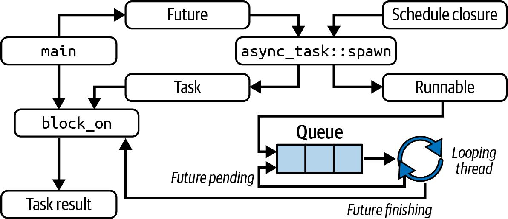


비유를 통해 어떤 일이 일어나고 있는지 설명해 보겠습니다. 세탁이 필요한 더러운 코트가 있다고 가정해 보겠습니다. 코트 안쪽에 붙어 있는 세탁 방법 라벨과 소재 표시는 퓨처(future)에 해당합니다. 우리는 세탁소로 들어가 세탁 지침이 적힌 코트를 건넵니다. 세탁소 직원은 코트에 비닐 커버를 씌우고 번호표를 붙여 세탁 가능한 상태(runnable)로 만듭니다. 또한 직원분은 번호가 적힌 접수증을 건네주는데, 이것이 바로 `main` 함수가 전달받는 태스크(task)와 같습니다.

코트가 세탁되는 동안 우리는 하루 일과를 보냅니다. 코트가 첫 번째 세탁 과정에서 깨끗해지지 않으면, 깨끗해질 때까지 세탁 사이클을 계속 반복해서 거칩니다. 그런 다음 우리는 접수증을 가지고 돌아와 직원에게 건넵니다. 이 단계가 바로 `block_on` 함수에 해당합니다. 충분히 여유를 두고 늦게 찾아왔다면 코트는 이미 깨끗하게 세탁되어 있을 것이므로 바로 수령해서 일상을 이어갈 수 있습니다. 반대로 세탁소에 너무 일찍 찾아가면 코트가 아직 다 세탁되지 않았을 것이고, 세탁이 끝날 때까지 기다려야 코트를 집으로 가져갈 수 있습니다. 깨끗해진 코트가 바로 최종 결과값(result)입니다.

지금 현재 우리의 비동기 런타임에는 큐를 처리하는 스레드가 단 하나뿐입니다. 이는 세탁소에 직원이 단 한 명만 있어야 한다고 고집하는 것과 같습니다. 대부분의 CPU가 멀티코어를 탑재하고 있다는 점을 고려할 때, 이는 사용 가능한 자원을 가장 효율적으로 활용하는 방식이 아닙니다. 이를 감안할 때 더 많은 태스크를 처리할 수 있도록 작업자(워커)와 큐의 개수를 늘리는 방법을 살펴보는 것은 매우 유익할 것입니다.

### 워커와 큐 늘리기

큐를 처리하는 스레드 수를 늘리기 위해, 큐 채널의 수신자를 복제(clone)하여 큐에서 작업을 소비하는 스레드를 하나 더 추가할 수 있습니다:

```rust
let (tx, rx) = flume::unbounded::<Runnable>();
let queue_one = rx.clone();
let queue_two = rx.clone();

thread::spawn(move || {
    while let Ok(runnable) = queue_one.recv() {
        let _ = catch_unwind(|| runnable.run());
    }
});

thread::spawn(move || {
    while let Ok(runnable) = queue_two.recv() {
        let _ = catch_unwind(|| runnable.run());
    }
});
```

채널을 통해 태스크를 전송하면 트래픽은 대체로 두 스레드에 분산됩니다. 한 스레드가 CPU 집약적인 작업으로 블로킹되더라도, 다른 스레드는 계속해서 태스크를 처리해 나갈 것입니다. 제1장의 피보나치 수 예제에서 스레드를 사용하여 CPU 집약적인 작업을 병렬로 실행할 수 있음을 확인했던 것을 떠올려보십시오. 다음과 같은 코드를 작성하면 스레드 풀을 더욱 인체공학적으로 구성할 수 있습니다:

```rust
for _ in 0..3 {
    let receiver = rx.clone();
    thread::spawn(move || {
        while let Ok(runnable) = receiver.recv() {
            let _ = catch_unwind(|| runnable.run());
        }
    });
}
```

CPU 집약적인 작업을 스레드 풀로 넘겨두고 프로그램의 나머지 부분을 계속 실행하다가, 태스크의 결과가 필요한 시점에 블로킹할 수 있습니다. 비동기 프로그래밍이 주로 I/O 작업의 조율을 최적화하기 위해 사용된다는 점을 생각하면 이것이 진정한 비동기 프로그래밍의 본래 취지와는 거리가 있을 수 있지만, 프로그램 초기에 CPU 집약적 작업을 다른 곳으로 위임하여 특정 문제를 해결할 수 있는 유용한 접근법이라는 점은 기억해둘 만합니다.

> [!NOTE]
> "비동기는 연산 집약적인 작업용이 아니다"라는 경고를 접해본 적이 있을 것이다. 비동기는 어디까지나 하나의 메커니즘일 뿐이며, 타당하기만 하다면 원하는 용도로 얼마든지 사용할 수 있다. 하지만 그 경고가 근거 없는 것은 아니다. 예를 들어 대부분의 웹 프레임워크처럼 비동기 런타임을 유입되는 요청 처리에 사용하고 있다면, 비동기 런타임 큐에 연산 집약적인 태스크를 마구 집어넣을 경우 해당 연산이 완료될 때까지 들어오는 요청을 처리하는 기능이 잠재적으로 차단될 수 있다.

여러 워커를 다루어 보았으니, 이제 여러 개의 큐를 사용하는 방법을 본격적으로 살펴보겠습니다.

#### 태스크를 서로 다른 큐로 전달하기

여러 큐를 두고자 하는 이유 중 하나는 태스크마다 우선순위가 다를 수 있기 때문입니다. 이 절에서는 소비자 스레드가 2개인 고우선순위 큐와 소비자 스레드가 1개인 저우선순위 큐를 만들어 봅니다. 여러 큐를 지원하려면 태스크가 향할 큐의 유형을 분류하기 위해 다음과 같은 열거형(enum)이 필요합니다:

```rust
#[derive(Debug, Clone, Copy)]
enum FutureType {
    High,
    Low,
}
```

또한 퓨처가 `spawn` 함수로 전달될 때 트레이트를 통해 자신의 퓨처 타입을 제공할 수 있어야 합니다:

```rust
trait FutureOrderLabel: Future {
    fn get_order(&self) -> FutureType;
}
```

그런 다음 추가 필드를 넣어 퓨처 타입을 지정할 수 있게 해줍니다:

```rust
struct CounterFuture {
    count: u32,
    order: FutureType,
}
```

`poll` 함수는 이전과 동일하므로 다시 다룰 필요가 없습니다. 하지만 퓨처에 대해 `FutureOrderLabel` 트레이트를 구현해주어야 합니다:

```rust
impl FutureOrderLabel for CounterFuture {
    fn get_order(&self) -> FutureType {
        self.order
    }
}
```

이제 퓨처가 처리될 준비를 마쳤으므로, 퓨처 타입을 사용하도록 비동기 런타임을 수정해야 합니다. `spawn_task` 함수의 시그니처는 트레이트 바운드가 추가된 것을 제외하면 이전과 동일합니다:

```rust
fn spawn_task<F, T>(future: F) -> Task<T>
where
    F: Future<Output = T> + Send + 'static + FutureOrderLabel,
    T: Send + 'static,
{
    // . . .
}
```

이제 두 개의 큐를 정의할 수 있습니다. 두 큐를 만드는 데 필요한 내용은 모두 다루었으므로, 다음으로 넘어가기 전에 직접 코드를 작성해보는 것도 좋습니다. 직접 큐를 구현해보았다면 대체로 다음과 같은 형태가 되었을 것입니다:

```rust
static HIGH_QUEUE: LazyLock<flume::Sender<Runnable>> = LazyLock::new(|| {
    let (tx, rx) = flume::unbounded::<Runnable>();
    for _ in 0..2 {
        let receiver = rx.clone();
        thread::spawn(move || {
            while let Ok(runnable) = receiver.recv() {
                let _ = catch_unwind(|| runnable.run());
            }
        });
    }
    tx
});

static LOW_QUEUE: LazyLock<flume::Sender<Runnable>> = LazyLock::new(|| {
    let (tx, rx) = flume::unbounded::<Runnable>();
    for _ in 0..1 {
        let receiver = rx.clone();
        thread::spawn(move || {
            while let Ok(runnable) = receiver.recv() {
                let _ = catch_unwind(|| runnable.run());
            }
        });
    }
    tx
});
```

저우선순위 큐에는 1개의 소비자 스레드가 있고, 고우선순위 큐에는 2개의 소비자 스레드가 있습니다. 이제 퓨처를 올바른 큐로 라우팅해야 합니다. 각 큐에 대해 개별 실행 클로저(runner closure)를 정의한 다음, 퓨처 타입에 따라 알맞은 클로저를 전달하면 됩니다:

```rust
let schedule_high = |runnable| HIGH_QUEUE.send(runnable).unwrap();
let schedule_low = |runnable| LOW_QUEUE.send(runnable).unwrap();

let schedule = match future.get_order() {
    FutureType::High => schedule_high,
    FutureType::Low => schedule_low,
};

let (runnable, task) = async_task::spawn(future, schedule);
runnable.schedule();
return task;
```

이제 선택한 큐에 삽입할 수 있는 퓨처를 만들 수 있습니다:

```rust
let one = CounterFuture { count: 0, order: FutureType::High };
```

하지만 문제점이 하나 있습니다. 저우선순위 태스크가 엄청나게 많이 생성되고 고우선순위 태스크는 전혀 없는 상황을 상상해보십시오. 다른 두 소비자 스레드는 그냥 놀고 있는 동안 소비자 스레드 단 하나가 모든 태스크를 도맡아 처리하게 될 것입니다. 즉, 3분의 1 용량으로만 일하게 되는 셈입니다. 여기서 작업 훔치기(task stealing)가 필요해집니다.

> [!NOTE]
> 태스크 분배를 제어하기 위해 반드시 비동기 런타임 큐를 직접 작성해야만 하는 것은 아니다. 예를 들어 Tokio에서는 `LocalSet`을 사용하여 태스크의 분배를 제어할 수 있다. 이에 대해서는 제7장에서 다룬다.

### 작업 훔치기

작업 훔치기(task stealing)에서는 소비자 스레드가 자신의 큐가 비어 있을 때 다른 큐에서 태스크를 훔쳐와 실행합니다. 그림 3-2는 현재의 비동기 시스템과 관련된 작업 훔치기 메커니즘을 보여줍니다.

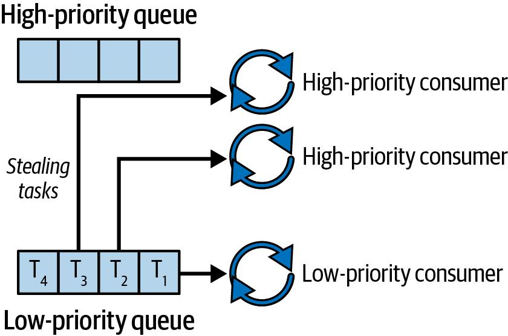


작업 훔치기는 반대 방향으로도 일어날 수 있음을 알아두어야 합니다. 저우선순위 큐가 비어 있다면, 저우선순위 소비자 스레드가 고우선순위 큐에서 태스크를 훔쳐오도록 만들 수 있습니다.

작업 훔치기를 구현하려면 고우선순위 및 저우선순위 큐 양쪽 모두에 두 큐의 채널을 함께 전달해야 합니다. 채널을 정의하기 전에 다음 임포트가 필요합니다:

```rust
use flume::{Sender, Receiver};
```

표준 라이브러리의 `Sender`와 `Receiver`를 사용했다면 다른 스레드로 이를 전달할 수 없었을 것입니다. `flume`을 사용하면 `spawn_task` 함수 내부에서 지연 평가되는 두 채널을 모두 `static`으로 만들 수 있습니다:

```rust
static HIGH_CHANNEL: LazyLock<(Sender<Runnable>, Receiver<Runnable>)> =
    LazyLock::new(|| flume::unbounded::<Runnable>());
static LOW_CHANNEL: LazyLock<(Sender<Runnable>, Receiver<Runnable>)> =
    LazyLock::new(|| flume::unbounded::<Runnable>());
```

두 채널을 마련했으므로, 이제 고우선순위 큐의 소비자 스레드가 무한 루프의 각 반복마다 다음 단계를 수행하도록 정의해야 합니다:

1. `HIGH_CHANNEL`에 메시지가 있는지 확인합니다.
2. `HIGH_CHANNEL`에 메시지가 없다면, `LOW_CHANNEL`에 메시지가 있는지 확인합니다.
3. `LOW_CHANNEL`에도 메시지가 없다면 다음 반복을 진행하기 전에 100밀리초 동안 대기합니다.

> [!TIP]
> 스레드가 유휴 상태일 때 스레드를 파킹(park)해 두고 들어오는 태스크를 처리해야 할 때 깨우는 방식을 사용할 수도 있다. 이렇게 하면 처리할 태스크가 없을 때 과도한 루프 회전과 슬립을 방지할 수 있다. 그러나 스레드 슬립에 의존하면 응답 지연 시간이 늘어날 수 있으며, 이는 프로덕션 코드에서는 바람직하지 않다. 프로덕션 환경에서는 스레드 슬립을 지양하고 스레드 파킹이나 조건 변수(condition variable)처럼 응답성이 뛰어난 메커니즘을 사용해야 한다. 비동기 큐와 관련된 스레드 파킹은 제10장에서 다룬다.

고우선순위 큐는 다음 코드를 통해 이 단계들을 수행할 수 있습니다:

```rust
static HIGH_QUEUE: LazyLock<flume::Sender<Runnable>> = LazyLock::new(|| {
    for _ in 0..2 {
        let high_receiver = HIGH_CHANNEL.1.clone();
        let low_receiver = LOW_CHANNEL.1.clone();
        thread::spawn(move || {
            loop {
                match high_receiver.try_recv() {
                    Ok(runnable) => {
                        let _ = catch_unwind(|| runnable.run());
                    }
                    Err(_) => {
                        match low_receiver.try_recv() {
                            Ok(runnable) => {
                                let _ = catch_unwind(|| runnable.run());
                            }
                            Err(_) => {
                                thread::sleep(Duration::from_millis(100));
                            }
                        }
                    }
                }
            }
        });
    }
    HIGH_CHANNEL.0.clone()
});
```

저우선순위 큐는 단지 1단계와 2단계의 순서를 바꾸고 `LOW_CHANNEL.0.clone()`을 반환하기만 하면 됩니다. 이제 두 큐 모두 자신의 큐에서 먼저 태스크를 가져오고, 자신의 큐에 작업이 없을 때 다른 큐에서 태스크를 가져오게 됩니다. 처리할 작업이 전혀 남아 있지 않으면 소비자 스레드의 동작 속도가 느려집니다(100ms 대기).

> [!IMPORTANT]
> 큐와 채널은 지연 평가(lazy evaluation)된다는 점을 기억하자. 큐가 실행을 시작하려면 큐로 태스크가 전송되어야 한다. 만약 저우선순위 큐에만 태스크를 보내고 고우선순위 큐에는 전혀 보내지 않는다면, 고우선순위 큐는 결코 시작되지 않으므로 저우선순위 큐에서 태스크를 훔쳐오는 일도 결코 일어나지 않는다.

이 시점에서 잠시 멈추고 우리가 해낸 일을 되돌아보겠습니다. 우리는 자체적인 비동기 런타임 큐를 만들고 서로 다른 우선순위 큐들을 정의했습니다! 이제 비동기 태스크가 어떻게 실행되는지 세밀하게 제어할 수 있게 되었습니다. 단, 작업 훔치기를 원하지 않는 경우도 있을 수 있음을 염두에 두어야 합니다. 예를 들어 고우선순위 큐에는 CPU 집약적 작업을 배치하고 저우선순위 큐에는 가벼운 네트워킹 작업을 배치한 경우라면, 저우선순위 큐가 고우선순위 큐의 작업을 훔쳐오기를 원치 않을 것입니다. 그렇지 않으면 저우선순위 큐의 소비자 스레드가 CPU 집약적인 작업에 발이 묶여 네트워크 처리가 중단되는 위험을 겪게 될 수 있습니다.

트레이트 제약 조건을 두고 이를 퓨처에 구현하는 과정을 확인한 것은 흥미로웠지만, 이제 한 가지 단점이 생겼습니다. 일반적인 비동기 블록이나 비동기 함수는 `FutureOrderLabel` 트레이트를 구현하고 있지 않기 때문에 전달할 수 없다는 점입니다. 다른 개발자들은 태스크를 실행하기 위한 간결하고 깔끔한 인터페이스만을 원할 것입니다. 모든 비동기 태스크마다 `Future` 트레이트를 직접 구현하고 거기에 `FutureOrderLabel`까지 일일이 구현해야 한다면 코드가 얼마나 비대해질지 상상할 수 있겠습니까? 더 나은 개발자 경험을 위해 `spawn_task` 함수를 리팩터링해야 합니다.

### spawn_task 함수 리팩터링

비동기 블록과 비동기 함수를 `spawn_task` 함수에 넘길 수 있게 하려면, `FutureOrderLabel` 트레이트를 제거하고 `CounterFuture` 구조체에서 `order` 필드를 없애야 합니다. 그런 다음 `spawn_task` 함수에서 `FutureOrderLabel` 트레이트 제약을 제거하고 우선순위를 위한 매개변수를 하나 더 추가해야 합니다. 이렇게 변경된 함수 시그니처는 다음과 같습니다:

```rust
fn spawn_task<F, T>(future: F, order: FutureType) -> Task<T>
where
    F: Future<Output = T> + Send + 'static,
    T: Send + 'static,
{
    // . . .
```

또한 `spawn_task` 함수 내부에서 올바른 스케줄링 클로저를 선택하는 부분도 업데이트해야 합니다:

```rust
let schedule = match order {
    FutureType::High => schedule_high,
    FutureType::Low => schedule_low,
};
```

하지만 개발자가 매번 우선순위를 일일이 신경 쓰지 않게 하고 싶으므로, `spawn_task` 함수를 위한 매크로를 만들 수 있습니다:

```rust
macro_rules! spawn_task {
    ($future:expr) => {
        spawn_task!($future, FutureType::Low)
    };
    ($future:expr, $order:expr) => {
        spawn_task($future, $order)
    };
}
```

이 매크로를 사용하면 퓨처만 전달할 수도 있습니다. 퓨처만 전달하면 기본값인 저우선순위 타입이 자동으로 전달됩니다. 우선순위를 함께 전달하면 지정한 우선순위가 `spawn_task` 함수로 전달됩니다. 이 매크로를 통해 Rust는 적어도 퓨처 표현식 하나는 전달해야 함을 인지하며, 퓨처가 전달되지 않으면 컴파일되지 않습니다. 이제 다음 예제에서 볼 수 있듯이 훨씬 더 편리한 방식으로 태스크를 생성할 수 있습니다:

```rust
fn main() {
    let one = CounterFuture { count: 0 };
    let two = CounterFuture { count: 0 };
    let t_one = spawn_task!(one, FutureType::High);
    let t_two = spawn_task!(two);
    let t_three = spawn_task!(async_fn());
    let t_four = spawn_task!(async {
        async_fn().await;
        async_fn().await;
    }, FutureType::High);

    future::block_on(t_one);
    future::block_on(t_two);
    future::block_on(t_three);
    future::block_on(t_four);
}
```

이 매크로는 매우 유연합니다. 이를 사용하는 개발자는 깊이 고민하지 않고도 가볍게 태스크를 생성할 수 있으면서도, 필요한 경우에는 해당 태스크가 고우선순위임을 명시할 수 있는 능력도 갖추게 됩니다. 또한 비동기 블록과 비동기 함수는 퓨처의 문법적 설탕(syntactic sugar)에 불과하므로 그대로 전달할 수 있습니다. 하지만 여러 태스크를 기다리기 위해 `main` 함수를 블로킹할 때 여전히 코드가 반복되고 있습니다. 이러한 반복을 없애기 위해 자체적인 `join` 매크로를 만들어야 합니다.

#### Join 매크로 직접 만들기

자체적인 `join` 매크로를 만들기 위해서는 여러 태스크를 전달받아 `block_on` 함수를 순차적으로 호출할 수 있어야 합니다. 다음 코드로 자체 `join` 매크로를 정의할 수 있습니다:

```rust
macro_rules! join {
    ($($future:expr),*) => {
        {
            let mut results = Vec::new();
            $(
                results.push(future::block_on($future));
            )*
            results
        }
    };
}
```

전달된 퓨처들의 순서와 결과값들의 순서를 동일하게 유지하는 것이 필수적입니다. 그렇지 않으면 사용자는 어떤 결과가 어떤 태스크의 것인지 알 수 없게 됩니다. 또한 이 `join` 매크로는 단일 타입만 반환하므로 다음과 같이 사용할 수 있습니다:

```rust
let outcome: Vec<u32> = join!(t_one, t_two);
let outcome_two: Vec<()> = join!(t_four, t_three);
```

`outcome`은 카운터의 출력값들을 담은 벡터이고, `outcome_two`는 아무것도 반환하지 않는 비동기 함수들의 출력값을 담은 벡터다. 반환 타입이 동일하기만 하다면 이 코드는 잘 작동한다.

우리의 태스크들이 직접 실행되고 있다는 점을 명심해야 합니다. 태스크 실행 중에 에러나 패닉이 발생할 수도 있습니다. 결과들의 벡터(`Result` 벡터)를 반환하기 위해 다음과 같이 `try_join` 매크로를 작성할 수 있습니다:

```rust
macro_rules! try_join {
    ($($future:expr),*) => {
        {
            let mut results = Vec::new();
            $(
                let result = catch_unwind(|| future::block_on($future));
                results.push(result);
            )*
            results
        }
    };
}
```

이 매크로는 `join!` 매크로와 유사하지만, 각 태스크의 실행 결과(`Result`)들을 반환합니다.
이제 작업 훔치기와 다중 큐를 갖춘 런타임에서 비동기 태스크를 편리하게 실행하는 데 필요한 거의 모든 것을 갖추었다. 비록 태스크 생성은 편리해졌지만, 런타임 환경을 구성하기 위한 깔끔한 인터페이스가 여전히 필요하다.

#### 런타임 환경 설정하기

앞서 큐가 지연(lazy) 방식으로 동작한다고 언급했던 것을 기억하실 것입니다. 즉, 호출되기 전까지는 시작되지 않습니다. 이는 작업 훔치기 메커니즘에 직접적인 영향을 미칩니다. 앞서 든 예처럼 고우선순위 큐로 태스크가 전혀 전송되지 않는다면, 그 큐는 시작되지 않으며 따라서 저우선순위 큐가 비어 있더라도 태스크를 훔쳐오지 못합니다(반대의 경우도 마찬가지입니다). 시스템을 가동하고 소비자 루프의 수를 조절하기 위해 런타임을 명시적으로 구성하는 것은 이러한 문제를 해결하는 흔한 방식입니다. 예를 들어 런타임을 시작하는 다음 Tokio 예제를 살펴보겠습니다:

```rust
use tokio::runtime::Runtime;

// 런타임 생성
let rt = Runtime::new().unwrap();

// 런타임에 퓨처 스폰
rt.spawn(async {
    println!("now running on a worker thread");
});
```

이 글을 작성하는 시점을 기준으로, 위의 예제는 `Runtime` 구조체에 관한 Tokio 공식 문서에 나와 있는 내용입니다. Tokio 라이브러리는 런타임을 설정하기 위해 절차적 매크로(procedural macro)도 사용하지만, 이는 이 책의 범위를 벗어납니다. 절차적 매크로에 대한 자세한 정보는 Rust 공식 문서에서 찾을 수 있습니다. 우리 런타임의 경우, 고우선순위 및 저우선순위 큐의 소비자 루프 개수를 정의하는 기본적인 런타임 빌더(runtime builder)를 만들 수 있습니다.

먼저 `Runtime` 구조체부터 시작한다:

```rust
struct Runtime {
    high_num: usize,
    low_num: usize,
}
```

`high_num`은 고우선순위 큐를 위한 소비자 스레드 수이고, `low_num`은 저우선순위 큐를 위한 소비자 스레드 수다. 런타임에 대해 다음 함수들을 구현한다:

```rust
impl Runtime {
    pub fn new() -> Self {
        let num_cores = std::thread::available_parallelism().unwrap().get();
        Self {
            high_num: num_cores - 2,
            low_num: 1,
        }
    }

    pub fn with_high_num(mut self, num: usize) -> Self {
        self.high_num = num;
        self
    }

    pub fn with_low_num(mut self, num: usize) -> Self {
        self.low_num = num;
        self
    }

    pub fn run(&self) {
        // . . .
    }
}
```

여기서는 비동기 프로그램을 실행하는 컴퓨터에서 사용 가능한 코어 수를 기반으로 스레드 수를 결정하는 표준적인 방식을 제공합니다. 또한 원한다면 저우선순위 및 고우선순위 스레드 수를 직접 지정할 수 있는 옵션도 제공합니다. `run` 함수는 해당 숫자들을 환경 변수로 설정한 다음, 두 큐를 모두 시작 상태로 초기화하기 위해 각 큐에 더미 태스크를 하나씩 스폰합니다:

```rust
pub fn run(&self) {
    std::env::set_var("HIGH_NUM", self.high_num.to_string());
    std::env::set_var("LOW_NUM", self.low_num.to_string());
    let high = spawn_task!(async {}, FutureType::High);
    let low = spawn_task!(async {}, FutureType::Low);
    join!(high, low);
}
```

`run` 함수가 실행된 후 양쪽 큐 모두 즉시 태스크를 훔쳐올 수 있는 준비 상태가 되도록 `join!`을 사용한다.

런타임을 실제로 사용해보기 전에, 각 큐의 소비자 스레드 수를 설정하기 위해 이 환경 변수들을 읽어와야 합니다. `spawn_task` 함수 내부의 각 큐 정의에서 환경 변수를 참조하도록 합니다:

```rust
static HIGH_QUEUE: LazyLock<flume::Sender<Runnable>> = LazyLock::new(|| {
    let high_num = std::env::var("HIGH_NUM").unwrap().parse::<usize>().unwrap();
    for _ in 0..high_num {
        // . . .
```

저우선순위 큐도 마찬가지로 수정합니다. 이제 다른 어떤 작업보다 먼저 `main` 함수 첫머리에서 기본값을 사용해 런타임을 정의할 수 있습니다:

```rust
Runtime::new().run();
```

또는 다음과 같이 사용자 정의 수치를 사용할 수도 있다:

```rust
Runtime::new().with_low_num(2).with_high_num(4).run();
```

이제 프로그램의 나머지 부분 어디에서든 원할 때마다 `spawn_task` 매크로와 `join` 매크로를 실행할 수 있습니다. 두 가지 유형의 큐와 작업 훔치기를 지원하며 환경 설정까지 가능한 자체 비동기 런타임이 완성되었습니다!

이제 거의 모든 내용이 정리되었습니다. 하지만 이번 장을 마치기 전에 마지막으로 한 가지 개념을 더 다루어야 합니다. 바로 백그라운드 프로세스(background process)입니다.

### 백그라운드 프로세스 실행하기

백그라운드 프로세스는 프로그램의 전체 수명 동안 주기적으로 백그라운드에서 실행되는 태스크입니다. 이러한 프로세스는 모니터링이나 데이터베이스 정리, 로그 로테이션, 데이터 갱신과 같은 유지보수 작업에 사용되어 프로그램이 항상 최신 정보에 접근할 수 있도록 보장합니다. 비동기 런타임에서 기본적인 백그라운드 프로세스를 태스크로 구현해 보면 장기 실행(long-running) 태스크를 어떻게 다루어야 하는지 이해할 수 있습니다.

백그라운드 태스크를 다루기 전에, 폴링이 결코 멈추지 않는 퓨처를 만들어야 합니다. 이 장을 여기까지 읽었다면 직접 만들 수 있을 것이므로, 다음으로 넘어가기 전에 먼저 직접 구현해 보시길 권합니다.

직접 퓨처를 구현해보았다면, 수행 중인 프로세스가 블로킹 방식일 때 대략 다음과 같은 형태가 되었을 것이다:

```rust
#[derive(Debug, Clone, Copy)]
struct BackgroundProcess;

impl Future for BackgroundProcess {
    type Output = ();

    fn poll(self: Pin<&mut Self>, cx: &mut Context<'_>) -> Poll<Self::Output> {
        println!("background process firing");
        std::thread::sleep(Duration::from_secs(1));
        cx.waker().wake_by_ref();
        Poll::Pending
    }
}
```

세부 구현은 다를 수 있지만, 핵심은 항상 `Pending`을 반환한다는 점입니다.

여기서 주의할 점이 있습니다. `main` 함수에서 태스크 핸들을 드롭하면 비동기 런타임에서 실행 중이던 태스크가 취소되어 더 이상 실행되지 않으므로, 백그라운드 태스크는 프로그램의 전체 수명 동안 계속 유지되어야 합니다. 따라서 런타임을 정의한 직후, `main` 함수의 맨 처음에 백그라운드 태스크를 전송해야 합니다:

```rust
Runtime::new().with_low_num(2).with_high_num(4).run();
let _background = spawn_task!(BackgroundProcess {});
```

그러면 백그라운드 프로세스가 프로그램의 전체 수명 동안 주기적으로 실행됩니다.

하지만 이 방식은 편리하지 못하다. 예를 들어 특정 구조체나 함수가 백그라운드 태스크를 생성할 수 있다고 해보자. 백그라운드 태스크가 취소되지 않도록 태스크 핸들을 프로그램 이곳저곳으로 넘기며 신경 쓸 필요는 없습니다. `detach` 메서드를 사용하면 백그라운드 태스크를 계속 실행하기 위해 태스크 핸들을 전전긍긍하며 관리할 필요를 없앨 수 있다:

```rust
Runtime::new().with_low_num(2).with_high_num(4).run();
spawn_task!(BackgroundProcess {}).detach();
```

이 메서드는 태스크 내부의 포인터를 안전하지 않은 루프로 이동시켜, 태스크가 완료될 때까지 계속 폴링하고 스케줄링하도록 만든다. 그러면 `main` 함수의 태스크와 연결된 포인터는 드롭되므로, `main`에서 태스크 핸들을 쥐고 있을 필요가 완전히 사라진다.

### 요약

이번 장에서는 자체적인 비동기 런타임을 직접 구현해보았으며, 그 과정에서 많은 것을 배웠다. 처음에는 퓨처를 전달받아 태스크와 러너블을 생성하는 기본적인 비동기 런타임 환경을 구축했다. 러너블은 소비자 스레드가 처리할 수 있도록 큐에 들어갔고, 태스크는 결과값을 기다리기 위해 블로킹할 수 있도록 `main` 함수로 반환되었다. 여기서 퓨처와 태스크가 비동기 런타임 내부에서 거치는 일련의 단계들을 확실하게 체계화했다. 마지막으로 소비자 스레드 수가 서로 다른 큐들을 구현하고, 큐가 비었을 때 대처할 수 있도록 작업 훔치기(task stealing) 패턴을 적용했다. 그런 다음 사용자가 태스크를 쉽게 스폰하고 대기(join)할 수 있도록 편리한 매크로도 직접 작성해보았다.

작업 훔치기가 가져온 미묘한 차이는 비동기 프로그래밍의 진정한 본질을 잘 보여줍니다. 비동기 런타임은 문제를 해결하기 위해 사용하는 도구에 불과합니다. 네트워크 트래픽은 적지만 유입된 요청이 오래 걸리는 작업을 유발하는 프로그램이라면, 네트워크 트래픽을 수신하는 큐에는 스레드 1개만 할당하고 장시간 실행되는 CPU 집약적 작업을 처리하는 큐에는 스레드 5개를 할당하지 못할 이유가 전혀 없습니다. 이 경우라면 네트워크 큐가 CPU 집약적 큐의 작업을 훔쳐오기를 원치 않을 것입니다. 물론 해결책은 항상 합리적이어야 합니다. 하지만 사용하는 비동기 런타임을 깊이 이해할수록 복잡한 문제를 흥미롭고 창의적인 방식으로 해결할 수 있는 능력이 생깁니다.

우리가 만든 비동기 런타임이 현존 최고는 결코 아닐 것입니다. 널리 사용되는 기성 비동기 런타임들에는 수많은 뛰어난 인재들이 매달려 각종 문제와 엣지 케이스들을 다듬어 놓았습니다. 그러나 이번 장을 마친 지금, 여러분은 선택한 런타임의 세부 사항을 꼼꼼히 살펴보고 그 특성을 해결하려는 문제에 어떻게 적용할지 판단할 수 있는 안목을 갖추었을 것입니다. 또한 `async_task` 큐와 `flume` 채널을 조합한 간단한 구현은 실제 프로덕션 환경에서도 충분히 활용될 수 있습니다.

제4장에서는 우리가 만든 비동기 런타임에 HTTP를 통합하는 방법을 다룬다.

# 제4장 비동기 런타임에 네트워킹 통합하기

3장에서는 비동기 런타임 큐를 직접 구축하면서 비동기 작업이 런타임을 통해 어떻게 실행되는지 살펴보았습니다. 다만 당시에는 기본적인 sleep과 print 연산만 사용했습니다. 처음에는 단순한 연산에 집중하는 것이 유용하지만, sleep과 print 함수만으로는 할 수 있는 일에 한계가 있습니다. 이번 장에서는 앞서 정의한 비동기 런타임에 네트워킹 프로토콜을 통합하여, 네트워크 작업이 자체 비동기 런타임 위에서 실행될 수 있도록 만들어 보겠습니다.

이번 장을 마치고 나면, 트레이트(trait)를 사용하여 HTTP 요청을 처리하는 `hyper` 크레이트를 런타임에 통합할 수 있게 됩니다. 즉, 이번 예제를 응용하면 해당 크레이트의 문서를 읽고 트레이트를 이용해 다른 서드파티 의존성도 자체 비동기 런타임에 통합할 수 있게 됩니다. 마지막으로, `mio` 크레이트를 이용해 퓨처(future) 안에서 소켓을 직접 폴링(polling)하는 더 낮은 수준(low-level)까지 내려가 봅니다. 이를 통해 자체 비동기 런타임에서 소켓을 폴링하고 읽고 쓰는 방식을 세밀하게 제어하는 방법을 배울 수 있습니다. 이러한 경험과 추가적인 외부 학습을 통해 자신만의 맞춤형 네트워킹 프로토콜을 직접 구현할 수 있게 될 것입니다.

이번 장은 이 책에서 따라가기 가장 어려운 장이며, 커스텀 런타임에 네트워킹을 통합할 계획이 없다면 반드시 읽어야 하는 내용은 아닙니다. 다소 부담스럽게 느껴진다면 이번 장을 건너뛰고 책의 나머지 부분을 읽은 뒤 다시 돌아오셔도 좋습니다. 이 내용이 이번 장에 배치된 이유는 3장에서 작성한 코드를 바탕으로 발전시키기 때문입니다.

본격적으로 진행하기에 앞서, 3장에서 사용했던 의존성 외에 다음과 같은 추가 의존성이 필요합니다:

```rust
[dependencies]
hyper = { version = "0.14.26", features = ["http1", "http2", "client", "runtime"] }
smol = "1.3.0"
anyhow = "1.0.70"
async-native-tls = "0.5.0"
http = "0.2.9"
tokio = "1.14.0"
```

우리가 사용하는 의존성은 다음과 같습니다:

- `hyper`: 빠르고 널리 쓰이는 HTTP 구현체 크레이트입니다. 이번 예제에서 요청을 보내는 데 사용합니다. HTTP 요청 생성을 위한 `client` 기능과 커스텀 비동기 런타임과의 호환성을 위한 `runtime` 기능 플래그가 필요합니다.
- `smol`: 작고 빠른 비동기 런타임 크레이트입니다. 오버헤드가 적어 가벼운 작업에 특히 유용합니다.
- `anyhow`: 에러 처리 라이브러리 크레이트입니다.
- `async-native-tls`: 비동기 전송 계층 보안(TLS)을 지원하는 크레이트입니다.
- `http`: HTTP 요청과 응답을 다루기 위한 타입을 제공하는 크레이트입니다.
- `tokio`: 앞서 비동기 런타임을 시연할 때 사용했던 크레이트로, 이번 장에서도 다시 사용합니다.

보시다시피 이번 예제에서는 `hyper`를 사용합니다. 이는 이전 예제에서 다룬 도구와는 다른 도구 모음을 접하게 하고, Tokio와 같은 도구가 자주 사용되는 다른 라이브러리들의 하위 계층을 어떻게 이루고 있는지 보여주기 위함입니다. 그러나 코드를 작성하기 전에 먼저 실행기(executor)와 커넥터(connector)의 개념을 짚고 넘어가야 합니다.

### 실행기와 커넥터 이해하기

실행기(executor)는 퓨처를 끝까지 실행(run to completion)하는 역할을 담당합니다. 이는 작업을 스케줄링하고 준비된 작업이 실행되도록 보장하는 런타임의 핵심 구성 요소입니다. 런타임에 네트워킹을 도입할 때 실행기가 반드시 필요한 이유는, 실행기가 없으면 HTTP 요청과 같은 퓨처가 생성되기만 할 뿐 실제로 실행되지 않기 때문입니다.

네트워킹에서 커넥터(connector)는 애플리케이션과 연결하려는 서비스 간의 연결을 수립하는 컴포넌트입니다. 커넥터는 TCP 연결을 열고 요청의 수명 주기 동안 이를 유지하는 등의 활동을 처리합니다.

#### 비동기 런타임에 hyper 통합하기

실행기와 커넥터가 무엇인지 이해했으니, 이러한 개념이 자체 비동기 런타임에 `hyper`와 같은 라이브러리를 통합할 때 왜 필수적인지 살펴보겠습니다. 적절한 실행기와 커넥터가 없다면, 우리 런타임은 `hyper`가 의존하는 HTTP 요청과 연결을 처리할 수 없습니다.

`hyper`의 공식 문서나 다양한 온라인 튜토리얼을 보면, 다음과 같은 코드로 `hyper` 크레이트를 사용해 간단한 GET 요청을 수행할 수 있다는 인상을 받을 수 있습니다:

```rust
use hyper::{Request, Client};
let url = "http://www.rust-lang.org";
let uri: Uri = url.parse().unwrap();

let request = Request::builder()
    .method("GET")
    .uri(uri)
    .header("User-Agent", "hyper/0.14.2")
    .header("Accept", "text/html")
    .body(hyper::Body::empty()).unwrap();

let future = async {
    let client = Client::new();
    client.request(request).await.unwrap()
};
let test = spawn_task!(future);
let response = future::block_on(test);
println!("Response status: {}", response.status());
```

하지만 이 튜토리얼 코드를 그대로 실행하면 다음과 같은 에러가 발생합니다:

```text
thread '<unnamed>' panicked at 'there is no reactor
running, must be called from the context of a Tokio 1.x runtime'
```

이는 내부적으로 `hyper`가 기본적으로 Tokio 런타임 위에서 실행되도록 되어 있으며, 코드에 별도의 실행기가 지정되지 않았기 때문입니다. `reqwest`나 기타 인기 있는 크레이트를 사용하려 할 때도 비슷한 에러가 발생할 가능성이 높습니다.

이 문제를 해결하기 위해, 직접 구축한 커스텀 비동기 런타임 내에서 작업을 처리할 수 있는 커스텀 실행기(custom executor)를 만들 것입니다. 그런 다음 실제 네트워크 연결을 관리하는 커스텀 커넥터(custom connector)를 구현하여, 우리 런타임이 `hyper` 및 유사한 라이브러리와 원활하게 통합될 수 있도록 하겠습니다.

첫 번째 단계는 프로그램에 다음 항목들을 임포트하는 것입니다:

```rust
use std::net::Shutdown;
use std::net::{TcpStream, ToSocketAddrs};
use std::pin::Pin;
use std::task::{Context, Poll};
use anyhow::{bail, Context as _, Error, Result};
use async_native-tls::TlsStream;
use http::Uri;
use hyper::{Body, Client, Request, Response};
use smol::{io, prelude::*, Async};
```

커스텀 실행기는 다음과 같이 작성할 수 있습니다:

```rust
struct CustomExecutor;

impl<F: Future + Send + 'static> hyper::rt::Executor<F> for CustomExecutor {
    fn execute(&self, fut: F) {
        spawn_task!(async {
            println!("sending request");
            fut.await;
        }).detach();
    }
}
```

이 코드는 커스텀 실행기와 `execute` 함수의 동작을 정의합니다. 이 함수 내부에서는 `spawn_task` 매크로를 호출합니다. 매크로 내부에서 비동기 블록을 생성하고 `execute` 함수로 전달된 퓨처를 `await`합니다. 여기서 `detach` 함수를 사용해야 합니다. 그렇지 않으면 채널이 닫히고 작업이 스코프를 벗어나 드롭(drop)되어 요청 처리를 계속 이어갈 수 없기 때문입니다. 3장에서 살펴보았듯이 `detach`는 작업이 드롭되기 전에 작업 포인터를 루프에 전달하여 완료될 때까지 폴링되도록 합니다.

이제 `hyper` 클라이언트에 전달할 수 있는 커스텀 실행기가 준비되었습니다. 하지만 `hyper` 클라이언트는 여전히 연결 관리를 Tokio 런타임이 해줄 것으로 기대하기 때문에 요청 전송에 실패합니다. 커스텀 비동기 런타임과 `hyper`를 완전히 통합하려면, Tokio와 독립적으로 네트워크 연결을 처리하는 자체 비동기 커넥터를 구축해야 합니다.

### HTTP 연결 구축하기

네트워킹 요청에서 프로토콜은 매우 명확하게 정의되어 있고 표준화되어 있습니다. 예를 들어, TCP는 연결을 통해 바이트 패킷을 전송하기 전에 연결을 수립하기 위한 3단계 핸드셰이크(three-step handshake) 과정을 거칩니다. 표준화된 연결 프로토콜이 제공하지 못하는 매우 특별한 요구사항이 있는 경우가 아니라면, 밑바닥부터 TCP 연결을 직접 구현할 이유는 없습니다. 그림 4-1에서 볼 수 있듯이 HTTP와 HTTPS는 TCP와 같은 전송 프로토콜 위에서 실행되는 애플리케이션 계층 프로토콜입니다.

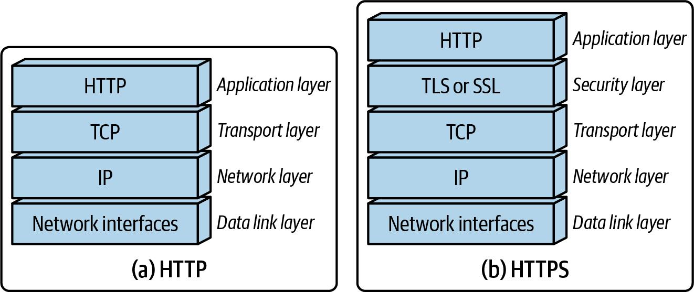


HTTP에서는 본문(body), 헤더(header) 등을 주고받습니다. HTTPS는 데이터가 암호화되어야 하므로 클라이언트가 데이터를 전송하기 전에 인증서를 확인하고 전달받는 등 훨씬 더 많은 단계를 거칩니다. 이러한 프로토콜의 수많은 상호작용과 응답 대기 시간을 고려하면, 네트워킹 요청은 비동기 처리를 적용하기에 매우 적합한 대상입니다. 보안성과 연결의 신뢰성을 해치지 않으면서 네트워킹 단계를 생략할 수는 없습니다. 하지만 비동기를 활용하면 응답을 기다리는 동안 CPU가 다른 작업을 수행할 수 있습니다.

우리의 커넥터는 HTTP와 HTTPS를 모두 지원할 것이므로 다음과 같은 열거형(enum)이 필요합니다:

```rust
enum CustomStream {
    Plain(Async<TcpStream>),
    Tls(TlsStream<Async<TcpStream>>),
}
```

`Plain` 배리어언트는 비동기 TCP 스트림으로, 그림 4-1에서 보듯이 HTTP 요청을 지원합니다. `Tls` 배리어언트는 TCP 위에 TLS 계층이 추가된 형태이므로 HTTPS를 지원합니다.

이제 이 커스텀 스트림 열거형을 사용하여 커스텀 커넥터 구조체에 대한 `hyper`의 `Service` 트레이트를 구현할 수 있습니다:

```rust
#[derive(Clone)]
struct CustomConnector;

impl hyper::service::Service<Uri> for CustomConnector {
    type Response = CustomStream;
    type Error = Error;
    type Future = Pin<Box<dyn Future<Output = Result<
        Self::Response, Self::Error>> + Send
    >>;

    fn poll_ready(&mut self, _: &mut Context<'_>) -> Poll<Result<(), Self::Error>> {
        Poll::Ready(Ok(()))
    }

    fn call(&mut self, uri: Uri) -> Self::Future {
        // ...
    }
}
```

`Service` 트레이트는 연결을 위한 퓨처를 정의합니다. 여기서 연결은 커스텀 스트림 열거형을 반환하는 스레드 안전(thread-safe) 퓨처입니다. 이 열거형은 비동기 TCP 연결이거나 TLS 스트림으로 감싼 비동기 TCP 연결입니다.

또한 `poll_ready` 함수가 단순히 `Ready`를 반환하는 것을 볼 수 있습니다. 이 함수는 서비스가 요청을 처리할 준비가 되었는지 확인하기 위해 `hyper`에서 사용합니다. `Pending`을 반환하면 서비스가 준비될 때까지 작업이 계속 폴링됩니다. 서비스가 더 이상 요청을 처리할 수 없게 되면 에러를 반환합니다. 여기서는 클라이언트 호출을 위해 `Service` 트레이트를 사용하므로 `poll_ready`에서 항상 `Ready`를 반환합니다. 서버용으로 `Service` 트레이트를 구현한다면 다음과 같은 `poll_ready` 함수를 둘 수 있을 것입니다:

```rust
fn poll_ready(&mut self, cx: &mut Context<'_>) -> Poll<Result<(), Error>> {
    Poll::Ready(Ok(()))
}
```

우리의 `poll_ready` 함수는 퓨처가 준비되었음을 반환합니다. 실제로 호출될 일은 없으므로 정의하지 않아도 될 것 같지만, 이 함수는 `Service` 트레이트의 필수 요구사항입니다.

이제 응답 함수인 `call`로 넘어가겠습니다. `call`을 사용하기 전에 `poll_ready` 함수가 `Ok`를 반환해야 합니다. `call` 함수의 개요는 다음과 같습니다:

```rust
fn call(&mut self, uri: Uri) -> Self::Future {
    Box::pin(async move {
        let host = uri.host().context("cannot parse host")?;
        match uri.scheme_str() {
            Some("http") => {
                // ...
            }
            Some("https") => {
                // ...
            }
            scheme => bail!("unsupported scheme: {:?}", scheme),
        }
    })
}
```

`pin`된 비동기 블록이 퓨처를 반환한다는 점을 기억하십시오. 따라서 고정된(pinned) 퓨처가 비동기 블록의 반환값이 됩니다. HTTPS 블록은 다음과 같은 코드로 퓨처를 구성합니다:

```rust
let socket_addr = {
    let host = host.to_string();
    let port = uri.port_u16().unwrap_or(443);
    smol::unblock(move || (host.as_str(), port).to_socket_addrs())
        .await?
        .next()
        .context("cannot resolve address")?
};
let stream = Async::<TcpStream>::connect(socket_addr).await?;
let stream = async_native_tls::connect(host, stream).await?;
Ok(CustomStream::Tls(stream))
```

HTTPS의 표준 포트는 443이므로 포트는 443으로 지정합니다. 그런 다음 소켓 주소를 반환하는 클로저를 `unblock` 함수에 전달합니다. `unblock` 함수는 스레드 풀에서 블로킹 코드를 실행하여 블로킹 코드에 대해서도 비동기 인터페이스를 제공합니다. 소켓 주소를 확인(resolving)하는 동안 스레드는 해제되어 다른 작업을 수행할 수 있습니다. 그런 다음 TCP 스트림을 연결하고 이를 네이티브 TLS에 연결합니다. 연결이 완료되면 최종적으로 `CustomStream` 열거형을 반환합니다.

HTTP 코드는 거의 동일합니다. 포트만 443 대신 80을 사용하고 TLS 연결이 필요 없으므로, 결과적으로 `Ok(CustomStream::Plain(stream))`을 반환합니다.

이제 `call` 함수가 정의되었습니다. 하지만 이 시점에서 스트림 열거형이나 연결 구조체를 사용해 웹사이트에 HTTPS 호출을 시도하면, 스트림 타입에 대해 Tokio의 `AsyncRead` 및 `AsyncWrite` 트레이트를 구현하지 않았다는 에러 메시지가 나타납니다. `hyper`가 연결 열거형을 사용하려면 이러한 트레이트가 구현되어 있어야 하기 때문입니다.

### Tokio AsyncRead 트레이트 구현하기

`AsyncRead` 트레이트는 `std::io::Read` 트레이트와 유사하지만 비동기 작업 시스템과 연동됩니다. `AsyncRead` 트레이트를 구현할 때는 `poll_read` 함수만 정의하면 되며, 이 함수는 `Poll` 열거형을 반환합니다. `Poll::Ready`를 반환하면 데이터가 즉시 읽혀 출력 버퍼에 배치되었음을 의미합니다. `Poll::Pending`을 반환하면 제공된 버퍼로 읽어온 데이터가 없음을 의미합니다. 이는 I/O 객체가 현재는 읽을 수 없지만 나중에는 읽을 수 있게 될 수 있음을 나타냅니다. `Pending`이 반환되면 해당 객체가 읽기 가능해졌을 때 현재 퓨처의 태스크가 깨어나도록(unparked) 스케줄링됩니다. 마지막으로 반환할 수 있는 `Poll` 배리어언트는 보통 표준 I/O 에러를 담은 `Ready(Err(...))` 형태입니다.

우리의 `AsyncRead` 트레이트 구현 코드는 다음과 같습니다:

```rust
impl tokio::io::AsyncRead for CustomStream {
    fn poll_read(
        mut self: Pin<&mut Self>,
        cx: &mut Context<'_>,
        buf: &mut tokio::io::ReadBuf<'_>,
    ) -> Poll<io::Result<()>> {
        match &mut *self {
            CustomStream::Plain(s) => {
                Pin::new(s)
                    .poll_read(cx, buf.initialize_unfilled())
                    .map_ok(|size| {
                        buf.advance(size);
                    })
            }
            CustomStream::Tls(s) => {
                Pin::new(s)
                    .poll_read(cx, buf.initialize_unfilled())
                    .map_ok(|size| {
                        buf.advance(size);
                    })
            }
        }
    }
}
```

두 스트림 모두 기본적으로 동일하게 처리됩니다. 비동기 TCP 스트림 또는 TLS가 적용된 비동기 TCP 스트림을 전달받아 고정(pin)한 뒤, 스트림의 `poll_read` 함수를 실행합니다. 이 함수는 읽기 작업을 수행하고 읽기로 인해 버퍼가 얼마나 커졌는지를 나타내는 `Poll` 열거형을 반환합니다. `poll_read`가 완료되면, 한 번만 호출될 수 있는 함수나 클로저인 `FnOnce(T)`를 인자로 받는 `map_ok`를 실행합니다.

`map_ok`의 맥락에서 클로저의 목적은 `poll_read`에서 반환된 크기만큼 버퍼를 전진(advance)시키는 것입니다. 이는 읽기마다 한 번만 수행되는 작업이므로 `FnOnce`로 충분하며 더 적합합니다. 클로저가 여러 번 호출되어야 했다면 `Fn`이나 `FnMut`이 필요했을 것입니다. `FnOnce`를 사용하면 클로저가 캡처한 환경의 소유권을 가져갈 수 있어 클로저가 수행할 수 있는 작업에 유연성을 부여합니다. 이는 소유권과 수명(lifetime)을 세심하게 관리해야 하는 비동기 프로그래밍에서 특히 유용합니다.

`map_ok`는 `poll_read`의 결과도 함께 처리합니다. `Poll` 결과가 에러를 동반한 `Ready`라면 에러를 포함한 `Ready`가 반환됩니다. `Poll` 결과가 `Pending`이라면 `Pending`이 반환됩니다. `poll_read`에 컨텍스트를 전달하므로 `Pending`인 경우 웨이커(waker)가 등록됩니다. `Ok`를 담은 `Ready`가 나오면 `poll_read`의 결과를 인자로 클로저가 호출되고, `map_ok` 함수에서 `Ready(Ok(()))`가 반환됩니다. `map_ok`에 전달된 클로저는 버퍼를 전진시킵니다.

내부적으로 많은 일이 일어나지만, 핵심은 스트림을 고정하고 고정된 스트림에서 읽기를 수행한 뒤, 읽기에 성공하면 버퍼에 들어온 데이터만큼 버퍼의 채워진 영역 크기를 늘려주는 것입니다. `poll_read`의 폴링과 `map_ok`에서의 `Poll` 열거형 매칭을 통해 이 읽기 과정이 비동기 런타임과 호환됩니다.

이제 버퍼로 데이터를 비동기적으로 읽을 수 있게 되었지만, HTTP 요청을 완료하려면 비동기 쓰기도 가능해야 합니다.

### Tokio AsyncWrite 트레이트 구현하기

`AsyncWrite` 트레이트는 `std::io::Write`와 유사하지만 비동기 작업 시스템과 상호작용합니다. 바이트를 비동기적으로 기록하며, 방금 구현한 `AsyncRead`와 마찬가지로 Tokio에서 제공됩니다.

`AsyncWrite` 트레이트를 구현할 때는 다음과 같은 개요가 필요합니다:

```rust
impl tokio::io::AsyncWrite for CustomStream {
    fn poll_write(
        mut self: Pin<&mut Self>,
        cx: &mut Context<'_>,
        buf: &[u8],
    ) -> Poll<io::Result<usize>> {
        // ...
    }

    fn poll_flush(mut self: Pin<&mut Self>, cx: &mut Context<'_>) -> Poll<io::Result<()>> {
        // ...
    }

    fn poll_shutdown(mut self: Pin<&mut Self>, cx: &mut Context<'_>) -> Poll<io::Result<()>> {
        // ...
    }
}
```

`poll_write` 함수 외에도 `poll_flush`와 `poll_shutdown` 함수를 함께 구현해야 한다는 점에 주목하십시오. 모든 함수는 `Poll` 열거형의 배리어언트를 반환하고 컨텍스트를 전달받습니다. 따라서 모든 함수가 태스크를 다시 깨울 수 있도록 대기 상태로 만들 수 있으며, 이를 통해 연결 종료, 플러시(flush), 쓰기 준비 여부를 확인할 수 있습니다.

먼저 `poll_write`와 `poll_flush` 함수부터 구현해 보겠습니다:

```rust
match &mut *self {
    CustomStream::Plain(s) => Pin::new(s).poll_write(cx, buf),
    CustomStream::Tls(s) => Pin::new(s).poll_write(cx, buf),
}

match &mut *self {
    CustomStream::Plain(s) => Pin::new(s).poll_flush(cx),
    CustomStream::Tls(s) => Pin::new(s).poll_flush(cx),
}
```

이제 마지막 함수인 `shutdown`으로 넘어갈 수 있습니다:

```rust
match &mut *self {
    CustomStream::Plain(s) => {
        s.get_ref().shutdown(Shutdown::Write)?;
        Poll::Ready(Ok(()))
    }
    CustomStream::Tls(s) => Pin::new(s).poll_close(cx),
}
```

스트림을 매칭하고 고정한 다음, 해당 스트림의 `poll_write` 함수를 실행합니다. 이 시점에서 `poll_write`가 버퍼의 바이트를 객체에 쓰려고 시도한다는 것은 낯설지 않으실 것입니다. 읽기와 마찬가지로 쓰기에 성공하면 기록된 바이트 수가 반환됩니다. 객체가 쓸 준비가 되지 않았다면 `Pending`을 받게 되며, 0을 반환받았다면 대개 해당 객체가 더 이상 바이트를 받아들일 수 없음을 의미합니다.

스트림의 `poll_write` 함수 내부에서는 루프가 실행되어 I/O 핸들러의 가변 참조를 얻습니다. 그런 다음 루프는 버퍼의 모든 바이트가 기록될 때까지 기반 I/O에 반복적으로 쓰기를 시도합니다. 각 쓰기 시도마다 결과를 처리해야 합니다. 쓰기 에러가 `io::ErrorKind::WouldBlock`이라면 쓰기가 즉시 완료될 수 없음을 의미하며, 루프는 쓰기가 완료될 때까지 반복됩니다. 다른 에러라면 루프는 나중에 퓨처를 다시 폴링하도록 `Pending`을 반환하여 리소스가 다시 사용 가능해질 때까지 기다립니다.

`poll_write`를 작성했으므로 이제 `poll_flush` 함수의 본문을 정의할 수 있습니다. 이는 `poll_write` 함수와 동일한 구조를 가집니다. 다만 이 경우에는 스트림에서 `poll_flush`를 호출합니다. 플러시는 쓰기와 유사하지만 버퍼의 모든 내용이 목적지에 즉시 도달하도록 보장한다는 점이 다릅니다. 플러시의 기본 메커니즘은 루프를 사용하는 쓰기와 완전히 동일하지만 루프 내에서 쓰기 함수 대신 플러시 함수가 호출됩니다.

커스텀 스트림의 타입마다 구현 방식에는 약간의 차이가 있습니다. `Plain` 스트림은 직접 종료(shutdown)됩니다. 종료되면 준비 완료 상태인 `Poll::Ready(Ok(()))`를 반환합니다. 반면 `Tls` 스트림은 그 자체로 비동기 구현체입니다. 따라서 폴링이 완료될 때까지 태스크 큐에 여러 번 들어갈 수 있으므로 메모리에서 이동하지 않도록 고정(pin)해야 합니다. 그리고 자체적으로 폴링 결과를 반환하는 `poll_close` 함수를 호출합니다.

이제 `hyper` 클라이언트를 위한 비동기 읽기 및 쓰기 트레이트 구현을 마쳤습니다. 남은 일은 구현을 테스트하기 위해 연결하고 HTTP 요청을 실행하는 것뿐입니다.

### 클라이언트 연결 및 실행하기

이번 절에서는 지금까지 구현한 내용을 하나로 묶어 테스트해 보겠습니다. 연결 요청 전송 함수를 다음과 같이 작성할 수 있습니다:

```rust
impl hyper::client::connect::Connection for CustomStream {
    fn connected(&self) -> hyper::client::connect::Connected {
        hyper::client::connect::Connected::new()
    }
}

async fn fetch(req: Request<Body>) -> Result<Response<Body>> {
    Ok(Client::builder()
        .executor(CustomExecutor)
        .build::<_, Body>(CustomConnector)
        .request(req)
        .await?)
}
```

이제 `main` 함수에서 비동기 런타임 위로 HTTP 클라이언트를 실행하기만 하면 됩니다:

```rust
fn main() {
    Runtime::new().with_low_num(2).with_high_num(4).run();
    let future = async {
        let req = Request::get("https://www.rust-lang.org")
            .body(Body::empty())
            .unwrap();
        let response = fetch(req).await.unwrap();
        let body_bytes = hyper::body::to_bytes(response.into_body())
            .await.unwrap();
        let html = String::from_utf8(body_bytes.to_vec()).unwrap();
        println!("{}", html);
    };
    let test = spawn_task!(future);
    let _outcome = future::block_on(test);
}
```

드디어 완성되었습니다! 코드를 실행하면 Rust 공식 웹사이트의 HTML을 가져올 수 있습니다. 이제 우리 비동기 런타임이 인터넷과 비동기적으로 통신할 수 있다고 말할 수 있습니다. 하지만 요청을 수신하는 서버 역할은 어떨까요? 다른 크레이트의 트레이트를 구현하여 비동기 기능을 얻는 방법은 이미 다루었습니다. 그러니 이번에는 한 단계 더 깊이 들어가 `mio` 크레이트로 소켓의 이벤트를 직접 감지해 보겠습니다.

### mio 소개

소켓을 다루는 비동기 기능을 구현할 때, OS를 직접 호출하지 않는 한 `mio`(metal I/O)보다 더 로우레벨로 내려갈 수는 없습니다. Rust의 이 저수준 논블로킹 I/O 라이브러리는 고성능 비동기 애플리케이션을 구축하기 위한 기본 구성 요소를 제공합니다. 이는 운영체제의 비동기 I/O 기능에 대한 얇은 추상화 역할을 수행합니다.

`mio` 크레이트가 매우 중요한 이유는 Tokio를 비롯한 다른 고수준 비동기 런타임들의 토대가 되기 때문입니다. 이러한 고수준 라이브러리들은 작업하기 편하도록 복잡성을 추상화해 줍니다. `mio` 크레이트는 I/O 작업을 세밀하게 제어하고 성능을 극대화하고자 하는 개발자에게 유용합니다. 그림 4-2는 Tokio가 `mio`를 기반으로 어떻게 구축되었는지를 보여줍니다.

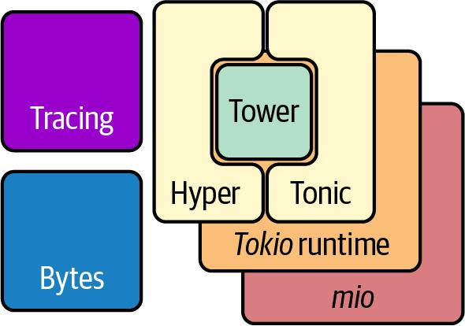


앞서 이번 장에서는 `hyper`를 우리 런타임에 연결해 보았습니다. 전체적인 그림을 파악하기 위해 이제 `mio`를 살펴보고 런타임에 통합해 보겠습니다. 진행하기 전에 `Cargo.toml`에 다음 의존성을 추가해야 합니다:

```rust
mio = { version = "1.0.2", features = ["net", "os-poll"] }
```

또한 다음과 같은 임포트가 필요합니다:

```rust
use mio::net::{TcpListener, TcpStream};
use mio::{Events, Interest, Poll as MioPoll, Token};
use std::io::{Read, Write};
use std::time::Duration;
use std::error::Error;
use std::future::Future;
use std::pin::Pin;
use std::task::{Context, Poll};
```

> **mio 대 hyper**
>
> 이번 장에서 다루는 `mio` 탐색은 TCP 서버를 구축하는 최적의 접근 방식은 아닙니다. 프로덕션 서버를 만들고자 한다면 다음과 같은 `hyper` 예제와 유사한 방식을 취해야 합니다:
>
> ```rust
> #[tokio::main]
> async fn main() -> Result<(), Box<dyn std::error::Error + Send + Sync>> {
>     let addr = SocketAddr::from(([127, 0, 0, 1], 3000));
>     let listener = TcpListener::bind(addr).await?;
>     loop {
>         let (stream, _) = listener.accept().await?;
>         let io = TokioIo::new(stream);
>         tokio::task::spawn(async move {
>             if let Err(err) = http1::Builder::new()
>                 .serve_connection(io, service_fn(hello))
>                 .await
>             {
>                 println!("Error serving connection: {:?}", err);
>             }
>         });
>     }
> }
> ```
>
> 메인 스레드는 들어오는 데이터를 기다리며, 데이터가 도착하면 이를 처리하기 위해 새로운 작업이 스폰됩니다. 이렇게 하면 리스너가 더 많은 수신 데이터를 계속 수락할 수 있는 준비 상태를 유지합니다. `mio` 예제는 TCP 연결 폴링이 어떻게 동작하는지 이해하는 데 도움이 되겠지만, 웹 애플리케이션을 구축할 때는 프레임워크나 라이브러리가 제공하는 리스너를 사용하는 것이 가장 합리적입니다. 예제에 맥락을 제공하기 위해 몇 가지 웹 개념을 논의하겠지만, 웹 개발 전반에 대한 포괄적인 내용은 이 책의 범위를 벗어납니다.

모든 기초 작업이 끝났으니 이제 퓨처 내에서 TCP 소켓을 폴링하는 단계로 넘어갈 수 있습니다.

### 퓨처에서 소켓 폴링하기

`mio` 크레이트는 수많은 소켓(수천 개)을 처리하도록 제작되었습니다. 따라서 어떤 소켓이 알림을 발생시켰는지 식별해야 합니다. 토큰(Token)을 사용하면 이를 식별할 수 있습니다. 이벤트 루프에 소켓을 등록할 때 토큰을 함께 전달하면, 핸들러에서 해당 토큰이 반환됩니다. 토큰은 `usize`를 감싼 튜플 구조체입니다. 모든 OS가 소켓과 포인터 크기만큼의 데이터를 연결할 수 있도록 허용하기 때문입니다. 따라서 핸들러에서는 토큰을 키로 삼아 소켓과 매핑하는 함수를 둘 수 있습니다. 여기서 `mio`가 콜백을 사용하지 않는 이유는 제로 비용 추상화(zero-cost abstraction)를 원하기 때문이며, 토큰이 이를 달성할 수 있는 유일한 방법입니다. 콜백, 스트림, 퓨처 등은 `mio` 위에 구축할 수 있습니다.

토큰을 사용하면 다음과 같은 단계가 진행됩니다:

1. 이벤트 루프에 소켓을 등록합니다.
2. 소켓의 준비 완료(readiness) 상태를 기다립니다.
3. 토큰을 사용하여 소켓 상태를 조회합니다.
4. 소켓에 대해 작업을 수행합니다.
5. 반복합니다.

우리의 단순한 예제에서는 복잡한 매핑이 필요 없으므로 다음과 같은 코드로 토큰을 정의합니다:

```rust
const SERVER: Token = Token(0);
const CLIENT: Token = Token(1);

struct ServerFuture {
    server: TcpListener,
    poll: MioPoll,
}
```

여기서는 각 토큰이 고유한지만 확인하면 됩니다. `Token`에 전달되는 정수는 다른 토큰과 구별하는 데 사용됩니다. 이제 토큰이 준비되었으므로 소켓을 폴링할 퓨처를 정의합니다:

```rust
impl Future for ServerFuture {
    type Output = String;

    fn poll(mut self: Pin<&mut Self>, cx: &mut Context<'_>) -> Poll<Self::Output> {
        // ...
    }
}
```

수신 데이터를 받기 위해 `TcpListener`를 사용하고, 소켓을 폴링하여 소켓이 읽기 가능한 상태가 되었을 때 퓨처에 알리기 위해 `MioPoll`을 사용합니다. 퓨처의 `poll` 함수 내부에서는 이벤트를 정의하고 소켓을 폴링할 수 있습니다:

```rust
let mut events = Events::with_capacity(1);
let _ = self.poll.poll(
    &mut events,
    Some(Duration::from_millis(200))
).unwrap();

for event in events.iter() {
    // ...
}

cx.waker().wake_by_ref();
return Poll::Pending;
```

폴링은 소켓에서 발생한 이벤트를 `events` 반복자로 추출합니다. 또한 소켓 폴링 타임아웃을 200ms로 설정했습니다. 소켓에 이벤트가 없으면 아무런 이벤트 없이 넘어가며 `Pending`을 반환합니다. 이벤트가 발생할 때까지 계속 폴링을 수행합니다.

이벤트가 수신되면 반복문을 통해 이벤트를 순회합니다. 앞선 코드에서는 용량(capacity)을 1로 설정했지만, 필요하다면 여러 이벤트를 처리할 수 있도록 용량을 늘릴 수 있습니다. 이벤트를 처리할 때는 이벤트 유형을 확인해야 합니다. 우리의 퓨처에서는 소켓이 읽기 가능하고 토큰이 `SERVER` 토큰인지 확인해야 합니다:

```rust
if event.token() == SERVER && event.is_readable() {
    let (mut stream, _) = self.server.accept().unwrap();
    let mut buffer = [0u8; 1024];
    let mut received_data = Vec::new();
    loop {
        // ...
    }
    if !received_data.is_empty() {
        let received_str = String::from_utf8_lossy(&received_data);
        return Poll::Ready(received_str.to_string());
    }
    return Poll::Pending;
}
cx.waker().wake_by_ref();
```

소켓에 데이터가 들어있으면 이벤트는 읽기 가능한 상태가 됩니다. 올바른 이벤트인 경우 `TcpStream`을 추출하고 `Vec`을 사용하여 힙에 `received_data` 컬렉션을 정의한 뒤, 버퍼 슬라이스를 사용하여 읽기를 수행합니다. 데이터가 비어 있으면 데이터가 아직 도착하지 않은 것이므로 소켓을 다시 폴링할 수 있도록 `Pending`을 반환합니다. 그런 다음 데이터를 문자열로 변환하고 `Ready`와 함께 반환합니다. 이는 데이터를 획득한 후 소켓 리스너가 종료됨을 의미합니다.

> [!TIP]
> 프로그램의 수명 주기 내내 소켓이 지속적으로 폴링되기를 원한다면, 다음과 같이 데이터를 받아 처리하는 비동기 함수로 데이터를 전달하는 분리된 작업(detached task)을 스폰하면 됩니다:
>
> ```rust
> if !received_data.is_empty() {
>     spawn_task!(some_async_handle_function(&received_data))
>         .detach();
>     return Poll::Pending;
> }
> ```

루프 안에서는 소켓으로부터 데이터를 읽습니다:

```rust
loop {
    match stream.read(&mut buffer) {
        Ok(n) if n > 0 => {
            received_data.extend_from_slice(&buffer[..n]);
        }
        Ok(_) => {
            break;
        }
        Err(e) => {
            eprintln!("Error reading from stream: {}", e);
            break;
        }
    }
}
```

수신된 메시지가 버퍼보다 크더라도 상관없습니다. 루프가 계속해서 처리할 모든 바이트를 추출하여 `Vec`에 추가하기 때문입니다. 더 이상 바이트가 없으면 루프를 종료하고 데이터를 처리할 수 있습니다.

이제 소켓에서 데이터를 수신할 때까지 계속 폴링되는 퓨처가 완성되었습니다. 데이터를 수신한 후 이 퓨처는 종료됩니다. 물론 이 퓨처가 소켓을 지속적으로 폴링하도록 만들 수도 있습니다. 필요한 경우 이러한 지속 폴링 퓨처를 사용하여 수천 개의 소켓을 관리할 수 있다고 볼 수 있습니다. 소켓당 하나의 퓨처를 두고 수천 개의 퓨처를 런타임에 스폰하는 방식입니다. 이제 `TcpListener` 로직을 정의했으므로, 소켓을 통해 퓨처로 데이터를 전송하는 클라이언트 로직으로 넘어갈 수 있습니다.

### 소켓을 통해 데이터 전송하기

클라이언트의 경우 모든 것을 `main` 함수에서 실행합니다:

```rust
fn main() -> Result<(), Box<dyn Error>> {
    Runtime::new().with_low_num(2).with_high_num(4).run();
    // ...
    Ok(())
}
```

`main`에서는 먼저 리스너와 클라이언트용 스트림을 생성합니다:

```rust
let addr = "127.0.0.1:13265".parse()?;
let mut server = TcpListener::bind(addr)?;
let mut stream = TcpStream::connect(server.local_addr()?)?;
```

이 예제에서는 하나의 스트림만 필요하지만, 필요한 경우 여러 스트림을 생성할 수도 있습니다. 서버를 `mio` 폴에 등록하고, 서버와 폴을 사용하여 리스너 작업을 스폰합니다:

```rust
let poll: MioPoll = MioPoll::new()?;
poll.registry()
    .register(&mut server, SERVER, Interest::READABLE)?;

let server_worker = ServerFuture {
    server,
    poll,
};
let test = spawn_task!(server_worker);
```

이제 작업이 수신 이벤트를 감지하기 위해 TCP 포트를 지속적으로 폴링합니다. 그런 다음 쓰기 가능(writable) 이벤트를 위해 `CLIENT` 토큰으로 또 다른 폴을 생성합니다. 소켓이 가득 차지 않았다면 쓸 수 있습니다. 소켓이 가득 차면 더 이상 쓸 수 없으며 플러시되어야 합니다. 클라이언트 폴은 다음과 같은 형태를 취합니다:

```rust
let mut client_poll: MioPoll = MioPoll::new()?;
client_poll.registry()
    .register(&mut stream, CLIENT, Interest::WRITABLE)?;
```

`mio`를 사용하면 소켓이 읽기 가능하거나 쓰기 가능한 경우 트리거되는 폴도 생성할 수 있습니다:

```rust
client_poll.registry().register(
    &mut server,
    SERVER,
    Interest::READABLE | Interest::WRITABLE,
)?;
```

폴을 생성했으므로 이제 쓰기 전에 소켓이 쓰기 가능한 상태가 될 때까지 기다릴 수 있습니다. 다음 폴 호출을 사용합니다:

```rust
let mut events = Events::with_capacity(128);
let _ = client_poll.poll(
    &mut events,
    None,
).unwrap();
```

타임아웃에 `None`이 지정되어 있음에 주목하십시오. 이는 폴 호출에 의해 이벤트가 반환될 때까지 현재 스레드가 블로킹됨을 의미합니다. 이벤트가 발생하면 소켓으로 간단한 메시지를 전송합니다:

```rust
for event in events.iter() {
    if event.token() == CLIENT && event.is_writable() {
        let message = "that's so dingo!\n";
        let _ = stream.write_all(message.as_bytes());
    }
}
```

메시지가 전송되었으므로 이제 스레드를 블로킹하고 메시지를 출력할 수 있습니다:

```rust
let outcome = future::block_on(test);
println!("outcome: {}", outcome);
```

코드를 실행하면 다음과 같은 출력이 나타날 수 있습니다:

```text
Error reading from stream: Resource temporarily unavailable (os error 35)
outcome: that's so dingo!
```

정상적으로 작동하지만 초기에 에러가 출력됩니다. 이는 논블로킹 TCP 리스너로 인해 발생할 수 있는 현상입니다. `mio`는 논블로킹 방식으로 동작합니다. `Resource temporarily unavailable` 에러는 대개 소켓에 사용할 수 있는 데이터가 없을 때 발생합니다. TCP 스트림이 생성될 때 이런 일이 발생할 수 있지만, 루프에서 이러한 에러를 처리하고 소켓이 계속 폴링될 수 있도록 `Pending`을 반환하므로 문제가 되지 않습니다:

```rust
use std::io::ErrorKind;
// ...
Err(ref e) if e.kind() == ErrorKind::WouldBlock => {
    cx.waker().wake_by_ref();
    return Poll::Pending;
}
```

`mio` 폴링 기능을 통해 TCP 소켓을 거치는 비동기 통신을 구현했습니다. `mio`를 사용하여 `UnixDatagram`을 통해 프로세스 간에 데이터를 전송할 수도 있습니다. `UnixDatagram`은 동일한 머신 내에서 데이터를 전송하는 것으로 제한된 소켓입니다. 이 때문에 `UnixDatagram`은 더 빠르고, 문맥 전환(context switching)이 적게 필요하며, 네트워크 스택을 거칠 필요가 없습니다.

### 요약

마침내 우리의 비동기 런타임이 단순한 수면(sleep)과 출력(print)을 넘어 다른 작업을 수행하도록 만들었습니다. 이번 장에서는 서드파티 크레이트를 런타임에 통합하는 데 트레이트가 어떻게 도움이 되는지 살펴보았으며, `mio`를 통해 TCP 소켓을 직접 폴링하는 더 낮은 수준까지 내려가 보았습니다. 커스텀 비동기 런타임을 구동하는 데 있어 트레이트 문서만 참고할 수 있다면 더 이상 방해될 것이 없습니다. 지금까지 얻은 비동기 지식을 더 확고히 하고 싶다면 다양한 엔드포인트를 처리하는 기본 웹 서버를 직접 만들어 볼 수 있는 단계에 이르렀습니다. 모든 통신을 `mio`로 구현하는 것은 까다롭겠지만, 순수 비동기 프로그래밍 목적으로만 사용하는 것은 훨씬 간단합니다. `hyper`의 `HttpListener`가 복잡한 프로토콜을 대신 처리해 주므로 요청을 비동기 작업으로 전달하고 클라이언트에 응답하는 데 집중할 수 있습니다.

이 책의 여정에서는 웹 프로그래밍보다는 비동기 프로그래밍 자체에 초점을 맞추고 있습니다. 따라서 이제 특정 문제를 해결하기 위해 비동기 프로그래밍을 구현하는 방법으로 나아갈 것입니다. 5장의 코루틴(coroutine)부터 시작합니다.

# 제5장 코루틴

이 책의 이 단계까지 오셨다면 비동기 프로그래밍에 꽤 익숙해지셨을 것입니다. 이제 코드에서 `await` 문법을 보면 그 이면에서 퓨처(future), 태스크(task), 스레드(thread), 큐(queue)가 어떻게 동작하는지 알 수 있습니다. 그렇다면 비동기 프로그래밍의 기초 구성 요소는 어떨까요? 비동기 런타임 없이도 코드를 일시 정지(pause)했다가 다시 재개(resume)할 수 있다면 어떨까요? 더 나아가, 이 일시 정지 및 재개 메커니즘을 일반 테스트로 검증하여 다양한 폴링(polling) 순서와 구성에서 코드가 어떻게 동작하는지 살펴볼 수 있다면 어떨까요? 또한 이 메커니즘은 동기 코드와 비동기 코드 사이의 인터페이스 역할도 할 수 있습니다. 바로 여기서 코루틴(coroutine)이 등장합니다.

이 장을 마치면 코루틴을 정의하고 활용 방법을 설명할 수 있게 됩니다. 또한 메모리를 많이 필요로 하는 작업에서 메모리 소비를 낮게 유지하도록 자신의 프로그램에 코루틴을 통합할 수 있습니다. 나아가 코루틴으로 비동기 런타임 없이 비동기 기능을 흉내 내고 기본적인 실행기(executor)를 구현하여, 메인 스레드에서도 비동기 기능을 얻고 코루틴이 폴링되는 시점과 순서를 세밀하게 제어할 수 있습니다.

> [!NOTE]
> 집필 시점 기준으로 우리는 나이틀리(nightly) Rust의 코루틴 문법을 사용하고 있습니다. 향후 문법이 변경되었거나 코루틴 문법이 안정(stable) Rust에 도입되었을 수도 있습니다. 문법 변경이 성가실 수는 있지만, 이 장에서 다루는 것은 코루틴의 본질적인 기본 원리입니다. 문법이 다소 바뀌더라도 코루틴의 전반적인 구현 방식과 활용법에는 영향을 주지 않습니다.

##### 코루틴 소개

코루틴을 본격적으로 살펴보기 전에, 먼저 코루틴이 무엇이고 왜 사용해야 하는지 이해할 필요가 있습니다.

### 코루틴이란 무엇인가?

코루틴은 실행을 일시 정지(pause)했다가 나중에 중단했던 지점부터 다시 재개(resume)할 수 있는 특별한 유형의 프로그램입니다. 이는 끝까지 실행된 후 일반적으로 값을 반환하거나 에러를 발생시키는 일반 서브루틴(함수 등)과는 다릅니다. 그림 5-1은 두 방식의 비교를 보여줍니다.

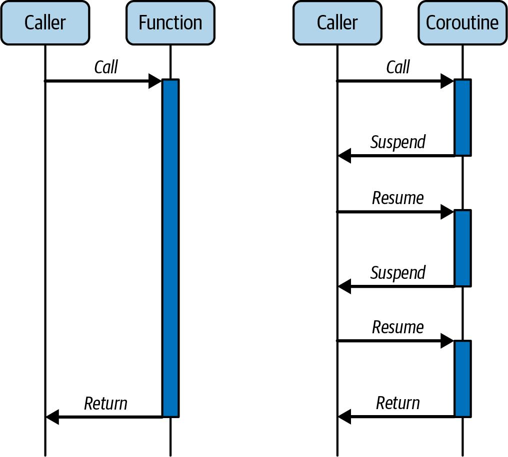


코루틴을 서브루틴과 비교해 보겠습니다. 서브루틴은 시작된 후 처음부터 끝까지 실행되며, 특정 인스턴스는 단 한 번만 반환됩니다. 반면 코루틴은 여러 방식으로 빠져나올 수 있습니다. 서브루틴처럼 완전히 끝날 수도 있지만, 양보(yielding)라는 과정을 통해 다른 코루틴을 호출하면서 빠져나갔다가 나중에 동일한 지점으로 다시 돌아올 수도 있습니다. 따라서 코루틴은 일시 정지된 동안 상태를 저장하여 추적을 유지합니다.

코루틴은 Rust에만 국한된 개념이 아니며, 여러 언어에 다양한 코루틴 구현체가 존재합니다. 이들은 모두 실행을 일시 정지하고 재개할 수 있도록 다음과 같은 동일한 기본 특성을 공유합니다:

- **비차단(Nonblocking)**: 코루틴이 일시 정지될 때 실행 스레드를 블로킹(차단)하지 않습니다.
- **상태 유지(Stateful)**: 코루틴은 일시 정지될 때 자신의 상태를 저장할 수 있으며, 재개될 때 해당 상태부터 계속 진행할 수 있습니다. 처음부터 다시 시작할 필요가 없습니다.
- **협력적(Cooperative)**: 코루틴은 통제된 방식으로 일시 정지되고 나중에 재개될 수 있습니다.

이제 코루틴이 스레드와 어떻게 비슷한지 생각해 보겠습니다. 겉보기에는 작업을 실행하고 나중에 일시 정지/재개한다는 점에서 꽤 유사해 보입니다. 차이점은 스케줄링 방식에 있습니다. 스레드는 선점형(preemptive)으로 스케줄링됩니다. 즉, 나중에 작업이 재개될 목적으로 외부 스케줄러에 의해 작업이 인터럽트(중단)됩니다. 반면 코루틴은 협력적(cooperative)입니다. 스케줄러나 OS의 개입 없이도 스스로 일시 정지하거나 다른 코루틴에 양보(yield)할 수 있습니다.

코루틴을 사용하는 것이 매우 좋아 보이는데, 그렇다면 굳이 `async`/`await`를 사용할 필요가 있을까요? 프로그래밍의 모든 것이 그렇듯 여기에도 트레이드오프(절충점)가 있습니다. 먼저 장점부터 살펴보겠습니다. 코루틴은 동일한 스레드 내에서 실행되므로 뮤텍스(mutex)와 같은 동기화 원어가 필요 없습니다. 이는 결코 사소하지 않은 이점으로, 코드를 이해하고 작성하기가 훨씬 쉬워집니다. 단일 스레드 내에서 코루틴 사이를 전환하는 비용은 스레드 간 전환 비용보다 훨씬 저렴합니다. 이는 대기 시간이 긴 작업에서 특히 유용합니다. 예를 들어 100개 파일의 변경 사항을 추적해야 한다고 가정해 보겠습니다. OS가 각 파일을 순회하며 확인하는 스레드 100개를 스케줄링하게 만드는 것은 매우 번거롭고 부담스럽습니다. 컨텍스트 스위칭은 연산 비용이 많이 듭니다. 대신 100개의 코루틴이 각자 감시 중인 파일의 변경 여부를 확인하고, 변경이 발생했을 때 해당 파일을 스레드 풀로 전달하여 처리하도록 만드는 것이 훨씬 효율적이고 수월합니다.

단일 스레드에서 코루틴을 사용할 때의 주요 단점은 컴퓨터의 컴퓨팅 능력을 온전히 활용하지 못한다는 점입니다. 하나의 스레드에서 프로그램을 실행한다는 것은 여러 코어에 작업을 분산시키지 못한다는 뜻입니다. 이제 코루틴이 무엇인지 알았으니, 왜 코루틴을 사용해야 하는지 살펴보겠습니다.

### 왜 코루틴을 사용하는가?

높은 수준에서 볼 때, 코루틴을 사용하면 연산을 일시 정지하고, 코루틴을 실행한 스레드에 제어권을 양보한 다음, 필요할 때 연산을 다시 재개할 수 있습니다. 이는 비동기(async)와 매우 유사하게 들립니다. 비동기 태스크 역시 폴링을 통해 다른 태스크가 실행될 수 있도록 제어권을 양보할 수 있습니다. 멀티스레딩에서는 채널이나 `Sync` 원어로 래핑된 데이터 구조를 통해 스레드로 데이터를 보내고 필요에 따라 스레드를 확인할 수 있습니다. 반면 코루틴은 비동기 런타임이나 스레드 없이도 웨이커(waker)와 함께 연산을 일시 중단하고 재개할 수 있게 해 줍니다.

다소 추상적으로 느껴질 수 있으므로, 간단한 파일 쓰기 예제를 통해 코루틴 사용의 장점을 설명해 보겠습니다. 수많은 정수를 전달받아 파일에 써야 하는 상황을 가정해 보겠습니다. 다른 프로그램으로부터 숫자를 전달받고 있는데, 모든 숫자를 다 받을 때까지 기다렸다가 쓰기를 시작할 수는 없습니다. 그렇게 하면 메모리를 너무 많이 차지하기 때문입니다.

이번 실습을 위해 다음 의존성이 필요합니다:

```toml
[dependencies]
rand = "0.8.5"
```

시연 코드를 작성하기 전에 다음과 같은 임포트가 필요합니다:

```rust
#![feature(coroutines)]
#![feature(coroutine_trait)]

use std::fs::{OpenOptions, File};
use std::io::{Write, self};
use std::time::Instant;
use rand::Rng;
use std::ops::{Coroutine, CoroutineState};
use std::pin::Pin;
```

또한 `Cargo.toml`에 `rand` 크레이트가 필요합니다. 간단한 파일 쓰기 실습치고는 임포트가 다소 과해 보일 수 있지만, 예제를 진행하면서 이들이 어떻게 활용되는지 보게 될 것입니다. `#![feature(...)]` 매크로는 실험적 기능을 활성화하기 위한 것입니다.

먼저 단순한 파일 쓰기 예제로 다음과 같은 함수를 작성합니다:

```rust
fn append_number_to_file(n: i32) -> io::Result<()> {
    let mut file = OpenOptions::new()
        .create(true)
        .append(true)
        .open("numbers.txt")?;
    writeln!(file, "{}", n)?;
    Ok(())
}
```

이 함수는 파일을 열고 내용을 씁니다. 이제 이를 테스트하고 성능을 측정하기 위해 20만 개의 난수 정수를 생성하고 이를 반복문으로 순회하며 파일에 씁니다. 또한 다음 코드로 이 연산의 시간을 측정합니다:

```rust
fn main() -> io::Result<()> {
    let mut rng = rand::thread_rng();
    let numbers: Vec<i32> = (0..200000).map(|_| rng.gen()).collect();
    let start = Instant::now();
    for &number in &numbers {
        if let Err(e) = append_number_to_file(number) {
            eprintln!("Failed to write to file: {}", e);
        }
    }
    let duration = start.elapsed();
    println!("Time elapsed in file operations is: {:?}", duration);
    Ok(())
}
```

집필 시점 기준으로 이 테스트를 완료하는 데 약 4.39초가 걸렸습니다. 이는 그리 빠르지 않은데, 매번 파일을 열면서 권한을 확인하고 파일 메타데이터를 갱신하는 오버헤드가 발생하기 때문입니다.

이제 정수 쓰기를 처리하기 위해 코루틴을 도입해 보겠습니다. 먼저 파일 디스크립터를 보관하는 구조체를 정의합니다:

```rust
struct WriteCoroutine {
    pub file_handle: File,
}

impl WriteCoroutine {
    fn new(path: &str) -> io::Result<Self> {
        let file_handle = OpenOptions::new()
            .create(true)
            .append(true)
            .open(path)?;
        Ok(Self { file_handle })
    }
}
```

그런 다음 `Coroutine` 트레이트를 구현합니다:

```rust
impl Coroutine<i32> for WriteCoroutine {
    type Yield = ();
    type Return = ();

    fn resume(mut self: Pin<&mut Self>, arg: i32) -> CoroutineState<Self::Yield, Self::Return> {
        writeln!(self.file_handle, "{}", arg).unwrap();
        CoroutineState::Yielded(())
    }
}
```

우리의 코루틴은 `type Yield = ();` 및 `type Return = ();` 타입에서 알 수 있듯이, 중간 값을 양보하지도 않고 최종 결과를 반환하지도 않도록 구성되어 있습니다. 이에 대해서는 나중에 다시 다루겠지만, 중요한 점은 `CoroutineState::Yielded`를 반환한다는 것입니다. 이는 퓨처에서 `Pending`을 반환하는 것과 유사하지만 `Yield` 타입이 함께 반환됩니다. 또한 퓨처의 `Ready`와 유사한 `CoroutineState::Complete`를 반환할 수도 있습니다.

테스트에서는 코루틴을 생성하고 숫자를 순회하면서 다음 코드로 `resume` 함수를 호출할 수 있습니다:

```rust
let mut coroutine = WriteCoroutine::new("numbers.txt")?;
for &number in &numbers {
    Pin::new(&mut coroutine).resume(number);
}
```

이렇게 업데이트된 테스트는 대략 622.6ms 정도의 시간을 보여줍니다. 이는 약 6배 더 빠릅니다. 물론 루프 안에서 파일 디스크립터를 한 번만 생성해 참조하기만 해도 동일한 효과를 얻을 수 있었겠지만, 이는 코루틴의 상태를 일시 중단하고 필요할 때 재개하는 데 분명한 이점이 있음을 보여줍니다. 우리는 쓰기 로직을 격리된 상태로 유지하면서도 그러한 속도 향상을 위해 어떤 스레드나 비동기 런타임도 필요로 하지 않았습니다. 코루틴은 연산을 일시 중단하고 재개하기 위한 스레드 및 비동기 태스크 내부의 기초 구성 요소가 될 수 있습니다.

> [!NOTE]
> `Future` 트레이트와 `Coroutine` 트레이트를 구현하는 것 사이의 유사점을 눈치챘을 것입니다. 두 가지 가능한 상태가 존재하고, 두 가지 결과에 따라 재개하거나 완료하며, 코루틴과 비동기 태스크 모두 일시 중단하고 재개합니다. 넓은 의미에서 비동기 태스크는 코루틴의 일종이라고 볼 수 있으며, 차이점은 다른 스레드로 전송되어 실행기에 의해 폴링된다는 점입니다.

코루틴은 활용처가 매우 넓습니다. 네트워크 요청 처리, 빅데이터 처리, UI 애플리케이션 등에 사용할 수 있습니다. 콜백을 사용하는 방식에 비해 비동기 태스크를 훨씬 간단하게 다룰 수 있는 방법을 제공합니다. 코루틴을 활용하면 큐나 별도의 실행기 없이도 단일 스레드에서 비동기 기능을 구현할 수 있습니다.

### 코루틴을 활용한 생성

파이썬(Python)과 같은 다른 언어에서 제너레이터(generator) 개념을 접해 보았을 것입니다. 제너레이터는 코루틴의 하위 집합으로, 때로는 '약한 코루틴(weak coroutines)'이라고도 불립니다. 다른 코루틴이 아니라 자신을 호출한 프로세스에 항상 제어권을 다시 양보(yield)하기 때문에 이렇게 불립니다.

제너레이터를 사용하면 게으르게(lazily, 지연 평가로) 작업을 수행할 수 있습니다. 필요할 때만 동작할 수 있으므로, 지연 연산은 오직 필요할 때만 출력값을 양보(생성)합니다. 이는 계산을 수행하거나, 네트워크를 통해 연결을 맺거나, 데이터를 로드하는 작업일 수 있습니다. 이러한 지연 평가는 메모리에 올리기 비효율적이거나 불가능한 대규모 데이터 세트를 다룰 때 특히 유용합니다. `range`와 같은 이터레이터도 값의 시퀀스를 지연 생성할 수 있다는 점에서 유사한 목적을 제공합니다.

Rust 언어는 계속 발전하고 있으며, 개발 중인 영역 중 하나가 비동기 제너레이터(async generators)라는 점도 주목할 만합니다. 이는 비동기 컨텍스트에서 값을 생성할 수 있는 특별한 유형의 제너레이터입니다. 이 분야의 작업은 현재 진행 중이며, 자세한 내용은 Rust RFC Book 사이트를 참조하십시오.

이제 이론을 실습에 적용하여 첫 번째 간단한 제너레이터를 작성해 보겠습니다.

#### Rust에서 간단한 제너레이터 구현하기

데이터 파일에 담긴 대규모 데이터 구조에서 정보를 가져오고 싶다고 가정해 보겠습니다. 데이터 파일이 매우 커서 이상적으로는 한 번에 메모리에 전부 로드하고 싶지 않습니다. 이번 예제에서는 스트리밍을 시연하기 위해 단 5줄로 이루어진 아주 작은 데이터 파일을 사용할 것입니다. 이것은 교육용 예제일 뿐이며, 실제 환경에서 5줄짜리 데이터 파일을 읽는 데 제너레이터를 사용하는 것은 과도한 일(overkill)이라는 점을 기억하십시오! 직접 만들어 볼 수도 있습니다. 우리는 프로젝트에 각 줄마다 숫자가 하나씩 적힌 5줄짜리 `data.txt` 데이터 파일을 저장해 두었습니다.

이전 예제에서 사용했던 코루틴 기능이 필요하므로 해당 컴포넌트들을 임포트합니다:

```rust
#![feature(coroutines)]
#![feature(coroutine_trait)]

use std::fs::File;
use std::io::{self, BufRead, BufReader};
use std::ops::{Coroutine, CoroutineState};
use std::pin::Pin;
```

이제 `ReadCoroutine` 구조체를 만듭니다:

```rust
struct ReadCoroutine {
    lines: io::Lines<BufReader<File>>,
}

impl ReadCoroutine {
    fn new(path: &str) -> io::Result<Self> {
        let file = File::open(path)?;
        let reader = BufReader::new(file);
        let lines = reader.lines();
        Ok(Self { lines })
    }
}
```

그런 다음 이 구조체에 대해 `Coroutine` 트레이트를 구현합니다. 입력 파일에는 1부터 5까지의 숫자가 포함되어 있으므로 `i32`를 양보(yield)할 것입니다:

```rust
impl Coroutine<()> for ReadCoroutine {
    type Yield = i32;
    type Return = ();

    fn resume(mut self: Pin<&mut Self>, _arg: ()) -> CoroutineState<Self::Yield, Self::Return> {
        match self.lines.next() {
            Some(Ok(line)) => {
                if let Ok(number) = line.parse::<i32>() {
                    CoroutineState::Yielded(number)
                } else {
                    CoroutineState::Complete(())
                }
            }
            Some(Err(_)) | None => CoroutineState::Complete(()),
        }
    }
}
```

이 코루틴에는 제너레이터 밖으로 값을 양보할 수 있게 해 주는 yield 문이 포함되어 있습니다. 코루틴 트레이트는 오직 하나의 필수 메서드인 `resume`만 가지고 있습니다. 이를 통해 이전 실행 지점부터 다시 실행을 재개할 수 있습니다. 우리의 경우 `resume` 메서드는 파일에서 줄을 읽고, 이를 정수로 파싱한 다음, 더 이상 양보할 줄이 없을 때까지 숫자를 양보하고 그 시점에서 완료(complete)됩니다.

이제 테스트 파일에 대해 함수를 호출해 보겠습니다:

```rust
fn main() -> io::Result<()> {
    let mut coroutine = ReadCoroutine::new("./data.txt")?;
    loop {
        match Pin::new(&mut coroutine).resume(()) {
            CoroutineState::Yielded(number) => println!("{:?}", number),
            CoroutineState::Complete(()) => break,
        }
    }
    Ok(())
}
```

그러면 다음과 같은 출력을 얻을 수 있습니다:

```
1
2
3
4
5
```

> [!NOTE]
> `Coroutine` 트레이트는 이전에 `Generator` 트레이트 및 `GeneratorState`로 알려져 있었으며, 2023년 말에 이름 변경이 이루어졌습니다. 이미 구버전의 나이틀리 Rust가 설치되어 있다면 이 코드가 작동하도록 업데이트해야 합니다.

이제 두 코루틴이 서로에게 양보하면서 함께 동작하는 방식으로 넘어가 보겠습니다. 여기서부터 코루틴 사용의 진정한 강력함을 확인하기 시작할 것입니다.

### 코루틴 중첩 및 연계

이 섹션에서는 두 코루틴이 순차적으로 어떻게 사용될 수 있는지 보여주기 위해 파일 전송을 예로 들겠습니다. 이는 파일이 너무 커서 모든 데이터를 메모리에 담을 수 없을 때 유용합니다. 하지만 데이터를 한 번에 조금씩 전송하면 메모리 부족 없이 모든 데이터를 전송할 수 있습니다. 이 솔루션을 구현하기 위해 한 코루틴은 파일을 읽고 값을 양보하며, 다른 코루틴은 값을 받아 파일에 씁니다.

이 장의 첫 섹션에서 만들었던 `ReadCoroutine`을 재사용하고 `WriteCoroutine`을 추가할 것입니다. 앞선 예제에서는 `numbers.txt`라는 파일에 20만 개의 난수를 썼습니다. 이를 전송할 파일로 재사용해 보겠습니다. `numbers.txt`를 읽어서 `output.txt`라는 파일에 쓸 것입니다.

경로를 하드코딩하는 대신 경로를 인자로 받도록 `WriteCoroutine`을 약간 수정합니다:

```rust
struct WriteCoroutine {
    pub file_handle: File,
}

impl WriteCoroutine {
    fn new(path: &str) -> io::Result<Self> {
        let file_handle = OpenOptions::new()
            .create(true)
            .append(true)
            .open(path)?;
        Ok(Self { file_handle })
    }
}
```

이제 읽기 및 쓰기 코루틴을 가지는 매니저를 만듭니다:

```rust
struct CoroutineManager {
    reader: ReadCoroutine,
    writer: WriteCoroutine,
}
```

파일 전송을 시작하는 함수를 만들어야 합니다. 먼저 코루틴 매니저를 인스턴스화하는 `new` 함수를 만듭니다. 이 함수는 읽기 및 쓰기 파일 경로를 설정합니다. 두 번째로 `run`이라는 새 함수를 만듭니다. 프로그램 수명 동안 사용할 수 있도록 읽기와 쓰기 코루틴을 메모리에 핀(pin) 고정해야 합니다.

그런 다음 읽기와 쓰기 기능을 결합한 루프를 만듭니다. 리더 코루틴은 `Yielded` 또는 `Complete` 중 하나와 매칭됩니다. `Yielded`인 경우(즉, 출력이 있는 경우) 라이터 코루틴이 이를 받아 파일에 씁니다.

더 이상 읽을 숫자가 없으면 루프를 빠져나옵니다. 전체 코드는 다음과 같습니다:

```rust
impl CoroutineManager {
    fn new(read_path: &str, write_path: &str) -> io::Result<Self> {
        let reader = ReadCoroutine::new(read_path)?;
        let writer = WriteCoroutine::new(write_path)?;
        Ok(Self {
            reader,
            writer,
        })
    }

    fn run(&mut self) {
        let mut read_pin = Pin::new(&mut self.reader);
        let mut write_pin = Pin::new(&mut self.writer);
        loop {
            match read_pin.as_mut().resume(()) {
                CoroutineState::Yielded(number) => {
                    write_pin.as_mut().resume(number);
                }
                CoroutineState::Complete(()) => break,
            }
        }
    }
}
```

이를 `main`에서 사용할 수 있습니다:

```rust
fn main() {
    let mut manager = CoroutineManager::new("numbers.txt", "output.txt").unwrap();
    manager.run();
}
```

이를 실행하고 나면 새로 생성된 `output.txt` 파일을 열어 내용이 올바르게 들어갔는지 확인할 수 있습니다.

여기서 우리가 수행한 작업을 되짚어 보겠습니다. 본질적으로 우리는 파일 전송 프로그램을 만들었습니다. 한 코루틴은 파일을 한 줄씩 읽고 그 값을 다른 코루틴에 양보합니다. 이 코루틴은 값을 받아 파일에 씁니다. 둘 다 파일 핸들이 전체 실행 동안 열린 상태로 유지되므로 느린 I/O와 계속 씨름할 필요가 없습니다. 이러한 유형의 지연 로딩(lazy loading) 및 쓰기를 활용하면 한 번에 하나씩 여러 파일 전송을 처리하도록 프로그램을 대기열에 올릴 수 있습니다. 거시적인 관점에서 보면 이러한 접근 방식의 이점을 알 수 있습니다. 각각 수 기가바이트에 달하는 대용량 파일 100개를 한 위치에서 다른 위치로, 혹은 네트워크를 통해 이동하는 데에도 이 방식을 활용할 수 있습니다.

### 코루틴에서 코루틴 호출하기

이전 예제에서는 코루틴을 사용하여 값을 양보하고, 그 값을 라이터 코루틴이 받아 처리했습니다. 이 과정은 매니저에 의해 제어되었습니다. 이상적인 상황이라면 매니저의 필요성을 완전히 없애고 코루틴들이 서로를 직접 호출하며 데이터를 주고받도록 만들고 싶을 것입니다. 이를 대칭 코루틴(symmetric coroutines)이라고 부르며 다른 언어들에서도 사용됩니다. 이 기능은 Rust에서 (아직) 기본 표준으로 제공되지 않으므로, 이와 유사한 것을 구현하려면 `Yielded`와 `Complete` 문법에서 벗어나야 합니다.

우리는 `SymmetricCoroutine`이라는 자체 트레이트를 만들 것입니다. 이 트레이트는 입력을 받아 출력을 제공하는 `resume_with_input`이라는 단 하나의 함수를 가집니다:

```rust
trait SymmetricCoroutine {
    type Input;
    type Output;

    fn resume_with_input(self: Pin<&mut Self>, input: Self::Input) -> Self::Output;
}
```

이제 `ReadCoroutine`에 대해 이 트레이트를 구현할 수 있습니다. 이것은 `i32` 타입의 값을 출력합니다. 여기서는 더 이상 `Yielded`를 사용하지 않지만 여전히 라인 파서를 사용하고 있음에 유의하십시오. 이를 통해 필요한 값을 출력하게 됩니다:

```rust
impl SymmetricCoroutine for ReadCoroutine {
    type Input = ();
    type Output = Option<i32>;

    fn resume_with_input(mut self: Pin<&mut Self>, _input: ()) -> Self::Output {
        if let Some(Ok(line)) = self.lines.next() {
            line.parse::<i32>().ok()
        } else {
            None
        }
    }
}
```

`WriteCoroutine`에 대해서도 이 트레이트를 구현합니다:

```rust
impl SymmetricCoroutine for WriteCoroutine {
    type Input = i32;
    type Output = ();

    fn resume_with_input(mut self: Pin<&mut Self>, input: i32) -> Self::Output {
        writeln!(self.file_handle, "{}", input).unwrap();
    }
}
```

마지막으로 이를 `main`에서 결합합니다:

```rust
fn main() -> io::Result<()> {
    let mut reader = ReadCoroutine::new("numbers.txt")?;
    let mut writer = WriteCoroutine::new("output.txt")?;
    loop {
        let number = Pin::new(&mut reader).resume_with_input(());
        if let Some(num) = number {
            Pin::new(&mut writer).resume_with_input(num);
        } else {
            break;
        }
    }
    Ok(())
}
```

`main` 함수는 두 코루틴이 어떻게 협력해야 하는지 명시적으로 지시하고 있습니다. 여기에는 수동 스케줄링이 수반되므로 엄밀히 말해 진정한 대칭 코루틴의 기준을 충족하지는 못합니다. 우리는 교육적 실습으로서 대칭 코루틴의 일부 기능을 흉내 내고 있는 것입니다. 진정한 대칭 코루틴이라면 `main` 함수로 제어권을 반환할 필요 없이 리더에서 라이터로 제어권을 직접 넘겨줄 것입니다. 하지만 두 코루틴이 서로를 참조해야 하므로 Rust의 대여 규칙(borrowing rules)에 의해 이것이 제한됩니다. 그럼에도 불구하고, 이는 자신만의 코루틴을 작성함으로써 더 많은 기능을 제공할 수 있는 방법을 보여주는 유용한 예제입니다.

이제 비동기 동작을 살펴보고, 간단한 코루틴으로 이러한 기능 중 일부를 흉내 내는 방법으로 넘어가 보겠습니다.

### 코루틴으로 비동기 동작 흉내 내기

비동기 프로그래밍은 I/O를 기다리거나 조건이 충족되기를 기다리는 동안 작업을 일시 중단할 수 있게 해 줍니다. 모든 비동기 프로그래밍이 코루틴의 하위 집합이라는 강력한 주장이 제기될 수도 있습니다. 비동기 런타임은 본질적으로 여러 스레드에 걸쳐 실행되는 코루틴이라 할 수 있습니다.

간단한 예제를 통해 실행의 일시 중단을 시연해 볼 수 있습니다. 먼저 1초 동안 잠드는(sleep) 코루틴을 설정합니다.

이 실습을 위해 다음 임포트가 필요합니다:

```rust
#![feature(coroutines, coroutine_trait)]

use std::collections::VecDeque;
use std::ops::{Coroutine, CoroutineState};
use std::pin::Pin;
use std::time::Instant;
```

```rust
struct SleepCoroutine {
    pub start: Instant,
    pub duration: std::time::Duration,
}

impl SleepCoroutine {
    fn new(duration: std::time::Duration) -> Self {
        Self {
            start: Instant::now(),
            duration,
        }
    }
}

impl Coroutine<()> for SleepCoroutine {
    type Yield = ();
    type Return = ();

    fn resume(self: Pin<&mut Self>, _: ()) -> CoroutineState<Self::Yield, Self::Return> {
        if self.start.elapsed() >= self.duration {
            CoroutineState::Complete(())
        } else {
            CoroutineState::Yielded(())
        }
    }
}
```

우리는 동시에 실행될 3개의 `SleepCoroutine` 인스턴스를 설정할 것입니다. 각 인스턴스는 1초 동안 잠듭니다.

카운터를 생성하고 이를 사용하여 코루틴 큐를 순회하며 양보(yield) 또는 완료(complete)를 처리합니다. 마지막으로 전체 연산의 시간을 측정합니다:

```rust
fn main() {
    let mut sleep_coroutines = VecDeque::new();
    sleep_coroutines.push_back(
        SleepCoroutine::new(std::time::Duration::from_secs(1))
    );
    sleep_coroutines.push_back(
        SleepCoroutine::new(std::time::Duration::from_secs(1))
    );
    sleep_coroutines.push_back(
        SleepCoroutine::new(std::time::Duration::from_secs(1))
    );
    let mut counter = 0;
    let start = Instant::now();
    while counter < sleep_coroutines.len() {
        let mut coroutine = sleep_coroutines.pop_front().unwrap();
        match Pin::new(&mut coroutine).resume(()) {
            CoroutineState::Yielded(_) => {
                sleep_coroutines.push_back(coroutine);
            }
            CoroutineState::Complete(_) => {
                counter += 1;
            }
        }
    }
    println!("Took {:?}", start.elapsed());
}
```

이 코드는 완료까지 1초가 걸립니다. 각각 1초씩 걸리는 코루틴 3개를 실행하므로 총 3초가 걸릴 것이라 예상할 수도 있습니다. 시간이 단축되는 이유는 바로 이들이 코루틴이기 때문입니다. 즉, 실행을 일시 정지했다가 나중에 다시 재개할 수 있습니다. 여기서는 Tokio나 다른 비동기 런타임을 사용하지 않습니다. 모든 연산은 단일 스레드에서 실행되며, 단순히 일시 정지하고 재개할 뿐입니다.

어떤 면에서 우리는 이 사용 사례를 위한 맞춤형 실행기(executor)를 직접 작성한 셈입니다. 실행기 문법을 사용하여 이를 더욱 명확하게 만들 수도 있습니다. `VecDeque`를 사용하는 `Executor` 구조체를 만들어 보겠습니다:

```rust
struct Executor {
    coroutines: VecDeque<Pin<Box<dyn Coroutine<(), Yield = (), Return = ()>>>>,
}
```

이제 `Executor`의 기본 기능을 추가합니다:

```rust
impl Executor {
    fn new() -> Self {
        Self {
            coroutines: VecDeque::new(),
        }
    }

    fn add(&mut self, coroutine: Pin<Box<dyn Coroutine<(), Yield = (), Return = ()>>>) {
        self.coroutines.push_back(coroutine);
    }
}
```

우리는 이전과 동일한 코드를 재사용하여 코루틴을 큐에 다시 넣을 수 있는 `add` 함수를 정의했습니다. 마지막으로 코루틴 상태 코드를 `poll`이라는 함수로 래핑합니다:

```rust
impl Executor {
    fn poll(&mut self) {
        println!("Polling {} coroutines", self.coroutines.len());
        let mut coroutine = self.coroutines.pop_front().unwrap();
        match coroutine.as_mut().resume(()) {
            CoroutineState::Yielded(_) => {
                self.coroutines.push_back(coroutine);
            }
            CoroutineState::Complete(_) => {},
        }
    }
}
```

이제 `main` 함수에서는 실행기를 생성하고 코루틴을 추가한 다음, 모든 코루틴이 완료될 때까지 폴링할 수 있습니다:

```rust
fn main() {
    let mut executor = Executor::new();
    for _ in 0..3 {
        let coroutine = SleepCoroutine::new(
            std::time::Duration::from_secs(1)
        );
        executor.add(Box::pin(coroutine));
    }
    let start = Instant::now();
    while !executor.coroutines.is_empty() {
        executor.poll();
    }
    println!("Took {:?}", start.elapsed());
}
```

이것으로 끝입니다! 우리는 첫 번째 실행기(Executor)를 만들었습니다. 11장에서 이를 더 발전시켜 볼 것입니다. 코루틴과 실행기를 통해 비동기 기능을 사실상 구현했으므로, 다음 코드로 `SleepCoroutine`에 대해 `Future` 트레이트를 구현하여 비동기와 코루틴 사이의 관계를 확실하게 다져보겠습니다:

```rust
impl Future for SleepCoroutine {
    type Output = ();

    fn poll(mut self: Pin<&mut Self>, cx: &mut Context<'_>) -> Poll<Self::Output> {
        match Pin::new(&mut self).resume(()) {
            CoroutineState::Complete(_) => Poll::Ready(()),
            CoroutineState::Yielded(_) => {
                cx.waker().wake_by_ref();
                Poll::Pending
            }
        }
    }
}
```

요약하자면, 이 예제는 코루틴이 `async`/`await`와 유사하게 일시 정지하고 재개한다는 점을 보여줍니다. 차이점은 단일 스레드에서 코루틴을 사용한다는 점입니다. 이때 주요 단점은 코루틴을 직접 작성해야 하고, 필요하다면 실행기까지 직접 작성해야 한다는 점입니다. 즉, 코드가 해결하려는 문제에 매우 강하게 결합될 수 있습니다.

이러한 단점 외에도 스레드 풀을 통해 얻는 이점 역시 잃게 됩니다. 비동기 런타임을 도입하기에는 과도한 경우에 자신만의 코루틴을 정의하는 것이 정당화될 수 있습니다. 또한 추가적인 제어가 필요할 때 코루틴을 사용할 수 있습니다. 예를 들어 비동기 태스크가 런타임으로 전송되고 나면 다른 비동기 태스크와 비교해 언제 폴링될지 거의 제어할 수 없습니다. 이는 다음 주제인 코루틴 제어로 이어집니다.

#### 코루틴 제어하기

이 책 전체에서 우리는 비동기 태스크의 흐름을 내부적으로 제어해 왔습니다. 예를 들어 `Future` 트레이트를 구현할 때 `poll` 함수의 내부 로직에 따라 `Pending` 또는 `Ready`를 반환할 시점을 직접 선택합니다. 비동기 함수도 마찬가지입니다. `await` 문법으로 비동기 태스크가 실행기에 제어권을 양보할 시점을 선택하고, `return` 문으로 비동기 태스크가 `Ready`를 반환할 시점을 선택합니다.

원자적 값(atomic value)이나 뮤텍스와 같은 외부 동기화(`Sync`) 원어를 사용하여 비동기 태스크가 이러한 원자적 값과 뮤텍스의 변화 및 값에 반응하도록 만듦으로써 비동기 태스크를 제어할 수 있습니다. 그러나 외부 신호에 반응하는 로직은 비동기 태스크를 런타임에 보내기 전에 태스크 내부에 미리 코딩되어 있어야 합니다. 단순한 경우에는 괜찮을 수 있지만, 비동기 태스크 주변 시스템이 발전하고 변화할 때 비동기 태스크가 취약해질 수 있습니다. 이는 다른 컨텍스트에서 비동기 태스크를 재사용하기 어렵게 만들기도 합니다. 비동기 태스크는 반응하기 전에 다른 비동기 태스크의 상태를 알아야 할 수도 있으며, 이는 데드락(교착 상태)과 같은 잠재적 문제로 이어질 수 있습니다.

> [!NOTE]
> 데드락은 태스크 A가 진행하기 위해 태스크 B의 무언가를 필요로 하고, 태스크 B가 진행하기 위해 태스크 A의 무언가를 필요로 하여 교착 상태에 빠질 때 발생할 수 있습니다. 11장에서는 데드락, 라이브락(livelock) 및 기타 잠재적 함정과 이를 테스트하는 방법을 다룹니다.

바로 여기서 코루틴의 외부 제어 용이성이 유용하게 쓰일 수 있습니다. 외부 제어가 프로그램을 어떻게 단순화할 수 있는지 시연하기 위해, 값과 함께 활성(live) 또는 종료(dead) 상태를 가지는 코루틴 벡터를 순회하는 간단한 프로그램을 작성해 보겠습니다. 코루틴이 호출되면 값을 위한 난수가 생성되고 이 값이 양보됩니다. 우리는 이 값들을 모두 누적하고 언제 코루틴을 종료시킬지에 대한 간단한 규칙을 만들 수 있습니다. 난수 생성을 위해 다음 의존성이 필요합니다:

```toml
[dependencies]
rand = "0.8.5"
```

그리고 다음 임포트가 필요합니다:

```rust
#![feature(coroutines, coroutine_trait)]

use std::{
    ops::{Coroutine, CoroutineState},
    pin::Pin,
    time::Duration,
};
use rand::Rng;
```

이제 난수 코루틴을 만들 수 있습니다:

```rust
struct RandCoRoutine {
    pub value: u8,
    pub live: bool,
}

impl RandCoRoutine {
    fn new() -> Self {
        let mut coroutine = Self {
            value: 0,
            live: true,
        };
        coroutine.generate();
        coroutine
    }

    fn generate(&mut self) {
        let mut rng = rand::thread_rng();
        self.value = rng.gen_range(0..=10);
    }
}
```

외부 코드가 우리의 코루틴을 제어할 것이라는 점을 고려하여 간단한 제너레이터 구현을 사용합니다:

```rust
impl Coroutine<()> for RandCoRoutine {
    type Yield = u8;
    type Return = ();

    fn resume(mut self: Pin<&mut Self>, _: ()) -> CoroutineState<Self::Yield, Self::Return> {
        self.generate();
        CoroutineState::Yielded(self.value)
    }
}
```

이 제너레이터는 명시된 목적 그대로 동작하므로 코드베이스 전체에서 사용할 수 있습니다. 코루틴을 실행하는 데 외부 의존성이 필요하지 않으며 테스트도 간단합니다. `main` 함수에서는 이러한 코루틴들의 벡터를 생성하고, 벡터 내의 모든 코루틴이 종료될 때까지 호출합니다:

```rust
let mut coroutines = Vec::new();
for _ in 0..10 {
    coroutines.push(RandCoRoutine::new());
}
let mut total: u32 = 0;
loop {
    let mut all_dead = true;
    for mut coroutine in coroutines.iter_mut() {
        if coroutine.live {
            // . . .
        }
    }
    if all_dead {
        break;
    }
}
println!("Total: {}", total);
```

루프 내의 코루틴이 살아 있다면 모든 코루틴이 죽은 것은 아니라고 볼 수 있으므로 `all_dead` 플래그를 `false`로 설정합니다. 그런 다음 코루틴에서 `resume` 함수를 호출하고, 결과를 추출하며, 코루틴을 종료할지 여부에 대한 간단한 규칙을 적용합니다:

```rust
all_dead = false;
match Pin::new(&mut coroutine).resume(()) {
    CoroutineState::Yielded(result) => {
        total += result as u32;
    }
    CoroutineState::Complete(_) => {
        panic!("Coroutine should not complete");
    }
}
if coroutine.value < 9 {
    coroutine.live = false;
}
```

루프에서 코루틴을 종료하는 기준값(cutoff)을 낮추면 기준에 도달하기가 더 어려워지므로 최종 합계는 더 높아질 것입니다. 우리는 메인 스레드에 있으므로 해당 스레드의 모든 것에 접근할 수 있습니다. 예를 들어 종료된 모든 코루틴을 추적하고 그 수가 너무 많아지면 코루틴을 다시 되살리기 시작할 수도 있습니다. 또한 종료된 수를 사용하여 코루틴을 종료하는 규칙을 동적으로 변경할 수도 있습니다. 물론 비동기 태스크에서도 이러한 간단한 장난감 예제를 여전히 구현할 수 있습니다. 예를 들어 퓨처는 다음의 간단한 예제처럼 내부에 다른 퓨처를 담고 폴링할 수 있습니다:

```rust
struct NestingFuture {
    inner: Pin<Box<dyn Future<Output = ()> + Send>>,
}

impl Future for NestingFuture {
    type Output = ();

    fn poll(mut self: Pin<&mut Self>, cx: &mut Context<'_>) -> Poll<Self::Output> {
        match self.inner.as_mut().poll(cx) {
            Poll::Ready(_) => Poll::Ready(()),
            Poll::Pending => Poll::Pending,
        }
    }
}
```

`NestingFuture`가 폴링될 때마다 자체 `value` 필드를 업데이트하고 결과로 영구히 `Pending`을 반환하는 다른 퓨처들의 벡터를 갖지 못할 이유는 없습니다. 그러면 `NestingFuture`는 해당 `value` 필드를 추출하여 방금 폴링된 퓨처를 종료해야 하는지에 대한 규칙을 세울 수 있습니다. 그러나 `NestingFuture`는 비동기 런타임의 한 스레드에서 작동하게 되므로 메인 스레드의 데이터에 대한 접근이 제한됩니다.

코루틴에 대한 제어의 용이성을 고려할 때, 이것이 '전부 아니면 전무(all or nothing)'의 문제가 아님을 기억해야 합니다. 코루틴 대 비동기의 대결 구도가 아닙니다. 다음 코드를 통해 코루틴을 스레드를 거쳐 전송할 수 있음을 입증할 수 있습니다:

```rust
let (sender, receiver) = std::sync::mpsc::channel::<RandCoRoutine>();
let _thread = std::thread::spawn(move || {
    loop {
        let mut coroutine = match receiver.recv() {
            Ok(coroutine) => coroutine,
            Err(_) => break,
        };
        match Pin::new(&mut coroutine).resume(()) {
            CoroutineState::Yielded(result) => {
                println!("Coroutine yielded: {}", result);
            }
            CoroutineState::Complete(_) => {
                panic!("Coroutine should not complete");
            }
        }
    }
});
std::thread::sleep(Duration::from_secs(1));
sender.send(RandCoRoutine::new()).unwrap();
sender.send(RandCoRoutine::new()).unwrap();
std::thread::sleep(Duration::from_secs(1));
```

코루틴은 스레드 안전하며 코루틴의 결과를 쉽게 매핑할 수 있으므로, 코루틴을 이해하는 여정을 마무리할 수 있습니다. 코루틴은 일시 정지하고 재개할 수 있는 연산 단위라고 결론지을 수 있습니다. 게다가 이러한 코루틴은 `resume` 함수를 호출하고 해당 함수의 결과를 `poll` 함수의 결과로 매핑할 수 있는 `Future` 트레이트를 구현할 수도 있습니다(그림 5-2 참조).

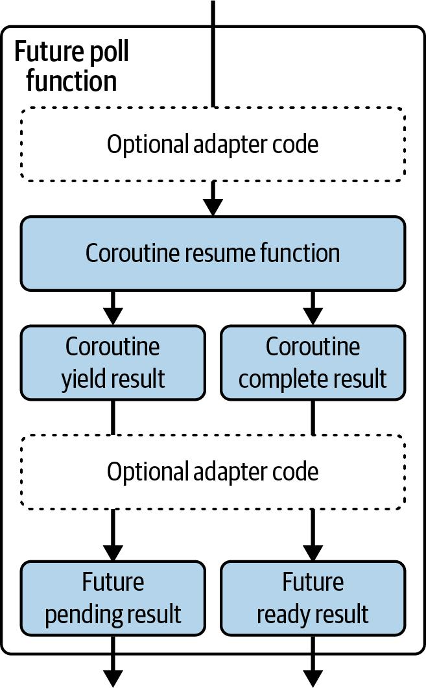


그림 5-2는 코루틴 함수와 퓨처 함수 사이에 선택적인 어댑터 코드를 끼워 넣을 수 있음을 보여줍니다. 따라서 코루틴을 근본적인 연산 기본 단위(building block)로 바라볼 수 있습니다. 이러한 코루틴은 동기식 코드에서 일시 중단 및 재개될 수 있으므로, 테스트하기 위해 비동기 런타임이 필요하지 않아 표준 테스트 환경에서 쉽게 테스트할 수 있습니다. 또한 코루틴의 `resume` 함수를 호출할 시점을 직접 선택할 수 있으므로, 코루틴들이 서로 상호작용하는 다양한 순서를 테스트하는 것도 간단합니다.

코루틴과 그 동작 방식에 만족했다면 하나 또는 여러 개의 코루틴을 `Future` 트레이트를 구현하는 구조체로 감쌀 수 있습니다. 이 구조체는 본질적으로 코루틴이 비동기 런타임과 상호작용할 수 있도록 해 주는 어댑터입니다. 이를 통해 연산 프로세스의 테스트와 구현에 대한 궁극적인 유연성과 제어력을 얻을 수 있으며, 이러한 연산 프로세스 간에 명확한 경계를 설정할 수 있습니다. 이러한 점을 염두에 두고, 코루틴이 비동기 세계에 어떻게 들어맞는지에 대한 탐구를 테스트로 마무리해 보겠습니다.

#### 코루틴 테스트하기

테스트 예제에서는 복잡한 로직으로 장을 과도하게 부풀리지 않기 위해, 동일한 뮤텍스를 획득하고 뮤텍스의 값을 1씩 증가시키는 두 코루틴을 테스트해 보겠습니다. 이를 통해 락(lock)이 획득되었을 때 어떤 일이 일어나는지와 상호작용 후 락의 최종 결과를 테스트할 수 있습니다.

구조체 정의는 다음과 같습니다:

```rust
struct MutexCoRoutine {
    handle: Arc<Mutex<usize>>,
    threshold: usize,
}
```

이 구조체는 값의 잠금을 시도하는 횟수를 나타내는 카운터 역할을 하는 임계값(`threshold`)을 가집니다. 임계값에 도달하면 코루틴은 완료(complete)됩니다.

그런 다음 락을 획득하고 값을 1 증가시키는 이면의 로직을 구현합니다:

```rust
impl Coroutine<()> for MutexCoRoutine {
    type Yield = ();
    type Return = ();

    fn resume(mut self: Pin<&mut Self>, _: ()) -> CoroutineState<Self::Yield, Self::Return> {
        match self.handle.try_lock() {
            Ok(mut handle) => {
                *handle += 1;
                self.threshold -= 1;
                if self.threshold == 0 {
                    return CoroutineState::Complete(());
                }
                return CoroutineState::Yielded(());
            }
            Err(_) => {
                return CoroutineState::Yielded(());
            }
        }
    }
}
```

우리는 락을 얻으려고 시도하지만, 얻을 수 없다면 블로킹을 원하지 않으므로 양보(yield)를 반환합니다. 락을 얻으면 값을 1 증가시키고 임계값을 1 감소시킨 다음, 임계값이 0에 도달했는지 여부에 따라 `Yielded` 또는 `Complete`를 반환합니다.

그리고 이것으로 준비가 끝났습니다. 다음 템플릿을 사용하여 동일한 파일에서 코루틴을 테스트할 수 있습니다:

```rust
#[cfg(test)]
mod tests {
    use super::*;
    use std::future::Future;
    use std::task::{Context, Poll};
    use std::time::Duration;

    // 동기 테스트 인터페이스
    fn check_yield(coroutine: &mut MutexCoRoutine) -> bool {
        // . . .
    }

    // 비동기 런타임 인터페이스
    impl Future for MutexCoRoutine {
        // . . .
    }

    #[test]
    fn basic_test() {
        // . . .
    }

    #[tokio::test]
    async fn async_test() {
        // . . .
    }
}
```

여기서 우리는 코드가 직접 어떻게 동작하는지 확인한 다음, 비동기 런타임에서 코드가 어떻게 실행되는지 확인할 것입니다. 두 개의 인터페이스가 있습니다. 테스트를 만족시키기 위해 코드를 억지로 변경하고 싶지는 않습니다. 대신 코루틴이 반환하는 타입에 따라 `bool`을 반환하는 간단한 인터페이스를 작성합니다. 함수 정의는 다음과 같습니다:

```rust
fn check_yield(coroutine: &mut MutexCoRoutine) -> bool {
    match Pin::new(coroutine).resume(()) {
        CoroutineState::Yielded(_) => true,
        CoroutineState::Complete(_) => false,
    }
}
```

비동기 인터페이스의 경우 단순히 코루틴 출력을 동등한 비동기 출력으로 매핑합니다:

```rust
impl Future for MutexCoRoutine {
    type Output = ();

    fn poll(mut self: Pin<&mut Self>, cx: &mut Context<'_>) -> Poll<Self::Output> {
        match Pin::new(&mut self).resume(()) {
            CoroutineState::Complete(_) => Poll::Ready(()),
            CoroutineState::Yielded(_) => {
                cx.waker().wake_by_ref();
                Poll::Pending
            }
        }
    }
}
```

이제 `basic_test` 함수에서 첫 번째 기본 테스트를 작성할 준비가 되었습니다. 먼저 뮤텍스와 코루틴을 정의합니다:

```rust
let handle = Arc::new(Mutex::new(0));
let mut first_coroutine = MutexCoRoutine {
    handle: handle.clone(),
    threshold: 2,
};
let mut second_coroutine = MutexCoRoutine {
    handle: handle.clone(),
    threshold: 2,
};
```

먼저 우리가 직접 락을 획득한 다음 두 코루틴을 모두 호출하여, 이들이 양보(yield)를 반환하고 우리가 락을 쥐고 있기 때문에 뮤텍스의 값이 여전히 0인지 확인합니다:

```rust
let lock = handle.lock().unwrap();
for _ in 0..3 {
    assert_eq!(check_yield(&mut first_coroutine), true);
    assert_eq!(check_yield(&mut second_coroutine), true);
}
assert_eq!(*lock, 0);
std::mem::drop(lock);
```

> [!NOTE]
> 처음 두 번의 yield에 대한 초기 테스트를 마친 후 락을 드롭(`drop`)했다는 것을 눈치챘을 것입니다. 이렇게 하지 않으면 우리의 코루틴이 결코 락을 획득할 수 없게 되어 나머지 테스트가 실패하게 됩니다.

이 루프를 실행하는 이유는 코루틴이 락 획득에 실패했을 때 임계값 역시 변경되지 않는다는 것을 증명하기 위함입니다. 만약 임계값이 변경되었다면 두 번의 반복 후에 코루틴은 완료(`complete`)를 반환했을 것이고, 코루틴에 대한 다음 호출은 에러를 유발했을 것입니다. 루프가 없어도 테스트에서 이를 감지할 수 있었겠지만, 처음에 루프를 배치함으로써 무엇 때문에 테스트가 중단되었는지에 대한 혼란을 없앨 수 있습니다.

락을 드롭한 후에는 두 코루틴을 각각 두 번씩 호출하여 예상한 값을 반환하는지 확인하고, 모든 호출 사이에 뮤텍스를 점검하여 상태가 우리가 원하는 정확한 방식으로 변경되고 있는지 확인합니다:

```rust
assert_eq!(check_yield(&mut first_coroutine), true);
assert_eq!(*handle.lock().unwrap(), 1);
assert_eq!(check_yield(&mut second_coroutine), true);
assert_eq!(*handle.lock().unwrap(), 2);
assert_eq!(check_yield(&mut first_coroutine), false);
assert_eq!(*handle.lock().unwrap(), 3);
assert_eq!(check_yield(&mut second_coroutine), false);
assert_eq!(*handle.lock().unwrap(), 4);
```

이로써 첫 번째 테스트가 완료되었습니다.

비동기 테스트에서는 완전히 동일한 방식으로 뮤텍스와 코루틴을 생성합니다. 그러나 이제 비동기 런타임에서도 동작의 최종 결과가 동일한지, 그리고 비동기 인터페이스가 기대한 대로 동작하는지 테스트합니다. Tokio의 테스트 기능을 사용하고 있으므로 태스크를 스폰하고 대기한 다음 락을 검사하기만 하면 됩니다:

```rust
let handle_one = tokio::spawn(async move {
    first_coroutine.await;
});
let handle_two = tokio::spawn(async move {
    second_coroutine.await;
});
handle_one.await.unwrap();
handle_two.await.unwrap();
assert_eq!(*handle.lock().unwrap(), 4);
```

`cargo test` 명령을 실행하면 두 테스트가 모두 성공하는 것을 확인할 수 있습니다. 드디어 해냈습니다! 두 코루틴과 뮤텍스 사이의 상호작용을 단계별로 검사하고 각 단계 사이의 상태를 확인했습니다. 코루틴은 동기 코드에서 동작합니다. 하지만 간단한 어댑터를 사용하면 코루틴이 비동기 런타임에서도 기대한 그대로 정확하게 동작함을 확인할 수 있습니다! 비동기 테스트에서는 코루틴의 각 상호작용마다 뮤텍스를 검사할 수 없다는 점을 알 수 있습니다. 비동기 실행기가 스스로 동작하기 때문입니다.

### 요약

이 장에서는 `Coroutine` 트레이트를 구현하여 자신만의 코루틴을 만들고, `Yield`와 `Complete`를 사용하여 코루틴을 일시 정지하고 재개했습니다. 한 코루틴이 값을 양보하며 파일을 읽고, 두 번째 코루틴이 그 값을 받아 파일에 쓰는 파이프라인을 구현했습니다. 마지막으로 자체 실행기를 만들어 코루틴이 실제로 어떻게 일시 정지하고 재개되는지 확인했습니다.

이 장을 진행하면서 코루틴의 `Yield`/`Complete`와 비동기의 `Pending`/`Ready` 사이의 유사점에 깊은 인상을 받았을 것입니다. 이를 바라보는 가장 좋은 관점은 `async`/`await`가 코루틴의 하위 유형이라는 점입니다. 이는 스레드에 걸쳐 동작하고 큐를 사용하는 코루틴입니다. 코루틴과 비동기 프로그래밍 모두에서 활동을 일시 중단하고 나중에 다시 돌아올 수 있습니다.

코루틴은 비동기 코드와 동기 코드 사이의 접합선(seam) 역할을 하므로 코드를 체계화하는 데 도움이 됩니다. 코루틴을 사용하면 동기 코드 모듈을 구축한 뒤 표준 테스트로 이를 평가할 수 있습니다. 동기 코드가 비동기 기능을 필요로 하는 코드와 연결되도록 코루틴 어댑터를 만들 수 있으며, 이때 비동기 기능은 코루틴으로 표현됩니다. 그런 다음 코루틴이 다양한 순서와 조합으로 폴링될 때 어떻게 동작하는지 단위 테스트를 수행할 수 있습니다. 퓨처의 `poll` 함수 안에서 코루틴을 호출할 수 있으므로, 이러한 코루틴을 `Future` 트레이트 구현체에 주입하여 코드를 비동기 런타임에 통합할 수 있습니다. 이때 비동기 코드를 인터페이스로 격리하기만 하면 됩니다. 하나의 비동기 함수가 여러분의 코드를 호출한 뒤 서드파티 비동기 코드로 출력을 전달할 수 있으며, 그 반대도 가능합니다.

코드를 격리하는 좋은 방법 중 하나는 반응형 프로그래밍(reactive programming)으로, 코드 단위가 브로드캐스트 채널 구독을 통해 데이터를 소비할 수 있도록 하는 것입니다. 6장에서 이에 대해 살펴봅니다.

# 제6장 리액티브 프로그래밍

리액티브 프로그래밍(reactive programming)은 데이터 값이나 이벤트의 변화에 코드가 반응(react)하는 프로그래밍 패러다임입니다. 리액티브 프로그래밍을 활용하면 실시간 변화에 동적으로 반응하는 시스템을 구축할 수 있습니다. 강조하자면, 이번 장은 비동기 프로그래밍의 맥락에서 다룹니다. 리액티브 프로그래밍이라는 주제 하나만으로도 책 한 권 분량이 나오므로 모든 측면을 다룰 수는 없습니다. 대신 이번 장에서는 퓨처(future)가 온도의 변화에 반응하는 기본적인 히터 시스템을 만들어 보며, 데이터 변화를 폴링(polling)하고 반응하는 비동기적 접근 방식에 집중하겠습니다. 그런 다음 원자적 타입(atomic), 뮤텍스(mutex), 큐(queue)를 사용하여 이벤트를 여러 구독자(subscriber)에게 발행할 수 있는 이벤트 버스(event bus)를 구축해 보겠습니다.

이번 장을 마치면 여러 동시 비동기 태스크가 안전하게 다룰 수 있는 스레드 안전(thread-safe)하고 가변적인 데이터 구조를 구성할 수 있을 만큼 비동기 데이터 공유 개념에 익숙해지실 것입니다. 또한 옵저버 패턴(observer pattern)도 구현할 수 있게 됩니다. 이 장이 끝날 무렵에는 향후 심화 학습에서 접하게 될 리액티브 디자인 패턴들에 대해 비동기 Rust 솔루션을 구축할 역량을 갖추게 됩니다.

그럼 기본적인 리액티브 시스템을 구축하는 것부터 리액티브 프로그래밍 여정을 시작하겠습니다.


### 기본 리액티브 시스템 구축하기

기본적인 리액티브 시스템을 구축하면서 옵저버 패턴을 구현해 보겠습니다. 이 패턴에서는 주체(subject)가 존재하고, 이 주체의 업데이트를 구독하는 옵저버(observer)들이 있습니다. 주체가 업데이트를 발행하면, 옵저버들은 각자의 특정 요구사항에 따라 이 업데이트에 반응합니다. 우리의 기본 리액티브 시스템으로는 간단한 난방(heating) 시스템을 만들어볼 것입니다. 이 시스템은 그림 6-1에 나와 있듯이 온도가 희망 설정 온도 아래로 떨어지면 히터를 켭니다.

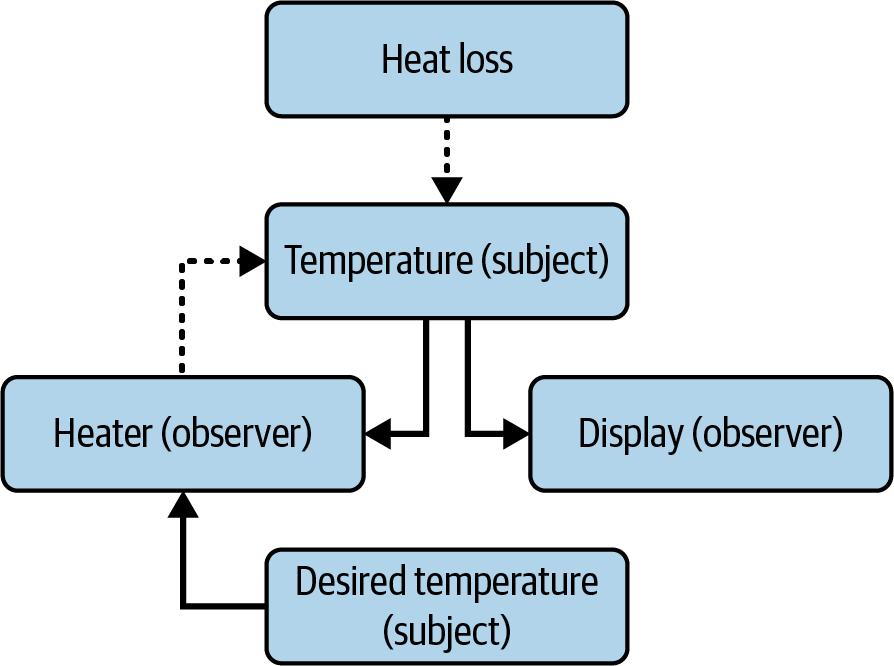


먼저 프로젝트의 의존성을 설정합니다:

```toml
[dependencies]
tokio = { version = "1.26.0", features = ["full"] }
clearscreen = "2.0.1"
```

이 시스템에서 현재 온도와 희망 온도는 주체(subject)입니다. 히터와 디스플레이는 옵저버(observer)입니다. 히터는 온도가 희망 온도 설정값 아래로 떨어지면 켜집니다. 디스플레이는 온도가 변하면 터미널에 온도를 출력합니다. 실제 시스템이라면 시스템을 온도 센서에 연결하겠지만, 리액티브 프로그래밍을 탐구하기 위한 예제이므로 하드웨어 엔지니어링 단계는 건너뛰고 히터와 열 손실이 온도에 미치는 영향을 직접 코드로 작성하여 대체하겠습니다. 이제 시스템의 구조가 잡혔으니 주체를 정의하는 단계로 넘어가겠습니다.


### 주체 정의하기

우리 시스템의 옵저버들은 프로그램이 실행되는 동안 주체가 변경되었는지 확인하기 위해 계속 주체를 폴링하므로, 쉬지 않고 폴링(nonstop polling)하는 퓨처가 됩니다. 온도 시스템 구축을 시작하기 전에 필요한 임포트는 다음과 같습니다:

화면을 갱신하기 위해 `clearscreen` 크레이트를 사용하고, 쉬운 비동기 런타임 인터페이스를 위해 `tokio` 크레이트를 사용합니다. (현재 표준 라이브러리의 일부가 된) `LazyLock`은 변수를 지연 초기화(lazy initialization)할 수 있게 해 주며, 이는 해당 변수에 처음 접근할 때만 생성됨을 의미합니다. 필요한 임포트는 다음과 같습니다:

```rust
use std::sync::Arc;
use std::sync::atomic::{AtomicI16, AtomicBool};
use core::sync::atomic::Ordering;
use std::sync::LazyLock;
use std::future::Future;
use std::task::Poll;
use std::pin::Pin;
use std::task::Context;
use std::time::{Instant, Duration};
```

이제 필요한 것이 모두 준비되었으므로 주체를 정의할 수 있습니다:

```rust
static TEMP: LazyLock<Arc<AtomicI16>> = LazyLock::new(|| {
    Arc::new(AtomicI16::new(2090))
});
static DESIRED_TEMP: LazyLock<Arc<AtomicI16>> = LazyLock::new(|| {
    Arc::new(AtomicI16::new(2100))
});
static HEAT_ON: LazyLock<Arc<AtomicBool>> = LazyLock::new(|| {
    Arc::new(AtomicBool::new(false))
});
```

각 주체는 다음과 같은 역할을 담당합니다:

- `TEMP`: 시스템의 현재 온도.
- `DESIRED_TEMP`: 방의 희망 온도.
- `HEAT_ON`: 히터가 켜져야 하는지 꺼져야 하는지 여부. `bool`이 `true`이면 히터를 켜도록 지시하고, `false`이면 히터가 꺼집니다.

> [!NOTE]
> 이전에 리액티브 프로그래밍이나 리액티브 시스템에 대해 검색해 본 적이 있다면 메시지 및 이벤트 전달에 관한 내용을 읽어보셨을 것입니다. 메시지와 이벤트는 분명 리액티브 프로그래밍의 일부이지만, 소프트웨어 개발의 중요한 원칙 중 하나는 시스템을 과도하게 엔지니어링(overengineering)하지 않는 것임을 기억해야 합니다. 시스템이 복잡해질수록 유지보수와 변경이 어려워집니다. 우리 시스템은 단순한 피드백 요구사항만 가지고 있습니다. 숫자를 기반으로 히터가 켜지거나 꺼지는 것뿐입니다. 스레드 간에 메시지를 주고받는 락(lock)과 채널을 자세히 들여다보면, 결국 락을 위한 아토믹과 데이터를 처리하기 위한 컬렉션으로 귀결됩니다. 지금은 시스템의 단순한 요구사항 덕분에 아토믹만 사용하는 것으로도 충분합니다.

옵저버를 통해 주체를 구독하면 코드가 분리(decouple)됩니다. 예를 들어, 새 옵저버가 주체를 관찰하도록 하기만 하면 옵저버의 수를 쉽게 늘릴 수 있습니다. 기존 주체의 코드는 전혀 수정할 필요가 없습니다.

이제 주체에 필요한 모든 것이 준비되었으므로, 다음 단계는 주체를 표시하고 `HEAT_ON` 주체를 제어하는 옵저버를 구축하는 것입니다.


#### 디스플레이 옵저버 구축하기

주체가 정의되었으니 디스플레이 퓨처를 정의할 수 있습니다:

```rust
pub struct DisplayFuture {
    pub temp_snapshot: i16,
}

impl DisplayFuture {
    pub fn new() -> Self {
        DisplayFuture {
            temp_snapshot: TEMP.load(Ordering::SeqCst),
        }
    }
}
```

퓨처를 생성할 때 온도 주체의 값을 로드하여 저장합니다. 여기서 `Ordering::SeqCst`를 사용하여 모든 스레드에서 온도 값이 일관되게 보이도록 합니다. 이 엄격한 순서는 다른 스레드가 우리가 볼 수 없는 방식으로 온도를 수정하지 않았음을 보장합니다.

그런 다음 이 저장된 온도를 사용하여 폴링 시점의 온도와 비교할 수 있습니다:

```rust
impl Future for DisplayFuture {
    type Output = ();

    fn poll(mut self: Pin<&mut Self>, cx: &mut Context<'_>) -> Poll<Self::Output> {
        let current_snapshot = TEMP.load(Ordering::SeqCst);
        let desired_temp = DESIRED_TEMP.load(Ordering::SeqCst);
        let heat_on = HEAT_ON.load(Ordering::SeqCst);

        if current_snapshot == self.temp_snapshot {
            cx.waker().wake_by_ref();
            return Poll::Pending;
        }

        if current_snapshot < desired_temp && heat_on == false {
            HEAT_ON.store(true, Ordering::SeqCst);
        } else if current_snapshot > desired_temp && heat_on == true {
            HEAT_ON.store(false, Ordering::SeqCst);
        }

        clearscreen::clear().unwrap();
        println!(
            "Temperature: {}\nDesired Temp: {}\nHeater On: {}",
            current_snapshot as f32 / 100.0,
            desired_temp as f32 / 100.0,
            heat_on
        );

        self.temp_snapshot = current_snapshot;
        cx.waker().wake_by_ref();
        return Poll::Pending;
    }
}
```

이 코드는 다음과 같은 작업을 수행합니다:

1. 시스템 전체의 스냅샷을 가져옵니다.
2. 퓨처가 보유한 온도 스냅샷과 현재 온도 간에 차이가 있는지 확인합니다. 차이가 없다면 디스플레이를 다시 렌더링하거나 난방 결정을 내릴 이유가 없으므로 단순히 `Pending`을 반환하여 폴링을 마칩니다.
3. 현재 온도가 희망 온도보다 낮은지 확인합니다. 낮다면 `HEAT_ON` 플래그를 `true`로 설정합니다.
4. 온도가 희망 온도보다 높다면 `HEAT_ON` 플래그를 `false`로 설정합니다.
5. 업데이트를 위해 터미널 화면을 지웁니다.
6. 스냅샷의 현재 상태를 출력합니다.
7. 퓨처가 참조하는 스냅샷을 갱신합니다.

처음에 시스템 전체의 스냅샷을 가져오는 방식은 논쟁의 여지가 있을 수 있습니다. 어떤 이들은 매 단계마다 원자적 값을 다시 로드해야 한다고 주장합니다. 그렇게 하면 주체의 상태를 변경하거나 표시할 결정을 내릴 때마다 항상 상태의 진정한 현재 모습을 얻을 수 있기 때문입니다. 이는 타당한 주장이지만, 이러한 결정에는 항상 트레이드오프가 따릅니다.

우리 시스템에서는 디스플레이만이 `HEAT_ON` 플래그의 상태를 변경하는 유일한 옵저버이며, 퓨처 내부의 로직은 온도를 기반으로 결정을 내립니다. 그러나 그림 6-2에 표시된 것처럼 온도에 영향을 미치는 두 가지 다른 요인이 있으며, 이 요인들이 스냅샷을 찍고 출력하는 사이에 온도를 변화시킬 수 있습니다.

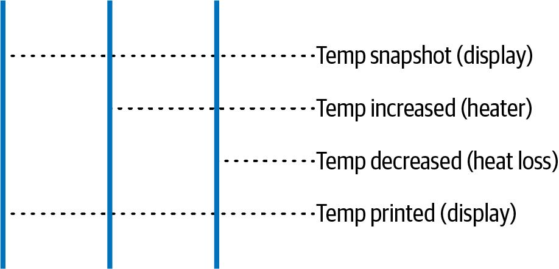


우리 시스템에서는 온도 디스플레이가 찰나의 순간 동안 약간 오차가 난다고 해서 큰일이 나지는 않습니다. 스냅샷을 찍고, 그 스냅샷을 바탕으로 결정을 내린 뒤, 결정을 내리는 데 사용된 정확한 데이터를 보기 위해 해당 스냅샷을 출력하는 것이 더 중요하다고 볼 수도 있습니다. 이렇게 하면 명확한 디버깅 정보도 얻을 수 있습니다. 또는 스냅샷을 찍고, 그 스냅샷을 바탕으로 `HEAT_ON` 플래그의 상태를 변경한 다음, 콘솔에 출력할 때는 모든 원자적 변수를 다시 로드하여 출력되는 그 순간의 디스플레이가 항상 정확하도록 만들 수도 있습니다. 결정을 위한 스냅샷을 로깅하고 출력하는 순간 아토믹을 로드하는 것도 하나의 선택지입니다.

우리의 단순한 시스템에서는 지나치게 세세한 부분까지 파고드는 셈이므로, 시스템이 어떻게 적응하고 결정을 내리는지 볼 수 있도록 스냅샷 출력을 유지하겠습니다. 하지만 리액티브 시스템을 구축할 때는 이러한 트레이드오프를 고려하는 것이 중요합니다. 여러분의 옵저버가 작동 기준으로 삼는 데이터가 이미 오래된(out-of-date) 것일 수 있기 때문입니다.

이번 시뮬레이션에서는 런타임을 단 하나의 스레드로 제한함으로써 오래된 데이터로 작업할 위험을 제거할 수도 있습니다. 이렇게 하면 디스플레이 퓨처가 처리되는 동안 다른 퓨처가 온도를 변경할 수 없으므로 스냅샷이 오래된 상태가 되지 않습니다. 런타임을 단일 스레드로 제한하는 대신 온도를 뮤텍스로 감쌀 수도 있으며, 이 역시 스냅샷과 출력 사이에 온도가 변하지 않도록 보장합니다.

그러나 우리 시스템은 온도에 반응하고 있습니다. 온도란 우리 시스템이 임의로 지어낸 개념이 아닙니다. 열 손실과 히터는 실시간으로 온도에 영향을 미칠 수 있으며, 주체의 상태를 변경하는 다른 프로세스가 존재하는 상황에서 시스템의 온도 변화를 막는 꼼수를 부린다면 이는 스스로를 속이는 것에 불과합니다.

우리 시스템은 오래된 데이터를 걱정하지 않아도 될 만큼 단순하지만, 표준 라이브러리 문서의 다음 코드 예제에 나와 있는 것처럼 비교 및 교환(compare-and-exchange) 기능을 활용할 수도 있습니다:

```rust
use std::sync::atomic::{AtomicI64, Ordering};

let some_var = AtomicI64::new(5);

assert_eq!(
    some_var.compare_exchange(
        5,
        10,
        Ordering::Acquire,
        Ordering::Relaxed
    ),
    Ok(5)
);
assert_eq!(some_var.load(Ordering::Relaxed), 10);

assert_eq!(
    some_var.compare_exchange(
        6,
        12,
        Ordering::SeqCst,
        Ordering::Acquire
    ),
    Err(10)
);
assert_eq!(some_var.load(Ordering::Relaxed), 10);
```

이 지점에서 우리는 왜 아토믹이 '원자적(atomic)'이라고 불리는지 그 이유를 실감할 수 있습니다. 바로 연산(트랜잭션)이 원자적이기 때문입니다. 즉, 어떤 값에 대해 연산이 수행되는 동안 다른 연산이 그 원자적 값에 끼어들 수 없습니다. `compare_exchange` 함수에서는 원자적 값을 새 값으로 업데이트하기 전에 해당 값이 특정 값인지 단언(assert)합니다. 값이 기대한 것과 일치하지 않으면 원자적 값의 실제 현재 값과 함께 에러를 반환합니다. `compare_exchange` 함수를 사용하여 옵저버가 반환된 값을 기반으로 다른 결정을 내리도록 유도하고, 갱신된 정보를 바탕으로 원자적 값을 다시 업데이트하도록 시도할 수 있습니다. 지금까지 리액티브 프로그래밍의 동시성 문제와 해결책을 제공하는 영역을 충분히 살펴보았습니다. 이제 히터와 열 손실 옵저버를 만들어 리액티브 시스템 구축을 계속해 보겠습니다.


### 히터 및 열 손실 옵저버 구축하기

히터 옵저버가 작동하려면 온도는 신경 쓰지 않고 `HEAT_ON` 부울(bool) 값만 읽으면 됩니다. 하지만 히터에는 '시간'이라는 요소가 있습니다. 안타깝게도 글을 쓰는 현재, 우리는 히터가 즉각적으로 방을 데워주지 못하는 세상에 살고 있습니다. 방을 데우는 데는 시간이 걸립니다. 따라서 온도 스냅샷 대신 히터 퓨처는 시간 스냅샷을 가지며, 다음과 같은 형태를 띱니다:

```rust
pub struct HeaterFuture {
    pub time_snapshot: Instant,
}

impl HeaterFuture {
    pub fn new() -> Self {
        HeaterFuture {
            time_snapshot: Instant::now(),
        }
    }
}
```

이제 시간 스냅샷이 있으므로 이를 참조하여 `poll` 함수를 통해 일정 시간이 지난 후 온도를 올릴 수 있습니다:

```rust
impl Future for HeaterFuture {
    type Output = ();

    fn poll(mut self: Pin<&mut Self>, cx: &mut Context<'_>) -> Poll<Self::Output> {
        if HEAT_ON.load(Ordering::SeqCst) == false {
            self.time_snapshot = Instant::now();
            cx.waker().wake_by_ref();
            return Poll::Pending;
        }

        let current_snapshot = Instant::now();
        if current_snapshot.duration_since(self.time_snapshot) < Duration::from_secs(3) {
            cx.waker().wake_by_ref();
            return Poll::Pending;
        }

        TEMP.fetch_add(3, Ordering::SeqCst);
        self.time_snapshot = Instant::now();
        cx.waker().wake_by_ref();
        return Poll::Pending;
    }
}
```

히터 퓨처에서는 다음 단계를 수행합니다:

1. 아무런 일도 일어나지 않으므로 `HEAT_ON` 플래그가 꺼져 있으면 가능한 한 빨리 종료합니다. 다른 퓨처의 블로킹을 방지하기 위해 가능한 한 빨리 실행기(executor)에서 퓨처를 놓아주어야 합니다.
2. 경과 시간이 3초를 넘지 않은 경우에도 히터의 효과가 나타날 만큼의 시간이 흐르지 않았으므로 종료합니다.
3. 마지막으로, 시간도 충분히 흘렀고 `HEAT_ON` 플래그도 켜져 있으므로 온도를 3만큼 증가시킵니다.

`HEAT_ON` 플래그가 `false`이거나 충분한 시간이 흐르지 않아 종료하는 모든 시점에 `self.time_snapshot`을 갱신합니다. `time_snapshot`을 갱신하지 않으면, 히터 퓨처는 `HEAT_ON` 플래그가 `false`인 상태로 3초가 흐를 때까지 계속 폴링될 수 있습니다. 그러다 `HEAT_ON` 플래그가 `true`로 바뀌는 순간 온도에 미치는 영향이 즉각적으로 나타나게 됩니다. 따라서 히터 퓨처에서는 폴링할 때마다 상태를 재설정해야 합니다.

열 손실(heat-loss) 퓨처의 정의는 다음과 같습니다:

```rust
pub struct HeatLossFuture {
    pub time_snapshot: Instant,
}

impl HeatLossFuture {
    pub fn new() -> Self {
        HeatLossFuture {
            time_snapshot: Instant::now(),
        }
    }
}
```

열 손실 퓨처의 생성자 메서드는 히터 퓨처와 동일합니다. 폴링 사이에 경과된 시간을 참조하기 때문입니다. 하지만 이번 `poll`에서는 효과가 발생한 후에만 스냅샷을 재설정합니다. 왜냐하면 이 시뮬레이션에서 열 손실은 지속적으로 일어나는 상수와 같기 때문입니다. 독자 여러분께서 이 퓨처를 직접 작성해 보시길 권장합니다. 직접 구현해 보셨다면 다음과 같은 형태가 되었을 것입니다:

```rust
impl Future for HeatLossFuture {
    type Output = ();

    fn poll(mut self: Pin<&mut Self>, cx: &mut Context<'_>) -> Poll<Self::Output> {
        let current_snapshot = Instant::now();
        if current_snapshot.duration_since(self.time_snapshot) > Duration::from_secs(3) {
            TEMP.fetch_sub(1, Ordering::SeqCst);
            self.time_snapshot = Instant::now();
        }

        cx.waker().wake_by_ref();
        return Poll::Pending;
    }
}
```

이제 프로그램이 실행되는 동안 계속 폴링할 모든 퓨처가 준비되었습니다. 다음 코드로 모든 퓨처를 실행하면 온도가 계속 업데이트되고 히터가 켜져 있는지 여부가 표시되는 화면을 볼 수 있습니다:

```rust
#[tokio::main]
async fn main() {
    let display = tokio::spawn(async {
        DisplayFuture::new().await;
    });
    let heat_loss = tokio::spawn(async {
        HeatLossFuture::new().await;
    });
    let heater = tokio::spawn(async {
        HeaterFuture::new().await;
    });

    display.await.unwrap();
    heat_loss.await.unwrap();
    heater.await.unwrap();
}
```

희망 온도에 도달하고 나면 온도가 희망 온도를 중심으로 완만하게 오르내리는(진동하는) 모습을 볼 수 있을 것입니다.

> [!NOTE]
> 진동(oscillation)은 고전 시스템 이론에서 매우 흔히 나타나는 현상입니다. 디스플레이에 시간 스냅샷을 추가하고 `HEAT_ON` 플래그의 전환을 지연시키면 진동 폭이 더 커집니다. 진동은 유의해서 살펴볼 필요가 있습니다. 한 옵저버의 반응이 지연되고, 다른 옵저버 역시 초기 옵저버의 결과에 대해 지연되어 반응한다면 이해하거나 예측하기 매우 어려운 혼돈스러운(chaotic) 시스템이 될 수 있습니다. 이는 코로나19 팬데믹 기간 및 그 이후 공급망 혼란의 큰 원인이기도 했습니다. 도넬라 H. 메도우스(Donella H. Meadows)의 저서 *Thinking in Systems* (Chelsea Green Publishing, 2008)에서는 수요 반응의 지연이 공급망에서 진동을 유발할 수 있음을 보여줍니다. 긴 공급망은 진동하는 여러 부분으로 구성되어 있습니다. 진동의 박자가 너무 맞지 않게 되면 해결하기 복잡한 혼돈스러운 시스템이 됩니다. 이것이 팬데믹 이후 공급망 복구에 오랜 시간이 걸린 이유 중 하나입니다. 다행히 컴퓨터 시스템은 비교적 즉각적으로 반응합니다. 그러나 지연이 연쇄적으로 이어지고 이에 반응할 때 발생하는 위험성을 염두에 둘 가치는 충분합니다.

이제 시스템이 동작하므로, 콜백(callback)을 사용하여 사용자로부터 입력을 받는 방법으로 넘어가 보겠습니다.


### 콜백을 통한 사용자 입력 받기

터미널에서 사용자 입력을 받기 위해 다음과 같은 버전의 `device_query` 크레이트를 사용합니다:

```toml
device_query = "1.1.3"
```

이를 위해 다음 트레이트와 구조체를 사용합니다:

```rust
use device_query::{DeviceEvents, DeviceState};
use std::io::{self, Write};
use std::sync::Mutex;
```

`device_query` 크레이트는 비동기 프로그래밍의 한 형태인 콜백을 사용합니다. 콜백은 함수를 다른 함수로 전달하는 데 사용됩니다. 이렇게 전달된 함수는 나중에 호출됩니다. 다음과 같이 기본적인 콜백 함수를 직접 작성해 볼 수 있습니다:

```rust
fn perform_operation_with_callback<F>(callback: F)
where
    F: Fn(i32),
{
    let result = 42;
    callback(result);
}

fn main() {
    let my_callback = |result: i32| {
        println!("The result is: {}", result);
    };
    perform_operation_with_callback(my_callback);
}
```

방금 작성한 코드는 여전히 블로킹 방식입니다. 무한 루프로 동작하는 이벤트 루프(event loop) 스레드를 사용하면 콜백이 메인 스레드를 블로킹하지 않도록 만들 수 있습니다. 이 루프는 콜백 형태의 들어오는 이벤트를 수신합니다(그림 6-3).


예를 들어 Node.js 서버에는 대개 이벤트 루프가 이벤트를 전달하는 스레드 풀이 있습니다. 콜백이 이벤트가 발생한 소스로 돌아가는 채널을 가지고 있다면, 적절한 시점에 이벤트 소스로 데이터를 다시 보낼 수 있습니다.

입력을 처리하기 위해 디바이스 상태와 입력을 다음과 같이 관리해야 합니다:

```rust
static INPUT: LazyLock<Arc<Mutex<String>>> = LazyLock::new(|| {
    Arc::new(Mutex::new(String::new()))
});
static DEVICE_STATE: LazyLock<Arc<DeviceState>> = LazyLock::new(|| {
    Arc::new(DeviceState::new())
});
```

이제 코드 구조에 대해 고민해 보아야 합니다. 현재 디스플레이는 디스플레이 퓨처가 온도를 확인할 때 온도가 변경된 경우에만 업데이트됩니다. 그러나 사용자 입력이 있는 상황에서는 이 방식이 더 이상 적절하지 않습니다. 생각해 보면, 온도가 변할 때만 사용자 입력 내용이 화면에 갱신된다면 좋은 애플리케이션이라고 할 수 없을 것입니다. 사용자는 같은 키를 답답한 마음에 여러 번 누르게 되고, 온도가 바뀔 때 한꺼번에 여러 번의 입력이 실행되는 것을 보며 실망하게 될 것입니다. 우리 시스템은 사용자가 키를 누르는 즉시 화면을 갱신해야 합니다. 이를 고려하여 여러 곳에서 호출할 수 있는 자체 렌더링 함수가 필요합니다. 이 함수는 다음과 같은 형태를 갖춥니다:

```rust
pub fn render(temp: i16, desired_temp: i16, heat_on: bool, input: String) {
    clearscreen::clear().unwrap();
    let stdout = io::stdout();
    let mut handle = stdout.lock();
    println!(
        "Temperature: {}\nDesired Temp: {}\nHeater On: {}",
        temp as f32 / 100.0,
        desired_temp as f32 / 100.0,
        heat_on
    );
    print!("Input: {}", input);
    handle.flush().unwrap();
}
```

이 함수는 기존 디스플레이와 유사하지만 입력 내용도 함께 출력합니다. 즉, `DisplayFuture`의 `poll` 함수는 다음과 같이 `render` 함수를 호출하게 됩니다:

```rust
#[tokio::main]
async fn main() {
    let _guard = DEVICE_STATE.on_key_down(|key| {
        let mut input = INPUT.lock().unwrap();
        input.push_str(&key.to_string());
        std::mem::drop(input);
        render(
            TEMP.load(Ordering::SeqCst),
            DESIRED_TEMP.load(Ordering::SeqCst),
            HEAT_ON.load(Ordering::SeqCst),
            INPUT.lock().unwrap().clone(),
        );
    });

    let display = tokio::spawn(async {
        DisplayFuture::new().await;
    });
    let heat_loss = tokio::spawn(async {
        HeatLossFuture::new().await;
    });
    let heater = tokio::spawn(async {
        HeaterFuture::new().await;
    });

    display.await.unwrap();
    heat_loss.await.unwrap();
    heater.await.unwrap();
}
```

여기서 `_guard`는 콜백 가드(callback guard)입니다. `device_query` 크레이트에서는 콜백을 등록할 때 콜백 가드를 반환합니다. 가드를 드롭하면 이벤트 리스너가 제거됩니다. 다행히 디스플레이, 열 손실, 히터 태스크가 프로그램을 강제 종료할 때까지 계속 폴링하므로, 메인 스레드는 프로그램이 종료될 때까지 블로킹된 상태를 유지합니다.

`on_key_down` 함수는 스레드를 생성하고 이벤트 루프를 실행합니다. 이 이벤트 루프에는 마우스와 키보드 움직임에 대한 콜백이 포함되어 있습니다. 키보드 누름 이벤트를 수신하면 이를 입력 상태에 추가하고 화면을 다시 렌더링합니다. 키를 화면의 다양한 효과에 매핑하는 작업에는 깊이 들어가지 않겠습니다. 이번 장의 목표에서 너무 벗어나기 때문입니다. 이제 프로그램을 실행하면 입력한 키와 함께 입력 내용이 업데이트되는 것을 볼 수 있을 것입니다.

콜백은 단순하고 구현하기 쉽습니다. 콜백의 실행 흐름 또한 예측 가능합니다. 하지만 중첩된 콜백의 함정에 빠질 수 있으며, 이는 '콜백 지옥(callback hell)'이라고 불리는 상황으로 이어질 수 있습니다. 그 결과 코드를 유지보수하고 이해하기가 어려워집니다.

이제 사용자 입력을 받는 기본적인 시스템을 갖추었습니다. 이 시스템을 더 탐구해보고 싶다면 희망 온도의 변경을 처리하도록 입력 코드를 수정해 보세요. 지금까지 우리 시스템은 기본적인 데이터 타입에만 반응했습니다. 만약 시스템이 이벤트를 표현하기 위해 복잡한 데이터 타입을 필요로 한다면 어떨까요? 또한 시스템이 올바르게 작동하기 위해 이벤트의 순서를 알고 모든 이벤트에 반응해야 한다면 어떻게 해야 할까요?

모든 리액티브 시스템이 단순히 현재 시점의 정수 값에만 반응하는 것은 아닙니다. 예를 들어 주식 거래 시스템을 구축한다면, 폴링할 기회가 생겼을 때의 현재 가격뿐만 아니라 주식의 과거 이력 데이터도 알고 싶을 것입니다. 또한 비동기 환경에서는 언제 폴링이 일어날지 보장할 수 없으므로, 주식 가격 이벤트를 폴링할 때 마지막 폴링 이후 발생한 모든 일에 접근하여 어떤 이벤트가 중요한지 판단해야 합니다. 이를 위해 구독할 수 있는 이벤트 버스(event bus)가 필요합니다.


### 이벤트 버스를 통한 브로드캐스팅 구현

이벤트 버스는 더 넓은 시스템의 구성 요소들이 특정 정보를 담은 메시지를 보낼 수 있도록 해 주는 시스템입니다. 단순한 발행/구독(pub/sub) 관계인 브로드캐스트 채널과 달리, 이벤트 버스는 소수의 선택된 승객만 내리는 여러 정류장에 정차하는 버스에 비유할 수 있습니다. 즉, 단일 소스의 업데이트에 대해 여러 구독자가 존재할 수 있지만, 각 구독자는 브로드캐스트되는 모든 메시지가 아니라 특정 유형의 메시지만 수신하도록 요청할 수 있습니다. 주체가 이벤트 버스에 이벤트를 발행하면, 여러 옵저버가 발행된 순서대로 그 이벤트를 소비할 수 있습니다. 이 절에서는 기본 메커니즘을 살펴보기 위해 자체 이벤트 버스를 구축해 보겠습니다. 다만 Tokio와 같은 크레이트에서도 브로드캐스트 채널을 손쉽게 사용할 수 있습니다.

> [!NOTE]
> 브로드캐스트 채널은 라디오 방송에 비유할 수 있습니다. 라디오 방송국이 메시지를 송출하면 동일한 채널에 주파수를 맞추고 있는 한 여러 청취자가 동일한 메시지를 들을 수 있습니다. 프로그래밍의 브로드캐스트 채널에서도 여러 리스너가 동일한 메시지를 구독하고 수신할 수 있습니다. 브로드캐스트 채널은 일반 채널과 다릅니다. 일반 채널에서는 프로그램의 한 부분에서 보낸 메시지를 다른 한 부분에서만 수신합니다. 반면 브로드캐스트 채널에서는 프로그램의 한 부분에서 메시지를 보내면 동일한 메시지를 프로그램의 여러 부분이 함께 수신합니다. 특별한 요구사항이 없다면 직접 만드는 것보다 제공되는 브로드캐스트 채널을 그대로 사용하는 것이 좋습니다.

이벤트 버스를 구축하기 전에 다음 의존성이 필요합니다:

```toml
[dependencies]
tokio = { version = "1.26.0", features = ["full"] }
futures = "0.3.28"
```

그리고 다음 임포트가 필요합니다:

```rust
use std::sync::{Arc, Mutex, atomic::{AtomicU32, Ordering}};
use tokio::sync::Mutex as AsyncMutex;
use std::collections::{VecDeque, HashMap};
use std::marker::Send;
```

이제 이벤트 버스 구조체를 구축하는 데 필요한 모든 것이 준비되었습니다.


### 이벤트 버스 구조체 만들기

비동기 프로그래밍에서는 비동기 태스크가 폴링되기 위해 구조체를 스레드 간에 전달해야 하므로, 발행된 각 이벤트를 복제(`clone`)하여 모든 구독자가 소비할 수 있도록 배포해야 합니다. 또한 어떤 이유로 소비자 처리가 지연된 경우에도 백로그(밀린 이벤트)에 접근할 수 있어야 합니다. 아울러 소비자는 이벤트 구독을 취소할 수도 있어야 합니다. 이러한 모든 요소를 고려할 때, 이벤트 버스 구조체는 다음과 같은 형태를 띱니다:

```rust
pub struct EventBus<T: Clone + Send> {
    chamber: AsyncMutex<HashMap<u32, VecDeque<T>>>,
    count: AtomicU32,
    dead_ids: Mutex<Vec<u32>>,
}
```

`T`로 표시되는 이벤트는 각 구독자에게 복제 및 배포될 수 있도록 `Clone` 트레이트를 구현해야 하며, 스레드 간에 전달될 수 있도록 `Send` 트레이트를 구현해야 합니다. `chamber` 필드는 특정 ID를 가진 구독자가 자신의 이벤트 큐에 접근하는 공간입니다. `count` 필드는 ID를 할당하는 데 사용되며, `dead_ids`는 구독을 취소한 소비자를 추적하는 데 사용됩니다.

`chamber` 뮤텍스는 비동기(async) 뮤텍스이고, `dead_ids` 뮤텍스는 비동기가 아니라는 점에 주목하세요. `chamber` 뮤텍스가 비동기인 이유는 수많은 구독자가 루프를 돌며 개별 큐에 접근하기 위해 `chamber`를 폴링할 수 있기 때문입니다. 비동기 태스크가 뮤텍스를 기다리느라 실행기를 블로킹하는 상황은 피해야 합니다. 블로킹되면 시스템 성능이 크게 저하될 수 있습니다. 반면 `dead_ids`의 경우 이 필드를 계속 루프로 폴링하지 않습니다. 소비자가 구독을 취소하고자 할 때만 접근합니다. 또한 블로킹 뮤텍스를 사용하면 핸들이 드롭될 때 구독 취소 프로세스를 쉽게 구현할 수 있습니다. 자세한 내용은 핸들을 만들 때 다루겠습니다.

이제 이벤트 버스 구조체에 대해 다음 함수들을 구현할 수 있습니다:

```rust
impl<T: Clone + Send> EventBus<T> {
    pub fn new() -> Self {
        Self {
            chamber: AsyncMutex::new(HashMap::new()),
            count: AtomicU32::new(0),
            dead_ids: Mutex::new(Vec::new()),
        }
    }

    pub async fn subscribe(&self) -> EventHandle<T> {
        let mut chamber = self.chamber.lock().await;
        let id = self.count.fetch_add(1, Ordering::SeqCst);
        chamber.insert(id, VecDeque::new());
        EventHandle {
            id,
            event_bus: Arc::new(self),
        }
    }

    pub fn unsubscribe(&self, id: u32) {
        self.dead_ids.lock().unwrap().push(id);
    }

    pub async fn poll(&self, id: u32) -> Option<T> {
        let mut chamber = self.chamber.lock().await;
        let queue = chamber.get_mut(&id).unwrap();
        queue.pop_front()
    }

    pub async fn send(&self, event: T) {
        let mut chamber = self.chamber.lock().await;
        for (_, value) in chamber.iter_mut() {
            value.push_back(event.clone());
        }
    }
}
```

모든 함수가 가변 참조가 아닌 `&self` 참조를 갖습니다. 이는 원자적 타입과 뮤텍스를 통해 내부 가변성(interior mutability)을 활용하기 때문입니다. 가변 참조가 뮤텍스 내부에 존재하므로 한 번에 하나의 가변 참조만 가질 수 있다는 Rust의 규칙을 우회할 수 있습니다. 원자적 타입 역시 원자적 연산을 수행할 수 있으므로 가변 참조가 필요하지 않습니다. 이는 이벤트 버스 구조체를 `Arc`로 감싸 여러 번 복제하여 여러 스레드로 보낼 수 있으며, 해당 스레드들이 모두 이벤트 버스에서 여러 가변 연산을 안전하게 수행할 수 있음을 의미합니다. `unsubscribe` 함수의 경우 단순히 `dead_ids` 필드에 ID를 푸시하기만 합니다. 이에 대한 이유는 뒤이어 나올 "비동기 태스크를 통한 이벤트 버스와의 상호작용"에서 다룹니다.

소비자가 수행해야 하는 첫 번째 작업은 버스의 `subscribe` 함수를 호출하는 것입니다:

```rust
pub async fn subscribe(&self) -> EventHandle<T> {
    let mut chamber = self.chamber.lock().await;
    let id = self.count.fetch_add(1, Ordering::SeqCst);
    chamber.insert(id, VecDeque::new());
    EventHandle {
        id,
        event_bus: Arc::new(self),
    }
}
```

이 코드에서는 `EventHandle` 구조체를 반환하며, 핸들은 다음 소절에서 정의합니다. 카운트를 1 증가시키고 새 카운트를 ID로 사용하며 해당 ID 아래에 새 큐를 삽입합니다. 그런 다음 소비자가 이벤트 버스와 상호작용할 수 있도록 ID와 `Arc`로 감싼 이벤트 버스에 대한 참조를 핸들 구조체에 담아 반환합니다.

> [!NOTE]
> 카운트를 1씩 늘려 새 ID로 사용하는 것은 ID를 할당하는 간단한 방법이지만, 처리량이 많고 오래 실행되는 시스템에서는 결국 숫자가 소진될 수 있습니다. 이러한 위험을 진지하게 고려해야 한다면 `dead_ids` 필드에서 정리된 후 재사용할 수 있는 ID 목록을 담는 필드를 추가할 수 있습니다. 새 ID를 할당할 때 재사용 가능한 ID 풀에서 먼저 가져오고, 재사용할 ID가 없는 경우에만 카운트를 증가시키면 됩니다.

소비자가 버스를 구독했으므로 이제 다음 함수로 폴링할 수 있습니다:

```rust
pub async fn poll(&self, id: u32) -> Option<T> {
    let mut chamber = self.chamber.lock().await;
    let queue = chamber.get_mut(&id).unwrap();
    queue.pop_front()
}
```

핸들을 통해서만 상호작용하고 버스를 구독할 때만 해당 핸들을 얻을 수 있기 때문에 ID에 해당하는 큐를 가져올 때 바로 `unwrap`합니다. 따라서 ID가 `chamber`에 확실히 존재함을 알 수 있습니다. 각 ID마다 고유한 큐가 있으므로 각 구독자는 발행된 모든 이벤트를 자신의 페이스에 맞춰 소비할 수 있습니다. 이 간단한 구현을 수정하여 `poll` 함수가 전체 큐를 반환하고 기존 큐를 빈 큐로 교체하도록 만들 수도 있습니다. 이러한 새 접근 방식은 소비자가 버스의 `poll` 호출 한 번으로 추출한 큐 전체를 순회할 수 있으므로 버스에 대한 폴링 호출 횟수를 줄여줍니다. 또한 이벤트로 자체 구조체를 사용하므로 타임스탬프 트레이트를 만들어 버스에 전달되는 이벤트에 이를 요구하도록 지정할 수도 있습니다. 타임스탬프를 사용하면 최근 이벤트만 반환하도록 폴링할 때 만료된 이벤트를 폐기할 수 있습니다.

이제 기본 `poll` 함수가 정의되었으므로 버스의 `send` 함수를 구현합니다:

```rust
pub async fn send(&self, event: T) {
    let mut chamber = self.chamber.lock().await;
    for (_, value) in chamber.iter_mut() {
        value.push_back(event.clone());
    }
}
```

이제 버스가 내부 데이터 구조체에서 작동하는 데 필요한 모든 것이 준비되었습니다. 이제 자체 핸들을 구축해야 합니다.


#### 이벤트 버스 핸들 구축하기

핸들은 버스를 폴링할 수 있도록 ID와 버스에 대한 참조를 가져야 합니다. 핸들은 다음과 같이 정의됩니다:

```rust
pub struct EventHandle<'a, T: Clone + Send> {
    pub id: u32,
    event_bus: Arc<&'a EventBus<T>>,
}

impl<'a, T: Clone + Send> EventHandle<'a, T> {
    pub async fn poll(&self) -> Option<T> {
        self.event_bus.poll(self.id).await
    }
}
```

라이프타임 표기법을 통해 핸들의 수명이 버스의 수명보다 오래 지속될 수 없음을 알 수 있습니다. `Arc`는 참조 횟수를 계산하며 비동기 시스템에서 버스를 가리키는 `Arc`가 하나도 남아있지 않을 때만 버스를 드롭한다는 점을 기억해야 합니다. 따라서 버스는 시스템 내의 마지막 핸들과 동일한 수명 동안 유지됨이 보장되므로 핸들이 스레드 안전해집니다.

또한 핸들이 드롭되는 상황도 처리해야 합니다. 핸들이 메모리에서 제거되면 핸들에 ID가 저장되어 있으므로 해당 ID에 해당하는 큐에 더 이상 접근할 방법이 없습니다. 그러나 이벤트는 해당 ID의 큐로 계속 전송될 것입니다. 만약 개발자가 우리의 큐를 사용하면서 명시적으로 `unsubscribe` 함수를 호출하지 않고 핸들을 드롭해 버린다면, 이벤트 버스에는 구독자가 없는 여러 큐가 가득 차게 될 것입니다. 이러한 상황은 메모리를 낭비하며 특정 조건에 따라 컴퓨터의 메모리가 고갈되는 지경에 이를 수도 있습니다. 이를 메모리 누수(memory leak)라고 하며 실제 일어날 수 있는 위험입니다. 그림 6-4는 커피가 새는 것이 아니라 메모리 누수를 겪고 있는 커피 머신의 사진입니다.


메모리 누수를 방지하기 위해 핸들에 `Drop` 트레이트를 구현하여 핸들이 드롭될 때 이벤트 버스에서 구독을 취소하도록 해야 합니다:

```rust
impl<'a, T: Clone + Send> Drop for EventHandle<'a, T> {
    fn drop(&mut self) {
        self.event_bus.unsubscribe(self.id);
    }
}
```

이제 핸들이 완성되었으며, 메모리 누수의 위험 없이 버스에서 안전하게 이벤트를 소비하는 데 사용할 수 있습니다. 이 핸들을 사용하여 이벤트 버스와 상호작용하는 태스크들을 구축해 보겠습니다.


### 비동기 태스크를 통한 이벤트 버스와의 상호작용

이번 장 전체에서 살펴본 옵저버들은 `Future` 트레이트를 구현하고 주체의 상태와 옵저버의 상태를 비교해 왔습니다. 이제는 이벤트가 특정 ID로 직접 스트리밍되므로, `async` 함수를 사용하여 소비자 비동기 태스크를 쉽게 구현할 수 있습니다:

```rust
async fn consume_event_bus(event_bus: Arc<EventBus<f32>>) {
    let handle = event_bus.subscribe().await;
    loop {
        let event = handle.poll().await;
        match event {
            Some(event) => {
                println!("id: {} value: {}", handle.id, event);
                if event == 3.0 {
                    break;
                }
            }
            None => {}
        }
    }
}
```

이 예제에서는 부동소수점 수를 스트리밍하며 `3.0`이 전송되면 루프를 빠져나옵니다. 이는 교육용 예제일 뿐이지만, `HEAT_ON` 원자적 불리언 값에 영향을 미치는 로직을 구현하는 것도 간단할 것입니다. 루프가 이벤트 버스를 너무 공격적으로 폴링하지 않도록 하려면 `None` 브랜치에 Tokio 비동기 수면(sleep) 함수를 구현할 수도 있습니다.

> [!NOTE]
> 때로는 이벤트의 생성 속도가 처리 속도보다 빠를 수 있습니다. 이로 인해 이벤트가 쌓이게 되는데, 이를 배압(backpressure)이라고 합니다. 배압은 이 책의 범위를 벗어나는 다양한 방식으로 해결할 수 있습니다. 버퍼링(buffering), 흐름 제어(flow control), 속도 제한(rate limiting), 배치 처리(batch processing), 부하 분산(load balancing)과 같은 개념이 배압이 누적될 때 이를 줄이는 데 도움이 될 수 있습니다. 채널의 배압을 테스트하는 방법은 제11장에서 다룹니다.

또한 일정 시간이 지난 후 삭제된 ID들을 일괄(batch) 정리하는 백그라운드 태스크가 필요합니다. 이 가비지 컬렉션(garbage collection) 태스크 역시 `async` 함수로 정의할 수 있습니다:

```rust
async fn garbage_collector(event_bus: Arc<EventBus<f32>>) {
    loop {
        let mut chamber = event_bus.chamber.lock().await;
        let dead_ids = event_bus.dead_ids.lock().unwrap().clone();
        event_bus.dead_ids.lock().unwrap().clear();
        for id in dead_ids.iter() {
            chamber.remove(id);
        }
        std::mem::drop(chamber);
        tokio::time::sleep(std::time::Duration::from_secs(1)).await;
    }
}
```

일괄 삭제 직후 `chamber`를 드롭합니다. `chamber`를 사용하지 않는 동안 다른 태스크가 `chamber`에 접근하려는 것을 블로킹하고 싶지 않기 때문입니다.

> [!NOTE]
> 데이터베이스 시스템에서는 삭제 요청이 들어왔을 때 레코드를 즉시 삭제하지 않는 경우가 흔합니다. 이를 툼스톤(tombstoning)이라고 부릅니다. 대신 데이터베이스는 레코드에 표시를 남겨 GET 요청 시 해당 레코드가 삭제된 것처럼 처리하도록 합니다. 그런 다음 가비지 컬렉션 프로세스가 주기적으로 툼스톤 표시된 레코드를 정리합니다. 삭제 요청이 들어올 때마다 스토리지를 정리하고 재할당하는 것은 비용이 많이 드는 작업이며, 데이터베이스로 들어오는 비동기 요청을 계속해서 처리해야 하기 때문입니다.

이벤트 버스와 상호작용하는 데 필요한 모든 것이 갖추어졌습니다. 이제 이벤트 버스와 그에 대한 참조들을 생성합니다:

```rust
let event_bus = Arc::new(EventBus::<f32>::new());
let bus_one = event_bus.clone();
let bus_two = event_bus.clone();
let gb_bus_ref = event_bus.clone();
```

이제 `event_bus`가 직접 드롭되더라도 다른 참조들이 `Arc` 덕분에 `EventBus<f32>`를 유지시킵니다. 네 개의 참조가 모두 드롭되어야만 메모리에서 해제됩니다. 그런 다음 소비자와 가비지 컬렉션 프로세스 태스크를 시작합니다:

```rust
let _gb = tokio::task::spawn(async {
    garbage_collector(gb_bus_ref).await
});
let one = tokio::task::spawn(async {
    consume_event_bus(bus_one).await
});
let two = tokio::task::spawn(async {
    consume_event_bus(bus_two).await
});
```

이 예제에서는 두 태스크가 구독하기 전에 이벤트가 전송될 위험이 있으므로 1초 동안 대기한 후 3개의 이벤트를 브로드캐스트합니다:

```rust
std::thread::sleep(std::time::Duration::from_secs(1));
event_bus.send(1.0).await;
event_bus.send(2.0).await;
event_bus.send(3.0).await;
```

세 번째 이벤트는 `3.0`이며, 이는 소비 태스크들이 버스 구독을 취소함을 의미합니다. `chamber`의 상태를 출력하고, 가비지 컬렉터가 삭제된 ID를 정리할 때까지 기다린 다음 다시 상태를 출력해 볼 수 있습니다:

```rust
let _ = one.await;
let _ = two.await;
println!("{:?}", event_bus.chamber.lock().await);
std::thread::sleep(std::time::Duration::from_secs(3));
println!("{:?}", event_bus.chamber.lock().await);
```

이 코드를 실행하면 다음과 같은 출력 결과를 얻습니다:

```text
id: 0 value: 1
id: 1 value: 1
id: 0 value: 2
id: 1 value: 2
id: 0 value: 3
id: 1 value: 3
{1: [], 0: []}
{}
```

두 구독자 모두 이벤트를 수신하고, 구독을 취소했을 때 가비지 컬렉션이 정상적으로 작동함을 확인할 수 있습니다.

이벤트 버스는 리액티브 프로그래밍의 중추입니다. 동적인 방식으로 구독자를 계속해서 추가하고 제거할 수 있습니다. 이벤트가 어떻게 배포되고 소비되는지 제어할 수 있으며, 이벤트 버스에 연결되는 코드를 구현하는 것 또한 간단합니다.


### 요약

리액티브 프로그래밍에 대한 포괄적인 내용을 모두 담는 것은 이 책의 범위를 벗어나지만, 주체를 폴링하고 직접 작성한 이벤트 버스를 통해 데이터를 비동기적으로 배포하는 것과 같은 기본적인 비동기적 특성들을 다루었습니다. 이제 리액티브 프로그래밍의 비동기 구현을 직접 설계할 수 있을 것입니다.

리액티브 프로그래밍은 서로 다른 스레드와 채널을 가진 단일 프로그램에만 국한되지 않습니다. 리액티브 프로그래밍 개념은 리액티브 시스템(reactive systems)이라는 이름 아래 여러 컴퓨터와 프로세스에도 적용될 수 있습니다. 예를 들어, 우리의 메시지 버스는 클러스터 내의 다양한 서버로 메시지를 보낼 수도 있습니다. 이벤트 기반 시스템은 아키텍처를 확장할 때도 유용합니다. 그러나 리액티브 프로그래밍을 사용하면 솔루션에 움직이는 부품(moving parts)이 더 많아진다는 점을 명심해야 합니다. 라이브 시스템의 성능이 저하되기 시작했을 때 비로소 이벤트 기반 시스템으로 전환하는 경우가 많습니다. 처음부터 곧바로 리액티브 프로그래밍을 도입하면 유지보수하기 어려운 복잡한 솔루션이 될 수 있으므로 주의해야 합니다.

비동기 코드를 구현할 때 Tokio에 의존했다는 점을 눈치채셨을 것입니다. 제7장에서는 제약 조건과 미묘한 차이가 있는 더 많은 문제를 해결하기 위해 Tokio를 커스터마이징하는 방법을 다룹니다. 한 장 전체를 Tokio에 할애하는 것이 논란의 여지가 있을 수 있지만, 실제로 Tokio는 Rust 생태계에서 가장 널리 사용되는 비동기 런타임입니다.

# 제7장 Tokio 커스터마이징

이 책에서는 예제에 Tokio를 사용해 왔습니다. Tokio는 널리 검증되어 있을 뿐만 아니라 구문이 깔끔하고, 단 하나의 매크로만으로도 비동기 예제를 바로 실행할 수 있기 때문입니다. 비동기 Rust 코드베이스에서 작업해 보셨다면 Tokio를 접해 보셨을 가능성이 큽니다. 하지만 지금까지는 표준 Tokio 런타임을 구축하고 그 런타임에 비동기 태스크를 전송하는 용도로만 이 크레이트를 사용했습니다. 이번 장에서는 여러 스레드 집합에서 태스크가 처리되는 방식을 세밀하게 제어하기 위해 Tokio 런타임을 커스터마이징해 보겠습니다. 또한 비동기 런타임 안에서 스레드 상태에 대한 `unsafe` 접근이 실제로 안전한지도 테스트할 것입니다. 마지막으로 비동기 런타임이 종료될 때 정상적인 셧다운(graceful shutdown)을 활성화하는 방법도 다룹니다.

이번 장을 마치면 특정 문제를 해결하기 위해 Tokio 런타임을 직접 구성할 수 있게 됩니다. 또한 비동기 태스크가 배타적으로 처리될 특정 스레드를 지정할 수 있어, 태스크가 해당 스레드 전용 상태에 의존하도록 만들어 데이터 접근을 위한 락(lock)의 필요성을 잠재적으로 줄일 수 있습니다. 마지막으로 프로그램에 Ctrl-C나 kill 시그널이 전송되었을 때 프로그램이 종료되는 방식을 직접 제어할 수 있게 됩니다. 이제 Tokio 런타임을 직접 구축하는 것부터 시작하겠습니다.

이번 장을 건너뛰더라도 책의 나머지 내용을 이해하는 데는 지장이 없습니다. 이 내용은 Tokio를 원하는 방식대로 사용하는 방법을 다루며, 새로운 비동기 이론을 소개하지는 않기 때문입니다.

### 런타임 구축하기

제3장에서는 자체 태스크 생성(spawn) 함수를 구현하여 비동기 런타임에서 태스크가 처리되는 방식을 살펴보았습니다. 이를 통해 태스크가 처리되는 방식을 세밀하게 제어할 수 있었습니다. 이전의 Tokio 예제들은 단순히 `#[tokio::main]` 매크로만 사용했습니다. 이 매크로는 최소한의 코드로 비동기 예제를 구현하는 데 유용했지만, `#[tokio::main]`만으로는 비동기 런타임의 동작 방식을 세밀하게 제어하기 어렵습니다. Tokio를 깊이 탐구하기 위해 직접 호출할 수 있는 Tokio 런타임을 설정하는 것부터 시작하겠습니다. 커스텀 런타임 설정을 위해 다음 의존성이 필요합니다.

```toml
[dependencies]
tokio = { version = "1.33.0", features = ["full"] }
```

또한 다음 구조체들과 트레이트들이 필요합니다.

```rust
use std::future::Future;
use std::time::Duration;
use tokio::runtime::{Builder, Runtime};
use tokio::task::JoinHandle;
use std::sync::LazyLock;
```

런타임을 구축할 때, 제3장에서 런타임을 구축했을 때와 마찬가지로 지연 평가(lazy evaluation)를 제공하는 `LazyLock`을 활용하여 런타임이 단 한 번만 정의되도록 할 수 있습니다.

```rust
static RUNTIME: LazyLock<Runtime> = LazyLock::new(|| {
    Builder::new_multi_thread()
        .worker_threads(4)
        .max_blocking_threads(1)
        .on_thread_start(|| {
            println!("thread starting for runtime A");
        })
        .on_thread_stop(|| {
            println!("thread stopping for runtime A");
        })
        .thread_keep_alive(Duration::from_secs(60))
        .global_queue_interval(61)
        .on_thread_park(|| {
            println!("thread parking for runtime A");
        })
        .thread_name("our custom runtime A")
        .thread_stack_size(3 * 1024 * 1024)
        .enable_time()
        .build()
        .unwrap()
});
```

Tokio는 다음과 같은 속성들을 통해 기본적으로 다양한 설정을 제공합니다.

- `worker_threads`: 비동기 태스크를 처리하는 스레드의 수입니다.
- `max_blocking_threads`: 블로킹 태스크에 할당될 수 있는 최대 스레드 수입니다. 블로킹 태스크는 `await`가 없거나 `await` 구문 사이에 긴 CPU 연산이 필요하여 컨텍스트 스위칭을 허용하지 않습니다. 따라서 스레드는 태스크를 처리하는 동안 상당한 시간 동안 블로킹됩니다. CPU 집약적인 태스크나 동기식 태스크는 보통 블로킹 태스크라고 부릅니다. 모든 스레드가 블로킹되면 다른 어떤 태스크도 시작될 수 없습니다. 이 책 전반에서 언급했듯이, 프로그램이 해결하려는 문제에 따라서는 이것이 괜찮을 수도 있습니다. 하지만 예를 들어 들어오는 네트워크 요청을 처리하기 위해 비동기를 사용하는 경우라면, 새로운 네트워크 요청을 계속해서 처리할 수 있어야 합니다. 따라서 `max_blocking_threads`를 사용하면 블로킹 태스크를 처리하기 위해 생성할 수 있는 추가 스레드의 수를 제한할 수 있습니다. 블로킹 태스크는 런타임의 `spawn_blocking` 함수를 통해 생성할 수 있습니다.
- `on_thread_start` / `on_thread_stop`: 워커 스레드가 시작되거나 중지될 때 실행되는 함수입니다. 자체 모니터링 시스템을 구축하고자 할 때 유용하게 활용할 수 있습니다.
- `thread_keep_alive`: 블로킹 스레드의 타임아웃 시간입니다. 블로킹 스레드에 설정된 시간이 경과하면 해당 타임아웃 제한을 초과한 태스크는 취소됩니다.
- `global_queue_interval`: 스케줄러가 새 태스크를 확인하기 전까지 거치는 틱(tick)의 수입니다. 1틱은 스케줄러가 태스크를 폴링하여 실행 가능한지 또는 대기해야 하는지 확인하는 한 번의 주기를 나타냅니다. 위 설정에서는 61틱이 지난 후 스케줄러가 런타임으로 전달된 새 태스크를 가져옵니다. 폴링할 태스크가 없다면 스케줄러는 61틱을 기다리지 않고 런타임에 들어온 새 태스크를 즉시 가져옵니다. 여기에는 공정성(fairness)과 오버헤드 사이의 트레이드오프가 존재합니다. 틱 수가 낮을수록 런타임으로 들어온 새 태스크가 더 빨리 처리 기회를 얻습니다. 하지만 수신 큐에서 새 태스크를 더 자주 확인해야 하므로 오버헤드가 발생합니다. 기존 태스크를 진행시키는 대신 새 태스크를 계속 확인하느라 시스템의 효율성이 떨어질 수 있습니다. 또한 태스크당 `await` 구문의 수도 고려해야 합니다. 태스크에 일반적으로 많은 `await` 구문이 포함되어 있다면 스케줄러는 태스크를 완료하기 위해 각 `await` 구문마다 폴링하면서 수많은 단계를 거쳐야 합니다. 반면 태스크에 `await` 구문이 단 하나뿐이라면 스케줄러가 태스크를 진행하는 데 필요한 폴링 횟수가 줄어듭니다. Tokio 팀은 기본 틱 수를 단일 스레드 런타임의 경우 31, 멀티스레드 런타임의 경우 61로 결정했습니다. 멀티스레드 환경에서는 여러 스레드가 태스크를 동시에 소비하므로 태스크가 더 빠른 속도로 처리 기회를 얻기 때문에 더 높은 틱 수를 권장하는 것입니다.
- `on_thread_park`: 워커 스레드가 파킹(park, 대기 상태로 전환)될 때 실행되는 함수입니다. 워커 스레드는 보통 처리할 태스크가 없을 때 파킹됩니다. `on_thread_park` 함수는 자체 모니터링을 구현하고자 할 때 유용합니다.
- `thread_name`: 런타임이 생성하는 스레드의 이름을 지정합니다. 기본 이름은 `tokio-runtime-worker`입니다.
- `thread_stack_size`: 각 워커 스레드의 스택에 할당되는 메모리 크기(바이트 단위)를 결정할 수 있게 해줍니다. 스택은 지역 변수, 함수 반환 주소, 함수 호출 관리 등을 저장하는 메모리 영역입니다. 연산이 단순하고 메모리를 절약하고 싶다면 스택 크기를 줄이는 것이 합리적입니다. 이 글을 쓰는 시점에서 기본 스택 크기는 2메비바이트(MiB)입니다.
- `enable_time`: Tokio의 시간 드라이버(time driver)를 활성화합니다.

이제 런타임을 구축하고 설정했으므로 이를 호출하는 방식을 정의할 수 있습니다.

```rust
pub fn spawn_task<F, T>(future: F) -> JoinHandle<T>
where
    F: Future<Output = T> + Send + 'static,
    T: Send + 'static,
{
    RUNTIME.spawn(future)
}
```

런타임을 직접 호출할 수도 있으므로 이 함수가 반드시 필요한 것은 아닙니다. 하지만 함수의 시그니처가 제3장의 `spawn_task` 함수와 본질적으로 동일하다는 점은 주목할 만합니다. 유일한 차이점은 `Task` 대신 Tokio의 `JoinHandle`을 반환한다는 것입니다.

이제 런타임을 호출하는 방법을 알았으니 기본적인 퓨처를 정의해 볼 수 있습니다.

```rust
async fn sleep_example() -> i32 {
    println!("sleeping for 2 seconds");
    tokio::time::sleep(Duration::from_secs(2)).await;
    println!("done sleeping");
    20
}
```

그런 다음 프로그램을 실행합니다.

```rust
fn main() {
    let handle = spawn_task(sleep_example());
    println!("spawned task");
    println!("task status: {}", handle.is_finished());
    std::thread::sleep(Duration::from_secs(3));
    println!("task status: {}", handle.is_finished());
    let result = RUNTIME.block_on(handle).unwrap();
    println!("task result: {}", result);
}
```

태스크를 스폰한 다음 런타임의 `block_on` 함수를 사용하여 태스크가 완료될 때까지 대기합니다. 또한 태스크가 완료되었는지 주기적으로 확인합니다. 코드를 실행하면 다음과 같은 출력이 나타납니다.

```text
thread starting for runtime A
thread starting for runtime A
sleeping for 2 seconds
thread starting for runtime A
thread parking for runtime A
thread parking for runtime A
spawned task
thread parking for runtime A
task status: false
thread starting for runtime A
thread parking for runtime A
done sleeping
thread parking for runtime A
task status: true
task result: 20
```

출력이 다소 길지만, 런타임이 워커 스레드를 생성하기 시작하고 워커 스레드가 모두 생성되기 전에도 이미 비동기 태스크 실행을 시작함을 확인할 수 있습니다. 보낸 비동기 태스크가 하나뿐이므로 유휴 상태의 워커 스레드들이 파킹되는 것도 볼 수 있습니다. 태스크의 결과를 얻을 때쯤에는 모든 워커 스레드가 파킹된 상태가 됩니다. Tokio가 스레드를 상당히 적극적으로 파킹한다는 점을 알 수 있습니다. 이는 여러 개의 런타임을 생성했지만 특정 런타임을 항상 사용하지는 않는 경우, 사용되지 않는 런타임이 스레드를 빠르게 파킹하여 사용되는 리소스 양을 줄여주므로 유용합니다.

Tokio 런타임을 구축하고 커스터마이징하는 방법을 살펴보았으니, 이제 제3장에서 만들었던 런타임을 다시 구현해 볼 수 있습니다.

```rust
static HIGH_PRIORITY: LazyLock<Runtime> = LazyLock::new(|| {
    Builder::new_multi_thread()
        .worker_threads(2)
        .thread_name("High Priority Runtime")
        .enable_time()
        .build()
        .unwrap()
});

static LOW_PRIORITY: LazyLock<Runtime> = LazyLock::new(|| {
    Builder::new_multi_thread()
        .worker_threads(1)
        .thread_name("Low Priority Runtime")
        .enable_time()
        .build()
        .unwrap()
});
```

이렇게 하면 그림 7-1에 표시된 구조가 만들어집니다.

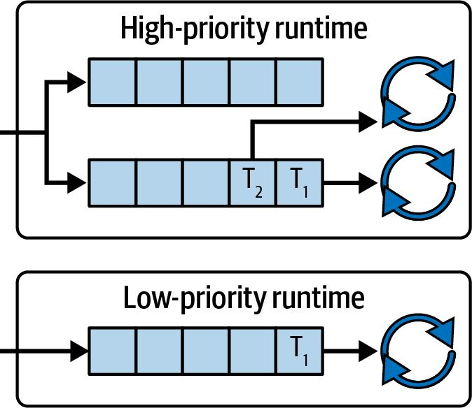


이 두 Tokio 런타임과 제3장에서 작업 훔치기(task stealing)가 적용된 두 개의 큐를 가졌던 런타임의 유일한 차이점은, 높은 우선순위 런타임의 스레드가 낮은 우선순위 런타임의 태스크를 훔치지 않는다는 점입니다. 또한 높은 우선순위 런타임에는 두 개의 큐가 있습니다. 같은 런타임 내의 스레드들은 태스크를 훔쳐 오므로, 태스크가 처리되는 정확한 순서를 신경 쓰지 않는 한 실질적으로는 하나의 큐와 같아서 차이가 그리 두드러지지는 않습니다.

또한 처리할 비동기 태스크가 남아 있지 않으면 스레드가 파킹된다는 점도 기억해야 합니다. 코어 수보다 많은 스레드가 있으면 OS가 이러한 스레드 간의 리소스 할당과 컨텍스트 스위칭을 관리합니다. 단순히 코어 수를 넘어 스레드를 늘린다고 해서 속도가 선형적으로 증가하지는 않습니다. 하지만 높은 우선순위 런타임에 3개의 스레드를 두고 낮은 우선순위 런타임에 2개의 스레드를 두면 여전히 리소스를 효과적으로 분배할 수 있습니다. 낮은 우선순위 런타임에서 처리할 태스크가 없다면 해당 2개의 스레드는 파킹되고, 높은 우선순위 런타임의 3개 스레드가 더 많은 CPU를 할당받게 됩니다.

이제 스레드와 런타임을 정의했으므로 이러한 스레드들과 다양한 방식으로 상호작용해야 합니다. 로컬 풀(local pool)을 사용하면 태스크의 흐름을 더욱 세밀하게 제어할 수 있습니다.

### 로컬 풀을 사용한 태스크 처리

로컬 풀을 사용하면 비동기 태스크를 처리하는 스레드를 보다 세밀하게 제어할 수 있습니다. 로컬 풀을 살펴보기에 앞서 다음 의존성을 추가해야 합니다.

```toml
[dependencies]
tokio-util = { version = "0.7.10", features = ["full"] }
```

또한 다음 import 문이 필요합니다.

```rust
use tokio_util::task::LocalPoolHandle;
use std::cell::RefCell;
```

로컬 풀을 사용할 때는 생성된 비동기 태스크를 특정 풀에 결속시킵니다. 이는 태스크가 특정 스레드에 머물도록 보장하기 때문에 `Send` 트레이트가 구현되지 않은 구조체도 사용할 수 있음을 의미합니다. 그러나 비동기 태스크가 특정 스레드에서 실행되도록 보장하기 때문에 작업 훔치기(task stealing)를 활용할 수 없으며, 표준 Tokio 런타임이 제공하는 기본 성능을 그대로 누릴 수는 없습니다.

비동기 태스크가 로컬 풀을 통해 어떻게 매핑되는지 확인하기 위해, 먼저 스레드 로컬 데이터를 정의해야 합니다.

```rust
thread_local! {
    pub static COUNTER: RefCell<u32> = RefCell::new(1);
}
```

모든 스레드는 각자의 `COUNTER` 변수에 접근할 수 있습니다. 그런 다음 스레드를 1초 동안 블로킹하고, 비동기 태스크가 동작 중인 스레드의 `COUNTER`를 증가시킨 후, `COUNTER`와 숫자를 출력하는 간단한 비동기 태스크를 작성합니다.

```rust
async fn something(number: u32) -> u32 {
    std::thread::sleep(std::time::Duration::from_secs(3));
    COUNTER.with(|counter| {
        *counter.borrow_mut() += 1;
        println!("Counter: {} for: {}", *counter.borrow(), number);
    });
    number
}
```

이 태스크를 통해 로컬 풀 구성에 따라 여러 태스크가 어떻게 처리되는지 살펴볼 것입니다.

`main` 함수에서는 스폰된 태스크를 여전히 `await`해야 하므로 Tokio 런타임이 필요합니다.

```rust
#[tokio::main(flavor = "current_thread")]
async fn main() {
    let pool = LocalPoolHandle::new(1);
    // ...
}
```

우리의 Tokio 런타임은 `current_thread` 플레이버(flavor)를 갖습니다. 이 글을 쓰는 시점에서 플레이버는 `CurrentThread` 또는 `MultiThread`입니다. `MultiThread` 옵션은 여러 스레드에 걸쳐 태스크를 실행합니다. `CurrentThread`는 모든 태스크를 현재 스레드에서 실행합니다. 또 다른 플레이버인 `MultiThreadAlt`도 여러 스레드에 걸쳐 태스크를 실행한다고 하지만 불안정(unstable) 상태입니다. 따라서 우리가 구현한 런타임은 현재 스레드에서 모든 태스크를 실행하며, 로컬 풀에는 풀 내에 스레드가 1개 있습니다.

이제 풀을 정의했으므로 이를 사용하여 태스크를 스폰할 수 있습니다.

```rust
let one = pool.spawn_pinned(|| async {
    println!("one");
    something(1).await
});
let two = pool.spawn_pinned(|| async {
    println!("two");
    something(2).await
});
let three = pool.spawn_pinned(|| async {
    println!("three");
    something(3).await
});
```

이제 세 개의 핸들을 얻었으므로 이 핸들들을 `await`하고 각 태스크의 합을 반환할 수 있습니다.

```rust
let result = async {
    let one = one.await.unwrap();
    let two = two.await.unwrap();
    let three = three.await.unwrap();
    one + two + three
};
println!("result: {}", result.await);
```

코드를 실행하면 다음과 같은 출력이 나타납니다.

```text
one
Counter: 2 for: 1
two
Counter: 3 for: 2
three
Counter: 4 for: 3
result: 6
```

태스크들은 순차적으로 처리되며, 가장 높은 `COUNTER` 값은 4입니다. 이는 모든 태스크가 단 하나의 스레드에서 처리되었음을 의미합니다. 이제 로컬 풀 크기를 3으로 늘리면 다음과 같은 출력이 나타납니다.

```text
one
three
two
Counter: 2 for: 1
Counter: 2 for: 3
Counter: 2 for: 2
result: 6
```

세 태스크 모두 스폰되자마자 처리를 시작했습니다. 또한 각 태스크에 대해 `COUNTER` 값이 2인 것을 볼 수 있습니다. 이는 세 태스크가 세 스레드에 분산되었음을 의미합니다.

또한 특정 스레드를 지정할 수도 있습니다. 예를 들어 인덱스가 0인 스레드에 태스크를 스폰할 수 있습니다.

```rust
let one = pool.spawn_pinned_by_idx(|| async {
    println!("one");
    something(1).await
}, 0);
```

인덱스가 0인 스레드에 모든 태스크를 스폰하면 다음과 같은 출력이 나옵니다.

```text
one
Counter: 2 for: 1
two
Counter: 3 for: 2
three
Counter: 4 for: 3
result: 6
```

풀에 스레드가 3개 있음에도 불구하고 단일 스레드 풀과 출력이 동일합니다. 표준 sleep 대신 Tokio sleep으로 바꾸면 다음과 같은 출력을 얻게 됩니다.

```text
one
two
three
Counter: 2 for: 1
Counter: 3 for: 2
Counter: 4 for: 3
result: 6
```

Tokio sleep은 비동기이므로 단일 스레드가 여러 비동기 태스크를 동시에 저글링할 수 있지만, `COUNTER` 접근은 sleep 이후에 일어납니다. `COUNTER` 값이 4인 것을 볼 수 있는데, 이는 스레드가 동시에 여러 비동기 태스크를 다루었음에도 불구하고 비동기 태스크들이 다른 스레드로 넘어가지 않았음을 의미합니다.

로컬 풀을 사용하면 태스크를 처리할 위치를 세밀하게 제어할 수 있습니다. 비록 작업 훔치기(task stealing)를 포기하게 되지만, 다음과 같은 이점들 때문에 로컬 풀을 사용하고 싶을 수 있습니다.

- **Non-Send 퓨처 처리**: 퓨처가 스레드 간에 전송될 수 없는 경우(`!Send`), 로컬 스레드 풀을 통해 처리할 수 있습니다.
- **스레드 선호도(Thread affinity)**: 태스크가 특정 스레드에서 실행되도록 보장할 수 있으므로 해당 스레드의 상태를 활용할 수 있습니다. 대표적인 예가 캐싱입니다. 서버와 같은 다른 리소스에서 값을 계산하거나 가져와야 하는 경우, 이를 특정 스레드에 캐시할 수 있습니다. 그러면 해당 스레드의 모든 태스크가 그 값에 접근할 수 있으므로, 해당 스레드로 보내는 모든 태스크는 값을 다시 가져오거나 계산할 필요가 없습니다.
- **스레드 로컬 연산의 성능**: 뮤텍스(`Mutex`)와 원자적 참조 카운터(`Arc`)를 사용하여 스레드 간에 데이터를 공유할 수 있습니다. 하지만 스레드 동기화에는 오버헤드가 수반됩니다. 예를 들어 다른 스레드들도 획득하려고 하는 락을 획득하는 작업은 비용이 듭니다. 그림 7-2에서 볼 수 있듯이, 4개의 워커 스레드가 있는 표준 Tokio 비동기 런타임에서 카운터가 `Arc<Mutex<T>>`인 경우 한 번에 하나의 스레드만 카운터에 접근할 수 있습니다.

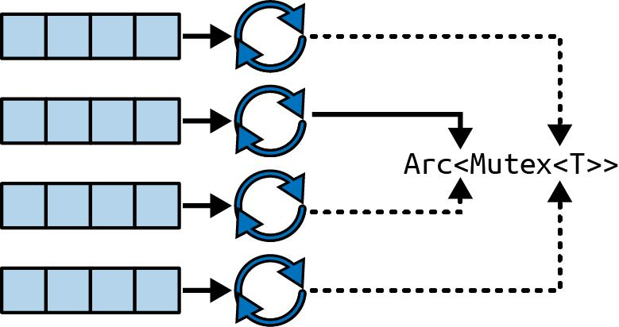


다른 세 스레드는 `Arc<Mutex<T>>`에 접근하기 위해 기다려야 합니다. 카운터의 상태를 각 스레드의 로컬로 유지하면 스레드가 뮤텍스 접근을 기다릴 필요가 없어져 처리 속도가 빨라집니다. 하지만 각 스레드의 로컬 카운터는 전체적인 상태를 담고 있지 않습니다. 이 카운터들은 다른 스레드에 있는 카운터의 상태를 알지 못합니다. 전체 카운트 상태를 얻는 한 가지 방법은 각 스레드에 카운터를 가져오는 비동기 태스크를 보내고 마지막에 각 스레드의 결과를 합치는 것입니다. 이 방식은 뒤의 "정상적인 셧다운(Graceful Shutdowns)" 절에서 다룹니다. 스레드 내의 로컬 데이터 접근은 CPU 데이터 캐싱 측면에서 CPU 바운드 태스크를 최적화하는 데도 도움이 될 수 있습니다.
- **Non-Send 리소스에 대한 안전한 접근**: 때로는 데이터 리소스가 스레드 안전(thread-safe)하지 않을 수 있습니다. 해당 리소스를 한 스레드에 유지하고 태스크를 해당 스레드로 보내 처리하도록 하는 것이 이를 해결하는 방법입니다.

> [!WARNING]
> 이 책 전반에서 블로킹 태스크로 인해 스레드가 블로킹될 위험성을 강조해 왔습니다. 하지만 로컬 풀에서는 작업 훔치기가 전혀 없기 때문에 블로킹이 미치는 피해가 훨씬 더 두드러질 수 있다는 점을 명심해야 합니다. Tokio의 `spawn_blocking` 함수를 사용하면 이를 방지할 수 있습니다.

지금까지는 `RefCell`을 사용하여 비동기 태스크에서 스레드의 상태에 접근할 수 있었습니다. `RefCell`을 사용하면 런타임에 Rust의 빌림 규칙(borrow rules)을 검사하면서 데이터에 접근할 수 있습니다. 그러나 이러한 검사는 `RefCell`의 데이터를 빌릴 때 약간의 오버헤드를 유발합니다. `unsafe` 코드를 사용하면 이러한 검사를 제거하면서도 데이터에 안전하게 접근할 수 있는데, 이는 다음 섹션에서 살펴보겠습니다.

### 스레드 데이터에 Unsafe 적용하기

스레드 데이터의 가변 빌림(mutable borrow)에 대한 런타임 검사를 제거하려면 데이터를 `UnsafeCell`로 감싸야 합니다. 이는 아무런 검사 없이 스레드 데이터에 직접 접근함을 의미합니다. 하지만 여러분이 무슨 생각을 하고 있는지 압니다. `UnsafeCell`을 사용하면 위험하지 않을까요? 잠재적으로는 그렇기 때문에 안전성을 보장하기 위해 주의를 기울여야 합니다.

우리의 시스템을 생각해 보면, 다른 스레드로 이전되지 않는 비동기 태스크들을 처리하는 단일 스레드가 있습니다. 이 단일 스레드가 폴링을 통해 동시에 여러 비동기 태스크를 다룰 수는 있지만, 실제로 활성 상태로 처리할 수 있는 비동기 태스크는 한 번에 하나뿐이라는 점을 기억해야 합니다. 따라서 비동기 태스크 중 하나가 `UnsafeCell`의 데이터에 접근하여 처리하는 동안에는 다른 어떤 비동기 태스크도 해당 데이터에 접근하지 않는다고 가정할 수 있습니다. `UnsafeCell` 자체는 비동기가 아니기 때문입니다. 하지만 데이터에 대한 참조가 스코프 내에 유효할 때 `await`를 두지 않도록 주의해야 합니다. 만약 그렇게 하면 기존 태스크가 데이터에 대한 참조를 여전히 쥐고 있는 상태에서 스레드가 다른 태스크로 컨텍스트 스위칭될 수 있기 때문입니다.

`unsafe` 코드의 해시맵을 수천 개의 비동기 태스크에 노출시키고 각 태스크에서 키의 값을 증가시켜 이를 테스트해 볼 수 있습니다. 이 테스트를 실행하려면 다음 import 문이 필요합니다.

```rust
use tokio_util::task::LocalPoolHandle;
use std::time::Instant;
use std::cell::UnsafeCell;
use std::collections::HashMap;
```

그런 다음 스레드 상태를 정의합니다.

```rust
use std::cell::UnsafeCell;
use std::collections::HashMap;

thread_local! {
    pub static COUNTER: UnsafeCell<HashMap<u32, u32>> = UnsafeCell::new(HashMap::new());
}
```

다음으로 `unsafe` 코드를 사용하여 스레드 데이터에 접근하고 업데이트하는 비동기 태스크를 정의합니다.

```rust
async fn something(number: u32) {
    tokio::time::sleep(std::time::Duration::from_secs(number as u64)).await;
    COUNTER.with(|counter| {
        let counter = unsafe { &mut *counter.get() };
        match counter.get_mut(&number) {
            Some(count) => {
                let placeholder = *count + 1;
                *count = placeholder;
            }
            None => {
                counter.insert(number, 1);
            }
        }
    });
}
```

태스크들이 스레드 데이터에 접근하는 순서를 뒤섞기 위해 입력된 숫자만큼의 대기 시간을 갖는 Tokio sleep을 추가했습니다. 그런 다음 데이터에 대한 가변 참조를 얻어 연산을 수행합니다. 데이터에 접근하는 `COUNTER.with` 블록에 주목하세요. 이 블록은 비동기 블록이 아니므로 데이터에 접근하는 동안 `await` 연산을 사용할 수 없습니다. `unsafe` 데이터에 접근하는 동안에는 다른 비동기 태스크로 컨텍스트 스위칭될 수 없습니다. `COUNTER.with` 블록 내부에서는 `unsafe` 코드를 사용하여 데이터에 직접 접근하고 카운트를 증가시킵니다.

테스트가 완료되면 스레드 상태를 출력해야 합니다. 따라서 출력 연산을 수행하기 위해 스레드에 비동기 태스크를 전달해야 하며, 이는 다음과 같은 형태를 취합니다.

```rust
async fn print_statement() {
    COUNTER.with(|counter| {
        let counter = unsafe { &mut *counter.get() };
        println!("Counter: {:?}", counter);
    });
}
```

이제 모든 것이 준비되었으므로 메인 비동기 함수에서 코드를 실행하기만 하면 됩니다. 먼저 단일 스레드로 구성된 로컬 스레드 풀을 설정하고, 1부터 5까지의 시퀀스를 10만 번 반복합니다.

```rust
let pool = LocalPoolHandle::new(1);
let sequence = [1, 2, 3, 4, 5];
let repeated_sequence: Vec<_> = sequence.iter()
    .cycle()
    .take(500000)
    .cloned()
    .collect();
```

이렇게 하면 다양한 Tokio sleep 대기 시간을 가진 50만 개의 비동기 태스크가 준비되며, 이를 이 단일 스레드에 던져 넣을 것입니다. 그런 다음 이 숫자들을 순회하면서 비동기 함수를 두 번 호출하는 태스크를 생성하여, 스레드로 전송된 태스크가 각 함수 사이와 각 함수 내부에서 스레드가 컨텍스트 스위칭하도록 유도합니다.

```rust
let mut futures = Vec::new();
for number in repeated_sequence {
    futures.push(pool.spawn_pinned(move || async move {
        something(number).await;
        something(number).await;
    }));
}
```

태스크를 처리할 때 스레드가 여러 번 컨텍스트 스위칭하도록 적극적으로 유도하고 있습니다. 이러한 컨텍스트 스위칭은 다양한 sleep 지속 시간 및 많은 태스크 총량과 결합되어, 데이터 접근 시 충돌이 발생한다면 카운트 결과에 불일치를 초래할 것입니다. 마지막으로 핸들들을 순회하면서 모두 조인(join)하여 모든 비동기 태스크가 실행되었음을 보장하고, 다음 코드를 사용하여 카운트를 출력합니다.

```rust
for i in futures {
    let _ = i.await.unwrap();
}
let _ = pool.spawn_pinned(|| async {
    print_statement().await
}).await.unwrap();
```

최종 결과는 다음과 같아야 합니다.

```text
Counter: {2: 200000, 4: 200000, 1: 200000, 3: 200000, 5: 200000}
```

아무리 여러 번 실행하더라도 카운트는 항상 동일합니다. 여기서 우리는 불일치가 발생했을 때 여러 번 재시도해야 하는 compare-and-swap 같은 원자적(atomic) 연산을 수행할 필요가 없었습니다. 또한 락에서 `await`할 필요도 없었습니다. 데이터에 대한 가변 참조를 만들기 전에 다른 가변 참조가 있는지 확인할 필요조차 없었습니다. 이 컨텍스트에서 우리의 `unsafe` 코드는 안전합니다.

이제 스레드의 상태를 활용하여 비동기 태스크에 영향을 미칠 수 있게 되었습니다. 하지만 시스템이 셧다운되면 어떻게 될까요? 런타임을 다시 시작할 때 상태를 재생성할 수 있도록 정리(cleanup) 프로세스를 두고 싶을 수 있습니다. 여기서 정상적인 셧다운(graceful shutdown)이 등장합니다.

### 정상적인 셧다운

정상적인 셧다운(graceful shutdown)에서는 프로그램이 종료되기 전에 일련의 프로세스를 수행할 수 있도록 프로그램이 종료되는 시점을 감지합니다. 이러한 프로세스에는 다른 프로그램으로 시그널 전송하기, 상태 저장하기, 트랜잭션 정리하기 등 프로그램 종료 전에 수행하고자 하는 모든 작업이 포함될 수 있습니다.

이 주제에 대한 첫 번째 탐색으로 Ctrl-C 시그널을 살펴볼 수 있습니다. 일반적으로 터미널을 통해 Rust 프로그램을 실행할 때 Ctrl-C를 누르면 프로그램이 종료됩니다. 그러나 `tokio::signal` 모듈을 사용하면 이러한 조기 종료 동작을 덮어쓸 수 있습니다. Ctrl-C 시그널을 덮어썼음을 확실히 증명하기 위해 프로그램을 종료하기 전에 Ctrl-C 시그널을 세 번 받아야 하는 간단한 프로그램을 만들어 보겠습니다. 다음과 같이 백그라운드 비동기 태스크를 작성하여 이를 구현할 수 있습니다.

```rust
async fn cleanup() {
    println!("cleanup background task started");
    let mut count = 0;
    loop {
        tokio::signal::ctrl_c().await.unwrap();
        println!("ctrl-c received!");
        count += 1;
        if count > 2 {
            std::process::exit(0);
        }
    }
}
```

다음으로 백그라운드 태스크를 실행하고 무한 루프를 도는 메인 함수를 작성합니다.

```rust
#[tokio::main]
async fn main() {
    tokio::spawn(cleanup());
    loop {
    }
}
```

프로그램을 실행하고 Ctrl-C를 세 번 누르면 다음과 같은 출력이 나타납니다.

```text
cleanup background task started
^Cctrl-c received!
^Cctrl-c received!
^Cctrl-c received!
```

시그널이 세 번 전달될 때까지 프로그램은 종료되지 않았습니다. 이제 우리는 원하는 조건에 따라 프로그램을 종료할 수 있게 되었습니다. 하지만 넘어가기 전에, 백그라운드 태스크의 루프에서 Ctrl-C 시그널을 `await`하기 전에 블로킹 sleep을 추가해 보겠습니다.

```rust
loop {
    std::thread::sleep(std::time::Duration::from_secs(5));
    tokio::signal::ctrl_c().await.unwrap();
    // ...
}
```

프로그램을 다시 실행하고 5초가 지나기 전에 Ctrl-C를 누르면 프로그램이 바로 종료되어 버립니다. 이를 통해 프로그램이 해당 시그널을 직접 `await`하고 있을 때만 원하는 대로 Ctrl-C 시그널을 처리할 수 있음을 추론할 수 있습니다. 비동기 런타임을 관리하는 별도의 스레드를 스폰함으로써 이 문제를 해결할 수 있습니다. 그런 다음 메인 스레드의 나머지 부분을 시그널 감지에 사용합니다.

```rust
#[tokio::main(flavor = "current_thread")]
async fn main() {
    std::thread::spawn(|| {
        let runtime = tokio::runtime::Builder::new_multi_thread()
            .enable_all()
            .build()
            .unwrap();
        runtime.block_on(async {
            println!("Hello, world!");
        });
    });
    let mut count = 0;
    loop {
        tokio::signal::ctrl_c().await.unwrap();
        println!("ctrl-c received!");
        count += 1;
        if count > 2 {
            std::process::exit(0);
        }
    }
}
```

이제 비동기 런타임이 무엇을 처리하고 있든 상관없이 메인 스레드는 언제든 Ctrl-C 시그널에 반응할 준비가 되어 있습니다. 그렇다면 스레드 상태는 어떻게 처리해야 할까요? 정리(cleanup) 프로세스 중에 현재 상태를 추출하여 파일에 기록해 두면 프로그램이 다시 시작될 때 해당 상태를 불러올 수 있습니다. 파일을 쓰고 읽는 것은 간단하므로, 이전 섹션에서 구축했던 격리된 스레드들로부터 상태를 추출하는 작업에 집중해 보겠습니다. 이전 섹션과의 주된 차이점은 태스크를 4개의 격리된 스레드에 분산시킨다는 점입니다. 먼저 로컬 스레드 풀을 지연 평가로 감쌉니다.

```rust
static RUNTIME: LazyLock<LocalPoolHandle> = LazyLock::new(|| {
    LocalPoolHandle::new(4)
});
```

스레드의 상태를 추출하는 비동기 태스크를 정의해야 합니다.

```rust
fn extract_data_from_thread() -> HashMap<u32, u32> {
    let mut extracted_counter: HashMap<u32, u32> = HashMap::new();
    COUNTER.with(|counter| {
        let counter = unsafe { &mut *counter.get() };
        extracted_counter = counter.clone();
    });
    return extracted_counter;
}
```

이 태스크를 각 스레드로 전달하면 전체 시스템의 총 카운트 수를 논블로킹 방식으로 합산할 수 있습니다(그림 7-3).

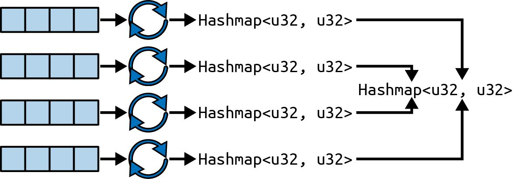


그림 7-3에 도식화된 프로세스는 다음 코드로 구현할 수 있습니다.

```rust
async fn get_complete_count() -> HashMap<u32, u32> {
    let mut complete_counter = HashMap::new();
    let mut extracted_counters = Vec::new();
    for i in 0..4 {
        extracted_counters.push(RUNTIME.spawn_pinned_by_idx(|| {
            async move {
                extract_data_from_thread()
            }
        }, i));
    }
    for counter_future in extracted_counters {
        let extracted_counter = counter_future.await.unwrap_or_default();
        for (key, count) in extracted_counter {
            *complete_counter.entry(key).or_insert(0) += count;
        }
    }
    return complete_counter;
}
```

`spawn_pinned_by_idx`를 호출하여 모든 스레드에 정확히 하나의 `extract_data_from_thread` 태스크만 전송되도록 보장합니다.

이제 다음과 같은 메인 함수를 사용하여 시스템을 실행할 준비가 되었습니다.

```rust
#[tokio::main(flavor = "current_thread")]
async fn main() {
    let _handle = tokio::spawn(async {
        // 태스크 스폰 로직
    });
    tokio::signal::ctrl_c().await.unwrap();
    println!("ctrl-c received!");
    let complete_counter = get_complete_count().await;
    println!("Complete counter: {:?}", complete_counter);
}
```

`tokio::spawn` 내부에서 카운트를 증가시키는 태스크들을 스폰합니다.

```rust
let sequence = [1, 2, 3, 4, 5];
let repeated_sequence: Vec<_> = sequence.iter().cycle()
    .take(500000)
    .cloned()
    .collect();
let mut futures = Vec::new();
for number in repeated_sequence {
    futures.push(RUNTIME.spawn_pinned(move || async move {
        something(number).await;
        something(number).await;
    }));
}
for i in futures {
    let _ = i.await.unwrap();
}
println!("All futures completed");
```

이제 시스템을 실행할 준비가 되었습니다. 모든 퓨처가 완료되었다는 출력이 나타날 때까지 프로그램을 실행한 후 Ctrl-C를 누르면 다음과 같은 출력이 나타납니다.

```text
Complete counter: {1: 200000, 4: 200000, 2: 200000, 5: 200000, 3: 200000}
```

`spawn_pinned_by_idx` 함수를 사용하여 각 스레드에 정확히 하나의 추출 태스크만 보냈고, 모든 태스크를 단일 스레드로 실행했을 때와 총 카운트가 동일하다는 것을 알고 있으므로 데이터 추출이 정확함을 결론지을 수 있습니다. 퓨처들이 완료되기 전에 Ctrl-C를 누르면 다음과 유사한 출력이 나타납니다.

```text
Complete counter: {2: 100000, 3: 32290, 1: 200000}
```

프로그램이 완료되기 전에 종료되었으며, 현재 상태를 성공적으로 얻었습니다. 이제 원한다면 프로그램을 종료하기 전에 이 상태를 저장할 수 있습니다.

작성한 코드는 Ctrl-C를 눌렀을 때 정리를 수월하게 해주지만, 이 시그널이 시스템을 종료하는 가장 실용적인 방법이 아닐 때도 있습니다. 예를 들어 터미널이 프로그램에 묶여 있지 않도록 비동기 시스템을 백그라운드에서 실행하고 있을 수 있습니다. 이때 시스템에 SIGHUP 시그널을 보내 프로그램을 종료할 수 있습니다. SIGHUP 시그널을 감지하려면 다음 import 문이 필요합니다.

```rust
use tokio::signal::unix::{signal, SignalKind};
```

그런 다음 메인 함수의 하단에 있는 Ctrl-C 코드를 다음과 같이 교체할 수 있습니다.

```rust
let pid = std::process::id();
println!("The PID of this process is: {}", pid);
let mut stream = signal(SignalKind::hangup()).unwrap();
stream.recv().await;
let complete_counter = get_complete_count().await;
println!("Complete counter: {:?}", complete_counter);
```

다음 명령을 통해 시그널을 보낼 대상 PID를 알 수 있도록 PID를 출력합니다.

```bash
kill -SIGHUP <pid>
```

kill 명령을 실행하면 Ctrl-C를 눌렀을 때와 유사한 결과를 얻을 수 있습니다. 이제 여러분은 런타임 구성 방식, 태스크 실행 방식, 런타임 종료 방식 측면에서 Tokio를 커스터마이징하는 방법을 익혔다고 할 수 있습니다.

### 요약

이번 장에서는 Tokio 런타임을 설정하는 구체적인 세부 사항과 해당 설정들이 런타임 동작 방식에 미치는 영향을 자세히 알아보았습니다. 이러한 세부 설정을 통해 런타임의 워커 스레드 수, 블로킹 스레드 수, 폴링할 새 태스크를 받아들이기 전에 수행되는 틱 수 등을 세밀하게 제어해 보았습니다. 또한 동일한 프로그램 안에서 서로 다른 런타임을 정의하여 태스크를 어떤 런타임으로 보낼지 선택하는 방법도 살펴보았습니다. Tokio 런타임의 스레드는 사용되지 않을 때 파킹되므로, 특정 런타임이 계속 사용되지 않더라도 리소스가 낭비되지 않는다는 점을 기억하십시오.

그런 다음 로컬 풀을 사용하여 스레드가 태스크를 처리하는 방식을 제어했습니다. 심지어 Tokio 런타임 내에서 스레드 상태에 대한 `unsafe` 접근을 테스트하여 태스크 내에서 스레드 상태에 접근하는 것이 안전함을 입증하기도 했습니다. 마지막으로 정상적인 셧다운(graceful shutdown)을 다루었습니다. 비록 자체적인 보일러플레이트 코드를 작성할 필요는 없지만, Tokio는 여전히 뛰어난 유연성을 바탕으로 런타임을 구성할 수 있는 능력을 제공합니다. 비동기 Rust 개발자로 일하면서 Tokio를 사용하는 코드베이스를 접하게 될 것임은 의심의 여지가 없습니다. 이제 코드베이스에서 Tokio 런타임을 커스터마이징하고 비동기 태스크가 처리되는 방식을 능숙하게 관리할 수 있을 것입니다. 제8장에서는 모듈식으로 비동기 문제를 해결하기 위해 액터 모델(actor model)을 구현해 보겠습니다.

# 제8장 액터 모델

액터(Actor)는 오직 메시지 전달(message passing)을 통해서만 통신하는 격리된 코드 단위입니다. 액터는 자신이 참조하고 조작할 수 있는 상태(state)를 가질 수도 있습니다. 비동기와 호환되는 논블로킹 채널이 있으므로, 비동기 런타임은 여러 액터를 효율적으로 다루면서 채널로 메시지를 수신했을 때만 해당 액터를 깨워 진행시킬 수 있습니다.

액터의 격리성은 손쉬운 비동기 테스트와 간결한 비동기 시스템 구현을 가능하게 합니다. 이 장을 마치면 라우터(router) 액터를 갖춘 액터 시스템을 구축할 수 있게 됩니다. 이 액터 시스템은 시스템 참조를 이리저리 전달할 필요 없이 프로그램 어디서나 쉽게 호출할 수 있습니다. 또한 다른 액터들을 추적 관찰하다가, 액터가 정해진 시간 임계값을 넘도록 수퍼바이저에게 핑(ping)을 보내지 못하면 해당 액터를 강제 재시작시키는 수퍼바이저 하트비트(supervisor heartbeat) 시스템도 구축할 수 있게 됩니다. 이 여정을 시작하기 위해 먼저 기본적인 액터를 만드는 방법부터 이해해 보겠습니다.

### 기본 액터 만들기

우리가 만들 수 있는 가장 기본적인 액터는 메시지를 수신 대기하는 무한 루프에 들어 있는 비동기 함수입니다.

```rust
use tokio::sync::{
    mpsc::channel,
    mpsc::{Receiver, Sender},
    oneshot,
};

struct Message {
    value: i64,
}

async fn basic_actor(mut rx: Receiver<Message>) {
    let mut state = 0;
    while let Some(msg) = rx.recv().await {
        state += msg.value;
        println!("Received: {}", msg.value);
        println!("State: {}", state);
    }
}
```

이 액터는 다중 생산자, 단일 소비자 채널(mpsc, multi-producer, single-consumer)을 사용하여 들어오는 메시지를 수신하고, 상태를 갱신한 다음 이를 출력합니다. 다음과 같이 액터를 테스트해 볼 수 있습니다.

```rust
#[tokio::main]
async fn main() {
    let (tx, rx) = channel::<Message>(100);
    let _actor_handle = tokio::spawn(
        basic_actor(rx)
    );
    for i in 0..10 {
        let msg = Message { value: i };
        tx.send(msg).await.unwrap();
    }
}
```

하지만 응답을 받고 싶다면 어떻게 해야 할까요? 지금 상태에서는 메시지를 보낸 뒤 터미널에 출력되는 내용만 확인하고 있습니다. 액터에 보내는 메시지 안에 `oneshot::Sender`를 함께 담으면 응답을 받을 수 있습니다. 메시지를 수신한 액터는 이 `oneshot::Sender`를 사용하여 응답을 보낼 수 있습니다. 응답을 반환하는 액터는 다음과 같이 정의할 수 있습니다.

```rust
struct RespMessage {
    value: i32,
    responder: oneshot::Sender<i64>,
}

async fn resp_actor(mut rx: Receiver<RespMessage>) {
    let mut state = 0;
    while let Some(msg) = rx.recv().await {
        state += msg.value;
        if msg.responder.send(state).is_err() {
            eprintln!("Failed to send response");
        }
    }
}
```

응답형 액터에 메시지를 보내려면 원샷(oneshot) 채널을 생성하고, 이를 사용해 메시지를 구성한 뒤 메시지를 전송하고 응답을 기다려야 합니다. 다음 코드는 이를 수행하는 기본적인 예제를 보여줍니다.

```rust
let (tx, rx) = channel::<RespMessage>(100);
let _resp_actor_handle = tokio::spawn(async {
    resp_actor(rx).await;
});
for i in 0..10 {
    let (resp_tx, resp_rx) = oneshot::channel::<i64>();
    let msg = RespMessage {
        value: i,
        responder: resp_tx,
    };
    tx.send(msg).await.unwrap();
    println!("Response: {}", resp_rx.await.unwrap());
}
```

여기서는 원샷 채널을 사용하는데, 응답이 단 한 번만 전송되면 클라이언트 코드가 다른 작업을 계속 진행할 수 있기 때문입니다. 원샷 채널은 단 하나의 메시지만 회신하고 닫히는 사용 사례에 맞게 메모리와 동기화 측면에서 최적화되어 있으므로, 우리의 사용 사례에 가장 적합한 선택입니다.

채널을 통해 구조체를 액터에 전달하고 있다는 점을 고려하면, 기능의 복잡도를 점차 확장할 수 있음을 알 수 있습니다. 예를 들어 여러 메시지를 캡슐화하는 열거형(enum)을 전달하면, 전송되는 메시지 타입에 따라 액터가 다양한 동작을 수행하도록 지시할 수 있습니다. 액터는 또한 새로운 액터를 생성하거나 다른 액터에 메시지를 보낼 수도 있습니다.

앞서 살펴본 예제의 경우, 상태를 변경하기 위해 뮤텍스(mutex)를 사용하고 락을 획득하는 방식을 취할 수도 있었습니다. 뮤텍스는 코드로 작성하기 간단하지만, 액터와 비교했을 때 성능이나 구조 면에서 어떤 차이가 있을까요?

### 액터 대 뮤텍스 비교

이 실습을 위해 다음과 같은 추가 임포트가 필요합니다.

```rust
use std::sync::Arc;
use tokio::sync::Mutex;
use tokio::sync::mpsc::error::TryRecvError;
```

이전 절의 액터가 수행한 작업을 뮤텍스로 재현하기 위해, 다음과 같은 형태의 함수를 만듭니다.

```rust
async fn actor_replacement(state: Arc<Mutex<i64>>, value: i64) -> i64 {
    let mut state = state.lock().await;
    *state += value;
    return *state;
}
```

작성하기는 간단하지만, 성능 면에서는 어떨까요? 간단한 테스트를 설계해 볼 수 있습니다.

```rust
let state = Arc::new(Mutex::new(0));
let mut handles = Vec::new();
let now = tokio::time::Instant::now();
for i in 0..100000000 {
    let state_ref = state.clone();
    let future = async move {
        let handle = tokio::spawn(async move {
            actor_replacement(state_ref, i).await
        });
        let _ = handle.await.unwrap();
    };
    handles.push(tokio::spawn(future));
}
for handle in handles {
    let _ = handle.await.unwrap();
}
println!("Elapsed: {:?}", now.elapsed());
```

한 번에 수많은 태스크를 스폰하여 뮤텍스에 접근하도록 시도한 뒤 이들을 대기시켰습니다. 태스크를 한 번에 하나씩 스폰한다면 동시성이 뮤텍스 결과에 미치는 진정한 영향을 확인할 수 없을 것입니다. 대신 개별 트랜잭션의 속도만 측정하게 될 뿐입니다. 두 접근 방식 간에 통계적으로 유의미한 차이를 확인하기 위해 대량의 태스크를 실행합니다.

비교를 위해 액터 접근 방식에 대해서도 동일한 수의 태스크로 동일한 작업을 수행해 봅니다.

```rust
let (tx, rx) = channel::<RespMessage>(100);
let _resp_actor_handle = tokio::spawn(async {
    resp_actor(rx).await;
});
let mut handles = Vec::new();
let now = tokio::time::Instant::now();
for i in 0..100000000 {
    let tx_ref = tx.clone();
    let future = async move {
        let (resp_tx, resp_rx) = oneshot::channel::<i64>();
        let msg = RespMessage {
            value: i,
            responder: resp_tx,
        };
        tx_ref.send(msg).await.unwrap();
        let _ = resp_rx.await.unwrap();
    };
    handles.push(tokio::spawn(future));
}
for handle in handles {
    let _ = handle.await.unwrap();
}
println!("Elapsed: {:?}", now.elapsed());
```

집필 시점을 기준으로 이 테스트를 실행했을 때 뮤텍스는 103초가 걸렸습니다. 컴파일러 최적화가 시스템에 미치는 영향을 확인하기 위해 `--release` 모드로 테스트를 실행했다는 점에 유의하십시오. 액터 방식은 52초 더 빨랐습니다. 그 이유 중 하나는 뮤텍스 락 획득의 오버헤드입니다. 채널에 메시지를 넣을 때는 채널이 가득 찼는지, 닫혔는지만 확인하면 됩니다. 반면 뮤텍스를 획득할 때의 검사는 더 복잡합니다. 일반적으로 다른 태스크가 락을 쥐고 있는지 확인해야 하며, 만약 그렇다면 락을 획득하려는 태스크는 대기 등록을 하고 알림을 받을 때까지 기다려야 합니다.

> **참고:** 동시성 환경에서는 일반적으로 채널을 통해 메시지를 전달하는 방식이 뮤텍스보다 확장성이 더 뛰어납니다. 송신자가 다른 태스크가 작업을 마칠 때까지 기다릴 필요가 없기 때문입니다. 채널 큐에 메시지를 넣기 위해 대기해야 할 수는 있지만, 큐에 메시지를 넣기 위해 대기하는 것이 뮤텍스로 작업 중인 연산이 끝나기를 기다리고, 락을 양도받고, 대기 중이던 태스크가 다시 락을 획득하는 과정보다 훨씬 빠릅니다. 결과적으로 채널을 사용하는 것이 더 높은 처리량(throughput)을 가져올 수 있습니다.

요점을 더 명확히 하기 위해, 트랜잭션이 단순히 값을 1 증가시키는 것보다 더 복잡한 시나리오를 살펴봅시다. 최종 결과를 상태에 커밋하고 숫자를 반환하기 전에 몇 가지 유효성 검사와 계산을 거쳐야 한다고 가정해 보겠습니다. 효율성을 추구하는 엔지니어라면 이러한 처리가 진행되는 동안 다른 작업을 수행하고 싶을 것입니다. 액터 코드에서는 메시지를 전송하고 응답을 기다리는 구조이므로, 아래에서 볼 수 있듯이 이미 그러한 여유를 누릴 수 있습니다.

```rust
let future = async move {
    let (resp_tx, resp_rx) = oneshot::channel::<i32>();
    let msg = RespMessage {
        value: i,
        responder: resp_tx,
    };
    tx_ref.send(msg).await.unwrap();
    // 다른 작업 수행
    let _ = resp_rx.await.unwrap();
};
```

반면 뮤텍스 구현은 단순히 제어권을 스케줄러에 양보할 뿐입니다. 복잡한 트랜잭션이 완료되기를 기다리는 동안 뮤텍스 태스크를 계속 진행시키려면 다음과 같이 또 다른 비동기 태스크를 스폰해야 합니다.

```rust
async fn actor_replacement(state: Arc<Mutex<i32>>, value: i32) -> i32 {
    let update_handle = tokio::spawn(async move {
        let mut state = state.lock().await;
        *state += value;
        return *state;
    });
    // 다른 작업 수행
    update_handle.await.unwrap()
}
```

그러나 이러한 추가 비동기 태스크를 스폰하는 오버헤드로 인해 테스트 소요 시간이 174초로 치솟습니다. 동일한 기능임에도 액터보다 73초나 더 걸린 것입니다. 비동기 태스크를 런타임에 보내고 핸들을 돌려받는 작업 자체가, 나중에 태스크에서 트랜잭션 결과를 기다릴 수 있게 하기 위한 용도로만 쓰였음을 생각하면 놀라운 결과가 아닙니다.

이러한 테스트 결과를 염두에 두면 왜 액터를 사용하려 하는지 이해할 수 있습니다. 액터는 작성하기가 더 복잡합니다. 결과를 얻기 위해서만도 채널을 통해 메시지를 전달해야 하고, 액터가 응답할 수 있도록 원샷 채널을 동봉해야 합니다. 이는 단순히 락을 획득하는 것보다 복잡합니다. 하지만 해당 메시지의 결과를 언제 기다릴지 선택할 수 있는 유연성은 액터에서 기본적으로 주어집니다. 반면 뮤텍스는 그러한 유연성을 원할 경우 큰 대가를 치러야 합니다.

또한 액터가 개념적으로 이해하기 더 쉽다고 주장할 수도 있습니다. 생각해 보면 액터는 자신의 상태를 내부에 격리하여 보관합니다. 해당 상태와 일어나는 모든 상호작용을 확인하고 싶다면 액터 코드만 살펴보면 됩니다. 반면 뮤텍스 기반 코드베이스에서는 상태와의 모든 상호작용이 어디서 일어나는지 파악하기 어렵습니다. 시스템 전반에 걸쳐 분산된 뮤텍스 상호작용은 결합도(coupling)를 크게 높여 리팩터링을 골치 아프게 만듭니다.

이제 액터가 동작하게 만들었으므로 시스템에서 액터를 활용할 수 있어야 합니다. 최소한의 설치 공간(footprint)으로 시스템에 액터를 도입하는 가장 쉬운 방법은 라우터 패턴(router pattern)입니다.

### 라우터 패턴 구현하기

라우팅을 위해 메시지를 수신하는 라우터 액터를 구축합니다. 이러한 메시지는 라우터가 올바른 액터를 찾을 수 있도록 돕는 열거형(enum)으로 감쌀 수 있습니다. 이번 예제에서는 기본적인 키-값 저장소(key-value store)를 구현해 보겠습니다. 비록 러스트로 키-값 저장소를 구축하고 있지만, 이 교육용 예제를 프로덕션 환경에서 사용해서는 안 된다는 점을 강조해야겠습니다. RocksDB나 Redis 같은 성숙한 솔루션들은 견고하고 확장 가능한 키-값 저장소를 만들기 위해 엄청난 노력과 전문성을 쏟아부었습니다.

키-값 저장소에서는 키를 설정(set), 조회(get), 삭제(delete)할 수 있어야 합니다. 그림 8-1에 정의된 메시지 구조를 통해 이 모든 연산을 전달할 수 있습니다.

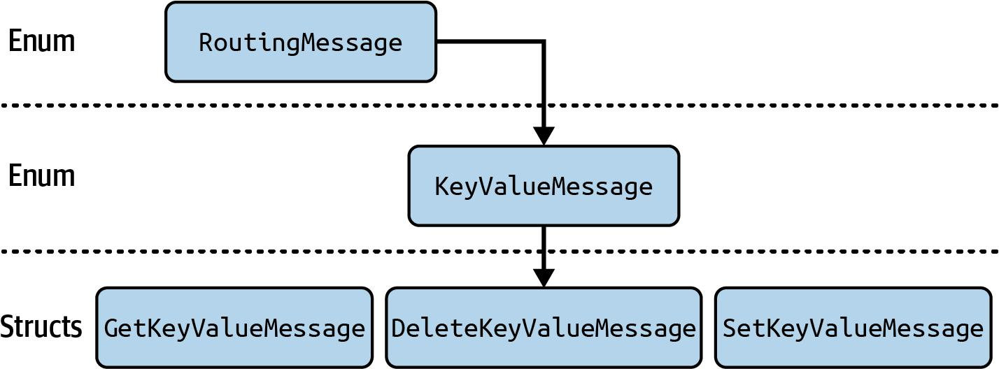


코드를 작성하기 전에 다음과 같은 임포트가 필요합니다.

```rust
use tokio::sync::{
    mpsc::channel,
    mpsc::{Receiver, Sender},
    oneshot,
};
use std::sync::OnceLock;
```

또한 그림 8-1에 표시된 메시지 구조를 정의해야 합니다.

```rust
struct SetKeyValueMessage {
    key: String,
    value: Vec<u8>,
    response: oneshot::Sender<()>,
}

struct GetKeyValueMessage {
    key: String,
    response: oneshot::Sender<Option<Vec<u8>>>,
}

struct DeleteKeyValueMessage {
    key: String,
    response: oneshot::Sender<()>,
}

enum KeyValueMessage {
    Get(GetKeyValueMessage),
    Delete(DeleteKeyValueMessage),
    Set(SetKeyValueMessage),
}

enum RoutingMessage {
    KeyValue(KeyValueMessage),
}
```

이제 키-값 액터로 라우팅될 수 있는 메시지를 갖추었으며, 이 메시지는 연산을 수행하는 데 필요한 데이터와 함께 올바른 연산을 나타냅니다. 키-값 액터에서는 `KeyValueMessage`를 받아 배리언트(variant)를 매칭하고 다음과 같이 연산을 수행합니다.

```rust
async fn key_value_actor(mut receiver: Receiver<KeyValueMessage>) {
    let mut map = std::collections::HashMap::new();
    while let Some(message) = receiver.recv().await {
        match message {
            KeyValueMessage::Get(
                GetKeyValueMessage { key, response }
            ) => {
                let _ = response.send(map.get(&key).cloned());
            }
            KeyValueMessage::Delete(
                DeleteKeyValueMessage { key, response }
            ) => {
                map.remove(&key);
                let _ = response.send(());
            }
            KeyValueMessage::Set(
                SetKeyValueMessage { key, value, response }
            ) => {
                map.insert(key, value);
                let _ = response.send(());
            }
        }
    }
}
```

키-값 메시지 처리가 준비되었으므로, 키-값 액터를 라우터 액터와 연결해야 합니다.

```rust
async fn router(mut receiver: Receiver<RoutingMessage>) {
    let (key_value_sender, key_value_receiver) = channel(32);
    tokio::spawn(key_value_actor(key_value_receiver));
    while let Some(message) = receiver.recv().await {
        match message {
            RoutingMessage::KeyValue(message) => {
                let _ = key_value_sender.send(message).await;
            }
        }
    }
}
```

라우터 액터 내부에서 키-값 액터를 생성합니다. 액터는 다른 액터를 생성할 수 있습니다. 라우터 액터 내부에 키-값 액터 생성을 배치하면 시스템 설정에서 실수가 발생하는 것을 원천 차단할 수 있습니다. 또한 프로그램 내에서 액터 시스템 설정에 필요한 코드 크기를 줄여줍니다. 라우터는 우리의 인터페이스이므로, 모든 것은 다른 액터에 도달하기 위해 라우터를 통과하게 됩니다.

이제 라우터가 정의되었으므로, 해당 라우터용 채널로 관심을 돌려야 합니다. 액터 시스템으로 전송되는 모든 메시지는 이 채널을 통과하게 됩니다. 여기서 32라는 숫자는 임의로 선택한 값으로, 채널이 한 번에 최대 32개의 메시지를 담을 수 있음을 의미합니다. 이 버퍼 크기는 어느 정도의 유연성을 제공합니다.

해당 채널의 송신자(sender)에 대한 참조를 계속 추적해야 한다면 시스템은 그다지 유용하지 않을 것입니다. 만약 개발자가 액터 시스템에 메시지를 보내려 하는데 호출 깊이가 4단계 깊다면, 자신이 작업 중인 함수로 이어지는 모든 함수의 매개변수에 채널 송신자를 열어주면서 main 함수까지 거슬러 올라가야 할 때 느낄 좌절감을 상상해 보십시오. 나중에 변경 사항을 적용할 때도 똑같이 골치 아플 것입니다. 이러한 불편을 피하기 위해 송신자를 전역 정적(global static) 변수로 정의합니다.

```rust
static ROUTER_SENDER: OnceLock<Sender<RoutingMessage>> = OnceLock::new();
```

라우터용 메인 채널을 생성할 때 이 송신자를 설정할 것입니다. 라우터 액터 함수 내부에서 메인 채널을 구성하고 `ROUTER_SENDER`를 설정하는 편이 더 인체공학적이지 않을까 생각할 수도 있습니다. 하지만 채널이 설정되기 전에 함수들이 메인 채널로 메시지를 보내려고 하면 동시성 문제가 발생할 수 있습니다. 비동기 런타임은 여러 스레드에 걸쳐 실행될 수 있으므로, 라우터 액터가 채널을 설정하려고 시도하는 동안 다른 비동기 태스크가 채널 호출을 시도할 가능성이 있습니다. 따라서 아무것도 스폰하기 전에 `main` 함수의 시작 부분에서 채널을 설정하는 것이 좋습니다. 그러면 라우터 액터가 비동기 런타임에서 가장 먼저 폴링되는 태스크가 아니더라도, 자신이 폴링되기 전에 채널로 전송된 메시지에 여전히 접근할 수 있습니다.

> [!WARNING]
> **정적 전역 변수 사용 시 주의점**
> 
> 이 예제에서는 부가적인 설정 코드로 장을 복잡하게 만들지 않기 위해 `OnceLock`을 사용한 전역 변수(`ROUTER_SENDER`)를 사용하고 있습니다. 이러한 접근 방식은 코드를 단순하게 유지해 주지만, 비동기 러스트 코드에서 전역 상태를 사용할 때 발생할 수 있는 잠재적인 단점을 인지하는 것이 중요합니다.
> 
> - **취약성(Fragility):** 전역 상태는 더 크고 복잡한 애플리케이션에서 추적하기 어려운 버그로 이어질 수 있습니다. 의도치 않게 상태가 수정되면 예상치 못한 부작용이 발생할 수 있습니다.
> - **테스트의 어려움(Testing difficulty):** 전역 상태에 의존하는 코드는 단위 테스트를 격리하여 실행하기가 더 까다롭습니다. 테스트가 실행되는 순서에 의존적이 되거나 서로 간섭할 수 있습니다.
> - **자원 수명 관리(Resource management):** 전역 상태를 사용할 경우 자원(예: 송신 채널)의 생명주기 관리가 더욱 복잡해집니다.

이를 방지하기 위해 `main` 함수의 시작 부분에서 채널을 생성하고 액터들에 `Sender`를 전달할 수 있으며, `Sender` 구조체는 복제(clone)할 수 있으므로 액터가 다른 액터로 `Sender`를 다시 전달할 수도 있습니다. 아래와 같이 작성할 수 있습니다.

```rust
#[tokio::main]
async fn main() -> Result<(), std::io::Error> {
    let (sender, receiver) = channel(32);
    tokio::spawn(router(receiver, sender.clone()));
    // . . .
}
```

하지만 이 장에서는 이미 추적해야 할 구성 요소가 많기 때문에 전역 변수를 사용하는 방식을 계속 유지하겠습니다.

이제 라우터 액터가 메시지를 수신하여 키-값 저장소로 라우팅할 준비가 되었습니다. 키-값 메시지를 보낼 수 있게 해주는 몇 가지 함수가 필요합니다. 다음 코드로 정의되는 `set` 함수부터 시작하겠습니다.

```rust
pub async fn set(key: String, value: Vec<u8>) -> Result<(), std::io::Error> {
    let (tx, rx) = oneshot::channel();
    ROUTER_SENDER.get().unwrap().send(
        RoutingMessage::KeyValue(KeyValueMessage::Set(
            SetKeyValueMessage {
                key,
                value,
                response: tx,
            }
        ))
    ).await.unwrap();
    rx.await.unwrap();
    Ok(())
}
```

이 코드에는 꽤 많은 `unwrap`이 포함되어 있지만, 시스템이 채널 에러로 실패한다면 그 자체가 더 심각한 문제가 있다는 뜻입니다. 이러한 `unwrap`은 책의 지면에서 코드가 비대해지는 것을 피하기 위한 것입니다. 에러 처리에 대해서는 이후 170페이지의 "액터 감시 체계 구축하기"에서 다룹니다. 라우팅 메시지는 그 자체로 설명이 명확합니다. 라우팅 메시지라는 사실과 키-값 액터로 전달된다는 사실, 그리고 키-값 액터에서 호출할 메서드와 전달되는 데이터를 알 수 있습니다. 라우팅 메시지 열거형은 함수가 의도한 경로를 알려주기에 충분한 정보를 담고 있습니다.

이제 `set` 함수가 정의되었으므로, 여러분도 스스로 `get` 함수를 작성해 볼 수 있을 것입니다. 한번 시도해 보세요.

작성하신 `get` 함수가 다음과 같은 흐름이기를 바랍니다.

```rust
pub async fn get(key: String) -> Result<Option<Vec<u8>>, std::io::Error> {
    let (tx, rx) = oneshot::channel();
    ROUTER_SENDER.get().unwrap().send(
        RoutingMessage::KeyValue(KeyValueMessage::Get(
            GetKeyValueMessage {
                key,
                response: tx,
            }
        ))
    ).await.unwrap();
    Ok(rx.await.unwrap())
}
```

`delete` 함수는 경로가 다르다는 점과 아무것도 반환하지 않는다는 점을 제외하면 `get`과 거의 동일합니다.

```rust
pub async fn delete(key: String) -> Result<(), std::io::Error> {
    let (tx, rx) = oneshot::channel();
    ROUTER_SENDER.get().unwrap().send(
        RoutingMessage::KeyValue(KeyValueMessage::Delete(
            DeleteKeyValueMessage {
                key,
                response: tx,
            }
        ))
    ).await.unwrap();
    rx.await.unwrap();
    Ok(())
}
```

이제 시스템이 준비되었습니다. `main` 함수를 통해 라우터와 키-값 저장소를 테스트해 볼 수 있습니다.

```rust
#[tokio::main]
async fn main() -> Result<(), std::io::Error> {
    let (sender, receiver) = channel(32);
    ROUTER_SENDER.set(sender).unwrap();
    tokio::spawn(router(receiver));
    let _ = set("hello".to_owned(), b"world".to_vec()).await?;
    let value = get("hello".to_owned()).await?;
    println!("value: {:?}", String::from_utf8(value.unwrap()));
    let _ = delete("hello".to_owned()).await?;
    let value = get("hello".to_owned()).await?;
    println!("value: {:?}", value);
    Ok(())
}
```

이 코드를 실행하면 다음과 같은 출력이 나옵니다.

```text
value: Ok("world")
value: None
```

키-값 저장소가 정상적으로 작동하고 있습니다. 하지만 시스템이 종료되거나 비정상 종료(crash)되면 어떻게 될까요? 시스템 재시작 시 상태를 추적하고 복구할 수 있는 액터가 필요합니다.

### 액터의 상태 복구 구현하기

현재 시스템에는 키-값 저장소 액터가 있습니다. 그러나 시스템이 중지되었다가 다시 시작되거나 액터가 크래시될 수 있습니다. 이런 일이 발생하면 모든 데이터를 잃게 되므로 바람직하지 않습니다. 데이터 손실 위험을 줄이기 위해 데이터를 파일에 기록하는 또 다른 액터를 만들 것입니다. 새로운 시스템의 개요는 그림 8-2에 정의되어 있습니다.

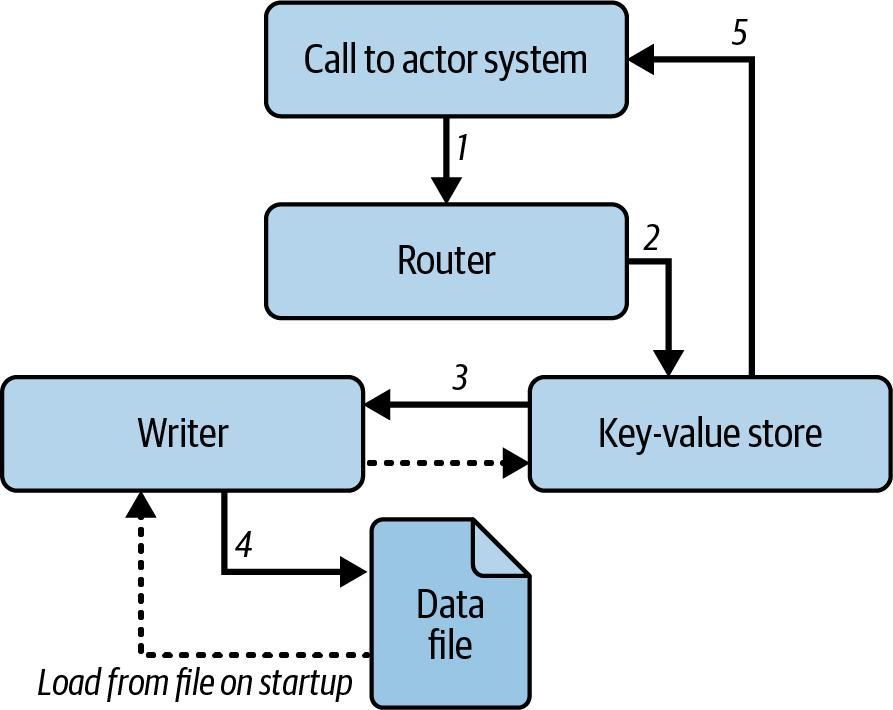


그림 8-2를 통해 다음과 같은 단계가 수행됨을 확인할 수 있습니다.

1. 액터 시스템에 대한 호출이 발생합니다.
2. 라우터가 키-값 저장소 액터로 메시지를 전송합니다.
3. 키-값 저장소 액터는 연산을 복제하여 라이터(writer) 액터로 전송합니다.
4. 라이터 액터는 자체 맵에서 연산을 수행하고 그 맵을 데이터 파일에 기록합니다.
5. 키-값 저장소는 자체 맵에서 연산을 수행하고 액터 시스템을 호출한 코드에 결과를 반환합니다.

액터 시스템이 시작될 때는 다음과 같은 시퀀스가 진행됩니다.

1. 라우터 액터가 시작되며 키-값 저장소 액터를 생성합니다.
2. 키-값 저장소 액터가 라이터 액터를 생성합니다.
3. 라이터 액터가 시작되면 파일에서 데이터를 읽어 자체 상태를 채운 뒤, 그 데이터를 키-값 저장소 액터에도 전송합니다.

> **참고:** 우리는 라이터 액터에 데이터 파일에 대한 독점적 접근 권한을 부여했습니다. 라이터 액터는 한 번에 하나의 트랜잭션만 처리할 수 있고 다른 어떤 리소스도 파일을 변경하지 않기 때문에 동시성 문제가 방지됩니다. 또한 라이터 액터가 파일에 독점적으로 접근하면 매 쓰기 작업마다 파일을 열 필요 없이 수명 주기 내내 파일 핸들을 열어 둘 수 있으므로 성능상 이점도 얻을 수 있습니다. 이는 권한 확인 및 파일 가용성 검사를 위해 OS를 호출하는 횟수를 대폭 줄여줍니다.

새 코드를 작성하기 전에 다음과 같은 임포트가 필요합니다.

```rust
use serde_json;
use tokio::fs::File;
use tokio::io::{
    self,
    AsyncReadExt,
    AsyncWriteExt,
    AsyncSeekExt,
};
use std::collections::HashMap;

enum WriterLogMessage {
    Set(String, Vec<u8>),
    Delete(String),
    Get(oneshot::Sender<HashMap<String, Vec<u8>>>),
}
```

이 시스템을 위해 키-값 액터의 초기화 코드를 업데이트해야 합니다. 또한 라이터 액터를 구축하고, 키-값 메시지로부터 생성할 수 있는 라이터 액터용 새 메시지를 추가해야 합니다.

라이터 메시지의 경우, 라이터가 값을 설정하고 삭제할 수 있어야 합니다. 하지만 파일에서 읽어 들인 전체 상태를 라이터가 반환할 수도 있어야 하므로 다음과 같은 정의를 갖게 됩니다.

이 메시지를 소비(consume)하지 않고 키-값 메시지로부터 생성할 수 있어야 합니다.

```rust
impl WriterLogMessage {
    fn from_key_value_message(message: &KeyValueMessage) -> Option<WriterLogMessage> {
        match message {
            KeyValueMessage::Get(_) => None,
            KeyValueMessage::Delete(message) => Some(
                WriterLogMessage::Delete(message.key.clone())
            ),
            KeyValueMessage::Set(message) => Some(
                WriterLogMessage::Set(
                    message.key.clone(),
                    message.value.clone(),
                )
            ),
        }
    }
}
```

이제 메시지 정의가 완료되었습니다. 라이터 액터를 작성하기 전에 필요한 기능이 딱 하나 더 있습니다. 바로 상태 로딩입니다. 시작 시 두 액터 모두 상태를 로드해야 하므로, 파일 로딩은 다음과 같이 분리된 함수로 정의됩니다.

```rust
async fn read_data_from_file(file_path: &str) -> io::Result<HashMap<String, Vec<u8>>> {
    let mut file = File::open(file_path).await?;
    let mut contents = String::new();
    file.read_to_string(&mut contents).await?;
    let data: HashMap<String, Vec<u8>> = serde_json::from_str(&contents)?;
    Ok(data)
}
```

이 코드가 잘 동작하기는 하지만, 상태 로딩은 결함 감내(fault-tolerant)가 가능해야 합니다. 액터가 종료되기 전의 상태를 복구할 수 있다면 좋겠지만, 상태 파일이 없거나 손상되었다고 해서 액터 자체가 전혀 실행되지 못한다면 좋은 시스템이라고 할 수 없습니다. 따라서 상태 로딩 시 문제가 발생하면 빈 해시맵을 반환하도록 로딩 함수를 감싸줍니다.

```rust
async fn load_map(file_path: &str) -> HashMap<String, Vec<u8>> {
    match read_data_from_file(file_path).await {
        Ok(data) => {
            println!("Data loaded from file: {:?}", data);
            return data;
        }
        Err(e) => {
            println!("Failed to read from file: {:?}", e);
            println!("Starting with an empty hashmap.");
            return HashMap::new();
        }
    }
}
```

예상과 다른 결과가 나왔을 때 시스템 로그를 확인할 수 있도록 이를 출력합니다.

이제 라이터 액터를 구축할 준비가 되었습니다. 라이터 액터는 파일에서 데이터를 로드한 다음 들어오는 메시지를 수신 대기해야 합니다.

```rust
async fn writer_actor(mut receiver: Receiver<WriterLogMessage>) -> io::Result<()> {
    let mut map = load_map("./data.json").await;
    let mut file = File::create("./data.json").await.unwrap();
    while let Some(message) = receiver.recv().await {
        match message {
            // . . .
        }
        let contents = serde_json::to_string(&map).unwrap();
        file.set_len(0).await?;
        file.seek(std::io::SeekFrom::Start(0)).await?;
        file.write_all(contents.as_bytes()).await?;
        file.flush().await?;
    }
    Ok(())
}
```

> **참고:** 메시지 주기마다 파일을 비우고 맵 전체를 다시 작성하고 있음을 알 수 있습니다. 이는 파일을 다루는 효율적인 방법은 아닙니다. 하지만 이 장은 액터와 액터 사용법에 초점을 맞추고 있습니다. 트랜잭션을 파일에 기록할 때의 트레이드오프는 다양한 파일 형식, 배치 쓰기(batch writing), 데이터 정리를 위한 가비지 컬렉션 등을 포함하는 방대한 주제입니다. 관심이 있으시다면 알렉스 페트로프(Alex Petrov)의 《데이터베이스 인터널스》(O'Reilly, 2019)에서 파일 트랜잭션 기록에 대한 포괄적인 내용을 다루고 있으니 참고하시기 바랍니다.

라이터 액터의 메시지 매칭 내부에서는 삽입, 삭제를 수행하거나 전체 맵을 복제하여 반환합니다.

```rust
match message {
    WriterLogMessage::Set(key, value) => {
        map.insert(key, value);
    }
    WriterLogMessage::Delete(key) => {
        map.remove(&key);
    }
    WriterLogMessage::Get(response) => {
        let _ = response.send(map.clone());
    }
}
```

라우터 액터는 그대로 유지되지만, 키-값 액터는 다른 어떤 작업을 하기 전에 라이터 액터를 생성해야 합니다.

```rust
let (writer_key_value_sender, writer_key_value_receiver) = channel(32);
tokio::spawn(writer_actor(writer_key_value_receiver));
```

그런 다음 키-값 액터는 라이터 액터로부터 맵의 상태를 가져와야 합니다.

```rust
let (get_sender, get_receiver) = oneshot::channel();
let _ = writer_key_value_sender.send(WriterLogMessage::Get(
    get_sender
)).await;
let mut map = get_receiver.await.unwrap();
```

마지막으로 키-값 액터는 자체 트랜잭션을 처리하기 전에 라이터 메시지를 구성하여 라이터 액터에 전송할 수 있습니다.

```rust
while let Some(message) = receiver.recv().await {
    if let Some(write_message) = WriterLogMessage::from_key_value_message(&message) {
        let _ = writer_key_value_sender.send(write_message).await;
    }
    match message {
        // . . .
    }
}
```

이로써 시스템은 모든 키-값 트랜잭션을 메모리에서 처리하면서 동시에 파일로부터의 로딩 및 파일 쓰기를 지원하게 됩니다. `main` 함수에서 코드를 이리저리 수정해 보고, 일부를 주석 처리하며 `data.json` 파일을 확인해 보면 제대로 작동함을 알 수 있습니다. 하지만 시스템이 서버 같은 환경에서 실행된다면 무슨 일이 일어나는지 수동으로 파일을 감시하고 있지는 못할 것입니다. 액터 시스템이 점점 복잡해진 지금, 라이터 액터가 비정상 종료되어 실행되지 않고 있더라도 키-값 액터는 여전히 돌아가고 있어 우리는 그 사실을 전혀 눈치채지 못할 수 있습니다. 바로 이 지점에서 액터의 상태를 추적해야 하는 감시 체계(supervision)가 필요해집니다.

### 액터 감시 체계 구축하기

현재 우리에게는 라이터 액터와 키-값 저장소 액터라는 두 개의 액터가 있습니다. 이 절에서는 시스템의 모든 액터를 추적 관찰하는 수퍼바이저(supervisor) 액터를 구축해 보겠습니다. 여기서 우리는 라우터 패턴을 구현해 두었다는 사실에 감사하게 될 것입니다. 수퍼바이저 액터를 만든 후 수퍼바이저 채널의 송신자를 모든 액터에 일일이 전달해야 한다면 큰 골칫거리가 되었을 것입니다. 그 대신 모든 액터가 `ROUTER_SENDER`에 직접 접근할 수 있으므로, 라우터를 통해 수퍼바이저 액터에 갱신 메시지를 보낼 수 있습니다. 또한 그림 8-3에 묘사된 것처럼 수퍼바이저는 라우터를 통해 올바른 액터로 리셋(재시작) 요청을 보낼 수도 있습니다.

그림 8-3을 보면 키-값 액터나 라이터 액터로부터 갱신을 받지 못할 경우 키-값 액터를 리셋할 수 있음을 알 수 있습니다. 키-값 액터가 라이터 액터를 생성할 때 라이터 액터의 핸들을 쥐고 있도록 만들 수 있으므로, 키-값 액터가 종료되면 라이터 액터도 함께 종료됩니다. 키-값 액터가 다시 생성되면 라이터 액터 역시 다시 생성될 것입니다.

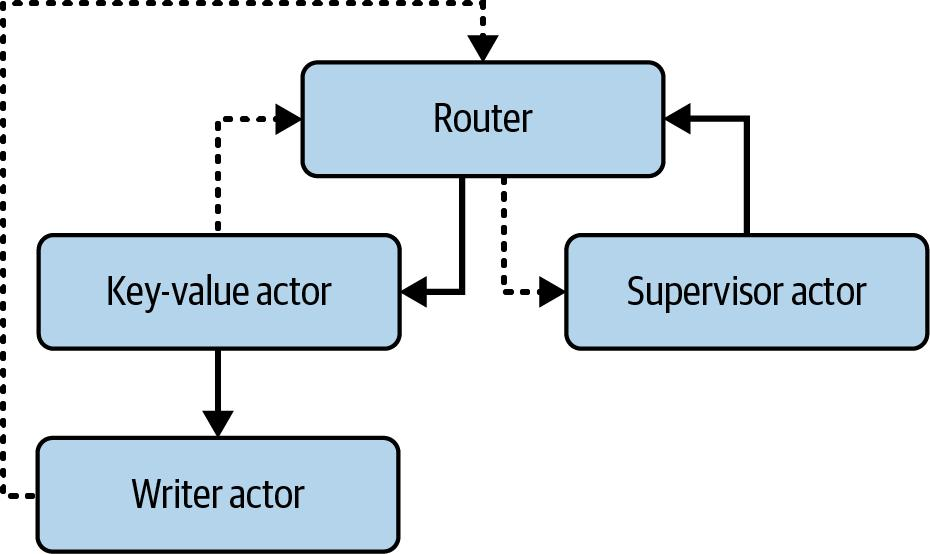


이러한 하트비트 수퍼바이저 메커니즘을 달성하기 위해 액터들을 약간 리팩터링해야 하지만, 이를 통해 복잡성과의 약간의 트레이드오프만으로 오래 실행되는 액터들을 어떻게 추적하고 관리할 수 있는지 보여줄 것입니다. 코드를 작성하기 전에 액터의 시간 확인을 처리하기 위해 다음과 같은 임포트가 필요합니다.

```rust
use tokio::time::{self, Duration, Instant};
```

또한 액터 재설정과 하트비트 등록을 지원해야 합니다. 따라서 `RoutingMessage`를 확장해야 합니다.

```rust
enum RoutingMessage {
    KeyValue(KeyValueMessage),
    Heartbeat(ActorType),
    Reset(ActorType),
}

#[derive(Clone, Copy, PartialEq, Eq, Hash, Debug)]
enum ActorType {
    KeyValue,
    Writer,
}
```

이제 `ActorType` 열거형에 선언하려는 모든 액터에 대해 리셋을 요청하거나 하트비트를 등록할 수 있습니다.

첫 번째 리팩터링 대상은 키-값 액터입니다. 먼저 라이터 액터에 대한 핸들을 정의합니다.

```rust
let (writer_key_value_sender, writer_key_value_receiver) = channel(32);
let _writer_handle = tokio::spawn(
    writer_actor(writer_key_value_receiver)
);
```

여전히 맵을 채우기 위해 라이터 액터에 `Get` 메시지를 전송하지만, 타임아웃을 구현할 수 있도록 메시지 처리 코드를 무한 루프로 감쌉니다.

```rust
let timeout_duration = Duration::from_millis(200);
let router_sender = ROUTER_SENDER.get().unwrap().clone();
loop {
    match time::timeout(timeout_duration, receiver.recv()).await {
        Ok(Some(message)) => {
            if let Some(write_message) = WriterLogMessage::from_key_value_message(&message) {
                let _ = writer_key_value_sender.send(write_message).await;
            }
            match message {
                // . . .
            }
        }
        Ok(None) => break,
        Err(_) => {
            router_sender.send(
                RoutingMessage::Heartbeat(ActorType::KeyValue)
            ).await.unwrap();
        }
    };
}
```

사이클이 끝날 때 라우터에 하트비트 메시지를 보내 키-값 저장소가 여전히 살아 있음을 알립니다. 또한 타임아웃이 설정되어 있으므로 200ms가 지나면 한 사이클을 실행합니다. 들어오는 메시지가 없다는 이유로 수퍼바이저가 해당 액터가 죽었거나 멈췄다고 판단하게 만들 수는 없기 때문입니다.

라이터 액터에도 비슷한 접근 방식이 필요합니다. 여러분이 직접 작성해 보기를 권장합니다. 작성한 코드가 다음 코드와 유사하기를 바랍니다.

```rust
let timeout_duration = Duration::from_millis(200);
let router_sender = ROUTER_SENDER.get().unwrap().clone();
loop {
    match time::timeout(timeout_duration, receiver.recv()).await {
        Ok(Some(message)) => {
            match message {
                // . . .
            }
            let contents = serde_json::to_string(&map).unwrap();
            file.set_len(0).await?;
            file.seek(std::io::SeekFrom::Start(0)).await?;
            file.write_all(contents.as_bytes()).await?;
            file.flush().await?;
        }
        Ok(None) => break,
        Err(_) => {
            router_sender.send(
                RoutingMessage::Heartbeat(ActorType::Writer)
            ).await.unwrap();
        }
    };
}
```

이제 액터들이 수퍼바이저가 추적할 수 있도록 라우터에 하트비트를 보내는 기능을 지원합니다. 다음으로 수퍼바이저 액터를 구축해야 합니다. 수퍼바이저 액터도 다른 액터들과 유사한 접근 방식을 취합니다. 하트비트 메시지가 없다고 해서 수퍼바이저 액터가 추적 중인 액터들의 상태를 확인하는 것을 멈춰서는 안 되기 때문에, 타임아웃이 포함된 무한 루프를 가집니다. 사실 하트비트 메시지가 없다는 것은 시스템 점검이 필요하다는 신호일 수 있습니다. 하지만 무한 루프 사이클 끝에 메시지를 보내는 대신, 수퍼바이저 액터는 자체 상태를 순회하며 확인 보고를 하지 않은 액터가 있는지 검사합니다. 액터의 상태가 최신이 아니면 수퍼바이저 액터는 라우터에 리셋 요청을 보냅니다. 이 과정의 개요는 다음 코드에 나타나 있습니다.

```rust
async fn heartbeat_actor(mut receiver: Receiver<ActorType>) {
    let mut map = HashMap::new();
    let timeout_duration = Duration::from_millis(200);
    loop {
        match time::timeout(timeout_duration, receiver.recv()).await {
            Ok(Some(actor_name)) => map.insert(
                actor_name, Instant::now()
            ),
            Ok(None) => break,
            Err(_) => {
                continue;
            }
        };
        let half_second_ago = Instant::now() - Duration::from_millis(500);
        for (key, &value) in map.iter() {
            // . . .
        }
    }
}
```

여기서는 기준 제한시간(cutoff)을 0.5초로 정했습니다. 제한시간이 짧을수록 장애 발생 후 액터가 더 빠르게 재시작됩니다. 하지만 수퍼바이저를 만족시키기 위해 메시지를 기다리는 액터들의 타임아웃도 더 짧아져야 하므로 작업 부하가 늘어납니다.

상태 키를 순회하며 액터를 확인할 때 제한시간을 초과했으면 리셋 요청을 보냅니다.

```rust
if value < half_second_ago {
    match key {
        ActorType::KeyValue | ActorType::Writer => {
            ROUTER_SENDER.get().unwrap().send(
                RoutingMessage::Reset(ActorType::KeyValue)
            ).await.unwrap();
            map.remove(&ActorType::KeyValue);
            map.remove(&ActorType::Writer);
            break;
        }
    }
}
```

라이터 액터에 장애가 발생하더라도 키-값 액터를 리셋한다는 점을 눈치채셨을 것입니다. 이는 키-값 액터가 라이터 액터를 다시 시작할 것이기 때문입니다. 또한 맵에서 키를 제거하는데, 키-값 액터가 다시 시작되면 하트비트 메시지를 보내 키를 다시 검사하게 되지만, 라이터 키는 여전히 만료된 상태여서 불필요한 두 번째 리셋이 트리거될 수 있기 때문입니다. 액터들이 다시 등록된 후에 검사를 시작할 수 있습니다.

이제 라우터 액터가 우리의 모든 변경 사항을 지원해야 합니다. 우선 키-값 채널과 핸들을 가변(`mut`)으로 설정해야 합니다.

```rust
let (mut key_value_sender, mut key_value_receiver) = channel(32);
let mut key_value_handle = tokio::spawn(
    key_value_actor(key_value_receiver)
);
```

키-값 액터가 리셋될 경우 새 핸들과 채널을 재할당해야 하기 때문입니다. 그런 다음 다른 액터들을 감독할 하트비트 액터를 스폰합니다.

```rust
let (heartbeat_sender, heartbeat_receiver) = channel(32);
tokio::spawn(heartbeat_actor(heartbeat_receiver));
```

이제 액터 시스템이 실행 중이므로 라우터 액터가 들어오는 메시지를 처리할 수 있습니다.

```rust
while let Some(message) = receiver.recv().await {
    match message {
        RoutingMessage::KeyValue(message) => {
            let _ = key_value_sender.send(message).await;
        }
        RoutingMessage::Heartbeat(message) => {
            let _ = heartbeat_sender.send(message).await;
        }
        RoutingMessage::Reset(message) => {
            // . . .
        }
    }
}
```

리셋을 위해서는 몇 가지 단계를 거쳐야 합니다. 먼저 새 채널을 생성합니다. 키-값 액터를 중단(`abort`)하고 송신자와 수신자를 새 채널로 재할당한 다음, 새 키-값 액터를 스폰합니다.

```rust
match message {
    ActorType::KeyValue | ActorType::Writer => {
        let (new_key_value_sender, new_key_value_receiver) = channel(32);
        key_value_handle.abort();
        key_value_sender = new_key_value_sender;
        key_value_receiver = new_key_value_receiver;
        key_value_handle = tokio::spawn(
            key_value_actor(key_value_receiver)
        );
        time::sleep(Duration::from_millis(100)).await;
    }
}
```

태스크가 스폰되어 비동기 런타임에서 확실히 실행되도록 약간의 슬립(sleep)을 두었음을 알 수 있습니다. 이러한 전환 중에 키-값 액터로 더 많은 요청이 전송되어 에러가 발생하지 않을까 걱정할 수도 있습니다. 하지만 모든 요청은 라우터 액터를 통과합니다. 키-값 액터를 향해 라우터로 전송된 메시지들은 라우터 채널에 차례대로 대기열에 쌓이게 됩니다. 이를 통해 액터 시스템이 얼마나 뛰어난 결함 감내 능력을 가지는지 확인할 수 있습니다.

이 코드에는 많은 요소가 포함되어 있으므로, `main` 함수와 함께 전체를 실행해 보겠습니다.

> [!NOTE]
> 다음 코드를 실행하기 전에 `data.json` 파일에 다음과 같이 비어 있는 중괄호 쌍이 들어 있는지 확인하십시오.
> 
> ```json
> {}
> ```

```rust
#[tokio::main]
async fn main() -> Result<(), std::io::Error> {
    let (sender, receiver) = channel(32);
    ROUTER_SENDER.set(sender).unwrap();
    tokio::spawn(router(receiver));
    let _ = set("hello".to_string(), b"world".to_vec()).await?;
    let value = get("hello".to_string()).await?;
    println!("value: {:?}", value);
    let value = get("hello".to_string()).await?;
    println!("value: {:?}", value);
    ROUTER_SENDER.get().unwrap().send(
        RoutingMessage::Reset(ActorType::KeyValue)
    ).await.unwrap();
    let value = get("hello".to_string()).await?;
    println!("value: {:?}", value);
    let _ = set("test".to_string(), b"world".to_vec()).await?;
    std::thread::sleep(std::time::Duration::from_secs(1));
    Ok(())
}
```

`main`을 실행하면 다음과 같은 출력을 얻을 수 있습니다.

```text
Data loaded from file: {}
value: Some([119, 111, 114, 108, 100])
value: Some([119, 111, 114, 108, 100])
Data loaded from file: {"hello": [119, 111, 114, 108, 100]}
value: Some([119, 111, 114, 108, 100])
```

시스템 설정 시 처음에 라이터 액터에 의해 데이터가 로드되었음을 볼 수 있습니다. `hello` 값을 설정한 후 `get` 함수가 정상 작동합니다. 그런 다음 수동으로 강제 리셋을 트리거했습니다. 여기서 데이터가 다시 로드되는 것을 볼 수 있는데, 이는 라이터 액터가 재시작되었음을 의미합니다. 라이터 액터는 파일 핸들을 얻어 계속 유지하므로, 이전 라이터 액터가 종료되었음을 확신할 수 있습니다. 그렇지 않았다면 파일 디스크립터가 여전히 점유되어 있어 에러가 발생했을 것입니다.

밤에 발 뻗고 편히 자고 싶다면, 라이터 액터 루프 앞에 타임스탬프를 추가하고 루프의 매 반복 시작 시 타임스탬프를 출력하도록 하여 타임스탬프 출력이 들어오는 메시지에 의존하지 않도록 만들 수 있습니다. 그러면 다음과 같은 출력을 얻게 됩니다.

```text
Data loaded from file: {}
writer instance: Instant { tv_sec: 1627237, tv_nsec: 669830291 }
value: Some([119, 111, 114, 108, 100])
writer instance: Instant { tv_sec: 1627237, tv_nsec: 669830291 }
value: Some([119, 111, 114, 108, 100])
Starting key_value_actor
writer instance: Instant { tv_sec: 1627237, tv_nsec: 669830291 }
Data loaded from file: {"hello": [119, 111, 114, 108, 100]}
writer instance: Instant { tv_sec: 1627237, tv_nsec: 773026500 }
value: Some([119, 111, 114, 108, 100])
writer instance: Instant { tv_sec: 1627237, tv_nsec: 773026500 }
writer instance: Instant { tv_sec: 1627237, tv_nsec: 773026500 }
writer instance: Instant { tv_sec: 1627237, tv_nsec: 773026500 }
writer instance: Instant { tv_sec: 1627237, tv_nsec: 773026500 }
writer instance: Instant { tv_sec: 1627237, tv_nsec: 773026500 }
writer instance: Instant { tv_sec: 1627237, tv_nsec: 773026500 }
```

리셋 전후의 인스턴스가 서로 다르며, 리셋 후 기존 라이터 인스턴스의 흔적이 남아 있지 않음을 확인할 수 있습니다. 이제 리셋이 정상 작동하며 목적 없이 방황하는 외로운 액터(우리 시스템에서는 그렇다는 뜻이며, 할리우드 배우들까지 보증할 수는 없습니다)가 존재하지 않는다는 사실을 확인하고 안심할 수 있습니다.

### 요약

이 장에서는 키-값 트랜잭션을 수신하고, 라이터 액터로 데이터를 백업하며, 하트비트 메커니즘을 통해 모니터링되는 시스템을 구축했습니다. 이 시스템에는 수많은 동작 부품이 있었지만, 라우터 패턴 덕분에 구현이 단순화되었습니다. 메시지가 목적지에 도달하기 전에 하나의 액터를 거쳐야 하므로 라우터 패턴은 액터를 직접 호출하는 것만큼 효율적이지는 않습니다. 하지만 라우터 패턴은 훌륭한 출발점입니다. 문제를 해결하는 데 필요한 액터를 파악할 때 라우터 패턴에 의지할 수 있습니다. 솔루션이 구체화되면 라우터 액터를 거치는 대신 액터들이 서로를 직접 호출하도록 점진적으로 전환할 수 있습니다.

우리는 액터를 사용하여 전체 시스템을 구축하는 데 집중했지만, 액터 역시 비동기 런타임 위에서 실행된다는 점을 기억해야 합니다. 액터는 오직 메시지로만 통신하므로 격리되어 있고 테스트하기 쉬우므로, 액터를 활용한 하이브리드 접근 방식을 취할 수 있습니다. 즉, 액터를 사용하여 일반 비동기 시스템에 추가 기능을 덧붙일 수 있습니다. 액터 채널은 어디서나 접근할 수 있습니다. 라우터 액터에서 액터 간 직접 호출로 마이그레이션하는 것과 마찬가지로, 새로 추가한 비동기 기능의 전체적인 윤곽이 잡히면 새로운 비동기 코드를 액터에서 표준 비동기 코드로 천천히 마이그레이션할 수 있습니다. 또한 레거시 코드를 테스트 프레임워크에 넣기 위해 의존성을 격리하려 할 때, 레거시 코드의 기능을 분리해 내는 용도로도 액터를 활용할 수 있습니다.

일반적으로 격리된 특성 덕분에 액터는 다양한 환경에서 구현할 수 있는 매우 유용한 도구입니다. 또한 액터는 탐색 단계에 머물러 있을 때 '코드의 중간 기착지(code limbo)' 역할을 할 수도 있습니다. 저자 두 사람 모두 마이크로서비스 클러스터에서 챗봇 메시지를 캐싱하고 버퍼링하는 등 촉박한 마감 기한 내에 솔루션을 내놓아야 했을 때 액터를 유용하게 활용하곤 했습니다.

제9장에서는 디자인 패턴에 대한 다룸과 함께 솔루션에 접근하고 구조화하는 방법에 대한 탐구를 계속해 나가겠습니다.

# 제9장 디자인 패턴

이 책 전체에 걸쳐 우리는 다양한 비동기 개념과 문제를 해결하기 위해 여러 방식으로 비동기 코드를 구현하는 방법을 살펴보았습니다. 하지만 소프트웨어 공학은 진공 상태에서 고립되어 이루어지지 않는다는 점을 잘 알고 있습니다. 실제 현장에서 비동기 프로그래밍에 대한 새로운 지식을 적용할 때, 완벽하게 통제된 이상적인 환경에서 독립된 비동기 코드만을 다루게 되는 일은 거의 없습니다. 비동기를 지원하지 않는 기존 코드베이스에 비동기 코드를 적용해야 할 수도 있고, 서버와 같은 서드파티 서비스와 통신하면서 서버 응답의 여러 가지 변수를 처리해야 할 수도 있습니다. 이번 장에서는 다양한 문제를 해결하면서 비동기 코드를 성공적으로 구현하는 데 도움을 주는 디자인 패턴들을 다룹니다.

이번 장을 마치고 나면, 이전까지 비동기 프로그래밍을 지원하지 않던 기존 코드베이스에 비동기 코드를 도입할 수 있게 될 것입니다. 또한 워터폴(waterfall) 디자인 패턴을 구현하여 재사용 가능한 비동기 컴포넌트로 작업 경로를 구축하는 방법도 익히게 됩니다. 비동기 작업에 새로운 기능을 추가할 때 코드를 직접 수정하는 대신 데코레이터(decorator) 패턴을 구현함으로써, 프로그램을 빌드하거나 실행할 때 컴파일 플래그만 추가하여 로깅 등의 추가 기능을 손쉽게 끼워 넣을 수도 있습니다. 마지막으로 재시도(retry) 및 서킷 브레이커(circuit-breaker) 패턴을 구현하여 전체 비동기 시스템이 오류에 유연하게 적응하도록 만드는 방법도 배우게 됩니다.

디자인 패턴을 본격적으로 구현하기에 앞서, 무엇보다도 시스템에 비동기 코드를 도입할 수 있어야 합니다. 따라서 먼저 격리된 모듈(isolated module)을 구축하는 것부터 시작하겠습니다.

### 격리된 모듈 구축하기

비동기 코드가 전혀 없는 기존 Rust 코드베이스가 있고, 여기에 비동기 Rust를 일부 통합하고자 하는 상황을 상상해 봅시다. 비동기 Rust를 도입하기 위해 전체 코드베이스를 처음부터 다시 작성하는 대신, 영향 범위(blast radius)를 작게 유지하는 방식을 권장합니다. 대규모 재작성은 마감 기한을 맞추기가 거의 불가능하며, 재작성이 지연되는 동안 기존 코드베이스에 새로운 기능이 계속 추가되어 프로젝트 완수 자체가 위태로워지기 십상입니다. 따라서 자체적인 전용 모듈 안에 비동기 코드를 작성하고, 여기에 동기식 진입점(synchronous entry point)을 제공하는 방식으로 작게 시작할 수 있습니다. 동기식 진입점을 두면 기존 코드베이스의 어느 위치에서나 비동기 모듈을 호출할 수 있습니다. 또한 다른 개발자가 비동기 프로그래밍을 깊이 공부하지 않고도 이 비동기 모듈을 그대로 활용할 수 있습니다. 덕분에 통합 작업이 훨씬 수월해지며, 동료 개발자들은 자신만의 속도에 맞춰 비동기 프로그래밍에 익숙해질 수 있습니다.

그렇다면 동기식 진입점을 통해 비동기 프로그래밍의 이점을 어떻게 제공할 수 있을까요? 그림 9-1은 비동기를 지원하지 않는 코드베이스에 비동기의 이점을 전달하는 상위 수준의 흐름을 보여줍니다.

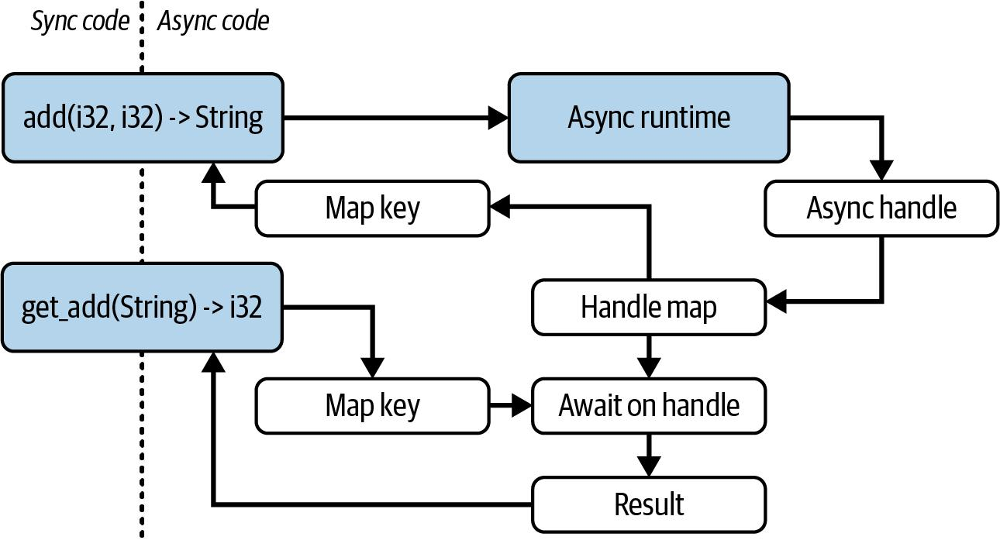


그림 9-1에 나와 있듯이, 런타임에 비동기 태스크를 전송하고 비동기 태스크의 핸들을 맵(map)에 보관한 다음, 맵의 핸들에 해당하는 키를 반환합니다. 이 모듈을 사용하는 개발자는 일반적인 블로킹 함수를 호출하여 고유 ID를 돌려받습니다. 태스크는 비동기 런타임에서 백그라운드로 진행되며, 개발자는 동기 코드를 계속 작성할 수 있습니다. 작업 결과가 필요해지면 개발자는 고유 ID를 `get_add` 함수에 전달하고, 이 함수는 결과가 반환될 때까지 동기 코드를 블로킹합니다. 개발자는 고유 ID를 비동기 핸들처럼 취급하지만, 비동기 코드와 직접 상호작용할 필요는 전혀 없습니다. 이 방식을 구현하기에 앞서 다음과 같은 의존성이 필요합니다.

```toml
tokio = { version = "1.33.0", features = ["full"] }
uuid = { version = "1.5.0", features = ["v4"] }
```

이 의존성들을 바탕으로 `main.rs` 옆에 `async_mod.rs` 파일을 생성할 수 있습니다. `async_mod.rs` 파일은 비동기 모듈 코드를 담는 보관소가 됩니다. 이 파일 내부에는 다음과 같은 임포트가 필요합니다.

```rust
use std::sync::LazyLock;
use tokio::runtime::{Runtime, Builder};
use tokio::task::JoinHandle;
use std::collections::HashMap;
use std::sync::{Arc, Mutex};
pub type AddFutMap = LazyLock<Arc<Mutex<HashMap<String, JoinHandle<i32>>>>>;
```

런타임으로는 다음과 같은 코드를 사용합니다.

```rust
static TOKIO_RUNTIME: LazyLock<Runtime> = LazyLock::new(|| {
    Builder::new_multi_thread()
        .enable_all()
        .build()
        .expect("Failed to create Tokio runtime")
});
```

비동기 태스크를 표현하기 위해 `sleep`을 포함하는 간단한 `async_add` 함수를 정의합니다.

```rust
async fn async_add(a: i32, b: i32) -> i32 {
    println!("starting async_add");
    tokio::time::sleep(tokio::time::Duration::from_secs(3)).await;
    println!("finished async_add");
    a + b
}
```

이 함수는 비동기 런타임에는 노출되지만 모듈 외부에는 노출되지 않는 핵심 비동기 태스크입니다. 이것이 바로 런타임과 `async_add` 함수를 `pub`으로 선언하지 않은 이유입니다.

비동기 런타임과 `async_add` 태스크를 정의했으므로 이제 핸들러를 구축할 수 있습니다. 그림 9-2에 표시된 것처럼, 우리의 핸들러는 진입점이 런타임 및 맵과 상호작용할 수 있도록 중개하는 일종의 라우터 역할을 합니다.

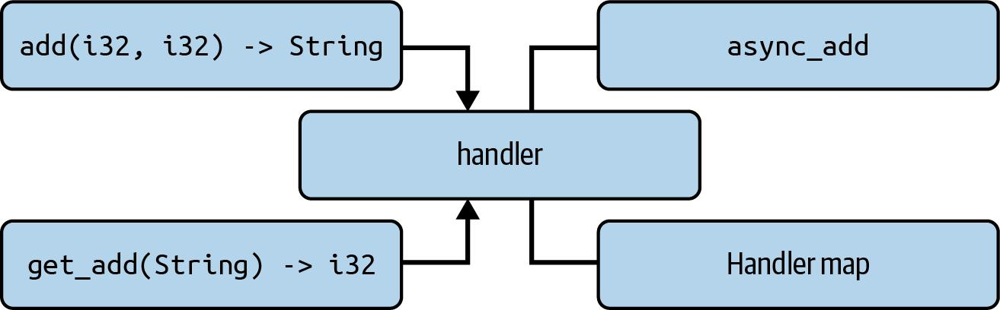


핸들러는 더할 숫자들을 전달받거나 결과를 조회하기 위한 고유 ID를 전달받는 함수여야 합니다.

```rust
fn add_handler(a: Option<i32>, b: Option<i32>, id: Option<String>)
    -> Result<(Option<i32>, Option<String>), String> {
    static MAP: AddFutMap = LazyLock::new(|| Arc::new(
        Mutex::new(HashMap::new())
    ));
    match (a, b, id) {
        (Some(a), Some(b), None) => {
            . . .
        },
        (None, None, Some(id)) => {
            . . .
        },
        _ => Err(
            "either a or b need to be provided or a handle_id".to_string()
        )
    }
}
```

우리의 예제에서는 사용자가 `add_handler` 함수와 직접 상호작용하지 않기 때문에 `Option<i32>` 입력 방식이 잘 동작합니다. 그러나 `add_handler`가 뺄셈이나 곱셈과 같은 더 많은 연산을 지원하도록 확장할 계획이라면, 다음과 같이 열거형(enum)을 전달하는 편이 낫습니다.

```rust
enum Operation {
    Add { a: i32, b: i32 },
    Multiply { a: i32, b: i32 },
    Subtract { a: i32, b: i32 },
}

fn perform_operation(op: Operation) -> i32 {
    match op {
        Operation::Add { a, b } => a + b,
        Operation::Multiply { a, b } => a * b,
        Operation::Subtract { a, b } => a - b,
    }
}
```

우리의 퓨처 맵은 3장에서 `spawn_task` 함수의 큐를 지연 평가로 정의했던 것과 마찬가지로 지연 평가(lazy evaluation)됩니다. 핸들러 함수를 호출하여 `MAP`을 업데이트하면, 다음에 핸들러를 다시 호출할 때 핸들러 내부에서 업데이트된 `MAP`에 접근하게 됩니다. 비록 동기 코드의 메인 스레드에서만 핸들러 함수를 호출할 계획이라 하더라도, 다른 개발자가 새 스레드를 생성하여 이 함수를 호출하지 않으리라는 보장은 없습니다.

만약 핸들러가 메인 스레드에서만 호출된다고 100% 확신할 수 있다면 `Arc`와 `Mutex`를 제거하고 `MAP`을 가변으로 선언한 뒤 함수 나머지 부분에서 `unsafe` 코드로 접근할 수도 있습니다. 하지만 예상하셨다시피 이는 안전하지 않습니다. 혹은 `thread_local`을 사용하여 `Arc`와 `Mutex`를 없애는 방법도 있습니다. 태스크가 생성된 동일한 스레드에서 결과를 가져오는 한 이 방식은 안전할 수 있습니다. 개발자가 프로그램의 전체 맵에 접근할 필요는 없으며, 자신이 실행한 태스크의 비동기 핸들을 보관하고 있는 맵에만 접근하면 되기 때문입니다.

핸들러 함수의 첫 번째 `match` 브랜치에서는 더할 숫자들을 전달받으므로, 태스크를 스폰하고 `MAP`의 고유 ID에 연결한 뒤 고유 ID를 반환합니다.

```rust
let handle = TOKIO_RUNTIME.spawn(async_add(a, b));
let id = uuid::Uuid::new_v4().to_string();
MAP.lock().unwrap().insert(id.clone(), handle);
Ok((None, Some(id)))
```

이제 태스크의 결과를 조회하기 위해 고유 ID를 처리하는 브랜치를 정의할 수 있습니다. 여기서는 `MAP`에서 태스크 핸들을 가져오고, 핸들을 비동기 런타임에 넘겨 결과가 산출될 때까지 현재 스레드를 블로킹한 다음 결과를 반환합니다.

```rust
let handle = match MAP.lock().unwrap().remove(&id) {
    Some(handle) => handle,
    None => return Err("No handle found".to_string())
};
let result: i32 = match TOKIO_RUNTIME.block_on(async {
    handle.await
}) {
    Ok(result) => result,
    Err(e) => return Err(e.to_string())
};
Ok((Some(result), None))
```

이제 핸들러가 정상적으로 동작합니다. 다만 핸들러가 `pub`으로 선언되지 않았다는 점에 주목하세요. 이 인터페이스는 사용하기에 직관적이거나 인체공학적(ergonomic)이지 않기 때문입니다. 모듈을 사용하는 개발자가 잘못된 입력 조합을 넘겨줄 위험이 있습니다. 이제 첫 번째 공개 인터페이스를 작성해 보겠습니다.

```rust
pub fn send_add(a: i32, b: i32) -> Result<String, String> {
    match add_handler(Some(a), Some(b), None) {
        Ok((None, Some(id))) => Ok(id),
        Ok(_) => Err(
            "Something went wrong, please contact author".to_string()
        ),
        Err(e) => Err(e)
    }
}
```

개발자가 핸들러로 전달할 두 개의 정수를 반드시 입력하도록 강제합니다. 그런 다음 ID를 반환합니다. 만약 오류가 아닌 다른 변형이 반환된다면 구현에 심각한 문제가 발생한 것입니다. 모듈 사용자가 무엇을 잘못했는지 디버깅하느라 시간을 낭비하지 않도록, 작성자 측에서 해결해야 할 문제임을 알리고 문의하라는 메시지를 안내합니다.

결과를 가져오는 인터페이스는 전송 인터페이스와 유사하지만 방향만 반대이며, 다음과 같은 형태를 띱니다.

```rust
pub fn get_add(id: String) -> Result<i32, String> {
    match add_handler(None, None, Some(id)) {
        Ok((Some(result), None)) => Ok(result),
        Ok(_) => Err(
            "Something went wrong, please contact author".to_string()
        ),
        Err(e) => Err(e)
    }
}
```

이제 비동기 모듈 작성이 완료되었으므로 `main.rs`에서 사용할 수 있습니다.

```rust
mod async_mod;
fn main() {
    println!("Hello, world!");
    let id = async_mod::send_add(1, 2).unwrap();
    println!("id: {}", id);
    std::thread::sleep(std::time::Duration::from_secs(4));
    println!("main sleep done");
    let result = async_mod::get_add(id).unwrap();
    println!("result: {}", result);
}
```

코드를 실행하면 다음과 유사한 출력이 나타납니다.

```text
Hello, world!
starting async_add
id: e2a2f3e1-2a77-432c-b0b8-923483ae637f
finished async_add
main sleep done
result: 3
```

ID 값은 다르겠지만 출력 순서는 동일해야 합니다. 여기서 메인 스레드가 계속 진행되는 동안 비동기 태스크가 백그라운드에서 처리되고 있으며, 최종적으로 결과를 가져올 수 있음을 확인할 수 있습니다. 우리의 비동기 코드가 얼마나 깔끔하게 격리되어 있는지 알 수 있습니다. 이제 다양한 실험을 시도해 볼 여유가 생겼습니다. 예를 들어 서로 다른 런타임이나 런타임 설정을 자유롭게 시험해 볼 수 있습니다. 7장에서 살펴보았듯이, 계산 작업의 연산 부하가 증가하면 로컬 세트(local set)로 전환하고 스레드 로컬 상태를 활용하여 최근 계산된 값을 캐싱할 수도 있습니다. 하지만 우리가 정의한 인터페이스는 비동기 원시 타입(primitive)과 완전히 분리되어 있으므로, 이 모듈을 사용하는 다른 개발자들은 내부 변경 사항을 전혀 눈치채지 못할 것이며 기존 인터페이스 호출 코드도 깨지지 않습니다.

코드베이스의 나머지 부분에 미치는 영향을 최소화하면서 비동기 모듈을 구현하는 방법을 살펴보았으므로, 이제 코드베이스에 다른 디자인 패턴들을 적용해 볼 수 있습니다. 먼저 워터폴 디자인 패턴부터 살펴보겠습니다.

### 워터폴 디자인 패턴

워터폴 디자인 패턴(책임 연쇄 패턴, chain of responsibility pattern으로도 알려짐)은 그림 9-3에 나와 있듯이 여러 비동기 태스크가 연쇄적으로 연결되어 한 태스크의 결과값을 다음 태스크로 직접 전달하는 방식입니다.

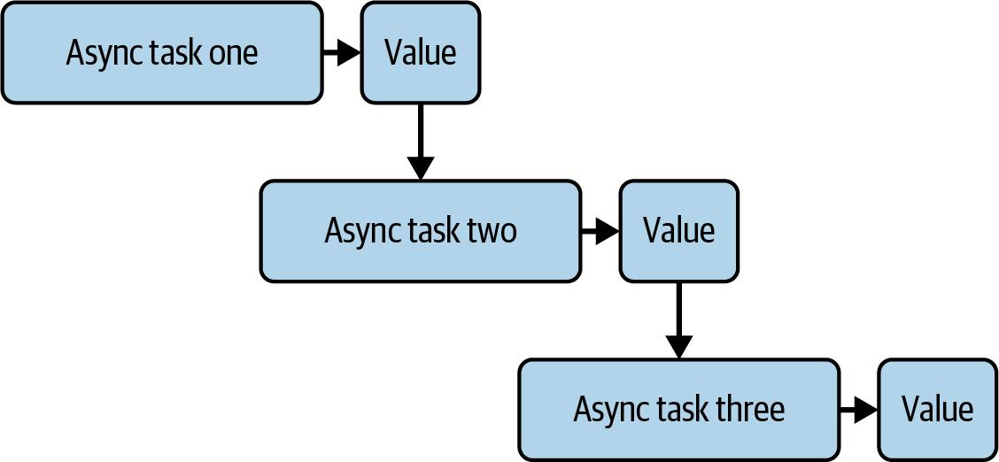


기본적인 워터폴 디자인 패턴의 구현은 매우 직관적입니다. Rust에서는 에러 처리 시스템을 활용하여 안전하고 간결한 코드를 작성할 수 있습니다. 다음 세 가지 비동기 태스크를 통해 이를 보여줄 수 있습니다.

```rust
type WaterFallResult = Result<String, Box<dyn std::error::Error>>;

async fn task1() -> WaterFallResult {
    Ok("Task 1 completed".to_string())
}

async fn task2(input: String) -> WaterFallResult {
    Ok(format!("{} then Task 2 completed", input))
}

async fn task3(input: String) -> WaterFallResult {
    Ok(format!("{} and finally Task 3 completed", input))
}
```

이 태스크들은 모두 동일한 에러 타입을 반환하므로, `?` 연산자를 사용하여 물 흐르듯 서로 연결할 수 있습니다.

```rust
#[tokio::main]
async fn main() -> Result<(), Box<dyn std::error::Error>> {
    let output1 = task1().await?;
    let output2 = task2(output1).await?;
    let result = task3(output2).await?;
    println!("{}", result);
    Ok(())
}
```

워터폴 방식은 단순하고 예측 가능합니다. 또한 비동기 태스크를 레고 블록처럼 재사용할 수 있게 해줍니다. 예를 들어 세 개의 비동기 태스크가 `i32` 데이터 타입을 받는다고 가정해 봅시다. 다음과 같이 비동기 태스크들 주변에 분기 로직을 추가할 수 있습니다.

```rust
#[tokio::main]
async fn main() -> Result<(), Box<dyn std::error::Error>> {
    let output1 = task1().await?;
    let output2: i32;
    if output1 > 10 {
        output2 = task2(output1).await?;
    } else {
        output2 = task3(output1).await?;
    }
    println!("{}", output2);
    Ok(())
}
```

로직을 통해 워터폴의 흐름을 제어하는 방식을 고려해 보면, 동일한 핵심 컴포넌트를 공유하면서도 조금씩 다른 경로를 구축해야 할 때 워터폴 구현이 왜 유용한지 알 수 있습니다. 필요에 따라 컴포넌트 사이사이에 메트릭 수집 로직을 손쉽게 끼워 넣을 수도 있습니다. 컴포넌트 사이에 메트릭이나 로깅을 삽입하는 것도 유용하지만, 태스크 자체에 새로운 기능을 덧붙일 때는 데코레이터 패턴을 활용할 수도 있습니다.

### 데코레이터 패턴

데코레이터 패턴은 특정 기능 주위를 감싸는 래퍼(wrapper)로서, 기존 기능에 부가 기능을 더하거나 메인 실행 전후에 특정 로직을 수행하도록 만듭니다. 데코레이터의 대표적인 예로는 픽스처(fixture)를 들 수 있습니다. 단위 테스트는 테스트 실행 전에 특정 데이터 스토리지의 상태를 설정하고, 테스트가 끝난 후 해당 상태를 파괴합니다. 테스트 사이에 상태를 설정하고 정리함으로써 테스트의 원자성을 보장하며, 특정 테스트가 실패하더라도 다른 테스트의 결과에 영향을 미치지 않도록 방지합니다. 이러한 상태 관리는 테스트 대상 코드 주위를 감싸는 형태로 구현될 수 있습니다. 로깅 역시 핵심 로직을 전혀 건드리지 않고도 쉽게 켜고 끌 수 있다는 점에서 데코레이터의 고전적인 사용 사례입니다. 데코레이터는 세션 관리에도 활용됩니다.

비동기 맥락에서 데코레이터 패턴을 구현하는 방법을 살펴보기 전에, 먼저 구조체에 대한 기본 데코레이터를 구현하는 방법부터 알아보겠습니다. 우리의 데코레이터는 문자열에 내용을 덧붙일 것입니다. 장식할 대상 기능은 다음 코드를 통해 문자열을 생성합니다.

```rust
trait Greeting {
    fn greet(&self) -> String;
}
```

그런 다음 이 트레이트를 구현하는 구조체를 정의합니다.

```rust
struct HelloWorld;

impl Greeting for HelloWorld {
    fn greet(&self) -> String {
        "Hello, World!".to_string()
    }
}
```

이제 동일한 트레이트를 구현하며 내부 필드로 해당 트레이트를 구현한 컴포넌트를 포함하는 데코레이터 구조체를 정의할 수 있습니다.

```rust
struct ExcitedGreeting<T> {
    inner: T,
}

impl<T> ExcitedGreeting<T>
where
    T: Greeting,
{
    fn greet(&self) -> String {
        let mut greeting = self.inner.greet();
        greeting.push_str(" I'm so excited to be in Rust!");
        greeting
    }
}
```

여기서는 내부 구조체의 트레이트 메서드를 호출한 다음 문자열을 덧붙여서 수정된 문자열을 반환합니다. 데코레이터 패턴은 손쉽게 테스트해 볼 수 있습니다.

```rust
fn main() {
    let raw_one = HelloWorld;
    let raw_two = HelloWorld;
    let decorated = ExcitedGreeting { inner: raw_two };
    println!("{}", raw_one.greet());
    println!("{}", decorated.greet());
}
```

이처럼 구조체 주위로 기능을 간단하게 감쌀 수 있습니다. 래퍼 역시 동일한 트레이트를 구현하고 있으므로, 해당 트레이트를 구현한 구조체를 요구하는 다른 함수들에 래핑된 구조체를 그대로 전달할 수 있습니다. 따라서 구체적인 구조체 대신 트레이트를 사용하도록 설계되어 있다면 코드베이스의 다른 코드를 전혀 수정할 필요가 없습니다.

심지어 컴파일 기능(feature)에 따라 데코레이터 패턴 적용 여부를 결정하도록 만들 수도 있습니다. 예를 들어 `Cargo.toml`에 기능을 추가합니다.

```toml
[features]
logging_decorator = []
```

그런 다음 기능 플래그에 따라 장식된 로직으로 컴파일할지(또는 장식 없이 컴파일할지) 결정하도록 `main` 함수를 다시 작성할 수 있습니다.

```rust
fn main() {
    #[cfg(feature = "logging_decorator")]
    let hello = ExcitedGreeting { inner: HelloWorld };
    #[cfg(not(feature = "logging_decorator"))]
    let hello = HelloWorld;
    println!("{}", hello.greet());
}
```

데코레이터를 활성화하여 실행하려면 터미널에서 다음 명령을 실행합니다.

```bash
cargo run --features "logging_decorator"
```

필요하다면 이 기능을 기본값으로 설정할 수 있으며, 특정 의존성에 의존하는 기능이라면 해당 기능에 추가 의존성을 덧붙일 수도 있습니다.

이제 데코레이터의 기본 원리를 이해했으므로, 퓨처(future)에 동일한 기능을 구현해 볼 수 있습니다. 구조체 대신 내부에 퓨처를 품는 구조입니다. 퓨처를 만들기 전에 다음 임포트가 필요합니다.

```rust
use std::future::Future;
use std::pin::Pin;
use std::task::{Context, Poll};
```

이번 데코레이터에서는 로깅 트레이트를 구현할 것이며, 내부 퓨처를 폴링(poll)하기 직전에 로그 함수를 호출하는 예제를 작성합니다. 로깅 트레이트는 다음과 같은 형태를 갖습니다.

```rust
trait Logging {
    fn log(&self);
}
```

그런 다음 내부 퓨처를 감싸는 로깅 구조체를 정의합니다.

```rust
struct LoggingFuture<F: Future + Logging> {
    inner: F,
}

impl<F: Future + Logging> Future for LoggingFuture<F> {
    type Output = F::Output;
    fn poll(self: Pin<&mut Self>, cx: &mut Context<'_>) -> Poll<Self::Output> {
        let inner = unsafe { self.map_unchecked_mut(|s| &mut s.inner) };
        inner.log();
        inner.poll(cx)
    }
}
```

비록 `poll` 구현 내에서 `unsafe` 코드를 사용하고 있지만, 이 코드는 안전합니다. Rust 컴파일러가 핀(Pin)의 프로젝션(projection)을 검증할 수 없기 때문에 `unsafe` 블록을 사용해야 하는 것뿐입니다. 우리는 핀 외부로 값을 이동시키지(move) 않습니다.

`unsafe` 블록을 사용하는 것이 안전하긴 하지만, 내부 퓨처를 직접 핀 고정(pinning)함으로써 `unsafe` 키워드를 아예 배제할 수도 있습니다.

```rust
struct LoggingFuture<F: Future + Logging> {
    inner: Pin<Box<F>>,
}

impl<F: Future + Logging> Future for LoggingFuture<F> {
    type Output = F::Output;
    fn poll(self: Pin<&mut Self>, cx: &mut Context<'_>) -> Poll<Self::Output> {
        let this = self.get_mut();
        let inner = this.inner.as_mut();
        inner.log();
        inner.poll(cx)
    }
}

impl<F: Future> Logging for F {
    fn log(&self) {
        println!("Polling the future!");
    }
}

async fn my_async_function() -> String {
    "Result of async computation".to_string()
}
```

이제 `Future`를 구현하는 모든 타입에 대해 `Logging` 트레이트를 구현해 주어야 합니다.

이는 데코레이터가 어떤 퓨처를 품고 있든 상관없이 `log` 함수를 호출할 수 있음을 의미합니다. 다른 트레이트들과 창의적으로 조합하여 데코레이터에 전달되는 퓨처가 자신에 대한 특정 정보를 제공하도록 확장할 수도 있겠지만, 이 예제에서는 비동기 데코레이터를 구현하는 기본적인 방법을 보여주는 것에 집중합니다. 이제 간단한 퓨처를 정의하고 감싸서 호출해 볼 수 있습니다.

```rust
#[tokio::main]
async fn main() {
    let logged_future = LoggingFuture { inner: Box::pin(my_async_function()) };
    let result = logged_future.await;
    println!("{}", result);
}
```

코드를 실행하면 다음과 같은 출력이 나타납니다.

```text
Polling the future!
Result of async computation
```

여기서 로깅 데코레이터가 의도대로 잘 작동함을 확인할 수 있습니다. 이 비동기 데코레이터에도 앞서 다룬 컴파일 기능 플래그 방식을 그대로 적용할 수 있습니다.

데코레이터는 마찰을 최소화하면서 끼워 넣을 수 있도록 설계되었고 동일한 타입 시그니처를 유지하므로 프로그램의 핵심 로직을 크게 변경하지 않아야 합니다. 만약 특정 조건에 따라 프로그램의 제어 흐름 자체를 변경하고 싶다면 상태 머신 패턴(state machine pattern)의 사용을 고려할 수 있습니다.

### 상태 머신 패턴

상태 머신은 특정한 상태와 함께 그 상태가 어떻게 전이(transition)되는지에 대한 로직을 유지 관리합니다. 다른 프로세스들은 이 상태를 참조하여 동작 방식을 결정하는데, 이것이 바로 상태 머신 패턴입니다. 상태 머신의 단순한 현실 세계 예시는 교통 신호등입니다. 국가마다 신호등 체계가 조금씩 다를 수 있지만, 기본적으로 적색과 녹색이라는 최소 두 가지 상태를 가지고 있습니다. 시스템에 따라 다양한 입력과 하드코딩된 로직이 시간에 따라 신호등의 상태를 변경합니다. 여기서 주목해야 할 점은 운전자들이 신호등의 상태를 직접 관찰하고 그에 맞춰 행동한다는 사실입니다. 운전자가 몇 명이든 상관없이 규칙(계약)은 동일하게 유지됩니다. 신호등은 상태를 유지하고 입력에 따라 상태를 변경하는 데 집중하며, 운전자는 단순히 그 상태를 관찰하고 반응할 뿐입니다.

이러한 비유를 떠올려 보면, 상태 머신이 작업 스케줄링 및 작업 큐 관리, 네트워킹, 워크플로 및 파이프라인 생성, 그리고 비동기 입력과 시간 기반 이벤트의 조합에 반응하여 뚜렷한 상태들을 오가는 기계/시스템 제어 등에 널리 활용된다는 점은 전혀 놀랍지 않습니다.

실제로 개념을 더 확장해 보면, 상태 머신이라는 개념은 신호등과 같은 특정 예시에만 국한되지 않습니다. Rust의 `async/await` 모델 자체도 퓨처가 상태 머신이라는 개념에 기반하고 있습니다. 퓨처는 아직 준비되지 않았을 수 있는 값을 나타내며, 진행됨에 따라 결과나 에러를 생성할 때까지 서로 다른 상태(예: `Pending`, `Ready`) 사이를 전이합니다.

우리의 예제에서는 켜짐(On) 또는 꺼짐(Off) 상태를 가지는 기본적인 스위치 상태를 구축해 보겠습니다. 열거형은 `match` 패턴을 활용할 수 있고 각 변형에 데이터를 담을 수도 있으므로 상태를 관리하기에 매우 훌륭한 도구입니다. 단순한 상태는 다음과 같은 형태를 갖습니다.

```rust
enum State {
    On,
    Off,
}
```

상태 머신이 상태를 변경하기 위해 소비하는 이벤트 상태를 정의합니다.

```rust
enum Event {
    SwitchOn,
    SwitchOff,
}
```

이제 이벤트와 상태가 모두 준비되었습니다. 이벤트와 상태 사이의 인터페이스는 다음 코드로 정의할 수 있습니다.

```rust
impl State {
    async fn transition(self, event: Event) -> Self {
        match (&self, event) {
            (State::On, Event::SwitchOff) => {
                println!("Transitioning to the Off state");
                State::Off
            },
            (State::Off, Event::SwitchOn) => {
                println!("Transitioning to the On state");
                State::On
            },
            _ => {
                println!("No transition possible, staying in the current state");
                self
            },
        }
    }
}
```

스위치 상태가 켜짐(On)일 때 스위치를 끄는 이벤트가 발생하면 꺼짐(Off) 상태로 전이되고, 반대의 경우도 마찬가지임을 알 수 있습니다. 상태 머신을 테스트해 보겠습니다.

```rust
#[tokio::main]
async fn main() {
    let mut state = State::On;
    state = state.transition(Event::SwitchOff).await;
    state = state.transition(Event::SwitchOn).await;
    state = state.transition(Event::SwitchOn).await;
    match state {
        State::On => println!("State machine is in the On state"),
        _ => println!("State machine is not in the expected state"),
    }
}
```

이 코드를 실행하면 다음과 같은 출력이 나타납니다.

```text
Transitioning to the Off state
Transitioning to the On state
No transition possible, staying in the current state
State machine is in the On state
```

이 예제에서는 로직이 단순하기 때문에 비동기 코드가 필수적이지는 않습니다. 그러나 예를 들어 뮤텍스를 통해 상태에 접근하거나 비동기 채널을 통해 이벤트를 수신하는 경우라면 비동기 코드를 유용하게 활용할 수 있습니다. 신호등 예제처럼 상태 머신은 상태 뒤에 숨은 로직과 런타임에서 처리되는 비동기 태스크들을 분리(디커플링)합니다. 예를 들어 카운트와 On/Off 열거형을 가지는 구조체로 상태 머신을 구성할 수 있습니다. 다른 태스크들이 시작될 때 채널을 통해 상태 머신에 이벤트를 보내 카운트를 증가시킬 수 있습니다. 카운트가 특정 임계값을 초과하면 상태 머신이 상태를 Off로 전환할 수 있습니다. 새로 실행될 태스크들이 시작하기 전에 상태 머신의 스위치가 On 상태인지 확인하도록 요구한다면, 태스크 수가 너무 많아질 때 새로운 비동기 태스크의 진행 속도를 조절(throttling)하는 간단한 신호 시스템을 구현한 셈이 됩니다. 원한다면 `AtomicBool` 대신 `AtomicUsize`를 사용하여 이 스위치를 카운터로 대체할 수도 있습니다. 하지만 지금의 상태 머신 예제는 필요한 경우 더 복잡한 로직을 구현할 수 있는 기반을 마련해 줍니다.

상태 머신은 현재 상태에 따라 서로 다른 퓨처를 폴링할 수도 있습니다. 다음 코드는 스위치 상태에 따라 서로 다른 퓨처를 폴링하는 예시입니다.

```rust
struct StateFuture<F: Future, X: Future> {
    pub state: State,
    pub on_future: F,
    pub off_future: X,
}
```

상태 머신이 상태와 폴링할 두 개의 퓨처를 갖추었으므로, 이제 폴링 로직을 구현할 수 있습니다.

```rust
impl<F: Future, X: Future> Future for StateFuture<F, X> {
    type Output = State;

    fn poll(mut self: Pin<&mut Self>, cx: &mut Context<'_>) -> Poll<Self::Output> {
        match self.state {
            State::On => {
                let inner = unsafe {
                    self.map_unchecked_mut(|s| &mut s.on_future)
                };
                let _ = inner.poll(cx);
                cx.waker().wake_by_ref();
                Poll::Pending
            },
            State::Off => {
                let inner = unsafe {
                    self.map_unchecked_mut(|s| &mut s.off_future)
                };
                let _ = inner.poll(cx);
                cx.waker().wake_by_ref();
                Poll::Pending
            },
        }
    }
}
```

이 예제에서 퓨처는 백그라운드에서 지속적으로 폴링됩니다. 이를 통해 상태 머신은 현재 상태에 기반하여 계속 실행 중인 연산을 전환할 수 있습니다. 퓨처를 폴링하기 전에 채널을 통해 이벤트를 수신하여 상태를 변경할 수 있는 추가 기능도 쉽게 결합할 수 있습니다.

태스크 수가 너무 많을 때 상태 머신이 새로운 태스크의 진행을 스로틀링하는 앞선 예제로 돌아가 봅시다. 상태 머신을 확인한 비동기 태스크들은 Off 상태를 어떻게 처리해야 할까요? 여기서 바로 재시도 패턴(retry pattern)이 등장합니다.

### 재시도 패턴

비동기 태스크가 특정 리소스에 접근하려 할 때 차단되는 상황에 처할 수 있습니다. 상태 머신이 현재 태스크가 너무 많다고 알리는 상황일 수도 있고, 서버에 과부하가 걸린 상황일 수도 있습니다. 그렇다고 비동기 태스크가 즉시 포기하기를 바라지는 않으므로, 재시도를 통해 원하는 결과를 얻을 수 있습니다. 그러나 대상 리소스를 쉼 없이 두드리는 것은 피해야 합니다. 서버, 뮤텍스 또는 데이터베이스에 과부하가 걸려 있다면, 과부하 상태인 대상에 쉬지 않고 연속해서 요청을 쏟아붓는 것은 가장 피해야 할 행동입니다.

재시도 패턴은 비동기 태스크가 요청을 재시도할 수 있도록 지원합니다. 다만 매 재시도마다 지연(delay) 시간을 두며, 시도할 때마다 이 지연 시간을 두 배씩 늘립니다(지수 백오프). 이러한 백오프(backing off) 덕분에 대상 리소스는 요청 빈도가 줄어드는 완충 시간을 얻어 현재 처리 중인 작업들을 따라잡을 수 있게 됩니다.

재시도 패턴을 살펴보기 위해, 먼저 항상 에러를 반환하는 `get_data` 함수를 정의합니다.

```rust
async fn get_data() -> Result<String, Box<dyn std::error::Error>> {
    Err("Error".into())
}
```

그런 다음 재시도 로직을 구현하는 비동기 태스크를 정의합니다.

```rust
async fn do_something() -> Result<(), Box<dyn std::error::Error>> {
    let mut miliseconds = 1000;
    let total_count = 5;
    let mut count = 0;
    let result: String;

    loop {
        match get_data().await {
            Ok(data) => {
                result = data;
                break;
            },
            Err(err) => {
                println!("Error: {}", err);
                count += 1;
                if count == total_count {
                    return Err(err);
                }
            }
        }
        tokio::time::sleep(tokio::time::Duration::from_millis(miliseconds)).await;
        miliseconds *= 2;
    }
    Ok(())
}
```

재시도 패턴을 실행해 봅니다.

```rust
#[tokio::main]
async fn main() {
    let outcome = do_something().await;
    println!("Outcome: {:?}", outcome);
}
```

그러면 다음과 같은 출력이 나타납니다.

```text
Error: Error
Error: Error
Error: Error
Error: Error
Error: Error
Outcome: Err("Error")
```

재시도가 정상적으로 작동했습니다. 재시도 패턴은 전체 애플리케이션 차원의 설계 선택이라기보다는 일종의 유틸리티에 가깝습니다. 비동기 태스크가 외부 대상에 접근해야 하는 애플리케이션 곳곳에 재시도 패턴을 적절히 배치하면, 대상에 가해지는 압력을 완화하여 트래픽 급증을 처리할 때 시스템에 훨씬 더 높은 유연성을 부여할 수 있습니다.

하지만 계속해서 에러가 발생한다면 어떻게 해야 할까요? 특정 임계값을 넘어섰다면 태스크를 계속 생성하는 것은 분명 무의미합니다. 예를 들어 서버가 완전히 다운되었다면 더 이상 요청을 보내느라 CPU 자원을 낭비하지 않는 상태로 전환해야 합니다. 이때 도움을 주는 것이 바로 서킷 브레이커 패턴(circuit-breaker pattern)입니다.

### 서킷 브레이커 패턴

서킷 브레이커 패턴은 에러 횟수가 임계값을 초과하면 새로운 태스크가 스폰되는 것을 차단합니다. On 또는 Off 상태를 갖는 독자적인 상태 머신을 별도로 정의하는 대신, 여기서는 두 개의 단순한 원자적(atomic) 값만으로 동일한 효과를 구현할 수 있습니다.

```rust
use std::sync::atomic::{AtomicBool, AtomicUsize, Ordering};
use std::future::Future;
use tokio::task::JoinHandle;

static OPEN: AtomicBool = AtomicBool::new(false);
static COUNT: AtomicUsize = AtomicUsize::new(0);
```

기본 전제는 매우 간단합니다. `OPEN`이 `true`이면 서킷이 열린(open, 차단) 상태임을 나타내며, 더 이상 새 태스크를 생성할 수 없습니다. 에러가 발생하면 `COUNT`를 1씩 증가시키고, `COUNT`가 임계값을 초과하면 `OPEN`을 `true`로 설정합니다. 또한 태스크를 스폰하기 전에 `OPEN` 상태를 확인하는 자체 `spawn_task` 함수를 작성해야 합니다. `spawn_task` 함수는 다음과 같은 형태를 띱니다.

```rust
fn spawn_task<F, T>(future: F) -> Result<JoinHandle<T>, String>
where
    F: Future<Output = T> + Send + 'static,
    T: Send + 'static,
{
    let open = OPEN.load(Ordering::SeqCst);
    if open == false {
        return Ok(tokio::task::spawn(future));
    }
    Err("Circuit Open".to_string())
}
```

이제 간단한 두 개의 비동기 태스크를 정의할 수 있습니다. 하나는 에러를 유발하는 태스크이고, 다른 하나는 정상 통과하는 태스크입니다.

```rust
async fn error_task() {
    println!("error task running");
    let count = COUNT.fetch_add(1, Ordering::SeqCst);
    if count == 2 {
        println!("opening circuit");
        OPEN.store(true, Ordering::SeqCst);
    }
}

async fn passing_task() {
    println!("passing task running");
}
```

이 태스크들을 통해 시스템이 언제 차단되는지 확인할 수 있습니다. 에러가 세 번 발생했을 때 시스템이 차단되는지 테스트해 봅니다.

```rust
#[tokio::main]
async fn main() -> Result<(), String> {
    let _ = spawn_task(passing_task())?.await;
    let _ = spawn_task(error_task())?.await;
    let _ = spawn_task(error_task())?.await;
    let _ = spawn_task(error_task())?.await;
    let _ = spawn_task(passing_task())?.await;
    Ok(())
}
```

이를 실행하면 다음과 같은 출력이 나타납니다.

```text
passing task running
error task running
error task running
error task running
opening circuit
Error: "Circuit Open"
```

임계값에 도달한 후에는 더 이상 태스크가 스폰되지 않습니다. 임계값에 도달했을 때 수행할 동작은 창의적으로 다양하게 구성할 수 있습니다. 모든 태스크를 추적하면서 개별 임계값을 초과한 특정 유형의 태스크만 선별하여 차단할 수도 있습니다. 혹은 정상 종료(graceful shutdown) 절차를 거쳐 프로그램을 완전히 중단하고 알림 시스템을 트리거하여 개발자 및 운영팀에 종료 사실을 알릴 수도 있습니다. 또한 타임스탬프를 기록해 두고 일정 시간이 흐른 뒤 서킷을 다시 닫아(close, 복구) 정상 상태로 돌릴 수도 있습니다. 이러한 세부 변형은 해결하려는 문제의 성격과 필요한 해결책에 따라 달라집니다. 이 서킷 브레이커 패턴을 마지막으로, 기존 코드베이스에 비동기 코드를 구현하는 데 유용한 여러 디자인 패턴을 충분히 살펴보았습니다.

### 요약

이번 장에서는 책 전반에서 배운 비동기 코드를 현업에 성공적으로 구현할 수 있도록 돕는 다양한 디자인 패턴들을 살펴보았습니다. 코드베이스 전체를 거시적으로 바라보는 안목이 핵심입니다. 비동기 코드가 전혀 없는 기존 코드베이스에 통합할 때는 격리된 모듈을 구축하는 것이 가장 확실한 첫걸음입니다. 이번 장의 모든 디자인 패턴은 단순한 코드 예제를 통해 설명되었습니다. 비동기 코드를 도입할 때는 작고 단순한 단계로 차근차근 나아가는 것이 가장 좋습니다. 이러한 접근 방식은 테스트를 용이하게 만들고, 최근 구현한 내용이 더 이상 필요하지 않거나 코드의 다른 부분을 망가뜨렸을 때 손쉽게 롤백할 수 있게 해줍니다.

디자인 패턴을 미리부터 무분별하게 적용하고 싶은 유혹이 들 수 있지만, 오버엔지니어링(과도한 엔지니어링)은 디자인 패턴에 대해 제기되는 가장 대표적인 비판입니다. 평소처럼 자연스럽게 코드를 작성하다가, 패턴의 필요성이 명확히 드러나는 시점에 도입을 고려하세요. 억지로 디자인 패턴을 끼워 맞추려 하면 오버엔지니어링으로 이어져 구현의 위험성만 커집니다. 디자인 패턴을 깊이 이해하는 것은 언제, 어디에 패턴을 적용해야 하는지 판단하기 위해 반드시 필요합니다.

10장에서는 외부 의존성 없이 표준 라이브러리만을 활용하여 자체 비동기 TCP 서버를 구축하는 네트워크 비동기 접근 방식을 다룹니다.

# 제10장 외부 의존성 없이 비동기 서버 구축하기

어느덧 이 책의 마지막을 앞둔 펜얼티멋(penultimate, 뒤에서 두 번째) 장에 도달했습니다. 따라서 이번 장에서는 시스템 내에서 비동기가 어떻게 상호작용하는지 깊이 이해하는 데 집중해야 합니다. 이를 위해 외부 서드파티 의존성 없이 표준 라이브러리(`std`)만을 사용하여 비동기 서버를 구축해 보겠습니다. 이는 비동기 프로그래밍의 기본 원리와 그것이 소프트웨어 시스템의 거시적 구조에 어떻게 들어맞는지를 확고히 이해하는 데 도움이 될 것입니다. 패키지, 프로그래밍 언어, API 문서는 시간이 지남에 따라 변합니다. 현재 널리 쓰이는 비동기 도구들을 이해하는 것도 중요하며 이 책 전체에서 이를 다루었지만, 비동기 프로그래밍의 기초 원리를 꿰뚫고 있다면 앞으로 마주할 새로운 문서, 도구, 프레임워크, 언어도 쉽게 습득할 수 있습니다.

이번 장을 마치고 나면 들어오는 요청을 수락하고 비동기 실행자(executor)로 전달하여 비동기적으로 처리하는 멀티스레드 TCP 서버를 구축할 수 있게 됩니다. 표준 라이브러리만을 사용하므로, 태스크(task)를 수락하고 완료될 때까지 계속 폴링하는 자체 비동기 런타임 실행자를 직접 구축하는 방법도 배울 것입니다. 마지막으로, 서버로 요청을 보내는 클라이언트에도 이러한 비동기 기능을 구현해 볼 것입니다. 이를 통해 최소한의 의존성만으로 경량 문제를 해결하는 기초 비동기 솔루션을 구축할 수 있는 능력과 자신감을 얻게 될 것입니다. 그럼 프로젝트의 기초 설정부터 시작해 보겠습니다.

### 기초 설정하기

우리 프로젝트에서는 루트 디렉터리의 `Cargo.toml`에 정의된 4개의 워크스페이스 멤버를 사용합니다.

```toml
[workspace]
members = [
    "client",
    "server",
    "data_layer",
    "async_runtime"
]
```

4개의 워크스페이스로 분리하는 이유는 이 모듈들 간에 상호 교차 참조가 상당 부분 발생하기 때문입니다. 클라이언트와 서버는 독립적으로 실행하기 위해 분리되어야 합니다. 또한 서버와 클라이언트 모두 우리가 만든 비동기 런타임을 사용하므로 `async_runtime` 역시 분리해야 합니다. `data_layer`는 자체 직렬화 및 역직렬화를 수행하는 메시지 구조체에 불과하지만, 클라이언트와 서버 모두 이 데이터 구조체를 참조해야 하므로 별도의 워크스페이스로 둡니다. `data_layer/src/data.rs`에 다음과 같은 형태의 보일러플레이트 코드를 작성할 수 있습니다.

```rust
use std::io::{self, Cursor, Read, Write};

#[derive(Debug)]
pub struct Data {
    pub field1: u32,
    pub field2: u16,
    pub field3: String,
}

impl Data {
    pub fn serialize(&self) -> io::Result<Vec<u8>> {
        . . .
    }

    pub fn deserialize(cursor: &mut Cursor<&[u8]>) -> io::Result<Data> {
        . . .
    }
}
```

`serialize`와 `deserialize` 함수를 통해 `Data` 구조체를 TCP 연결로 주고받을 수 있습니다. 더 복잡한 구조체를 다룬다면 `serde`를 사용할 수도 있겠지만, 이번 장의 취지에 맞추어 전체 애플리케이션에 어떤 외부 의존성도 두지 않기 위해 직렬화 로직을 직접 작성합니다. 걱정하지 마세요. 비동기가 아닌 보일러플레이트 코드는 이것이 유일합니다. `serialize` 함수는 다음과 같은 형태를 띱니다.

```rust
let mut bytes = Vec::new();
bytes.write(&self.field1.to_ne_bytes())?;
bytes.write(&self.field2.to_ne_bytes())?;
let field3_len = self.field3.len() as u32;
bytes.write(&field3_len.to_ne_bytes())?;
bytes.extend_from_slice(self.field3.as_bytes());
Ok(bytes)
```

각 숫자에 대해 바이트 배열을 기록하고, 문자열 길이는 가변적이므로 문자열의 길이를 나타내는 4바이트 정수를 먼저 쓴 다음 문자열 바이트를 기록합니다.

`deserialize` 함수의 경우 적절한 용량의 배열과 벡터를 전달하여 바이트 배열에서 데이터를 읽고 올바른 포맷으로 변환합니다.

```rust
// 필드에 알맞은 크기의 배열을 사용하여 버퍼를 초기화합니다.
let mut field1_bytes = [0u8; 4];
let mut field2_bytes = [0u8; 2];

// 커서에서 첫 번째 필드(4바이트)를 버퍼로 읽어옵니다.
// 두 번째 필드도 동일하게 수행합니다.
cursor.read_exact(&mut field1_bytes)?;
cursor.read_exact(&mut field2_bytes)?;

// 바이트 배열을 적절한 데이터 타입(u32 및 u16)으로 변환합니다.
let field1 = u32::from_ne_bytes(field1_bytes);
let field2 = u16::from_ne_bytes(field2_bytes);

// 4바이트 길이인 세 번째 필드의 길이를 읽기 위한 버퍼를 초기화합니다.
let mut len_bytes = [0u8; 4];

// 커서에서 길이를 읽어 버퍼에 채웁니다.
cursor.read_exact(&mut len_bytes)?;

// 길이 바이트를 usize로 변환합니다.
let len = u32::from_ne_bytes(len_bytes) as usize;

// 세 번째 필드 데이터를 담기 위해 지정된 길이로 버퍼를 초기화합니다.
let mut field3_bytes = vec![0u8; len];

// 커서에서 세 번째 필드 데이터를 버퍼로 읽어옵니다.
cursor.read_exact(&mut field3_bytes)?;

// 세 번째 필드의 바이트를 UTF-8 문자열로 변환하며, 변환할 수 없는 경우 에러를 반환합니다.
let field3 = String::from_utf8(field3_bytes)
    .map_err(|_| io::Error::new(
        io::ErrorKind::InvalidData, "Invalid UTF-8"
    ))?;

// 구조화된 데이터를 반환합니다.
Ok(Data { field1, field2, field3 })
```

데이터 레이어 로직이 완료되었으므로, `data_layer/src/lib.rs` 파일에서 `Data` 구조체를 공개(`pub`)합니다.

```rust
pub mod data;
```

데이터 레이어가 완성되었으니 이제 흥미로운 부분, 즉 표준 라이브러리만으로 비동기 런타임을 구축하는 단계로 넘어가겠습니다.

### 표준 라이브러리로 비동기 런타임 구축하기

서버용 비동기 컴포넌트를 구축하기 위해 순서대로 다음 컴포넌트들이 필요합니다.

1. **Waker**: 재개할 future를 깨우기
2. **Executor**: future를 완료될 때까지 처리하기
3. **Sender**: 데이터의 비동기 전송을 가능하게 하는 비동기 future
4. **Receiver**: 데이터의 비동기 수신을 가능하게 하는 비동기 future
5. **Sleeper**: 태스크의 비동기 수면(sleep)을 가능하게 하는 비동기 future

실행자가 태스크를 다시 깨워 폴링할 수 있도록 돕는 웨이커(waker)가 필요하므로, 웨이커 제작부터 시작하겠습니다.

### 웨이커 구축하기

우리는 이 책 전반에서 `Future` 트레이트를 구현할 때 웨이커를 사용해 보았으며, future가 다시 폴링되려면 `wake` 또는 `wake_by_ref` 함수가 필요하다는 사실을 본능적으로 알고 있습니다. 따라서 future와 실행자가 웨이커를 다루기 때문에 웨이커가 첫 번째 선택이 되는 것은 자연스럽습니다. 웨이커를 만들기 위해 `async_runtime/src/waker.rs` 파일에서 다음 임포트로 시작합니다.

```rust
use std::task::{RawWaker, RawWakerVTable};
```

그런 다음 웨이커 가상 함수 테이블(vtable)을 정의합니다.

```rust
static VTABLE: RawWakerVTable = RawWakerVTable::new(
    my_clone,
    my_wake,
    my_wake_by_ref,
    my_drop,
);

unsafe fn my_clone(raw_waker: *const ()) -> RawWaker {
    RawWaker::new(raw_waker, &VTABLE)
}
```

함수 시그니처만 올바르다면 함수 이름은 자유롭게 지정할 수 있습니다. `RawWakerVTable`은 `RawWaker`가 라이프사이클 동안 가리키고 작업을 수행하기 위해 호출하는 가상 함수 포인터 테이블입니다. 예를 들어 `RawWaker`에서 `clone` 함수가 호출되면 `RawWakerVTable`의 `my_clone` 함수가 호출됩니다. 여기서는 이 함수들의 구현을 가능한 한 단순하게 유지하겠지만, `RawWakerVTable`이 어떻게 활용될 수 있는지 가늠해 볼 수 있습니다. 가령 정적 수명(`'static`)을 가지며 스레드 안전한 데이터 구조체라면 `RawWakerVTable` 내 함수들과 상호작용하여 시스템 내의 웨이커들을 추적할 수도 있습니다.

먼저 `clone` 함수부터 작성합니다. 이 함수는 주로 future를 폴링할 때 호출되는데, 실행자 내 웨이커의 원자적 참조를 복제하여 컨텍스트로 감싼 후 폴링 대상 future에 전달해야 하기 때문입니다. `my_clone`의 구현은 앞서 본 바와 같습니다.

```rust
unsafe fn my_wake(raw_waker: *const ()) {
    drop(Box::from_raw(raw_waker as *mut u32));
}

unsafe fn my_wake_by_ref(_raw_waker: *const ()) {
}

unsafe fn my_drop(raw_waker: *const ()) {
    drop(Box::from_raw(raw_waker as *mut u32));
}

pub fn create_raw_waker() -> RawWaker {
    let data = Box::into_raw(Box::new(42u32));
    RawWaker::new(data as *const (), &VTABLE)
}
```

`wake` 및 `wake_by_ref` 함수는 대기 중이던 future가 준비되었을 때 다시 폴링되어야 하므로 호출됩니다. 우리 프로젝트에서는 웨이커의 명시적인 신호 없이도 future가 준비되었는지 확인하기 위해 주기적으로 폴링할 것이므로, 위와 같이 단순하게 구현했습니다.

`my_wake` 함수는 원시 포인터를 다시 `Box`로 변환한 다음 해제(drop)합니다. `my_wake`는 웨이커를 소비(소유권 이전)하도록 되어 있으므로 이는 타당합니다. `my_wake_by_ref` 함수는 아무 작업도 수행하지 않습니다. `my_wake` 함수와 유사하지만 웨이커를 소비하지 않는 차이가 있습니다. 만약 실행자에게 알림을 주는 방식을 실험해 보고 싶다면 이 함수들 내에서 `true`로 설정되는 `AtomicBool`을 둘 수 있습니다. 그러면 future를 폴링하기 전에 `AtomicBool`을 확인하는 실행자 메커니즘을 고안할 수 있는데, `AtomicBool`을 확인하는 것이 future를 직접 폴링하는 것보다 연산 비용이 훨씬 적기 때문입니다. 또는 태스크 준비 상태에 대한 알림을 보낼 수 있는 또 다른 큐를 둘 수도 있겠지만, 우리 서버 구현에서는 폴링 전 확인 없이 직접 폴링하는 방식을 유지할 것입니다.

태스크가 완료되었거나 취소되었을 때 더 이상 태스크를 폴링할 필요가 없으므로 웨이커는 드롭됩니다. `my_drop` 함수는 박스를 원시 포인터에서 복원한 뒤 드롭하는 역할을 합니다.

이제 웨이커에 필요한 모든 함수가 정의되었습니다. 남은 것은 웨이커를 생성하는 함수입니다. 더미 데이터를 전달하고 함수 테이블에 대한 참조를 가진 `RawWaker`를 생성합니다. 이러한 저수준 접근 방식을 통해 얼마나 많은 커스터마이징이 가능한지 알 수 있습니다. 여러 개의 `RawWakerVTable` 정의를 두고, `create_raw_waker` 함수에 전달하는 값에 따라 `RawWaker`에 서로 다른 함수 테이블을 연결할 수도 있습니다. 실행자에서는 처리하는 future의 유형에 따라 입력을 다르게 구성할 수도 있습니다. 또한 `u32` 숫자 42 대신 실행자가 보유한 데이터 구조체에 대한 참조를 넘길 수도 있습니다. 숫자 42 자체에는 특별한 의미가 없으며, 단지 데이터가 전달되는 예시일 뿐입니다. 전달된 데이터 구조체는 테이블에 바인딩된 함수들 내부에서 참조될 수 있습니다.

비록 웨이커의 뼈대만 간략히 구축했지만, 자체 웨이커를 직접 구현함으로써 얻을 수 있는 유연성과 커스터마이징의 강력함을 실감할 수 있습니다. 실행자에서 태스크를 실행하려면 이 웨이커를 사용해야 하므로, 이제 실행자 구축으로 넘어가겠습니다.

### 실행자 구축하기

거시적 관점에서 볼 때 우리의 실행자는 future를 받아 실행자가 실행할 수 있는 태스크로 변환하고, 핸들을 반환하며, 태스크를 큐에 넣습니다. 또한 주기적으로 해당 큐에 있는 태스크들을 폴링합니다. 실행자는 `async_runtime/src/executor.rs` 파일에 작성합니다. 먼저 다음 임포트가 필요합니다.

```rust
use std::{
    future::Future,
    sync::{Arc, mpsc},
    task::{Context, Poll, Waker},
    pin::Pin,
    collections::VecDeque
};
use crate::waker::create_raw_waker;
```

실행자 코드를 작성하기 전에 실행자 내부에서 전달될 태스크 구조체를 정의해야 합니다.

```rust
pub struct Task {
    future: Pin<Box<dyn Future<Output = ()> + Send>>,
    waker: Arc<Waker>,
}
```

이 `Task` 구조체를 보면서 무언가 이상하다고 느낄 수 있으며, 그 직관이 맞습니다. `Task` 구조체의 future는 `()`를 반환합니다. 하지만 우리는 서로 다른 데이터 타입을 반환하는 태스크들도 실행할 수 있기를 원합니다. 단 하나의 데이터 타입만 반환할 수 있다면 런타임으로서 매우 실망스러울 것입니다. 제네릭 매개변수를 추가해야겠다는 생각이 들어 다음과 같이 작성하고 싶을 수도 있습니다.

```rust
pub struct Task<T> {
    future: Pin<Box<dyn Future<Output = T> + Send>>,
    waker: Arc<Waker>,
}
```

하지만 제네릭을 사용할 경우 컴파일러가 `Task<T>`의 모든 인스턴스를 검사하여 `T`의 모든 변형마다 별도의 구조체를 생성하게 됩니다. 또한 실행자 역시 `Task<T>`를 처리하기 위해 `T` 제네릭 인자를 받아야 합니다. 이는 `T`의 각 타입 변형마다 서로 다른 실행자가 생겨나는 대혼란을 초래합니다. 대신, future를 `async` 블록으로 감싸서 future의 결과를 얻은 다음 그 결과를 채널을 통해 전송하는 방식을 취합니다. 이렇게 하면 모든 태스크의 반환 시그니처는 `()`가 되지만, future로부터 결과값을 온전히 추출할 수 있습니다. 실행자의 `spawn` 함수에서 이것이 어떻게 구현되는지 살펴보겠습니다. 다음은 실행자의 개요입니다.

```rust
pub struct Executor {
    pub polling: VecDeque<Task>,
}

impl Executor {
    pub fn new() -> Self {
        Executor {
            polling: VecDeque::new(),
        }
    }

    pub fn spawn<F, T>(&mut self, future: F) -> mpsc::Receiver<T>
    where
        F: Future<Output = T> + 'static + Send,
        T: Send + 'static,
    {
        . . .
    }

    pub fn poll(&mut self) {
        . . .
    }

    pub fn create_waker(&self) -> Arc<Waker> {
        Arc::new(unsafe { Waker::from_raw(create_raw_waker()) })
    }
}
```

`Executor`의 `polling` 필드는 폴링할 스폰된 태스크들을 보관하는 곳입니다.

> [!NOTE]
> `Executor`의 `create_waker` 함수에 주목하세요. 우리의 실행자는 단일 스레드에서 실행되며 한 번에 하나의 future만 처리할 수 있습니다. 만약 실행자가 특정 데이터 컬렉션을 보유하고 있다면, `create_raw_waker`가 이를 처리하도록 구성된 경우 해당 참조를 넘겨줄 수 있습니다. 한 번에 하나의 future만 처리되므로 future로부터 둘 이상의 가변 참조가 동시에 존재하지 않아 웨이커가 데이터 컬렉션에 안전하지 않은(unsafe) 접근을 하더라도 데이터 경합이 발생하지 않습니다.

태스크를 폴링한 후 여전히 대기 상태(`Pending`)라면 태스크를 다시 폴링 큐에 넣어 나중에 다시 폴링되도록 합니다. 처음에 태스크를 큐에 넣기 위해 `spawn` 함수를 사용합니다.

```rust
pub fn spawn<F, T>(&mut self, future: F) -> mpsc::Receiver<T>
where
    F: Future<Output = T> + 'static + Send,
    T: Send + 'static,
{
    let (tx, rx) = mpsc::channel();
    let future: Pin<Box<dyn Future<Output = ()> + Send>> = Box::pin(async move {
        let result = future.await;
        let _ = tx.send(result);
    });
    let task = Task {
        future,
        waker: self.create_waker(),
    };
    self.polling.push_back(task);
    rx
}
```

채널을 사용하여 핸들을 반환하고 future의 반환값을 `()`로 변환합니다.

내부 채널을 그대로 노출하는 방식이 마음에 들지 않는다면, 스폰된 태스크가 반환하도록 다음과 같은 `JoinHandle` 구조체를 만들 수도 있습니다.

```rust
pub struct JoinHandle<T> {
    receiver: mpsc::Receiver<T>,
}

impl<T> JoinHandle<T> {
    pub fn await(self) -> Result<T, mpsc::RecvError> {
        self.receiver.recv()
    }
}
```

그러면 반환된 핸들에 다음과 같은 `await` 구문을 사용할 수 있습니다.

```rust
match handle.await() {
    Ok(result) => println!("Received: {}", result),
    Err(e) => println!("Error receiving result: {}", e),
}
```

이제 폴링 큐에 태스크가 들어갔으므로 `Executor`의 `poll` 함수를 통해 태스크를 폴링할 수 있습니다.

```rust
pub fn poll(&mut self) {
    let mut task = match self.polling.pop_front() {
        Some(task) => task,
        None => return,
    };
    let waker = task.waker.clone();
    let context = &mut Context::from_waker(&waker);
    match task.future.as_mut().poll(context) {
        Poll::Ready(()) => {}
        Poll::Pending => {
            self.polling.push_back(task);
        }
    }
}
```

큐 앞쪽에서 태스크를 꺼내고, 웨이커 참조를 컨텍스트로 감싼 후 future의 `poll` 함수에 전달하기만 하면 됩니다. future가 준비 완료(`Ready`) 상태이면 채널을 통해 결과를 돌려보내므로 아무것도 할 필요가 없으며 future는 드롭됩니다. future가 여전히 대기 중(`Pending`)이라면 다시 큐의 뒤쪽에 넣습니다.

비동기 런타임의 근간이 완성되었으며 이제 비동기 코드를 실행할 수 있습니다. `async_runtime` 모듈의 나머지 부분을 구축하기 전에 잠시 경로를 변경하여 실행자를 직접 실행해 보겠습니다. 잘 작동하는지 보고 싶기도 하겠지만, future가 처리되는 방식을 직접 커스터마이징하며 다루어보고 싶을 것입니다. 지금이 시스템 동작 원리를 체감하기에 아주 좋은 타이밍입니다.

### 실행자 실행해 보기

비동기 런타임을 실행하는 것은 매우 직관적입니다. `async_runtime` 모듈의 `main.rs` 파일에서 다음 항목들을 임포트합니다.

```rust
use std::{
    future::Future,
    task::{Context, Poll},
    pin::Pin
};

mod executor;
mod waker;
```

시스템이 어떻게 실행되는지 추적하기 위해 기본적인 future가 필요합니다. 상태에 따라 `Pending` 또는 `Ready`를 반환하는 매우 간단한 future 구현인 카운팅 future(`CountingFuture`)를 책 전반에 걸쳐 사용해 왔습니다. 빠른 참고를 위해 (이제는 외워서 작성할 수 있기를 바랍니다) 카운팅 future의 형태는 다음과 같습니다.

```rust
pub struct CountingFuture {
    pub count: i32,
}

impl Future for CountingFuture {
    type Output = i32;

    fn poll(mut self: Pin<&mut Self>, cx: &mut Context<'_>) -> Poll<Self::Output> {
        self.count += 1;
        if self.count == 4 {
            println!("CountingFuture is done!");
            Poll::Ready(self.count)
        } else {
            cx.waker().wake_by_ref();
            println!("CountingFuture is not done yet! {}", self.count);
            Poll::Pending
        }
    }
}
```

이제 future를 정의하고, 실행자를 정의하고, future를 스폰한 다음 아래 코드로 실행합니다.

```rust
fn main() {
    let counter = CountingFuture { count: 0 };
    let counter_two = CountingFuture { count: 0 };
    let mut executor = executor::Executor::new();
    let handle = executor.spawn(counter);
    let _handle_two = executor.spawn(counter_two);
    std::thread::spawn(move || {
        loop {
            executor.poll();
        }
    });
    let result = handle.recv().unwrap();
    println!("Result: {}", result);
}
```

스레드를 하나 생성하고 실행자 내부의 future들을 폴링하는 무한 루프를 실행합니다. 이 루프가 도는 동안 future 중 하나의 결과를 대기합니다. 서버에서는 프로그램의 전체 수명 동안 future를 계속 받아들일 수 있도록 실행자를 적절히 구현할 것입니다. 이 간단한 구현을 실행하면 다음과 같은 출력이 나타납니다.

```
CountingFuture is not done yet! 1
CountingFuture is not done yet! 1
CountingFuture is not done yet! 2
CountingFuture is not done yet! 2
CountingFuture is not done yet! 3
CountingFuture is not done yet! 3
CountingFuture is done!
CountingFuture is done!
Result: 4
```

제대로 작동하는 것을 확인할 수 있습니다! 표준 라이브러리만을 사용하여 동작하는 비동기 런타임을 만들었습니다!

> [!NOTE]
> 여기서 작성한 웨이커는 실제로 특별한 작업을 하지 않는다는 점을 기억하세요. 실행자 큐에 있는 future들을 조건 없이 폴링하고 있습니다. `CountingFuture`의 `poll` 함수에서 `cx.waker().wake_by_ref();` 라인을 주석 처리하더라도 완전히 동일한 결과를 얻게 되는데, 이는 `smol`이나 `Tokio` 같은 런타임에서 일어나는 일과는 다릅니다. 이는 완성도 높은 런타임들이 웨이커를 활용하여 깨워야 할 future만 선별적으로 폴링한다는 점을 시사합니다. 즉, 기존 런타임들이 폴링 측면에서 훨씬 더 효율적입니다.

이제 비동기 런타임이 실행되었으므로 나머지 비동기 프로세스들도 마무리 지어 보겠습니다. 먼저 센더(sender)부터 시작합니다.

#### 센더 구축하기

TCP 소켓으로 데이터를 전송할 때 현재 연결이 블로킹 상태라면 실행자가 다른 비동기 태스크로 전환할 수 있도록 허용해야 합니다. 연결이 블로킹되지 않았다면 스트림에 바이트를 쓸 수 있습니다. `async_runtime/src/sender.rs` 파일에서 다음 항목들을 임포트합니다.

```rust
use std::{
    future::Future,
    task::{Context, Poll},
    pin::Pin,
    net::TcpStream,
    io::{self, Write},
    sync::{Arc, Mutex}
};
```

센더는 본질적으로 하나의 future입니다. `poll` 함수가 실행되는 동안 스트림이 블로킹 상태이면 `Pending`을 반환하고, 블로킹 상태가 아니면 스트림에 바이트를 기록합니다. 센더 구조체는 다음과 같이 정의됩니다.

```rust
pub struct TcpSender {
    pub stream: Arc<Mutex<TcpStream>>,
    pub buffer: Vec<u8>
}

impl Future for TcpSender {
    type Output = io::Result<()>;

    fn poll(self: Pin<&mut Self>, cx: &mut Context<'_>) -> Poll<Self::Output> {
        . . .
    }
}
```

`TcpStream`은 `Arc<Mutex<T>>`로 감싸져 있습니다. `Arc<Mutex<T>>`를 사용하는 이유는 `TcpStream`을 센더와 리시버에 모두 전달할 수 있도록 하기 위해서입니다. 스트림을 통해 바이트를 전송하고 나면 응답을 기다리기 위해 리시버 future를 `await`하고자 할 것입니다.

`TcpSender` 구조체의 `poll` 함수에서는 먼저 스트림의 락을 획득하려고 시도합니다.

```rust
let mut stream = match self.stream.try_lock() {
    Ok(stream) => stream,
    Err(_) => {
        cx.waker().wake_by_ref();
        return Poll::Pending;
    }
};
```

락을 획득할 수 없으면 `Pending`을 반환하여 실행자를 블로킹하지 않도록 하고, 해당 태스크는 다시 폴링되도록 큐에 들어갑니다. 락을 획득하면 넌블로킹(nonblocking) 모드로 설정합니다.

```rust
stream.set_nonblocking(true)?;
```

`set_nonblocking` 함수는 스트림의 `write`, `recv`, `read`, `send` 함수가 즉시 결과를 반환하도록 만듭니다. I/O 작업이 성공하면 결과는 `Ok`가 됩니다. I/O 작업이 `io::ErrorKind::WouldBlock` 에러를 반환하면 스트림이 블로킹 상태였으므로 I/O 작업을 다시 시도해야 합니다. 이러한 I/O 작업 결과들을 다음과 같이 처리합니다.

```rust
match stream.write_all(&self.buffer) {
    Ok(_) => {
        Poll::Ready(Ok(()))
    },
    Err(ref e) if e.kind() == io::ErrorKind::WouldBlock => {
        cx.waker().wake_by_ref();
        Poll::Pending
    },
    Err(e) => Poll::Ready(Err(e))
}
```

이제 센더 future가 정의되었으므로 리시버 future로 넘어갈 수 있습니다.

### 리시버 구축하기

리시버는 스트림의 데이터를 기다리며, 읽어올 바이트가 아직 스트림에 준비되지 않았으면 `Pending`을 반환합니다. 이 future를 구축하기 위해 `async_runtime/src/reciever.rs` 파일에 다음을 임포트합니다.

```rust
use std::{
    future::Future,
    task::{Context, Poll},
    pin::Pin,
    net::TcpStream,
    io::{self, Read},
    sync::{Arc, Mutex}
};
```

바이트 데이터를 반환하는 것이 목적이므로 리시버 future가 다음과 같은 형태를 띠는 것은 자연스럽습니다.

```rust
pub struct TcpReceiver {
    pub stream: Arc<Mutex<TcpStream>>,
    pub buffer: Vec<u8>
}

impl Future for TcpReceiver {
    type Output = io::Result<Vec<u8>>;

    fn poll(mut self: Pin<&mut Self>, cx: &mut Context<'_>) -> Poll<Self::Output> {
        . . .
    }
}
```

`poll` 함수에서는 센더 future에서 했던 것과 마찬가지로 스트림의 락을 획득하고 넌블로킹으로 설정합니다.

```rust
let mut stream = match self.stream.try_lock() {
    Ok(stream) => stream,
    Err(_) => {
        cx.waker().wake_by_ref();
        return Poll::Pending;
    }
};
stream.set_nonblocking(true)?;
```

다음으로 스트림 읽기를 처리합니다.

```rust
let mut local_buf = [0; 1024];
match stream.read(&mut local_buf) {
    Ok(0) => {
        Poll::Ready(Ok(self.buffer.to_vec()))
    },
    Ok(n) => {
        std::mem::drop(stream);
        self.buffer.extend_from_slice(&local_buf[..n]);
        cx.waker().wake_by_ref();
        Poll::Pending
    },
    Err(ref e) if e.kind() == io::ErrorKind::WouldBlock => {
        cx.waker().wake_by_ref();
        Poll::Pending
    },
    Err(e) => Poll::Ready(Err(e))
}
```

이제 서버를 구동하기 위한 모든 비동기 기능을 확보했습니다. 하지만 동기 코드도 비동기적 속성을 가질 수 있도록 해주는 기본적인 future가 하나 더 있습니다. 바로 슬립(sleep) future입니다.

### 슬립 future 구축하기

이 내용은 앞서 다루었으므로 직접 구현할 수 있을 것입니다. 참고로 `async_runtime/src/sleep.rs` 파일에 슬립 future를 작성합니다. 다음을 임포트합니다.

```rust
use std::{
    future::Future,
    pin::Pin,
    task::{Context, Poll},
    time::{Duration, Instant},
};
```

`Sleep` 구조체는 다음과 같은 형태를 가집니다.

```rust
pub struct Sleep {
    when: Instant,
}

impl Sleep {
    pub fn new(duration: Duration) -> Self {
        Sleep {
            when: Instant::now() + duration,
        }
    }
}
```

그리고 `Sleep` 구조체에 `Future` 트레이트를 구현합니다.

```rust
impl Future for Sleep {
    type Output = ();

    fn poll(self: Pin<&mut Self>, cx: &mut Context<'_>) -> Poll<Self::Output> {
        let now = Instant::now();
        if now >= self.when {
            Poll::Ready(())
        } else {
            cx.waker().wake_by_ref();
            Poll::Pending
        }
    }
}
```

이제 비동기 시스템에 필요한 모든 것이 갖추어졌습니다. 비동기 런타임 컴포넌트들을 외부에서 사용할 수 있도록 `async_runtime/src/lib.rs` 파일에 다음 코드를 작성합니다.

```rust
pub mod executor;
pub mod waker;
pub mod reciever;
pub mod sleep;
pub mod sender;
```

이제 서버에서 이 컴포넌트들을 임포트할 수 있습니다. 모든 기능이 완성되었으니 이를 바탕으로 서버를 구축해 보겠습니다.

### 서버 구축하기

서버를 구축하려면 앞서 작성한 데이터 모듈과 비동기 모듈이 필요합니다. 이를 설치하기 위해 `Cargo.toml` 파일의 의존성은 다음과 같은 형태가 됩니다.

```toml
[dependencies]
data_layer = { path = "../data_layer" }
async_runtime = { path = "../async_runtime" }

[profile.release]
opt-level = 'z'
```

`opt-level = 'z'`를 통해 바이너리 크기를 최적화합니다.
서버의 전체 코드는 `main.rs` 파일에 작성할 수 있으며, 다음 임포트가 필요합니다.

```rust
use std::{
    thread,
    sync::{mpsc::channel, atomic::{AtomicBool, Ordering}},
    io::{self, Read, Write, ErrorKind, Cursor},
    net::{TcpListener, TcpStream}
};
use data_layer::data::Data;
use async_runtime::{
    executor::Executor,
    sleep::Sleep
};
```

필요한 모든 준비가 끝났으므로 요청을 수락하는 코드를 작성할 수 있습니다.

### 요청 수락하기

메인 스레드가 들어오는 TCP 요청을 수신(listen) 대기하도록 할 수 있습니다. 그런 다음 그림 10-1과 같이 메인 스레드가 세 개의 스레드와 실행자에 요청을 분배합니다.

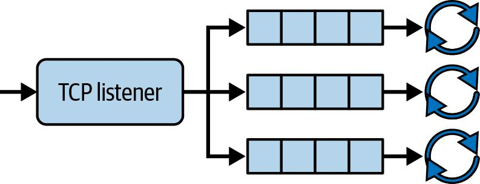


처리할 요청이 없을 때는 스레드가 파킹(park, 대기 상태로 진입)되도록 하고 싶습니다. 파킹과 관련하여 스레드와 통신하기 위해 각 스레드마다 `AtomicBool`을 하나씩 둡니다.

```rust
static FLAGS: [AtomicBool; 3] = [
    AtomicBool::new(false),
    AtomicBool::new(false),
    AtomicBool::new(false),
];
```

각 `AtomicBool`은 하나의 스레드를 나타냅니다. `AtomicBool`이 `false`이면 스레드는 파킹되지 않은 상태입니다. `AtomicBool`이 `true`이면 라우터는 해당 스레드가 파킹되어 있음을 인지하고, 스레드에 요청을 보내기 전에 먼저 스레드를 깨워야(`unpark`) 한다는 것을 압니다.

이제 `FLAGS`를 준비했으므로 각 스레드별로 들어오는 요청을 처리해야 합니다. 스레드 내부에서 실행자를 생성한 다음 스레드용 채널에서 메시지 수신을 시도합니다. 채널에 요청이 있으면 해당 실행자에서 태스크를 스폰합니다. 들어오는 요청이 없으면 폴링 대기 중인 태스크가 있는지 확인합니다. 태스크가 없으면 스레드는 `FLAG`를 `true`로 설정하고 스레드를 파킹합니다. 폴링할 태스크가 있다면 루프의 마지막에서 태스크를 폴링합니다. 이 프로세스는 다음 매크로를 통해 수행할 수 있습니다.

```rust
macro_rules! spawn_worker {
    ($name:expr, $rx:expr, $flag:expr) => {
        thread::spawn(move || {
            let mut executor = Executor::new();
            loop {
                if let Ok(stream) = $rx.try_recv() {
                    println!(
                        "{} Received connection: {}",
                        $name,
                        stream.peer_addr().unwrap()
                    );
                    executor.spawn(handle_client(stream));
                } else {
                    if executor.polling.len() == 0 {
                        println!("{} is sleeping", $name);
                        $flag.store(true, Ordering::SeqCst);
                        thread::park();
                    }
                }
                executor.poll();
            }
        })
    };
}
```

이 매크로에서는 로깅 목적으로 스레드 이름, 들어오는 요청을 받기 위한 채널의 리시버, 그리고 스레드가 파킹될 때 시스템의 나머지 부분에 알리기 위한 플래그를 인자로 받습니다.

> [!TIP]
> 복잡한 매크로 작성에 대한 자세한 내용은 잉그바르 스테파냔(Ingvar Stepanyan)의 *Writing Complex Macros in Rust*를 참고하세요.

`main` 함수에서 요청 수락 과정을 조율할 수 있습니다.

```rust
fn main() -> io::Result<()> {
    . . .
    Ok(())
}
```

먼저 스레드로 요청을 전송하는 데 사용할 채널들을 정의합니다.

```rust
let (one_tx, one_rx) = channel::<TcpStream>();
let (two_tx, two_rx) = channel::<TcpStream>();
let (three_tx, three_rx) = channel::<TcpStream>();
```

그런 다음 요청을 처리할 스레드들을 생성합니다.

```rust
let one = spawn_worker!("One", one_rx, &FLAGS[0]);
let two = spawn_worker!("Two", two_rx, &FLAGS[1]);
let three = spawn_worker!("Three", three_rx, &FLAGS[2]);
```

이제 실행자들이 각자의 스레드에서 실행되며 TCP 리스너가 요청을 보내주기를 기다립니다. 개별 스레드를 깨우고 요청을 보내기 위해 스레드 핸들과 채널 송신자(transmitter)를 유지하고 참조해야 합니다. 다음 코드를 사용하여 스레드들과 상호작용할 수 있습니다.

```rust
let router = [one_tx, two_tx, three_tx];
let threads = [one, two, three];
let mut index = 0;
let listener = TcpListener::bind("127.0.0.1:7878")?;
println!("Server listening on port 7878");
for stream in listener.incoming() {
    . . .
}
```

이제 들어오는 TCP 요청을 처리하기만 하면 됩니다.

```rust
for stream in listener.incoming() {
    match stream {
        Ok(stream) => {
            let _ = router[index].send(stream);
            if FLAGS[index].load(Ordering::SeqCst) {
                FLAGS[index].store(false, Ordering::SeqCst);
                threads[index].thread().unpark();
            }
            index += 1; // 스레드 인덱스를 순환
            if index == 3 {
                index = 0;
            }
        }
        Err(e) => {
            println!("Connection failed: {}", e);
        }
    }
}
```

TCP 요청을 수신하면 TCP 스트림을 스레드로 보내고, 스레드가 파킹되어 있는지 확인한 후 필요 시 파킹을 해제합니다. 다음으로 요청이 모든 스레드에 고르게 분배되도록 인덱스를 다음 스레드로 이동합니다.

그렇다면 요청을 실행자로 보낸 후에는 무엇을 해야 할까요? 바로 요청을 처리해야 합니다.

### 요청 처리하기

요청 처리와 관련하여 실행자에서 `handle_client` 함수가 호출된다는 점을 상기해 봅시다. 비동기 핸들러 함수는 다음과 같은 형태를 취합니다.

```rust
async fn handle_client(mut stream: TcpStream) -> std::io::Result<()> {
    stream.set_nonblocking(true)?;
    let mut buffer = Vec::new();
    let mut local_buf = [0; 1024];
    loop {
        . . .
    }
    match Data::deserialize(&mut Cursor::new(buffer.as_slice())) {
        Ok(message) => {
            println!("Received message: {:?}", message);
        },
        Err(e) => {
            println!("Failed to decode message: {}", e);
        }
    }
    Sleep::new(std::time::Duration::from_secs(1)).await;
    stream.write_all(b"Hello, client!")?;
    Ok(())
}
```

이는 비동기 런타임에서 구축했던 센더 및 리시버 future와 유사해 보일 것입니다. 여기서 1초 동안 비동기 슬립을 추가합니다. 이는 단지 작업이 수행되는 상황을 시뮬레이션하기 위한 것입니다. 또한 이를 통해 비동기가 제대로 작동하는지 확인할 수 있습니다. 만약 비동기가 제대로 동작하지 않고 순차 블로킹된다면 10개의 요청을 보냈을 때 총 소요 시간이 10초를 훌쩍 넘길 것입니다.

루프 내부에서 들어오는 스트림 데이터를 처리합니다.

```rust
match stream.read(&mut local_buf) {
    Ok(0) => {
        break;
    },
    Ok(len) => {
        buffer.extend_from_slice(&local_buf[..len]);
    },
    Err(ref e) if e.kind() == ErrorKind::WouldBlock => {
        if buffer.len() > 0 {
            break;
        }
        Sleep::new(std::time::Duration::from_millis(10)).await;
        continue;
    },
    Err(e) => {
        println!("Failed to read from connection: {}", e);
    }
}
```

블로킹 상태가 발생하면 짧은 비동기 슬립을 두어 실행자가 해당 요청 핸들을 다시 큐에 넣고 다른 요청 핸들을 폴링할 수 있도록 합니다.

이제 서버가 완벽히 동작합니다. 작성해야 할 마지막 조각은 클라이언트입니다.

### 비동기 클라이언트 구축하기

클라이언트 역시 동일한 의존성에 의존하므로, 클라이언트 `Cargo.toml`에 다음과 같은 의존성이 들어가는 것은 당연합니다.

```toml
[dependencies]
data_layer = { path = "../data_layer" }
async_runtime = { path = "../async_runtime" }
```

`main.rs` 파일에는 다음 임포트가 필요합니다.

```rust
use std::{
    io,
    sync::{Arc, Mutex},
    net::TcpStream,
    time::Instant
};
use data_layer::data::Data;
use async_runtime::{
    executor::Executor,
    reciever::TcpReceiver,
    sender::TcpSender,
};
```

데이터 전송을 위해 비동기 런타임에서 만든 송신 및 수신 future를 구현합니다.

```rust
async fn send_data(field1: u32, field2: u16, field3: String) -> io::Result<String> {
    let stream = Arc::new(Mutex::new(TcpStream::connect("127.0.0.1:7878")?));
    let message = Data { field1, field2, field3 };
    TcpSender {
        stream: stream.clone(),
        buffer: message.serialize()?,
    }.await?;
    let receiver = TcpReceiver {
        stream: stream.clone(),
        buffer: Vec::new(),
    };
    String::from_utf8(receiver.await?).map_err(|_| {
        io::Error::new(io::ErrorKind::InvalidData, "Invalid UTF-8")
    })
}
```

이제 비동기 `send_data` 함수를 4,000번 호출하고 이 모든 핸들을 기다릴 수 있습니다.

```rust
fn main() -> io::Result<()> {
    let mut executor = Executor::new();
    let mut handles = Vec::new();
    let start = Instant::now();
    for i in 0..4000 {
        let handle = executor.spawn(send_data(
            i, i as u16, format!("Hello, server! {}", i)
        ));
        handles.push(handle);
    }
    std::thread::spawn(move || {
        loop {
            executor.poll();
        }
    });
    println!("Waiting for result...");
    for handle in handles {
        match handle.recv().unwrap() {
            Ok(result) => println!("Result: {}", result),
            Err(e) => println!("Error: {}", e),
        };
    }
    let duration = start.elapsed();
    println!("Time elapsed in expensive_function() is: {:?}", duration);
    Ok(())
}
```

테스트 준비가 끝났습니다. 서로 다른 터미널에서 서버와 클라이언트를 실행해 보면 모든 출력이 요청을 처리하고 있음을 보여줄 것입니다. 전체 클라이언트 프로세스는 약 1.2초밖에 걸리지 않으며, 이는 비동기 시스템이 훌륭하게 작동하고 있음을 의미합니다. 드디어 해냈습니다! 서드파티 의존성을 전혀 쓰지 않고 비동기 서버를 구축했습니다!

### 요약

이번 장에서는 오직 표준 라이브러리만을 사용하여 상당히 효율적인 비동기 런타임을 구축해 보았습니다. 이러한 고성능의 일부는 서버를 Rust로 작성한 덕분이기도 합니다. 또 다른 요인은 비동기 모듈이 네트워크 연결과 같은 I/O 바운드 작업에 대해 시스템 리소스 활용률을 크게 끌어올려 주기 때문입니다. 물론 우리가 만든 서버가 Tokio와 같은 고도화된 런타임만큼 효율적이지는 않겠지만, 충분히 실용적입니다.

그렇다고 해서 기존 프로젝트에서 Tokio와 웹 프레임워크를 걷어내는 것은 권장하지 않습니다. 수많은 크레이트가 Tokio와 같은 표준 런타임과 통합되도록 설계되었기 때문입니다. 이를 걷어내면 서드파티 크레이트와의 연동성을 크게 잃게 되며 런타임 효율성도 떨어질 수 있습니다. 하지만 프로그램 내에서 다른 런타임을 동시에 활성화하여 운용할 수도 있습니다. 예를 들어 Tokio 채널을 사용하여 자체 비동기 런타임으로 태스크를 전송할 수 있습니다. 이는 Tokio가 들어오는 요청 등 표준적인 비동기 작업을 처리하는 동안, 특수한 틈새 문제 해결을 위해 맞춤형 방식으로 태스크를 처리해야 하는 특정 요구사항이 있을 때 매우 유용합니다. 예를 들어 자체 키-값 저장소를 구축하고 트랜잭션 처리에 관한 최신 컴퓨터 과학 논문을 읽은 후, 해당 로직을 자체 비동기 런타임에 직접 구현하고자 할 때가 이에 해당합니다.

결론적으로 자체 비동기 런타임을 구축하는 것이 무조건 최선이거나 최악인 것은 아닙니다. 기존의 정립된 런타임을 잘 알고 있으면서도 필요할 때 직접 구축할 수 있는 능력을 갖추는 것이 양쪽의 장점을 모두 취하는 최선의 방법입니다. 특정 도구의 맹목적인 전도사가 되기보다 두 가지 무기를 모두 손에 쥐고 언제 어디서 적용할지 아는 것이 훨씬 바람직합니다. 다만 이러한 도구들을 문제 해결에 즉각 꺼내 쓰기 전에 충분한 연습이 필요합니다. 다양한 프로젝트에서 커스텀 비동기 런타임을 시도하며 실력을 다져보기를 권합니다. 웨이커 주변에 다양한 타입의 데이터를 다루어 보는 실험은 여러 접근 방식을 탐색하기에 좋은 출발점이 될 것입니다.

테스트는 이러한 접근 방식을 탐구하고 개선하는 데 핵심적인 요소입니다. 테스트를 통해 비동기 코드와 구현체에 대한 깊이 있고 직접적인 피드백을 얻을 수 있습니다. 제11장에서는 비동기 개념과 구현을 계속 탐구할 수 있도록 비동기 코드를 테스트하는 방법을 다루겠습니다.

# 제11장 테스팅

지금까지 우리는 러스트에서 비동기 시스템을 작성하는 것이 얼마나 강력한지 살펴보았습니다. 하지만 러스트에서 대규모 비동기 시스템을 구축할 때는 비동기 코드를 테스트하는 방법도 반드시 알아야 합니다. 시스템의 규모가 커질수록 복잡도 또한 함께 증가하기 때문입니다.

테스팅은 현재 구현 중인 코드에 대한 피드백을 향상시켜 코드를 더 빠르고 안전하게 작성할 수 있도록 해줍니다. 예를 들어, 거대한 코드베이스에서 특정 코드의 기능을 변경하거나 추가해야 할 때, 코드가 제대로 동작하는지 확인하기 위해 전체 시스템을 매번 구동하고 실행해야 한다면 작업이 매우 느려지고 위험할 것입니다. 그 대신 필요한 코드를 수정하거나 추가한 후 해당 코드에 대한 특정 테스트만 실행한다면 피드백 루프가 빨라질 뿐만 아니라 더 많은 엣지 케이스(edge case)를 테스트할 수 있어 코드가 훨씬 안전해집니다. 이 장에서는 비동기 코드와 외부 시스템 간의 인터페이스를 테스트하는 다양한 접근 방식을 살펴봅니다.

이 장을 마치면 인터페이스를 모킹(mocking)하고 해당 인터페이스에 대한 호출을 검증할 수 있는 격리된 테스트를 구축할 수 있게 됩니다. 이를 통해 진정으로 격리된 원자적(atomic) 테스트를 만들 수 있습니다. 또한 비동기 태스크를 블로킹할 수 있는 데드락(deadlock, 교착 상태), 경쟁 상태(race condition), 채널 용량(channel capacity) 문제와 같은 동기화 함정을 테스트하는 방법도 배우게 됩니다. 마지막으로 서버와 같은 네트워크 상호작용을 모킹하는 방법, 모든 퓨처에 대해 미세 조정된 세밀한(fine-grained) 테스트 제어권을 확보하는 방법, 다양한 폴링(polling) 조건에서 시스템이 어떻게 진행되는지 확인하기 위해 언제 퓨처를 폴링해야 하는지 등을 배우게 됩니다.

동기 테스트의 기초부터 살펴보면서 테스팅 여정을 시작하겠습니다.

### 기본 동기 테스트 수행하기

"격리된 모듈 구축하기"(179페이지)에서 우리는 동기 인터페이스를 갖춘 비동기 런타임 환경을 구축했습니다. 당연하게도 인터페이스에 포함된 몇 가지 함수가 동기식이므로, 격리된 모듈은 가장 테스트하기 쉬운 대상 중 하나입니다. 먼저 동기 테스트를 수행하는 것으로 시작해 보겠습니다.

테스트를 작성하기 전에 `Cargo.toml`에 다음 의존성을 추가해야 합니다:

```toml
[dev-dependencies]
mockall = "0.11.4"
```

`mockall` 의존성을 사용하면 트레이트와 그 함수들을 모킹하여 입력을 검사하고 출력을 모의(mock)할 수 있습니다.

격리된 모듈의 인터페이스를 떠올려보면, 키를 반환하는 `spawn`과 우리가 스폰한 비동기 태스크의 결과를 반환하는 `get_result`라는 두 가지 함수가 있었습니다. 이러한 상호작용을 위해 다음과 같은 트레이트를 정의할 수 있습니다:

```rust
pub trait AsyncProcess<X, Y, Z> {
    fn spawn(&self, input: X) -> Result<Y, String>;
    fn get_result(&self, key: Y) -> Result<Z, String>;
}
```

여기서 제네릭 매개변수를 사용하여 입력, 출력, 사용되는 키의 타입을 다양하게 변경할 수 있도록 했습니다. 이제 태스크를 스폰하고, 무언가를 출력한 다음, 비동기 함수로부터 결과를 받아 처리하는 함수로 넘어가 보겠습니다:

```rust
fn do_something<T>(async_handle: T, input: i32) -> Result<i32, String>
where
    T: AsyncProcess<i32, String, i32>,
{
    let key = async_handle.spawn(input)?;
    println!("something is happening");
    let result = async_handle.get_result(key)?;
    if result > 10 {
        return Err("result is too big".to_string());
    }
    if result == 8 {
        return Ok(result * 2);
    }
    Ok(result * 3)
}
```

여기서 우리는 의존성 주입(dependency injection)에 의존하고 있습니다. 의존성 주입에서는 구조체, 객체 또는 함수를 다른 함수의 매개변수로 전달합니다. 그런 다음 함수로 전달된 대상이 계산을 수행합니다.

우리의 경우 해당 트레이트를 구현한 구조체를 전달하고, 그 트레이트를 호출합니다. 이는 매우 강력합니다. 예를 들어 읽기 함수에서 데이터베이스에 접근하는 구조체에 대해 읽기 트레이트를 구현할 수 있습니다. 하지만 파일에서 읽기를 처리하는 다른 구조체를 가져와 동일한 읽기 트레이트를 구현할 수도 있습니다. 우리가 원하는 저장소 솔루션에 따라 해당 핸들러를 함수에 전달하기만 하면 됩니다. 짐작하셨겠지만 모의(mock) 구조체를 생성하고 해당 모의 구조체에 구현된 트레이트에 원하는 기능을 무엇이든 구현한 다음, 테스트 중인 함수에 모의 구조체를 전달할 수 있습니다. 하지만 `mockall`을 사용하여 구조체를 적절히 모킹하면 핸들러의 함수에 무엇이 전달되는지와 같은 특정 조건도 단언(assert)할 수 있습니다. 테스트 레이아웃은 다음과 같은 형태를 취합니다:

```rust
#[cfg(test)]
mod get_team_processes_tests {
    use super::*;
    use mockall::predicate::*;
    use mockall::mock;

    mock! {
        DatabaseHandler {}

        impl AsyncProcess<i32, String, i32> for DatabaseHandler {
            fn spawn(&self, input: i32) -> Result<String, String>;
            fn get_result(&self, key: String) -> Result<i32, String>;
        }
    }

    #[test]
    fn do_something_fail() {
        // ...
    }
}
```

`do_something_fail` 테스트 함수 내부에서 모의 핸들러를 정의하고, `spawn` 함수에 4가 전달되는지 단언한 뒤, 이 함수가 `test_key`를 반환하도록 설정합니다:

```rust
let mut handle = MockDatabaseHandler::new();
handle.expect_spawn()
    .with(eq(4))
    .returning(|_| { Ok("test_key".to_string()) });
```

이제 `test_key`를 확보했으므로 이것이 `get_result` 함수로 전달될 것이라 가정할 수 있으며, `get_result`가 11을 반환하도록 지정합니다:

```rust
handle.expect_get_result()
    .with(eq("test_key".to_string()))
    .returning(|_| { Ok(11) });
```

테스트 대상 함수가 에러를 반환할 것이라 예상할 수 있으므로 다음과 같이 단언합니다:

```rust
let outcome = do_something(handle, 4);
assert_eq!(outcome, Err("result is too big".to_string()));
```

우리는 테스팅 프로세스에서 업계 표준인 준비(Arrange), 실행(Act), 단언(Assert) 패턴을 따르고 있습니다:

- **준비 (Arrange)**: 테스트 환경을 설정하고 모의 객체의 예상 동작을 정의합니다. (모의 핸들러를 생성하고 예상 입력과 출력을 지정할 때 이루어집니다.)
- **실행 (Act)**: 준비된 조건으로 테스트 대상 함수를 실행합니다. (`do_something(handle, 4)`를 호출할 때 이루어집니다.)
- **단언 (Assert)**: 결과가 기대치와 일치하는지 검증합니다. (`assert_eq!`를 사용하여 결과를 확인할 때 이루어집니다.)

이제 테스트가 정의되었으므로 `cargo test` 명령으로 실행할 수 있으며, 다음과 같은 출력 결과가 나타납니다:

```text
running 1 test
test get_team_processes_tests::do_something_fail ... ok
```

테스트가 통과했습니다! 간결성을 위해 이 책에서 가능한 모든 결과를 정의하지는 않겠지만, 모든 엣지 케이스를 시도해 봄으로써 단위 테스트를 연습할 수 있는 좋은 기회입니다.

> **모킹과 테스트 주도 개발**
> 
> 모킹은 로직을 격리할 수 있게 해주므로 매우 강력합니다. 우리의 `do_something` 함수가 데이터베이스가 특정 상태에 있어야 하는 애플리케이션에 속해 있다고 상상해 보십시오. 예를 들어 `do_something`이 데이터베이스의 팀원 수를 처리한다면, 데이터베이스에 팀들이 미리 존재해야 할 것입니다. 그러나 `do_something`을 실행할 때마다 데이터베이스를 채우고 코드를 실행하기 전에 모든 것이 준비되었는지 확인하고 싶지는 않을 것입니다. 여기에는 몇 가지 이유가 있습니다. 다른 엣지 케이스에 대해 매개변수를 재정의하려면 데이터베이스를 다시 뒤섞어야 합니다. 이는 많은 시간이 걸리며 코드를 실행할 때마다 데이터베이스를 다시 만져야 합니다. 모킹은 테스트를 원자적으로 만들어 줍니다. 환경을 매번 설정할 필요 없이 코드를 반복해서 실행할 수 있습니다. 테스트 주도 개발(TDD)을 도입한 개발자는 일반적으로 더 적은 버그로 더 빠른 개발 속도를 유지합니다.

이제 프로그램에 대한 기본적인 모킹을 정의했지만, 모든 것에 격리된 모듈만을 사용할 수는 없습니다. 여러분의 코드는 완전한 비동기일 수도 있습니다. 웹 개발을 하고 있다면 특히 그렇습니다. 비동기 모듈 내의 비동기 함수를 테스트하고 싶을 수 있습니다. 이를 위해서는 비동기 모킹을 다루어야 합니다.

### 비동기 코드 모킹하기

비동기 트레이트를 테스트하려면 테스트 함수 내에 비동기 런타임이 필요합니다. 익숙한 런타임을 자유롭게 선택해도 되지만, 우리의 예제에서는 Tokio를 계속 사용할 것이므로 다음과 같은 의존성을 추가합니다:

```toml
[dependencies]
tokio = { version = "1.34.0", features = ["full"] }

[dev-dependencies]
mockall = "0.11.4"
```

트레이트가 비동기식이 되면 비동기 함수가 우리가 대기할 수 있는 핸들을 반환하므로 트레이트에 더 이상 두 개의 함수가 필요하지 않습니다. 핸들은 비동기 코드 내에서 관리되므로 `get_result` 함수만 남겨둡니다:

```rust
use std::future::Future;

pub trait AsyncProcess<X, Z> {
    fn get_result(&self, key: X) -> impl Future<Output = Result<Z, String>> + Send + 'static;
}
```

`AsyncProcess` 트레이트 내의 `get_result` 함수는 단순히 `async fn`으로 선언되는 대신 `Future`를 반환합니다. 이러한 탈당화(desugaring)를 통해 퓨처에 구현된 트레이트를 더욱 정밀하게 제어할 수 있습니다.

`do_something` 함수 역시 다음과 같이 재정의됩니다:

```rust
async fn do_something<T>(async_handle: T, input: i32) -> Result<i32, String>
where
    T: AsyncProcess<i32, i32> + Send + Sync + 'static,
{
    println!("something is happening");
    let result: i32 = async_handle.get_result(input).await?;
    if result > 10 {
        return Err("result is too big".to_string());
    }
    if result == 8 {
        return Ok(result * 2);
    }
    Ok(result * 3)
}
```

결과를 처리하는 로직은 동일하게 유지됩니다. 출력문 전에 태스크를 실행하고 출력문 후에 결과를 가져옵니다. 그러나 모킹을 수행하기 전에 테스트 모듈에 다음과 같은 임포트가 있는지 확인해야 합니다:

```rust
use super::*;
use mockall::predicate::*;
use mockall::mock;
use std::boxed::Box;
```

트레이트에 함수가 하나만 남았으므로 모의 객체는 다음 코드로 재정의됩니다:

```rust
mock! {
    DatabaseHandler {}

    impl AsyncProcess<i32, i32> for DatabaseHandler {
        fn get_result(&self, key: i32) -> impl Future<Output = Result<i32, String>> + Send + 'static;
    }
}
```

이제 함수가 비동기이므로 테스트 내부에서 런타임을 정의하고 블로킹해야 합니다. 테스트들이 모두 단일 스레드에서 실행되는 것은 아니므로, 각 개별 테스트에서 런타임을 정의하여 테스트의 원자성을 보장할 수 있습니다:

```rust
#[test]
fn do_something_fail() {
    let mut handle = MockDatabaseHandler::new();
    handle.expect_get_result()
        .with(eq(4))
        .returning(|_| {
            Box::pin(async move { Ok(11) })
        });

    let runtime = tokio::runtime::Builder::new_current_thread()
        .enable_all()
        .build()
        .unwrap();

    let outcome = runtime.block_on(do_something(handle, 4));
    assert_eq!(outcome, Err("result is too big".to_string()));
}
```

이제 비동기 코드에 대한 모킹이 완성되었습니다. HTTP 요청이나 데이터베이스 연결처럼 다른 소스와 상호작용하는 프로세스는 격리된 비동기 함수로 분리할 것을 권장합니다. 이렇게 하면 모킹하기가 더 쉬워져 코드 테스트가 한결 수월해집니다. 그러나 비동기 코드에서 외부 리소스 호출만이 염두에 두어야 할 유일한 사항은 아닙니다. 비동기 코드에서도 데드락과 같은 동기화 문제가 발생할 수 있으므로 이러한 문제에 대한 테스트도 필요합니다.

### 데드락 테스트하기

데드락(교착 상태)에서는 락(lock) 때문에 비동기 태스크가 완료될 방법 없이 멈춰 서게 됩니다. 이 책 전체의 모든 예제가 비동기 시스템을 데드락에 노출시키는 것은 아니지만, 데드락은 언제든 발생할 수 있습니다. 데드락을 유발하는 간단한 예는 두 개의 비동기 태스크가 동일한 두 개의 락에 서로 반대 순서로 접근하려고 시도하는 것입니다(그림 11-1).

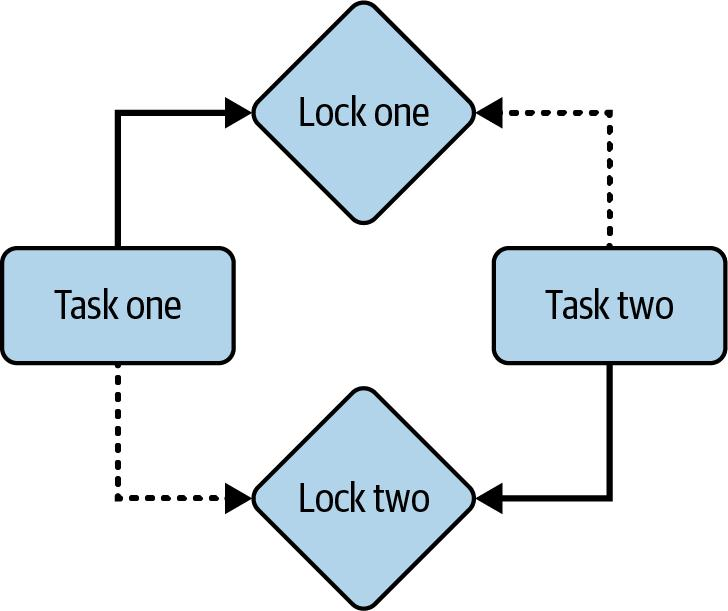


그림 11-1에서 태스크 1은 락 1을 획득합니다. 태스크 2는 락 2를 획득합니다. 그러나 어느 태스크도 자신의 락을 해제하지 않은 채, 자신이 쥔 락을 유지하면서 상대방이 이미 쥐고 있는 다른 락을 획득하려고 시도합니다. 이는 데드락으로 이어집니다. 두 태스크 모두 획득하려는 두 번째 락을 결코 얻을 수 없기 때문에 절대 완료되지 못합니다.

이러한 데드락은 단지 두 태스크만을 멈추게 하는 데 그치지 않습니다. 다른 태스크들이 이 락들에 접근해야 한다면, 그 태스크들도 스폰되었을 때 블로킹될 것입니다. 눈 깜짝할 사이에 전체 시스템이 완전히 멈춰 버릴 수 있습니다. 따라서 데드락을 테스트하는 것은 매우 중요합니다. 단위 테스트를 통해 코드를 시스템의 나머지 부분에 통합하기 전에 이러한 데드락을 사전에 잡아낼 수 있습니다. 테스트 코드는 다음과 같습니다:

```rust
#[cfg(test)]
mod tests {
    use tokio::sync::Mutex;
    use std::sync::Arc;
    use tokio::time::{sleep, Duration, timeout};

    #[tokio::test]
    async fn test_deadlock_detection() {
        // ...
    }
}
```

테스트에 `#[tokio::test]` 매크로를 사용하고 있습니다. 이는 본질적으로 테스트 함수 내부에 비동기 런타임을 생성하는 것과 동일합니다. 테스트 함수 내부에서 두 개의 뮤텍스와 이 뮤텍스들에 대한 참조를 생성하여 두 태스크 모두 두 뮤텍스에 접근할 수 있도록 합니다:

```rust
let resource1 = Arc::new(Mutex::new(0));
let resource2 = Arc::new(Mutex::new(0));

let resource1_clone = Arc::clone(&resource1);
let resource2_clone = Arc::clone(&resource2);
```

그런 다음 두 개의 태스크를 스폰합니다:

```rust
let handle1 = tokio::spawn(async move {
    let _lock1 = resource1.lock().await;
    sleep(Duration::from_millis(100)).await;
    let _lock2 = resource2.lock().await;
});

let handle2 = tokio::spawn(async move {
    let _lock2 = resource2_clone.lock().await;
    sleep(Duration::from_millis(100)).await;
    let _lock1 = resource1_clone.lock().await;
});
```

첫 번째 태스크는 첫 번째 뮤텍스를 얻은 뒤 슬립 후 두 번째 뮤텍스를 얻으려 합니다. 두 번째 태스크는 획득하려는 락의 순서를 반대로 바꿉니다. `sleep` 함수는 두 태스크 모두 두 번째 락을 획득하려 시도하기 전에 첫 번째 락을 획득할 수 있는 시간을 제공합니다. 이제 스폰된 태스크들을 대기하고 싶지만, 우리는 데드락을 테스트하고 있습니다. 데드락이 발생했을 때 타임아웃을 설정하지 않으면 테스트가 무한정 멈춰 있게 됩니다. 이를 방지하기 위해 다음과 같이 타임아웃을 설정할 수 있습니다:

```rust
let result = timeout(Duration::from_secs(5), async {
    let _ = handle1.await;
    let _ = handle2.await;
}).await;
```

타임아웃 시간이 5초로 다소 길지만, 5초 후에도 두 비동기 태스크가 끝나지 않았다면 데드락이 발생했다고 결론지을 수 있습니다. 타임아웃을 설정했으므로 다음 코드로 결과를 확인합니다:

```rust
assert!(result.is_ok(), "A potential deadlock detected!");
```

테스트를 실행하면 다음과 같은 출력이 나타납니다:

```text
thread 'tests::test_deadlock_detection' panicked at 'A potential deadlock detected!', src/main.rs:43:9
note: run with `RUST_BACKTRACE=1` environment variable to display a backtrace
test tests::test_deadlock_detection ... FAILED

failures:
    tests::test_deadlock_detection

test result: FAILED. 0 passed; 1 failed; 0 ignored; 0 measured; 0 filtered out; finished in 5.01s
```

실행 시간은 5초를 막 넘겼으며, 잠재적 데드락이 감지되었다는 유용한 메시지를 얻게 됩니다. 데드락을 포착했을 뿐만 아니라 데드락을 유발하는 특정 함수를 격리해 냈습니다.

> **라이브락 (Livelocks)**
> 
> 라이브락(livelock, 활성 교착 상태)이라는 또 다른 락 문제는 데드락과 전반적으로 동일한 영향을 미칩니다. 즉, 시스템을 완전히 정지시킬 수 있습니다. 라이브락에서는 둘 이상의 비동기 태스크가 지연됩니다. 그러나 둘 이상의 비동기 태스크가 멈춰서 진행하지 못하는 대신, 서로에게 반응하느라 앞으로 나아가지 못합니다. 간단한 예로 두 비동기 태스크가 끊임없는 루프 속에서 서로에게 동일한 메시지를 메아리처럼 되돌려주는 상황을 들 수 있습니다. 데드락과 라이브락의 차이를 보여주는 고전적이면서도 명확한 비유는 다음과 같습니다. 데드락은 복도에서 두 사람이 가만히 서서 상대방이 비켜주기를 기다리며 둘 다 움직이지 않는 것과 같습니다. 반면 라이브락은 두 사람이 서로를 비켜가려고 계속 옆으로 발을 디디지만, 둘 다 매번 같은 방향으로 비켜서는 바람에 계속 부딪혀 결국 아무도 지나가지 못하는 것과 같습니다.

데드락은 반드시 피해야 하지만, 시스템이 완전히 멈춰 서기 때문에 일반적으로 발생 여부가 명확히 드러납니다. 하지만 코드는 우리가 모르는 사이에 조용히 오류를 일으킬 수도 있습니다. 이것이 바로 경쟁 상태(race condition)를 테스트해야 하는 이유입니다.

### 경쟁 상태 테스트하기

경쟁 상태(race condition)에서는 데이터의 상태가 변경되었음에도 해당 상태에 대한 참조가 구버전이 되어 버립니다. 데이터 레이스의 간단한 예가 그림 11-2에 묘사되어 있습니다.

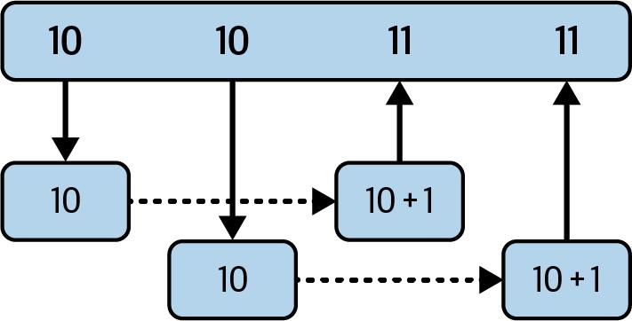


그림 11-2는 데이터 저장소에서 숫자를 가져와 1씩 증가시키는 두 개의 비동기 태스크를 보여줍니다. 첫 번째 태스크가 데이터 저장소를 업데이트하기 전에 두 번째 태스크가 데이터를 가져오기 때문에, 두 태스크 모두 10에서 증가 연산을 수행하여 원래 12가 되어야 할 데이터가 11이 되고 맙니다. 이 책 전반에서 우리는 데이터 레이스가 발생하지 않도록 뮤텍스나 특정 원자적(atomic) 연산으로 이를 방지해 왔습니다. 비교 및 갱신(compare-and-swap/compare-and-update) 원자적 연산은 이 경쟁 상태 예제를 방지하는 가장 간단한 방법입니다. 경쟁 상태를 예방하는 것이 최선의 접근 방식이지만 그 방법이 항상 명확한 것은 아니며, 우리는 데이터 레이스에 대해 코드를 테스트하는 방법을 탐구해야 합니다. 테스트의 기본 윤곽은 다음과 같습니다:

```rust
#[cfg(test)]
mod tests {
    use std::sync::atomic::{AtomicUsize, Ordering};
    use tokio::time::{sleep, Duration};
    use tokio::runtime::Builder;

    static COUNTER: AtomicUsize = AtomicUsize::new(0);

    async fn unsafe_add() {
        let value = COUNTER.load(Ordering::SeqCst);
        COUNTER.store(value + 1, Ordering::SeqCst);
    }

    #[test]
    fn test_data_race() {
        // ...
    }
}
```

원자적 더하기 연산을 수행하는 대신 숫자를 가져오고, 숫자를 증가시킨 다음, 새 값을 설정함으로써 그림 11-2에 나타난 경쟁 상태가 발생할 여지를 만듭니다. 테스트 함수에서는 단일 스레드 런타임을 구축하고 10,000개의 `unsafe_add` 태스크를 스폰할 수 있습니다. 해당 태스크들을 모두 처리한 후 `COUNTER`가 100,000인지 단언합니다:

```rust
let runtime = Builder::new_current_thread()
    .enable_all()
    .build()
    .unwrap();

let mut handles = vec![];
let total = 100000;
for _ in 0..total {
    let handle = runtime.spawn(unsafe_add());
    handles.push(handle);
}
for handle in handles {
    runtime.block_on(handle).unwrap();
}

assert_eq!(
    COUNTER.load(Ordering::SeqCst),
    total,
    "race condition occurred!"
);
```

테스트를 실행해 보면 통과하는 것을 확인할 수 있습니다. 런타임에 스레드가 하나뿐이고 값을 읽는 것(get)과 쓰는 것(set) 사이에 비동기 작업이 없기 때문입니다. 하지만 런타임을 다중 스레드로 변경한다고 가정해 보겠습니다:

```rust
let runtime = tokio::runtime::Runtime::new().unwrap();
```

그러면 다음과 같은 에러가 발생합니다:

```text
thread 'tests::test_data_race' panicked at
'assertion failed: `(left == right)`
left: `99410`,
right: `100000`: race condition occurred!'
```

태스크 중 일부가 경쟁 상태의 피해자가 된 것입니다. 만약 값을 가져오고 설정하는 사이에 `sleep`과 같은 다른 비동기 함수를 넣는다면 어떻게 될까요?

```rust
let value = COUNTER.load(Ordering::SeqCst);
sleep(Duration::from_secs(1)).await;
COUNTER.store(value + 1, Ordering::SeqCst);
```

그러면 다음과 같은 에러가 발생합니다:

```text
thread 'tests::test_data_race' panicked at
'assertion failed: `(left == right)`
left: `1`,
right: `100000`: Race Condition occurred!'
```

모든 태스크가 경쟁 상태의 피해자가 되었습니다. 비동기 `sleep`이 실행자에게 제어권을 양도하여 다른 비동기 태스크들이 `COUNTER`를 읽을 수 있게 되었기 때문에, 어떤 태스크도 `COUNTER`에 값을 쓰기 전에 모든 태스크가 초기에 `COUNTER`를 읽어버렸기 때문입니다.

`sleep`이 넌블로킹이라면 단일 스레드 환경에서도 이러한 결과가 발생합니다. 이는 경쟁 상태가 우려될 때 다중 스레드 테스트 환경을 사용해야 할 필요성을 강조합니다. 또한 태스크 주변의 매개변수를 신속하게 변경하고 매개변수 변경이 태스크에 미치는 영향을 빠르게 테스트할 수 있다는 장점도 확인할 수 있습니다.

뮤텍스와 원자적 값만이 여러 태스크가 데이터에 접근할 수 있도록 하는 유일한 방법은 아닙니다. 비동기 태스크 간에 데이터를 전송하기 위해 채널을 사용할 수도 있습니다. 따라서 채널 용량을 테스트해야 합니다.

### 채널 용량 테스트하기

이전 예제 중 일부에서는 무제한(unbounded) 채널을 사용했지만, 과도한 메모리 소비를 방지하기 위해 채널의 최대 크기를 제한하고 싶을 때가 있습니다. 그러나 채널이 최대 한계에 도달하면 송신자는 채널에 메시지를 더 이상 보낼 수 없습니다. 액터 컬렉션과 같은 시스템이 있을 때, 시스템에 너무 많은 메시지를 보내면 시스템이 막히는지 확인해야 할 수 있습니다. 요구사항에 따라 모든 메시지가 처리될 때까지 시스템 속도를 늦춰야 할 수도 있지만, 사용 사례에 맞게 시스템이 어떻게 동작하는지 알 수 있도록 시스템을 테스트하는 것이 좋습니다.

테스트 레이아웃은 다음과 같습니다:

```rust
#[cfg(test)]
mod tests {
    use tokio::sync::mpsc;
    use tokio::time::{Duration, timeout};
    use tokio::runtime::Builder;

    #[test]
    fn test_channel_capacity() {
        // ...
    }
}
```

테스트 함수 내부에서 비동기 런타임과 용량이 5인 채널을 정의합니다:

```rust
let runtime = Builder::new_current_thread()
    .enable_all()
    .build()
    .unwrap();

let (sender, mut receiver) = mpsc::channel::<i32>(5);
```

그런 다음 채널의 용량을 초과하여 메시지를 보내는 태스크를 스폰합니다:

```rust
let sender = runtime.spawn(async move {
    for i in 0..10 {
        sender.send(i).await.expect("Failed to send message");
    }
});
```

타임아웃 테스트를 통해 시스템이 멈추는지 확인해 봅니다:

```rust
let result = runtime.block_on(async {
    timeout(Duration::from_secs(5), async {
        sender.await.unwrap();
    }).await
});
assert!(result.is_ok(), "A potential filled channel is not handled correctly");
```

현재로서는 송신자 퓨처가 결코 완료되지 않으므로 타임아웃을 초과하여 테스트가 실패합니다. 테스트를 통과시키려면 타임아웃 테스트 앞에 수신자 퓨처를 배치해야 합니다:

```rust
let receiver = runtime.spawn(async move {
    let mut i = 0;
    while let Some(msg) = receiver.recv().await {
        assert_eq!(msg, i);
        i += 1;
        println!("Got message: {}", msg);
    }
});
```

이제 테스트를 실행하면 통과합니다. 송신자와 수신자로 이루어진 간단한 시스템을 테스트했지만, 메시지를 제대로 처리하지 않으면 시스템이 완전히 멈춰 버린다는 사실을 테스트를 통해 명확히 확인할 수 있었습니다. 채널 또한 뮤텍스와 마찬가지로 데드락을 유발할 수 있으며, 충분한 테스트를 거친다면 타임아웃 테스트를 통해 데드락을 발견할 수 있습니다.

알다시피 채널을 사용하면 시스템 전체에 비동기식으로 데이터를 공유할 수 있습니다. 프로세스와 컴퓨터 간에 데이터를 공유할 때는 네트워크 프로토콜을 사용할 수 있습니다. 실무에서는 프로토콜을 사용하여 서버와 상호작용하는 비동기 코드를 작성하게 될 것입니다. 이러한 상호작용 역시 테스트되어야 합니다.

### 네트워크 상호작용 테스트

개발 및 테스트 환경에서 네트워크 상호작용을 실행할 때, 로컬에 서버를 띄우고 해당 서버에 의존하고 싶은 유혹이 들 수 있습니다. 하지만 이는 테스팅에 좋지 않을 수 있습니다. 예를 들어 테스트를 한 번 실행한 후 서버에서 행(row)을 삭제하는 작업이 있다면, 행이 이미 삭제되었기 때문에 테스트를 즉시 다시 실행할 수 없습니다. 행을 다시 삽입하는 단계를 만들 수도 있지만, 행에 의존성이 있다면 작업이 훨씬 복잡해집니다. 또한 `cargo test` 명령은 여러 프로세스에 걸쳐 실행됩니다. 여러 테스트가 동일한 서버를 동시에 호출하면 서버에서 데이터 경쟁 상태가 발생할 수 있습니다. 바로 이 지점에서 `mockito`를 사용합니다. 이 크레이트를 사용하면 테스트 내에서 직접 서버를 모킹하고 서버 엔드포인트가 특정 매개변수로 호출되었는지 단언할 수 있습니다. 네트워크 테스트 예제를 위해 다음 의존성이 필요합니다:

```toml
[dependencies]
tokio = { version = "1.34.0", features = ["full"] }
reqwest = { version = "0.11.22", features = ["json"] }

[dev-dependencies]
mockito = "1.2.0"
```

테스트 윤곽은 다음과 같습니다:

```rust
#[cfg(test)]
mod tests {
    use tokio::runtime::Builder;
    use mockito::Matcher;
    use reqwest;

    #[test]
    fn test_networking() {
        // ...
    }
}
```

테스트 함수 내부에서 테스트 서버를 가동합니다:

```rust
let mut server = mockito::Server::new();
let url = server.url();
```

여기서 `mockito`는 컴퓨터에서 현재 사용되지 않는 포트를 찾습니다. 이 URL로 요청을 보내면 모의 서버가 이를 추적할 수 있습니다. 서버는 테스트 함수의 스코프 내에 있으므로 테스트가 완료되면 모의 서버가 종료된다는 점을 기억하십시오. `mockito`를 사용하면 테스트가 진정으로 원자성을 유지합니다.

그런 다음 서버 엔드포인트에 대한 모의(mock)를 정의합니다:

```rust
let mock = server.mock("GET", "/my-endpoint")
    .match_query(Matcher::AllOf(vec![
        Matcher::UrlEncoded("param1".into(), "value1".into()),
        Matcher::UrlEncoded("param2".into(), "value2".into()),
    ]))
    .with_status(201)
    .with_body("world")
    .expect(5)
    .create();
```

모의 엔드포인트의 경로는 `/my-endpoint`입니다. 또한 URL에 특정 쿼리 매개변수가 포함될 것을 기대합니다. 모의 서버는 `world`라는 본문과 함께 201 응답 코드를 반환합니다. 또한 서버가 5번 호출될 것을 기대합니다. 원한다면 더 많은 엔드포인트를 추가할 수 있지만, 여기서는 장의 분량이 너무 늘어나는 것을 방지하기 위해 하나만 사용합니다.

모의 서버가 구축되었으므로 런타임 환경을 정의합니다:

```rust
let runtime = Builder::new_current_thread()
    .enable_io()
    .enable_time()
    .build()
    .unwrap();

let mut handles = vec![];
```

모든 준비가 완료되었으므로 런타임에 5개의 비동기 태스크를 보냅니다:

```rust
for _ in 0..5 {
    let url_clone = url.clone();
    handles.push(runtime.spawn(async move {
        let client = reqwest::Client::new();
        client.get(&format!(
            "{}/my-endpoint?param1=value1&param2=value2",
            url_clone
        )).send().await.unwrap()
    }));
}
```

마지막으로 비동기 태스크들이 완료될 때까지 스레드를 블로킹한 다음 모의 객체를 단언합니다:

```rust
for handle in handles {
    runtime.block_on(handle).unwrap();
}
mock.assert();
```

모든 비동기 태스크가 서버 호출이라는 목표를 달성했음을 단언할 수 있습니다. 태스크 중 하나라도 실패하면 테스트는 실패합니다.

> **동적 URL 정의하기**
> 
> 요청에 사용할 URL을 정의할 때는 하드코딩하기보다 동적으로 정의하는 것이 가장 좋습니다. 이렇게 하면 실제 운영 서버, 로컬 서버, 모의 서버 등 대상에 따라 URL의 호스트를 유연하게 변경할 수 있습니다. 환경 변수를 사용하는 것이 매력적으로 보일 수 있지만, 테스팅 시 `cargo test`의 멀티스레드 환경에서 문제를 일으킬 수 있습니다. 그 대신 설정 변수를 추출하는 트레이트를 정의하는 것이 가장 좋습니다. 그런 다음 이 추출 트레이트를 구현한 구조체를 전달합니다. 뷰 함수를 실제 서버에 바인딩할 때는 환경에서 설정 변수를 추출하는 구조체를 전달할 수 있습니다. 반면 다른 서버를 호출하는 함수와 뷰를 테스트할 때는 추출 트레이트 구현체에 `mockito` URL을 전달하기만 하면 됩니다.

`mockito`에는 더 많은 기능이 있습니다. 예를 들어 JSON 본문, 요청에 따른 응답을 결정하는 함수 및 기타 다양한 기능을 `mockito`의 API 문서에서 확인할 수 있습니다. 이제 서버와 트레이트를 모킹할 수 있으므로 격리된 환경에서 시스템을 테스트할 수 있습니다. 하지만 퓨처 자체를 격리하여 세밀하게 테스트하고, 폴링 사이에 퓨처가 어떤 상태인지 검사하는 것은 어떨까요? 바로 이 부분에서 비동기 테스팅 크레이트가 도움을 줍니다.

### 세밀한 퓨처 테스팅

이 절에서는 Tokio 테스팅 도구를 사용합니다. 하지만 여기서 다루는 개념은 모든 비동기 런타임에서 퓨처를 테스트할 때 적용될 수 있습니다. 테스트를 위해 다음 의존성이 필요합니다:

```toml
[dependencies]
tokio = { version = "1.34.0", features = ["full"] }

[dev-dependencies]
tokio-test = "0.4.3"
```

세밀한(fine-grained) 테스트를 위해 두 개의 퓨처가 동일한 뮤텍스를 획득하고 카운트를 1 증가시킨 뒤 완료되도록 하겠습니다. 두 퓨처가 동일한 뮤텍스를 획득하면서 간접적인 상호작용이 발생하므로, 퓨처를 개별적으로 폴링하고 퓨처가 폴링되는 시점의 상태를 확인할 수 있습니다.

초기 테스트 코드는 다음과 같은 형태입니다:

```rust
#[cfg(test)]
mod tests {
    use tokio::sync::Mutex;
    use tokio::time::{sleep, Duration};
    use tokio_test::{task::spawn, assert_pending};
    use std::sync::Arc;
    use std::task::Poll;

    async fn async_mutex_locker(mutex: Arc<Mutex<i32>>) -> () {
        let mut lock = mutex.lock().await;
        *lock += 1;
    }

    #[tokio::test]
    async fn test_monitor_file_metadata() {
        // ...
    }
}
```

테스트 함수 내부에서 퓨처들이 참조할 뮤텍스를 정의합니다:

```rust
let mutex = Arc::new(Mutex::new(0));
let mutex_clone1 = mutex.clone();
let mutex_clone2 = mutex.clone();
```

이제 `tokio_test::task::spawn` 함수를 사용하여 뮤텍스 참조를 가진 퓨처들을 스폰할 수 있습니다:

```rust
let mut future1 = spawn(async_mutex_locker(mutex_clone1));
let mut future2 = spawn(async_mutex_locker(mutex_clone2));
```

그런 다음 퓨처들을 폴링하여 둘 다 pending 상태여야 함을 단언합니다:

```rust
assert_pending!(future1.poll());
assert_pending!(future2.poll());
```

두 퓨처 모두 대기(pending) 상태이지만, 첫 번째 퓨처가 먼저 폴링되었으므로 뮤텍스를 먼저 획득하게 된다는 사실을 알고 있습니다. 폴링 순서를 바꾸었다면 반대의 결과를 얻었을 것입니다. 이것이 바로 이 테스트 접근 방식의 강력한 점입니다. 폴링 순서를 변경했을 때 퓨처에 어떤 일이 일어나는지 검사할 수 있게 해줍니다. 실제 운영 시스템에서는 의도적으로 시스템을 설계하지 않는 한 폴링 순서를 보장할 수 없으므로, 더 깊은 수준에서 엣지 케이스를 테스트할 수 있습니다.

데드락 예제에서 보았듯이 첫 번째 퓨처가 뮤텍스의 락을 획득하고 있는 한, 두 번째 퓨처를 아무리 여러 번 폴링하더라도 두 번째 퓨처는 항상 대기 상태에 머물게 됩니다. 다음과 같이 우리의 가정이 맞는지 확인합니다:

```rust
for _ in 0..10 {
    assert_pending!(future2.poll());
    sleep(Duration::from_millis(1)).await;
}
```

여기서 `assert_pending!` 매크로를 사용하면 우리의 가정이 틀렸을 때 테스트가 실패하게 됩니다. 충분한 시간이 흘렀으므로 이제 첫 번째 퓨처를 폴링하면 준비(ready) 상태가 될 것이라 예상할 수 있습니다. 다음과 같은 단언을 작성합니다:

```rust
assert_eq!(future1.poll(), Poll::Ready(()));
```

그러나 아직 첫 번째 퓨처를 드롭하지 않았으며, 퓨처 전체가 실행되는 동안 락을 해제하지 않습니다. 따라서 두 번째 퓨처가 완료되기에 충분한 시간을 기다리더라도, 첫 번째 퓨처가 여전히 뮤텍스 가드(mutex guard)를 쥐고 있으므로 두 번째 퓨처는 여전히 대기 상태일 것이라 결론지을 수 있습니다. 다음 코드로 이 가정을 단언할 수 있습니다:

```rust
sleep(Duration::from_millis(3)).await;
assert_pending!(future2.poll());
```

첫 번째 퓨처를 드롭하고 대기한 다음, 두 번째 퓨처가 완료되었는지 단언함으로써 뮤텍스를 쥐고 있다는 우리의 가설이 맞았음을 검증할 수 있습니다:

```rust
drop(future1);
sleep(Duration::from_millis(1)).await;
assert_eq!(future2.poll(), Poll::Ready(()));
```

그런 다음 뮤텍스가 예상한 값을 가지고 있는지 단언합니다:

```rust
let lock = mutex.lock().await;
assert_eq!(*lock, 2);
```

테스트를 실행하면 성공적으로 통과하는 것을 확인할 수 있습니다.

여기서 우리는 비동기 시스템을 일시 정지시키고, 상태를 검사한 다음, 다시 폴링하여 퓨처를 한 단계씩 전진시키는 데 성공했습니다. 원한다면 테스트 내에서 언제든지 폴링 순서를 뒤바꿀 수도 있습니다. 이는 폴링 순서가 바뀔 때의 결과를 테스트하는 데 엄청난 제어력을 제공합니다.

### 요약

우리는 테스트 주도 개발(TDD) 접근 방식을 통해 비동기 문제에 대한 다양한 테스팅 기법을 살펴보았습니다. 새로운 비동기 러스트 프로젝트를 시작한다면 비동기 코드를 작성하면서 동시에 테스트를 구축할 것을 강력히 권장합니다. 결과적으로 빠른 개발 속도를 유지할 수 있을 것입니다.

이제 우리는 함께한 여정의 끝에 도달했습니다. 비동기 러스트를 활용하는 것에 대해 많은 기대와 흥미를 느끼셨기를 바랍니다. 비동기 러스트는 매우 강력하며 끊임없이 발전하고 있는 분야입니다. 여러분이 새로 습득한 기술과 비동기 지식은 문제 해결을 위한 또 하나의 강력한 도구가 될 것입니다. 문제를 비동기 개념으로 분해하고, 강력하고 빠른 솔루션을 직접 구현할 수 있습니다. 비동기의 아름다움과 러스트가 비동기 시스템을 구현하는 우아한 방식에서 큰 즐거움을 느끼셨기를 진심으로 바랍니다. 여러분이 비동기 러스트로 앞으로 무엇을 만들어낼지 진심으로 기대됩니다!

