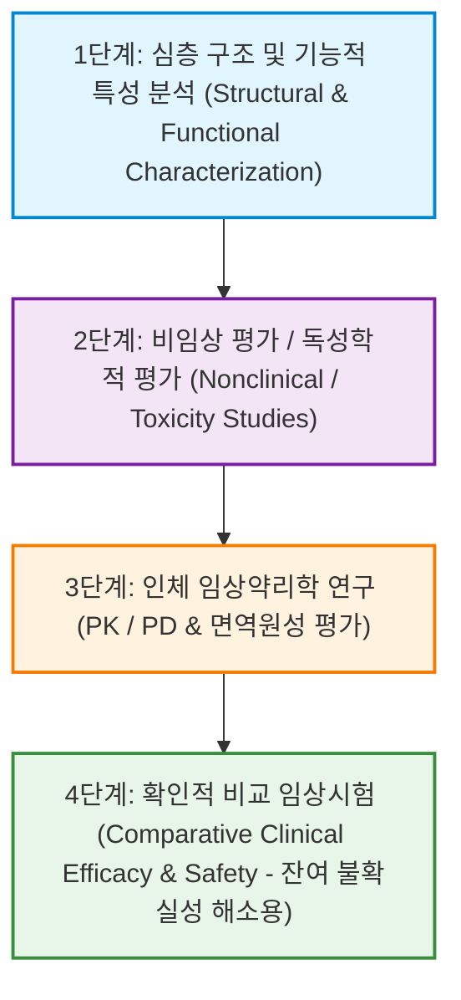
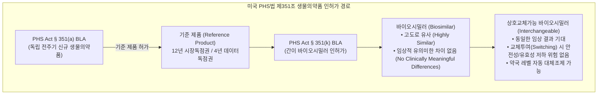
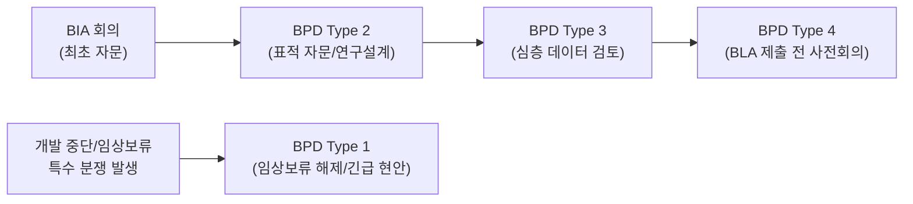
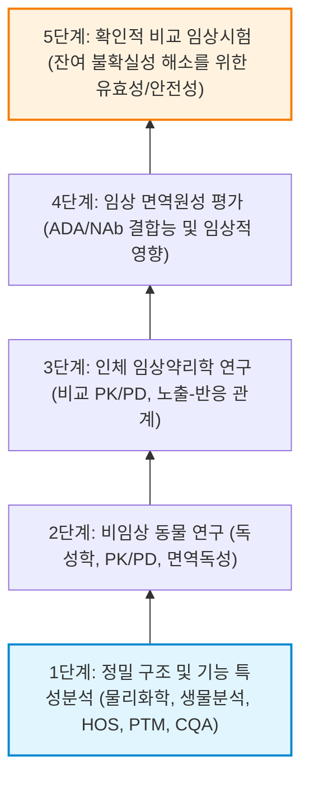
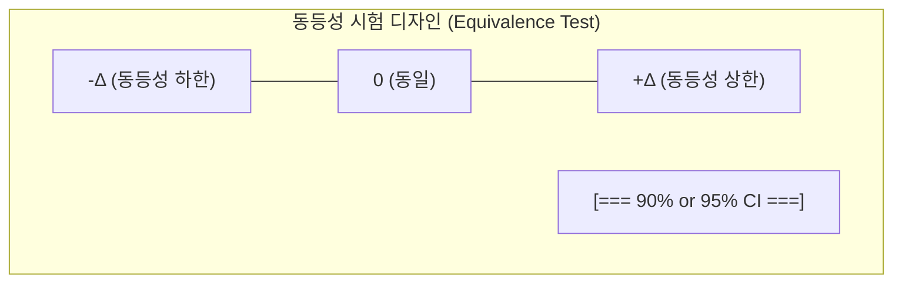
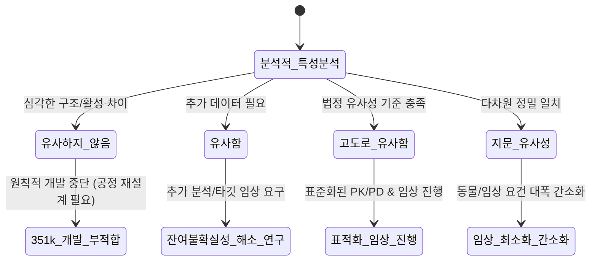
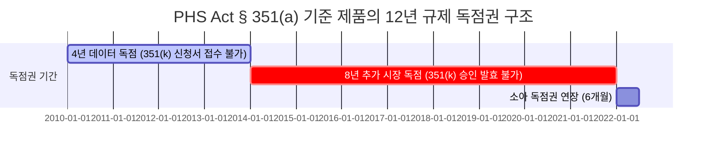
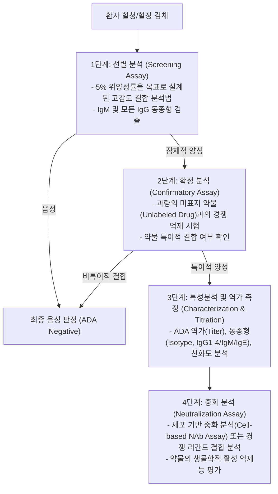

# 서문

> "바이오시밀러 제품에 대한 신뢰를 무너뜨리려는 시도는 심히 우려스러우며, 경제적인 치료 혜택을 누릴 수 있는 환자들에게 부당한 처사입니다."  
> — **마가렛 햄버그(Margaret Hamburg)**, 전 미국 식품의약국(FDA) 국장

---

## 집필 동기

2005년, 필자가 바이오시밀러 의약품에 관한 첫 저서인 『바이오제네릭 치료용 단백질 핸드북(Handbook of Biogeneric Therapeutic Proteins)』을 출간했을 당시, 향후 10년 이내에 미국이 바이오시밀러를 전면적으로 수용할 것이라고 확신에 차 예측한 바 있습니다. 당시 수많은 서평가들은 필자의 판단력을 의심했고, 대부분은 실현 불가능한 헛된 희망일 뿐이라 치부했으며, 일부는 그러한 예측이 현실화될 경우 재앙에 가까운 혼란이 초래될 것이라고 경고했습니다.

그러나 정확히 10년 뒤인 2015년, 미국 FDA는 최초의 바이오시밀러 제품을 공식 승인하였으며, 단클론항체(mAb)의 품목허가 신청을 비롯한 수많은 351(k) 신청서들이 승인을 대기하는 역사적 전환점을 맞이했습니다. 이러한 패러다임의 변화를 기념하고자 필자는 첫 저서를 개정하여 『바이오시밀러 및 상호교체가능 생물의약품: 전략적 요소(Biosimilars and Interchangeable Biologics: Strategic Elements)』와 『바이오시밀러 및 상호교체가능 제품: 전술적 요소(Biosimilars and Interchangeable Biologics: Tactical Elements)』(CRC Press)라는 2권의 시리즈로 최근 출간하였습니다.

필자 스스로도 FDA로부터 바이오시밀러 및 상호교체가능 생물의약품의 허가를 획득하기 위해 진력하면서 절실히 깨달은 바가 있습니다. 세계 최대의 바이오시밀러 시장이 본격적으로 개화하는 현시점에서, **FDA 특유의 규제적 사고방식(regulatory mindset)**에 관한 전문적 통찰을 업계와 공유해야 한다는 점입니다. 이러한 지식을 공개하는 것이 잠재적 경쟁자들의 역량을 강화하는 결과를 낳을 수 있음을 잘 알고 있습니다. 그러나 그것이야말로 필자가 진정으로 바라는 바입니다. 더 많은 기업이 바이오시밀러 시장에 진입하기를 희망합니다. 바이오시밀러 시장은 무한히 방대하며, 건전한 경쟁자가 늘어날수록 고가의 생물의약품 치료비 부담을 경감하려는 인류 공통의 목표에 훨씬 더 빠르게 도달할 수 있기 때문입니다. 세상에는 고통받는 환자들이 너무나 많기에, 지식을 독점하며 이기심을 부릴 여유가 없습니다.

본 저서의 범위는 매우 명확하게 설정되어 있습니다. 즉, **공중보건서비스법(PHS Act) 제351(k)조 경로에 따라 바이오시밀러 제품을 심사 및 승인할 때 미국 FDA가 견지하는 과학적·규제적 판단 기준을 명쾌하게 규명하는 것**입니다.

이 허가의 핵심 열쇠는 **바이오시밀러티(동등생물의약품 특성, Biosimilarity)**의 진정한 의미를 이해하는 데 있습니다. 이 개념은 그동안 규제 과학계와 산업계에서 온전히 이해되지 못했고, 과소평가되었으며, 학술 문헌에서도 잘못 인용되는 경우가 잦았습니다. **FDA가 규정하는 바이오시밀러티의 본질을 정확히 이해시키는 것**이 바로 이 책의 궁극적인 목표입니다. FDA의 규제 철학과 해석은 타 국가 규제기관의 접근법과 상당한 차이를 보일 수 있습니다.

---

## 핵심 용어 정의

FDA는 바이오시밀러티를 다음과 같이 엄격하게 정의합니다:

::: {.callout-note}
### 바이오시밀러티의 법적 정의 (PHS Act §351(i)(2))
1. **고도의 유사성 (Highly Similar)**: 생물의약품이 임상적으로 비활성인 성분(불활성 부형제 등)의 사소한 차이에도 불구하고 대조약(기준 제품, Reference Product)과 고도로 유사해야 함.
2. **임상적 동등성 (No Clinically Meaningful Differences)**: 해당 생물의약품과 대조약 사이에 **안전성(Safety), 순도(Purity), 역가/효능(Potency)** 측면에서 임상적으로 의미 있는 차이가 없어야 함.
:::

이 정의를 완벽히 이해하기 위해서는 다음과 같은 핵심 규제 용어들에 대한 정확한 파악이 선행되어야 합니다.

* **대조약 / 기준 제품 (Reference Product)**  
  PHS Act §351(i)(4)에 따라, PHS Act §351(a)에 의거하여 FDA로부터 정식 품목허가(BLA)를 받은 단일 생물의약품을 의미하며, §351(k) 신청서에 제출된 바이오시밀러 후보 물질의 동등성 평가 기준이 됩니다.
* **대조등재의약품 (Reference Listed Drug, RLD)**  
  연방 식품·의약품·화장품법(FD&C Act) §505(b)(2)에 따라 제출된 바이오의약품 허가 신청 시 대조약으로 참조되는 기승인 등재의약품입니다. (예: 2020년 3월 생물의약품 이전 승인 전까지 의약품(NDA) 경로로 승인·관리되었던 인슐린 및 성장호르몬 제품군).
* **바이오시밀러 / 바이오시밀러티 (Biosimilar / Biosimilarity)**  
  PHS Act §351(i)(2)에 명시된 바와 같이, 임상적으로 비활성인 성분의 미세한 차이에도 불구하고 대조약과 구조적·기능적으로 고도로 유사하며, 안전성·순도·역가(효능) 면에서 임상적으로 의미 있는 차이가 전혀 없는 생물의약품을 뜻합니다.
* **상호교체가능 생물의약품 (Interchangeable Biological Product)**  
  PHS Act §351(k)(4)에 따라, 대조약과의 바이오시밀러티가 입증되었을 뿐만 아니라, 임의의 환자에게 투여 시 대조약과 **동일한 임상적 결과**를 도출할 것으로 기대되는 제품입니다. 추가로 만성 투여 의약품의 경우, 대조약과 상호교체 제품 간의 **교차 투여(Switching/Alternating)** 시 발생할 수 있는 안전성 위험이나 유효성 저하 위험이 대조약만을 지속 투약했을 때보다 크지 않음을 입증해야 합니다.
* **대조약 독점권 (Reference Product Exclusivity)**  
  PHS Act §351(k)(7)에 규정된 규제 보호 기간으로, 대조약의 최초 품목허가일(Date of First Licensure)로부터 개시됩니다. 이 기간 동안 타 개발사는 해당 대조약을 참조하는 351(k) 신청서를 제출할 수 없거나 허가를 득할 수 없습니다.  
  - **제출 유예 기간**: 최초 허가일로부터 **4년** 동안 351(k) 신청서 접수 불가.
  - **승인 효력 발생 유예 기간**: 최초 허가일로부터 **12년**이 경과해야 351(k) 최종 승인 효력 발효.
* **대조약 독점권 만료일 (Reference Product Exclusivity Expiry Date)**  
  최초 허가일로부터 12년이 경과한 시점에, 적용 가능한 경우 소아 독점권(Pediatric Exclusivity, 6개월 추가)을 합산한 날짜입니다. 이 날짜가 도래하고 희귀의약품(Orphan Drug) 시장 독점권 등의 배타적 권리가 만료되어야 351(k) 바이오시밀러의 최종 품목허가가 유효화됩니다.
* **최초 품목허가일 (Date of First Licensure)**  
  FDA가 데이터베이스에 등재된 모든 351(a) 생물의약품의 최초 허가일을 일괄 고시하지 않았더라도, 그것이 독점권 자격 미달을 의미하지는 않습니다. 통상적인 규제 행정 절차나 351(a) 원개발사의 공식 요청에 따라 잔여 독점권 기간과 함께 확정 평가됩니다.

---

### FDA 바이오시밀러 심사 용어의 뉘앙스 이해

FDA는 바이오시밀러티 입증 절차를 정립하면서 기존 신약 개발과는 구별되는 독자적인 평가 용어들을 도입했습니다:

* **"고도로 유사함 (Highly Similar)"**  
  구조적 유사성 평가 단계(비유사 → 유사 → 고도 유사 → 지문 수준의 동등성) 중 허가를 위한 필수적인 기준치입니다.
* **"임상적으로 비활성인 성분의 사소한 차이 (Minor Differences in Clinically Inactive Components)"**  
  완충계(Buffer system)나 부형제, pH의 미세한 차이는 약동학(PK) 프로파일에 미미한 변동을 줄 수 있으나, 안전성과 유효성에 영향을 미치지 않는 한 허용됩니다. FDA가 최초로 승인한 바이오시밀러 역시 대조약과 상이한 완충액 조성을 채택한 바 있습니다.
* **"임상적으로 의미 있는 차이 없음 (No Clinically Meaningful Differences)"**  
  바이오의약품 특성상 제조 로트 간 및 대조약 간의 미세한 구조적 차이는 불가피하게 존재합니다. 핵심은 이러한 차이가 실제 환자의 치료 반응(유효성)이나 이상반응(안전성/면역원성)에 유의미한 영향을 주지 않는다는 점을 증명하는 것입니다.
* **"안전성, 순도, 역가/효능 (Safety, Purity, and Potency)"**  
  FDA는 351(k) 최종 법적 평가 문구에서 신약 승인 시 사용하는 "유효성(Efficacy)" 대신 "안전성(Safety), 순도(Purity), 역가(Potency/Effectiveness)"라는 표현을 엄격히 고수합니다. 안전성은 주로 **면역원성(Immunogenicity)** 및 이상반응과 직결되고, 순도는 물리화학적 **분석적 동등성(Analytical Similarity)**을 뜻하며, 역가는 생물학적 작용기전(MoA)에 부합하는 *in vitro*/*in vivo* 및 임상 약력학 평가를 의미합니다.
* **"임상 1상 및 3상 연구 구분의 지양"**  
  FDA 가이던스는 바이오시밀러 임상 개발을 전통적인 "1상" 또는 "3상"이라는 명칭으로 규정하지 않습니다. 바이오시밀러 임상 연구는 유효성을 독자적으로 입증하는 것이 아니라, 민감한 모델에서 PK/PD 동등성과 안전성·면역원성 동등성을 확인하는 특수한 목적을 띠기 때문입니다.

---

## 오리지네이터 기업의 관점과 바이오시밀러

수십 년 전 치료용 단백질과 단클론항체와 같은 1세대 생물의약품들이 개발되었을 당시, 인슐린, 에포에틴(EPO), 필그라스팀(G-CSF) 등 다수의 제품은 인체 내인성 분자의 구조를 그대로 복제한 것이었습니다. 엄밀한 의미에서 이 1세대 제품들이야말로 인체가 생성하는 고유 단백질에 대한 **최초의 바이오시밀러**였던 셈입니다. 따라서 이들을 무조건적인 '혁신자(Innovator)'라기보다는 **'오리지네이터(원개발사, Originator)'**로 명명하는 것이 과학적으로 타당합니다.

현재 바이오시밀러 산업은 이러한 오리지네이터의 제품을 정밀하게 분석하여 동등한 품질로 재현하는 성숙기에 진입했습니다. 전통적인 오리지네이터 제약사(암젠, 사노피, 화이자, 머크 등)가 바이오시밀러 개발 경쟁에서도 승리할 수 있을지는, 기존 신약 개발 중심의 고비용·장기 연구 사고방식에서 탈피할 수 있는가에 달려 있습니다.

아울러 최근에는 모든 R&D 및 제조 공정을 내부화하는 대신 전략적 아웃소싱과 파트너십을 통해 기민하고 비용 효율적으로 제품을 출시하는 **바이오시밀러 전문 기업(Pure-play Company)**의 역할이 크게 부각되고 있습니다.

---

## 퍼플 북 (Purple Book)

**퍼플 북(Purple Book)**은 미국 공중보건서비스법(PHS Act)에 따라 FDA로부터 정식 허가(BLA)를 획득한 모든 생물의약품(오리지널 대조약, 바이오시밀러, 상호교체가능 생물의약품)의 공식 목록 데이터베이스입니다.

::: {.callout-note}
### 퍼플 북의 핵심 제공 정보
1. **대조약 정보 및 허가일**: PHS Act §351(a)에 의거한 품목허가일자 및 §351(k)(7)에 따른 잔여 시장 독점권 보호 기간.
2. **바이오시밀러 및 상호교체성 판정 현황**: 대조약 하위에 등재된 각 바이오시밀러의 동등성 및 상호교체가능(Interchangeability) 인정 여부.
:::

2010년 3월 제정된 **생물의약품 가격경쟁 및 혁신법(BPCI Act)**에 따라, 의료진의 개입 없이 약국 수준에서 대조약과 자동 대체 조제(Automatic Substitution)가 가능한 제품은 오직 **'상호교체가능(Interchangeable)'** 지위를 획득한 의약품에 한합니다. 단순 바이오시밀러는 의사의 명시적 처방 하에 투여되어야 합니다.

---

## 바이오시밀러 시장 전망 및 특허 만료

2020년대에 이르러 글로벌 생물의약품 시장은 수천억 달러 규모로 팽창하였으며, 주요 블록버스터 생물의약품의 핵심 물질특허 및 제조특허 만료가 연이어 도래하고 있습니다.

### 표 1: 주요 유전자·물질 특허가 만료된 대표적 생물의약품

| 제품명 (Brand Name) | 일반명 (Generic/INN) | 주요 적응증 / 제품 분류 |
| :--- | :--- | :--- |
| **Activase®** | Alteplase | 급성 심근경색, 혈전용해제 (tPA) |
| **Avonex® / Rebif®** | Interferon beta-1a | 다발성 경화증 |
| **BeneFIX®** | Nonacog alfa | 혈우병 B (혈액응고 제IX인자) |
| **Betaseron®** | Interferon beta-1b | 다발성 경화증 |
| **Epogen® / Procrit®** | Epoetin alfa | 빈혈 치료제 (EPO) |
| **Genotropin® / Humatrope® / Nutropin®** | Somatropin | 성장호르몬 결핍증 (hGH) |
| **Gonal-F® / Puregon®** | Follitropin alfa / beta | 난임 치료 (난포자극호르몬) |
| **Humalog®** | Insulin lispro | 속효성 인슐린 아날로그 |
| **Humira®** | Adalimumab | 류마티스 관절염, 항-TNF mAb |
| **Humulin R®** | Human Insulin (rDNA) | 당뇨병 치료용 인간 인슐린 |
| **Lantus®** | Insulin glargine | 지속형 인슐린 아날로그 |
| **Neupogen®** | Filgrastim | 호중구감소증 치료제 (G-CSF) |
| **Neulasta®** | Pegfilgrastim | 지속형 페길화 G-CSF |
| **Proleukin®** | Aldesleukin | 전이성 신세포암 (인터류킨-2) |
| **ReoPro®** | Abciximab | 항혈소판 단클론항체 |
| **Synagis®** | Palivizumab | 소아 RSV 감염 예방 항체 |

### 표 2: 2018년~2024년 특허 만료 및 주요 바이오시밀러 표적 의약품

| 제품명 (Brand Name) | 일반명 (Generic/INN) | 주요 적응증 / 제품 분류 |
| :--- | :--- | :--- |
| **Advate®** | Antihemophilic Factor (Recombinant) | 혈우병 A (혈액응고 제VIII인자) |
| **Aranesp®** | Darbepoetin alfa | 지속형 빈혈 치료제 (초고당화 EPO) |
| **Avastin®** | Bevacizumab | 대장암, 폐암 등 항-VEGF mAb |
| **Benlysta®** | Belimumab | 전신 홍반성 루푸스 (항-BLyS mAb) |
| **Cimzia®** | Certolizumab pegol | 크론병, 류마티스 관절염 (페길화 항-TNF Fab') |
| **Cyramza®** | Ramucirumab | 위암, 비소세포폐암 (항-VEGFR2 mAb) |
| **Entyvio®** | Vedolizumab | 궤양성 대장염, 크론병 (항-α4β7 인테그린) |
| **Erbitux®** | Cetuximab | 대장암, 두경부암 (항-EGFR mAb) |
| **Forteo®** | Teriparatide | 골다공증 치료제 (부갑상선호르몬 단편) |
| **Herceptin®** | Trastuzumab | HER2 양성 유방암·위암 (항-HER2 mAb) |
| **Kadcyla®** | Ado-trastuzumab emtansine | 항체-약물 접합체 (ADC) |
| **Lucentis®** | Ranibizumab | 황반변성 치료제 (항-VEGF Fab) |
| **Orencia®** | Abatacept | 류마티스 관절염 (CTLA-4-Ig 융합단백질) |
| **Prolia® / Xgeva®** | Denosumab | 골다공증, 골전이암 (항-RANKL mAb) |
| **Remicade®** | Infliximab | 자가면역질환 (키메라 항-TNF mAb) |
| **Rituxan®** | Rituximab | 림프종, 류마티스 관절염 (항-CD20 mAb) |
| **Soliris®** | Eculizumab | 발작성 야간 혈색소뇨증 (항-C5 mAb) |
| **Stelara®** | Ustekinumab | 건선, 염증성 장질환 (항-IL-12/23 mAb) |
| **Tysabri®** | Natalizumab | 다발성 경화증 (항-α4 인테그린 mAb) |
| **Xolair®** | Omalizumab | 중증 천식, 만성 두드러기 (항-IgE mAb) |
| **Yervoy®** | Ipilimumab | 흑색종 면역항암제 (항-CTLA-4 mAb) |

생물의약품의 높은 약가(예: 류마티스 관절염 항체 치료제의 경우 연간 1만~3만 달러에 달함)는 각국 보건의료 재정과 환자 본인부담금에 막대한 부담을 안겨주고 있습니다. 미국의 메디케어·메디케이드 서비스 센터(CMS)와 같은 공공 보험기관의 재정 건전성을 확보하기 위해서도 바이오시밀러의 신속한 시장 진입과 처방 확대가 절실합니다.

---

## 바이오시밀러에 대한 일반적인 오해와 진실

바이오시밀러 도입 초기에는 오리지네이터 기업들의 방어 전략과 인식 부족으로 인해 많은 규제적·임상적 오해가 만연했습니다.

1. **"바이오시밀러는 오리지널과 100% 동일하지 않으므로 품질이 열등하다?"**  
   → **진실**: 생물의약품은 분자량이 크고 복잡하여 오리지널 의약품 자체도 제조 로트(Batch) 간 미세한 이질성(Microheterogeneity)을 항상 동반합니다. 바이오시밀러는 최첨단 직교 분석 기법을 통해 대조약의 품질 변동 범위(Quality Target Product Profile) 내에 완벽히 부합하도록 설계·생산됩니다.
2. **"바이오시밀러는 면역원성 등 안전성 문제가 더 클 것이다?"**  
   → **진실**: 생물의약품의 안전성과 면역원성은 단백질의 1차 서열, 당화 프로파일, 응집체(Aggregate) 형성 제어에 의해 결정됩니다. 지난 10년 이상의 글로벌 사용 데이터를 통해 바이오시밀러의 안전성 프로파일은 대조약과 완전히 동등함이 입증되었습니다.
3. **"임상 3상 유효성 시험을 대규모로 거치지 않으면 안전성과 효능을 확신할 수 없다?"**  
   → **진실**: 바이오시밀러 심사의 핵심은 임상적 효능 평가가 아닌 **구조적·기능적 특성 규명(Analytical Characterization)**과 **민감한 집단에서의 PK/PD 동등성 확립**에 있습니다. 분석 기술의 발전으로 물리화학적·생물학적 분석이 미세한 차이를 감지하는 데 있어 임상시험보다 수십 배 더 민감합니다.
4. **"적응증 외삽(Extrapolation)은 비과학적이다?"**  
   → **진실**: 바이오시밀러가 대조약과 동일한 작용기전(MoA) 및 표적 수용체 결합능을 입증했다면, 과학적 타당성에 근거하여 대조약이 보유한 타 적응증으로의 외삽 승인이 보장됩니다.

---

## 이 책의 구성과 목표

본 저서 『바이오시밀러티: FDA의 관점(Biosimilarity: The FDA Perspective)』은 규제 심사의 절대적 기준인 **'바이오시밀러티(동등생물의약품 특성)'**의 과학적 규명과 규제 전략에 집중합니다. 불필요하고 값비싼 시행착오를 줄이고, FDA 심사 승인을 신속하게 획득할 수 있도록 전체 10개 장에 걸쳐 단계별 가이드를 제공합니다:

1. **서문 (Preface)**: 글로벌 바이오시밀러 환경, 시장 동향 및 규제 개념 소개.
2. **제1장: 단백질의 이해 (Understanding Proteins)**: 단백질 화학, 고차 구조(HOS), 응집 기전 및 번역 후 수정(PTM)의 분석적 기초.
3. **제2장: 바이오시밀러의 지형 (The Biosimilars Landscape)**: 글로벌 규제 프레임워크와 각국 승인 기준 비교.
4. **제3장: FDA 규제 가이던스 (FDA Regulatory Guidance)**: FDA 회의(BPD Type 1~4), 351(k) 제출 요건 및 독점권 전략.
5. **제4장: 바이오시밀러티의 이해 (Understanding Biosimilarity)**: 증거의 총체(Totality of Evidence) 원칙에 입각한 단계적 개발 접근법.
6. **제5장: 생물의약품 도구 (Biopharmaceutical Tools)**: 구조적·기능적 특성 분석을 위한 최신 물리화학적 직교 분석 기술.
7. **제6장: 중요 품질특성 (Critical Quality Attributes, CQAs)**: 위험 평가(Risk Ranking) 기반의 CQA 도출 및 품질 관리 전략.
8. **제7장: 안전성 유사성 (Safety Similarity)**: 면역원성 평가 프로토콜, 항-약물 항체(ADA) 분석 및 임상 안전성 동등성.
9. **제8장: 제형 유사성 (Formulation Similarity)**: 제형 특허 회피, 안정성 최적화 및 부형제 변경에 따른 규제 대응.
10. **제9장: 분석적 유사성의 통계적 접근 (Statistical Approach to Analytical Similarity)**: FDA의 계층적 통계 검정(Tier 1 Equivalence Test, Tier 2 Quality Ranges, Tier 3 Graphical Comparison).
11. **제10장: 바이오시밀러티: 마지막 개척지 (Biosimilarity: The Last Frontier)**: 향후 바이오시밀러 규제 과학의 미래와 궁극적 제언.

독자 여러분이 이 책을 통해 FDA 심사관의 시각에서 개발 프로그램을 최적화하고 글로벌 바이오시밀러 경쟁력을 확보하시기를 기원합니다.

# 제1장 단백질의 이해

> "어떤 바보든 알 수는 있다. 중요한 것은 이해하는 것이다."  
> — **알베르트 아인슈타인(Albert Einstein)**

---

## 1.1 배경

생물의약품(Biopharmaceuticals, Biologics)은 화학적으로 합성되는 저분자 의약품(Small Molecule Drugs)과 비교할 때 분자량이 압도적으로 크고, 3차원 입체 구조가 역동적으로 변화하며 본질적인 이질성(Heterogeneity)을 지니는 단백질 및 항체 기반 분자입니다. 정형화된 단일 분자 구조를 갖는 합성 의약품과 달리, 바이오의약품은 생산 세포주와 배양·정제 공정에 따라 다양한 분자 변이체(Isoforms)가 혼재합니다. 대표적인 생물의약품 범주로는 사이토카인, 단클론항체, 호르몬 등이 있습니다.

### 주요 생물의약품 분류

* **사이토카인 (Cytokines)**  
  사이토카인은 세포 간 신호전달을 매개하는 저분자 단백질 군(약 5~20 kDa)으로, 분비된 후 주변 세포의 수용체에 결합하여 분화, 증식, 면역 반응을 조절합니다. 자가분비(Autocrine), 측분비(Paracrine), 내분비(Endocrine) 신호전달에 모두 관여하며, 케모카인(Chemokines), 인터페론(Interferons), 인터류킨(Interleukins), 림포카인(Lymphokines), 종양괴사인자(TNF) 등을 포함합니다. 면역세포(대식세포, B세포, T세포, 비만세포)뿐만 아니라 내피세포 및 섬유아세포에서도 분비되며 체액성·세포성 면역 균형을 통제합니다.
* **단클론항체 (Monoclonal Antibodies, mAbs)**  
  단클론항체(면역글로불린, Ig)는 형질세포에서 유래된 약 150 kDa 크기의 Y자형 당단백질입니다. 2개의 중쇄(Heavy chain)와 2개의 경쇄(Light chain)가 이황화 결합으로 연결되어 있습니다. 항체의 가변영역(Fv) 끝단에 위치한 초가변영역(Hypervariable region, CDR)이 항원의 특정 에피토프(Epitope)를 정밀하게 인식하는 파라토프(Paratope)를 형성합니다. 반면 Y자 구조의 줄기에 해당하는 불변영역(Fc)은 보체 결합이나 Fc 수용체(FcγR, FcRn)와의 상호작용을 매개하여 이펙터 기능(ADCC, CDC, 반감기 연장)을 수행하며, 보존된 N-당화 부위(Asn-297)를 지닙니다.
* **호르몬 (Hormones)**  
  내분비샘에서 극미량 분비되어 혈류를 통해 표적 장기의 생리 작용을 조절하는 신호 펩타이드/단백질입니다. 인슐린, 성장호르몬(hGH), 부갑상선호르몬(PTH) 등이 대표적입니다. 전전구호르몬(Preprohormone) 형태로 합성된 후, 소포체(ER)에서 신호 서열(Signal peptide)이 절단되고 골지체에서 번역 후 수정을 거쳐 전구호르몬(Prohormone)이 된 뒤, 분비소포 내 단백질분해효소에 의해 성숙 활성 호르몬으로 전환되어 혈류로 방출됩니다.

---

### 바이오의약품의 복잡성 스펙트럼과 분석적 확신도

모든 생물의약품의 개발 난이도가 동일한 것은 아닙니다. 분자 구조의 복잡성과 크기에 따라 분석적 특성 규명의 정확도(Analytical Certainty)와 생산 공정 의존도(Process Dependence)가 크게 달라집니다.

```
[ 낮은 분자 복잡성 / 높은 분석적 확신도 ]
  │
  ├─ 1단계: 소분자 의약품 (Small Molecules, < 1 kDa)
  ├─ 2단계: 합성 펩타이드 (Synthetic Peptides)
  ├─ 3단계: 재조합 인슐린 및 호르몬 (Insulin, hGH, ~6 kDa)
  ├─ 4단계: 저분자량 헤파린 (LMWH, 복합 다당류)
  ├─ 5단계: 사이토카인 및 성장인자 (Filgrastim, EPO, ~18-30 kDa)
  ├─ 6단계: 단클론항체 및 Fc 융합단백질 (mAbs, Fusion Proteins, ~150 kDa)
  ├─ 7단계: 복합 당단백질 효소 및 혈액응고인자 (Factor VIII/IX, > 300 kDa)
  ├─ 8단계: 바이러스 벡터 및 백신 (Viral Vectors, Vaccines)
  └─ 9단계: 세포 및 유전자 치료제 (Cell & Gene Therapy, Living Cells)
  │
[ 높은 분자 복잡성 / 공정 특이적 의존성 지배 ]
```

미국 FDA는 바이오시밀러 승인 심사 시 **증거의 총체(Totality of the Evidence)** 접근법을 적용합니다. 이 평가의 가장 기초적인 초석은 바로 **단백질의 분자 구조와 고차 구조(HOS)에 대한 완전하고 정밀한 이해**입니다.

---

### 1.1.1 바이오시밀러 개발의 패러다임

신약(Originator) 개발이 미지의 황야를 질주하여 결승선에 도달하는 모험이라면, 바이오시밀러 개발은 울타리가 없는 좁은 트랙 위를 오리지널 약물과 완전히 동일한 궤적으로 달려야 하는 고도의 정밀 과학입니다.

치료용 단백질은 분자 기능에 따라 다음과 같이 분류할 수 있습니다:

1. **내인성 단백질 결핍 보충 및 대체**: 인슐린, 성장호르몬, 혈액응고인자, 효소 대체 요법.
2. **기존 생리적 신호 경로 증강**: 인터페론(항바이러스), 필그라스팀(G-CSF, 백혈구 생성 촉진), 에포에틴(EPO, 적혈구 생성 촉진).
3. **새로운 기능 및 면역 조절 제공**: 재조합 백신, 면역글로불린 요법.
4. **특정 병원체 또는 질환 표적 분자 간섭/차단**: 항-TNF 항체(Adalimumab, Infliximab), 항-VEGF 항체(Bevacizumab), 항-HER2 항체(Trastuzumab).
5. **독소·약물 및 방사성 동위원소 전달체**: 항체-약물 접합체(ADC, Kadcyla®).

---

## 1.2 단백질 구조 (Protein Structure)

### 1.2.1 구성 요소: 20종의 표준 아미노산

단백질은 20종의 표준 L-아미노산 잔기(Residues)가 펩타이드 결합으로 연결된 선형 고분자입니다. $n$개의 아미노산 잔기로 이루어진 단백질은 이론적으로 $20^n$개의 서열 조합을 가질 수 있습니다.

| 아미노산 한글명 (영문명) | 3문자 | 1문자 | 분자식 | 분자량 (Da) | 잔기 화학식 ($-H_2O$) | 잔기 MW | pH 7.0 전하 | 측쇄 특성 (Polarity / Charge) |
| :--- | :---: | :---: | :--- | :---: | :--- | :---: | :---: | :--- |
| **알라닌 (Alanine)** | Ala | A | $\text{C}_3\text{H}_7\text{NO}_2$ | 89.09 | $\text{C}_3\text{H}_5\text{NO}$ | 71.08 | 0 (중성) | 비극성 지방족 (Non-polar, aliphatic) |
| **아르지닌 (Arginine)** | Arg | R | $\text{C}_6\text{H}_{14}\text{N}_4\text{O}_2$ | 174.20 | $\text{C}_6\text{H}_{12}\text{N}_4\text{O}$ | 156.19 | +1 (염기성) | 양전하성 구아니디늄 (Basic, positively charged) |
| **아스파라긴 (Asparagine)** | Asn | N | $\text{C}_4\text{H}_8\text{N}_2\text{O}_3$ | 132.12 | $\text{C}_4\text{H}_6\text{N}_2\text{O}_2$ | 114.10 | 0 (중성) | 극성 비전하 아미드 (N-당화 부위) |
| **아스파르트산 (Aspartic acid)** | Asp | D | $\text{C}_4\text{H}_7\text{NO}_4$ | 133.10 | $\text{C}_4\text{H}_5\text{NO}_3$ | 115.09 | -1 (산성) | 음전하성 카복실 (Acidic, negatively charged) |
| **시스테인 (Cysteine)** | Cys | C | $\text{C}_3\text{H}_7\text{NO}_2\text{S}$ | 121.16 | $\text{C}_3\text{H}_5\text{NOS}$ | 103.14 | 0 (중성) | 극성 티올기 (-SH, 이황화 결합 형성) |
| **글루탐산 (Glutamic acid)** | Glu | E | $\text{C}_5\text{H}_9\text{NO}_4$ | 147.13 | $\text{C}_5\text{H}_7\text{NO}_3$ | 129.11 | -1 (산성) | 음전하성 카복실 (Acidic, negatively charged) |
| **글루타민 (Glutamine)** | Gln | Q | $\text{C}_5\text{H}_{10}\text{N}_2\text{O}_3$ | 146.15 | $\text{C}_5\text{H}_8\text{N}_2\text{O}_2$ | 128.13 | 0 (중성) | 극성 비전하 아미드 |
| **글라이신 (Glycine)** | Gly | G | $\text{C}_2\text{H}_5\text{NO}_2$ | 75.07 | $\text{C}_2\text{H}_3\text{NO}$ | 57.05 | 0 (중성) | 비극성 최소 구조 (비카이랄성, 유연성 제공) |
| **히스티딘 (Histidine)** | His | H | $\text{C}_6\text{H}_9\text{N}_3\text{O}_2$ | 155.15 | $\text{C}_6\text{H}_7\text{N}_3\text{O}$ | 137.14 | 0 ~ +1 | 이미다졸 고리 (완충 작용, pKa ~6.0) |
| **아이소류신 (Isoleucine)** | Ile | I | $\text{C}_6\text{H}_{13}\text{NO}_2$ | 131.17 | $\text{C}_6\text{H}_{11}\text{NO}$ | 113.16 | 0 (중성) | 비극성 소수성 분지쇄 (Hydrophobic) |
| **류신 (Leucine)** | Leu | L | $\text{C}_6\text{H}_{13}\text{NO}_2$ | 131.17 | $\text{C}_6\text{H}_{11}\text{NO}$ | 113.16 | 0 (중성) | 비극성 소수성 분지쇄 (Hydrophobic) |
| **라이신 (Lysine)** | Lys | K | $\text{C}_6\text{H}_{14}\text{N}_2\text{O}_2$ | 146.19 | $\text{C}_6\text{H}_{12}\text{N}_2\text{O}$ | 128.17 | +1 (염기성) | 양전하성 1차 아민 (Basic) |
| **메티오닌 (Methionine)** | Met | M | $\text{C}_5\text{H}_{11}\text{NO}_2\text{S}$ | 149.21 | $\text{C}_5\text{H}_9\text{NOS}$ | 131.20 | 0 (중성) | 비극성 티오에터 (개시 아미노산, 산화 민감) |
| **페닐알라닌 (Phenylalanine)** | Phe | F | $\text{C}_9\text{H}_{11}\text{NO}_2$ | 165.19 | $\text{C}_9\text{H}_9\text{NO}$ | 147.18 | 0 (중성) | 소수성 방향족 벤젠 고리 (Aromatic) |
| **프롤린 (Proline)** | Pro | P | $\text{C}_5\text{H}_9\text{NO}_2$ | 115.13 | $\text{C}_5\text{H}_7\text{NO}$ | 97.12 | 0 (중성) | 고리형 이미노산 (폴리펩타이드 꺾임 유발) |
| **세린 (Serine)** | Ser | S | $\text{C}_3\text{H}_7\text{NO}_3$ | 105.09 | $\text{C}_3\text{H}_5\text{NO}_2$ | 87.08 | 0 (중성) | 극성 하이드록실기 (-OH, O-당화/인산화 부위) |
| **트레오닌 (Threonine)** | Thr | T | $\text{C}_4\text{H}_9\text{NO}_3$ | 119.12 | $\text{C}_4\text{H}_7\text{NO}_2$ | 101.10 | 0 (중성) | 극성 하이드록실기 (-OH, O-당화/인산화 부위) |
| **트립토판 (Tryptophan)** | Trp | W | $\text{C}_{11}\text{H}_{12}\text{N}_2\text{O}_2$ | 204.23 | $\text{C}_{11}\text{H}_{10}\text{N}_2\text{O}$ | 186.21 | 0 (중성) | 소수성 방향족 인돌 고리 (형광 분석 지표) |
| **티로신 (Tyrosine)** | Tyr | Y | $\text{C}_9\text{H}_{11}\text{NO}_3$ | 181.19 | $\text{C}_9\text{H}_9\text{NO}_2$ | 163.18 | 0 (중성) | 방향족 페놀 고리 (UV 280nm 흡광 지표) |
| **발린 (Valine)** | Val | V | $\text{C}_5\text{H}_{11}\text{NO}_2$ | 117.15 | $\text{C}_5\text{H}_9\text{NO}$ | 99.13 | 0 (중성) | 비극성 소수성 분지쇄 (Hydrophobic) |

---

### 1.2.2 단백질 번역 (Translation)

리보솜에서 단백질이 합성될 때 번역은 항상 **N-말단(Amino-terminus)에서 C-말단(Carboxyl-terminus) 방향**으로 일어납니다. 
1. 개시 코돈(AUG)은 메티오닌(진핵세포) 또는 N-포르밀메티오닌(fMet, 원핵세포)을 지정합니다.
2. 신장(Elongation) 과정에서 하전된 aminoacyl-tRNA가 리보솜 A 자리에 결합하고, 펩티딜 전이효소 반응을 통해 펩타이드 결합이 형성됩니다.
3. 분비형 단백질의 경우 N-말단 신호 펩타이드(Signal peptide)가 소포체(ER) 내강에서 신호 펩티다아제(Signal peptidase)에 의해 절단되어 최종 성숙형 단백질의 N-말단 서열이 확정됩니다.

---

### 1.2.3 펩타이드 결합과 고차 구조 (Higher Order Structure)

펩타이드 결합($-\text{CO}-\text{NH}-$)은 카르보닐 산소와 아미드 질소 원자 사이의 전자 비편재화로 인해 **약 40%의 부분 이중결합 성격**을 지닙니다. 이로 인해 펩타이드 결합 단위는 견고한 평면(Planar) 구조를 유지하며, 결합 주위의 회전 각도는 $\omega \approx 180^\circ$ (trans 배향)로 제한됩니다.

단백질 주쇄(Backbone)의 입체 구조는 각 아미노산 잔기의 두 결합 각도에 의해 결정됩니다:
* $\phi$ (Phi): $\text{C}_\alpha - \text{N}$ 단일 결합 주위의 회전각
* $\psi$ (Psi): $\text{C}_\alpha - \text{C}(=\text{O})$ 단일 결합 주위의 회전각

::: {.callout-note}
### 라마찬드란 플롯 (Ramachandran Plot)과 입체 허용 영역
입체 장애(Steric hindrance)로 인해 단백질 주쇄가 취할 수 있는 $(\phi, \psi)$ 각도 조합은 극히 제한됩니다. 라마찬드란 플롯에서 정의되는 주요 에너지 안정 영역은 다음과 같습니다:
- **우권 $\alpha$-헬릭스 ($\alpha$-Helix)**: $\phi \approx -60^\circ, \psi \approx -45^\circ$
- **역평행/평행 $\beta$-시트 ($\beta$-Sheet)**: $\phi \approx -120^\circ \sim -140^\circ, \psi \approx +135^\circ \sim +160^\circ$
- **콜라겐 헬릭스 / 턴 구조**: 특정 좌권 및 루프 영역
:::

#### 단백질의 4단계 구조 계층
1. **1차 구조 (Primary Structure)**: 공유 펩타이드 결합으로 연결된 선형 아미노산 서열.
2. **2차 구조 (Secondary Structure)**: 주쇄 아미드기와 카르보닐기 간의 수소결합으로 형성되는 규칙적 국소 구조 ($\alpha$-헬릭스, $\beta$-시트, $\beta$-턴).
3. **3차 구조 (Tertiary Structure)**: 소수성 상호작용, 이온결합, 수소결합, 이황화 결합에 의해 폴리펩타이드 사슬 전체가 접혀 형성되는 3차원 입체 형태.
4. **4차 구조 (Quaternary Structure)**: 2개 이상의 독립된 폴리펩타이드 소단위체(Subunits)가 비공유결합 또는 이황화 결합으로 회합된 다량체 복합체 (예: 4개의 소단위체로 구성된 헤모글로빈, 2개 중쇄와 2개 경쇄로 구성된 IgG 항체).

---

## 1.3 단백질 도메인과 구조적 모티프

단백질 **도메인(Domain)**은 단백질 분자 내에서 독자적으로 안정된 3차원 구조로 접힐 수 있고, 고유한 기능을 수행할 수 있는 독립적인 구조 단위입니다. 통상 25개에서 500개(평균 약 100~200개) 아미노산 잔기로 구성됩니다.

* **도메인의 독립성**: 도메인은 유전공학 기술을 통해 단독으로 클로닝·발현되거나 타 단백질에 결합되어 키메라 융합단백질(Chimeric Fusion Protein)을 형성할 수 있습니다.
* **구조적 분류 (CATH / SCOP 기준)**:
  - **All-$\alpha$ 도메인**: 주로 $\alpha$-헬릭스 다발(Helix bundle)로 코어가 구성된 도메인.
  - **All-$\beta$ 도메인**: 역평행 $\beta$-시트(예: 면역글로불린 접힘 Ig fold, 그리스 열쇠 모티프)로 구성된 도메인.
  - **$\alpha/\beta$ 도메인**: 평행 $\beta$-시트 주변을 $\alpha$-헬릭스가 둘러싸는 $\beta$-$\alpha$-$\beta$ 모티프의 도메인 (예: TIM barrel).
  - **$\alpha+\beta$ 도메인**: $\alpha$-헬릭스와 $\beta$-시트 영역이 서로 분리되어 공존하는 도메인.

---

## 1.4 단백질 접힘, 결합 및 응집 (Folding and Aggregation)

단백질 고차 구조(HOS)는 수많은 약한 비공유결합(소수성 상호작용, 정전기적 이온결합, 수소결합, 판데르발스 힘)과 공유결합(이황화 결합)의 총합으로 유지됩니다. 폴리펩타이드 사슬이 무작위 코일에서 정밀한 HOS로 접힐 때 발생하는 급격한 형태 엔트로피 감소($-\Delta S$)는 비공유결합 형성에 따른 음의 엔탈피($-\Delta H$) 방출에 의해 보상됩니다.

```
단백질 접힘 자유에너지: ΔG = ΔH - TΔS < 0
```

### 단백질 응집 (Protein Aggregation)의 기전

단백질 응집은 바이오의약품의 안정성 저하 및 면역원성 유발의 가장 주된 원인입니다:
1. **콜로이드 안정성 (Colloidal Stability)**: 용액 내 단백질 분자 간 정전기적 반발력과 인력의 균형. 순 전하가 낮거나(pI 부근) 염 농도가 높을 때 인력이 우세해져 가역적/비가역적 응집 발생.
2. **입체 구조 안정성 (Conformational Stability)**: 열, 기계적 전단력(Shear stress), 동결-해동, 계면 접촉 등에 의해 단백질 천연 구조가 부분적으로 풀리면서(Unfolding), 내부에 매몰되어 있던 소수성 아미노산 잔기 패치가 외부에 노출되어 자가 회합(Self-association) 진행.

::: {.callout-important}
### 고농도 제형(High-Concentration Formulation)과 분자 군집화(Molecular Crowding)
최근 휴미라(Adalimumab)나 리툭산(Rituximab) 등 피하주사(SC) 제형 개발을 위해 100 mg/mL 이상의 초고농도 단백질 제형이 널리 채택되고 있습니다. 그러나 고농도 상태에서는 용액 내 분자 간 거리가 극도로 좁아져 **분자 군집화(Molecular Crowding)** 현상이 발생하며, 이는 점도 급증, 자가 응집 및 국소 주사 부위에서의 면역원성 위험을 크게 증가시킵니다. 바이오시밀러 개발사는 대조약과의 제형 차이를 평가할 때 이러한 물리화학적 응집 거동을 직교 분석으로 규명해야 합니다.
:::

---

## 1.5 번역 후 수정 (Post-Translational Modifications, PTM)

재조합 숙주 세포에서 발현된 단백질은 폴리펩타이드 사슬 합성 후 세포 내 효소 및 화학 환경에 의해 다양한 화학적 변형을 겪습니다. 이로 인해 최종 생물의약품은 단일 분자가 아니라 무수한 변이체들이 공존하는 **이질적 아이소폼 혼합물(Mixture of Isoforms)**로 존재하게 됩니다.

### 주요 번역 후 수정(PTM)의 화학적 분류

| 분류 | PTM 유형 | 주요 표적 잔기 및 작용기 | 생물학적 / 임상적 영향 |
| :--- | :--- | :--- | :--- |
| **지질화 (Lipidation)** | 미리스토일화, 팔미토일화, 프레닐화 | Gly (N-말단), Cys | 세포막 결합 및 신호전달 복합체 위치화 |
| **인산화 (Phosphorylation)** | O-인산화 / N-인산화 | Ser, Thr, Tyr / His | 단백질 활성 on/off 스위치, 신호전달 매개 |
| **아세틸화 (Acetylation)** | N-말단 아세틸화, 라이신 아세틸화 | N-말단 아민, Lys | 단백질 안정성 제어, 전하 변이 유발 |
| **유비퀴틴화 계열** | 유비퀴틴화, SUMO화, ISG화 | Lys 잔기 | 프로테아좀 분해 신호, 세포 내 국소화 |
| **산화 (Oxidation)** | 메티오닌/트립토판 산화 | Met (설폭사이드화), Trp | 결합력 감소, 소수성 변화, 응집 촉진 |
| **탈아미드화 (Deamidation)** | Asn $\to$ Asp / isoAsp 전환 | Asn-Gly, Asn-Ser 서열 | 산성 변이체(Acidic variants) 생성, 역가 저하 |
| **피로글루타메이트화** | N-말단 Gln/Glu 고리화 | N-말단 Gln, Glu | N-말단 블로킹, 전하 이질성 유발 |
| **C-말단 라이신 절단** | C-terminal Lysine Clipping | 중쇄 C-말단 Lys | 카복시펩티다아제에 의한 절단, 염기성 변이체 |
| **이황화 결합 형성** | Intra/Inter-chain Disulfide | Cys-Cys 페어링 | 천연 3차 구조 유지 (오쌍 형성 시 불활성화) |

---

### 1.5.1 당화 (Glycosylation)

당화는 생물의약품에서 가장 복잡하고 중요한 중요 품질특성(CQA)입니다. 단백질의 3차원 접힘, 용해도, 혈중 반감기, 면역원성 및 생물학적 역가(ADCC, CDC)를 직접 결정합니다.

```
단백질 당화의 4가지 주요 유형:
1. N-연결 당화 (N-linked Glycosylation): Asn-X-Ser/Thr (X ≠ Pro) 보존 서열의 Asn에 결합 (소포체 및 골지체)
2. O-연결 당화 (O-linked Glycosylation): Ser 또는 Thr의 하이드록실기에 결합 (골지체)
3. C-만노실화 (C-mannosylation): Trp-X-X-Trp 모티프의 Trp C2 탄소에 만노스 결합
4. GPI-앵커 형성 (Glypiation): C-말단에 글리코실포스파티딜이노시톨 지질 결합
```

::: {.callout-note}
### 시알산(Sialic Acid)의 종 특이성과 면역원성
* **N-아세틸뉴라민산 (Neu5Ac / NANA)**: 인간 세포에서 생성되는 천연 시알산 형태로, 혈중 청소율(Clearance)을 지연시키고 반감기를 늘려줍니다.
* **N-글리콜릴뉴라민산 (Neu5Gc / NGNA)**: 마우스 골수종 세포주(NS0, Sp2/0) 등 비인간 포유류 세포에서 합성되는 시알산입니다. 인간은 *CMAH* 유전자 결손으로 Neu5Gc를 합성하지 못하므로, Neu5Gc가 포함된 단백질 투여 시 항-Neu5Gc 항체 형성 및 면역원성 반응이 촉발될 수 있습니다. (CHO 세포주는 주로 Neu5Ac를 부착함).
* **코어 푸코스(Core Fucosylation)**: IgG1 Fc Asn-297의 복합형 글리칸에서 코어 푸코스가 결핍(Afucosylation)될 경우, 자연살해(NK) 세포의 FcγRIIIa 결합력이 최대 50배 이상 급증하여 항체의존성 세포독성(ADCC) 활성이 획기적으로 향상됩니다.
:::

---

## 1.6 단백질 발현 시스템 및 생산 변이 (Expression Systems)

재조합 단백질 의약품을 생산할 때 숙주 세포주(Host Expression System)의 선택은 단백질의 1차 아미노산 서열뿐만 아니라 번역 후 수정(PTM) 패턴을 근본적으로 좌우합니다.

### 숙주 발현 시스템별 특성 비교

| 발현 시스템 | 주요 사용 숙주 | 장점 | 한계 및 PTM 특성 |
| :--- | :--- | :--- | :--- |
| **원핵생물 (Prokaryotes)** | *Escherichia coli* (대장균) | 고수율, 급속 배양, 단순 배지, 저비용 | 복잡한 고차 구조 접힘 불가, 봉입체(Inclusion body) 형성, **당화(Glycosylation) 불가** |
| **하등 진핵생물 (Yeast / Fungi)** | *Pichia pastoris*, *Saccharomyces cerevisiae* | 높은 분비 수율, 단독 배양 용이 | **고만노스형(High-mannose) N-당화**로 인한 인간 투여 시 높은 면역원성 및 빠른 소실 |
| **곤충 세포 (Insect Cells)** | *Spodoptera frugiperda* (Sf9, Sf21) / Baculovirus | 고분자 단백질 발현, 바이러스 입자 생산 | 단순형 당화(Paucimannose), 포유류와 상이한 당사슬 구조 |
| **포유류 세포 (Mammalian Cells)** | **CHO (중국햄스터 난소세포)**, NS0, Sp2/0, HEK293 | **인간과 가장 유사한 복합 당화, 정확한 단백질 접힘, 높은 생물학적 활성** | 배양 비용 고가, 느린 증식 속도, 바이러스 오염 위험 관리 필요 |

바이오시밀러 개발자는 대조약의 생산 세포주와 배양·정제 파라미터를 역공학적으로 분석하여, 규제기관(FDA)이 요구하는 **지문 수준의 동등성(Fingerprint-like Similarity)**을 입증할 수 있는 공정 설계 및 품질 관리 시스템(QbD)을 완벽히 구축해야 합니다.

# 제2장 바이오시밀러의 지형

> *"멸종의 풍경 속에서, 정확성은 신앙 바로 다음가는 미덕이다."*  
> — 새뮤얼 베켓 (Samuel Beckett)

---

## 2.1 배경

생물의약품(Biologics)은 현대 의약품 산업에서 가장 역동적으로 성장하는 분야로, 향후 20년 이내에 전체 신약 매출의 3분의 2 이상을 차지할 것으로 전망된다. 생물의약품이 적용되는 질환군은 암, 당뇨병, 빈혈, 류마티스 관절염, 다발성 경화증 등 희귀난치성 질환부터 만성 만연 질환에 이르기까지 광범위하다. 이들 제품군은 독보적인 임상적 유용성과 천문학적인 상업적 가치를 지니고 있으며, 오리지널 생물의약품의 경제적인 대안으로서 **바이오시밀러(Biosimilars)**가 인류 보건에 기여하는 공헌은 실로 지대하다.

### 미국 생물의약품 규제의 역사적 변천

1902년 미국 의회는 **생물학적 제제 관리법(Biologics Control Act)**을 통과시켰다. 이 법은 "인간 질병의 예방 및 치료에 적용되는 바이러스, 치료용 혈청, 독소, 항독소 또는 이와 유사한 제제(analogous products)"에 적용되었으며, 해당 제품을 제조하는 시설에 대한 허가(Licensure) 취득을 의무화했다. 이후 100여 년에 걸쳐 의회는 규제 대상을 백신, 혈액 및 혈액제제, 알레르겐 제품, 단백질(화학적으로 합성된 폴리펩타이드 제외) 및 그 유사체 등으로 점차 확대하였다.

그러나 의회는 법률에 열거된 용어들, 특히 '유사한(analogous)'이라는 개념을 명확히 정의하지 않아 생물학적 제제의 규제 범위에 지속적인 모호성이 존재했다. 여기에 중복되는 '의약품(Drug)'의 법적 정의가 규제적 복잡성을 가중시켰다. 

- **1906년 순수식품·의약품법(Pure Food and Drugs Act)** 및 **1938년 연방식품·의약품·화장품법(FDCA)**: '의약품(Drug)'을 질병의 진단, 치료, 완화, 처치, 예방에 사용되는 물질 등으로 광범위하게 정의하고, 시판 전 신약허가신청서(NDA, New Drug Application) 제출을 의무화했다.
- **1944년 공중보건서비스법(PHSA, Public Health Service Act)** 개정: 생물의약품에 대해서는 NDA 요건이 적용되지 않음을 명확히 하였으나, 생물학적 제제의 정확한 경계 기준은 여전히 제시하지 못했다.

이러한 입법 공백을 메우기 위해 규제 당국은 시행령을 통해 세부 정의를 확립하고자 했다. 1947년 제정된 규정에 따르면 '독소 또는 항독소 유사 제제'는 '특이적 면역(specific immunization)'을 통해 질병을 예방·치료·완화하는 물질로 정의되었으며, 호르몬류는 '치료용 혈청 유사 제제'의 정의에서 제외되었다. 이에 따라 인슐린(Insulin)이나 인성장호르몬(hGH) 같은 단백질성 호르몬은 PHSA가 아닌 FDCA(즉, 일반 합성의약품 경로)에 따라 허가·관리되었다.

::: {.callout-note}
### CDER와 CBER 간의 관할권 분쟁 및 조정 (Intercenter Agreement, ICA)
1980년대 유전공학 및 재조합 생명공학 기술이 태동하면서, 생명공학 제품의 규제 관할을 둘러싸고 FDA 내부에서 치열한 조직 간 논쟁이 촉발되었다. FDA는 1986년 "제품의 의도된 용도(intended use)에 따라 개별 품목별(case-by-case)로 판단하겠다"는 입장을 밝혔으나, 블록버스터 생명공학 제제의 심사 주도권을 두고 **의약품평가연구센터(CDER)**와 **생물의약품평가연구센터(CBER)** 간의 관할 다툼과 결정 불일치가 이어졌다.

예를 들어:
- **표피성장인자(EGF)**: 최초 허가 적응증이 전통적인 의약품 적응증이었기 때문에 FDCA(NDA) 경로로 규제됨
- **단클론항체(mAb)**: 생물학적 유래 물질 및 면역학적 기전에 기반하므로 PHSA(BLA) 경로로 허가됨
- **재조합 인슐린 및 hGH**: 천연 추출물 시절의 선례에 따라 NDA로 승인됨

이후 CDER과 CBER는 **센터 간 협약(Intercenter Agreement, ICA)**을 체결하여 다음과 같이 관할을 정리했다:
1. **PHSA (BLA) 대상 품목**: 백신, 세포배양 유래 단백질·펩타이드·탄수화물(과거 조직 추출 의약품 제외), 형질전환 동물 유래 단백질, 혈액제제, 알레르겐 등
2. **FDCA (NDA) 대상 품목**: 합성 펩타이드/폴리뉴클레오티드, 호르몬류(제조공정 불문), 백신·알레르겐 이외의 천연 추출물

이후 2003년 FDA가 대다수 치료용 단백질의 심사 업무를 CDER로 일원화했으나, 법적 규제 체계(PHSA vs. FDCA) 자체는 그대로 유지되었다.
:::

### 단백질(Protein)과 펩타이드(Peptide)의 규제적 구분선

2012년 2월, FDA는 생물학적 제제의 정의에 "단백질(화학적으로 합성된 폴리펩타이드 제외)"을 추가한 법 개정 사항을 시행하기 위해 가이던스 초안을 발표하고, 명확한 기준선(Bright-line rule)을 제시하였다.

* **단백질 (Protein)**: 아미노산 개수가 **40개를 초과**하며, 명확히 정의된 서열을 가진 알파-아미노산 중합체 (PHSA BLA 규제 대상)
* **펩타이드 (Peptide)**: 아미노산 개수가 **40개 이하**인 알파-아미노산 중합체 (FDCA NDA 규제 대상, 단백질로 분류되지 않음)
* **화학적으로 합성된 폴리펩타이드 (Chemically Synthesized Polypeptide)**: 완전히 화학적 합성을 통해 제조되며 아미노산 개수가 **100개 미만**인 알파-아미노산 중합체

### 저분자 합성의약품과 고분자 생물의약품의 구조적 차이

동등성이 입증되면 화학적으로 동일하다고 간주되는 저분자 제네릭 의약품과 달리, 바이오시밀러와 오리지널 생물의약품의 구분은 **분자의 크기와 구조적 복잡성**에 근본적인 차이가 있다.

1. **분자량 및 크기**: 생물의약품은 저분자 합성의약품에 비해 대략 100배에서 1,000배 이상 크다. 수백에서 수천 개의 아미노산이 펩타이드 결합으로 연결되어 거대한 폴리펩타이드 사슬을 형성한다.
2. **고차 구조(Higher-Order Structure, HOS)**: 단순한 1차 아미노산 서열뿐만 아니라, 2차 구조(α-나선, β-병풍), 복잡하게 접힌 3차 구조, 다량체 결합으로 이루어진 4차 구조를 형성한다.
3. **번역 후 변형(Post-Translational Modification, PTM)**: 당화(Glycosylation), 시알릴화(Sialylation), 탈아미드화(Deamidation), 인산화 등 숙주 세포 및 배양 공정에 따라 미세한 불균일성이 발생하며, 이는 생물학적 활성, 안정성, 면역원성에 결정적인 영향을 미친다.
4. **특성 분석(Characterization)의 한계**: 극도의 구조적 복잡성으로 인해 현대의 최첨단 분석 기술로도 오리지널과 100% 동일한 '카피'를 만드는 것은 원천적으로 불가능하며, 고도의 유사성(Biosimilarity)을 입증하는 정밀한 분석 과학이 요구된다.

---

## 2.2 바이오시밀러의 부상

2010년 3월 23일, 버락 오바마 미국 대통령이 서명한 **환자보호 및 부담가능의료법(Affordable Care Act, ACA)**에 포함된 **생물의약품 가격경쟁 및 혁신법(BPCI Act, Biologics Price Competition and Innovation Act of 2009)**을 통해 미국 공중보건서비스법(PHSA) 제351조에 간이 허가 경로(Abbreviated Licensure Pathway)인 **351(k)** 조항이 신설되었다.

BPCI 법에 따라 이미 승인된 기준 제품(Reference Product, 대조약)과 **"고도로 유사(highly similar)"**하며 안전성, 순도, 역가(효능) 면에서 **"임상적으로 의미 있는 차이가 없음(no clinically meaningful differences)"**을 입증하면 간이 허가 경로를 통해 바이오시밀러로 허가를 취득할 수 있다.

### 2.2.1 입법사 (Legislative History)

- **2009년 3월**: 캘리포니아주 하원의원 헨리 왁스먼(Henry Waxman)이 오리지널 제제에 대해 5년간의 시장 독점권(Data Exclusivity)을 부여한 후 바이오시밀러 진입을 허용하는 법안을 발의했다. 반면 오리지널 바이오 제약업계는 14년 이상의 독점권을 강력히 요구했다.
- **최종 절충안**: BPCI 법안은 혁신 신약의 특허 및 개발 유인을 보호하기 위해 기준 제품에 대해 **12년의 데이터 독점권**을 보장하는 절충안으로 최종 통과되었다.
- **퍼플북(Purple Book)**: PHSA 351(k)에 따라 허가된 바이오시밀러 및 상호교체가능 바이오의약품의 목록과 기준 제품 정보, 독점권 만료일 등은 CDER 및 CBER가 관리하는 공식 데이터베이스인 '퍼플북(Purple Book)'을 통해 공개·갱신된다.

### 2.2.2 규제 가이던스 (Regulatory Guidance)

미국 FDA는 2015년 최초의 바이오시밀러 최종 가이던스를 발표한 이래, 업계의 예측 가능성을 제고하기 위해 일련의 지침을 지속적으로 제정·발간해 왔다.

| 카테고리 | 가이던스 제목 | 문서 유형 | 발행일 |
|:---|:---|:---:|:---:|
| **절차 / 독점권** | PHS법 351(a)에 따라 제출된 생물의약품의 기준 제품 독점권 (*Reference Product Exclusivity for Biological Products*) | 가이던스 초안 | 2014-08-04 |
| **바이오시밀러티** | 기준 제품과의 바이오시밀러티 입증을 위한 과학적 고려사항 (*Scientific Considerations in Demonstrating Biosimilarity*) | 최종 가이던스 | 2015-04-28 |
| **품질 / 분석** | 치료용 단백질 제품의 기준 제품과의 바이오시밀러티 입증을 위한 품질 고려사항 (*Quality Considerations in Demonstrating Biosimilarity*) | 최종 가이던스 | 2015-04-28 |
| **Q&A** | 바이오시밀러: 2009년 생물의약품 가격경쟁 및 혁신법 시행에 관한 질의응답 (*Q&As Regarding Implementation of the BPCI Act*) | 최종 가이던스 | 2015-04-28 |
| **절차 / 미팅** | 바이오시밀러 BPCI법 시행 추가 질의응답 / FDA와 바이오시밀러 신청자 간 공식 회의 (*Formal Meetings Between the FDA and Biosimilar Applicants*) | 초안 / 최종 | 2015-05-12 / 2015-11-17 |
| **임상약리학** | 기준 제품과의 바이오시밀러티 입증을 뒷받침하는 임상약리학 데이터 (*Clinical Pharmacology Data to Support Biosimilarity*) | 최종 가이던스 | 2016-12-28 |
| **명명법** | 생물의약품의 비독점적(Nonproprietary) 명명 가이던스 (*Nonproprietary Naming of Biological Products*) | 최종 가이던스 | 2017-01-12 |
| **상호교체성** | 기준 제품과의 상호교체가능성 입증을 위한 고려사항 (*Considerations in Demonstrating Interchangeability with a Reference Product*) | 가이던스 초안 | 2017-01-17 |
| **통계 분석** | 분석적 유사성 평가를 위한 통계적 접근법 (*Statistical Approaches to Evaluating Analytical Similarity*) | 가이던스 초안 | 2017-09-21 |

: **표 2.1: 바이오시밀러에 관한 미국 FDA 주요 가이던스 목록** {#tbl-fda-guidance}

---

### 2.2.3 351(k) 인허가 경로의 핵심 요건

PHSA 제351(k)에 따른 바이오시밀러 허가 신청서(BLA)는 다음 요건을 과학적 데이터로 입증해야 한다:

1. **바이오시밀러티 (Biosimilarity)**: 제안된 생물의약품이 기준 제품(Reference Product)과 고도로 유사해야 함.
2. **동일한 작용 기전 (Mechanism of Action, MoA)**: 기준 제품에 대해 규명된 작용 기전과 동일해야 함 (알려진 범위 내).
3. **동일한 적응증 및 용법·용량 (Condition of Use)**: 기준 제품에 이미 허가된 적응증 및 사용 조건에 한함.
4. **동일한 투여 경로, 제형, 함량 (Route, Dosage Form, Strength)**: 기준 제품과 제형 및 함량이 일치해야 함 (비활성 부형제의 사소한 차이는 허용됨).
5. **임상적 무차별성 (No Clinically Meaningful Differences)**: 안전성, 순도, 역가(유효성) 면에서 기준 제품과 임상적으로 유의미한 차이가 없어야 함.

#### 2.2.3.1 상호교체가능성 (Interchangeability)

상호교체가능 바이오의약품(Interchangeable Biosimilar)은 일반 바이오시밀러 요건에 더해 한 단계 더 엄격한 법적·과학적 기준을 충족해야 한다:

* **동일한 임상 효과 기대**: 어떤 환자에게 투여하더라도 기준 제품과 동일한 임상적 결과를 도출해야 함.
* **교체 투여(Switching) 시 위험 부재**: 2회 이상 투여되는 다회 투여 제제의 경우, 기준 제품과 바이오시밀러를 반복적으로 교차 투여하거나 전환(Switching/Alternating)하더라도, 기준 제품만을 연속 투여했을 때와 비교하여 안전성 저하나 효능 감소의 위험이 증가하지 않음을 입증해야 함.
* **약국 자동 대체 조제 (Pharmacy-Level Substitution)**: 상호교체가능 인증을 획득한 제품은 처방 의사의 별도 개입이나 변경 처방전 없이도 약국 수준에서 오리지널 기준 제품을 대체하여 조제될 수 있다.

#### 2.2.3.2 전체 증거(Totality-of-the-Evidence) 접근법

FDA의 바이오시밀러 심사는 단계적(Stepwise) 증거 개발 모델인 **'전체 증거(Totality of the Evidence)'** 원칙에 기반한다:



- **분석 과학의 우선성**: 포괄적인 구조 및 기능 분석 데이터가 탄탄할수록, 요구되는 비임상 및 임상시험의 규모와 범위를 합리적으로 축소할 수 있다.
- **임상약리학의 필수성**: 최소 1건 이상의 인체 약동학(PK)/약력학(PD) 및 면역원성(Immunogenicity) 비교 평가가 필수적이다.
- **비교 임상시험의 목적**: 바이오시밀러의 임상 3상 시험은 독자적인 효능을 새로이 증명하는 것이 아니라, 선행 단계에서 해소되지 않은 **잔여 불확실성(Residual Uncertainty)**을 최종 확인하는 목적으로만 설계된다.

---

### 2.2.4 규제 당국의 태도와 철학적 차이 (FDA vs. EMA)

규제 기관들은 복잡한 생체 유래 물질의 동등성을 평가함에 있어 각기 다른 철학과 규제적 결단을 보여주었다. 대표적인 사례가 저분자량 헤파린 제제인 **에녹사파린(Enoxaparin)**의 승인이다.

::: {.callout-important}
### 에녹사파린 승인 논쟁과 분석적 엄격성
유럽 EMA가 복잡한 다당류 혼합물인 에녹사파린의 바이오시밀러 승인을 위해 임상시험 데이터를 필수로 요구한 반면, 미국 FDA는 임상시험 없이 고도의 5가지 물리화학적·생물학적 기준(Five Criteria)만을 바탕으로 제네릭 승인을 허가하였다.

이에 대해 FDA는 다음과 같이 공식 입장을 표명했다:  
> *"EMA 가이던스는 유사 LMWH에 대한 동등한 효과성 입증을 위해 임상연구를 요구하지만, FDA는 자체적인 5대 분석 기준 접근법이 두 에녹사파린 제품 간의 미세한 차이를 감지하는 데 있어 EMA가 권장하는 임상연구보다 훨씬 더 민감(more sensitive)하다고 판단한다."*
:::

흥미롭게도, 과거 바이오시밀러 승인 시 임상시험을 필수로 고수해 왔던 EMA 역시 최근 가이던스 개정을 통해 분석적 유사성이 극히 높을 경우 확인적 임상시험을 면제할 수 있다는 유연한 입장을 공식화했다:
> *"바이오시밀러와 기준 제품의 물리화학적 특성, 생물학적 활성/역가, PK/PD 프로파일의 유사성으로부터 동등한 유효성과 안전성이 명확히 추론되고, 불순물 프로파일 및 부형제가 안전성 우려를 유발하지 않는 특정 상황에서는 확인적(confirmatory) 임상시험이 불필요할 수 있다."*

---

### 2.2.5 351(k) 주요 규제 용어의 과학적 비교 고찰

#### 2.2.5.1 혁신자(Innovator) vs. 원조(Originator)
- **혁신자(Innovator)**: 새로운 분자 구조를 완전히 새롭게 합성·창출하거나, 천연 물질을 구조적으로 변형하여(예: 페길화 필그라스팀, Pegfilgrastim) 특허를 획득한 주체.
- **원조(Originator)**: 인체 내에 본래 존재하는 천연 내인성 물질(예: 필그라스팀, Filgrastim)의 유전자를 재조합 기술로 발현시켜 최초로 의약품화한 주체.

#### 2.2.5.2 승인(Approval) vs. 라이선스(Licensure)
- **승인(Approval)**: 유럽 EMA는 시판허가신청(MAA, Marketing Authorisation Application)을 통해 판매를 '승인'한다.
- **라이선스(Licensure)**: 미국 법률은 생물의약품의 생산 과정이 지닌 생물학적 위험성을 고려하여 시설 및 제조 공정에 대해 정부가 '면허(Licensure)'를 부여하는 체계(BLA, Biologics License Application)를 유지한다.

#### 2.2.5.3 의약품(Medicines) vs. 약물/생물의약품(Drugs/Biologics)
- 유럽 연합(EMA)은 치료제를 총칭할 때 **의약품(Medicines)**이라는 용어를 선호한다.
- 미국 FDA는 법령상 **합성의약품(Drugs)**과 **생물의약품(Biologics)**을 엄격히 구분하여 사용한다.

#### 2.2.5.4 유사성(Similarity) vs. 비교동등성(Comparability)
- **비교동등성 (Comparability)**: **ICH Q5E** 가이던스에 정의된 바와 같이, 동일 제조사 내에서 이미 허가된 오리지널 제품의 제조공정 변경(Scale-up, 제조소 이전 등) 전후의 품질 동등성을 평가하는 공식 프로토콜.
- **유사성 (Similarity)**: 서로 다른 제조사(오리지널 vs. 바이오시밀러) 간에 개발된 두 독립 제품의 구조적·기능적 동등성을 평가하는 작업.

::: {.callout-warning}
### 규제적 혼선 방지
EMA 가이던스에서는 종종 바이오시밀러 평가 시 'Comparability'라는 단어를 혼용하기도 하지만, 미국 FDA는 이를 명확히 거부한다. 바이오시밀러 개발 시 수행하는 평가는 오직 **유사성 평가(Similarity Exercise)**로 규정되어야 한다.
:::

#### 2.2.5.5 유효성(Efficacy) vs. 효과성(Effectiveness)
- **유효성 (Efficacy)**: 엄격히 통제된 임상시험 환경(RCT)에서 위약(Placebo) 또는 대조군 대비 치료적 반응을 입증하는 것.
- **효과성 (Effectiveness)**: 실제 임상 현장이나 비교 시험에서 두 활성 대조 약물 간의 상대적 임상 반응을 비교 평가하는 것. 미국 규제 맥락에서 바이오시밀러 평가는 오리지널 대비 '상대적 효과성(Comparative Effectiveness)'의 관점에서 다루어진다.

#### 2.2.5.6 일괄적 규제(One-Size-Fits-All) vs. 개별 맞춤 심사(Case-by-Case)
FDA는 모든 바이오시밀러에 동일한 잣대를 일괄 적용하지 않고 분자별 특성에 맞춘 **개별 사례별(Case-by-Case)** 평가를 원칙으로 한다:
- **단순 단백질 (예: Filgrastim, ~19 kDa)**: 당화가 없고 면역원성 위험이 극히 낮으며 명확한 약력학(PD) 바이오마커(ANC, 절대호중구수)가 존재하므로 간소화된 평가 가능.
- **복합 당단백질 (예: Adalimumab, ~148 kDa mAb)**: 글리코폼 변이, 말단 라이신 변이, 항체의존성 세포독성(ADCC) 등 복잡한 작용 기전과 변이체가 존재하며 적절한 동물 모델이 없으므로 정밀하고 다층적인 비교 평가가 요구됨.

#### 2.2.5.7 전체 증거(Totality of the Evidence)
FDA는 2007년 아보넥스(Avonex) 허가 심사 및 2011년 NEJM 논문 등을 통해 다원적 증거를 통합하는 '전체 증거' 평가 개념을 정립했다. 바이오시밀러 허가의 입증 책임(Burden of Proof)은 전적으로 신청자에게 있다.

#### 2.2.5.8 임상적으로 의미 있는 차이 없음(No Clinically Meaningful Differences)
오리지널 제품도 로트(Lot) 및 생산 배치 간에 미세한 품질 변동이 존재하지만, 이는 약효나 안전성에 영향을 미치지 않는 범위 내에 있다. 바이오시밀러 개발자는 오리지널 제제의 다양한 유효기간을 가진 다수 로트를 광범위하게 수집·분석하여 오리지널 고유의 품질 변동 폭을 파악하고, 바이오시밀러 후보물질이 그 변동 범위 내에 완벽히 들어맞음을 통계적으로 입증해야 한다. 만약 오리지널에 없는 미지의 불순물이나 변이체가 관찰될 경우, 완전한 특성 규명 및 독성학적 평가가 수반되어야 한다.

#### 2.2.5.9 지문과 같은 유사성(Fingerprint-Like Similarity)
FDA의 바이오시밀러 유사성 4단계 분류 체계:
1. **유사하지 않음 (Not Similar)**
2. **유사함 (Similar)**
3. **고도로 유사함 (Highly Similar)** — *바이오시밀러 허가의 법적 최소 요건*
4. **지문과 같은 유사성 (Fingerprint-Like Similar)** — *최상위 유사성 수준*

'지문과 같은 유사성'을 확보하면 임상 3상 시험의 축소 또는 면제가 가능해진다. 단순한 정상 상태의 HOS 분석(CD, FTIR, SEC, DSC, AUC 등)을 넘어, 다음과 같은 고도화된 직교(Orthogonal) 분석 기법이 활용된다:

- **열역학적 스트레스 직교 비교**: pH, 이온 강도, 온도, 교반, 동결-해동, 계면활성제 등 다양한 물리화학적 스트레스를 가했을 때 오리지널과 바이오시밀러가 동일한 분해 및 변성 양상을 보이는지 비교 (Niazi 특허 등).
- **초고분해능 생물물리학적 분석**: 수소/중수소 교환 질량분석법(HDX-MS), 소각 X선 산란(SAXS), 고해상도 핵자기공명(NMR), 오비트랩(Orbitrap) 초고분해능 질량분석기 및 SEDFIT 기반 초원심분석(AUC).

#### 2.2.5.10 불순물(Impurities) vs. 고유 품질 특성(Attributes)
- **합성의약품**: 주성분 이외의 모든 물질은 제거해야 할 불순물(Impurity)로 간주된다 (ICH Q3A/B).
- **생물의약품**: 다양한 글리코폼, 전하 변이체(탈아미드화 종, C-말단 라이신 결손 등)는 고유한 제품 관련 변이체(Product-related variants)로 존재하며, 숙주세포단백질(HCP), 숙주세포 DNA 등은 공정 관련 불순물(Process-related impurities)로 분류된다.

오리지널 개발사는 종종 C-말단 라이신 변이체 등 임상적으로 유의미하지 않은 변이체 제어 기술에 대한 특허(IP)를 촘촘히 출원하여 바이오시밀러의 시장 진입을 방어하려 한다. 바이오시밀러 개발사는 오리지널의 품질 지문을 정밀하게 모사함과 동시에 특허 침해를 회피하는 고도의 규제·특허 전략을 수립해야 한다.

---

## 2.3 임상 현장 및 시장에서의 바이오시밀러

유럽연합(EU)은 2006년 세계 최초로 옴니트로프(Omnitrope, 소마트로핀)를 승인한 이래 가장 선도적인 바이오시밀러 시장을 형성해 왔다. 반면 일부 개발도상국에서는 엄격한 규제 체계 도입 이전부터 '유사 바이오의약품(Similar Biologics / Non-comparable Biologics)'이 유통되었으나, 선진 규제기관 수준의 엄격한 동등성 및 약물감시(Pharmacovigilance) 시스템을 충족하지는 못했다.

### 2.3.1 FDA 승인 바이오시밀러 품목 현황

미국 FDA는 약물감시 및 오리지널 제품과의 구분을 위해 4자리 무의미 알파벳 접미사(Suffix)를 부여하는 비독점적 명명 규칙(예: *filgrastim-sndz*, *infliximab-dyyb*)을 도입하였다.

| 제품명 (Brand) | 일반명 (성분명 및 접미사) | 기준 제품 (오리지널) | FDA 승인일 | 승인 정보 링크 |
|:---|:---|:---|:---:|:---:|
| **Zarxio** | Filgrastim-sndz | Neupogen | 2015-03 | [FDA 승인 공고](https://www.fda.gov/newsevents/newsroom/pressannouncements/ucm436648.htm) |
| **Inflectra** | Infliximab-dyyb | Remicade | 2016-04 | [FDA 승인 공고](https://www.fda.gov/newsevents/newsroom/pressannouncements/ucm494227.htm) |
| **Erelzi** | Etanercept-szzs | Enbrel | 2016-08 | [FDA 승인 공고](https://www.fda.gov/newsevents/newsroom/pressannouncements/ucm518639.htm) |
| **Amjevita** | Adalimumab-atta | Humira | 2016-09 | [FDA 승인 공고](https://www.fda.gov/newsevents/newsroom/pressannouncements/ucm522243.htm) |
| **Renflexis** | Infliximab-abda | Remicade | 2017-05 | [FDA 승인 상세](https://www.accessdata.fda.gov/scripts/cder/daf/index.cfm?event=overview.process&ApplNo=761054) |
| **Cyltezo** | Adalimumab-adbm | Humira | 2017-08 | [FDA 승인 상세](https://www.accessdata.fda.gov/scripts/cder/daf/index.cfm?event=overview.process&applno=761058) |
| **Mvasi** | Bevacizumab-awwb | Avastin | 2017-09 | [FDA 승인 상세](https://www.accessdata.fda.gov/scripts/cder/daf/index.cfm?event=overview.process&applno=761028) |
| **Ogivri** | Trastuzumab-dkst | Herceptin | 2017-12 | [FDA 승인 상세](https://www.accessdata.fda.gov/scripts/cder/daf/index.cfm?event=overview.process&ApplNo=761074) |
| **Ixifi** | Infliximab-qbtx | Remicade | 2017-12 | [FDA 승인 상세](https://www.accessdata.fda.gov/scripts/cder/daf/index.cfm?event=overview.process&ApplNo=761072) |

: **표 2.2: 미국 FDA 초기 승인 바이오시밀러 목록 (2015~2017년)** {#tbl-fda-approved-biosimilars}

---

### 2.3.2 향후 주요 바이오시밀러 개발 타깃 및 특허 만료 후보군

생물의약품 시장의 주요 블록버스터 제품들의 특허 만료에 따라 대규모 바이오시밀러 파이프라인이 열리고 있다.

| 브랜드명 | 일반명 (성분명) | 주요 치료 영역 | 2015년 글로벌 매출 (백만 달러) | 주요 특허 만료 시점 |
|:---|:---|:---|:---:|:---:|
| **Gonal-F** | Follitropin alfa/beta | 비뇨생식기계 (Genitourinary) | $767 | 2015-06 |
| **ReoPro** | Abciximab | 혈액질환 (Blood) | $93 | 2015-06 |
| **Ovidrel** | Choriogonadotropin alfa | 비뇨생식기계 (Genitourinary) | $60 | 2015-06 |
| **Luveris** | Lutropin alfa | 비뇨생식기계 (Genitourinary) | $26 | 2015-06 |
| **Recothrom** | Thrombin alfa | 혈액질환 (Blood) | $70 | 2015-07 |
| **Fabrazyme** | Agalsidase beta | 기타 희귀질환 (Various) | $602 | 2015-09 |
| **Neulasta** | Pegfilgrastim | 항암 및 면역조절제 (Oncology/Immunomodulator) | $4,594 | 2015-10 |
| **Synagis** | Palivizumab | 전신 감염치료제 (Antiinfectives) | $355 | 2015-10 |
| **Proleukin** | Aldesleukin | 항암 및 면역조절제 (Oncology/Immunomodulator) | $124 | 2015-10 |
| **Thyrogen** | Thyrotropin alfa | 항암 및 면역조절제 (Oncology/Immunomodulator) | $164 | 2015-11 |
| **Norditropin SimpleXx** | Somatropin recombinant | 내분비계 (Endocrine) | $1,112 | 2015-12 |
| **Helixate** | Octocog alfa | 혈액질환 (Blood) | $396 | 2015-12 |
| **Puregon / Follistim** | Follitropin beta | 비뇨생식기계 (Genitourinary) | $335 | 2015-12 |
| **Provenge** | Sipuleucel-T | 항암 및 면역조절제 (Oncology/Immunomodulator) | $268 | 2015-12 |
| **PEGIntron** | Peginterferon alfa-2b | 항암 및 면역조절제 (Oncology/Immunomodulator) | $198 | 2015-12 |
| **Lemtrada** | Alemtuzumab | 중추신경계 (CNS) | $156 | 2015-12 |
| **Orgalutran / Antagon** | Ganirelix acetate | 비뇨생식기계 (Genitourinary) | $59 | 2015-12 |
| **Lantus** | Insulin glargine recombinant | 내분비계 (Endocrine) | $7,267 | 2016-06 |
| **Bexxar** | Tositumomab; iodine I 131 tositumomab | 항암 및 면역조절제 (Oncology/Immunomodulator) | — | 2016 |
| **Humira** | Adalimumab | 근골격계 및 면역 (Musculoskeletal) | $14,085 | 2016-12 |
| **Macugen** | Pegaptanib sodium | 감각기관 (Sensory Organs) | $5 | 2017-01 |
| **Somavert** | Pegvisomant | 내분비계 (Endocrine) | $220 | 2017-03 |
| **NovoMix 30** | Insulin aspart / protamine recombinant | 내분비계 (Endocrine) | $1,633 | 2017-06 |
| **Replagal** | Agalsidase alfa | 기타 희귀질환 (Various) | $481 | 2017-09 |
| **Increlex** | Mecasermin (rDNA) | 내분비계 (Endocrine) | $20 | 2017-09 |
| **Pediarix** | DTP; Hep B & Polio vaccine | 전신 감염치료제 (Antiinfectives) | $1,268 | 2017-12 |
| **Erbitux** | Cetuximab | 항암 및 면역조절제 (Oncology/Immunomodulator) | $704 | 2018-02 |
| **Kepivance** | Palifermin | 소화기계 (Gastrointestinal) | $11 | 2018-08 |
| **Remicade** | Infliximab | 근골격계 및 면역 (Musculoskeletal) | $5,852 | 2018-09 |
| **Rituxan** | Rituximab | 항암 및 면역조절제 (Oncology/Immunomodulator) | $7,153 | 2018-12 |
| **Xolair** | Omalizumab | 호흡기계 (Respiratory) | $2,025 | 2018-12 |
| **Forteo** | Teriparatide recombinant human | 근골격계 (Musculoskeletal) | $1,305 | 2018-12 |
| **Pegasys** | Peginterferon alfa-2a | 항암 및 면역조절제 (Oncology/Immunomodulator) | $645 | 2018-12 |
| **Prochymal** | Remestemcel-L | 항암 및 면역조절제 (Oncology/Immunomodulator) | $267 | 2018-12 |
| **Elonva** | Corifollitropin alfa | 비뇨생식기계 (Genitourinary) | $47 | 2018-12 |
| **Voraxaze** | Glucarpidase | 항암 및 면역조절제 (Oncology/Immunomodulator) | $24 | 2019-01 |
| **RotaTeq** | Rotavirus vaccine | 전신 감염치료제 (Antiinfectives) | $665 | 2019-02 |
| **Arcalyst** | Rilonacept | 항암 및 면역조절제 (Oncology/Immunomodulator) | $17 | 2019-05 |
| **Herceptin** | Trastuzumab | 항암 및 면역조절제 (Oncology/Immunomodulator) | $6,517 | 2019-06 |
| **Levemir** | Insulin detemir recombinant | 내분비계 (Endocrine) | $2,722 | 2019-06 |
| **Avastin** | Bevacizumab | 항암 및 면역조절제 (Oncology/Immunomodulator) | $6,695 | 2019-07 |
| **Elaprase** | Idursulfase | 기타 희귀질환 (Various) | $586 | 2019-09 |
| **Orencia / Orencia SC** | Abatacept | 근골격계 및 면역 (Musculoskeletal) | $1,765 | 2019-10 |
| **Actemra** | Tocilizumab | 근골격계 및 면역 (Musculoskeletal) | $1,442 | 2019-11 |
| **Aldurazyme** | Laronidase | 기타 희귀질환 (Various) | $206 | 2019-11 |
| **Advate** | Factor VIII (procoagulant) | 혈액질환 (Blood) | $2,085 | 2019-12 |
| **Zevalin** | Ibritumomab tiuxetan | 항암 및 면역조절제 (Oncology/Immunomodulator) | $23 | 2019-12 |
| **Vectibix** | Panitumumab | 항암 및 면역조절제 (Oncology/Immunomodulator) | $589 | 2020-04 |
| **Lucentis** | Ranibizumab | 안과/감각기관 (Sensory Organs) | $1,770 | 2020-06 |
| **Afrezza** | Insulin (human inhalation) | 내분비계 (Endocrine) | $33 | 2020-06 |
| **Botox** | OnabotulinumtoxinA | 근골격계 및 신경 (Musculoskeletal) | $2,675 | 2020-07 |
| **Tysabri** | Natalizumab | 중추신경계 (CNS) | $2,094 | 2020-12 |
| **Recombivax HB** | Hepatitis B vaccine | 전신 감염치료제 (Antiinfectives) | $184 | 2020-12 |
| **Cervarix** | Human papillomavirus vaccine | 전신 감염치료제 (Antiinfectives) | $177 | 2020-12 |
| **Intron A** | Interferon alfa-2b | 항암 및 면역조절제 (Oncology/Immunomodulator) | $120 | 2020-12 |
| **Simulect** | Basiliximab | 면역억제제 (Immunosuppressant) | $112 | 2020-12 |
| **Soliris** | Eculizumab | 혈액 및 희귀질환 (Blood/Rare Disease) | $2,613 | 2021-03 |
| **Myalept** | Metreleptin | 내분비계 (Endocrine) | $10 | 2021-03 |
| **Mircera** | Methoxy PEG-epoetin beta | 혈액질환 (Blood) | $265 | 2021-11 |
| **Cimzia** | Certolizumab pegol | 근골격계 및 면역 (Musculoskeletal) | $1,161 | 2021-12 |
| **Entyvio** | Vedolizumab | 소화기계 (Gastrointestinal) | $438 | 2021-12 |
| **Cyramza** | Ramucirumab | 항암 및 면역조절제 (Oncology/Immunomodulator) | $347 | 2021-12 |
| **Jetrea** | Ocriplasmin | 안과/감각기관 (Sensory Organs) | $26 | 2021-12 |
| **NovoThirteen** | Catridecacog | 혈액질환 (Blood) | $23 | 2021-12 |
| **Nplate** | Romiplostim | 혈액질환 (Blood) | $508 | 2022-01 |
| **Natpara** | Parathyroid hormone | 내분비계 (Endocrine) | $26 | 2022-06 |
| **V419** | DTP; Hep B, Hib, Polio vaccine | 전신 감염치료제 (Antiinfectives) | $12 | 2022-06 |
| **Simponi** | Golimumab | 근골격계 및 면역 (Musculoskeletal) | $1,358 | 2022-07 |
| **Vpriv** | Velaglucerase alfa | 기타 희귀질환 (Various) | $370 | 2022-07 |
| **Zaltrap** | Ziv-aflibercept | 항암 및 면역조절제 (Oncology/Immunomodulator) | $109 | 2022-07 |
| **Obizur** | Susoctocog alfa | 혈액질환 (Blood) | $6 | 2022-07 |
| **Tanzeum** | Albiglutide | 내분비계 (Endocrine) | $118 | 2022-12 |
| **Actimmune** | Interferon gamma-1b | 항암 및 면역조절제 (Oncology/Immunomodulator) | $102 | 2022-12 |
| **Ixiaro** | Japanese encephalitis vaccine | 전신 감염치료제 (Antiinfectives) | $48 | 2022-12 |
| **Apidra** | Insulin glulisine recombinant | 내분비계 (Endocrine) | $437 | 2023-01 |
| **Myozyme** | Alglucosidase alfa | 기타 희귀질환 (Various) | $670 | 2023-02 |
| **Nulojix** | Belatacept | 면역억제제 (Immunosuppressant) | $66 | 2023-04 |
| **Imvamune** | Smallpox vaccine | 전신 감염치료제 (Antiinfectives) | $8 | 2023-05 |
| **Kineret** | Anakinra | 근골격계 및 면역 (Musculoskeletal) | $83 | 2023-07 |
| **Stelara** | Ustekinumab | 면역 및 피부질환 (Immunology/Dermatology) | $2,504 | 2023-09 |
| **Victoza** | Liraglutide (rDNA) | 내분비계 (Endocrine) | $2,516 | 2023-12 |
| **Yervoy** | Ipilimumab | 면역항암제 (Immuno-oncology) | $1,411 | 2023-12 |
| **Kadcyla** | Ado-trastuzumab emtansine (ADC) | 항암제 (Oncology) | $806 | 2023-12 |
| **Benlysta** | Belimumab | 자가면역질환 (Immunology) | $324 | 2023-12 |
| **Saxenda** | Liraglutide (rDNA) | 비만/대사질환 (Metabolic) | $86 | 2023-12 |
| **Elelyso** | Taliglucerase alfa | 기타 희귀질환 (Various) | $15 | 2024-02 |
| **Xgeva** | Denosumab (골전이암) | 근골격계 및 항암 (Oncology/Bone) | $1,405 | 2024-03 |
| **Prolia** | Denosumab (골다공증) | 근골격계 (Musculoskeletal) | $1,280 | 2024-03 |
| **Aranesp** | Darbepoetin alfa | 혈액질환/빈혈 (Blood) | $1,891 | 2024-05 |
| **Blincyto** | Blinatumomab (BiTE) | 항암제 (Oncology) | $35 | 2024-05 |
| **ChondroCelect** | Autologous-cultured chondrocytes | 근골격계/세포치료제 (Musculoskeletal) | $5 | 2024-08 |
| **Kalbitor** | Ecallantide | 혈액질환 (Blood) | $75 | 2024-09 |
| **Ilaris** | Canakinumab | 자가면역질환 (Immunology) | $260 | 2024-12 |
| **Trulicity** | Dulaglutide | 내분비계/당뇨 (Endocrine) | $189 | 2024-12 |

: **표 2.3: 주요 글로벌 생물의약품 특허 만료 및 바이오시밀러 개발 후보 파이프라인 (2015~2024년)** {#tbl-biosimilar-candidates}

> **참고**: rDNA: 재조합 DNA (Recombinant DNA). 글로벌 제약·바이오 산업은 중대한 패러다임 전환기를 맞이하고 있으며, 바이오시밀러는 전 세계 보건의료 재정 절감과 환자의 치료 접근성 향상에 있어 핵심적인 축을 담당하게 될 것이다.

---

### 2.3.3 글로벌 전략과 규제 혁신의 과제

#### 2.3.3.1 글로벌 개발 마인드셋 (Global Mindset)
생물의약품의 개발에는 막대한 R&D 비용과 첨단 시설 투자가 수반되므로, 초기 기획 단계부터 **글로벌 통합 개발 전략(Global Approach)**을 수립하는 것이 경제적 타당성을 확보하는 핵심이다. 개발사는 특허(IP) 장벽이 비교적 낮은 국가에서 우선적으로 제품을 출시하여 초기 수익을 창출함과 동시에, 전 세계 주요 규제 기관(FDA, EMA, PMDA, NMPA 등) 모두에서 수용 가능한 **가장 엄격하고 보수적인 품질 규격(Specification)**을 기준으로 제품을 개발해야 한다.

#### 2.3.3.2 규제 현대화와 시급한 과제
미국 FDA의 엄격한 바이오시밀러 규제 철학은 환자 안전을 보장하는 긍정적 측면이 있으나, 지나치게 보수적인 임상 요구로 인해 시장 진입을 지연시키고 개발 비용을 상승시키는 요인으로도 작용해 왔다. 분석 과학과 질량분석 기술이 비약적으로 발전한 오늘날, 불필요한 동물실험 및 대규모 임상 3상 시험을 합리적으로 축소하고 분석적 유사성에 기반한 신속한 심사 체계로 전환하는 등 규제 당국과 제약업계 전반의 유연한 패러다임 혁신이 요구된다.

# 제3장 FDA 규제 가이던스

> *"우리 안에는 더 훌륭한 안내자가 있다. 우리가 귀 기울이기만 한다면, 그 어떤 타인의 조언보다도."*  
> — **제인 오스틴(Jane Austen), 『맨스필드 파크(Mansfield Park)』**

---

## 3.1 배경 (Background)

기존 규제 가이던스를 면밀히 검토하고 바이오시밀러 승인 접근법의 차이를 비교하며 향후 법률 및 제도적 변화를 조망하기 위해서는, 먼저 규제 당국에서 확립된 다양한 전문 용어를 명확히 이해해야 한다. 미국 식품의약국(FDA)은 정밀한 분석적·기능적 유사성에 기반한 바이오시밀러 간이 승인 경로를 구축하였으며, 기존의 표준 승인 경로인 351(a) 독립 BLA(Biologics License Application) 경로 역시 여전히 바이오시밀러 개발사들에게 열려 있다. 따라서 미국의 생물의약품 허가 체계 전반을 함께 고찰할 필요가 있다. 특히 주목할 만한 사례로, 재조합 과립구 콜로니 자극인자(G-CSF, filgrastim) 제제인 테바(Teva) 사의 Granix(tbo-filgrastim)는 오리지널 참조 의약품과 별개로 351(a) 전주기 경로를 통해 독립 허가를 획득한 바 있다.

@tbl-fda-guidance 및 @tbl-fda-biologics 는 바이오시밀러성(Biosimilarity) 입증 방법론에 대한 FDA의 시각을 파악하는 데 필수적인 공식 가이던스 목록을 제시하며, @tbl-ich-guidance 는 바이오시밀러 개발과 밀접하게 연계된 ICH(의약품 규제조화 국제회의) 가이던스를 정리한 것이다. 두 기관의 규제 지침은 상당 부분 상호 참조 및 보완 관계에 있다. 상당수 가이던스가 초안(Draft)에서 최종본(Final)으로 개정되거나 신규 가이던스가 지속적으로 추가되므로, 바이오시밀러 개발사는 항상 FDA 공식 웹사이트를 통해 최신 규제 목록을 갱신·확인해야 한다.

::: {.callout-note}
### FDA의 주요 가이던스 제정 및 개정 동향
FDA는 바이오시밀러 제도의 정착을 위해 다음과 같은 핵심 가이던스들을 순차적으로 발표 및 확정하고 있다.
- **상호교체가능성(Interchangeability)** 입증을 위한 과학적 고려사항
- **바이오시밀러 생물의약품의 제품 라벨링(Labeling)** 지침
- 바이오시밀러성 입증을 뒷받침하는 **분석적 동등성 데이터 평가의 통계적 접근법**
:::

바이오시밀러 개발과 직접·간접적으로 연계된 주요 가이던스는 다음과 같다.

| 가이던스 명칭 | 주요 내용 및 공식 링크 |
| :--- | :--- |
| **PHS법 351(a)에 따른 생물의약품의 기준 제품 독점권 (초안)**<br>*(Reference Product Exclusivity for Biological Products Approved Under Section 351(a))* | 오리지널 기준 의약품의 12년 시장 독점권 및 4년 데이터 독점권 인정 기준과 절차 설명<br>[FDA Guidance PDF](https://www.fda.gov/media/89049/download) |
| **바이오시밀러성 입증을 뒷받침하는 임상약리학 데이터 (업계 가이던스)**<br>*(Clinical Pharmacology Data to Support a Demonstration of Biosimilarity to a Reference Product)* | PK/PD 연구 설계, 민감한 집단 및 용량 선정, 생물분석법 검증 및 통계적 동등성 평가 기준 제시<br>[FDA Guidance PDF](https://www.fda.gov/media/88622/download) |
| **FDA와 바이오시밀러 신청인 간의 공식 회의 지침**<br>*(Formal Meetings Between the FDA and Biosimilar Biological Product Sponsors or Applicants)* | BIA 및 BPD Type 1~4 회의 유형별 목적, 제출 패키지 요건, 신청 절차 규정<br>[FDA Guidance PDF](https://www.fda.gov/media/86591/download) |
| **기준 제품과의 바이오시밀러성 입증을 위한 과학적 고려사항**<br>*(Scientific Considerations in Demonstrating Biosimilarity to a Reference Product)* | 단계적 접근법(Stepwise Approach), 전체 증거(Totality of the Evidence), 잔여 불확실성 해소 원칙<br>[FDA Guidance PDF](https://www.fda.gov/media/82647/download) |
| **치료용 단백질 제품의 바이오시밀러성 입증을 위한 품질 고려사항**<br>*(Quality Considerations in Demonstrating Biosimilarity to a Reference Protein Product)* | 물리화학적·생물학적 정밀 특성분석, 고차구조(HOS), PTM, 직교적 분석법 적용 지침<br>[FDA Guidance PDF](https://www.fda.gov/media/82648/download) |
| **BPCI법 시행에 관한 질의응답(Q&A) 가이던스**<br>*(Biosimilars: Questions and Answers Regarding Implementation of the BPCI Act of 2009)* | 법률 해석, 외삽(Extrapolation), 소아연구계획(PREA/PSP), 허가 신청 세부 요건 해설<br>[FDA Guidance PDF](https://www.fda.gov/media/119258/download) |

: 바이오시밀러 관련 핵심 FDA 가이던스 {#tbl-fda-guidance}

| 가이던스 문서명 | 주요 규제 적용 영역 |
| :--- | :--- |
| **단백질 의약품 및 생물의약품의 비교가능성 프로토콜 (CMC 정보)**<br>*(Comparability Protocols - Protein Drug Products and Biological Products)* | 제조공정 변경 시 전·후 동등성 및 품질 일관성 검증 프로토콜 수립 기준 |
| **화학·제조·관리(CMC) 정보 비교가능성 프로토콜 가이던스**<br>*(Comparability Protocols - Chemistry, Manufacturing, and Controls Information)* | 변경 관리를 위한 사전 승인 프로토콜 작성 및 변경 후 시험 데이터 요건 |
| **인체용 단클론항체(mAb) 제품의 제조 및 시험 시 고려사항**<br>*(Points to Consider in the Manufacture and Testing of Monoclonal Antibody Products)* | 하이브리도마/세포주 기원 항체 의약품의 특성분석, 외인성 인자 안전성 및 바이러스 제거 검증 |
| **치료용 재조합 DNA 유래 단백질 및 단클론항체의 CMC 제출 지침**<br>*(Content and Format of CMC Information for Therapeutic Recombinant DNA-Derived Products)* | 351(a) 및 351(k) 신청서의 모듈 3(품질 파트) 상세 작성 및 규격 설정 요건 |
| **허가된 생물의약품의 협력 제조 계약(Cooperative Manufacturing Arrangements)** | 위탁 제조(CMO), 분할 제조, 공동 제조 시설의 책임과 규제 준수 요건 |
| **치료용 단백질의 면역원성 평가를 위한 분석법 개발 및 검증**<br>*(Assay Development and Validation for Immunogenicity Testing of Therapeutic Proteins)* | 항약물의약품항체(ADA) 선별, 확증 및 중화항체(NAb) 측정법의 민감도와 약물 내성(Drug Tolerance) |
| **비열등성(Non-inferiority) 임상시험 가이던스**<br>*(Non-Inferiority Clinical Trials to Establish Effectiveness)* | 비열등성 마진($M_1, M_2$) 설정 근거, 과거 시험 데이터 기반 효과 추정 및 통계적 검정 |

: 생물의약품 품질·제조·임상 평가 관련 주요 FDA 가이던스 {#tbl-fda-biologics}

| ICH 코드 | 공식 가이던스 제목 | 바이오시밀러 개발에서의 적용 및 규제적 의의 |
| :--- | :--- | :--- |
| **ICH M4Q** | 공통기술문서(CTD) 모듈 3: 품질 | 전 세계 규제 당국 제출용 CMC 문서의 표준화된 구조 및 서식 |
| **ICH Q1A(R2)** | 신약 원료의약품 및 완제의약품의 안정성 시험 | 장기 보존, 가속 및 가혹 조건 하에서의 안정성 시험 디자인 |
| **ICH Q2(R1)** | 분석법 밸리데이션: 텍스트 및 방법론 | 특이성, 정밀성, 정확성, 검출한계(LOD), 정량한계(LOQ) 검증 |
| **ICH Q3A** | 원료의약품의 불순물 | 유기·무기 불순물 및 잔류용매의 한도 설정 및 정량 |
| **ICH Q5A** | 세포주 유래 생물공학 제제의 바이러스 안전성 평가 | 마스터 세포은행(MCB) 외래성 인자 스크리닝 및 바이러스 불활성화·제거 공정 검증 |
| **ICH Q5B** | r-DNA 유래 단백질 생산용 발현 구조체 분석 | 유전자 서열 일치성, 플라스미드 복제수, 발현 카세트 유전적 안정성 |
| **ICH Q5C** | 생물공학/생물의약품의 안정성 시험 | 단백질 응집, 분해 산물 생성, 생물학적 활성 유지 확인 |
| **ICH Q5D** | 생물공학 제품용 세포 기질의 유래 및 특성분석 | 숙주 세포주 수립 역사, 기질 적격성 평가 및 세포은행 관리 |
| **ICH Q5E** | 제조공정 변경에 따른 생물의약품의 비교가능성 | 공정 변경 전·후 동등성 평가의 과학적 원칙 (바이오시밀러성 평가의 이론적 기초) |
| **ICH Q6B** | 생물공학 제제의 규격: 시험 절차 및 기준 | HOS, PTM, 순도, 역가, 불순물(HCP, HCD) 수용 기준 설정 |
| **ICH Q7** | 원료의약품 우수제조기준(GMP) | 원료의약품(DS) 생산 시설 및 공정 관리 기준 |
| **ICH Q8(R2)** | 의약품 개발 (QbD) | 품질목표제품프로파일(QTPP), 중요품질특성(CQA), 설계공간(Design Space) |
| **ICH Q9** | 품질위험관리 (QRM) | 위험 평가, 통제, 커뮤니케이션 및 주기적 재평가 체계 |
| **ICH Q10** | 의약품 품질 시스템 (PQS) | 전주기 품질 보증 및 지속적 개선 시스템 |
| **ICH Q11** | 원료의약품 개발 및 제조 | 출발 물질 선정, 공정 매개변수 통제 및 상업화 공정 검증 |
| **ICH S6(R1)** | 생물의약품의 비임상 안전성 평가 | 약리학적으로 반응하는 종(Relevant Species) 선정 및 면역독성·PK 평가 |

: 바이오시밀러 개발에 상호 연계되는 핵심 ICH 가이던스 {#tbl-ich-guidance}

---

## 3.2 FDA 바이오시밀러 규제 가이던스 개관 (Overview of FDA Guidance)

2010년 3월 23일 미국 환자보호 및 부담적정보험법(ACA)의 일환으로 **생물의약품 가격경쟁 및 혁신법(BPCI Act)**이 공식 제정되었다. BPCI법은 공중보건서비스법(PHS Act) 제351조를 개정하여, FDA 허가를 받은 단일 생물학적 기준 제품(Reference Product)과 **바이오시밀러(Biosimilar)** 또는 **상호교체가능(Interchangeable)** 생물의약품을 허가하기 위한 신속·간이 라이선스(Abbreviated Licensure) 경로를 신설하였다.

이는 개념상 1984년 제정된 『의약품 가격경쟁 및 특허기간 회복법』(공법 98-417, 이른바 **해치-왁스먼 법(Hatch-Waxman Act)**)이 연방식품의약품화장품법(FD&C Act) 제505(j)조(제네릭 ANDA) 및 제505(b)(2)조를 통해 저분자 합성의약품의 간이 승인 제도를 도입한 것과 궤를 같이한다.

그러나 생물의약품은 화학적으로 합성되는 저분자 의약품에 비해 분자량이 수백에서 수천 배 크고 구조가 극도로 복잡하며, 박테리아·효모·동물 세포 등 살아있는 유기체 체계에서 배양·정제되므로 제조공정의 미세한 변화에도 민감하게 반응한다. 따라서 제네릭과 동일한 생체이용률(Bioequivalence) 비교만으로는 동등성을 입증할 수 없으며, 고유의 정밀한 규제 평가 기준이 요구된다.



### 3.2.1 법적 정의 및 핵심 요건

PHS Act § 351(i)(2)에 따르면 **바이오시밀러성(Biosimilarity)**은 다음과 같이 정의된다:
> *"임상적으로 비활성인 성분의 사소한 차이에도 불구하고 생물학적 제품이 기준 제품과 **고도로 유사(Highly Similar)**하며, 안전성·순도·역가(Potency/효능) 측면에서 기준 제품과 **임상적으로 의미 있는 차이가 없음(No Clinically Meaningful Differences)**을 입증하는 것."*

351(k) BLA 신청서는 원칙적으로 다음 세 가지 연구 데이터를 필수로 포함해야 한다 (단, FDA가 과학적 타당성을 인정하여 특정 연구를 면제하는 경우는 예외):
1. **분석 연구 (Analytical Studies)**: 물리화학적·기능적 특성분석을 통해 기준 제품과 고도로 유사함을 입증하는 포괄적 비교 데이터
2. **동물 연구 (Animal Studies)**: 비교 독성학 및 약동학(PK)/약력학(PD) 데이터
3. **임상 연구 (Clinical Studies)**: 기준 제품의 허가 적응증 중 대표적 조건에서 안전성·순도·역가를 증명할 수 있는 임상 PK/PD, 면역원성(Immunogenicity), 비교 유효성/안전성 임상시험

### 3.2.2 상호교체가능성 (Interchangeability)

상호교체가능 생물의약품으로 지정받기 위해서는 PHS Act § 351(k)(4)에 따라 바이오시밀러성 입증 기준을 모두 충족하는 것 외에 다음을 추가로 증명해야 한다:
- 해당 생물의약품이 **임의의 환자에게 투여되었을 때 기준 제품과 동일한 임상적 결과를 산출할 것으로 기대됨**을 입증.
- 2회 이상 투여되는 제제의 경우, **기준 제품과 바이오시밀러 간의 반복 교차 투여 및 전환(Switching and Alternating) 시 발생하는 안전성 위험 및 유효성 감소 위험이 기준 제품만을 지속 투여했을 때보다 크지 않음**을 입증.
- 상호교체가능 바이오시밀러는 처방의사의 사전 개입이나 통지 없이도 **약국 레벨에서 대체조제(Automatic Substitution)**가 허용된다 (PHS Act § 351(i)(3)).

### 3.2.3 BPCI법 하의 규제 독점권 체계

BPCI법은 혁신 신약 개발사에 대한 인센티브와 바이오시밀러 촉진 간의 균형을 맞추기 위해 정교한 규제 독점권(Regulatory Exclusivity) 체계를 규정하고 있다:

- **12년 기준 제품 시장 독점권 (PHS Act § 351(k)(7)(A))**: 기준 제품이 351(a) BLA로 최초 허가된 날로부터 12년 동안 해당 제품을 참조하는 351(k) 바이오시밀러 신청서의 최종 승인 효력이 발생할 수 없다.
- **4년 데이터 독점권 (PHS Act § 351(k)(7)(B))**: 기준 제품의 최초 허가일로부터 4년이 경과하기 전에는 해당 제품을 참조하는 351(k) 신청서의 FDA 접수 자체가 금지된다.
- **최초 상호교체가능 바이오시밀러 독점권 (PHS Act § 351(k)(6))**: 특정 기준 제품에 대해 최초로 상호교체가능성을 획득한 바이오시밀러에 대해 1년간의 독점 기간이 부여되며, 이 기간 동안 후속 바이오시밀러는 상호교체가능 지정을 받을 수 없다.
- **소아 독점권 연장 (PHS Act § 351(m))**: FDA의 서면 요청(Written Request)에 따라 소아 환자 대상 임상 연구를 성실히 완료한 경우 기존 독점 기간에 **6개월이 추가 연장**된다.
- **특허 댄스(Patent Dance) 절차**: BLA 제출 후 기준 제품 후원사와 바이오시밀러 신청인 간의 특허 분쟁을 조기에 식별하고 해결하기 위한 공식 정보 교환 절차를 규정한다.

---

## 3.3 공식 회의 (Formal Meetings)

바이오시밀러 사용자수수료법(BsUFA)에 근거하여, 개발사는 FDA 심사 부서와 바이오시밀러 개발 전략을 논의하기 위해 총 5가지 유형의 공식 회의를 신청할 수 있다.



### 3.3.1 바이오시밀러 최초 자문 회의 (Biosimilar Initial Advisory, BIA Meeting)
특정 후보물질이 PHS Act § 351(k) 간이 경로를 통한 라이선스 자격이 있는지 여부와 대략적인 개발 프로그램 로드맵에 대한 일반적 규제 조언을 제공받는 초기 회의다. 완전한 연구 보고서 검토는 포함하지 않으나, FDA가 실질적 조언을 제공할 수 있도록 **예비 비교 분석적 유사성 데이터(Preliminary Comparative Analytical Data)**와 개발 프로그램 개요서를 회의 패키지로 제출해야 한다.

### 3.3.2 BPD 제1형 회의 (BPD Type 1 Meeting)
진행 중인 생물의약품 개발(BPD) 프로그램이 중단되었거나 긴급한 장애가 발생했을 때 이를 해결하기 위해 소집되는 회의다:
- **임상시험 보류(Clinical Hold)** 조치에 대한 대응책 논의 및 개발 재개 방안 협의
- BsUFA 목표 서한 제VI절에 따른 특별 프로토콜 평가(Special Protocol Assessment, SPA) 관련 논의
- 중대한 안전성 위험 신호가 식별되어 긴급한 협의가 필요한 경우
- 21 CFR 10.75 및 312.48에 따른 부서장급 이상 공식 분쟁 해결(Formal Dispute Resolution)

### 3.3.3 BPD 제2형 회의 (BPD Type 2 Meeting)
진행 중인 BPD 프로그램의 특정 기술적 이슈(예: 연구 디자인, 임상 종점 선정, 특정 분석법 타당성)에 대해 FDA로부터 구체적인 맞춤형 피드백을 받는 회의다. 요약 데이터의 실질적 검토가 이루어지며, 전 임상시험 보고서 원본 검토는 포함하지 않는다.

### 3.3.4 BPD 제3형 회의 (BPD Type 3 Meeting)
완료된 연구들의 방대한 데이터 보고서에 대한 심층 검토와 실질적 규제 조언이 이루어지는 회의다. 분석적 동등성 평가 결과, 구조적·기능적 유사성 정도, 동물 및 임상 연구 결과의 적절성을 종합 검토하여 추가 연구의 필요성과 남은 잔여 불확실성 해소 방안을 확정한다.

### 3.3.5 BPD 제4형 회의 (BPD Type 4 Meeting)
351(k) BLA 최종 제출 직전에 개최되는 사전 제출 회의(Pre-Submission Meeting)로서, 신청서의 형식, 데이터 세트 구조, 모듈별 구성 및 전자문서(eCTD) 제출 요건을 점검하고 협의한다.

---

## 3.4 과학적 고려사항 (Scientific Considerations)

### 3.4.1 배경 및 바이오시밀러성 입증의 3대 기둥

바이오시밀러성 입증의 기반은 다음 3대 기둥(Three Pillars) 위에 구축된다:

::: {.callout-important}
### 바이오시밀러성 입증의 3대 핵심 기둥
1. **정밀 비교 분석 연구 (Analytical Studies)**: 최첨단(State-of-the-art) 물리화학적·기능적 분석을 통해 미세한 불활성 성분 차이를 제외하고 분자 구조가 고도로 유사함을 증명.
2. **비교 비임상 동물 연구 (Animal Studies)**: 약리학적으로 적절한 동물 모델에서 독성, 안전성약리 및 PK/PD 프로파일 비교.
3. **인체 비교 임상 연구 (Clinical Studies)**: 민감한 환자군 및 건강인에서 PK, PD, 면역원성(Immunogenicity), 유효성 및 안전성의 동등성을 검증.
:::

### 3.4.2 단백질 제품의 복잡성과 제조 변경 비교가능성(ICH Q5E)과의 비교

생물의약품은 동일 제조사가 자체 공정을 변경할 때 수행하는 **제조 변경 전·후 비교가능성(Comparability per ICH Q5E)** 평가보다, 타사의 기준 제품을 모방하는 **바이오시밀러성(Biosimilarity)** 입증이 훨씬 높은 과학적 난이도를 갖는다. 

자체 제조사는 공정의 과거 이력, 허용 기준, 제어 인자에 대한 독점적 지식을 보유하고 있으나, 바이오시밀러 개발사는 독자적인 숙주 세포주(Host Cell Line), 배양 배지, 정제 크로마토그래피, 배합 제형을 구축해야 하므로 기준 제품의 제조 세부 정보 없이 역공학적 특성분석에 의존해야 하기 때문이다. 따라서 ICH Q5E의 기본 원리가 적용되더라도, FDA는 바이오시밀러 승인에 훨씬 더 광범위하고 포괄적인 데이터를 요구한다.

### 3.4.3 미국 허가 기준 제품과 해외 대조약 간의 과학적 가교 (Scientific Bridging)

PHS Act § 351(k)에 따른 BLA는 원칙적으로 **FDA가 직접 허가한 단일 미국 기준 제품(US-Licensed Reference Product)**과의 비교를 요구한다. 그러나 개발사는 전 세계 개발 전략상 비용과 환자 모집 효율을 위해 미국 외 지역(예: EU)에서 허가된 대조약(Foreign-Approved Comparator)을 비임상 및 임상시험에 활용할 수 있다.

이 경우 신청인은 **세 제품 간의 삼각 가교(Three-Way Scientific Bridge)**를 명확히 입증해야 한다:

```mermaid
flowchart TD
    Bio["제안된 바이오시밀러 (Biosimilar)"]
    US["미국 허가 기준 제품 (US Reference)"]
    EU["해외 허가 대조약 (EU Comparator)"]

    Bio <-->|1. 비교 물리화학/기능 분석 & 임상 PK/PD| US
    Bio <-->|2. 비교 임상시험 / 비임상| EU
    US <-->|3. 포괄적 분석 가교 (HOS, PTM, 역가) & 3방 PK/PD 가교| EU
```

- **필수 브리징 데이터**:
  1. 3개 제품(바이오시밀러, US 기준 제품, 해외 대조약) 간의 전면적인 구조적·기능적 분석 데이터.
  2. 3개 제품을 직접 동시 비교하는 **3개 군(Three-Arm) 임상 PK 및/또는 PD 가교 연구**.
  3. 세 쌍별 비교(Pairwise Comparisons) 모두 사전 정의된 통계적 동등성 기준(예: 90% 신뢰구간 80~125%)을 충족해야 함.

### 3.4.4 바이오시밀러성 입증을 위한 단계적 접근 및 전체 증거 평가

#### 3.4.4.1 단계적 접근법 (Stepwise Approach)
바이오시밀러 개발의 핵심은 신약처럼 안전성과 유효성을 백지상태에서 단독 입증하는 것이 아니라, **기준 제품과의 동등성을 체계적으로 입증하여 남은 잔여 불확실성(Residual Uncertainty)을 단계적으로 축소**해 나가는 것이다.



초기 1단계 분석적 특성분석이 극도로 정밀하여 '지문과 같은 유사성(Fingerprint-like similarity)'을 확보할수록, 후속 동물 시험 및 비교 임상시험의 규모를 획기적으로 축소하거나 선택적·표적화된 연구로 간소화할 수 있는 강력한 과학적 정당성이 확보된다.

#### 3.4.4.2 전체 증거 접근법 (Totality-of-the-Evidence Approach)
FDA 심사관들은 개별 시험의 결과만을 단편적으로 평가하지 않고, 제출된 전체 패키지(물리화학, 기능, 비임상, PK/PD, 면역원성, 임상 데이터)를 종합적으로 연계하여 위험 기반(Risk-based)으로 평가한다. 미세한 제형 차이나 사소한 PTM 차이가 관찰되더라도, 그것이 약동학, 안전성 및 유효성에 임상적으로 유의미한 영향을 미치지 않음을 총체적 증거로 설명할 수 있다면 바이오시밀러로 최종 승인될 수 있다.

### 3.4.5 바이오시밀러성 입증을 위한 영역별 세부 고려사항

#### 3.4.5.1 구조 분석 (Structural Analysis)
- **1차 구조**: 아미노산 서열 일치성 검증. C-말단 라이신 절단(Lys truncation) 등 생물학적 활성에 영향이 없는 공지된 변이는 과학적 정당화를 통해 허용.
- **고차 구조(HOS, Higher Order Structure)**: 2차, 3차, 4차 구조 및 단백질 접힘 상태, 올리고머화 및 응집체(Aggregates) 정밀 측정 (CD, NMR, X선 결정학, HDX-MS, AUC, SEC-MALS 등 활용).
- **번역 후 변형(PTM)**: 당화(N-/O-glycan 패턴, 아푸코실화, 고만노스, 갈락토실화, 시알산화), 인산화, 탈아미드화(Deamidation), 산화(Oxidation), 당화(Glycation) 프로파일 비교.
- **다중 로트 분석**: 공정 변동성을 포착하기 위해 기준 제품과 바이오시밀러 각각 대표적인 다수의 상업 및 임상 로트를 확보하여 병렬 분석(Side-by-side) 수행.

#### 3.4.5.2 기능 분석 (Functional Assays)
- 알려진 모든 **작용 기전(Mechanism of Action, MOA)**을 대변하는 직교적(Orthogonal) 생물학적 역가 시험 세트 구축.
- 표적 수용체 결합력(Surface Plasmon Resonance, Bio-Layer Interferometry), 세포 기반 효능 시험(Cell-based Bioassay), 효소 동역학, Fc 수용체 결합(FcγRI, FcγRIIa, FcγRIIIa/b, FcRn) 및 이펙터 기능(ADCC, CDC, ADCP) 정량 평가.

#### 3.4.5.3 동물 연구 (Animal Studies)
- **비교 독성학**: 광범위한 구조·기능 분석 후에도 잔여 안전성 불확실성이 존재할 때만 약리학적으로 적절한 종(Relevant species)을 선정하여 비교 브리징 독성 시험 수행.
- **동물 PK/PD**: 단회 투여를 통한 노출-반응 유사성 검증 (인체 PK 연구를 대체하지는 못함).
- **동물 면역원성**: 동물의 항체 형성은 인체 면역반응을 직접 예측하지 못하나, 불순물이나 제형 차이로 인한 독성 변화를 해석하는 보조 지표로 활용.

#### 3.4.5.4 임상 연구 - 설계 및 평가변수

##### 3.4.5.4.1 임상 면역원성 (Clinical Immunogenicity)
면역원성은 치료용 단백질의 안전성과 유효성을 좌우하는 핵심 위험 요소다.
- **민감한 집단 및 요법 선정**: 면역반응 차이를 가장 명확히 식별할 수 있는 환자군(예: 면역억제제를 병용하지 않는 단독요법 환자군) 우선 고려.
- **분석법 개발**: 순환 약물이 혈중에 고농도로 존재하는 상태에서도 ADA를 검출할 수 있는 고감도·약물 내성(Drug tolerant) 분석법(스크리닝, 확증, 역가 측정, NAb 중화 활성 평가) 필수 수립.
- **추적 관찰 기간**: 만성 투여 제제의 경우 최소 1년(52주) 이상의 면역원성 추적 관찰 권장.

##### 3.4.5.4.2 비교 임상시험 및 비열등성/동등성 디자인 (Comparative Clinical Studies)
- **임상 종점(Endpoints)**: 제제의 치료 효과 차이에 가장 민감한 임상 지표 또는 검증된 PD 대리 마커 선정.
- **연구 디자인**: 원칙적으로 상하 대칭적 마진을 갖는 **동등성 시험(Equivalence Trial)** 디자인 권장 (우월성 및 열등성 동시 배제). 독성 우려가 낮고 수용체 포화가 입증된 특정 조건에서는 **비열등성(Non-inferiority) 시험**이 정당화될 수 있음.



##### 3.4.5.4.3 적응증 간 임상 데이터 외삽 (Extrapolation Across Indications)
하나의 대표 적응증에서 바이오시밀러성을 입증한 경우, 과학적 정당성을 확보하면 기준 제품이 허가받은 다른 적응증으로의 **적응증 외삽(Extrapolation)**이 허용된다.

외삽의 과학적 정당성을 수립하기 위해 검토해야 할 6대 핵심 요소:
1. 각 적응증별 질환 병태생리 및 제품의 **작용 기전(MOA)** 동일성
2. 관여하는 **표적 수용체의 분포, 위치 및 결합 친화도**
3. 서로 다른 환자군에서의 **약동학(PK) 및 조직 생체분포(Biodistribution)** 특성
4. 환자 집단별 **면역원성 위험도 및 면역 상태** (예: 자가면역 환자 vs 항암 환자)
5. 적응증별 **예상 독성 프로파일 및 표적 외(Off-target) 독성** 차이
6. 병용 투여 약물 및 환자 동반 질환이 미치는 영향

---

## 3.5 시판 후 안전성 감시 (Postmarketing Safety Monitoring)

희귀하지만 치명적인 이상사례(예: 특정 면역원성 반응, 순수 적혈구 무형성증[PRCA])는 수백 명 규모의 허가 전 임상시험에서 검출되지 않을 수 있으므로 견고한 시판 후 안전성 감시(PV) 체계가 필수적이다.

- **추적성(Traceability) 확보**: 바이오시밀러 제품과 오리지널 기준 제품의 이상반응을 명확히 구분할 수 있도록 고유 상품명(Brand name), 성분명 접미사(4자리 비의미 접미사, 예: filgrastim-sndz), 로트 번호(Lot/Batch number)를 완벽히 기록·추적하는 시스템 구축.
- **위험관리계획(Risk Evaluation and Mitigation Strategies, REMS)**: 기준 제품에 REMS가 적용 중인 경우, 바이오시밀러 역시 상응하는 위험 관리 프로그램을 제출·이행해야 함.

---

## 3.6~3.7 품질 고려사항 및 고도 유사성 평가 (Quality Considerations)

### 3.7.1 발현 시스템 (Expression System)
바이오시밀러는 기준 제품과 동일한 1차 아미노산 서열을 발현하도록 설계되어야 한다. 서로 다른 발현 시스템(예: CHO vs SP2/0, 대장균 vs 효모)을 사용할 경우 번역 후 변형(당화 패턴, 올리고당 분지 등)과 불순물 프로파일(HCP, 바이러스 위험)이 크게 달라질 수 있으므로, 원칙적으로 기준 제품과 동일하거나 가장 유사한 숙주 세포 체계를 선정해야 한다.

### 3.7.2 제조공정 관리 및 ICH Q8/Q9/Q10 (QbD 체계)
품질 기반 설계(Quality by Design, QbD) 원칙에 입각하여 중요 품질 특성(CQA)을 정의하고, 공정 매개변수(CPP)를 엄격히 제어하는 설계 공간(Design Space)을 수립해야 한다.

### 3.7.3 물리화학적 특성 및 직교 분석법 (Orthogonal Methods)
단일 분석법의 맹점을 극복하기 위해 동일한 품질 속성에 대해 서로 다른 물리적·화학적 원리를 이용하는 **직교적 분석 기법(Orthogonal Analytical Methods)**을 필수적으로 적용해야 한다 (예: 응집체 분석 시 SEC-HPLC, AUC-SV, DLS를 동시 적용).

### 3.7.4 불순물 프로파일링 (Impurities)
- **제품 관련 물질(Product-related substances)** 및 **제품 관련 불순물(Product-related impurities)**: 절단체, 이합체/다합체 응집체, 산화물, 탈아미드화 형태 등을 정밀 정량.
- **공정 관련 불순물(Process-related impurities)**: 숙주세포단백질(HCP), 숙주세포 DNA(HCD), 잔류 배지 성분, 정제 시약, 침출물(Leachables)의 한도 관리.

### 3.7.5 완제의약품 및 제형·용기밀폐 시스템
기준 제품과 다른 부형제(예: 인체 혈청 알부민 무첨가 제형)를 사용할 수 있으나, 부형제의 안전성 및 단백질 안정성에 미치는 영향이 사전에 입증되어야 한다. 사전 충전 주사기(PFS)나 자동주입기(Auto-injector) 등 약물 전달 장치가 변경되는 경우 추출물/침출물(E&L) 시험 및 인체공학적 사용적합성(Human Factors) 연구가 수반되어야 한다.

---

## 3.8 바이오시밀러성을 뒷받침하는 임상약리학 데이터 (Clinical Pharmacology Data)

### 3.8.1 임상약리학 연구의 목적과 노출-반응 관계
임상약리학 연구는 바이오시밀러와 기준 제품 간의 **약동학(PK) 및 약력학(PD) 프로파일의 유사성을 정량적으로 평가**하고, 두 제품 간에 노출-반응(Exposure-Response) 관계의 유의미한 차이가 없음을 증명하는 핵심 과정이다.

### 3.8.2 분석적 유사성 평가의 4단계 분류 체계

FDA는 물리화학적·생물학적 분석 데이터를 검토한 후, 유사성 수준을 4개 범주 중 하나로 판정하여 후속 동물/임상 개발의 범위를 결정한다:



| 4단계 유사성 범주 | 분석 데이터 수준 및 규제적 평가 | 후속 개발 프로그램 권고사항 |
| :--- | :--- | :--- |
| **1. 유사하지 않음<br>(Not Similar)** | 기준 제품과 극복할 수 없는 중대한 구조적·기능적 차이 존재 | 351(k) 간이 경로 개발 부적합 (공정을 전면 재설계하거나 351(a) 신약 경로 고려) |
| **2. 유사함<br>(Similar)** | 유사성이 인정되나 특정 속성(예: 당화 변이)에서 추가 정보 요구됨 | 잔여 불확실성 해소를 위한 추가 분석 시험 또는 타깃 비임상/임상 연구 설계 |
| **3. 고도로 유사함<br>(Highly Similar)** | 분석적 동등성의 법정 기준을 완전히 충족하며 높은 신뢰도 확보 | 표준적인 단계적 동물 및 표적화된 인체 PK/PD, 면역원성 임상시험 진행 |
| **4. 지문과 같은 유사성을 지닌 고도로 유사함<br>(Highly Similar with Fingerprint-Like Similarity)** | 다속성 분석(Multi-attribute)에서 기준 제품과 거의 완벽하게 일치 | 잔여 불확실성이 극히 낮아 비임상 동물 및 비교 임상시험 규모를 대폭 축소 가능 |

### 3.8.3 생물분석법(Bioanalytical Methods)의 무결성
- **리간드 결합 분석법(LBA)** 및 **LC-MS/MS**: 유리 약물(Free drug)과 총 약물(Total drug)을 명확히 구분하여 측정.
- **항약물항체(ADA) 간섭 극복**: 고농도의 순환 약물이 존재하는 조건에서도 ADA 및 NAb를 민감하게 검출할 수 있는 산 해리(Acid dissociation) 기법 등 도입.

### 3.8.4 임상 PK/PD 시험 설계 원칙
- **연구 디자인**: 반감기가 짧고(5일 미만) 면역원성이 낮은 제제는 **단회 투여 교차 시험(Single-Dose Crossover Design)**이 가장 민감하고 선호된다. 반감기가 길거나 반복 투여 시 ADA 형성이 우려되는 항체 의약품 등은 **병렬군 시험(Parallel Group Design)**을 적용한다.
- **연구 대상자**: 원칙적으로 기저 질환 및 병용 약물의 교란 변수가 배제된 **건강한 성인 자원자(Healthy Volunteers)**가 약동학적 미세 차이를 검출하는 데 가장 민감하므로 우선 권장된다. (단, 세포독성 항암제 등 안전성상 건강인 투여가 불가능한 경우는 환자군 대상 수행).
- **투여 용량**: 노출-반응 곡선의 가장 가파른(Steepest) 선형 구간에 해당하는 용량을 선정하여 민감도를 극대화.
- **통계적 동등성 판정 기준**: 바이오시밀러와 기준 제품 간의 $C_{\max}$, $\text{AUC}_{0-t}$, $\text{AUC}_{0-\infty}$ 기하평균비율(Geometric Mean Ratio)의 **90% 신뢰구간(90% CI)이 [80.00%, 125.00%] 범위 내에 완전 포함**되어야 함.

---

## 3.9 규제 독점권 및 특허 만료 분석 (Regulatory Exclusivity)

### 3.9.1 12년 기준 제품 독점권 구조
BPCI법에 따른 12년 독점권은 **4년 데이터 독점(Data Exclusivity)**과 이후 **8년 시장 독점(Market Exclusivity)**으로 구성된다.



- **에버그리닝(Evergreening) 방지 조항 (PHS Act § 351(k)(7)(C))**: 기존 허가권자가 구조적 수정, 제형 변경, 적응증 추가, 투여 경로 변경 등으로 보충 BLA를 제출하더라도 안전성·순도·역가의 실질적 변화가 없는 한 신규 12년 독점권은 절대 부여되지 않는다.

### 3.9.2 주요 블록버스터 생물의약품의 독점권 및 특허 현황 {#tbl-exclusivity}

### 표 3.4: 주요 블록버스터 생물의약품의 미국 규제 독점권 및 물질 특허 만료 현황

| 성분명 (INN) | 브랜드명 | 미국 최초 허가일 | 데이터 독점 만료 (4년) | 시장 독점 만료 (12년) | 주요 특허 만료 |
| :--- | :--- | :--- | :--- | :--- | :--- |
| **Adalimumab** | Humira | 2002년 12월 | 2006년 12월 | 2014년 12월 | 2016년 12월 |
| **Infliximab** | Remicade | 1998년 8월 | 2002년 8월 | 2010년 8월 | 2018년 9월 |
| **Rituximab** | Rituxan | 1997년 11월 | 2001년 11월 | 2009년 11월 | 2018년 7월 |
| **Etanercept** | Enbrel | 1998년 11월 | 2002년 11월 | 2010년 11월 | 2029년 4월 |
| **Bevacizumab** | Avastin | 2004년 2월 | 2008년 2월 | 2016년 2월 | 2019년 3월 |
| **Trastuzumab** | Herceptin | 1998년 9월 | 2002년 9월 | 2010년 9월 | 2019년 6월 |
| **Filgrastim** | Neupogen | 1991년 2월 | 1995년 2월 | 2003년 2월 | 2013년 12월 |
| **Pegfilgrastim** | Neulasta | 2002년 1월 | 2006년 1월 | 2014년 1월 | 2015년 10월 |
| **Epoetin-α** | Epogen/Procrit | 1989년 6월 | 1993년 6월 | 2001년 6월 | 2013년 8월 |

### 3.9.3 사례 연구: Granix(tbo-filgrastim)와 351(a) 경로
테바(Teva) 사의 Granix(tbo-filgrastim)는 암젠(Amgen) 사의 Neupogen(filgrastim)과 동일한 아미노산 서열을 갖는 G-CSF 제제이나, BPCI법 제정 이전에 개발이 착수되어 351(a) BLA(전주기 독립 승인) 경로로 제출되었다.
- **차이점**: 351(k) 바이오시밀러는 오리지널의 안전성·유효성 데이터를 참조하여 전 적응증 외삽이 가능하지만, Granix는 자체 독립 임상시험에서 입증된 단일 적응증(항암 화학요법 유발 중증 호중구감소증)으로만 제한 승인되었다.

---

## 3.10 505(b)(2) 경로 대 351(k) 경로 비교

BPCI법 제정 이전에는 일부 재조합 단백질(인슐린, 소마트로핀, 글루카곤, 히알루로니다아제 등)이 역사적으로 FD&C Act 제505조에 따른 저분자 의약품(NDA)으로 허가·관리되었다. 이에 따라 2020년 3월 23일까지 10년간의 과도기(Transition Period) 동안 이들 품목에 대해 505(b)(2) 간이 승인 경로가 병행 활용되었다. 2020년 3월 23일 기점으로 이들 모든 품목은 PHS Act 상의 351(a) BLA로 일괄 전환(Deemed to be a BLA)되었다.

### 표 3.5: PHS Act 351(k) 바이오시밀러 경로와 FD&C Act 505(b)(2) 경로 비교 {#tbl-pathway-comp}

| 비교 항목 | PHS Act § 351(k) 바이오시밀러 경로 | FD&C Act § 505(b)(2) 간이 신약 경로 |
| :--- | :--- | :--- |
| **적용 대상** | 생물의약품 (PHS Act 하의 바이오시밀러) | 저분자 화학의약품 및 과도기 단백질 의약품 |
| **핵심 평가 기준** | 기준 제품과의 바이오시밀러성 (고도 유사성 및 임상적 차이 없음) | 신청 물질 자체의 안전성 및 유효성 입증 (기존 데이터 일부 참조) |
| **특허 분쟁 절차** | BPCI Act 규정 특허 댄스(Patent Dance) 절차 | 해치-왁스먼 법 (오렌지북 특허 등재 및 30개월 허가 자동 정지) |
| **시장 독점권** | 최초 상호교체가능 바이오시밀러 1년 독점권 | 신규 화학물질(NCE) 5년 독점권 또는 신규 임상 3년 독점권 |
| **적응증 외삽** | 과학적 정당화 하에 전 적응증 외삽 허용 | 자체 제출한 임상 데이터 범위 내에서만 적응증 승인 |

### 대표적 505(b)(2) 바이오의약품 허가 사례
1. **Basaglar® (Insulin glargine)**: 일라이 릴리(Eli Lilly)가 사노피의 란투스(Lantus)를 참조하여 505(b)(2)로 잠정 승인 획득 (유럽에서는 바이오시밀러로 승인).
2. **Omnitrope® (Somatropin)**: 산도즈(Sandoz)가 화이자의 제노트로핀(Genotropin)을 참조하여 승인 획득.
3. **Hylenex® (Recombinant human hyaluronidase)**: 박스터(Baxter)가 재조합 인간 효소로 승인 획득 (5년 NCE 독점권 인정).
4. **Fortical® (Calcitonin-salmon recombinant)**: 유니진(Unigene)이 노바티스의 합성 연어 칼시토닌(Miacalcin)을 참조하여 승인.
5. **GlucaGen® (Glucagon recombinant)**: 노보 노디스크(Novo Nordisk)가 동물 췌장 유래 천연 글루카곤을 참조하여 승인.

---

## 3.11 퍼플 북 (Purple Book)

2014년 9월 9일, FDA는 저분자 의약품의 『오렌지 북(Orange Book)』에 대응하는 생물의약품 공식 목록집인 **『퍼플 북(Purple Book: Lists of Licensed Biological Products with Reference Product Exclusivity and Biosimilarity Interchangeability Evaluations)』**을 최초 발행하였다.

::: {.callout-note}
### 퍼플 북의 핵심 제공 정보
1. **PHS Act § 351(a) 허가 품목**: 오리지널 생물의약품의 허가일, 12년 기준 제품 독점권 만료일 및 소아 독점권 연장 여부.
2. **PHS Act § 351(k) 허가 품목**: 각 기준 제품 아래 등재되는 바이오시밀러 목록 및 **상호교체가능(Interchangeable, 'I' 코딩)** 판정 여부.
3. CDER(의약품평가연구센터) 및 CBER(생물의약품평가연구센터) 관할 품목의 최신 현황 주기적 업데이트.
:::

---

## 3.12 FDA 공식 질문과 답변 (Q&A Detailed Breakdown)

### 3.12.1 바이오시밀러성 및 상호교체가능성 관련 질의응답 (Category I)

::: {.callout-tip collapse="false"}
#### Q. I.1: 제안된 바이오시밀러 개발에 관한 문의처는 어디인가?
**A. I.1:** 기준 제품이 CDER 관할인 경우 **CDER 신약사무국 치료용 바이오의약품 및 바이오시밀러팀(TBBT)**(전화: 301-796-0700)으로 문의하며, CBER 관할인 경우 **소통·확산·개발사무국(OCOD)**(전화: 800-835-4709 / 이메일: ocod@fda.hhs.gov)으로 연락한다. BPCI법 일반 문의는 CDER 의료정책사무국으로 문의한다.
:::

::: {.callout-tip collapse="false"}
#### Q. I.2: 공식 회의 요청 시기와 제출 배경 자료는 무엇인가?
**A. I.2:** 개발사는 개발 전주기 어느 단계에서든 회의를 요청할 수 있다. 요청 목적에 따라 BIA, BPD Type 1~4 중 적절한 유형을 선정하고, 각 유형별 가이던스 요건에 맞는 예비 분석 데이터 및 연구 계획서를 기한 내 제출해야 한다.
:::

::: {.callout-tip collapse="false"}
#### Q. I.3: 바이오시밀러가 기준 제품과 다른 완제 제형(Formulation)을 가질 수 있는가?
**A. I.3:** **가능하다.** 임상적으로 비활성인 부형제의 차이가 존재하더라도 고도 유사성과 안전성·순도·역가의 비차별성이 입증된다면 허용된다. 예를 들어, 오리지널이 인체 혈청 알부민(HSA)을 함유하더라도 바이오시밀러는 무알부민 제형으로 개발될 수 있다.
:::

::: {.callout-tip collapse="false"}
#### Q. I.4: 다른 전달 장치(Device)나 용기밀폐 시스템(Container-Closure System)을 사용할 수 있는가?
**A. I.4:** **가능하다.** 기준 제품이 바이알(Vial) 형태라도 바이오시밀러는 사전충전형 주사기(PFS)나 오토인젝터 형태로 개발될 수 있다. 단, 추출물/침출물 시험, 안정성 시험, 사용적합성(Human factors) 연구를 통해 장치 변경이 투여 경로, 용법 또는 임상 결과에 유의미한 차이를 유발하지 않음을 입증해야 한다.
:::

::: {.callout-tip collapse="false"}
#### Q. I.5: 기준 제품보다 적은 수의 투여 경로에 대해서만 허가를 신청할 수 있는가?
**A. I.5:** **가능하다.** 기준 제품이 정맥투여(IV)와 피하투여(SC) 모두 승인되었더라도, 바이오시밀러 신청인은 피하투여 단일 경로에 대해서만 허가를 신청할 수 있다.
:::

::: {.callout-tip collapse="false"}
#### Q. I.8: 해외 허가 대조약을 임상시험에 사용할 때의 가교 요건은 무엇인가?
**A. I.8:** 신청인은 (1) 바이오시밀러, (2) 미국 허가 기준 제품, (3) 해외 대조약 간의 **3방 비교 분석 데이터** 및 **3개 군 임상 PK/PD 가교 데이터**를 제출하여 사전 정의된 동등성 마진을 입증해야 한다. 또한 해외 대조약이 ICH 동등 수준 규제 당국의 엄격한 실사를 거친 시설에서 제조되었음을 입증해야 한다.
:::

::: {.callout-tip collapse="false"}
#### Q. I.9: 심장 재분극 지연(QT/QTc) 및 약물상호작용(DDI) 임상시험이 요구되는가?
**A. I.9:** 일반적으로 오리지널 기준 제품의 기존 안전성 데이터에 의존할 수 있으므로 별도 시험은 면제된다. 단, 기준 제품 후원사에게 시판 후 요건(PMR)으로 부과된 연구가 미완료된 상태라면 바이오시밀러에도 유사한 시판 후 요건이 부과될 수 있다.
:::

::: {.callout-tip collapse="false"}
#### Q. I.10: 비교 임상 PK/PD 연구용 예비 검체(Reserve Samples) 보관 기준은?
**A. I.10:** 연구 완료 후 **최소 5년간** 보관해야 한다. 바이오시밀러, 미국 기준 제품, 해외 대조약 각각 최소 10개 투여 단위 이상(총 단백질 질량 200mg 이상, 부피 10mL 이상)을 확보해야 한다.
:::

::: {.callout-tip collapse="false"}
#### Q. I.11: 적응증 외삽(Extrapolation)의 요건은 무엇인가?
**A. I.11:** 대표 적응증에서 동등성이 확립된 경우, 각 적응증별 작용 기전(MOA), 수용체 결합 특성, 환자군별 PK/생체분포, 면역원성, 독성 차이에 대한 과학적 타당성 설명이 제공되면 미시험 적응증으로의 외삽이 승인된다.
:::

::: {.callout-tip collapse="false"}
#### Q. I.12: 주사제 바이오시밀러의 "동일 함량(Strength)" 입증 기준은?
**A. I.12:** 용기 내 총 주성분 함량(Mass per container)과 농도(Concentration, mg/mL 또는 IU/mL)가 기준 제품과 완전히 동일해야 한다. 소광계수(Extinction coefficient)는 실험적으로 엄격히 검증되어야 한다.
:::

::: {.callout-tip collapse="false"}
#### Q. I.14: 최초 351(k) 신청서에서 상호교체가능성 지정을 동시에 획득할 수 있는가?
**A. I.14:** 법적으로는 가능하나, 전환/교차 투여(Switching study) 등 방대한 추가 데이터가 요구되므로 최초 신청 단계에서 동시 승인을 획득하는 것은 과학적 난이도가 매우 높다.
:::

::: {.callout-tip collapse="false"}
#### Q. I.15~17: 소아약연구균등법(PREA) 및 초기 소아연구계획(iPSP) 요건은?
**A. I.15~17:** 바이오시밀러는 PREA 상 "신규 유효성분"으로 간주되므로 원칙적으로 소아 평가 의무가 발생한다. 단, 기준 제품 라벨에 소아 적응증이 포함된 경우 BPCI법 외삽을 통해 PREA 요건을 충족할 수 있다. 신청인은 비교 임상시험 개시 **최소 210일 전**에 초기 소아연구계획(iPSP)을 제출하여 FDA와 합의에 도달해야 한다.
:::

::: {.callout-tip collapse="false"}
#### Q. I.18: "동일 투여형태(Dosage Form)"의 판정 기준은?
**A. I.18:** 액상 주사제("Injection")와 동결건조 분말 주사제("For Injection")는 서로 다른 투여형태로 간주된다. 따라서 기준 제품이 액상 주사제인 경우 동결건조 제형으로 바이오시밀러 허가를 받을 수 없다.
:::

::: {.callout-tip collapse="false"}
#### Q. I.19: 미국 내 브리징 임상시험을 위해 해외 대조약을 반입할 때 별도 IND가 필요한가?
**A. I.19:** 별도 IND는 불필요하며, 바이오시밀러 개발용 단일 IND 내에 해외 대조약 관련 정보 및 CMC 면제(Waiver per 21 CFR 312.10) 요청서를 포함하여 제출할 수 있다.
:::

---

### 3.12.2 "생물학적 제품" 정의 및 BLA 제출 요건 (Category II)

::: {.callout-tip collapse="false"}
#### Q. II.1: "단백질(화학적으로 합성된 폴리펩타이드 제외)"의 크기 경계 기준은?
**A. II.1:** 
- **단백질(Protein)**: 특정 정의된 서열을 지닌 **41개 이상의 아미노산**으로 구성된 중합체 (BLA 대상).
- **펩타이드(Peptide)**: **40개 이하의 아미노산**으로 구성된 중합체 (원칙적으로 저분자 의약품 NDA 대상).
- **화학적으로 합성된 폴리펩타이드**: 전적으로 화학 합성을 통해 제조된 **99개 이하의 아미노산** 중합체 (NDA 대상).
:::

::: {.callout-tip collapse="false"}
#### Q. II.3: 항체-약물 접합체(ADC)는 어떤 신청 경로로 제출해야 하는가?
**A. II.3:** ADC는 생물의약품(항체)과 저분자 화학물질(톡신 링커)이 결합된 복합제제이나, 항체의 고도 표적 지향성이 주요 작용 기전이므로 **CDER 관할 하의 PHS Act § 351 BLA 경로**로 제출해야 한다.
:::

---

### 3.12.3 독점권 관련 질의응답 (Category III)

::: {.callout-tip collapse="false"}
#### Q. III.1: 351(a) BLA 신청 시 기준 제품 독점권을 공식 요청할 수 있는가?
**A. III.1:** 가능하다. 신청인은 신약 BLA 제출 시 최초 허가일 증빙 및 구조적 신규성을 입증하여 12년 독점권 적격성 판단을 요청할 수 있다.
:::

::: {.callout-tip collapse="false"}
#### Q. III.2: 희귀의약품(Orphan Drug) 7년 독점권의 확인 방법은?
**A. III.2:** FDA 공식 희귀의약품 데이터베이스를 통해 매월 업데이트되는 지정 및 승인 현황을 확인해야 하며, 해당 기간 동안 동일 적응증에 대한 후속 바이오시밀러 승인은 전면 차단된다.
:::

---

## 3.13 바이오시밀러 개발에 관한 FDA의 명시적 견해 (Dr. Steven Kozlowski 증언)

FDA 의약품평가연구센터(CDER) 생물의약품 부국장 스티븐 코즐로프스키(Dr. Steven Kozlowski) 박사는 미 의회 청문회 증언에서 바이오시밀러 평가에 관한 FDA의 과학적 철학을 명확히 밝혔다:

1. **정밀 분석 과학의 우위**: 현대 분자생물학 및 질량분석학의 비약적 발전으로 인해, 고도로 설계된 물리화학적·기능적 분석 데이터가 환자 대상 임상시험보다 미세한 분자 차이를 검출하는 데 훨씬 민감하고 신뢰할 수 있다.
2. **혁신적 분석법 개발이 시급한 3대 핵심 단백질 특성**:
   - **번역 후 변형 (PTM)**: 복잡한 당사슬(Glycosylation) 미세구조, 아푸코실화 수준이 ADCC 활성 및 면역 반응에 미치는 결정적 영향 정량화.
   - **3차원 고차 구조 및 오접힘 (3D Structure and Misfolding)**: 정상 접힘 상태와 비정상 입체구조 변이체의 비율을 분별하는 고해상도 분광 기술.
   - **단백질 응집체 (Protein Aggregation)**: 서브미크론(Sub-visible, 0.1~10 $\mu\text{m}$) 입자 및 거대 응집체가 유발하는 치명적 면역원성 유발 위험 제어.

---

## 3.14 FDA와 EMA의 규제 접근법 심층 비교

### 표 3.6: FDA와 EMA의 바이오시밀러 규제 철학 및 세부 지침 비교 {#tbl-fda-ema}

| 규제 영역 | 유럽 의약품청 (EMA) | 미국 식품의약국 (FDA) |
| :--- | :--- | :--- |
| **기본 철학 및 프레임워크** | 세계 최초 바이오시밀러 가이드라인 확립 (2005년~), 제품 계열별(Product-class specific) 가이던스 중심 | BPCI법(2010년) 기반, 전체 증거(Totality of the Evidence) 및 단계적 접근(Stepwise) 중심 |
| **상호교체가능성 (Interchangeability)** | EMA 승인 시 과학적으로 동등성 인정, 대체조제 권한은 각 회원국 고유 권한 | 연방법률상 '상호교체가능 바이오시밀러' 지위를 별도 규정하며 전환 임상시험 요구 |
| **용어 사용의 엄격성** | '비교가능성(Comparability)' 용어를 바이오시밀러 개발과 공정 변경 모두에 광범위 사용 | 'Comparability'는 ICH Q5E 공정 변경에 한정하며, 바이오시밀러에는 **'Biosimilarity'**만 사용 |
| **품질 차이와 임상시험** | 품질상 미세한 차이를 임상 데이터로 보완·정당화할 여지를 일부 허용 | **품질 및 분석적 차이는 임상시험으로 극복 불가** (임상시험은 잔여 불확실성 해소 도구) |
| **적응증 외삽 (Extrapolation)** | 임상 메커니즘과 안전성에 대한 엄격한 제품별 정당화 요구 | 작용 기전(MOA) 및 수용체 결합 등 과학적 타당성 충족 시 폭넓고 유연하게 외삽 인정 |
| **기준 제품 선정** | 원칙적으로 EEA 승인 제품 요구 (해외 대조약 임상 사용 시 브리징 필요) | 원칙적으로 US 허가 제품 요구 (3방 분석 및 3군 임상 PK/PD 가교 필수) |

---

## 3.15 약물감시 (Pharmacovigilance)

생물의약품 시장에서 승인 후 약물감시는 장기적인 안전성과 유효성을 보장하는 핵심 안전망이다.
- **Eprex(Epoetin-α) 사례의 교훈**: 제조공정 중 고무 플런저 마개의 미세한 침출물(Leachables) 변화가 환자들에게서 치명적인 **순수 적혈구 무형성증(Pure Red Cell Aplasia, PRCA)**을 집단 유발했던 역사적 사건은, 겉보기에 사소한 변경도 파멸적 면역원성으로 이어질 수 있음을 경고한다.
- **국제 약물감시 협력**: WHO 국제약물감시협력센터의 VigiBase 및 FDA 비정기 자발적 이상반응 보고 시스템(FAERS)을 통해, 브랜드명 및 제조 배치(Batch) 단위로 이상반응 신호를 실시간 추적·분석하는 능동적 감시 체계가 상시 가동되어야 한다.

# 제4장 바이오시밀러티의 이해

> *"사랑은 서로 다르지 않은 것 속에서 유사함을 발견하는 능력이다."*  
> — 테오도어 아도르노 (Theodor W. Adorno)

---

## 4.1 배경

생물학적 제제 가격 경쟁 및 혁신법(BPCI Act)의 핵심 취지는 바이오시밀러(Biosimilar) 제품의 개발 비용을 절감하는 데 있다. 바이오의약품 개발에서 가장 막대한 비용이 소요되는 단계는 환자를 대상으로 하는 임상시험이다. 따라서 바이오시밀러 후보물질의 **안전성(Safety), 순도(Purity), 효능/역가(Potency)**가 대규모 환자 대상 임상시험 없이도 충분히 입증될 수 있다면, 고비용의 임상시험을 필수적으로 요구할 이유가 없다—이것이 바로 미국 식품의약국(FDA)의 기본 입장이다. 

유럽(EMA)은 이미 수년 전부터 바이오시밀러를 승인해 왔으나, 승인 접근 방식은 상대적으로 보수적이었으며 구조화된 프레임워크가 다소 부족했다. 반면 FDA가 첫 바이오시밀러 제품을 승인하면서 바이오시밀러 평가 체계의 명확성이 한층 강화되었다. 

그럼에도 불구하고 '바이오시밀러티(Biosimilarity, 동등생물의약품성)'가 진정 무엇을 의미하는지 이해하는 과정은 결코 단순하지 않다. 
* *"유사하다는 것은 구체적으로 얼마나 유사해야 하는가?"*
* *"FDA가 바이오시밀러티 입증을 위해 요구할 과학적 요건을 사전에 정밀하게 예측할 수 있는가?"*

본 장에서는 FDA가 발행한 가이던스, 공식 간행물, 규제 심사 문서에 명시된 바이오시밀러티의 개념적 프레임워크를 심층적으로 다룬다. 아울러 저자가 이 주제를 명확히 정립하기 위해 FDA 규제 심사관들과 직접 나눈 대면 회의(Face-to-Face Meeting)의 논의 결과를 함께 반영하였다.

---

### 4.1.1 규제 기관별 정의

주요 글로벌 규제 기관들은 바이오시밀러 제품을 다음과 같이 정의하고 있다.

::: {.callout-note}
## 글로벌 규제 당국의 바이오시밀러 정의 비교

* **미국 FDA**: 임상적으로 비활성인 성분의 사소한 차이에도 불구하고 대조의약품(기준 제품, Reference Product)과 **고도로 유사(Highly Similar)**하며, 안전성·순도·효능(Safety, Purity, and Potency) 측면에서 생물의약품과 대조의약품 간에 **임상적으로 의미 있는 차이(No Clinically Meaningful Differences)**가 없는 생물의약품.
* **유럽 EMA**: 기존에 승인된 생물의약품(대조의약품)과 유사하도록 개발된 생물의약품. 기준 제품과 마찬가지로 자연적인 미세 변동성을 지닌다. 허가 승인 시 이러한 변동성과 대조의약품 간의 차이가 안전성 및 유효성에 부정적 영향을 주지 않음이 과학적으로 입증되어야 한다.
* **세계보건기구(WHO)**: 이미 허가된 대조 바이오치료제(Reference Biotherapeutic Product)와 품질, 안전성, 유효성(Quality, Safety, and Efficacy) 측면에서 유사한 바이오치료 제품.
:::

WHO와 EMA는 제품이 단순히 **'유사(Similar)'**할 것을 요구하는 반면, FDA는 최소한 **'고도로 유사(Highly Similar)'**해야만 바이오시밀러 자격을 부여한다. 

변동성의 허용 범위와 관련해서도 FDA는 *"안전성, 순도, 효능 면에서 임상적으로 의미 있는 차이가 없음"*을 규정하고, EMA는 *"변동성이 안전성과 효과에 영향을 주지 않음"*을 명시한다. WHO는 '품질, 안전, 유효성'이라는 전통적 용어를 병기하여 설명하는데, 이는 규제적 관점에서 다소 모호성을 유발할 수 있다.

이러한 규제 용어의 미묘한 차이는 각 당국의 심사 철학과 마인드셋을 이해하는 데 매우 중요하다:
1. **Quality(품질)**: FDA와 EMA는 지나치게 포괄적이고 가설적인 용어인 '품질' 단독 사용을 지양하고, 구체적인 특성 분석 속성으로 접근한다.
2. **Efficacy vs. Effectiveness vs. Potency**: FDA는 통상 위약 대비 통제된 임상시험에서 증명되는 'Efficacy(임상적 유효성)'라는 표현 대신 생물학적 활성을 나타내는 'Potency(역가/효능)'와 비교 연구로 검증되는 'Effectiveness(임상적 유효성/효과성)'를 정밀하게 구분하여 사용한다. Efficacy는 통상 환자 대상 시험에서만 증명되지만, Effectiveness는 PK/PD, 민감한 바이오마커, 대체 평가변수 등 다양한 과학적 수단을 통해 환자 임상 없이도 입증이 가능하다.

2014년 10월 EMA가 발행한 개정 가이던스 초안은 과학적으로 타당성이 입증될 경우 환자 임상시험을 면제하거나 최소화할 수 있도록 허용함으로써, EMA의 심사 관점이 FDA의 선진적 마인드셋에 점차 수렴하고 있음을 보여준다. 대규모 임상시험만이 안전성과 유효성을 입증하는 유일한 수단이라는 오리지널 개발사의 주장은 규제 당국의 첨단 분석 과학에 기반한 엄격한 평가 체계 앞에서 점차 설득력을 잃고 있다. 그러나 임상시험이 불필요하거나 최소화될 수 있음을 증명할 책임은 전적으로 바이오시밀러 개발사(신청인)에게 있으므로, 바이오시밀러티 입증을 위한 첨단 분석 과학과 규제 전략을 완전히 이해하는 것이 성공의 핵심이다.

---

## 4.2 FDA의 규제 마인드셋 (FDA Mindset)

2009년 발의된 BPCI법은 2010년 3월 23일 버락 오바마 대통령의 서명으로 제정된 '환자보호 및 부담적정보험법(ACA)'의 일부로 통과되었다. BPCI법은 미국 공중보건법(Public Health Service Act, PHSA)에 섹션 351(k)를 신설하여, FDA 승인을 받은 기준 제품(Reference Product)에 대한 바이오시밀러 또는 상호교체가능(Interchangeable) 생물의약품의 간이 허가 경로(Abbreviated Licensure Pathway)를 구축하였다.

351(k) 간이 허가 경로는 오리지널 신약에 요구되는 독립적인 비임상·임상 데이터 전체 세트를 제출하지 않고, 기준 제품과의 고도의 분석적·기능적 유사성을 입증함으로써 기존 기준 제품의 안전성·순도·효능에 관한 FDA의 기승인 판정 및 공개 데이터에 의존할 수 있도록 허용한다.

```
[ 신약 개발: 351(a) BLA ]                [ 바이오시밀러 개발: 351(k) BLA ]
   ▲ 대규모 3상 임상 (Efficacy)             ▲ 비교 임상시험 (남은 불확실성 해소용, 제한적)
  ╱ ╲                                     ╱ ╲
 ╱   ╲ 임상 1상/2상 (PK/PD, Dose)         ╱   ╲ 임상 PK/PD 및 면역원성 비교
╱     ╲ 비임상 독성/약리                 ╱     ╲ 비임상 독성 (필요 시 제한적)
-------                                 -------
기초 구조/기능 분석                      광범위하고 심층적인 구조·기능 분석 (토대)
```

---

### 4.2.1 바이오시밀러(Biosimilar)의 법적 정의

> **PHSA Section 351(k)**  
> 생물학적 제제가 임상적으로 비활성인 성분의 사소한 차이에도 불구하고 기준 제품과 **고도로 유사(Highly Similar)**하며, 안전성, 순도, 효능(Safety, Purity, and Potency) 측면에서 생물의약품과 기준 제품 간에 **임상적으로 의미 있는 차이(No Clinically Meaningful Differences)**가 존재하지 않는 것.

---

### 4.2.2 기준 제품(Reference Product)의 정의

PHSA 섹션 351(a)에 따라 미국 FDA로부터 품목 허가를 받은 단일 생물의약품으로, 351(k) 신청서에서 바이오시밀러 제품의 평가 기준이 되는 대조의약품을 의미한다.

::: {.callout-important}
## 단일 기준 제품 원칙
351(k) 신청서에서는 하나의 바이오시밀러 제품을 **둘 이상의 기준 제품에 동시에 비교하여 평가할 수 없다**. 오직 하나의 351(a) 허가 의약품만이 법적 기준 제품이 된다.
:::

---

### 4.2.3 상호교체가능성(Interchangeability)의 법적 정의

생물의약품이 기준 제품과 바이오시밀러 관계에 있으면서 다음 요건을 추가로 충족하는 경우를 의미한다:
1. 어떤 환자에게 투여하더라도 기준 제품과 **동일한 임상적 결과(Same Clinical Result)**를 나타낼 것으로 기대될 것.
2. 2회 이상 투여되는 제품의 경우, 바이오시밀러와 기준 제품 간의 **교차 투여 및 전환(Alternating or Switching)** 시의 안전성 저하나 유효성 감소 위험이 기준 제품만을 지속적으로 투여했을 때보다 크지 않을 것.

::: {.callout-note}
## 약국 대체조제 (Automatic Substitution)
상호교체가능성(Interchangeable) 지위를 획득한 바이오시밀러는 처방 의사의 명시적인 개입이나 사전 동의 없이도 약국 단계에서 기준 제품과 직접 대체 조제될 수 있다.
:::

---

### 4.2.4 351(k) 허가 신청서 필수 제출 요건

351(k) 신청서에는 다음 사항을 입증하는 포괄적인 정보가 포함되어야 한다:
1. 해당 생물의약품이 기준 제품의 **바이오시밀러**라는 과학적 증거.
2. 제안된 적응증에 대해 기준 제품과 **동일한 작용 기전(Mechanism of Action, MoA)**을 활용한다는 증거 (단, 기준 제품의 기전이 과학적으로 규명된 범위에 한함).
3. 제안된 라벨링 상의 적응증 및 사용 조건이 이전에 기준 제품에 대해 이미 승인된 적응증일 것.
4. 기준 제품과 **동일한 투여 경로(Route of Administration), 제형(Dosage Form), 함량/용량(Strength)**을 가질 것.
5. 제품이 안전하고 순수하며 효능을 유지하도록 설계된 cGMP 표준을 완벽히 충족하는 시설에서 제조, 가공, 포장, 보관된다는 보증.

---

### 4.2.5 바이오시밀러티 입증을 위한 데이터 구성

PHSA 351(k)는 다음 세 가지 축에서 도출된 데이터를 요구한다:
1. **분석 연구(Analytical Studies)**: 비활성 성분의 사소한 차이에도 불구하고 기준 제품과 고도로 유사함을 입증하는 구조적·기능적 특성분석 데이터.
2. **동물 연구(Animal Studies)**: 독성 평가를 포함한 비임상 비교 데이터.
3. **임상 연구(Clinical Studies)**: 안전성, 순도, 효능을 입증하기에 충분한 인체 약동학(PK), 약력학(PD), 면역원성(Immunogenicity), 그리고 필요 시 임상 유효성/안전성 비교 데이터.

::: {.callout-tip}
## FDA의 재량권 (Regulatory Discretion)
FDA는 자체적인 과학적 판단과 재량에 따라 동물 연구나 특정 임상 연구 항목이 바이오시밀러티 입증에 불필요하다고 판단할 경우 해당 요건을 **면제(Waive)**할 수 있다.
:::

---

### 4.2.6 허가 승인 판정 기준

FDA는 신청서에 제출된 데이터가 다음을 입증하기에 충분하다고 판단할 때 351(k) 품목 허가를 승인한다:
* 해당 제품이 기준 제품의 **바이오시밀러**임이 입증된 경우.
* 또는 해당 제품이 351(k)(4) 표준을 충족하여 **상호교체가능**함이 입증된 경우.
* 신청인이 351(c) 조항에 따른 제조 시설 실사(Facility Inspection)에 완전히 동의한 경우.

> [!NOTE]
> BPCI법은 FDA가 351(k) 신청서를 접수, 심사 및 승인하기 전에 반드시 가이던스나 시행규칙을 먼저 발행해야 한다고 규정하지 않는다. FDA는 법률 자체에 근거하여 즉각적인 심사 권한을 행사한다.

---

### 4.2.7 비미국 승인 대조의약품의 활용 및 브리징(Bridging)

PHSA 상의 기준 제품은 원칙적으로 미국 FDA 351(a)로 승인된 의약품이다. 그러나 개발의 효율성을 위해 비미국 규제기관(예: EMA)이 승인한 대조약(Non-US Licensed Comparator)과 비교한 비임상 및 임상 데이터를 미국 신청서에 활용할 수 있다.

이 경우 신청인은 비미국 대조약 데이터의 타당성을 과학적으로 정당화하고, **미국 허가 기준 제품(US-Licensed Reference Product)**과의 연계성을 완벽히 확립하는 **브리징 데이터(Bridging Data)**를 제출해야 한다.

```
                  [ 제안된 바이오시밀러 ]
                        ▲          ▲
      (직접 비교 1)     │          │     (직접 비교 2)
                        ▼          ▼
[ 미국 허가 기준제품 ] ◀──────────▶ [ 비미국 승인 비교제품 ]
                        (직접 비교 3)
```

브리징 데이터의 필수 요건:
1. **3자 직접 물리화학적·기능적 비교 분석(Three-Way Analytical Comparison)**:
   * 바이오시밀러 vs. 미국 허가 기준 제품
   * 바이오시밀러 vs. 비미국 승인 비교 제품
   * 미국 허가 기준 제품 vs. 비미국 승인 비교 제품
2. **3자 임상 PK 및/또는 PD 브리징 연구(Three-Way Clinical PK/PD Bridging Study)**.
3. 세 가지 쌍별 비교(Pairwise Comparisons) 모두에서 사전에 설정된 유사성 동등성 기준(Equivalence Acceptance Criteria)을 충족해야 함.

---

### 4.2.8 단계적 개발 접근법과 증거의 총체성

FDA의 바이오시밀러 심사 철학은 **단계적 접근법(Stepwise Approach)**과 **증거의 총체성(Totality of the Evidence)**으로 요약된다.

#### 1. 독립적 신약 개발과 바이오시밀러 개발의 근본적 차이
* **독립적 신약 개발(351(a))**: 제품 자체의 안전성과 유효성을 무(無)에서부터 독립적으로 입증하는 것이 목표이다.
* **바이오시밀러 개발(351(k))**: 이미 안전성과 유효성이 입증된 기준 제품과 **얼마나 고도로 유사한가**를 입증하는 것이 목표이며, 안전성과 유효성을 독립적으로 재입증하는 것이 아니다.

#### 2. 단계적 접근법 (Stepwise Approach)
* 광범위한 물리화학적·생물학적 구조-기능 특성분석에서 출발한다.
* 각 개발 단계마다 **"남은 불확실성(Residual Uncertainty)"**이 무엇인지 정밀하게 평가한다.
* 이전 단계의 데이터로 불확실성이 충분히 해소되었다면 후속 동물시험이나 대규모 임상시험을 대폭 축소하거나 생략한다.
* 불확실성이 남아있는 경우에만 이를 직접적으로 표적화하여 규명할 수 있는 임상 연구를 설계한다.

#### 3. 증거의 총체성 (Totality of the Evidence)
* 바이오시밀러 승인에는 모든 제품에 일괄 적용되는 "획일적(One-size-fits-all)" 기준이 존재하지 않는다.
* FDA 심사관들은 분석 데이터, 비임상 데이터, PK/PD 데이터, 임상 면역원성 및 유효성 데이터를 개별적으로 평가하는 데 그치지 않고, 제출된 모든 증거를 종합적으로 통합하여 제품이 고도로 유사한지 최종 판정한다.

---

### 4.2.9 단백질 특성분석을 위한 첨단 분석 도구

분석적 유사성 평가는 바이오시밀러 프로그램의 기초가 되며, 다음과 같은 직교적(Orthogonal) 첨단 분석 기술들이 총동원된다:

| 분석 대상 속성 | 대표적 분석 도구 및 시험 기법 |
| :--- | :--- |
| **1차 구조 (아미노산 서열 및 변형)** | 고분해능 질량분석법(HR-MS), LC-MS/MS 펩타이드 매핑, N-/C-말단 서열분석, 에드만 분해법 |
| **고차 구조 (HOS: 2차·3차·4차 구조 및 접힘)** | 원이색성(CD) 분광법, 푸리에 변환 적외선(FTIR) 분광법, 수소-중수소 교환 질량분석법(HDX-MS), 고해상도 핵자기공명(NMR) 분광법, 시차주사열량측정법(DSC), 이온이동도 질량분석법(IM-MS), 고유 형광 분광법 |
| **크기 변이체 및 응집체 (Aggregates)** | 크기배제 크로마토그래피(SEC-HPLC/UPLC), 분석용 초원심분리(AUC-SV/SE), 장-흐름 분획법(FFF), 동적/다각도 광산란법(DLS/MALS), 나노입자 추적 분석(NTA), 현미경 미립자 분석 |
| **전하 및 소수성 이질성** | 양이온/음이온 교환 크로마토그래피(CEX/AEX-HPLC), 모세관 등전집속 전기영동(cIEF/iCIEF), 역상 크로마토그래피(RP-HPLC), 소수성 상호작용 크로마토그래피(HIC) |
| **당화 (Glycosylation / Glycoforms)** | HPAEC-PAD, 친수성 상호작용 액체 크로마토그래피(HILIC-UPLC-FLR/MS), MALDI-TOF-MS N-/O-글리칸 프로파일링, CE-LIF, 유리 시알산 정량 |
| **생물학적 활성 및 결합 친화도** | 표적 수용체 결합 분석(ELISA, SPR Biacore, BLI Octet), 세포 기반 역가 분석(Cell-based Potency Assays: 증식, 세포독성, 세포자멸사, 신호전달 리포터 유전자 분석), Fc 감마 수용체(FcγRI/IIa/IIb/IIIa/IIIb) 및 FcRn 결합, 이펙터 기능(ADCC, CDC, ADCP) |
| **불순물 (공정 및 제품 관련)** | 2D-PAGE, 고감도 다클론 항혈청 ELISA(HCP), qPCR(Host Cell DNA), 잔류 단백질 A 검출, ICP-MS(미량 금속 원소), 잔류 용매 GC-MS |

---

### 4.2.10 비교 인체 PK·PD 연구 및 설계

임상약리학 연구는 바이오시밀러와 기준 제품 간의 임상적 동등성을 평가하는 가장 민감하고 객관적인 임상 평가 도구이다.

* **연구 대상자**: 면역 반응이나 질환의 간섭 없이 약물의 순수한 PK/PD 특성을 민감하게 포착할 수 있는 건강한 성인 지원자가 일반적으로 권장된다 (단, 세포독성 항암제 등 안전성 문제가 있는 경우는 환자 대상).
* **동등성 수용 범위**: 통상 PK 주요 평가변수(AUC~0-inf~, AUC~0-t~, C~max~) 및 PD 평가변수의 기하평균비(GMR)에 대한 **90% 신뢰구간(Confidence Interval)이 80.00% ~ 125.00%** 내에 완벽히 포함되어야 한다.
* **민감한 PD 바이오마커**: 기전(MoA)과 밀접하게 연계된 정량적 PD 바이오마커가 확립되어 있는 경우, PD 동등성 입증을 통해 환자 대상 대규모 유효성 임상시험을 대체하거나 면제받을 수 있다.

---

### 4.2.11 적응증 외삽 (Extrapolation of Indications)

바이오시밀러 후보물질이 기준 제품의 승인된 적응증 중 단 하나(가장 민감한 임상 모델)에 대해서만 임상시험을 수행하였더라도, 충분한 과학적 타당성이 뒷받침되면 기준 제품의 승인된 **모든 적응증으로 승인 범위를 외삽(Extrapolation)**할 수 있다.

::: {.callout-note}
## 적응증 외삽을 위한 과학적 정당화 요건
1. 각 적응증에서의 **작용 기전(MoA)** 및 관련 수용체 결합 특성의 유사성.
2. 다양한 환자 집단 간의 약동학(PK) 및 조직 생체분포(Biodistribution) 특성.
3. 각 환자 집단에서의 기대되는 면역원성 발생률 및 임상적 영향.
4. 각 적응증 및 질환 상태에 따른 안전성 및 독성 프로파일의 차이점.
:::

---

## 4.3 유사성의 개념 (The Concept of Similarity)

의약품은 분자 구조의 본질에 따라 크게 두 범주로 나뉜다:
1. **고정 구조 성분 (Fixed Structure Ingredients, FSIs)**: 주로 화학적으로 합성된 단일 분자 구조의 저분자 합성의약품.
2. **가변 구조 실체 (Variable Structure Entities, VSEs)**: 유전자재조합 세포 등 살아있는 생물체를 통해 발현되는 단백질, 단클론항체(mAbs), 복합 합성 펩타이드/다당류(LMWH, 글라티라머 아세테이트 등).

생물의약품(VSEs)은 제조 공정, 세포주, 번역 후 변형(PTM) 등에 내재된 미세한 이질성(Microheterogeneity)으로 인해 완벽히 '동일(Identical)'할 수 없으며, 따라서 제네릭 합성의약품의 '생체이용률 동등성(Bioequivalence)'이 아닌 **'바이오시밀러티(Biosimilarity, 유사성)'**를 입증해야 한다.

```
[ 미국 연방 식품의약품화장품법(FD&C Act) 및 공중보건법(PHSA) 허가 체계 ]

┌────────────────────────────────────────┬────────────────────────────────────────┐
│        합성의약품 (NDA 경로: FD&C Act)    │       생물의약품 (BLA 경로: PHSA)        │
├────────────────────────────────────────┼────────────────────────────────────────┤
│ • 505(b)(1): 독립 신약 허가 신청서        │ • 351(a): 독립 생물의약품 허가 신청서     │
│ • 505(b)(2): 부분 의존 하이브리드 신청서 │                                        │
│ • 505(j): 제네릭의약품 (생체동등성)      │ • 351(k): 바이오시밀러 (바이오시밀러티) │
└────────────────────────────────────────┴────────────────────────────────────────┘
```

::: {.callout-note}
## FDA 관할 센터: CDER vs. CBER
대부분의 치료용 생물의약품(단클론항체, 사이토카인, 성장인자, 치료용 효소, 재조합 단백질 등)은 **CDER(의약품평가연구센터)**에서 관할하며, 백신, 혈액제제, 세포·유전자치료제, 조직제제 등은 **CBER(생물의약품평가연구센터)**에서 관할한다.
:::

---

### [표 4.1] 규제 동등성 판정을 위한 합성의약품 대 생물의약품 비교

| 규제 평가 기준 / 속성 | 제네릭 합성의약품 — 505(j) | 바이오시밀러 생물의약품 — 351(k) |
| :--- | :--- | :--- |
| **화학적 동등성 (Chemical Equivalence)** | **예**: 주성분이 물리화학적으로 완벽히 동일해야 함. | **아니오**: 기준 제품의 자연적 변동성과 유사한 미세 변이 허용. |
| **제약학적 동등성 (Pharmaceutical Equivalence)** | **예**: Q1/Q2 (동일 부형제 조성 및 농도) 준수 원칙. | **아니오**: 대체 완충액, 제형, 전달 기기 변경 허용. |
| **PK 동등성 (80.00% - 125.00%)** | **예**: 90% 신뢰구간 기준 충족 필수. | **예**: 투여 경로 및 제형에 무관하게 엄격 적용. |
| **PD 동등성 평가** | 통상 불필요 (PK로 대체). | **예**: 적절한 바이오마커가 존재하는 경우 필수적. |
| **작용 기전(MoA) 기반 위험 평가** | 불필요. | **예**: 알려진 모든 MoA 및 수용체 상호작용 검증. |
| **대조약과의 1:1 병행 직접 비교 (Head-to-Head)** | 아니오 (공정서 약전 규격 기준 비교). | **예**: 모든 분석, 비임상, 임상 시험에서 1:1 병행 필수. |
| **CQA 계층 기반 통계 분석** | 아니오. | **예**: 위험도에 따른 엄격한 통계적 동등성 검정($\sigma_R/8$). |
| **면역원성(ADA) 평가** | 아니오. | **예**: 비임상 및 임상 약리학 수준에서 필수적 평가. |
| **완제의약품 안전 속성** | 단순 포장 적합성 위주. | **예**: 기기 변경, 주사 통증, 응집체 형성 영향 종합 평가. |
| **비임상 독성 연구** | 통상 면제. | **예**: 분석적 불확실성이 남은 경우 적절한 동물 모델에서 수행. |
| **임상 유효성 확인 시험** | 불필요. | **조건부**: 분석 및 PK/PD로 불확실성이 남지 않으면 면제 가능. |
| **규제 승인 패러다임** | **생체이용률 동등성 (Bioequivalence)** | **바이오시밀러티 사면체 및 증거의 총체성** |

---

## 4.4 분석적 유사성의 개발 단계

바이오시밀러 개발의 전주기는 초기 분자 분석에서 출발하여 규제 승인 및 시판 후 관리까지 총 5단계의 로드맵으로 진행된다.

```
[ 1단계: 분석적·기능적 유사성 ] ──▶ [ 2단계: 비임상 안전성 평가 ] ──▶ [ 3단계: 임상약리학(PK/PD/ADA) ]
                                                                             │
[ 5단계: 시판 후 감시(REMS) ] ◀── [ 4단계: 비교 임상시험 (필요 시) ] ◀──────┘
```

1. **1단계: 분석적·기능적 유사성 (Analytical & Functional Similarity)**:
   * 다각도의 직교 분석 기술(Orthogonal Assays)을 적용하여 기준 제품의 '지문(Fingerprint)'과 일치하는 고도의 유사성을 확립한다. 이 단계가 완벽할수록 후속 임상 부담이 극소화된다.
2. **2단계: 비임상 안전성 평가 (Nonclinical Safety)**:
   * 인간과 생물학적으로 반응성이 있는 동물 종이 존재하는 경우에만 선택적으로 수행한다. 단클론항체와 같이 종 특이성이 높은 분자는 부적절한 동물 시험을 지양하고 규제기관과 사전 협의한다.
3. **3단계: 임상약리학 연구 (Clinical Pharmacology)**:
   * 건강한 지원자 대상의 단회/반복 투여 비교 PK/PD 및 초기 면역원성(ADA) 스크리닝을 수행한다.
4. **4단계: 환자 대상 비교 임상시험 (Comparative Clinical Studies)**:
   * 이전 단계 후에도 해소되지 않은 중대한 '남은 불확실성'이 존재하는 경우에 한하여, 가장 민감한 단일 적응증 환자군을 대상으로 수행한다.
5. **5단계: 시판 후 감시 (Postmarket Surveillance / REMS)**:
   * 시판 후 위해성 관리 계획(REMS)을 통해 실제 처방 환경에서의 장기 안전성 및 희귀 이상반응을 추적 관찰한다.

---

## 4.5 유사성의 4단계 수준 (Tiers of Similarity)

FDA는 분석적 유사성 평가 결과를 바탕으로 바이오시밀러 후보물질을 4가지 계층(Tier)으로 분류하는 체계를 수립하였다.

```
┌─────────────────────────────────────────────────────────────────────────────────┐
│ Tier 4: 지문과 같은 유사성을 지닌 고도로 유사함 (Highly Similar + Fingerprint)      │
│         ➔ 남은 불확실성 전무, 동물시험 및 3상 임상시험 완전 면제 가능              │
├─────────────────────────────────────────────────────────────────────────────────┤
│ Tier 3: 고도로 유사함 (Highly Similar) [351(k) 승인을 위한 최소 필수 기준]          │
│         ➔ 높은 유사성 신뢰도, 잔여 불확실성 해소를 위한 표적화된 임상 연구 필요     │
├─────────────────────────────────────────────────────────────────────────────────┤
│ Tier 2: 고도로 유사하지 않음 / 추가 데이터 필요 (Similar with Need for More Data)  │
│         ➔ 추가 분석 및 공정 개선 필요, 제2형 회의(Type 2 Meeting)를 통한 경로 조정  │
├─────────────────────────────────────────────────────────────────────────────────┤
│ Tier 1: 유사하지 않음 (Not Similar)                                              │
│         ➔ 351(k) 간이 경로 불가, 351(a) 독립 신약 경로로만 개발 가능             │
└─────────────────────────────────────────────────────────────────────────────────┘
```

### 4.5.1 수준 1: 유사하지 않음 (Not Similar)
* 주요 생물학적 활성, 수용체 결합능, 또는 글리칸 패턴 등 핵심 CQA에서 기준 제품과 용인할 수 없는 중대한 차이를 보이는 상태.
* 351(k) 바이오시밀러 허가 경로를 이용할 수 없으며, 독자적인 351(a) 신약 BLA로 전환해야 한다.

### 4.5.2 수준 2: 고도로 유사하지 않음 / 추가 데이터 필요 (Similar with Additional Data Needed)
* 기준 제품과의 유사성은 관찰되나, 일부 물리화학적 또는 기능적 속성에서 편차가 존재하여 추가적인 정밀 분석이나 공정 최적화가 요구되는 상태.
* 신청인은 BPD 제2형 회의(Type 2 Meeting)를 통해 관찰된 차이가 임상적으로 무의미함을 입증하기 위한 직교 분석 데이터 및 제형 개선 계획을 제시해야 한다.

### 4.5.3 수준 3: 고도로 유사함 (Highly Similar)
* **351(k) 바이오시밀러 승인을 획득하기 위한 공식적인 최소 요건**이다.
* 구조 및 기능 전반에 걸쳐 높은 수준의 유사성이 입증되었으나, 극히 미세한 차이로 인한 '남은 불확실성'이 존재하는 상태이다.
* 이 남은 불확실성을 해소하기 위해 표적화된 임상 PK/PD 연구 또는 제한적인 비교 임상 연구가 요구된다.

### 4.5.4 수준 4: 지문과 같은 유사성을 지닌 고도로 유사함 (Highly Similar with Fingerprint-Like Similarity)
* 다차원의 직교 분석 알고리즘을 통해 기준 제품의 분자적·구조적·기능적 특성을 완벽에 가깝게 재현하여 '남은 불확실성'이 완전히 소멸된 상태.
* 동물 시험과 대규모 환자 유효성 임상시험을 전면 면제받을 수 있는 가장 이상적인 바이오시밀러 개발 상태이다.

---

## 4.6 지문과 같은 유사성 (Fingerprint-like Similarity)

지문과 같은 유사성은 다수의 직교 분석법을 통합 적용하여 제품의 모든 미세 품질 속성을 극도로 정밀하게 일치시키는 접근법이다.

대표적인 선례는 저분자량 헤파린(LMWH)인 **에녹사파린(Enoxaparin)**의 제네릭 승인 사례이다. 에녹사파린은 비단백질 다당류 복합체이지만 분자적 복잡성은 단백질 제제에 필적한다. 유럽 EMA는 3상 임상시험을 요구한 반면, FDA는 다음 **5가지 지문 기준(Five Criteria)**을 완벽히 충족함을 입증함으로써 대규모 임상시험 없이 승인하였다:

::: {.callout-note}
## FDA의 에녹사파린 지문 평가 5대 기준
1. **물리화학적 성질의 동등성 (Equivalence of Physicochemical Properties)**.
2. **헤파린 원료 물질 및 화학적 해중합 방식의 동등성 (Equivalence of Starting Material and Depolymerization Mode)**.
3. **이당류 구성 블록, 올리고당 조각 펩타이드 매핑, 서열 분포의 동등성 (Equivalence of Disaccharide Building Blocks and Sequence Distribution)**.
4. **생물학적 및 생화학적 역가 분석의 동등성 (Equivalence of Biological and Biochemical Assays)** (항인자 Xa 및 IIa 활성비).
5. **생체 내(In Vivo) 약력학(PD) 프로파일의 동등성 (Equivalence of In Vivo Pharmacodynamic Profiles)**.
:::

---

## 4.7 비교동등성(Comparability) 대 유사성(Similarity)

규제 과학에서 두 용어는 엄격히 구분되어야 한다:

```
┌──────────────────────────────────────┬──────────────────────────────────────┐
│       비교동등성 (Comparability)       │          유사성 (Similarity)         │
├──────────────────────────────────────┼──────────────────────────────────────┤
│ • 동일 제조사 내부의 공정 변경 전·후 비교 │ • 서로 다른 제조사 (바이오시밀러 vs 대조약)│
│ • 풍부한 제조 역사 및 내부 데이터 보유     │ • 대조약의 내부 공정 데이터 부재        │
│ • Comparability Protocol (CBE-30/PAS) │ • 351(k) 바이오시밀러티 입증 프로그램     │
│ • Compare to (단순 비유) 지양          │ • Compare with (나란히 정밀 대조) 사용   │
└──────────────────────────────────────┴──────────────────────────────────────┘
```

> [!WARNING]
> 바이오시밀러 인허가 서류를 작성할 때는 오리지널사의 사후 변경 프로토콜 용어인 **'Comparability'**를 사용해서는 안 되며, 반드시 **'Biosimilarity'** 또는 **'Analytical Similarity (Compared with)'**라는 용어를 사용해야 규제적 혼선을 방지할 수 있다.

---

## 4.8 바이오시밀러티 사면체 (Biosimilarity Tetrahedron)

기존 의약품의 3대 품질 요소인 **안전성(Safety), 순도(Purity), 효능/역가(Potency)**에 더하여, 바이오시밀러 평가의 성패를 가르는 근본 축으로 **'동일성(Identity)'**을 추가하여 4대 기둥의 사면체(Tetrahedron) 모델을 구축한다.

```
                    [ 동일성 (Identity) ]
                     • 1차 아미노산 서열
                     • 고차구조 (2차, 3차, 4차)
                     • 번역 후 변형 (PTMs)
                            ▲
                           ╱ ╲
                          ╱   ╲
                         ╱  ▲  ╲
                        ╱  ╱ ╲  ╲
                       ╱  ╱   ╲  ╲
                      ╱  ╱  ★ ╲  ╲
                     ╱  ╱       ╲  ╲
                    ╱  ▼         ▼  ╲
  [ 효능/역가 (Potency) ] ─────────── [ 순도 (Purity) ]
   • 표적 수용체 결합                  • 제품 관련 불순물 (산화, 탈아미드화)
   • 세포 기반 생물학적 활성            • 공정 관련 불순물 (HCP, DNA)
   • PK/PD 프로파일                   • 크기 변이체 (응집체, 절단체)
             ╲                             ╱
              ╲                           ╱
               ╲                         ╱
                ▼                       ▼
                    [ 안전성 (Safety) ]
                     • 면역원성 (ADA, NAb)
                     • 임상 이상반응 프로파일
                     • 비임상 독성 평가
```

### 사면체의 단계적 위험 관리 순서:
$$\text{동일성 (Identity)} \longrightarrow \text{효능/역가 (Potency)} \longrightarrow \text{순도 (Purity)} \longrightarrow \text{안전성 (Safety)}$$

1. **동일성 확립**: 분자의 1차 서열과 3차 입체 구조가 일치하지 않으면 후속 평가의 의미가 없다.
2. **효능 일치**: 구조적 동일성을 바탕으로 표적 결합 및 생물학적 활성을 정합시킨다.
3. **순도 제어**: 불순물과 변이체는 배양/정제 공정 최적화 및 제형 조절을 통해 관리한다.
4. **안전성 확보**: 앞선 세 기둥이 완벽히 정렬되면 임상적 안전성과 낮은 면역원성이 자연스럽게 달성된다.

---

## 4.9 중요 품질 속성 (CQAs) 및 위험 기반 관리

### [표 4.3] 필그라스팀(Filgrastim) 분석·기능 유사성 입증을 위한 CQA 분류 예시

| 임상적 위험도 / 결정성 | 중요 품질 속성 (CQA) | 효과성 | 안전성 | 면역원성 | 대표적 분석 방법론 |
| :--- | :--- | :---: | :---: | :---: | :--- |
| **매우 높음 (Very High)** | **아미노산 서열** | ✓ | ✓ | ✓ | LC-MS/MS 펩타이드 매핑 |
| | **세포 증식 역가 분석** | ✓ | ✓ | | NFS-60 세포 기반 생물분석 |
| | **G-CSF 수용체 결합 친화도** | ✓ | ✓ | | 표면플라즈몬공명 (SPR Biacore) |
| | **단백질 정량 농도** | ✓ | ✓ | | 자외선 흡광도 ($A_{280}$), RP-HPLC |
| **높음 (High)** | **불용성 미립자 (Sub-visible)** | | ✓ | ✓ | 광차폐 입자계수법 (Light Obscuration) |
| | **메티오닌 산화 변이체** | ✓ | | | 역상 크로마토그래피 (RP-HPLC) |
| | **고차 구조 (HOS)** | ✓ | | ✓ | 원이색성(CD), FTIR, DSC |
| | **고분자량 응집체 (HMW)** | | ✓ | ✓ | 크기배제 크로마토그래피 (SEC-HPLC) |
| **낮음 (Low)** | **절단 변이체 (Truncation)** | | | | RP-HPLC, SDS-PAGE |
| **매우 낮음 (Very Low)** | **탈아미드화 변이체** | | | | 모세관 등전집속 전기영동 (cIEF) |

::: {.callout-important}
## 상용 공정 로트 요건 (Commercial Scale Requirement)
바이오시밀러티 최종 평가에 사용되는 로트는 연구실 규모가 아닌, 향후 상업적 판매에 사용될 **상용 예정 생산 규모(Commercial-scale)** 및 실제 임상 로트와 동일한 제조 시설, 동일한 단위 공정에서 생산된 고유한 원료의약품(DS) 및 완제의약품(DP) 로트여야 한다.
:::

---

## 4.10 순도 (Purity)와 불순물 관리

### 4.10.1 제품 관련 불순물 (Product-Related Impurities)

단백질의 번역 후 변형(PTM), 보관 중 분해 반응으로 인해 발생한다:
* **탈아미드화 (Deamidation)**: 아스파라긴(Asn)이 숙시니마이드(Succinimide) 중간체를 거쳐 아스파르테이트(Asp)와 이소아스파르테이트(isoAsp) 혼합물로 변환. 등전점(pI) 변화 및 전하 이질성 유발.
* **산화 (Oxidation)**: 노출된 메티오닌(Met) 잔기가 설폭사이드로 산화.
* **C-말단 라이신 변이체**: Lys-0, Lys-1, Lys-2 등은 체내 투여 후 혈청 카르복시펩티다제에 의해 빠르게 제거되므로 임상적 영향이 미미함을 정당화할 수 있다.

#### [표 4.4] 필그라스팀의 대표적 제품 관련 불순물 및 검사 방법

| 불순물 유형 | 검사 및 특성분석 방법 |
| :--- | :--- |
| **산화 종 (Met-Oxidized Species)** | RP-HPLC, LC-MS/MS |
| **공유결합 다이머 (Covalent Dimers)** | SEC-HPLC, LC-MS |
| **부분 환원 종 (Partially Reduced Species)** | 환원/비환원 CE-SDS, LC-MS |
| **서열 변이체 (His $\to$ Gln, Asp $\to$ Glu 등)** | LC-MS/MS 펩타이드 매핑 |
| **N-말단 잔류 fMet1 종** | RP-HPLC, 고분해능 LC-MS |
| **숙시니마이드 변이체** | CEX-HPLC, LC-MS |
| **포스포글루코노일화 변이체** | LC-MS |
| **아세틸화 변이체** | CEX-HPLC, LC-MS |
| **N-말단 절단 종** | RP-HPLC, MALDI-TOF-MS |

---

### 4.10.2 공정 관련 불순물 (Process-Related Impurities)

숙주세포 단백질(HCP), 숙주세포 DNA, 잔류 배지 성분, 정제 칼럼 침출물(Protein A) 등을 포함한다. FDA는 바이오시밀러의 공정 불순물이 기준 제품과 동일할 것을 요구하지 않으며, **신청사의 독자적 공정에 대한 엄격한 정제 검증 및 위험 기반 독성 평가(Risk-based Assessment)**를 요구한다.

---

## 4.11 효능/역가 (Potency) 및 기능 분석

### 4.11.1 단백질 정량 (Protein Content)
단백질 함량은 역가 산출의 기준이 되므로 매우 엄격하게 일치해야 한다. 단순 자외선 흡광도($A_{280}$) 측정의 한계를 극복하기 위해 **역상 크로마토그래피(RP-HPLC)**와 같은 직교 분리 정량법을 병행하여 검증해야 한다.

---

### 4.11.2 수용체 결합 및 세포 기반 역가 분석

### [표 4.5] 주요 치료용 단클론항체(mAbs)의 대표적 기능 분석법

| 치료용 항체 | 주요 작용 표적 | 필수 기능 및 역가 분석법 |
| :--- | :--- | :--- |
| **인플릭시맙 (Infliximab)** | 가용성/막결합 TNF-$\alpha$ | TNF-$\alpha$ 중화 분석, 세포자멸사 억제, CDC/ADCC 분석 |
| **아달리무맙 (Adalimumab)** | 가용성/막결합 TNF-$\alpha$ | L929 세포독성 중화 분석, 막결합 친화도, FcRn 결합 |
| **리툭시맙 (Rituximab)** | B세포 표면 CD20 | 유세포 결합 분석, ADCC 분석, 보체계 활성화(CDC) 분석 |
| **베바시주맙 (Bevacizumab)** | 혈관내피성장인자 (VEGF-A) | HUVEC 세포 증식 억제 분석, VEGF 수용체 결합 친화도 |
| **트라스투주맙 (Trastuzumab)** | HER2 / ErbB2 수용체 | BT-474 세포 증식 억제 분석, Fc$\gamma$RIIIa 결합 친화도, ADCC 분석 |
| **세툭시맙 (Cetuximab)** | 표피성장인자 수용체 (EGFR) | EGFR 인산화 억제 분석, 세포 증식 억제, ADCC 분석 |
| **나탈리주맙 (Natalizumab)** | $\alpha_4$-인테그린 | VCAM-1 결합 차단 분석, 세포 접착 억제 유세포 분석 |

::: {.callout-tip}
## 생물분석 통계 평가 소프트웨어
바이오시밀러와 대조약 간의 용량-반응 평행선(Parallelism) 및 상대 역가(Relative Potency) 분석에는 FDA 가이던스를 준수하는 **PLA 3.0(Parallel Line Analysis)**과 같은 검증된 통계 소프트웨어가 표준적으로 활용된다.
:::

---

## 4.12 임상 유사성 및 혁신적 통계 모델

### 4.12.1 임상 연구의 통계적 고려사항

바이오시밀러 임상시험은 위약 대비 우월성을 입증하는 신약 시험과 달리, 기준 제품과의 **동등성(Equivalence) 또는 비열등성(Non-inferiority)**을 입증해야 하므로 매우 좁은 동등성 마진(Equivalence Margin, $\pm\Delta$)과 막대한 환자 표본 크기(Sample Size)를 필요로 한다.

동등성 마진 설정의 표준 공식:
$$\text{Margin} = \pm \min\left( \Delta_1, \Delta_2 \right)$$
*(여기서 $\Delta_1$은 오리지널 임상시험의 95% 신뢰구간 하한에서 위약 효과를 보존하는 한계치)*

### 4.12.2 표본 크기 최적화를 위한 최신 통계 기법
1. **반복측정 경시적 분석 (Longitudinal Repeated Measures Analysis)**:
   * 치료 기간 중 여러 시점의 데이터를 통합 분석함으로써 피험자 내 변동성을 줄이고 필요한 환자 수를 유의미하게 절감.
2. **배치별 참조 유사성 모델 (Batch-to-Batch Reference Similarity Model)**:
   * 기준 제품 자체의 로트 간(Batch-to-batch) 자연 변동성 범위 내에 바이오시밀러가 위치함을 증명하는 모델.
3. **베이지안 계층 모델 (Bayesian Hierarchical Modeling)**:
   * 기준 제품의 방대한 역사적 임상 데이터를 **정보적 사전분포(Informative Prior)**로 결합하여 1종 오류를 통제하면서도 임상 규모를 대폭 최적화.

---

## 4.13 생체분석(Bioanalytical) 및 면역원성 평가

### 4.13.1 PK 생체분석 분석법 포맷 (Format 1, 2, 3 비교)

융합단백질이나 항체의약품의 혈중 농도 측정을 위한 리간드 결합 분석(LBA) 설계 시 포맷 선정이 결정적이다:

```
[ 포맷 1: 완전 교차반응 ]          [ 포맷 2: 높은 분석 변동성 ]        [ 포맷 3: 권장 최적 포맷 ]
 포획: 항-내인성 단백질             포획: 항-내인성 단백질              포획: 항-내인성 단백질
 검출: 항-내인성 단백질             검출: 다클론 항-Human Fc           검출: 단클론 항-Fc CH3 도메인
 ➔ 내인성 물질과 교차반응 오류      ➔ 비평행성 및 변동성 과다         ➔ 완전형 약물 정밀 정량 (우수)
```

---

### 4.13.2 생체분석 동등성 수용 기준 (Acceptance Criteria)

* 바이오시밀러 및 기준 제품 각각의 교정 곡선(Calibration Curve)과 5단계 농도의 QC 검체(LLOQ, Low, Mid, High, ULOQ)가 사전에 확립된 기준을 충족해야 한다.
* 바이오시밀러 QC를 기준 제품 곡선으로 역계산했을 때의 오차(RE)가 **$\pm20\%$ 이내 (LLOQ에서는 $\pm25\%$ 이내)**여야 한다.
* 두 제품 간의 QC 회수율 평균 백분율 차이가 $\pm20\%$를 초과하지 않아야 한다.

---

### 4.13.3 항약물항체(ADA)의 3단계 티어드(Tiered) 평가 체계

```
[ 1단계: 선별 분석 (Screening Assay) ]
  • 낮은 위음성률 보장을 위해 5% 위양성률(Cut-point) 설정
  ▼ (양성 판정 검체)
[ 2단계: 확정 분석 (Confirmatory Assay) ]
  • 과잉의 약물을 첨가하여 경쟁적 결합 억제 확인 (1% 위양성률)
  ▼ (진양성 검체)
[ 3단계: 특성분석 및 중화항체 평가 (Characterization & NAb) ]
  • 항체 역가(Titer), 동종형(Isotype), 중화 활성(NAb Assays) 측정
```

### 4.13.4 면역원성 분석 플랫폼 기술 비교

| 분석 플랫폼 | 장점 | 한계점 및 단점 |
| :--- | :--- | :--- |
| **Bridging ELISA** | 표준적 기법, 고감도, 저비용, 고처리량 | 낮은 친화도 ADA 해리 위험, 세척 과정에 따른 손실 |
| **SPR (Biacore)** | 무표지(Label-free), 실시간 결합/해리 속도 측정, 저친화도 ADA 검출 | 약물 내성(Drug Tolerance) 취약, 장비 비용 높음 |
| **BLI (Octet Dip & Read)** | 세척 없는 고속 분석, 유체역학적 막힘 없음 | 저농도 검체 감도 제한 |
| **ECL (MSD)** | 극도로 높은 감도, 넓은 동적 범위, 우수한 약물 내성 | 전용 소모품 및 고가의 판독기 필요 |
| **NIDS® 신속 스트립** | 전처리/세척 불필요, 현장(Near-patient) 신속 모니터링 가능 | 정밀 정량 한계 |

::: {.callout-note}
## 순환 면역 복합체 해리를 위한 산 해리법 (Acid Dissociation)
환자 혈액 내에 과잉의 약물이 존재할 경우 ADA가 약물과 결합하여 위음성이 발생할 수 있다. 이를 극복하기 위해 검체를 산(Acid)으로 처리하여 면역 복합체를 해리시킨 후, 중화 즉시 LBA를 수행하는 **산 해리 전처리 기법**이 필수적으로 적용된다.
:::

---

## 4.14 상호교체가능성 (Interchangeability)

상호교체가능성(Interchangeability)은 단순 바이오시밀러티보다 한 단계 더 높은 규제적 지위이다. 

```
[ 바이오시밀러티 (Biosimilarity) ]
  • 고도로 유사함 + 임상적 무차이 입증
  • 의사의 명시적 처방 필요

         ▲ (추가적인 스위칭/교차 임상 데이터 충족)
         │
[ 상호교체가능성 (Interchangeability) ]
  • 모든 환자에서 동일한 임상 결과 기대
  • 교차/전환 시 안전성 및 유효성 저하 위험 없음
  • 약국 단계에서 의사 개입 없는 자동 대체조제 가능
  • 미국 법령(42 U.S.C. 262(k)(6))에 따른 최초 품목 1년 독점권 부여
```

### 4.14.1 전환(Switching) 및 교차(Alternating) 연구 설계

상호교체가능성을 입증하기 위해서는 기준 제품(R)과 바이오시밀러(T) 간의 다회 전환 및 교차 연구가 설계되어야 한다:

```
[ 2순서 3기간 교차 설계 (TRT / RTR) ]
  • 군 1: [ T (바이오시밀러) ] ──▶ [ R (기준 제품) ] ──▶ [ T (바이오시밀러) ]
  • 군 2: [ R (기준 제품) ] ──▶ [ T (바이오시밀러) ] ──▶ [ R (기준 제품) ]

[ 4군 2기간 스위칭 설계 (TT, RR, TR, RT) ]
```

반복적인 전환 투여군과 단일 대조약 연속 투여군 간에 PK 프로파일, 면역원성 발생률, 임상적 이상반응 및 유효성 저하가 없음을 증명해야 한다.

---

## 4.15 결론

바이오시밀러 개발의 핵심은 오리지널 개발사가 과거에 밟았던 대규모 경험적 임상 경로를 답습하는 것이 아니다. **동일성(Identity) $\to$ 효능/역가(Potency) $\to$ 순도(Purity) $\to$ 안전성(Safety)**으로 이어지는 **'바이오시밀러티 사면체'**의 과학적 프레임워크를 기반으로, 첨단 직교 분석을 통해 기준 제품과의 분자적 지문 일치성을 증명하는 데 있다.

$$\text{고도의 분석적·기능적 유사성} + \text{정밀 임상약리학(PK/PD)} \Longrightarrow \text{임상적 불확실성의 완전한 해소}$$

향후 바이오의약품 시장에서 최종 승자가 될 기업은 단순한 자본력으로 대규모 임상을 밀어붙이는 기업이 아니라, 심층적인 단백질 분석 과학과 FDA의 규제 철학을 정확히 꿰뚫고 **'증거의 총체성(Totality of the Evidence)'**을 가장 우아하고 과학적으로 완성해내는 기업이 될 것이다.

# 제5장 생물의약품 분석 도구

> "기술 자체는 결정적인 것이 아닙니다. 중요한 것은 사람들에 대한 신뢰입니다. 그들이 본래 선하고 총명하다는 것을 믿고, 적절한 도구를 쥐어주면 참으로 놀라운 일을 해냅니다."  
> — **스티브 잡스(Steve Jobs)**

---

## 5.1 배경

1984년 제네릭 의약품 허가를 위한 해치-왁스먼 법(Hatch-Waxman Act)이 제정되었을 당시, 생물의약품(Biological products)은 그 적용 대상에서 완전히 배제되었습니다. 당시의 과학 기술 수준으로는 생물의약품 간의 '동등성(Equivalence)'이나 '유사성(Similarity)'을 규명하고 확립하는 방법론 자체를 상상하기 어려웠기 때문입니다. 대부분의 생물의약품은 분자 구조와 성분 조성이 명확히 규명되지 않았으며, 유전자 재조합 기술을 통한 대규모 제조공정 및 초정밀 분석 과학의 시대가 본격적으로 열리기 전이었습니다. 그 결과, 생물의약품은 간소화된 제네릭 승인 경로를 이용할 수 없었습니다.

오늘날의 최첨단 분석 기기들은 불과 20년 전의 기술에 비해 수백만 배 이상 높은 감도(Sensitivity)와 분해능(Resolution)을 자랑합니다. 신약 생물의약품(Stand-alone biologics, 공중보건법 제351(a)조 신약 승인 신청[BLA])의 특성분석에 사용되는 분석 도구와, 바이오시밀러의 분석적·기능적 동등성을 입증하기 위한 도구(제351(k)조 바이오시밀러 신청)는 규제적 목적과 요구 수준이 다릅니다. 바이오시밀러의 동일성(Identity), 순도(Purity), 안전성(Safety), 유효성/역가(Potency)를 완벽히 입증하기 위해서는 반드시 **상호보완적 직교 분석 접근법(Orthogonal approaches)**을 적용해야 합니다. 단백질 의약품의 임상적 작용 기전(Mechanism of Action, MoA)을 담당하는 구조적 결정 요인이 단일하지 않고 매우 복잡할 수 있기 때문입니다. 따라서 미국 FDA 및 글로벌 규제기관의 바이오시밀러 평가 입장을 정확히 이해하기 위해서는 활용 가능한 분석 도구들의 원리와 적절한 배치 전략을 체계적으로 검토해야 합니다.

최근 분석 도구의 비약적인 발전으로 기존 생물학적 제제의 미세한 구조적 차이까지 분별해 낼 수 있는 혁신적인 분석 기법들이 지속적으로 도입되고 있습니다. 본 장은 단순한 기기분석학 개론을 넘어, 바이오시밀러의 **동등성 입증(Demonstration of Biosimilarity)**을 위한 핵심 분석 방법론과 전략적 활용 방안을 집중적으로 다룹니다.

---

### 5.1.1 분석 도구 개요

바이오시밀러의 안전성·순도·유효성 프로파일을 다각도로 평가할 수 있는 수많은 분석 방법론이 존재합니다:

* **고차 구조(HOS) 분석**: 원이색성 분광법(Circular Dichroism, CD), 핵자기공명 분광법(NMR), 푸리에 변환 적외선 분광법(FTIR), 시차주사열량측정법(DSC)
* **면역화학적 및 결합 활성 분석**: 효소결합면역흡착측정법(ELISA), 표면 플라즈몬 공명(SPR), 면역침강법(Immunoprecipitation)
* **생물학적 활성(Bioassay)**: *in vitro* 세포 기반 역가 시험(Cell-based potency assay), *in vivo* 동물 모델 시험
* **크로마토그래피 분리 기법**: 역상 크로마토그래피(RP-HPLC), 이온교환 크로마토그래피(IEX-HPLC), 크기배제 크로마토그래피(SEC-HPLC), 펩타이드 매핑(Peptide Mapping)
* **전기영동 기법**: SDS-PAGE, 등전점 전기영동(IEF), 모세관 전기영동(CE; CZE, cIEF, CE-SDS)
* **광산란 및 입자 분석**: 정적/동적 광산란(SLS/DLS), 나노입자 추적 분석(NTA), 광차단법(Light Obscuration)
* **질량분석 및 구조 분석**: ESI-MS, MALDI-TOF MS, LC-MS/MS, X선 결정학(X-ray crystallography)

---

### 5.1.2 직교 접근법 (Orthogonal Approach)

서로 다른 물리화학적 원리를 갖는 시험 방법들이 동일한 품질 속성에 대해 상호보완적인 데이터를 제공할 수 있으므로, 규제기관(FDA, EMA 등)은 주요 구조 및 기능 속성의 검증을 위해 반드시 **직교 분석법(Orthogonal method)**의 병용을 요구합니다.

대표적인 사례가 **단백질 함량(Protein Content)** 분석입니다. FDA의 최초 바이오시밀러(필그라스팀, Filgrastim) 승인 전 개최된 자문위원회 회의에서는 신청 제품의 단백질 함량 변동성에 대한 지적이 있었으며, 이를 제조공정 관리로 엄격히 통제할 것이 권고되었습니다. 단백질 정량 시 단일 방법에 의존하기보다, 역상 고성능 액체 크로마토그래피(RP-HPLC)와 280 nm 자외선 흡광도(UV $A_{280}$) 측정법을 직교적으로 병용함으로써 함량 측정의 정확성과 수용 범위를 확고히 입증하는 것이 표준적 접근법입니다.

::: {.callout-note}
## ICH Q6B 가이드라인의 요구사항
다양한 직교 분석 접근법의 과학적 근거는 **ICH Q6B(생명공학응용의약품 및 생물학적제제의 규격 설정: 시험 절차 및 판정 기준)**에 명시되어 있습니다. 제조사는 의도된 제품의 이질성(Heterogeneity) 패턴을 명확히 정의하고, 비임상 및 임상 연구에 사용된 대표 배치(Lot)들과의 물리화학적·기능적 일관성을 입증해야 합니다.
:::

단클론항체(mAb)와 같은 고분자 복합 단백질은 분자 구조가 매우 복잡하지만, 최신 직교 분석 전략을 총동원함으로써 규제기관이 가장 경계하는 **잔여 불확실성(Residual Uncertainty)**을 완전히 해소할 수 있습니다.

---

## 5.2 핵심 분석 방법론

### 5.2.1 질량분석법 (Mass Spectrometry, MS)

질량분석법(MS)은 단백질의 정확한 분자량(몰 질량), 1차 아미노산 서열, 번역 후 변형(PTM), 불순물 및 검체 순도를 정밀하게 측정하는 생물의약품 분석의 핵심 중추입니다. 질량-전하 비($m/z$)를 기반으로 이온을 분리·검출하는 원리 덕분에 다음과 같은 독보적인 분석적 장점을 제공합니다:

* **초고감도 분석**: 배경 간섭(Background interference)을 최소화하여 극미량 검체 검출
* **높은 특이성**: 특이적인 단편화 패턴(Fragmentation pattern)을 통해 미지의 불순물 및 분해 산물 규명
* **구조 확인**: 대상 화합물의 분자량, 원소 조성 및 동위원소 분포 패턴(Isotope abundance) 확인
* **시간 분해 데이터 제공**: 크로마토그래피(LC)와 실시간 연계(LC-MS)를 통한 다차원 동시 분석

반면, 질량분석법은 광학 이성질체(Enantiomers)나 기하 이성질체, 방향족 고리의 위치 이성질체(ortho-, meta-, para-)를 단독으로 구별하기 어려운 한계가 있으므로 크로마토그래피 등 직교 분리 기술과의 결합이 필수적입니다.

#### 단클론항체(mAb)의 주요 구조적 이질성 및 PTM 분석

단클론항체는 복잡한 거대 분자이지만, 최첨단 질량분석 및 직교 분석법을 통해 미세 구조까지 완벽히 특성분석이 가능합니다.

| 분류 영역 | 주요 품질 속성 및 변이체 (Heterogeneity & PTMs) | 분석 기법 및 임상적 영향 |
| :--- | :--- | :--- |
| **N-말단 이질성** | • N-말단 서열 변이<br>• 피로글루타메이트(Pyroglutamate) 형성 | LC-MS/MS, cIEF (전하 변이체 영향 확인) |
| **아미노산 변형** | • 탈아미드화(Deamidation, Asn/Gln)<br>• 산화(Oxidation, Met/Trp)<br>• 당화(Glycation, 비효소적 결합)<br>• 이성화(Isomerization, Asp $\rightarrow$ isoAsp) | 펩타이드 매핑(LC-MS/MS), CEX-HPLC, RP-HPLC |
| **절편화 및 결합 절단** | • 힌지 영역 절단(Hinge region cleavage)<br>• Asp-Pro 결합 절단 | CE-SDS, SEC-HPLC, RP-HPLC-MS |
| **올리고당류 (N-글리칸)** | • 코어 푸코실화(Core fucosylation)<br>• 말단 시알릴화(Sialylation, Neu5Ac/Neu5Gc)<br>• 갈락토실화(Galactosylation, G0F, G1F, G2F)<br>• 고만노스형(High-mannose, Man5~Man9) | HPAEC-PAD, 2-AB/2-AA 표지 NP/HILIC-HPLC, LC-ESI-MS |
| **이황화 결합** | • 올바른 이황화 브릿지 연결<br>• 유리 티올(Free thiol) 잔기<br>• 이황화 결합 재배열(Shuffling)<br>• 티오에테르(Thioether) 결합 | 비환원/환원 펩타이드 매핑 (LC-MS/MS), Ellman 분석 |
| **C-말단 이질성** | • C-말단 라이신 절단(Lysine clipping)<br>• 프롤린 아미드화(Proline amidation) | CEX-HPLC, intact LC-MS, MALDI-ISD |
| **Fc 이펙터 기능** | • Fc 수용체($\text{Fc}\gamma\text{RIIIa}$, $\text{FcRn}$) 결합<br>• 보체 단백질($\text{C1q}$) 결합 $\rightarrow$ ADCC 및 CDC 활성 | SPR/Biacore, 세포 기반 Bioassay (NK 세포 살상능, CDC) |

#### 질량분석기의 기본 구성 및 작동 원리

질량분석기는 크게 **이온원(Ion Source)**, **질량분석관(Mass Analyzer)**, **검출기(Detector)**의 세 가지 핵심 구성요소로 이루어집니다:

1. **이온원(Ion Source)**: 시료 분자를 기체 상태의 하전된 이온으로 변환합니다. 생물의약품 분석에는 비공유 결합이나 펩타이드 골격을 깨뜨리지 않고 온전하게 이온화시키는 **연질 이온화(Soft Ionization)** 기술인 **전기분무 이온화(Electrospray Ionization, ESI)**와 **말디(Matrix-Assisted Laser Desorption/Ionization, MALDI)**가 주로 활용됩니다.
2. **질량분석관(Mass Analyzer)**: 전기장 또는 자기장을 인가하여 생성된 이온들을 질량-전하 비($m/z$)에 따라 정밀하게 분리합니다. 
   * **질량 분해능(Mass Resolution)**: 근접한 두 $m/z$ 피크를 분리해 내는 능력
   * **질량 정확도(Mass Accuracy)**: 측정된 $m/z$와 이론적 참값 간의 오차(보통 ppm 또는 mDa 단위)
   * **주요 분석관 유형**: 비행시간형(TOF), 사중극자(Quadrupole), 궤도포획형(Orbitrap), 푸리에 변환 이온 사이클로트론 공명(FT-ICR)
3. **검출기(Detector)**: 분리된 이온의 양을 전자 증배관(Electron Multiplier) 또는 마이크로채널 플레이트(MCP) 등으로 증폭·측정하여 상대적 풍부도(Abundance) 스펙트럼을 생성합니다.

---

### 5.2.2 분광법 (Spectroscopy)

분광학적 기법은 전자기 복사선(Electromagnetic radiation)과 물질 간의 상호작용을 연구하여 분자의 구조적 전이 및 고차 구조를 규명합니다. 양자역학적으로 빛의 광자 에너지 $E$와 주파수 $\nu$는 플랑크 관계식 $E = h\nu$를 따르며, 전자기파의 에너지가 분자의 두 양자역학적 에너지 준위 차이와 정확히 일치할 때 **공명 흡수(Resonance absorption)**가 일어납니다.

* **자외선-가시광선 분광법(UV-Vis)**: 발색단(방향족 잔기 Trp, Tyr, Phe 및 이황화 결합)의 전자 전이(Electronic excitation)를 측정하여 단백질 농도 및 국소 환경 변화를 분석합니다.
* **형광 분광법(Fluorescence Spectroscopy)**: 트립토판(Trp)의 고유 형광(Intrinsic fluorescence) 방출 파장 및 강도 변화를 측정하여 3차 구조의 접힘(Folding) 및 국소 소수성 환경 변화를 감지합니다.
* **원이색성(CD) 분광법**: 좌·우 원편광에 대한 흡광도 차이를 측정합니다.
  * **원자외선 CD (Far-UV, 190–250 nm)**: 펩타이드 결합 골격의 2차 구조($\alpha$-나선, $\beta$-시트, 랜덤 코일) 분석
  * **근자외선 CD (Near-UV, 250–320 nm)**: 방향족 아미노산 및 이황화 결합 주변의 3차 구조 비대칭 환경 분석
* **핵자기공명(NMR) 분광법**: 강한 자기장 하에서 원자핵($^1\text{H}$, $^{13}\text{C}$, $^{15}\text{N}$)의 핵스핀 공명 주파수를 측정합니다. 2차원 이핵 단일 양자 응집($^1\text{H}\text{-}^{15}\text{N}$ HSQC) 스펙트럼은 원자 수준의 정밀도로 단백질 고차 구조의 완벽한 **구조적 지문(Structural Fingerprint)**을 제공합니다.
* **푸리에 변환 적외선 분광법(FTIR)**: 단백질 아미드 I 밴드($\text{1600–1700 cm}^{-1}$)의 C=O 신축 진동을 분석하여 2차 구조를 정량화합니다.

---

### 5.2.3 크로마토그래피 (Chromatography)

#### 5.2.3.1 이온교환 크로마토그래피 (IEXC)
이온교환 크로마토그래피는 고정상 표면의 하전된 이온성 작용기($\text{R-X}$)와 분석물 분자 간의 정전기적(쿨롱) 인력을 기반으로 전하 변이체를 분리합니다.

* **양이온 교환 크로마토그래피(CEX)**: 음전하 고정상(황산기 등)을 사용하여 양전하 단백질을 흡착·분리합니다. 완충액의 pH를 단백질의 등전점(pI)보다 낮게 설정하여 단백질이 순양전하를 띠도록 유도하며, 주로 히스티딘($\text{p}K_a \approx 6.5$), 라이신($\text{p}K_a \approx 10$), 아르지닌($\text{p}K_a \approx 12$) 잔기의 하전 상태에 의해 머무름이 결정됩니다.
* **음이온 교환 크로마토그래피(AEX)**: 양전하 고정상(4급 아민 등)을 사용하여 음전하 단백질(아스파르트산, 글루탐산 등)을 분리합니다.

#### 5.2.3.2 역상 크로마토그래피 (RPC)
비극성 소수성 고정상($\text{C}_4, \text{C}_8, \text{C}_{18}$)과 극성 수용성 이동상을 사용합니다. 극성 이동상에서 단백질의 소수성 패치가 고정상에 흡착되며, 아세토나이트릴(ACN) 등 유기 용매의 농도를 점진적으로 증가시키는 구배 용출(Gradient elution)을 통해 소수성 상호작용을 약화시켜 용출합니다. 산화 변이체, 탈아미드화 변이체 및 단편화 산물의 정밀 분리에 탁월합니다.

#### 5.2.3.3 고성능 이온교환 크로마토그래피 (HP-IEXC)
지름 5–10 $\mu\text{m}$의 단분산 비다공성/미세다공성 수지를 기반으로 초고분해능 분리를 실현합니다. 산성 변이체(탈아미드화, 시알릴화 등)와 염기성 변이체(C-말단 Lys 잔존, 프롤린 아미드화 등)를 정밀 정량하며, 공정 개발 및 완제품의 주요 출하(Release) 시험법으로 사용됩니다.

#### 5.2.3.4 고성능 역상 크로마토그래피 (HP-RPC)
고압 미세 컬럼 시스템을 통해 분자량 3,000–100,000 Da 단백질의 소수성 미세 차이를 판별합니다. 단백질-관련 불순물(산화체, 절단체 등)을 $0.1\%$ 이하의 극미량 수준까지 검출하여 규격화할 수 있습니다.

#### 5.2.3.5 고성능 크기배제 크로마토그래피 (HP-SEC)
표적 단백질의 수력학적 부피(Hydrodynamic volume) 및 분자량 차이에 따라 분리합니다. 컬럼 충진제와 단백질 간에 비특이적 화학 상호작용이 없는 온화한(Non-denaturing) 이동상 조건을 사용하여 천연 상태의 단량체(Monomer), 고분자량 다량체(High Molecular Weight Species, HMWS / 응집체), 저분자량 단편(Low Molecular Weight Species, LMWS)을 정밀 정량합니다. 휘발성 완충액(예: 50 mM 포름산암모늄)을 이동상으로 채택할 경우 ESI-MS와 직접 인라인(In-line) 결합하여 응집체의 질량을 직접 규명할 수 있습니다.

---

### 5.2.4 전기영동 기법 (Electrophoresis)

#### 5.2.4.1 SDS-PAGE
음이온성 계면활성제인 SDS(Sodium Dodecyl Sulfate)를 처리하여 단백질의 고차 구조를 풀고 단위 질량당 균일한 음전하를 부여한 후, 폴리아크릴아마이드 겔 상에서 분자량 크기에 따라 체질(Sieving) 분리합니다. 막 단백질이나 고소수성 단백질은 SDS 결합 비율이 불균일할 수 있으므로 주의가 필요합니다.

#### 5.2.4.2 2차원 겔 전기영동 (2D-PAGE)
단백질 혼합물을 1차원에서는 등전점(pI)에 따라 분리(IEF)하고, 직교 방향인 2차원에서는 분자량(SDS-PAGE)에 따라 분리하는 최고 해상도의 전기영동법입니다. 인산화, 시알릴화 등 미세한 PTM 차이로 인해 달라지는 단백질 스팟들을 개별적으로 분리·식별할 수 있습니다.

#### 5.2.4.3 네이티브 전기영동 및 모세관 전기영동 (Native PAGE & CE)
* **Native PAGE**: 계면활성제나 변성제 없이 생리적 완충 조건에서 단백질의 본래 형태(3차 구조), 순전하, 분자량에 따라 분리합니다.
* **등전점 전기영동(IEF / cIEF)**: 양쪽성 전해질(Ampholyte)로 형성된 pH 구배 하에서 단백질이 자신의 등전점($\text{pH} = \text{pI}$) 위치로 이동하여 알짜 전하가 0이 될 때 멈추는 원리를 이용한 고분해능 전하 변이체 분석법입니다.
* **모세관 전기영동(CE; CE-SDS, cIEF, CZE)**: 겔 전기영동의 원리를 미세 모세관 튜브 내에서 자동화하여 초고속·고정밀 정량 분리를 달성하며, 바이오시밀러 순도 및 동일성 판정의 표준 시험법으로 널리 활용됩니다.

#### 5.2.4.4 웨스턴 블롯 (Western Blotting, WB)
전기영동으로 분리된 단백질 밴드를 PVDF 또는 니트로셀룰로스 막(Membrane)으로 전사(Transfer)한 후, 표적 단백질 특이적 1차 항체 및 효소 표지 2차 항체를 반응시켜 화학발광(ECL) 등으로 특이적 동일성을 검출하는 면역학적 기법입니다.

---

## 5.3 분석 도구의 전략적 선택

생물의약품 분석 도구의 선택은 표적 단백질의 구조적 복잡성과 직결됩니다. 궁극적인 목표는 **1차 및 고차 구조, 생물학적 활성, 순도 및 불순물 프로파일의 동등성**을 빈틈없이 규명하는 것입니다.

### 5.3.1 동일성 (Identity)

바이오시밀러 개발의 제1원칙은 후보 물질이 오리지널 참조의약품(Reference Product)과 **동일한 주성분 실체(Same entity)**임을 입증하는 것입니다. 규제당국은 1차 아미노산 서열의 불일치를 결코 허용하지 않으며, 서열 차이가 발생할 경우 바이오시밀러 경로(351(k))를 적용받을 수 없습니다.

#### 5.3.1.1 일차 구조 (Primary Structure)
Intact mass 질량분석, 환원/비환원 펩타이드 매핑(LC-MS/MS), HIC, 글리칸 프로파일링, 등전점(pI), 몰소광계수 등을 통해 아미노산 서열과 모든 PTM을 정밀 분석합니다. 특히 단클론항체의 ADCC 활성을 좌우하는 핵심 PTM인 **코어 탈푸코실화(Afucosylation)**와 **고만노스(High-mannose)** 함량은 반드시 철저히 비교·일치시켜야 합니다.

#### 5.3.1.2 서열 분석 (Sequence Analysis)
LC-MS/MS 탠덤 질량분석과 에드만 분해법(Edman degradation)을 병용하여 N-말단부터 C-말단까지 아미노산 서열을 $100\%$ 완벽히 검증합니다.

#### 5.3.1.3 몰소광계수 ($\varepsilon_{280}$)
단백질의 280 nm UV 흡광도는 주로 트립토판(Trp), 티로신(Tyr), 그리고 시스틴(Cystine, 이황화 결합) 잔기에 의해 결정됩니다. ICH Q6B에 따라 아미노산 분석(AAA)과 280 nm UV 흡광도 측정의 조합으로 결정하며, Pace의 경험식 등을 함께 활용합니다:

$$\varepsilon_{280} = n_{\text{Trp}}(5,500) + n_{\text{Tyr}}(1,490) + n_{\text{Cystine}}(125) \quad [\text{M}^{-1}\text{cm}^{-1}]$$

FDA는 분석용 초원심분리(AUC) 및 다각도 광산란(MALS)-UV-굴절률(RI) 검출기가 장착된 SEC(SEC-MALS) 등 직교 분석을 통한 몰소광계수 검증을 강력히 권고합니다.

#### 5.3.1.4 아미노산 분석 (AAA)
단백질을 완전 산 가수분해(6 N HCl)한 후 유리 아미노산 조성을 정량하여 표준물질 없이도 단백질의 절대 몰농도와 조성을 결정합니다. 노르류신(Norleucine)과 같은 비천연 아미노산 오삽입 여부도 확인할 수 있습니다.

#### 5.3.1.5 펩타이드 매핑 (Peptide Mapping)
트립신(Trypsin), Lys-C, Glu-C 등의 단백질 분해효소로 단백질을 특이적 펩타이드 조각으로 절단한 후, RP-HPLC-MS/MS를 통해 각 펩타이드의 용출 시간과 탠덤 질량 스펙트럼을 오리지널 의약품과 1:1로 정밀 비교합니다. 미세한 탈아미드화, 산화, 이황화 결합 위치 및 N-글리칸 결합 부위($\text{Asn297}$)를 부위별(Site-specific)로 정량 분석할 수 있는 가장 강력한 기법입니다.

#### 5.3.1.6 말단 서열 (Terminal Sequencing)
MALDI-ISD(In-Source Decay) 및 LC-MS/MS를 활용하여 N-말단 피로글루타메이트 차폐, 신호 펩타이드의 정확한 절단, C-말단 라이신 클리핑(Lysine clipping) 수준을 정밀 모니터링합니다.

#### 5.3.1.7 이황화 결합 연결 구조 (Disulfide Bridging)
단백질 3차 구조를 유지하는 분자 내(Intra-chain) 및 소단위체를 연결하는 분자 간(Inter-chain) 이황화 결합의 올바른 연결을 확인하기 위해 비환원/환원 펩타이드 매핑 질량분석을 수행합니다. 유리 티올 잔기는 Ellman 시약 또는 알킬화제(NEM, IAM) 표지 질량분석으로 정량합니다.

#### 5.3.1.8 당화 프로파일 (Glycosylation)
IgG1 단클론항체의 Fc 영역($\text{Asn297}$)에 결합된 N-글리칸은 항체의 입체구조 유지 및 $\text{Fc}\gamma\text{RIIIa}$ 결합을 통한 ADCC, C1q 결합을 통한 CDC 활성에 결정적인 역할을 합니다.

* **단당류 및 시알산 분석**: 강산 가수분해 후 HPAEC-PAD 분석을 통해 갈락토스, 만노스, 푸코스, GlcNAc 및 시알산(Neu5Ac 및 면역원성 유발 가능성이 있는 Neu5Gc)의 몰비를 정량합니다.
* **유리 글리칸 분석**: PNGase F 효소로 N-글리칸을 방출시킨 후 2-AB, 2-AA 또는 Procainamide로 형광 표지하여 HILIC-UPLC-FLR-MS로 정밀 프로파일링(G0F, G1F, G2F, G0, Man5 등)을 수행합니다.

---

### 5.3.2 고차 구조 (Higher-Order Structure, HOS)

단백질의 2차, 3차, 4차 구조적 무결성은 바이오시밀러의 작용 기전과 면역원성 안전성을 좌우하는 핵심 속성입니다.

* **2차 구조**: Far-UV CD(190–250 nm) 및 FTIR 아미드 I 분석으로 $\alpha$-helix, $\beta$-sheet 함량을 정량 비교합니다.
* **3차 구조**: Near-UV CD(250–320 nm), 고유 형광 분광법, 그리고 1D $^1\text{H}$ 및 2D $^{1}\text{H}\text{-}^{15}\text{N}$ HSQC NMR 스펙트럼의 피크 위치, 개수, 신호 강도를 완벽히 대조하여 고차 구조 지문의 동등성을 입증합니다.
* **열역학적 안정성**: 시차주사열량측정법(DSC)을 통해 단백질 도메인별 전이 온도($T_m1, T_m2, T_{\text{onset}}$)와 엔탈피 변화($\Delta H$)를 측정하여 입체구조적 안정성을 평가합니다.

---

### 5.3.3 효능 및 역가 (Potency & Content)

#### 5.3.3.1 생물학적 활성 (Biological Activity)
원료의약품이 표적 질환에 대해 정의된 치료 효능을 발휘하는 역가를 측정합니다:
* **표적 항원 결합력**: SPR(Biacore), BLI(Octet), ELISA
* **Fc 수용체 결합 친화도**: $\text{Fc}\gamma\text{RIa, Fc}\gamma\text{RIIa, Fc}\gamma\text{RIIIa(V158/F158), FcRn}$ 결합 분석
* ***in vitro* 세포 기반 역가 시험(Cell-based Bioassay)**: 표적 세포 살상능(ADCC, CDC), 신호전달 억제, 세포 증식/세포자멸사(Apoptosis) 유도 활성 정량

#### 5.3.3.2 단백질 함량 (Protein Content)
탈아미드화, 산화체 등 비활성 유도체를 분별하고 정확한 활성 단백질 농도를 결정하기 위해 RP-HPLC 피크 면적 분석, 280 nm UV 흡광도법, 아미노산 분석(AAA)을 직교적으로 적용합니다.

---

### 5.3.4 순도 및 불순물 관리 (Purity & Impurities)

생물의약품의 순도는 **제품 관련 물질/불순물(Product-related substances/impurities)**과 **공정 관련 불순물(Process-related impurities)**로 구분되어 엄격히 관리됩니다.

#### 5.3.4.1 내독소 (Endotoxins / LPS)
그람 음성균($E.\;coli$ 등) 유래 외막 지질다당류로 발열 및 패혈성 쇼크를 유발합니다. LAL(Limulus Amebocyte Lysate) 시험법 또는 재조합 Factor C(rFC) 형광 분석법으로 정량하며, AEX 크로마토그래피 및 0.1–1.0 M NaOH 정치세척(CIP)을 통해 제거합니다.

##### 5.3.4.1.1 숙주 유래 핵산 (Host Cell DNA)
숙주세포 유래 잔류 DNA/RNA는 발암성 및 면역원성 위험이 있습니다. Benzonase 등 엔도뉴클레아제 처리, AEX, 하이드록시아파타이트(HA) 크로마토그래피로 제거하며, 정량적 PCR(qPCR)로 측정합니다. FDA/WHO 허용 기준은 1회 투여량당 **10 pg 이하**(최대 100 pg 이하)입니다.

#### 5.3.4.2 숙주세포 유래 단백질 (Host Cell Proteins, HCP)
숙주세포(CHO, $E.\;coli$ 등)에서 유래한 이종 단백질로 강력한 면역반응을 유발할 수 있습니다.
* **분석법**: 광범위 다클론 항체를 이용한 ELISA(Generic 및 Process-specific), 2D-Western Blot, 2D-DIGE, LC-MS/MS
* **관리 기준**: 통상 최종 원료의약품 기준 **100 ppm (100 ng/mg) 이하**로 철저히 통제합니다.

#### 5.3.4.3 바이러스 안전성 (Viral Clearance)
포유류 세포주 배양 시 내인성 레트로바이러스(Retrovirus-like particles) 및 외래 바이러스 오염 위험이 존재합니다. 저pH 처리, 용매-세제(Solvent-Detergent) 처리, 나노여과(20 nm 바이러스 필터), 크로마토그래피 공정의 단계별 바이러스 제거 지수(LRV, Log Reduction Value)를 검증하여 총 제거능 $\ge 12\text{--}15 \log_{10}$을 확보해야 합니다.

#### 5.3.4.4 프리온 (Prions / TSE / BSE)
전염성 해면상뇌증을 유발하는 변형 프리온($\text{PrP}^{\text{Sc}}$) 오염을 방지하기 위해 동물 유래 원자재 사용을 원천 배제(Animal-free 배지)하는 것이 최우선입니다.

#### 5.3.4.5 단백질 분해효소 (Proteases)
세포 사멸 및 파쇄 과정에서 방출되는 숙주 유래 프로테아제는 표적 단백질의 힌지 절단 및 품질 저하를 유발하므로 저온 운전, 신속한 1차 포획(Capture) 크로마토그래피로 조기에 제거합니다.

#### 5.3.4.6 기타 공정 및 분해 불순물 관리

| 불순물 종류 | 생성 원인 및 메커니즘 | 주요 분석 및 제거 기법 |
| :--- | :--- | :--- |
| **탈아미드화 형태<br>(Deamidated forms)** | • Asn/Gln 잔기가 아스파르트산/이소아스파르트산으로 가수분해 전환<br>• 음전하 증가 | CEX-HPLC, cIEF, 펩타이드 매핑 LC-MS/MS |
| **산화 형태<br>(Oxidized forms)** | • Met, Trp, Cys 잔기의 활성산소종(ROS) 산화<br>• 소수성 및 국소 구조 변화 | RP-HPLC, HIC-HPLC, 펩타이드 매핑 LC-MS |
| **카바밀화 형태<br>(Carbamylated forms)** | • 우레아 용액 분해로 생성된 시안산염(Cyanate)이 1차 아민과 반응<br>• 전하 변이 유발 | 탈이온화 혼합수지 처리 우레아 사용, CEX, IEF |
| **응집체<br>(Aggregates / HMWS)** | • 소수성 상호작용 또는 비고유 이황화 결합에 의한 다량체 형성<br>• **강력한 면역원성 유발 요인** | SEC-HPLC, SEC-MALS, AUC, 광차단법(LO), MFI |
| **불일치 이황화 변이체<br>(Misfolded / Scrambled)** | • 리폴딩 오류 또는 염기성 조건 하 이황화 결합 셔플링 | 비환원 펩타이드 매핑 LC-MS, CEX, RP-HPLC |
| **절단 형태<br>(Fragmented forms / LMWS)** | • 펩타이드 결합 가수분해 또는 라디칼 공격에 의한 단편화 | 환원/비환원 CE-SDS, RP-HPLC-MS |

---

## 5.4 신규 및 첨단 기법 (Emerging Methods)

최근에는 물리화학적 스트레스(온도, 계면활성제 농도, 유전율 변화 등)를 가한 상태에서 표적 단백질의 구조적 변형 궤적을 실시간으로 추적하는 **동적 스트레스 섭동 분석법(Perturbation & Stress-response Spectroscopy)**이 바이오시밀러 동등성 평가의 새로운 지평을 열고 있습니다.

예를 들어, 비이온성 계면활성제 농도 구배에 따른 트립토판 고유 형광의 최대 방출 파장 이동($\lambda_{\max}$) 및 형광 강도($I_{\max}$) 변화의 95% 신뢰구간(CI)을 대조함으로써, 정적 상태에서는 포착하기 어려운 미세한 입체구조적 유연성 및 동역학적 안정성 차이까지 직교적으로 입증할 수 있습니다.

# 제6장 중요 품질특성 (CQAs)

> "신의 속성들은 그분이 무엇이며 누구인지를 우리에게 계시해 준다."  
> — **윌리엄 에임스(William Ames)**

---

## 6.1 배경

바이오시밀러의 동등성(Biosimilarity) 입증은 **중요 품질특성(Critical Quality Attributes, CQAs)**의 체계적 식별과 선별에서 출발합니다. CQAs는 바이오시밀러티 사면체(제4장 참조)의 네 가지 핵심 기둥인 **동일성(Identity), 순도(Purity), 역가/효능(Potency), 안전성(Safety)**에 직접적인 영향을 미치는 물리화학적·생물학적 속성들입니다. 

바이오시밀러 개발에서는 면역원성, 임상적 안전성 및 유효성에 미치는 영향이 가장 중점적으로 비교·평가되지만, 모든 품질 속성에 대해 동일한 수준의 임상적 증거를 사전에 확보하는 것은 불가능합니다. 바로 이러한 이유로 규제기관(FDA, EMA 등)은 바이오시밀러 개발사에게 과학적 위험도에 기반한 **CQA 위험 평가 매트릭스(CQA Risk Assessment Matrix)**를 구축할 것을 의무화하고 있습니다.

::: {.callout-note}
## ICH 가이드라인에서의 CQA 정의
* **ICH Q8(R2) 의약품 개발**: "원하는 제품 품질을 보장하기 위해 적절한 한계, 범위 또는 분포 내에 있어야 하는 물리적, 화학적, 생물학적 또는 미생물학적 성질이나 특성(A physical, chemical, biological or microbiological property or characteristic that should be within an appropriate limit, range, or distribution to ensure the desired product quality)."
* **ICH Q11 원료의약품 개발**: "제조공정 개발은 원료의약품과 관련된 잠재적 CQAs를 식별하고 관리 전략을 수립하는 것을 포함해야 한다."
* **ICH Q7 원료의약품 GMP**: "원료의약품의 품질에 결정적인 영향을 미치는 중요 제품 속성들을 명확히 정의해야 한다."
:::

```
[ 품질목표제품프로파일 (QTPP) ]
         │
         ▼
[ 중요 품질특성 (CQAs) 식별 및 순위화 ]
         │
         ▼
[ 공정 위험 평가 (CPP 및 CMA 도출) ]
         │
         ▼
[ 설계 공간 (Design Space) 구축 (선택적) ]
         │
         ▼
[ 위험기반 관리 전략 (Control Strategy) 수립 ]
         │
         ▼
[ 지속적 공정 검증 (CPV) 및 전주기 관리 ]
```

### QbD 패러다임과 바이오시밀러

미국 FDA의 관점에서 바이오시밀러 후보 물질과 오리지널 참조의약품 간에 **잔여 불확실성(Residual Uncertainty)**이 완전히 해소되고, 임상적으로 의미 있는 차이가 없음이 입증될 때 비로소 바이오시밀러로서의 최종 승인이 이루어집니다. 이 목표를 달성하는 핵심 경로는 **설계 기반 품질(Quality by Design, QbD)** 패러다임에 입각한 위험 기반 접근법(Risk-based approach)입니다.

신약(Stand-alone new drug) 개발 시 CQAs는 비임상 및 임상 연구를 통해 점진적으로 확립되지만, **바이오시밀러의 CQAs**는 오리지널 참조의약품에 대한 철저한 **역설계(Reverse engineering)**, 광범위한 문헌 고찰, 그리고 축적된 임상 안전성·유효성 데이터에 기반하여 초기부터 고도로 정밀하게 정의됩니다.

---

## 6.2 QbD 워크플로우

QbD 작업흐름은 먼저 **품질목표제품프로파일(QTPP)** 문서에 환자 중심의 표적 임상 성능을 정의하는 것에서 시작합니다. 구조적·기능적 특성분석을 통해 오리지널 의약품의 품질 범위를 완벽히 규명하고, 이를 QTPP와 CQAs에 논리적으로 연결합니다.

::: {.callout-tip}
## 바이오시밀러 CQA 평가 시 유념할 점
신약 개발에서는 단일 분자의 특성을 확인하기 위해 임상시험을 반복하지만, 바이오시밀러는 오리지널 제품의 변동성(Lot-to-lot variability) 범위를 정밀 분석하여 동등성 기준을 설정합니다. 모든 품질 속성이 오리지널과 $100\%$ 완벽히 일치할 수는 없으므로, 어떤 차이가 임상적으로 무시 가능한 **수용 가능한 차이(Acceptable differences)**인지, 혹은 효능·안전성에 직결되는 **결정적 차이(Critical differences)**인지를 과학적으로 명확히 판별해야 합니다.
:::

---

## 6.3 위험 평가 프로세스 (Risk Assessment Process)

ICH Q9(품질위험관리)에 따른 CQA 위험 평가는 다음과 같은 3단계 모델로 진행됩니다:

1. **위험 식별 (Risk Identification)**: 이시카와(Ishikawa/어골도) 다이어그램 등을 활용하여 제품 품질 및 공정 변수 간의 논리적 연결을 가시화하고, 구체적인 **위험 질문(Risk Question)**을 공식화합니다.
2. **위험 분석 (Risk Analysis)**: 정량적 위험 평가 도구를 적용하여 속성별 위험 점수(Risk Priority Number, RPN)를 산출합니다.
3. **위험 평가 (Risk Evaluation)**: 사전에 정의된 임계값($T$)을 적용하여 최종 CQAs를 확정하고 우선순위를 부여합니다.

### 6.3.1 위험 질문 정의 및 목표 연계

초기 공정 개발에서 위험 평가는 주로 **연역적 접근(Top-down: 무엇이 제품의 임상적 성능 실패를 초래하는가?)**을 따르며, 이시카와 다이어그램을 통해 가능한 원인을 역추적합니다. 반면 공정 개발 단계의 위험 평가는 **귀납적 접근(Bottom-up: 제조공정에서 무엇이 잘못될 수 있는가?)**을 취합니다.

배양 및 정제 공정에서 수많은 공정 변수는 크게 **운전/처리 매개변수(Processing parameters)**와 **세포 생리학적 매개변수(Cell physiology parameters; 비증식속도, 비생산속도 등)**로 분류되며, 이들이 제품 품질(CQAs)에 미치는 작용 기전을 구조화하여 평가합니다.

---

### 6.3.2 맞춤형 위험 평가 도구의 개발

전통적인 위험 평가(FMEA)는 심각도(Severity)와 발생빈도(Occurrence), 검출력(Detection)을 곱하여 평가하지만, 바이오시밀러 초기 개발 단계에서는 발생빈도나 검출력 대신 **불확실성(Uncertainty)**과 **편차 허용도(Deviation)** 또는 **복잡성(Complexity)**을 도입한 맞춤형 위험 지수 산출 모델이 훨씬 효과적입니다.

$$\text{RPN}_{\text{CQA}} = \text{Severity (I)} \times \text{Uncertainty (U)} \times \text{Deviation (D)}$$

* **심각도 (Impact/Severity, 1–5점 또는 2–20점)**: 해당 속성이 안전성, 효능, 면역원성, PK/PD에 미치는 임상적 악영향의 정도
* **불확실성 (Uncertainty, 1–5점 또는 1–7점)**: 해당 속성에 대한 과학적 지식 및 문헌/실험 데이터의 신뢰도 수준
* **편차 허용도 (Deviation, 1–5점)**: 오리지널 참조의약품 품질 프로파일 대비 수용 가능한 변동의 여유도 및 하류 정제공정에서의 제거 용량(Clearance capacity)

| 모델 구분 | CQA 평가 시 결정적 속성 비율 | CPP 평가 시 결정적 속성 비율 |
| :--- | :---: | :---: |
| **2인자 모델 ($\text{Severity} \times \text{Uncertainty}$)** | $67\%$ | $53\%$ |
| **3인자 모델 ($\text{Severity} \times \text{Uncertainty} \times \text{Deviation/Complexity}$)** | **$50\%$** | **$39\%$** |

> *주: 3인자 모델 도입 시 불필요한 과대평가를 배제하고 핵심 결정적 속성에 실험적 역량을 집중할 수 있습니다.*

---

### 6.3.3 위험 평가를 위한 임계값(Threshold) 정의

결정성 판정을 위한 임계값($T$)은 위험 평가 도구에 포함된 인자의 수($n$)에 따라 유동적으로 설정되어야 일관된 판별력을 유지합니다:

$$T = \frac{1}{n} \times \text{RPN}_{\max}$$

| 임계값 계산 공식 | CQA 위험 평가 (2인자 / 3인자) | CPP 위험 평가 (2인자 / 3인자) |
| :--- | :---: | :---: |
| $T = \frac{1}{5} \text{RPN}_{\max}$ | $89\% \;/\; 78\%$ | $99\% \;/\; 72\%$ |
| **$T = \frac{1}{n} \text{RPN}_{\max}$ (권장)** | **$89\% \;/\; 50\%$** | **$81\% \;/\; 39\%$** |
| $T = \frac{1}{2} \text{RPN}_{\max}$ | $67\% \;/\; 11\%$ | $53\% \;/\; 6\%$ |

---

## 6.4 위험 평가의 반복 및 전주기 관리

위험 평가는 일회성 문서 작업이 아니라 의약품 전주기(Life-cycle)에 걸쳐 지식이 축적됨에 따라 지속적으로 갱신되는 **반복적 프로세스(Iterative process)**입니다. 초기 평가에서 비결정적(Non-critical)으로 분류된 속성이라 하더라도, 공정 변경이나 새로운 임상 데이터가 확보되면 언제든지 CQA로 재평가될 수 있으므로 지속적인 모니터링이 요구됩니다.

---

## 6.5 개발 실무 사례

### 6.5.1 CQA 평가 실무 매트릭스

바이오시밀러 후보 물질의 품질 속성별 CQA 판정을 위한 정량적 채점 기준은 다음과 같이 확립됩니다:

#### 1. 불확실성 척도 (Uncertainty Scale)

| 등급 | 불확실성 수준 | 설명 (변이체 및 숙주 유래 불순물) | 설명 (공정 원자재 및 침출물) |
| :---: | :---: | :--- | :--- |
| **7** | 매우 높음 (Very High) | 정보 없음 (신규 변이체/미지의 불순물) | 정보 없음 (신규 물질) |
| **5** | 높음 (High) | 유사/동일 계열 분자의 발표된 외부 문헌만 존재 | 타 제품에서 보고된 성분 (외부 데이터) |
| **3** | 중간 (Moderate) | 해당 분자의 비임상 또는 *in vitro* 시험관 데이터 확보 | 유사 제품에서 입증된 성분 (예: 침출물) |
| **2** | 낮음 (Low) | 임상시험용 배치(Lot)에서 안전성/PK가 확인됨 | 임상시험 원자재로 사용 이력 있음 |
| **1** | 매우 낮음 (Very Low) | 해당 변이체의 임상적 영향이 완전히 규명됨 | GRAS(안전원료인정) 또는 임상적 안전성 입증 |

#### 2. 임상적 영향도 척도 (Impact / Severity Scale)

| 영향 등급 (점수) | 생물학적 활성 (Bioactivity) | 약동학 / 약력학 (PK/PD) | 면역원성 (Immunogenicity) | 임상적 안전성 (Safety) |
| :---: | :--- | :--- | :--- | :--- |
| **매우 높음 (20)** | 활성 변화 $> 100\%$ | PK 변화 $> 40\%$ | 항약물항체(ADA) 대량 유발 및 효능 상실 | **비가역적 이상반응(Irreversible AEs)** |
| **높음 (16)** | 활성 변화 $40\%\text{--}100\%$ | PD에 영향 주는 PK 변화 $20\%\text{--}40\%$ | ADA 검출 및 중화 항체 반응 관찰 | 가역적 중증 이상반응 (Reversible AEs) |
| **중간 (12)** | 활성 변화 $20\%\text{--}40\%$ | PD 영향 없는 PK 변화 $20\%\text{--}40\%$ | ADA 검출되나 임상적 관리 가능 | 경증~중등도 관리 가능 이상반응 |
| **낮음 (4)** | 활성 변화 $< 20\%$ | PK 변화 $< 20\%$ (PD 무영향) | 미미한 ADA 반응 (임상적 영향 미미) | 경미하고 일시적인 이상반응 |
| **없음 (2)** | 변화 없음 | PK/PD 변화 없음 | ADA 미검출 | 이상반응 없음 |

#### 3. 심각도-불확실성 위험 매트릭스 및 CQA 판정 (RPN)

| 불확실성 \ 영향도 | 없음 (2) | 낮음 (4) | 중간 (12) | 높음 (16) | 매우 높음 (20) |
| :---: | :---: | :---: | :---: | :---: | :---: |
| **매우 낮음 (1)** | 2 | 4 | 12 | **16** | **20** |
| **낮음 (2)** | 4 | 8 | **24** | **32** | **40** |
| **중간 (3)** | 6 | 12 | **36** | **48** | **60** |
| **높음 (5)** | 10 | **20** | **60** | **80** | **100** |
| **매우 높음 (7)** | **14** | **28** | **84** | **112** | **140** |

> *판정 기준: $\text{RPN} \ge 13$ 인 경우 **CQA(중요 품질특성)**로 지정(굵은 글씨).*

---

### 6.5.2 통계적 분석 유사성 평가 계층 (FDA Tier System)

FDA는 분석적 동등성 평가 시 품질 속성의 중요도에 따라 3단계 통계 계층(Statistical Tiers)을 적용할 것을 권고합니다:

| 계층 구분 (Tier) | 통계적 분석 방법론 | 대상 품질 속성 (CQAs) |
| :---: | :--- | :--- |
| **Tier 1 (등가성 시험)**<br>Equivalence Test | • 동등성 검정 마진($\pm 1.5 \sigma_R$) 기반 90% 신뢰구간 평가 | • 임상 효능/MoA에 직결되는 핵심 속성 (예: 역가 시험, 수용체 결합 친화도, 주성분 단백질 함량) |
| **Tier 2 (품질 범위 분석)**<br>Quality Range | • 참조의약품의 품질 범위($\mu_R \pm 3\sigma_R$) 내 포함 비율($\ge 90\%$) 평가 | • 순도, 전하 변이체(CEX), 고/저분자량 변이체(SEC), N-글리칸(푸코실화, 갈락토실화) 등 |
| **Tier 3 (정성적/시각적 비교)**<br>Qualitative Comparison | • 크로마토그램/스펙트럼의 시각적 오버레이 및 정성적 비교 | • 1차 서열, 고차 구조(CD, NMR, FTIR), 펩타이드 매핑 지문, 제형 속성 |

---

### 6.5.3 필그라스팀(Filgrastim) 바이오시밀러 CQA 매트릭스

| 품질 속성 (Quality Attribute) | 임상적 연관성 | 결정성 순위 | 정밀 분석 및 시험 방법 |
| :--- | :---: | :---: | :--- |
| **일차 구조 (Primary Structure)** | 유효성, 안전성, 면역원성 | **매우 높음** | LC-ESI-MS 분자량 측정 |
| **면역학적 동일성** | 유효성, 안전성 | **매우 높음** | 웨스턴 블롯 (Western Blotting) |
| **이황화 결합 및 아미노산 서열** | 유효성, 면역원성 | **매우 높음** | 환원/비환원 펩타이드 매핑 (LC-MS/MS) |
| **N-/C-말단 서열 무결성** | 유효성, 면역원성 | **매우 높음** | MALDI-ISD 및 MS/MS 시퀀싱 |
| **아미노산 조성 (AAA)** | 동일성, 함량 | **매우 높음** | 아미노산 자동 분석기 |
| **등전점 (pI)** | 동일성, 순도 | **매우 높음** | 모세관 등전점 전기영동 (cIEF) |
| **G-CSF 수용체 결합 친화도** | 효능, 유효성 | **매우 높음** | 수용체 결합 ELISA / SPR |
| *in vitro* 생물학적 활성 (Potency) | 임상 유효성 | **매우 높음** | M-NFS-60 세포 증식 Bioassay |
| **단백질 농도 및 함량** | 임상 유효성 | **매우 높음** | RP-HPLC 및 UV $A_{280}$ |
| **미립자/불용성 미립자 (Sub-visible)** | 면역원성, 안전성 | **높음** | 광차단법 (USP <787>/<788>), MFI |
| **고차 구조 (3D/2D HOS)** | 유효성, 면역원성 | **높음** | 2D $^{1}\text{H}\text{-}^{15}\text{N}$ HSQC NMR, 1D $^1\text{H}$ NMR |
| **3차 구조 및 열안정성** | 유효성, 구조안정성 | **높음** | 고유 형광 분광법, DSC |
| **2차 구조 무결성** | 구조 동일성 | **높음** | Far-UV 및 Near-UV CD 분광법 |
| **산화 변이체 (Met-O)** | 유효성, 순도 | **높음** | RP-HPLC, HIC-HPLC |
| **숙주세포 유래 단백질 (HCP)** | 면역원성 | **높음** | HCP ELISA, 2D-Western Blot |
| **숙주세포 잔류 DNA** | 발암성, 안전성 | **높음** | 정량적 PCR (qPCR) |
| **가용성 응집체 (HMWS)** | 면역원성 | **높음** | SEC-HPLC, AUC, SEC-MALS |
| **공정 침출물 및 텅스텐** | 안전성, 면역원성 | **높음** | ICP-MS (미량 금속 원소 분석) |
| **숙시닐/fMet1 변이체** | 제품 변이체 | 낮음 | LC-MS |
| **아세틸화/탈아미드화 변이체** | 전하 변이체 | 낮음 | CEX-HPLC, cIEF, RP-HPLC |
| **제형 속성 (pH, 삼투압, 소르비톨)** | 제형 안정성 | 비결정적 | 삼투압계, pH 미터, HPLC |

---

### 6.5.4 단클론항체(mAbs) 품질 속성 및 특성분석 종합 매트릭스

| 대분류 | 세부 품질 속성 (Quality Attributes) | 대표적 분석 및 시험 방법 |
| :--- | :--- | :--- |
| **물리화학적 특성분석** | | |
| • 1차 구조 및 서열 | 아미노산 서열 전장 검증, Intact mAb 및 HC/LC 질량 | 환원/비환원 RP-HPLC-ESI-MS 펩타이드 매핑, intact LC-MS |
| • 이황화 결합 및 유리 티올 | 분자 내/간 이황화 브릿지 연결, 유리 티올 함량 | 비환원 펩타이드 매핑 LC-MS, Ellman 분석 |
| • 고차 구조 (HOS) | 2차 및 3차 입체구조, 수소-중수소 교환 | CD, FTIR, HDX-MS, 2D NMR, X선 결정학 |
| • 열역학적 입체안정성 | 도메인별 전이 온도($T_m1, T_m2, T_m3$), 변성 엔탈피 | 시차주사열량측정법 (DSC) |
| • 전하 이질성 (Charge variants) | 산성 변이체(탈아미드화), 염기성 변이체(C-말단 Lys), 프롤린 아미드화 | CEX-HPLC, cIEF, 붕산 친화 크로마토그래피 |
| • 아미노산 변형체 | Trp/Met 산화, Asn 탈아미드화, 당화(Glycation) | RP-HPLC-UV/MS 펩타이드 매핑 |
| • N-글리칸 당화 프로파일 | 코어 푸코실화, 고만노스(Man5), 갈락토실화(G0F/G1F/G2F), 시알릴화(Neu5Ac/Neu5Gc) | HILIC-UPLC-FLR/MS, HPAEC-PAD (단당류/시알산) |
| • 크기 이질성 및 응집체 | 단량체, 고분자량 응집체(HMWS), 저분자량 절단체(LMWS) | SEC-HPLC, AF4 (비대칭 흐름 장-흐름 분획법) |
| • 사슬 단편화 및 순도 | Heavy chain, Light chain, 비당화 HC, 힌지 절단편 | 환원/비환원 CE-SDS, SDS-PAGE |
| • 미립자 및 외관 | 육안 불가 미립자($\ge 10\,\mu\text{m}, \ge 25\,\mu\text{m}$), 가시 입자, 성상 | 광차단법 (LO), MFI, 육안 검사 |
| **기능적 특성분석** | | |
| • 표적 항원 결합 | 표적 항원(예: CD20, TNF-$\alpha$, HER2) 결합 친화도($K_D$) | 표면 플라즈몬 공명 (SPR), ELISA |
| • Fc 수용체 결합 친화도 | $\text{Fc}\gamma\text{RIa, Fc}\gamma\text{RIIa, Fc}\gamma\text{RIIIa(V158/F158), FcRn}$ 결합력 | SPR (Biacore), BLI (Octet) |
| • 이펙터 기능 (Effector MoA) | 항체 의존성 세포독성(ADCC), 보체 의존성 세포독성(CDC) | 세포 기반 ADCC Bioassay, CDC Bioassay |
| • 세포자멸사 유도 활성 | 표적 세포 증식 억제 및 Apoptosis 유도 활성 | 세포 기반 Apoptosis 측정법 (Annexin V/PI) |

::: {.callout-important}
## 단클론항체 CQA 결정성 분류 가이드라인
* **결정적 (Critical CQA)**: **고만노스형 글리칸** 및 **코어 탈푸코실화**는 $\text{Fc}\gamma\text{RIIIa}$ 결합 친화도와 ADCC 활성 및 생체 내 청산율(Clearance)을 극적으로 변화시키므로 반드시 엄격하게 오리지널과 일치시켜야 하는 핵심 CQA입니다.
* **결정성 불명확 (Criticality Unclear)**: 일부 갈락토실화 및 시알릴화 수준은 표적 질환 및 MoA에 따라 CDC 활성에 영향을 줄 수 있으나, 단독 작용 시 임상적 차이를 유발하지 않을 수 있으므로 기능 분석과 결합하여 위험도를 개별 평가합니다.
* **비결정적 (Not Critical)**: **C-말단 라이신 불균일성(Lysine clipping)**은 체내 투여 후 순환 혈액 내의 내인성 카복시펩티다아제에 의해 수 분 내에 즉각적으로 제거되므로 항체의 체내 동태 및 유효성에 영향을 미치지 않는 대표적인 비결정적 속성입니다.
:::

# 제7장 안전성 유사성 (Safety Similarity)

> *"이 쐐기풀 같은 위험 속에서 우리는 안전이라는 꽃을 꺾는다."*  
> — 윌리엄 셰익스피어 (William Shakespeare)

## 7.1 배경

바이오시밀러 의약품의 안전성은 오랫동안 규제 당국과 학계, 산업계 전반에서 가장 뜨거운 논쟁거리 중 하나였다. 오리지널 제약사들은 안전성 차이 가능성을 지속적으로 제기하며 임상의, 환자, 보건의료 전문가들에게 바이오시밀러 처방에 대한 주의를 환기해 왔다. 그러나 바이오시밀러는 유럽 시장에 성공적으로 안착한 이래 미국 및 글로벌 시장에서도 탄탄한 규제적·임상적 입지를 굳혀가고 있다.

단백질 치료제에서 가장 핵심적인 안전성 우려 요인은 바로 **면역원성(Immunogenicity, 약물 투여에 의해 유발되는 면역반응)**이다. 치료용 단백질은 재조합 기술 적용 여부와 관계없이, 인체 면역계가 이를 '비자기(Non-self, 외래 이물질)'로 인식할 경우 면역반응을 촉발할 수 있다. 

환자에게 투여된 치료용 단백질은 항원제시세포(Antigen-Presenting Cells, APC)에 의해 섭취(Endocytosis)된 후 펩타이드 조각으로 가공 및 분해된다. 흉선(Thymus)에서 성숙한 T 세포(T-cell)는 APC 표면의 주조직적합성복합체(Major Histocompatibility Complex, MHC) 분자 홈에 제시된 외래 펩타이드를 인식하여 결합한다. T 세포가 이 펩타이드를 비자기로 인식하여 활성화되면, B 세포(B-cell) 증식과 분화를 촉진하는 사이토카인을 분비한다. 

B 세포와 T 세포는 모두 후천성(적응) 면역계를 구성하지만, B 세포는 세포 표면에 발현된 면역글로불린 수용체(BCR)를 통해 단백질의 3차원 입체구조(Conformational epitope)와 직접 상호작용한다. 활성화된 B 세포는 형질세포로 분화하여 단백질 항원에 특이적으로 결합하는 항체를 분비하며, 이 항체는 보체계(Complement system) 활성화 및 대식세포(Macrophage) 등 선천 면역 세포를 동원하여 표적 항원을 포획·제거한다.

외래 단백질에 대한 이러한 전형적인 면역반응은 **고전적 체액성 면역반응(Classical Humoral Immune Response)**이라 불린다. 이 과정은 다양한 동종형(Isotype)의 고친화성 항체 생성과 항원 재노출 시 신속하고 강력한 면역반응을 유도하는 기억 세포(Memory cell) 형성으로 이어진다(예방접종의 기본 원리와 동일). 

약물에 의해 유도된 항체는 임상적으로 경미한 영향(단순한 항체 형성 반응)부터 치료 효과를 완전히 무력화하는 중화 반응(Neutralization)에 이르기까지 매우 다양한 결과를 초래할 수 있다.

치료용 단백질 중 에리스로포이에틴(EPO), 과립구-대식세포 콜로니 자극인자(GM-CSF), 혈소판형성촉진인자/거핵세포 성장·발달인자(TPO/MGDF) 등에 대해 생성된 항체는 치명적인 임상 결과를 초래할 수 있다. 약물로 투여된 외래 단백질뿐만 아니라 체내에 존재하는 필수적인 내인성 단백질(Endogenous protein)까지 교차 결합하여 차단함으로써 심각한 결핍 질환을 유발하기 때문이다. 

반면 인슐린(Insulin), 제VIII인자(Factor VIII) 및 제IX인자(Factor IX), 인터페론(Interferon) 등 일부 유전공학 단백질에 대한 항체 형성은 치명적인 독성을 유발하지 않는 경우가 많으며, 항체가 존재하는 상태에서도 투여 용량을 조절하면서 치료를 지속하기도 한다. 

단클론항체(Monoclonal Antibodies, mAbs)에 대한 항체 형성은 최초 임상 적용 이래 지속적으로 관찰되어 왔다. 특히 쥣과(Murine) 또는 키메라(Chimeric) 유래 서열을 포함할 때 발생률이 높았다. 관찰되는 유해반응은 주입 중 발생하는 전신 반응, 주사 부위 국소 반응, 또는 급성 과민반응(일반적으로 약물 특이적 항체 비의존성) 등이 있다. 완전한 아나필락시스성(Anaphylactic) 면역반응이나 중증 알레르기 반응은 재조합 DNA 기술의 발달로 단백질 정제도가 획기적으로 개선되고 항체 골격이 완전 인간화(Humanized/Fully human)됨에 따라 점차 드물어지고 있다.

생성된 항체 중 **중화항체(Neutralizing Antibodies, NAbs)**는 다양한 메커니즘으로 작용한다:
1. 약물의 생물학적 활성 부위(리간드-수용체 결합 부위 등)에 직접 결합하여 차단
2. 활성 부위와 떨어져 있으나 입체구조적 장애(Steric hindrance) 또는 알로스테릭(Allosteric) 변화를 일으켜 상호작용을 방해

반면 **비중화 항체(Non-neutralizing Antibodies, 결합 항체)**는 생물학적 활성 부위에 직접적인 영향을 주지 않는 에피토프에 결합한다. 그러나 표적 결합을 직접 저해하지 않더라도, 면역 복합체(Immune complex) 형성을 촉진하여 약물의 체내 청소율(Clearance)을 증가시키고 약동학(PK) 및 생체이용률을 감소시킴으로써 궁극적으로 중화항체와 동일한 치료 실패를 유발할 수 있다.

바이오의약품이 면역원성을 나타낼 때 환자에게 장기간 반복 투여하면 항-약물 항체(Anti-Drug Antibodies, ADAs) 생성 위험이 급격히 증가한다. ADAs는 IgE 매개 즉각형 과민반응(아나필락시스)을 유발하거나, 약물의 PK 프로파일을 변형시키며, 표적 수용체 결합을 차단하여 약효를 완전히 상실시킬 수 있다. 높은 역가(High titer)의 중화 IgG 항체는 치료 효과를 급격히 저하시키며, 환자 고유의 내인성 단백질과 교차 반응할 경우 생명을 위협하는 심각한 자가면역 질환을 초래한다.

생성된 항체의 유형과 무관하게, 치료용 단백질이 유도하는 면역반응은 규제 당국의 안전성 및 유효성 심사에서 가장 핵심적인 평가 항목이다. 바이오시밀러와 오리지널(참조의약품) 간의 면역원성 동등성을 비교·평가하기 위한 가이드라인들은 다요인적 접근법(Multifactorial approach)에 기반하고 있다. 관여하는 면역학적 기전, 면역반응에 영향을 주는 다양한 내재적·외재적 요인, 항체 발현 수준 및 역가, 이상반응의 발생 빈도 등을 종합적으로 평가해야 한다. 

특정 단일 시험법만을 일률적으로 규정할 수는 없으나, 임상시험 개시 전 면역원성 위험 관리 전략이 정립되어야 하며, 중추적(Pivotal) 임상시험 및 시판 후 위험관리계획(Risk Management Plan, RMP) 틀 내에서 면역원성 평가가 체계적으로 수행되어야 한다.

::: {.callout-note}
### 임상적으로 유의미한 면역원성 (Clinically Relevant Immunogenicity)
면역원성은 치료용 단백질의 안전성 또는 유효성에 실질적인 변화를 초래할 때 임상적으로 유의미한 문제로 간주된다:
- 항체가 약물의 생체 내 분포 및 대사(PK/PD)를 유의미하게 변화시키는 경우
- 항체가 약물의 치료 효과를 감소시키거나 소멸시키는 경우
- 항체가 체내 필수 내인성 단백질과 교차반응하여 결핍을 유발하는 경우
- 항체가 중증 알레르기 또는 아나필락시스 반응을 촉발하는 경우
:::

## 7.2 면역원성 (Immunogenicity)

인체 유래 서열과 동일한 단백질이라 하더라도 반복 투여 시 일부 환자에서 자가 항원에 대한 면역 관용(Immune tolerance)이 파괴되어 체액성 면역반응이 유도될 수 있다는 사실은 널리 알려져 있다. 특히 단백질이 응집(Aggregation)되거나 부분적으로 변성(Denaturation)될 때 면역 반응 유발 위험이 크게 높아진다.

대다수 바이오의약품에서 유도된 면역반응은 무증상이거나 임상적 영향이 미미하지만, ADAs(특히 중화항체)는 환자에게 다음과 같은 중대한 위험을 초래할 수 있다:

1. **약동학(PK) 및 생체이용률 저하**: 약물 청소율 증가로 인해 치료 효능이 저하되어 투여량을 증량해야 하거나 대체 치료법으로 전환해야 한다.
2. **면역 매개성 부작용**: 면역 복합체 질환(Serum sickness 등), 주입 관련 알레르기 반응, 중증 자가면역 반응을 유발한다.
3. **내인성 단백질 교차반응**: EPO나 TPO처럼 체내 대체 불가능한 필수 조혈 인자와 교차반응할 경우 생명을 위협하는 이상사례가 발생한다. 
   - 재조합 인체 에리스로포이에틴(rHuEPO) 제형 변경 후 발생한 **순수 적혈구 무형성증(Pure Red Cell Aplasia, PRCA)** 집단 발병 사례가 대표적이다.
   - PEG화 거핵세포 성장·발달인자(PEG-rHuMGDF) 투여 후 생성된 항체가 내인성 TPO/MGDF와 교차반응하여 심각한 난치성 혈소판감소증(Thrombocytopenia)을 초래한 바 있다.

미국 FDA 및 유럽 EMA의 가이드라인에 따르면 면역원성 평가는 결합 항체(Binding antibodies, BABs)와 중화항체(Neutralizing antibodies, NABs)를 구분하여 측정해야 한다. BABs는 약물에 결합하지만 중화 활성이 없을 수 있는 반면, NABs는 약물의 생물학적 기능을 직접 저해하므로 임상적 위해성이 훨씬 크다. 

과거 오리지널 제품 개발 당시에 수행된 면역원성 시험법은 분석 민감도와 약물 내성(Drug tolerance)이 낮아 실제보다 면역원성이 과소평가되었을 가능성이 있다. 따라서 바이오시밀러의 면역원성을 오리지널 제품 설명서(Package Insert)에 기재된 과거 수치와 단순 비교해서는 안 되며, 바이오시밀러와 오리지널 참조의약품을 동일한 조건에서 **직접 비교(Head-to-head parallel study)**하는 임상시험을 통해 평가해야 한다. 그렇지 않으면 최신 고감도 분석법을 적용한 바이오시밀러에서 항체 양성률이 인위적으로 더 높게 측정되는 분석적 오류(Artifact)가 발생할 수 있다.

동물 모델(비임상 영장류 포함)은 인간 면역원성을 정확히 예측하지 못한다. 인간 치료용 단백질은 동물 면역계에 외래 이물질로 작용하여 거의 예외 없이 강력한 항체 반응을 유도하기 때문이다. 따라서 동물 면역원성 시험은 약물의 체내 기능 평가, 면역 복합체 형성에 따른 독성학적 변화 관찰, 또는 두 제품 간의 비교 독성학적 반응 동등성을 확인하는 제한적 목적으로만 유용하다.

단백질 응집(Aggregation)은 면역원성 증가를 유발하는 가장 대표적인 요인이다. 따라서 정밀한 응집체 특성분석이 제형 및 품질 평가의 핵심이 되어야 한다.

시판 전 및 시판 후 요구되는 면역원성 데이터의 규모는 바이오시밀러와 참조의약품 간의 분석적 유사성 평가 결과와 오리지널 제품에서 관찰된 면역원성 임상 위험도에 따라 결정된다:
- **시판 전(Pre-marketing) 연구**: 바이오시밀러와 참조의약품 간의 주요한 면역반응 차이를 검출할 수 있는 통계적 검정력을 갖춘 비교 임상시험.
- **시판 후(Post-marketing) 연구**: 발생 빈도가 낮은 미세한 차이나 희귀 이상사례를 장기 추적·검출하기 위한 약물감시(Pharmacovigilance) 및 시판 후 조사.

FDA는 면역원성 비교 평가 시 면역학적 반응 차이를 가장 민감하게 감지할 수 있는 면역적격(Immunocompetent) 환자군에서 임상시험을 수행할 것을 권고한다.

| 의약품 | 관찰된 면역 반응 및 임상적 영향 |
|:---|:---|
| **rh-GH** (성장호르몬) | 대부분 임상적 영향 없음 (무증상 결합항체) |
| **rh-인슐린** | 약동학(PK) 프로파일 변경 (체내 분포 및 흡수 속도 지연) |
| **GM-CSF, IFN-α, IFN-β** | 임상 효능 감소 (환자의 상당수가 치료 6~18개월 내 중화항체 양성(NAbs+)으로 전환되며, 효능 감소는 24개월 시점까지 지연되어 나타날 수 있음) |
| **나탈리주맙 (Natalizumab)** | 지속적인 항체 형성 시 약물 활성 완전 소멸 |
| **rh-EPO, PEG-rHuMGDF** | 내인성 인자와 교차반응하여 순수 적혈구 무형성증(PRCA) 또는 중증 혈소판감소증 유발 |

: 여러 재조합 의약품에서 관찰된 면역반응의 임상적 영향 {#tbl-7-1}

| 원료의약품 (INN) | 대표 품목명 | 보고된 면역원성 발생률 (ADA 양성률) |
|:---|:---|:---:|
| **Sargramostim** | Leukine | ~95% |
| **Aldesleukin** | Proleukin | ~74% |
| **Interferon-β-1b** | Betaferon | 25% ~ 45% |
| **Interferon-β-1a** | Rebif | 12% ~ 28% |
| **Infliximab** | Remicade (및 바이오시밀러) | 14% ~ 24% |
| **Adalimumab** | Humira | ~12% |
| **Rituximab** | Rituxan | 0% ~ 26% |
| **Cetuximab** | Erbitux | 3.5% ~ 5% |
| **Interferon-β-1a** | Avonex | 2% ~ 6% |
| **Filgrastim, EPO, Trastuzumab 등** | Neupogen, Procrit, Neorecormon, Aranesp, Avastin, Neulasta, Genotropin, Herceptin | 0% ~ 2% |

: 주요 재조합 단백질 및 항체의약품의 면역원성 발생률 {#tbl-7-2}

*(출처: Wadhwa, M., Immunogenicity: What Do We Know and What Can We Measure? EPAR 1, NIBSC-HPA, 2011)*

### 7.2.1 규제 가이드라인

면역원성 평가는 비임상, 임상, 시판 후 단계 전반에 걸친 의약품 안전성 평가의 핵심 축이다. 미국 FDA는 업계용 가이드라인 초안인 『치료용 단백질의 면역원성 평가를 위한 분석법 개발(Assay Development and Validation for Immunogenicity Testing of Therapeutic Protein Products)』을 발간하였으며, 유럽 EMA의 인체용의약품위원회(CHMP) 역시 생명공학 유래 치료용 단백질의 면역원성 평가 가이드라인을 제정하여 운영하고 있다.

면역원성 평가는 **위험 기반 접근법(Risk-based approach)**을 따른다. 체내에 내인성 대응물이 없는 외래 단백질(예: 세균 유래 효소, 식물 유래 단백질)은 면역원성 발생 시 약효 저하가 주요 우려이므로 상대적으로 위험도가 관리 가능한 수준으로 간주된다. 반면 체내 대체 불가능한 필수 고유 단백질과 동일한 서열을 지닌 단백질(예: EPO, TPO, 인슐린)은 항체 교차반응 시 치명적인 자가면역 질환을 초래할 수 있어 최고 수준의 고위험군으로 분류된다.

면역원성 검체 분석에는 **다단계 계층 접근법(Multi-tiered approach)**이 표준적으로 권장된다:



### 7.2.2 바이오시밀러의 면역원성에 영향을 미치는 요인

치료용 단백질의 면역원성은 분자 자체의 구조적 특징, 생산 세포주 및 배양·정제 공정, 제형 및 보관 조건, 임상적 투여 경로 및 투약 주기, 환자의 유전적·면역학적 소인 등 다양한 다요인적 상호작용의 결과이다.

#### 7.2.2.1 분자 특이적 요인 (Molecule-Specific Factors)
- **비인간 서열(Non-human sequences)**의 존재: 쥣과 유래 가변영역이나 펩타이드 치환 부위.
- **신규 에피토프(Neo-epitopes)** 생성: 단백질 공학을 통한 변이 도입 또는 융합단백질(Fusion protein)의 접합부(Junction region) 서열.
- **번역 후 변형(PTM) 및 당화(Glycosylation) 패턴의 변화**: 비정상적인 당화는 단백질 내부에 숨겨진 B 세포 및 T 세포 에피토프를 노출시키거나 분자 자체를 외래 물질로 인식하게 만든다.
- **면역원성 당사슬(Glycoepitopes)**: 비인간 당화 구조인 Galactose-α-1,3-galactose(α-Gal) 또는 N-glycolylneuraminic acid(Neu5Gc)는 인간 체내에 기존재하는(Pre-existing) 항체와 반응하여 아나필락시스 등 심각한 과민반응을 유발한다(세투시맙 사례 등).
- **PEG화(PEGylation)**: PEG 중합체는 단백질 에피토프를 차폐하여 면역원성을 감소시키는 것이 일반적이나, 환자에 따라 항-PEG 항체가 유도되어 약물의 청소율을 가속화하고 효능을 소실시킬 수 있다.
- **화학적 분해 생성물**: 탈아미드화(Deamidation), 산화(Oxidation), 절단(Fragmentation)에 의해 유도된 구조 변형.
- **단백질 응집체(Aggregates)**: 면역계의 B 세포 수용체(BCR)를 다가(Multivalent)로 가교하여 강력한 면역반응을 유발.
- **약물의 내재적 면역조절 활성**: 면역세포 증식 또는 사이토카인 분비를 자극하는 고유 활성.

##### 7.2.2.1.1 투여 요법 및 내재적 인자
치료 기간과 투여 경로 역시 면역반응의 강도와 성격을 결정한다:
- **투여 기간**: 단회 투여는 대개 일시적이고 친화도가 낮은 IgM 반응을 유도하지만, 수개월 이상의 만성 반복 투여는 고친화성·고역가의 중화 IgG 항체 반응을 유도하여 면역 관용의 파괴를 촉진한다.
- **병용 약물**: 면역억제제(예: 메토트렉세이트, 코르티코스테로이드) 병용 투여가 없으면 ADA 발생 위험이 현저히 증가한다.
- **투여 경로**: 
  $$\text{피하 투여(SC)} > \text{근육 투여(IM)} > \text{정맥 투여(IV)}$$
  피하 조직에는 수지상세포(Langerhans cells 등)와 같은 전문 항원제시세포가 풍부하게 분포하므로, 피하 주사는 백신과 유사한 면역화(Immunization) 효과를 유도하기 쉽다.

#### 7.2.2.2 구조적 요인 (Structural Factors)
- **1차 아미노산 서열의 변화**: 단 하나의 아미노산 치환만으로도 강력한 T/B 세포 반응을 유도할 수 있다. 반면 특정 아미노산 치환은 면역원성 없이 PK만 변경하기도 한다.
- **국소 화학적 변형**: 메티오닌 산화나 아스파라긴 탈아미드화는 국소 전하와 입체구조를 변경하여 신규 에피토프를 노출시킨다.
- **공간적 고차구조(HOS) 손상**: 전단력(Shear stress), 교반(Vortexing/Agitation), 동결-융해(Freeze-thaw) 사이클 등에 노출된 단백질은 부분적으로 풀림(Partial unfolding) 상태를 거치며 비가역적 응집체를 형성한다.

##### 7.2.2.2.1 당화 (Glycosylation)
승인된 바이오의약품의 약 절반 이상이 당단백질(Glycoprotein)이다. 글리칸(Glycan)은 용해도, 전하, 유체역학적 크기, 접힘 안정성, Fc 수용체 결합능 및 체내 반감기에 결정적인 영향을 미친다. 당화 프로파일은 숙주 세포주(CHO, NS0, Sp2/0, 효모 등)와 배양 공정 변수에 매우 민감하다. 올바른 당화는 소수성 패치를 가려 응집을 억제하고 면역원성 에피토프를 차폐하지만, 비정상적인 당화는 그 자체로 강력한 면역반응을 유발한다.

#### 7.2.2.3 발현 시스템 및 수식 요인
- **식물 발현 시스템**: 식물 유래 당단백질은 인간에게 존재하지 않는 Core β-1,2-xylose 및 Core α-1,3-fucose 구조를 포함하여 강한 면역원성과 IgE 매개 알레르기 반응을 유발할 수 있다.
- **PEG화의 이중성**: 12~40 kDa 분자량의 PEG 중합체 결합은 면역원성 에피토프를 가리고 용해도를 개선하여 투여 빈도를 낮추지만, PEG 사슬 자체에 대한 특이적 항체가 생성될 위험도 공존한다.

### 7.2.3 화학적 분해와 물리적 응집

#### 7.2.3.1 단백질 응집 (Aggregation)
응집은 면역 관용을 파괴하는 가장 치명적인 위험 요인이다. 응집체는 다음과 같이 구분된다:
- **비천연형 응집체(Non-native aggregates)**: 변성된 단백질이 소수성 상호작용으로 엉킨 형태로, 새로운 외래 에피토프를 노출시킨다.
- **천연 유사 응집체(Native-like aggregates)**: 원래의 3차원 구조를 유지한 채 반복적으로 정렬된 다량체 형태로, 병원체 표면 항원(PAMPs)처럼 B 세포 수용체(BCR)를 다가(Multivalent)로 가교하여 T 세포 도움 없이도 강력한 면역 관용 파괴를 유도한다.

크기 기준에 따른 입자 분류:
1. **나노/가용성 응집체 (Sub-micron particles)**: $< 1\,\mu\text{m}$ (SEC, FFF, DLS로 분석)
2. **미립자/육안 불가 입자 (Sub-visible particles)**: $0.1 \sim 100\,\mu\text{m}$ (MFI, 광차단법(HIAC)으로 분석)
3. **가시 입자 (Visible particles)**: $> 100\,\mu\text{m}$ (목시 검사)

미국약전(USP <787>, <788>)은 주사제 용기당 $10\,\mu\text{m}$ 이상 입자 $\le 6,000$개, $25\,\mu\text{m}$ 이상 입자 $\le 600$개로 규정하고 있으나, 면역원성 관점에서는 $0.1 \sim 10\,\mu\text{m}$ 범위의 미세 입자가 가장 면역원성이 높으므로 Flow Imaging(MFI)과 같은 고해상도 직교 분석법이 필수적이다.

#### 7.2.3.2 공정 및 제형 관련 불순물
- **숙주세포 단백질(HCP) 및 잔류 DNA**: 숙주세포 유래 불순물은 그 자체로 면역 반응을 촉발하거나, 아쥬반트(Adjuvant) 역할을 하여 단백질 치료제에 대한 면역 반응을 증폭시킨다. 잔류 세균 DNA의 CpG 모티프는 Toll-like Receptor 9(TLR9)을 자극하여 선천 면역을 활성화한다.
- **침출물(Leachables) 및 외래 입자**: 사전 충전형 주사기(PFS)의 실리콘 오일(Silicone oil), 고무 플런저에서 용출된 유기 화합물, 텅스텐 입자, 충전 펌프에서 마모된 스테인리스강 나노입자 등은 단백질 흡착 및 핵형성(Nucleation)을 유발하여 면역원성 복합체 형성을 가속화한다.
- **제형 변경에 따른 PRCA 발병 사례**: Eprex(rHuEPO) 제형에서 안정제인 인체 혈청 알부민(HSA)을 폴리소르베이트 80으로 교체했을 때, 계면활성제가 사전 충전 주사기의 고무 플런저 봉 마개에서 침출물(가황 촉진제 등)을 용출시켜 EPO 미세 응집을 유도하였고, 피하 주사 시 환자들에게 치명적인 PRCA를 집단 유발하였다.

## 7.3 면역원성 분석 및 검사 전략

### 7.3.1 검사 프로토콜 및 다단계 접근법

바이오시밀러 개발 시 ADA 발생률과 특성을 참조의약품과 직접 비교해야 한다. 분석법은 감도(Sensitivity), 정밀도(Precision), 약물 내성(Drug tolerance), 특이도(Specificity), 선택성(Selectivity), 프로존 효과(Prozone effect/Hook effect), 역가 적정 정확도(Titration linearity)에 대해 철저히 밸리데이션되어야 한다.

FDA 가이드라인에 따른 선별 분석법의 권장 검출 한계(Sensitivity)는 $250 \sim 500\,\text{ng/mL}$ 이하이며, 최신 분석법은 종종 $100\,\text{ng/mL}$ 미만의 고감도를 달성한다.

### 7.3.2 단일 분석법 vs 두 개의 분석법 전략

| 전략 | 장점 | 단점 | 규제 적용성 |
|:---|:---|:---|:---|
| **단일 분석법 (Single-Assay Approach)**<br/>바이오시밀러 약물을 포획/검출 시약으로 사용 | - 검정 간 변동성 배제<br/>- 비용 및 시간 효율적<br/>- 하나의 밸리데이션된 분석법으로 두 약물 검체 동시 측정 | - 참조의약품에만 존재하는 고유 에피토프 특이 항체 검출 불가 | 일반적인 바이오시밀러 허가 신청에 널리 사용 |
| **두 개의 분석법 (Two-Assay Approach)**<br/>바이오시밀러 및 참조의약품 기반 각각 독립적 분석법 운영 | - 각 분자에 대한 면역원성 발생률 완전 독립 평가<br/>- 미세한 에피토프 차이 및 감소된 면역원성 입증 가능 | - 두 분석법 간 감도·정밀도 차이로 인한 편향 발생 위험<br/>- 검체 이중 분석으로 비용 및 복잡성 2배 증가 | **상호교체성(Interchangeability)** 지정 추진 시 권장 |

### 7.3.3 항체 검출을 위한 주요 분석 플랫폼 비교

1. **직접/간접 결합 ELISA (Direct/Indirect ELISA)**: 전통적이고 단순하나, 고정화 과정에서 단백질 입체구조가 왜곡될 수 있고 매트릭스 간섭에 취약하다.
2. **가교형 전기화학발광 면역분석법 (Bridging Meso Scale Discovery, MSD-ECL)**: 고감도, 넓은 동적 범위, 우수한 약물 내성을 제공하여 현재 업계 표준(Gold standard)으로 가장 널리 사용된다. 단, 약물 이가(Bivalent) 결합을 이용하므로 1가 항체나 IgG4 동종형 검출 시 세심한 최적화가 필요하다.
3. **표면 플라스몬 공명 (SPR, Biacore / BLI, Octet)**: 무표지(Label-free) 실시간 결합 분석법으로, 고친화성 항체뿐만 아니라 신속히 해리되는 저친화성(Low-affinity) 항체 및 다양한 동종형(IgM, IgG1-4, IgA)을 실시간으로 특성분석할 수 있다.

| 분석 방법 | 검출 원리 | 주요 장점 | 한계 및 주의점 |
|:---|:---|:---|:---|
| **Bridging ELISA / ECL** | 표지된 약물(Biotin/Ruthenium)과 항체의 가교 결합 | 고처리량, 뛰어난 민감도, 높은 약물 내성 | 유리 약물(Free drug) 간섭 가능, 2가 항체 위주 검출 |
| **SPR (Biacore)** | 센서 칩 표면의 굴절률(Mass) 변화 무표지 측정 | 실시간 결합·해리 동역학(Kinetics), 저친화성 항체 검출 우수, 동종형 동시 분석 | 고가의 전용 장비, 상대적으로 낮은 처리량 및 감도 |
| **세포 기반 중화 분석 (Cell-based NAb Assay)** | 세포주에 유도된 신호전달, 증식, 세포독성 억제능 측정 | 생체 내 작용 기전(MoA)을 직접 반영하는 필수 규제 요건 | 세포 상태에 따른 높은 변동성, 낮은 정밀도 및 긴 분석 시간 |
| **유전자 리포터 분석 (Reporter Gene Assay)** | 키메라 프로모터-루시퍼라아제 발현 측정 | 높은 정밀도, 신속한 측정, 표준화 용이 | 실제 생리적 하류 경로 전체를 완전히 대변하지 못할 수 있음 |

: 주요 면역원성 분석 플랫폼 기술 비교 {#tbl-7-3}

### 7.3.4 세포 기반 중화항체 분석법 (Cell-Based Neutralization Assays)

규제 당국은 면역원성 평가 시 결합 항체 확인에 그치지 않고, 반드시 약물의 작용 기전(MoA)을 반영하는 **세포 기반 중화항체 분석법(Cell-based NAb Assay)**을 수립할 것을 강력히 권고한다.

- **작용제(Agonist) 약물**: 세포 증식, 분화, 전사인자 활성화 억제능 측정.
- **길항제/항체의약품(Antagonist mAbs)**: 리간드-수용체 차단 활성 역전, ADCC/CDC 기능 억제능 측정.

최근에는 분석 변동성을 극복하기 위해 **조작된 리포터 세포주(Engineered Reporter Cell Lines)** 및 1회용 동결 준비 세포(Ready-to-use Frozen Cells)를 활용하여 표준화와 재현성을 획기적으로 개선하고 있다.

## 7.4 비임상 비교 시험 및 한계

비임상 동물 시험(동물 약동학, 독성동태학, 비교 독성시험)은 신약 개발 시 전신 독성을 확인하기 위한 필수 단계이나, 바이오시밀러 개발에서는 그 역할이 점차 축소되고 있다.

1. **동물 모델의 한계**: 인간 단백질은 이종(Xenogeneic) 동물에서 필연적으로 강력한 면역반응을 유발하므로, 동물의 면역원성 결과는 인간의 면역원성을 전혀 예측하지 못한다.
2. **종 특이성(Species Specificity)**: 다수의 단클론항체와 융합단백질은 인간 표적에만 고도로 특이적이어서 일반 실험동물에서 교차 반응하지 않는다.
3. **규제 동향의 현대화**: FDA(FDA Modernization Act 2.0 등)와 EMA는 물리화학적·생물학적 분석 유사성(Analytical Similarity)이 매우 정밀하게 입증된 경우 동물 독성시험의 면제를 적극적으로 승인하는 추세이다.

## 7.5 요약 및 결론

바이오시밀러의 안전성 유사성 평가의 핵심은 면역원성의 동등성 확보에 있다. 
- 면역원성은 다단계 분석 전략(선별 $\rightarrow$ 확정 $\rightarrow$ 역가/특성분석 $\rightarrow$ 중화 분석)을 통해 철저히 평가되어야 한다.
- 미세 응집체, 육안 불가 입자($0.1 \sim 10\,\mu\text{m}$), 숙주세포 불순물, 용기 침출물 등 면역반응을 촉발할 수 있는 품질 요소를 물리화학적으로 완벽히 제어해야 한다.
- 고감도 분석 기술과 정교한 비교 임상시험, 그리고 시판 후 위해성 관리 계획(RMP)의 유기적 결합을 통해 오리지널 의약품과 동등한 임상적 안전성을 입증할 수 있다.

# 제8장 제형 유사성 (Formulation Similarity)

> *"둘 더하기 둘이 다섯이라는 공식에도 그 나름의 매력이 있다."*  
> — 표도르 도스토옙스키 (Fyodor Dostoevsky)

## 8.1 배경

바이오시밀러(Biosimilarity)의 법적·규제적 정의는 **"임상적으로 비활성인 성분(첨가제/부형제)의 사소한 차이에도 불구하고, (a) 생물학적 제제가 참조의약품과 고도로 유사하며, (b) 안전성, 순도, 및 역가(효능) 측면에서 참조의약품과 임상적으로 의미 있는 차이가 없음"**을 의미한다. 여기서 '임상적으로 비활성인 성분'이란 약물의 안정화, 등장화, 용해도 유지 등을 위해 첨가되는 완충제, 계면활성제, 당류, 염류 등의 제형 부형제(Excipients)를 가리킨다.

대표적인 예로 미국 FDA에서 최초로 승인된 바이오시밀러인 Zarxio(filgrastim-sndz)는 오리지널 참조의약품(Neupogen)과 다른 완충액 시스템(글루타메이트 완충액 vs 오리지널의 아세테이트 완충액) 및 상이한 pH(pH 4.0 vs 오리지널 pH 4.5)를 채택하였다. 피하 주사 시 pH 및 완충액 조성의 차이는 흡수 속도(PK)나 주사 부위 통증에 영향을 줄 수 있으나, FDA는 철저한 비교동등성 시험 결과를 바탕으로 이러한 차이가 "임상적으로 의미 있는 차이(Clinically meaningful difference)"를 유발하지 않는다고 결론지었다.

미국 연방식품의약품화장품법(FD&C Act) §505(j)(4)(H) 및 연방규정집 21 CFR §314.94(a)(9)(iii)에 규정된 비경구 의약품 규정에 따르면:
> *"일반적으로 비경구 투여용 제네릭 의약품은 참조등재의약품(RLD)과 질적·양적으로 동일한 비활성 성분을 동일한 농도로 함유해야 한다. 그러나 신청인이 차이점을 명확히 규명하고 해당 차이가 제안된 의약품의 안전성이나 유효성에 영향을 미치지 않음을 입증하는 정보를 제출하는 경우, **보존제(Preservative), 완충제(Buffer), 또는 항산화제(Antioxidant)**를 변경한 의약품의 승인을 허용한다(이른바 '예외 부형제(Exception excipients)' 규정)."*

바이오시밀러 개발자가 참조의약품과 다른 제형을 선택하는 주요 이유는 다음과 같다:

1. **지식재산권(특허) 회피**: 오리지널 제약사들은 물질 특허 만료 후에도 제형 특허(Formulation patent)를 촘촘히 출원하여 에버그리닝(Evergreening) 전략을 구사한다. 바이오시밀러 개발자는 특허 침해 소송을 회피하기 위해 독자적인 완충액 및 안정화 조합을 개발해야 한다.
2. **환자 순응도 및 사용 편의성 개선 (Bio-better)**: 
   - **아달리무맙(Humira) 사례**: 초기 상용 제형은 구연산염(Citrate) 완충액을 사용하여 피하 주사 시 극심한 작열감과 통증을 유발하였다. 이에 따라 특허 회피 및 환자 편의성 향상을 위해 구연산염을 배제한 고농도 무완충액(Buffer-free) 또는 히스티딘 완충 제형이 개발되었으며, 주사 통증 시각아날로그척도(VAS) 점수를 현저히 낮추는 성과를 거두었다.

단백질 분자의 천연 3차원 구조는 공유결합(이황화 결합), 소수성 상호작용, 정전기적 인력, 수소결합, 반데르발스 힘의 정밀한 열역학적 균형 위에 놓여 있다. 따라서 제형의 pH, 이온 강도, 삼투압, 계면활성제 종류, 단백질 농도, 1차 용기(사전 충전 주사기, 바이알)와의 상호작용 등 모든 물리화학적 변수를 최적화하는 것이 제형 개발의 핵심이다.

## 8.2 원료의약품 및 완제의약품의 안정성

바이오의약품의 제형 연구는 저분자 합성의약품과 비교할 때 두 가지 뚜렷한 특징을 갖는다:
1. **비경구 투여 중심**: 거의 모든 단백질 의약품은 소화기계에서 분해되므로 주사제(IV, SC, IM) 형태로 제형화된다.
2. **구조적 민감성 및 복합 분해 경로**: 단백질은 메티오닌(Met), 시스테인(Cys), 트립토판(Trp), 히스티딘(His), 티로신(Tyr) 등 산화에 취약한 아미노산을 다수 포함하며, 3차·4차 고차구조(HOS) 붕괴 시 비가역적 응집체를 형성하여 치명적인 면역원성을 유발할 수 있다.

| 환경/제형 요인 | 주요 분해 경로 및 영향 |
|:---|:---|
| **pH** | 탈아미드화(Deamidation), 펩타이드 결합 가수분해(Hydrolysis), 이황화 결합 교환(Disulfide scrambling) |
| **완충액 종류 (Buffer species)** | 특정 이온(인산염 등)에 의한 탈아미드화 및 결정화(동결 시 pH 급변) |
| **환원당 부형제 (Reducing sugars)** | 마이야르 반응(Maillard reaction) 및 비효소적 글리케이션(Glycation) |
| **빛 (UV/가시광선)** | 광산화(Photo-oxidation, Trp/Tyr/Met 분해), 자유 라디칼 생성 |
| **용존 산소 (Oxygen)** | Met, Cys의 산화 (Sulfoxide/Sulfone 형성) |
| **미량 금속 이온 ($Fe^{3+}, Cu^{2+}$ 등)** | 펜톤 반응(Fenton reaction) 매개 산화, 펩타이드 절단 촉매 |
| **온도 (열 스트레스)** | 열역학적 풀림(Unfolding), 비가역적 열 응집(Thermal aggregation) |

: 단백질 분해에 영향을 미치는 주요 제형 및 환경 요인 {#tbl-8-1}

| 안정성 문제 | 잠재적 발생 원인 | 권장 제형 최적화 해법 |
|:---|:---|:---|
| **비공유결합 응집** | 소수성 패치 노출, 열/전단력 스트레스, 계면 흡착 | 최적 pH 설정, 비이온성 계면활성제(Polysorbate 20/80, Poloxamer 188), 아미노산(Arg, Gly), 폴리올/당류 첨가 |
| **공유결합 응집** | 시스테인 티올기 산화, 이황화 결합 교환 (Scrambling) | pH 최적화($\text{pH} < 6.5$), 산소 차단(질소 충전), 킬레이트제(EDTA) 첨가 |
| **탈아미드화 (Deamidation)** | 아스파라긴(Asn)-글리신(Gly) 서열의 숙시니미드 중간체 형성 ($\text{pH} > 6.0$) | 약산성 pH($5.0 \sim 6.0$) 완충액 유지, 히스티딘 또는 숙시네이트 완충액 적용 |
| **펩타이드 결합 절단 (Cleavage)** | Asp-Pro, Asp-Gly 결합의 산 가수분해 또는 미량 숙주세포 프로테아제(HCP) | pH 최적화($\text{pH} > 5.0$), 고순도 정제 공정을 통한 잔류 프로테아제 제거 |
| **산화 (Oxidation)** | 활성산소종(ROS), 과산화물 불순물, 미량 전이금속, UV 노출 | 고순도 부형제 사용(Low-peroxide Polysorbate), 항산화제(Met 첨가), 킬레이트제(EDTA), 차광 용기 및 질소 충전 |
| **표면 흡착 및 변성** | 소수성 고체 표면(유리, 플라스틱) 또는 기액 계면 흡착 | 비이온성 계면활성제(CMC 이하 농도), 단백질 농도 최적화 |

: 단백질 의약품의 전형적인 안정성 문제 및 제형 공학적 해결 방안 {#tbl-8-2}

## 8.3 물리적 분해 (Physical Degradation)

물리적 분해는 단백질 분자 내 공유결합의 변화 없이 고차구조의 변성, 풀림(Unfolding), 표면 흡착, 침전, 또는 응집이 일어나는 현상이다.

### 8.3.1 단백질 응집 기전과 동역학
단백질 응집은 일반적으로 **핵형성-성장 모델(Nucleation-growth model)**을 따른다:

$$\text{Native (N)} \rightleftharpoons \text{Unfolded intermediate (I)} \xrightarrow{\text{Nucleation}} \text{Nucleus ($I_n$)} \xrightarrow{\text{Growth}} \text{Aggregate ($A_m$)}$$

1. **천연 상태(N)의 부분 풀림**: 열, 전단력, 기액 계면 노출로 인해 매몰되어 있던 소수성 아미노산 잔기가 외부로 노출되어 반응성 중간체(I)가 형성된다.
2. **핵형성(Nucleation)**: 중간체들이 회합하여 임계 크기의 가용성 올리고머 핵을 형성한다.
3. **성장 및 침전(Growth & Precipitation)**: 단량체 또는 올리고머가 빠르게 결합하여 서브마이크론 입자, 육안 불가 입자, 최종적으로 가시 침전물로 성장한다.

### 8.3.2 공정 및 보관 중의 물리적 스트레스
- **교반 및 전단력(Shear & Agitation)**: 정제, 무균 여과(TFF), 충전 공정 및 운송 중 발생하는 기포(Foam)와 기액 계면은 단백질의 급격한 변성과 가시 입자 형성을 촉발한다.
- **동결 및 융해(Freeze-Thaw) 스트레스**:
  - **빙결농축(Cryo-concentration)**: 얼음 결정이 용기 벽면에서부터 자라나면서 미동결 액상 영역에 단백질, 염류, 부형제가 극단적으로 고농축되어 침전과 불용성 응집을 유발한다.
  - **완충액 결정화에 따른 pH 급변**: 예를 들어 이염기성 인산나트륨($Na_2HPO_4$)은 동결 시 일염기성 인산나트륨보다 먼저 결정화되어 침전하므로 국소 pH가 $2 \sim 3$ 단위 이상 급격히 산성화된다(인산칼륨 완충액은 이러한 pH 편차가 훨씬 적다).
- **다회용 제형의 보존제 스트레스**: 벤질 알코올(Benzyl alcohol), 페놀(Phenol), m-크레졸(m-Cresol) 등의 항균 보존제는 단백질의 소수성 코어와 상호작용하여 부분 풀림을 유발하고 응집을 촉진한다.
- **사전 충전 주사기(PFS)의 실리콘 오일**: 주사기 내벽에 윤활 목적으로 도포된 실리콘 오일 미립자는 단백질 분자와 소수성으로 상호작용하여 마이크로 입자 핵형성을 촉발한다.

## 8.4 화학적 분해 (Chemical Degradation)

화학적 분해는 단백질 1차 구조의 공유결합이 새로 형성되거나 파괴되는 비가역적 변형 과정이다.

### 8.4.1 탈아미드화 (Deamidation) 및 이성화 (Isomerization)
- **탈아미드화**: 아스파라긴(Asn) 잔기의 측쇄 아미드기가 가수분해되어 아스파르트산(Asp) 또는 이소아스파르트산(isoAsp)으로 전환된다. 반응은 주로 중성 내지 염기성 pH($\text{pH} > 6.5$)에서 고리형 숙시니미드(Succinimide) 중간체를 거쳐 일어난다. 유연한 서열인 Asn-Gly, Asn-Ser 부위가 가장 취약하다.
- **이성화**: 아스파르트산(Asp) 잔기가 숙시니미드 중간체를 거쳐 isoAsp로 전환되어 펩타이드 주쇄의 방향을 꺾어놓음으로써 항원 결합력(Potency)을 급격히 저하시킨다.

### 8.4.2 산화 (Oxidation)
- 메티오닌(Met) 잔기는 대기 중 산소, 잔류 과산화물(Polysorbate 자동산화 분해 산물), 미량 전이금속 이온($Fe^{3+}, Cu^{2+}$)에 의해 쉽게 메티오닌 설폭사이드(Sulfoxide) 및 설폰(Sulfone)으로 산화된다.
- 트립토판(Trp)과 티로신(Tyr)은 UV 광선에 의해 광산화되어 키누레닌(Kynurenine) 등의 유색 분해 산물을 형성하고 응집을 가속화한다.

### 8.4.3 펩타이드 결합 절단 (Fragmentation)
- **비효소적 산 가수분해**: 낮은 pH 조건에서 Asp-Pro 및 Asp-Gly 결합이 자가 촉매적 산 가수분해에 의해 우선적으로 절단된다.
- **항체의 힌지 부위(Hinge region) 절단**: 항체 분자에서 가장 유연하고 용매에 노출된 힌지 부위의 펩타이드 결합이 전단력, 라디칼, 또는 잔류 숙주세포 프로테아제에 의해 절단되어 Fab 및 Fc 단편이 유리된다.

## 8.5 고농도 제형 (High-Concentration Formulations)

피하 투여(Subcutaneous, SC)는 환자의 자가 투여 편의성을 제공하지만 주사 가능 부피가 제한($\le 1.5 \sim 2.0\,\text{mL}$)되어 있어, 체중당 고용량을 투여해야 하는 항체의약품의 경우 **$100 \sim 200\,\text{mg/mL}$ 이상의 초고농도 액상 제형**이 요구된다.

### 8.5.1 고농도 단백질 용액의 물리화학적 도전 과제
1. **분자 군집 및 배제 부피 효과 (Crowding & Excluded Volume Effect)**:
   - 단백질 분자 간 거리가 극도로 가까워져 가역적 자기회합(Self-association)과 분자 간 충돌 확률이 기하급수적으로 증가한다.
2. **점도 급증 (Viscosity Elevation)**:
   - 정전기적 및 소수성 분자 간 상호작용으로 인해 일시적인 단백질 네트워크가 형성되어 용액 점도가 지수함수적으로 상승한다.
   - 높은 점도는 한외여과/접선류여과(TFF) 공정 시 과도한 배압(Backpressure)과 막 막힘을 유발하며, 환자 주사 시 필요한 압출력(Glide force)을 증가시켜 극심한 주사 통증을 유발한다.
3. **유백광 (Opalescence)**:
   - 굴절률의 미세한 국소 변동에 따른 레일리 산란(Rayleigh scattering)으로 인해 불용성 입자가 없음에도 용액이 뿌옇게 흐려지는 유백광 현상이 발생한다.

### 8.5.2 점도 강하를 위한 제형화 전략
- **아미노산 첨가**: L-아르기닌(L-Arg) 및 L-히스티딘(L-His) 염산염은 단백질 표면의 전하 패치를 차폐하고 소수성 상호작용을 방해하여 점도를 극적으로 낮춘다.
- **이온 강도 최적화**: 적절한 농도의 염화나트륨(NaCl) 첨가로 정전기적 자기인력을 완화한다.

## 8.6 제형 최적화 부형제 및 기능

단백질 제형 개발의 핵심은 부형제의 시너지 조합을 통해 열역학적 및 동역학적 분해를 억제하는 데 있다.

| 부형제 분류 | 대표 물질 | 주요 기능 및 안정화 기전 |
|:---|:---|:---|
| **완충제 (Buffering Agents)** | L-히스티딘, 아세테이트, 숙시네이트, 구연산염, 인산염 | 표적 pH 범위($5.0 \sim 6.5$) 유지, 탈아미드화 및 가수분해 최소화 |
| **당류 및 폴리올 (Osmolytes/Cryoprotectants)** | 수크로오스(Sucrose), 트레할로오스(Trehalose), 만니톨, 소르비톨 | 우선적 배제(Preferential exclusion) 효과를 통해 단백질 수화층을 강화하고 천연 접힘 상태 안정화; 동결건조 시 유리질 상태(Glass transition, $Tg'$) 형성 |
| **비이온성 계면활성제 (Surfactants)** | 폴리소르베이트 20, 폴리소르베이트 80, 폴록사머 188 | 기액/고액 계면에 우선 흡착하여 단백질 흡착 및 전단력 유도 응집 방지 |
| **아미노산 (Amino Acids)** | L-아르기닌, L-프롤린, 글리신, 메티오닌 | 고농도 제형의 점도 저하(Arg), 동결보호(Gly, Pro), 산화 방지 소거제(Met) |
| **킬레이트제 (Chelating Agents)** | EDTA (Disodium edetate), DTPA | 미량 전이금속 이온($Fe^{3+}, Cu^{2+}$)을 포획하여 금속 촉매 산화 억제 |
| **보존제 (Preservatives, 다회용 제형)** | 벤질 알코올, m-크레졸, 페놀 | 미생물 오염 방지 (단백질 변성 유발 가능성에 대한 정밀 모니터링 필요) |

: 치료용 단백질 제형에 사용되는 주요 부형제와 작용 기전 {#tbl-8-3}

## 8.7 결론

바이오시밀러 개발에 있어 제형 유사성은 오리지널 참조의약품의 물리화학적·면역학적 안전성 프로파일을 유지하면서도, 특허 회피와 주사 편의성 개선을 달성하기 위한 고도의 제약공학적 최적화 과정이다.

- 제형의 사소한 변화(완충액 또는 부형제 교체)가 단백질의 3차원 고차구조(HOS), 화학적 분해 경로, 미립자 생성 및 임상적 면역원성에 미치는 영향을 다각적인 강제 분해 및 가속/가혹 안정성 시험을 통해 철저히 규명해야 한다.
- 고농도 피하 투여 제형의 점도 제어와 사전 충전 주사기(PFS) 시스템과의 적합성을 확보함으로써 오리지널 의약품과 임상적으로 완벽히 동등한 품질과 안전성을 보증할 수 있다.

# 제9장 분석적 유사성의 통계적 접근

## 9.1 배경

미국 공중보건서비스법(Public Health Service Act, PHS Act) 제351(i)조는 생물학적 유사성(biosimilarity, 바이오시밀러티)을 다음과 같이 정의하고 있습니다.

> 1. 생물학적 제품이 임상적으로 비활성인 성분의 사소한 차이에도 불구하고 참조의약품(reference product)과 고도로 유사함(highly similar)
> 2. 생물학적 제품과 참조의약품 사이에 안전성, 순도 및 효능(potency) 측면에서 임상적으로 의미 있는 차이(clinically meaningful differences)가 없음

제안된 바이오시밀러 제품에 대한 351(k) 신청서에는 이러한 바이오시밀러티를 입증하는 과학적 정보가 반드시 포함되어야 합니다. 특히 임상적으로 비활성인 미세 차이에도 불구하고 참조의약품과 고도로 유사함을 입증하는 분석 연구(analytical studies) 데이터가 핵심입니다.

FDA는 업계용 가이던스인 『참조의약품 대비 바이오시밀러티 입증을 위한 과학적 고려사항(Scientific Considerations in Demonstrating Biosimilarity to a Reference Product)』에서 바이오시밀러 신청서 검토 시 **증거의 총합(Totality of the Evidence)** 접근법을 적용한다고 명시했습니다. 제안된 제품이 미국 허가 참조의약품(US-licensed reference product)과 "고도로 유사함"을 입증하기 위해 수행된 통계 분석 결과는 전체 증거의 맥락 내에서 종합적으로 평가됩니다.

또한 『치료용 단백질 의약품의 바이오시밀러티 입증을 위한 품질 고려사항(Quality Considerations in Demonstrating Biosimilarity of a Therapeutic Protein Product to a Reference Product)』 가이던스(FDA, 2015)는 351(k) BLA 신청서의 CMC(Chemistry, Manufacturing, and Controls) 섹션을 지원하기 위한 과학적·기술적 권고사항을 담고 있습니다. 일반적으로 분석적 유사성 평가는 제안된 바이오시밀러와 참조의약품의 여러 제조 로트(lots)를 활용하여 구조적, 물리화학적 및 기능적 특성을 다각도로 비교 분석하는 과정을 수반합니다.

적절한 통계 분석을 수행하면 분석적 유사성 평가 결과에 대한 신뢰도를 높이고 편향(bias) 발생 가능성을 최소화할 수 있습니다. 그러나 통계 분석 설계 시 다음과 같은 실무적 난관들이 존재합니다.

::: {.callout-important}
### 분석적 유사성 평가 설계 시 주요 난제
1. **참조의약품 로트 확보의 한계**: 시판 중인 참조의약품 로트 수가 제한적일 수 있으며, 확보된 로트가 편향된 표본일 경우 참조의약품의 진정한 중요 품질특성(CQA) 분포를 왜곡 추정할 위험이 있습니다.
2. **바이오시밀러 제조 로트의 한계**: 개발 초기 바이오시밀러 로트 수가 제한적이어서 실제 상업 생산 공정의 고유 변동성을 온전히 반영하지 못할 수 있습니다.
3. **다중 품질특성 평가에 따른 다중성 문제**: 분석적 유사성 평가 대상이 되는 잠재적 품질특성이 매우 방대하므로, 모든 속성에 엄격한 형식적 통계 검정을 적용할 경우 표본 크기가 제한된 상황에서 위음성(false negative, 실제로는 고도로 유사함에도 유사하지 않다고 잘못 판정) 결론을 초래할 수 있습니다.
:::

이러한 문제를 해결하기 위해 FDA는 품질특성의 **위험 기반 계층화 접근법(Risk-Based Tiered Approach)**을 권장합니다. 분석적 유사성 평가는 참조의약품의 구조적·물리화학적·기능적 성질을 정의하는 품질특성을 식별하고, 이들의 임상적 위험도에 따라 순위를 매긴 후 계층별 통계 기법을 적용하는 다단계 프로세스로 진행됩니다.

---

## 9.2 참조의약품과 바이오시밀러 제품 로트 선정

FDA는 분석적 유사성 평가가 참조의약품의 구조적, 물리화학적, 기능적 특성을 철저히 이해하는 것에서 출발해야 한다고 강조합니다. 신청자는 개발 과정에서 축적된 정보를 바탕으로 **분석적 유사성 평가 계획(Analytical Similarity Evaluation Plan)**을 수립해야 합니다(9.3.1절 참조).

이 계획의 핵심은 적절한 수의 참조의약품 및 바이오시밀러 제품 로트를 확보하고 무작위로 추출하여 평가하는 것입니다.

* **참조의약품 로트**: 임상 성능에 영향을 미칠 수 있는 참조의약품의 고유 변동성을 충분히 포착할 수 있도록 유효기간 내 다양한 시점에 생산된 독립적인 로트를 최소 10개 이상 확보하는 것이 권장됩니다.
* **비미국 허가(Non-US-licensed) 비교의약품 사용 시 브릿징**: 비미국 허가 제품을 비교의약품으로 활용하고자 할 경우, 미국 허가 참조의약품, 비미국 허가 비교의약품, 제안된 바이오시밀러 3자 간의 분석적 브릿징(3-way analytical bridging) 연구 데이터를 제공해야 합니다.
* **서로 다른 제조 공정 로트의 결합**: 개발 단계(예: 임상용 소규모 공정과 상업용 대규모 공정)에 따라 서로 다른 공정으로 생산된 바이오시밀러 로트의 데이터를 결합하여 평가할 수 있으나, 공정 변경 전후 물질 간 동등성(comparability)을 뒷받침하는 데이터가 351(k) BLA에 명확히 제시되어야 합니다.

---

## 9.3 분석적 유사성 평가를 위한 일반 원칙

분석적 유사성은 품질특성의 위험 순위(risk ranking)에 부합하는 통계적 엄격성을 갖춘 기법으로 평가되어야 합니다. 신청자는 통계적 접근법을 포함한 분석적 유사성 평가 계획을 조기에 수립하고, 개발 프로그램 초기 단계에 FDA와 긴밀히 협의해야 합니다.

최종 351(k) BLA 제출 시에는 분석적 유사성 평가 계획과 그 실행 결과를 담은 종합 분석 보고서가 포함되어야 합니다.

### 9.3.1 분석 유사성 평가 계획 (Evaluation Plan)

FDA는 바이오시밀러와 참조의약품의 고도로 유사함을 판단하는 데 영향을 미치는 제반 요인을 사전에 식별하고 통제하도록 권고합니다. 주요 고려사항은 다음과 같습니다.

* **검사 시점의 로트 연령(Lot Age) 차이**: 시험 시점에서 바이오시밀러와 참조의약품 로트의 잔여 유효기간(연령) 차이가 분석 결과에 영향을 줄 수 있습니다. 유효기간 경과에 따른 물리화학적 속성 변화를 고려하여 유사성 판정 기준을 사전 정의해야 합니다.
* **동일 로트에 대한 반복 검사 결과 처리**: 단일 로트에 대해 복수의 시험 결과가 존재하는 경우, 사전 지정된 통계 계획(SAP)에 따라 어떤 값을 분석에 사용할지(예: 평균값, 중앙값 또는 개별 측정치)를 명시해야 합니다.
* **분석법 성능 및 변동성**: 분석법의 정밀도, 정확도, 변동성을 사전에 최적화하고 검증해야 합니다. 높은 분석 변동성을 이유로 부적절하게 넓은 유사성 판정 기준을 정당화해서는 안 됩니다.
* **허용 가능한 미세 차이의 사전 정의**: 특정 품질특성의 경우 일정 수준 이하의 차이가 임상적 유효성 및 안전성에 영향을 주지 않는다는 사전 근거가 있다면, 이를 뒷받침하는 과학적 정당화 자료를 제출해야 합니다.

FDA는 분석적 유사성 평가 계획 수립을 위해 다음의 4단계 절차를 권장합니다.

```
[1단계: 품질특성의 위험 순위(Risk Ranking) 설정]
                      │
                      ▼
[2단계: 각 품질특성별 평가 통계 방법(Tier 1, 2, 3) 결정]
                      │
                      ▼
[3단계: 통계 분석 계획(SAP) 수립]
                      │
                      ▼
[4단계: 분석적 유사성 평가 계획 확정 및 FDA 협의]
```

#### 9.3.1.1 속성들의 위험 순위 개발 (Risk Ranking)

바이오시밀러 개발사는 품질특성이 임상적 성능(생물학적 활성, PK/PD, 안전성, 면역원성)에 미치는 잠재적 영향을 평가하고 순위를 매기는 **위험 평가 도구(Risk Assessment Tool)**를 개발해야 합니다. 

위험 순위 산정 시 고려해야 할 핵심 요소는 다음과 같습니다:

1. **속성이 임상 성능에 미치는 영향도(Impact)**: 약리 활성, 표적 결합, 소실율(clearance), 독성 또는 면역원성 유발 가능성에 미치는 영향.
2. **해당 품질특성을 둘러싼 불확실성(Uncertainty)**: 작용기전이나 임상 영향에 대한 문헌 및 과학적 근거가 부족하여 불확실성이 높을수록 더 높은 위험 등급으로 분류합니다.

::: {.callout-tip}
### 위험 평가의 기본 원칙
* 활성, PK/PD, 안전성, 면역원성 중 어느 하나라도 고위험에 해당하는 특성은 전체적으로 **고위험(High Risk)**으로 분류합니다.
* 위험 점수는 환자에게 미치는 잠재적 위해도에 비례해야 하며, 명확한 임상적 위해가 확인된 특성을 불확실성에 의해 고위험으로 분류된 특성보다 우선하여 Tier 1 동등성 시험 대상으로 지정합니다.
:::

#### 9.3.1.2 사용할 통계 방법의 결정 (3계층 접근법)

FDA는 분석적 유사성 평가를 위해 세 가지 비교 수준(계층, Tier)을 정의하고 있습니다.

* **Tier 1 (동등성 가설 검정, Equivalence Testing)**: 
  * 임상적 활성 및 작용기전(MOA)과 직접적으로 연관된 가장 높은 위험도의 중요 품질특성(CQA)에 적용됩니다.
  * 예: 세포 기반 효능(cell-based potency assay), 수용체 결합능(receptor binding assay), 주요 활성 성분 함량(protein content) 등.
* **Tier 2 (품질 범위 방식, Quality Range Approach)**: 
  * 중등도 내지 고위험의 물리화학적·기능적 품질특성에 적용됩니다.
  * 참조의약품의 평균 및 표준편차를 기반으로 품질 범위를 설정하고, 바이오시밀러 로트의 일정 비율 이상이 해당 범위 내에 들어오는지 평가합니다.
  * 예: 전하 이성질체(charge variants), 크기 배제 크로마토그래피(SEC)를 통한 고분자 응집체, DSC를 통한 고차구조 열안정성 등.
* **Tier 3 (시각적 표시 및 원 데이터 비교, Raw Data & Graphical Display)**: 
  * 위험도가 가장 낮거나 정량적 수치화가 어려운 정성적·스펙트럼 분석 데이터에 적용됩니다.
  * 예: 1차 아미노산 서열 분석, 펩타이드 매핑 크로마토그램 오버레이, 원이분광편광(CD), NMR 스펙트럼 비교 등.

특정 품질특성의 계층 분류 시 위험 순위 외에도 **특성의 정량적 수준(Level)**을 고려할 수 있습니다. 고위험 특성이더라도 제품 내 함유 수준이 극히 미미하여 임상적 영향이 무시할 수 있는 수준이라면 Tier 2 또는 Tier 3로 하향 조정할 수 있습니다.

#### 9.3.1.3 통계 분석 계획 (SAP) 수립

품질특성별 계층 분류가 완료되면 세부 통계 분석 계획(SAP)을 작성합니다. SAP에는 다음 사항이 명시되어야 합니다:

* 각 Tier별 분석 대상 특성 및 적용 시험법
* 표본 크기(로트 수 $n_T, n_R$) 및 통계적 검정력(statistical power) 계산 근거
* Tier 1 동등성 한계치(Equivalence Margin, $\delta = 1.5\sigma_R$) 및 신뢰구간(90% CI) 계산 공식
* Tier 2 품질 범위 배수($X$, 통상 $X=3$) 및 합격 기준 백분율(예: $\ge 90\%$)
* 이상치(outlier) 처리 규정 및 누락 데이터(missing data) 처리 방안

#### 9.3.1.4 분석적 유사성 평가 계획의 확정

신청자는 수립된 SAP와 평가 계획을 확정하고 본격적인 비교 시험 전에 FDA와 Biologics Development Program(BPD) 회의 등을 통해 사전 합의를 도출해야 합니다.

---

### 9.3.2 평가를 위한 통계 방법 상세

#### 9.3.2.1 Tier 1: 동등성 가설 검정 (Equivalence Hypothesis Testing)

Tier 1 동등성 시험은 통계적 양측 단측검정(Two One-Sided Tests, TOST)을 기반으로 합니다. 바이오시밀러 평균($\mu_T$)과 참조의약품 평균($\mu_R$)의 차이가 사전에 정의된 동등성 마진($-\delta, \delta$) 내에 있는지를 검정합니다.

##### 가설 설정
$$H_0: \mu_T - \mu_R \le -\delta \quad 	ext{or} \quad \mu_T - \mu_R \ge \delta$$
$$H_a: -\delta < \mu_T - \mu_R < \delta$$

##### 동등성 마진 (Equivalence Margin)
FDA 가이던스는 동등성 마진 $\delta$를 참조의약품의 표준편차($\sigma_R$)에 연동하여 설정하도록 권고합니다:
$$\delta = 1.5 	imes \sigma_R$$

##### 판정 기준
바이오시밀러와 참조의약품 간 평균 차이($\mu_T - \mu_R$)에 대한 **90% 신뢰구간(Confidence Interval, CI)**이 $(-1.5\sigma_R, 1.5\sigma_R)$ 구간 내에 완전히 포함되어야 합니다 ($lpha = 0.05$ 단측 검정 2개와 수학적으로 동등).

$$\left( (ar{X}_T - ar{X}_R) - t_{0.95, df} \cdot SE, \; (ar{X}_T - ar{X}_R) + t_{0.95, df} \cdot SE 
ight) \subseteq (-1.5\hat{\sigma}_R, 1.5\hat{\sigma}_R)$$

여기서 $SE = \sqrt{rac{S_T^2}{n_T} + rac{S_R^2}{n_R}}$ 또는 통합 표준오차를 사용합니다.

##### 검출력 및 표본 크기 (Sample Size & Statistical Power)
동등성 시험의 검정력을 확보하기 위해 충분한 수의 독립적인 로트가 필요합니다. 바이오시밀러와 참조의약품의 참 평균 차이가 $rac{1}{8}\sigma_R$ 이하이고 $\sigma_T = \sigma_R$일 때, 90% 이상의 통계적 검정력을 달성하기 위해서는 통상 각 군당 **최소 10개 이상(권장 12~15개)**의 로트가 필요합니다.

#### 9.3.2.2 Tier 2: 품질 범위 방식 (Quality Range Approach)

Tier 2 품질 범위 방식은 참조의약품의 로트 간 변동성을 기준으로 정상적인 변동 범위를 정의하고, 바이오시밀러 로트의 개별 측정치가 이 범위 내에 일관되게 포함되는지를 평가합니다.

##### 품질 범위 설정
$$	ext{Quality Range} = \hat{\mu}_R \pm X \cdot \hat{\sigma}_R$$

* $\hat{\mu}_R$: 참조의약품의 표본 평균
* $\hat{\sigma}_R$: 참조의약품의 표본 표준편차
* $X$: 배수 계수 (통상 $X = 3$ 적용)

##### 합격 기준
바이오시밀러 측정 데이터의 **최소 90% 이상**이 산출된 품질 범위 $[\hat{\mu}_R - 3\hat{\sigma}_R, \; \hat{\mu}_R + 3\hat{\sigma}_R]$ 내에 속해야 합니다.

::: {.callout-note}
### 단측 품질 범위 (One-Sided Quality Range)
불순물(HCP, 잔류 DNA, 응집체 등)과 같이 낮을수록 바람직한 음의 품질특성의 경우, 상한 기준($\hat{\mu}_R + 3\hat{\sigma}_R$)만을 적용하여 비열등성을 평가합니다.
:::

#### 9.3.2.3 Tier 3: 시각적 표시 및 원 데이터 비교 (Visual Display)

Tier 3는 정량적 통계 모형을 직접 적용하기 어려운 고차원 데이터나 정성적 패턴 데이터에 적용됩니다. 
* 크로마토그램 및 전기영동 겔 이미지 오버레이 비교
* 2D NMR 스펙트럼 및 질량분석(MS) 펩타이드 맵의 시각적 일치성 확인
* 기술 통계량(평균, 표준편차, 중앙값, 최솟값, 최댓값) 및 박스 플롯(Box-whisker plot) 제시

#### 9.3.2.4 추가 통계적 고려사항

* **분산 성분 분리(Variance Components)**: 로트 내 시험법 변동성($\sigma_{	ext{assay}}^2$)과 진정한 로트 간 생물학적 변동성($\sigma_{	ext{lot}}^2$)을 분리하여 분석함으로써 시험법 노이즈에 의해 동등성 판정이 왜곡되지 않도록 합니다.
* **증거의 총합(Totality of the Evidence)**: 개별 품질특성의 경계선상 결과가 바이오시밀러 전체 판정을 좌우하는 것이 아니며, 제조 공정 관리 전략과 임상·비임상 데이터를 종합하여 최종 판단합니다.

---

### 9.3.3 유사성 시험의 설계와 수행 (11단계 피라미드 프로세스)

분석적 유사성 시험은 철저한 계층적 피라미드 절차에 따라 설계되고 실행됩니다.

```
                  ┌───────────────────────────────┐
                  │ 11. 최종 데이터 제시 및 결론  │
                  ├───────────────────────────────┤
                  │ 10. 시험군 및 대조군 병행시험 │
                  ├───────────────────────────────┤
                  │ 9. EAC(동등성 허용기준) 확립  │
                  ├───────────────────────────────┤
                  │ 8. 시험/참조 로트의 무작위 배정│
                  ├───────────────────────────────┤
                  │ 7. 필요 참조 로트 확보 및 분석│
                  ├───────────────────────────────┤
                  │ 6. 로트 수(Sample Size) 확정  │
                  ├───────────────────────────────┤
                  │ 5. 검정력 및 유의수준(α) 설정 │
                  ├───────────────────────────────┤
                  │ 4. 통계 검정 계층(Tier) 지정  │
                  ├───────────────────────────────┤
                  │ 3. 통계적 평가 기법 선택     │
                  ├───────────────────────────────┤
                  │ 2. 적절한 분석법 개발 및 검증 │
                  ├───────────────────────────────┤
                  │ 1. 중요 품질특성(CQA) 식별   │
                  └───────────────────────────────┘
```

1. **중요 품질특성(CQA) 식별**: 작용기전, PK/PD, 면역원성에 미치는 영향을 바탕으로 제품의 중요 특성을 도출합니다.
2. **분석법 개발 및 검증**: 높은 감도와 재현성을 갖춘 직교적(orthogonal) 분석 시험법을 확립합니다.
3. **통계적 평가 기법 선택**: CQA의 성격에 적합한 통계 모형을 선정합니다.
4. **통계 계층(Tier 1, 2, 3) 지정**: 위험 순위 및 특성 수준에 따라 계층을 배정합니다.
5. **유의수준($lpha$) 및 검정력 설정**: $lpha = 0.05$, 목표 검정력 $\ge 80\sim 90\%$를 설정합니다.
6. **필요 로트 수 확정**: 동등성 마진($1.5\sigma_R$) 및 검출 정밀도($\sigma_R/8$)를 바탕으로 최소 로트 수($n \ge 10$)를 계산합니다.
7. **참조의약품 로트 확보**: 다양한 제조일자와 유효기간을 포괄하는 대표 로트를 확보합니다.
8. **무작위 배정 및 눈가림(Blinding)**: 시험 순서 효과 및 분석자 편향을 방지하기 위해 로트 분석 순서를 무작위화합니다.
9. **EAC 확립**: 수집된 참조의약품 데이터를 기반으로 동등성 허용 기준을 공식 산출합니다.
10. **병행 시험(Side-by-side Testing) 수행**: 동일한 실험 조건 및 장비에서 바이오시밀러와 참조의약품을 나란히 분석합니다.
11. **결론 도출 및 데이터 보고**: 수집된 데이터를 종합하여 증거의 총합 관점에서 보고서를 작성합니다.

---

## 9.4 계층의 관리 및 실제 승인 사례 분석

### 9.4.1 실제 바이오시밀러 승인 사례: EP2006 (Zarxio, 필그라스팀)

FDA가 최초로 승인한 바이오시밀러인 산도즈(Sandoz)의 Zarxio(EP2006, 필그라스팀)의 ODAC(Oncologic Drugs Advisory Committee) 브리핑 문서는 Tier 기반 분석적 유사성 평가의 전형적인 표준을 보여줍니다.

#### 표 9.1: Tier 1 동등성 검정 파라미터 및 구간 분석 예시 (Zarxio 사례)

| 품질특성 | 시험 방법 | 목표 파라미터 | 동등성 마진 ($\pm 1.5\hat{\sigma}_R$) | 90% 신뢰구간 | 판정 결과 |
| :--- | :--- | :--- | :--- | :--- | :--- |
| **단백질 함량 (Protein Content)** | UV 분광광도법 ($A_{280}$) | 농도 (mg/mL) 차이 | $\pm 2.26\%$ | $(-0.51\%, \; +0.82\%)$ | **동등성 입증 (통과)** |
| **생물학적 활성 (Bioassay Potency)** | M-NFS-60 세포 증식 분석 | 상대 역가 (%) 차이 | $\pm 9.26\%$ | $(-2.15\%, \; +3.40\%)$ | **동등성 입증 (통과)** |
| **고분자량 응집체 (HMW Aggregates)** | 크기배제 크로마토그래피 (SE-HPLC) | 불순물 면적비 (%) 차이 | $\le +1.5\hat{\sigma}_R$ | 상한치 $\le 1.5\hat{\sigma}_R$ | **동등성 입증 (통과)** |

#### 표 9.2: 필그라스팀(Filgrastim)의 분석적 유사성 평가 기준 및 계층 지정

| 품질 범주 | 세부 품질특성 | 분석 방법론 | 유사성 허용 기준 (EAC) | 평가 계층 |
| :--- | :--- | :--- | :--- | :--- |
| **동일성 (Identity)** | intact 분자량 (1차 구조) | LC-MS | 측정값의 100%가 이론 질량(18,799 Da) $\pm 1$ Da 이내 | **Tier 3** |
| | 면역학적 특이성 | Western Blotting | 참조의약품과 동일한 양성 반응 및 밴드 프로파일 | **Tier 3** |
| | 이황화결합 위치 확인 | LC-MS/MS 펩타이드 매핑 | 2개 이황화결합 위치가 참조의약품과 완전히 일치 | **Tier 3** |
| | 아미노산 서열 전체 | LC-MS/MS 서열분석 | 이론적 서열(175개 아미노산)과 100% 일치 | **Tier 3** |
| | 등전점 (pI) 분포 | cIEF | $(\mu_T - \mu_R)$의 90% CI $\subseteq [-1.5\sigma_R, 1.5\sigma_R]$ | **Tier 1** |
| **기능 활성 (Biological Activity)** | 수용체 결합 친화도 ($EC_{50}$) | ELISA 결합 분석 | 바이오시밀러 로트의 90%가 $[\hat{\mu}_R \pm 3\hat{\sigma}_R]$ 이내 | **Tier 2** |
| | 결합 속도 상수 ($K_D$) | 표면 플라즈몬 공명 (SPR, Biacore) | 파라미터의 90%가 $[\hat{\mu}_R \pm 3\hat{\sigma}_R]$ 이내 | **Tier 2** |
| | 세포 기반 효능 (Bioassay) | M-NFS-60 세포 증식능 | $(\mu_T - \mu_R)$의 90% CI $\subseteq [-1.5\sigma_R, 1.5\sigma_R]$ | **Tier 1** |
| **단백질 함량 (Quantity)** | 단백질 농도 | UV 분광광도법 ($A_{280}$) | $(\mu_T - \mu_R)$의 90% CI $\subseteq [-1.5\sigma_R, 1.5\sigma_R]$ | **Tier 1** |
| **고차 구조 (HOS)** | 열전이 용융온도 ($T_m$) | 시차주사열량계 (DSC) | 측정값의 90%가 $[\hat{\mu}_R \pm 3\hat{\sigma}_R]$ 이내 | **Tier 2** |
| | 2차 구조 ($lpha$-helix) | 원이분광편광 (Far-UV CD) | 나선 함량의 90%가 $[\hat{\mu}_R \pm 3\hat{\sigma}_R]$ 이내 | **Tier 2** |
| | 3차 구조 스펙트럼 | 근자외선 원이분광 (Near-UV CD) | 스펙트럼 형상의 시각적 오버레이 일치 | **Tier 3** |
| **순도 및 불순물 (Purity)** | 총 불순물 및 단일 불순물 | RP-HPLC | 측정값의 90%가 $\le \hat{\mu}_R + 3\hat{\sigma}_R$ | **Tier 2** |
| | 전하 이성질체 (산성/염기성) | CEX-HPLC | 변이체 함량의 90%가 $[\hat{\mu}_R \pm 3\hat{\sigma}_R]$ 이내 | **Tier 2** |
| | 고분자량 응집체 (HMW) | SEC-HPLC | $(\mu_T - \mu_R)$의 90% CI $\le 1.5\sigma_R$ | **Tier 1** |
| **공정 불순물 (Safety)** | 숙주세포 단백질 (HCP) | 잔류 E. coli HCP ELISA | 잔류량의 90%가 $\le \hat{\mu}_R + 3\hat{\sigma}_R$ | **Tier 2** |
| | 숙주세포 DNA (hcDNA) | qPCR 잔류 DNA 분석 | 잔류량의 90%가 $\le \hat{\mu}_R + 3\hat{\sigma}_R$ | **Tier 2** |

---

### 9.4.2 기타 단백질 제제의 분석적 유사성 평가 체계

#### 표 9.3: 인슐린 제제의 분석적 유사성 평가 기준 및 계층 지정

| 품질 범주 | 세부 품질특성 | 분석 방법론 | 유사성 허용 기준 (EAC) | 계층 |
| :--- | :--- | :--- | :--- | :--- |
| **함량 (Assay)** | 단백질 정량 | RP-HPLC (USP 규격) | $(\mu_T - \mu_R)$의 90% CI $\subseteq [-1.5\sigma_R, 1.5\sigma_R]$ | **Tier 1** |
| **생물학적 활성** | 인슐린 생체 활성 | USP 생물학적 역가 시험법 | $(\mu_T - \mu_R)$의 90% CI $\subseteq [-1.5\sigma_R, 1.5\sigma_R]$ | **Tier 1** |
| **수용체 결합 친화도** | IR-A, IR-B 결합능 | 경쟁적 방사면역/ELISA | 측정값의 90%가 $[\hat{\mu}_R \pm 3\hat{\sigma}_R]$ 이내 | **Tier 2** |
| **수용체 활성화** | 인슐린 수용체 자가인산화 | 세포 기반 자가인산화 분석 | 반응 속도의 90%가 $[\hat{\mu}_R \pm 3\hat{\sigma}_R]$ 이내 | **Tier 2** |
| **동역학 상수** | SPR 표면 결합 속도 ($k_{	ext{on}}, k_{	ext{off}}$) | Biacore SPR 분석 | 결합 상수의 90%가 $[\hat{\mu}_R \pm 3\hat{\sigma}_R]$ 이내 | **Tier 2** |
| **대사 활성** | 지방생성(Lipogenesis) 유도 | 일차 지방세포 포도당 흡수 시험 | 대사 활성 수치의 90%가 $[\hat{\mu}_R \pm 3\hat{\sigma}_R]$ 이내 | **Tier 2** |
| **순도 및 불순물** | 고분자량 물질 및 관련 단백질 | SEC-HPLC / RP-HPLC | 측정값의 90%가 $\le \hat{\mu}_R + 3\hat{\sigma}_R$ | **Tier 2** |

#### 표 9.4: 베바시주맙(Bevacizumab, 항-VEGF 단클론항체) 평가 기준 및 계층 지정

| 품질 범주 | 세부 품질특성 | 분석 방법론 | 유사성 허용 기준 (EAC) | 계층 |
| :--- | :--- | :--- | :--- | :--- |
| **표적 결합 활성** | VEGF-A 결합 친화도 | ELISA / SPR (Biacore) | $(\mu_T - \mu_R)$의 90% CI $\subseteq [-1.5\sigma_R, 1.5\sigma_R]$ | **Tier 1** |
| **세포 기반 중화능** | HUVEC 세포 증식 억제 활성 | 세포 기반 생물활성 시험 | $(\mu_T - \mu_R)$의 90% CI $\subseteq [-1.5\sigma_R, 1.5\sigma_R]$ | **Tier 1** |
| **단백질 함량** | 단백질 농도 | UV 분광광도법 | $(\mu_T - \mu_R)$의 90% CI $\subseteq [-1.5\sigma_R, 1.5\sigma_R]$ | **Tier 1** |
| **Fc 수용체 결합능** | Fc$\gamma$RIIIa (V158/F158) 결합능 | SPR 표면 결합 친화도 | 측정값의 90%가 $[\hat{\mu}_R \pm 3\hat{\sigma}_R]$ 이내 | **Tier 2** |
| | FcRn 결합 친화도 (반감기 관련) | SPR 분석 | 측정값의 90%가 $[\hat{\mu}_R \pm 3\hat{\sigma}_R]$ 이내 | **Tier 2** |
| | C1q 결합능 (CDC 활성) | ELISA | 측정값의 90%가 $[\hat{\mu}_R \pm 3\hat{\sigma}_R]$ 이내 | **Tier 2** |
| **당화 프로파일** | 핵심 말단 Afucosylation 비율 | HILIC-UPLC 당사슬 분석 | 측정값의 90%가 $[\hat{\mu}_R \pm 3\hat{\sigma}_R]$ 이내 | **Tier 2** |
| | Galactosylation, Sialylation | 2-AB 라벨링 LC-MS | 측정값의 90%가 $[\hat{\mu}_R \pm 3\hat{\sigma}_R]$ 이내 | **Tier 2** |
| **전하 및 크기 변이체** | 단량체 순도 및 응집체 | SEC-HPLC / CEX-HPLC | 단량체의 90%가 $[\hat{\mu}_R \pm 3\hat{\sigma}_R]$ 이내 | **Tier 2** |

---

## 9.5 얼마나 유사해야 '유사'한가?

### 9.5.1 지문과 같은 유사성 (Fingerprint-like Similarity)

FDA 가이던스는 바이오시밀러 평가에서 가장 높은 수준의 분석적 확신을 "지문과 같은 유사성(fingerprint-like similarity)"이라고 표현합니다. 이는 제품의 분자 구조와 고차 구조, 번역 후 수정 패턴이 참조의약품과 극도로 일치하여 마치 지문처럼 고유하게 겹쳐지는 상태를 의미합니다.

지문과 같은 유사성을 입증하기 위해서는 다음과 같은 초고해상도 직교 분석법의 결합이 요구됩니다:

* **2차원 NMR 분광법 (2D-NMR, $^1	ext{H}-^{15}	ext{N}$ HSQC)**: 원자 단위의 3차원 입체 형태 및 용액 내 고차구조의 완벽한 겹침 입증.
* **수소-중수소 교환 질량분석법 (HDX-MS)**: 단백질의 유연성, 표면 노출도 및 국소 입체 구조의 동역학적 동등성 확인.
* **다차원 고분해능 질량분석 (Orbitrap/FT-ICR MS intact & peptide mapping)**: 미세 당사슬 및 수식 이성질체의 완전한 프로파일링.

지문 수준의 분석적 유사성을 달성하면 잔여 불확실성(residual uncertainty)이 획기적으로 낮아져, 동물 독성 시험의 면제는 물론 비임상 및 임상 연구의 범위를 대폭 축소할 수 있는 강력한 과학적 근거가 됩니다.

---

## 9.6 특정 분석 주제

### 9.6.1 안정성 프로파일의 통계적 비교 (Regression Slopes)

바이오시밀러와 참조의약품의 안정성 비교는 실온 및 가속/가혹 조건에서 시간 경과에 따른 품질특성의 분해 속도를 비교하는 것입니다.

* **통계 모형**: 시간에 따른 특성 수치 변화를 선형 또는 비선형 회귀 모형으로 적합합니다:
  $$Y = eta_0 + eta_1 \cdot 	ext{Time} + \epsilon$$
* **기울기 비교**: 바이오시밀러의 분해 기울기($eta_{1,T}$)와 참조의약품의 분해 기울기($eta_{1,R}$)의 차이에 대한 동등성 또는 비열등성 검정을 수행합니다:
  $$H_0: |eta_{1,T} - eta_{1,R}| \ge \delta_{	ext{stability}}$$

### 9.6.2 숙주세포 단백질(HCP) 및 잔류 DNA의 비열등성 평가

불순물 항목은 참조의약품과 동일할 필요가 없으며, 바이오시밀러의 불순물 수준이 참조의약품과 동등하거나 더 낮으면 우수한 안전성을 입증할 수 있습니다.
* **비열등성 검정 모형**: 
  $$H_0: \mu_T - \mu_R \ge c \cdot \sigma_R \quad 	ext{vs} \quad H_a: \mu_T - \mu_R < c \cdot \sigma_R$$
  (여기서 통상 $c \le 0$ 또는 허용 가능한 미세 상한 적용)

### 9.6.3 임상약리학(PK/PD) 데이터와의 통합

분석적 유사성 평가 결과는 독립적으로 분리되지 않으며, 제1상 임상약리학 시험의 약동학(AUC, $C_{	ext{max}}$) 동등성(90% CI $80.00\% \sim 125.00\%$) 결과 및 면역원성 데이터와 유기적으로 연결되어 증거의 총합을 구성합니다.

---

## 9.7 맺음말

분석적 유사성의 통계적 접근은 단순한 수치 맞추기가 아닙니다. 그것은 **품질특성의 임상적 중요성에 기반한 위험 평가(Risk Ranking)**, **합리적인 동등성 마진($1.5\sigma_R$) 및 품질 범위($\pm 3\sigma_R$)의 과학적 설정**, 그리고 **로트 간 변동성을 온전히 반영하는 엄격한 실험 설계**가 융합된 규제과학의 정수입니다. 통계적 엄격성과 과학적 타당성을 모두 갖춘 평가 계획만이 잔여 불확실성을 완벽히 해소하고 성공적인 글로벌 허가로 가는 지름길을 열어줍니다.

---

## 9.8 통계 및 규제 용어집 (Q&A 및 개념 심층 해설)

### 9.8.1 유의수준 ($lpha$)
통계적 가설 검정에서 귀무가설($H_0$)이 참임에도 불구하고 이를 기각할 확률(제1종 오류, False Positive). FDA Tier 1 동등성 시험에서는 단측 $lpha = 0.05$를 표준으로 적용합니다.

### 9.8.2 신뢰수준 (Confidence Level: 81.4%, 85.2%, 90%)
모평균 차이를 포함할 구간의 확률. 두 개의 단측 검정($lpha=0.05$)을 결합한 TOST는 90% 신뢰구간에 해당합니다. 역사적 문헌이나 특정 규제 상황에서 검정력 균형을 위해 81.4%나 85.2% 신뢰수준이 논의되기도 했으나, FDA의 표준 요구 수준은 **90% 신뢰구간**입니다.

### 9.8.3 신뢰구간 (Confidence Interval, CI)
표본 통계량으로부터 모수를 추정할 때 참 모수가 포함될 것으로 기대되는 구간. Tier 1에서는 $(ar{X}_T - ar{X}_R) \pm t_{0.95, df} \cdot SE$로 산출됩니다.

### 9.8.4 통계적 검정력 ($1-eta$)
대립가설($H_a$)이 참일 때 귀무가설($H_0$)을 올바르게 기각하여 동등성을 입증할 확률. 통상 $80\%\sim 90\%$ 이상의 검정력을 목표로 표본 크기(로트 수)를 산정합니다.

### 9.8.5 동등성 허용 기준 (Equivalence Acceptance Criteria, EAC)
Tier 1 동등성 검정에서 합격을 판정하기 위해 설정하는 마진 범위 ($[-1.5\sigma_R, 1.5\sigma_R]$).

### 9.8.6 품질 범위 (Quality Range)
Tier 2 평가에서 사용되는 허용 구간으로, 참조의약품의 표본 평균과 표준편차를 바탕으로 $\hat{\mu}_R \pm 3\hat{\sigma}_R$로 정의됩니다.

### 9.8.7 일 표본 대 이 표본 검정 (One-Sample vs Two-Sample Tests)
참조의약품의 모수($\mu_R, \sigma_R$)가 방대한 과거 데이터로 완벽히 알려져 있을 때는 일 표본 검정을 쓸 수 있으나, 규제 실무에서는 참조의약품과 바이오시밀러를 나란히 분석하여 비교하는 **이 표본 검정(Two-Sample Test)**을 필수적으로 적용합니다.

### 9.8.8 직교 검정 (Orthogonal Testing)
동일한 품질특성(예: 고차구조, 응집체)을 측정하기 위해 서로 다른 물리화학적 원리를 사용하는 복수의 분석법(예: SEC-HPLC와 AUC, Far-UV CD와 FTIR)을 병행하여 결과의 신뢰성을 교차 검증하는 접근법입니다.

### 9.8.9 반복 측정 (Repeated Measures)
동일한 로트에 대해 여러 번 반복 시험을 수행한 경우, 단순 평균치로 축약할지 혹은 반복 측정 혼합모형(Linear Mixed Model)을 적용할지를 통계 분석 계획(SAP)에 사전 명시해야 합니다.

### 9.8.10 로트 수 및 검정력 곡선 (Power Curves)
로트 수($n$)가 증가함에 따라 검정력이 어떻게 변화하는지를 나타내는 곡선. 로트 수가 10개 미만으로 떨어지면 검정력이 급격히 감소하여 위음성 위험이 커집니다.

### 9.8.11 눈가림 (Blinding)
분석자가 특정 검체가 바이오시밀러인지 참조의약품인지 알지 못하도록 무작위 코드를 부여하여 시험함으로써 시험자 주관이나 편향의 개입을 원천 차단하는 절차입니다.

### 9.8.12 Legacy 특성 vs 고유 특성 (Legacy vs Inherent Attributes)
* **Legacy 특성**: 아미노산 서열, 이론적 분자량, 이황화결합 위치 등 로트 간 변동이 없으며 이론값과 100% 일치해야 하는 절대적 특성.
* **고유 특성(Inherent Attributes)**: 당화 패턴, 전하 이성질체, 응집체 등 세포 배양 및 정제 공정에 내재되어 로트 간 변동성이 존재하는 특성.

### 9.8.13 EAC 설정을 위한 서로 다른 로트 수 활용
일부 특성(예: 고비용 생물활성 시험)의 경우 가용한 로트 수가 물리화학적 분석보다 적을 수 있습니다. FDA는 원칙적으로 모든 검사가 동일한 로트 세트에서 수행되기를 권장하지만, 과학적 타당성이 인정되는 경우 시험법별 로트 수 차이를 협의할 수 있습니다.

### 9.8.14 다중 검정 보정 (Multiplicity Adjustment)
Tier 1에서 여러 개의 특성을 동시에 검정할 때 패밀리별 오류율(FWER) 보정(Bonferroni 등)을 적용할 것인가의 문제. FDA는 바이오시밀러 분석적 유사성 평가에서 다중성 보정을 일률적으로 요구하지 않으며, 각 CQA의 개별적 동등성 달성을 평가합니다.

### 9.8.15 불균등 분산 (Unequal Variances)
바이오시밀러와 참조의약품의 분산이 다를 경우($\sigma_T^2 
e \sigma_R^2$), 표준 Student t-검정 대신 Welch-Satterthwaite 자유도를 적용한 근사 t-검정을 사용합니다.

### 9.8.16 시험법 변동성 (Assay Variability)
총 관측 분산($\sigma_{	ext{total}}^2$) 중 시험법 자체의 오차($\sigma_{	ext{assay}}^2$)가 차지하는 비중. 시험법 변동성이 너무 크면 진정한 제품 간 차이를 식별하기 어려우므로 변동계수($\%CV$)가 낮은 분석법을 채택해야 합니다.

### 9.8.17 공정 능력 지수 ($C_p, C_{pk}$)
제조 공정이 품질 규격 한계 내에서 얼마나 안정적으로 제품을 생산할 수 있는지를 나타내는 지표. 바이오시밀러 공정의 성숙도를 평가할 때 보조 지표로 활용됩니다.

### 9.8.18 비모수 방법 (Nonparametric Methods)
데이터가 정규분포를 따르지 않고 표본 수가 적어 중심극한정리를 적용하기 어려울 때 사용하는 통계 기법(예: Wilcoxon-Mann-Whitney 검정, Hodges-Lehmann 추정치). 정규성 가정이 훼손된 경우 보조적 분석으로 활용할 수 있습니다.

### 9.8.19 무작위 로트 표집 (Random Lot Sampling)
참조의약품 및 바이오시밀러 로트를 선정할 때 특정 시기나 특정 생산 라인에 편중되지 않도록 무작위로 수집하여 표본의 대표성을 보장하는 절차입니다.

### 9.8.20 허용 구간 (Tolerance Intervals)
모집단의 일정 비율(예: 99%)이 특정 신뢰수준(예: 95%) 하에서 포함될 것으로 추정되는 통계적 구간. Tier 2 품질 범위 설정 시 표준편차 배수 방식의 대안으로 고려될 수 있습니다.

### 9.8.21 이상치 검정 (Outlier Testing)
Dixon Q-test, Grubbs test 등을 사용하여 통계적 이상치를 식별하는 방법. 이상치로 판명되더라도 기술적 원인(실험 실패 등)이 규명되지 않는 한 임의로 데이터를 배제해서는 안 됩니다.

### 9.8.22 유사성의 정도 (Degrees of Similarity)
유사하지 않음(Not Similar), 유사함(Similar), 고도로 유사함(Highly Similar), 지문 수준으로 고도로 유사함(Highly Similar with Fingerprint-like Similarity)으로 구분되는 규제적 판단 단계.

### 9.8.23 비열등성 검정 모델 (Non-Inferiority Model)
불순물이나 독성 물질처럼 바이오시밀러의 수치가 참조의약품보다 작거나 같아야 하는 특성에 적용되는 일측 검정 모델:
$$H_0: \mu_T - \mu_R \ge c\sigma_R \quad 	ext{vs} \quad H_a: \mu_T - \mu_R < c\sigma_R$$

### 9.8.24 혼합 그래픽 및 수치 데이터 (Mixed Graphical & Numerical Data)
크로마토그램 피크 면적비와 같이 그래프로부터 수치화할 수 있는 데이터는 단순 시각적 비교(Tier 3)에 그치지 않고 정량적 통계 평가(Tier 1 또는 Tier 2)로 연계하여 분석합니다.

### 9.8.25 출시 규격(Release Specifications) 대 유사성 허용 기준(EAC)
* **출시 규격**: 상업 생산 로트의 출하 적합성을 판정하는 독립적 기준(예: 순도 $\ge 95\%$, 단백질 함량 $95\sim 105\%$).
* **유사성 기준(EAC)**: 참조의약품과의 통계적 동등성을 입증하기 위한 상대적 비교 기준(예: $|ar{X}_T - ar{X}_R| \le 1.5\sigma_R$). 출시 규격을 만족하더라도 참조의약품과의 유사성 기준을 충족하지 못할 수 있습니다.

### 9.8.26 공개 도메인 값(Public Domain Values)의 활용
과거 규제 기관 자문위원회 보고서나 공인 문헌에 공개된 참조의약품의 표준편차($\sigma_R$) 값을 초기 마진 산정의 참고 자료로 활용할 수 있으나, 최종 허가 신청 시에는 자체적으로 직접 측정한 나란히(Side-by-side) 시험 데이터가 필수적입니다.

### 9.8.27 브릿징 연구에서의 로트 결합 (Combining Lots)
임상시험용 로트와 상업 생산 로트 간 물리화학적·기능적 동등성이 성공적으로 입증된 경우, 두 로트 군의 데이터를 통합하여 통계적 검정력을 높이는 데 활용할 수 있습니다.

### 9.8.28 잔여 불확실성(Residual Uncertainty)의 해소
분석적 유사성 평가 단계에서 완전히 해소되지 않은 미세한 차이는 후속 단계인 비임상 및 임상 PK/PD 연구를 통해 임상적으로 무의미함을 최종 입증해야 합니다.

### 9.8.29 작용기전(MOA)과 CQA의 연결
분석적 평가 대상이 되는 모든 CQA는 제품의 알려진 모든 임상 작용기전(표적 결합, 중화 작용, ADCC, CDC 등)과 명확히 매핑되어야 합니다.

### 9.8.30 규제기관과의 사전 협의 (Early Engagement)
통계 분석 계획(SAP) 및 계층 분류 기준은 실제 데이터 산출 전에 규제기관(FDA BPD 회의 등)과 사전 검토 및 합의를 거치는 것이 허가 지연 위험을 줄이는 가장 핵심적인 전략입니다.

# 제10장 바이오시밀러티: 최후의 개척지

> "상대의 관점에서 사물을 바라보기 전까지는 그 사람을 진정으로 이해할 수 없다."
> 
> — 하퍼 리(Harper Lee), 『앵무새 죽이기』

## 10.1 리더십

미국 식품의약국(FDA)은 2009년 **생물의약품 가격 경쟁 및 혁신법(Biologics Price Competition and Innovation Act, BPCI Act)** 제정 이후, 바이오시밀러를 과학적이고 객관적인 기준에 따라 승인하기 위한 혁신적인 규제 체계를 선도해 왔습니다. 

역사적으로 거슬러 올라가면, 1902년 제정된 **생물학적 제제 관리법(Biologics Control Act)**은 인간의 질병을 예방·치료하는 혈청, 백신 및 생물학적 제제의 순도와 안전성을 확보하기 위한 미국 최초의 의약품 규제 법률이었습니다. 이는 의회가 1906년 순수식품의약품법(Pure Food and Drugs Act)을 통과시키기 수년 전의 일이었습니다. 이처럼 지난 100여 년간 미국 바이오 의약품 규제를 이끌어온 FDA가 특허 만료 생물의약품의 안전하고 합리적인 진입 경로를 개척한 것은 필연적인 발전이었습니다.

생물학적 유사성(biosimilarity)이라는 개념은 수많은 과학적 논쟁과 규제적 숙의를 거쳐 정립되었습니다. FDA는 바이오시밀러 개발과 규제 철학을 설명하기 위해 다음과 같은 명쾌하고 교육적인 핵심 원칙들을 제시했습니다.

::: {.callout-note}
### FDA 바이오시밀러 규제의 5대 핵심 원칙
1. **일률적 기준은 없음 (No One Size Fits All)**: 
   * '크기(Size)'는 개발 및 연구의 범위를 의미합니다. 
   * 실험실 분석부터 임상시험까지 요구되는 연구의 폭과 깊이는 해당 단백질 분자의 복잡성과 특성이 결정합니다. 동일한 분자라 하더라도 제조 공정과 특성에 따라 개발 경로가 달라집니다.
2. **증거의 총합 (Totality of the Evidence)**: 
   * 바이오시밀러 승인은 단 하나의 시험 결과로 결정되지 않습니다.
   * 구조적 동일성, 생물학적 역가(potency), 안전성, 순도, PK/PD, 임상적 유효성 데이터를 아우르는 전체 증거의 완벽한 부합이 요구됩니다.
3. **잔여 불확실성 배제 (No Residual Uncertainty)**: 
   * 미세한 차이가 관찰될 수는 있으나, 그 차이가 안전성·순도·효능에 부정적 영향을 미치지 않는다는 과학적 근거가 완벽히 규명되어야 합니다.
4. **임상적으로 의미 있는 차이 없음 (No Clinically Meaningful Differences)**: 
   * 품질특성(CQA)의 차이가 환자의 유효성과 안전성에 실질적인 영향을 주지 않음을 입증해야 합니다.
5. **계층 기반 평가 (Tier-Based Evaluation)**: 
   * 분석적 유사성 평가는 위험도에 따라 Tier 1(동등성 시험), Tier 2(품질 범위), Tier 3(원 데이터 비교)로 체계화되어 엄격하게 평가됩니다.
:::

규제 관점에서 중요한 점은, 후보 제품이 참조의약품과 "고도로 유사하다(highly similar)"고 최종 판정하는 주체는 신청사가 아니라 **FDA**라는 사실입니다. 신청사는 데이터와 증거를 충실히 제출하여 바이오시밀러티를 입증할 뿐이며, 최종 규제적 판단은 FDA의 몫입니다.

또한 생물학적 유사성은 단순히 "유사한 생물학적 물질"을 뜻하는 것이 아니라 **"인체 내 생물학적 반응의 동등성"**을 보장하는 것을 의미합니다. 이를 달성하기 위해 개발사는 정밀한 물리화학적·기능적 특성 분석에서 출발하여, 비임상 안전성 평가, 그리고 임상약리학(PK/PD) 연구에 이르는 체계적인 단계별 평가를 완수해야 합니다.

---

## 10.2 임상시험에 대한 올바른 관점

바이오시밀러 개발에서 환자를 대상으로 하는 임상시험은 신약(Originator) 개발을 위한 임상시험과 그 목적과 철학이 근본적으로 다릅니다.

* **신약 임상시험**: 해당 물질의 절대적인 치료 효능(efficacy)과 안전성 프로파일을 환자군에서 최초로 입증하는 것이 목표입니다.
* **바이오시밀러 임상시험**: 이미 원개발사에 의해 확립된 효능을 재입증하는 것이 아니라, 참조의약품과의 **치료적 동등성(effectiveness, 동등한 유효성) 및 안전성·면역원성의 유사성**을 확인하는 잔여 불확실성 해소 과정입니다.

```
[신약 개발 패러다임]                     [바이오시밀러 개발 패러다임]
        ▲                                       ▲
       / \                                     /       /   \  3상 임상 (대규모)                /   \  비교 임상 (확인용)
     /     \                                 /=====    /       \                               /       \  임상약리학 (PK/PD)
   /=========\                             /=========  /   비임상  \                           /   비임상   /=============\                         /=============/ 분석적 특성화 \                       / 심층적 분석적 ─────────────────                       ─────────────────
(피라미드가 상부에 집중)                 (피라미드가 하부 분석에 집중)
```

::: {.callout-important}
### 역사적 교훈: 호스피라(Hospira) 에포에틴 알파 사례와 에녹사파린 승인
* **Hospira Epoetin Alfa 사례**: Hospira는 유럽에서 승인된 바이오시밀러 에포에틴 알파의 미국 허가를 위해 대규모 3상 임상시험을 수행했으나, FDA는 분석적 특성화 및 제조 공정 데이터의 불일치와 면역원성(순수적혈구무형성증, PRCA) 우려를 이유로 초기 신청을 거절했습니다. 이는 대규모 임상시험도 불완전한 물리화학적 분석 데이터를 결코 대체할 수 없음을 명확히 보여줍니다.
* **LMWH 에녹사파린(Enoxaparin) 승인**: 반면 저분자량 헤파린인 에녹사파린의 경우, 5대 물리화학적·생물학적 기준(출발 물질, 해중합 공정, 1차 서열 구조, 물리화학적 특성, 생체 내 약력학 프로파일)을 완벽히 입증함으로써 대규모 3상 임상시험 없이도 제네릭/바이오시밀러 승인을 획득했습니다.
:::

---

## 10.3 3상 임상시험의 불필요성과 미래 전략

분석 기술(초고해상도 질량분석기, 2D-NMR, SPR, 차세대 시퀀싱 등)이 비약적으로 발전함에 따라, 미세한 분자 구조의 차이까지 완벽하게 규명할 수 있게 되었습니다.

결과적으로 바이오시밀러의 유효성과 안전성을 보장하는 가장 민감하고 결정적인 도구는 임상시험이 아니라 **물리화학적·기능적 분석 시험**입니다. 임상시험은 환자 간 변동성이 크고 민감도가 낮아 분자 구조의 미세한 차이를 감지하기 어렵습니다.

따라서 명확한 PK/PD 대리 표지자(surrogate marker)가 존재하는 단백질 의약품의 경우, 잘 설계된 제1상 PK/PD 동등성 시험과 철저한 물리화학적 분석만으로도 충분히 바이오시밀러 승인이 가능하며, 불필요한 대규모 3상 임상시험은 점차 축소되거나 면제되는 방향으로 규제 패러다임이 진화하고 있습니다.

---

## 10.4 FDA와의 소통 및 BsUFA 회의 체계

바이오시밀러 개발의 성패는 규제기관과의 시의적절하고 긴밀한 소통에 달려 있습니다. 미국은 2012년 **바이오시밀러 사용자 수수료법(Biosimilar User Fee Act, BsUFA)**을 제정하여 개발사와 FDA 간의 공식 회의 체계를 제도화했습니다.

#### 표 10.1: BsUFA 프로그램 개발 단계별 공식 회의 유형

| 회의 유형 | 성격 및 목적 | 권장 신청 시점 |
| :--- | :--- | :--- |
| **BIA (Biosimilar Initial Advisory)** | 개발 타당성, 과학적 타당성, 초기 규제 경로 검토 | 개발 초기 단계 (사전 IND 전) |
| **BPD Type 1** | 개발 중단, 임상 보류(Clinical Hold) 등 안전성 관련 긴급 사안 | 긴급 이슈 발생 시 즉시 |
| **BPD Type 2** | 특정 연구 설계, 분석적 유사성 평가 계획(SAP), CMC 개발 데이터 검토 | 본격적인 분석 및 비임상/임상 설계 전 |
| **BPD Type 3** | 다수의 개발 데이터 심층 검토 및 중간 피드백 | 중대한 연구 완료 후 |
| **BPD Type 4** | 351(k) BLA 신청서 제출 전 형식 및 내용 사전 최종 점검 (Pre-BLA) | BLA 제출 약 2~3개월 전 |

FDA는 개발사들의 적극적인 참여와 신청 현황 데이터를 투명하게 공개하고 있습니다(표 10.2 및 표 10.3).

#### 표 10.2: FY13 ~ FY15 바이오시밀러 프로그램 제출 및 회의 건수 추이

| 업무 구분 | 세부 항목 | FY13 | FY14 | FY15 (상반기) | 누적 합계 |
| :--- | :--- | :--- | :--- | :--- | :--- |
| **참여 후보사** | 프로그램 등록 개발사 수 (누적) | 33 | 48 | 52 | **52개 사** |
| **BLA 신청 검토** | 최초 바이오시밀러 제품 BLA 제출 | 0 | 2 | 3 | **5건** |
| | 재제출 또는 추가 적응증 신청 | 0 | 0 | 0 | 0건 |
| **절차적 통지** | 심사 중 식별 사항 및 일정 통지 | 0 | 4 | 6 | 10건 |
| | 독점적 제품명(Proprietary Name) 심사 | 3 | 4 | 7 | 14건 |
| **공식 회의 접수** | BIA (초기 자문 회의) | 4 | 11 | 2 | 17건 |
| | BPD Type 1 (긴급) | 0 | 1 | 2 | 3건 |
| | BPD Type 2 (연구 및 분석 계획) | 21 | 30 | 21 | **72건** |
| | BPD Type 3 (데이터 검토) | 6 | 9 | 1 | 16건 |
| | BPD Type 4 (Pre-BLA) | 1 | 3 | 1 | 5건 |
| **실제 개최 회의** | 전체 개최 회의 수 | 30 | 47 | 25 | **102건** |
| | 공식 회의록(Meeting Minutes) 발급 | 29 | 42 | 17 | **88건** |

*출처: FDA BsUFA Financial and Performance Reports*

#### 표 10.3: 바이오시밀러 업무 투입 인력 추정치 (FTEs, 상근 환산)

| 업무 범주 (FTEs) | FY13 | FY14 | FY15 (상반기) | 합계 |
| :--- | :--- | :--- | :--- | :--- |
| **IND, Pre-IND 및 BPD 공식 회의 지원** | 21.73 | 23.28 | 10.79 | 55.80 |
| **351(k) BLA 심사 및 검토** | 0.00 | 0.95 | 11.79 | 12.74 |
| **바이오시밀러 정규 실무 회의** | 3.56 | 2.90 | 2.15 | 8.61 |
| **규제 가이던스 및 정책 개발** | 8.96 | 8.42 | 6.31 | 23.69 |
| **규제 과학 및 연구 (Science & Research)** | 9.42 | 7.44 | 4.13 | 20.99 |
| **대외 소통 및 워크숍 활동** | 0.00 | 0.00 | 1.29 | 1.29 |
| **CDER 전문 심사 사무국 지원** | 10.95 | 11.02 | 21.40 | 43.37 |
| **FDA 청장실 (Office of the Commissioner)** | 12.98 | 13.43 | 11.41 | 37.82 |
| **CBER (생물의약품 평가연구센터) 지원** | 3.89 | 1.33 | — | 5.22 |
| **총 투입 FTE (인원)** | **70.99** | **68.90** | **70.93** | **210.82** |

---

## 10.5 바이오시밀러의 미래와 시장 전망

2005년 필자가 이 분야 최초의 저서인 『치료용 바이오제네릭 단백질 핸드북(Handbook of Biogeneric Therapeutic Proteins)』을 집필했을 때만 해도 '바이오제네릭'이라는 용어의 정착을 기대했으나, 규제적 엄격성을 거쳐 오늘날 전 세계가 통용하는 **'바이오시밀러(Biosimilar)'**라는 표준 용어가 확립되었습니다.

과거 오리지널 제약사들이 내세웠던 "공정이 곧 제품이다(The Process is the Product)"라는 도그마는 첨단 분석 과학의 발전 앞에 무너졌습니다. 오늘날 우리는 분자의 구조와 기능을 온전히 규명하고 복제할 수 있는 분석 역량을 확보했습니다.

앞으로 바이오시밀러 시장에서 승자로 부상할 기업은 전통적인 복제약 제조사가 아니라, **최첨단 물리화학적 분석 능력과 정교한 단백질 공학 역량을 갖춘 혁신 기업**들입니다. 복잡한 단클론항체와 차세대 융합 단백질의 바이오시밀러 승인이 잇따르면서 FDA의 과학적 기준은 더욱 명확해지고 있습니다.

::: {.callout-tip}
### 맺음말: 바이오시밀러가 열어갈 의료의 미래
FDA의 바이오시밀러 제도는 난치성 중증 질환을 치료하는 가장 혁신적인 생물의약품을 합리적인 가격에 전 세계 환자들에게 공급할 수 있는 문을 열었습니다. 이러한 비용 절감과 의료 접근성 개선의 가치는 저분자 합성의약품 제네릭의 파급력을 훨씬 능가할 것입니다.

> "[바이오시밀러] 의약품에 대한 신뢰를 훼손하려는 근거 없는 시도는 매우 우려스러우며, 경제적인 치료 혜택을 간절히 기다리는 수많은 환자들에게 심각한 해를 끼칩니다."
> 
> — 마거릿 햄버그(Dr. Margaret Hamburg), 전 FDA 국장
:::

<!-- txt-download -->
::: {.callout-tip title="전자책용 TXT"}
[TXT 다운로드](index.txt){download="index.txt"}
:::
